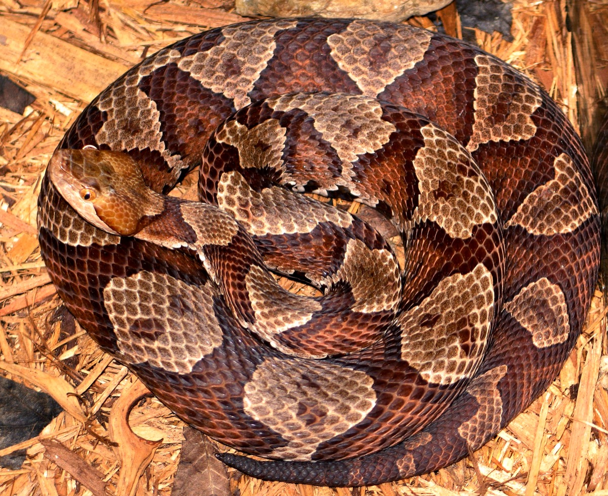
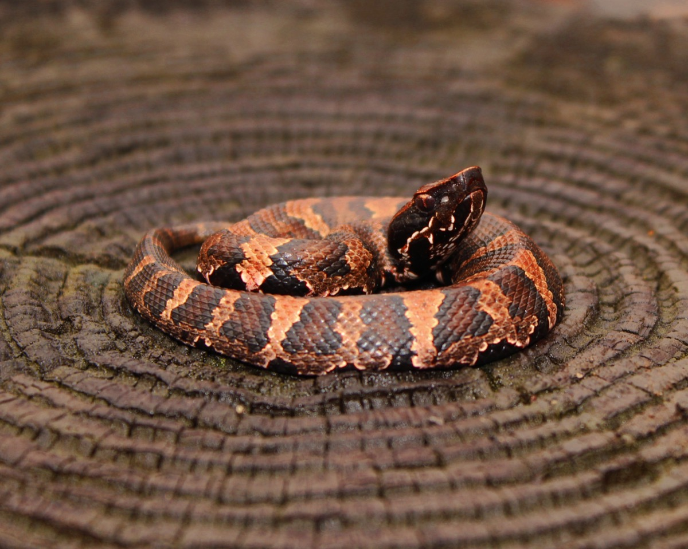
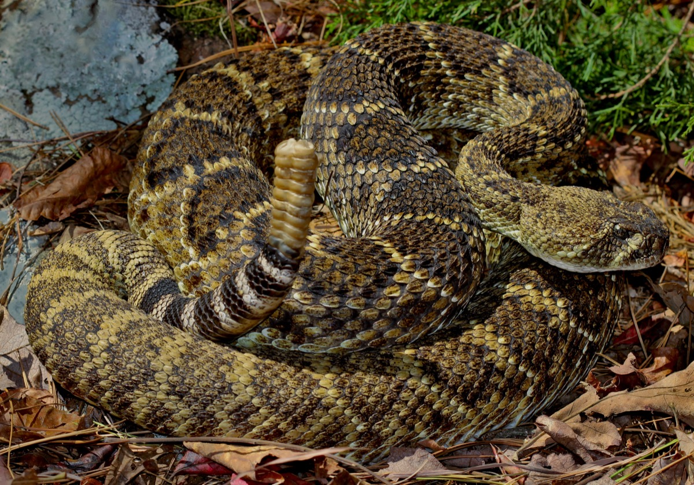
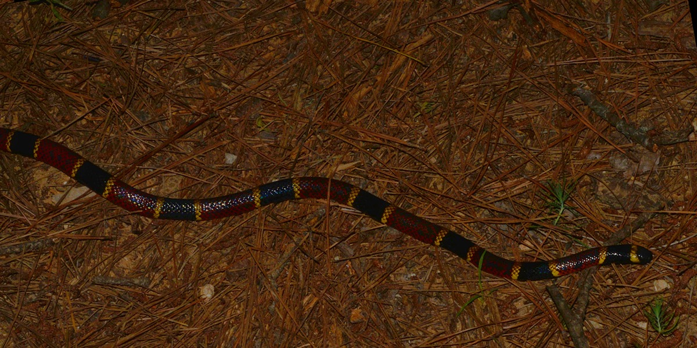
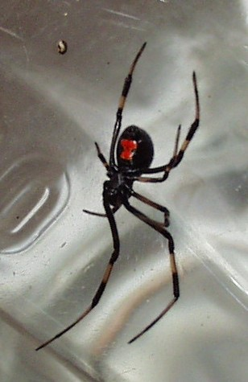
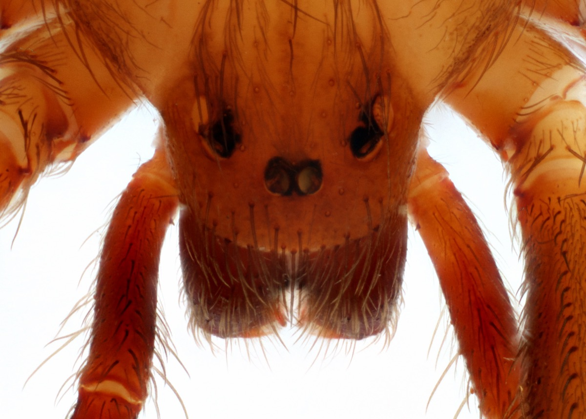
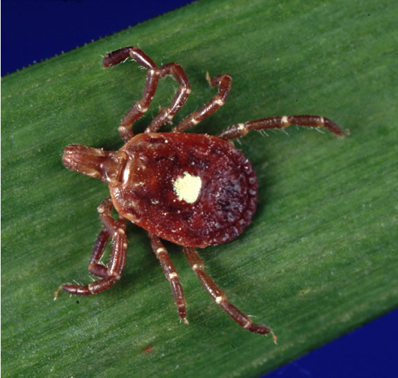
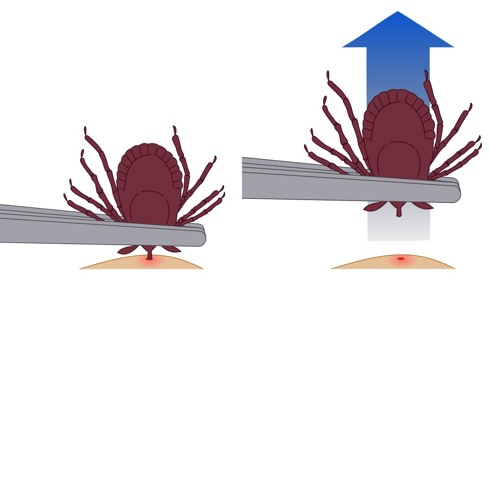
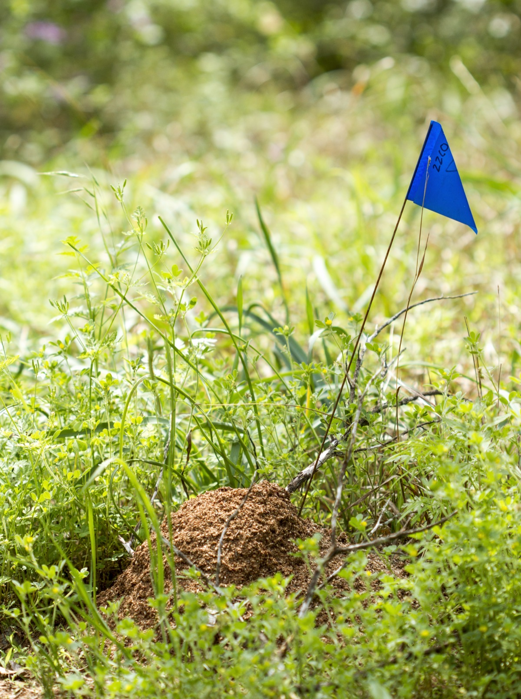

# Animal, Insect & Pest Hazards — Identification, Prevention, and First Response

## Read this first (the 30-second version)
1. **Avoidance beats treatment every time.** Watch where you put your hands and feet, wear boots in tall grass, check yourself for ticks daily, and never try to handle, move, or kill a venomous snake — most bites happen during that exact mistake.
2. **Snakebite (venomous):** move away from the snake, **keep the person calm and as still as possible**, remove rings/watches/tight clothing near the bite before it swells, splint the limb loosely to limit movement, and get to real medical care (antivenom) as fast as safely possible. **Do NOT cut the wound, suck out venom, apply a tourniquet, or use ice.**
3. **Any bite from a wild mammal or bat, or an unvaccinated/unknown dog:** wash the wound with soap and running water for a full **15 minutes** — this single step cuts rabies risk dramatically — then get medical care urgently. Rabies is virtually always fatal once symptoms start, but is preventable if treated **before** that happens.
4. **Tick found on skin:** grasp it with fine-tipped tweezers as close to the skin as possible and pull straight out with steady, even pressure. Don't twist, burn, or smother it. Watch the bite site and your health for 2–4 weeks afterward.
5. **Fire ant mound or swarm:** brush ants off immediately rather than standing still — they all sting at once when disturbed. Never stand on or dig into a mound.
6. **For actual treatment of anaphylaxis, severe allergic reaction, or deep wound care, see [First Aid](../first-aid/first-aid.md)** — this guide covers identification, prevention, and the immediate field response; it does not replace that guide's life-threatening-emergency protocols.

---

## Why this matters
North Texas mixes suburban yards, cattle pasture, cedar brush, creeks, and stock ponds — all prime habitat for venomous snakes, stinging insects, ticks, and disease-carrying pests, often within a few hundred feet of a house. Most animal and insect injuries here are preventable: people get bitten reaching into a woodpile without looking, walking barefoot near a pond at dusk, or trying to move a snake instead of walking around it. In a power-outage or disaster situation the risk goes up further — more time outdoors, more time in the dark, more time near standing water and disturbed ground, and slower access to a hospital if something serious happens. Knowing what's actually dangerous (a small list), what only looks dangerous (a much longer list), and exactly what to do and NOT do in the first few minutes after a bite or sting is what keeps a scary encounter from becoming a medical emergency — or keeps a genuine emergency from being made worse by outdated folk remedies that still circulate widely (cutting a snakebite, sucking out venom, or tying off a limb are all things that hurt more than they help, and this guide explains why).

## Key terms (plain language)
- **Venomous** — an animal that injects a toxin through a bite or sting (snakes, spiders, some insects). Different from **poisonous**, which means harmful if eaten or touched (some plants/toads).
- **Pit viper** — the group of venomous snakes with a heat-sensing pit between the eye and nostril, a triangular head, and elliptical (cat-like) pupils: copperheads, cottonmouths, and rattlesnakes are all pit vipers.
- **Elapid** — the snake family that includes coral snakes; fixed, shorter fangs and a neurotoxic (nerve-affecting) venom, different from a pit viper's tissue-damaging (hemotoxic) venom.
- **Hemotoxic venom** — damages blood, blood vessels, and tissue near the bite (pit vipers). Causes swelling, bruising, and local tissue damage.
- **Neurotoxic venom** — affects the nervous system; can impair breathing or muscle control (coral snakes, and some spider venoms).
- **Antivenom** — the actual medical treatment for a venomous bite; a lab-made antibody product given in a hospital. **Nothing you do in the field cures a venomous bite — first aid only buys time to reach antivenom.**
- **Vector** — an animal or insect that carries and transmits disease between hosts (ticks, mosquitoes, rodents, and fleas are the main vectors covered here).
- **Zoonotic disease** — a disease that spreads from animals to humans (rabies, tick-borne illnesses, hantavirus, West Nile virus are all zoonotic).
- **Exclusion** — sealing up a structure so pests (rodents, insects) physically cannot get in, as opposed to poisoning or trapping them after they're already inside.
- **PEP (post-exposure prophylaxis)** — a course of medical treatment (shots) given after a possible exposure to rabies, before symptoms appear, that prevents the disease from ever developing.

---

# At-a-glance: venomous species of North Texas / Texas

| Species | Type / venom | Key ID marks | Typical habitat here | Danger level |
|---|---|---|---|---|
| **Copperhead** | Pit viper (hemotoxic) | Copper-tan body, dark **hourglass / "Hershey-kiss"** crossbands (narrow at spine, wide at belly) | Leaf litter, woodpiles, suburban gardens, creek/pond edges — the **most commonly encountered** venomous snake around homes here | Very painful, significant local swelling/tissue damage; **rarely fatal** to a healthy adult |
| **Cottonmouth / water moccasin** | Pit viper (hemotoxic) | Thick, dark, heavy-bodied; opens mouth wide showing **white/cottony interior** as a warning; juveniles have a yellow-tipped tail | In or at the edge of water — ponds, creeks, stock tanks | More dangerous than copperhead; can be **life-threatening**, especially to children/elderly |
| **Western diamondback rattlesnake** | Pit viper (hemotoxic) | Diamond-shaped blotches down the back, black-and-white banded tail ending in a **rattle**; gives an audible buzz but not always | Open pasture, brush/rock piles, around barns and fence lines | Serious; the largest venom dose of the local pit vipers, potentially fatal without treatment |
| **Texas coral snake** | Elapid (neurotoxic) | **Red, yellow, and black bands, red touching yellow**; round pupils; small head not distinct from neck | Wooded areas with leaf litter, under debris; less common on open blackland prairie than the pit vipers | Bites are rare (small mouth, must chew to inject) but **medically serious** — can affect breathing |
| **Black widow (spider)** | Neurotoxic | Shiny black body, **red hourglass** on the underside of the abdomen (females only; males don't bite) | Woodpiles, sheds, meter boxes, under outdoor furniture, in outhouses/latrines | Painful, whole-body muscle cramping; **rarely fatal** to a healthy adult |
| **Brown recluse (spider)** | Cytotoxic | Tan to dark brown, **violin/fiddle-shaped mark** on the back, six eyes in three pairs (most spiders have eight) | Closets, attics, garages, boxes, woodpiles, **inside stored shoes and gloves** | Usually minor; occasionally a slow-healing, spreading wound |

> ⚠️ **Non-venomous lookalikes cause a lot of unnecessary panic and unnecessary snake-killing.** Texas rat snakes and bullsnakes/gopher snakes are harmless but will vibrate their tail in dry leaves to mimic a rattlesnake. Milk snakes and scarlet kingsnakes resemble the coral snake but have **red touching black**, not yellow. The old rhyme still works here: *"Red touches yellow, kill a fellow; red touches black, friend of Jack."* When in doubt, treat it as venomous and simply leave it alone — you don't need to identify a snake correctly to stay safe from it; you just need distance.

Texas is home to around 15 venomous snake species/subspecies total (per Texas Parks & Wildlife Department, *Venomous Snakes of Texas*, PWD BR W7000-0693), but only the four groups above are realistically encountered in North Texas/Collin County. Elsewhere in the state you may also hear of the **timber rattlesnake** (far East Texas piney woods), **prairie rattlesnake** (Panhandle/West Texas), **desert massasauga** (a small rattlesnake of the western Rolling Plains), and **Mojave/rock/pygmy rattlesnakes** (South and West Texas) — none are common on the North Texas blackland prairie, but the same avoidance and first-aid rules apply to all of them.

---

# PART 1 — VENOMOUS SNAKES

## Identification and habitat (see table above for quick reference)
All four Texas venomous snake types share one universal safety rule: **you don't need to identify the species to stay safe — you need to keep your distance and watch where you step and reach.** Pit vipers (copperhead, cottonmouth, rattlesnake) share a triangular head noticeably wider than the neck, elliptical "cat-eye" pupils, and a heat-sensing pit between each eye and nostril — but these are identification details for later, not things to check while a snake is in front of you. The coral snake looks different (slim body, round pupils, small head) and is identified by its color bands, never by trying to get close.

**A closer look at each species (for after-the-fact identification only — never approach to check these features):**

- **Copperhead (*Agkistrodon contortrix*).** The North Texas population is usually the **broad-banded copperhead** subspecies (*A. c. laticinctus*), with wider, more evenly-spaced hourglass crossbands than the eastern/northern copperhead subspecies. Adults run 2–3 feet long. They rely on camouflage rather than fleeing, which is exactly why most bites happen when someone steps near or reaches toward one without seeing it — they often do not rattle, hiss, or move a warning.

  
  *Figure — Copperhead, showing the tan-to-copper body and dark hourglass-shaped crossbands (narrow at the spine, wide at the belly) that are the key ID feature. This particular photo is the northern copperhead subspecies; North Texas copperheads are usually the broad-banded subspecies, which shows the same hourglass pattern with wider bands. Source: Wikimedia Commons (File:Agkistrodon contortrix mokasen CDC.png), Edward J. Wozniak D.V.M./CDC Public Health Image Library, public domain.*

- **Cottonmouth / water moccasin (*Agkistrodon piscivorus*).** Adults are thick-bodied and can exceed 3 feet; older individuals often look almost uniformly dark olive-to-black rather than showing distinct bands, which is a common source of misidentification (a plain dark snake near water is not automatically a cottonmouth — but treat it as one until proven otherwise). Unlike most water snakes, a cottonmouth typically holds its head at an angle when swimming with more of its body visible above the surface, and it will often stand its ground and open its mouth wide (showing the white/"cottony" interior) as a warning display rather than fleeing.

  
  *Figure — Western cottonmouth; this individual is a slender, distinctly banded younger/subadult snake rather than the thick, near-uniformly dark body typical of older adults — species ID is still correct. Source: Wikimedia Commons (File:Western Cottonmouth (Agkistrodon piscivorus leucostoma) (16199882414).jpg), Peter Paplanus, CC BY 2.0.*

- **Western diamondback rattlesnake (*Crotalus atrox*).** The largest venomous snake regularly found in North Texas, with adults commonly 3–5 feet (occasionally longer). Confirm ID (from a safe distance) by the black-and-white "coon-tail" bands directly in front of the rattle — no other North Texas snake has this tail pattern. A rattlesnake **may or may not rattle before striking** — don't rely on hearing a warning.

  
  *Figure — Western diamondback rattlesnake, showing the diamond-blotched back pattern and the black-and-white banded tail just above the rattle. Source: Wikimedia Commons (File:Western Diamondback Rattlesnake (Crotalus atrox).jpg), Peter Paplanus, CC BY 2.0.*

- **Texas coral snake (*Micrurus tener*).** Slim-bodied, rarely over 2.5 feet, with a small, blunt, black head not visibly distinct from the neck (unlike the pit vipers' wide triangular head). It has round pupils and smooth, shiny scales. Coral snakes have small, fixed fangs at the front of the mouth and a mostly-closed jaw compared to a pit viper's wide gape, so a bite usually involves the snake holding on and chewing briefly rather than a quick strike — which is part of why bites are uncommon (it has to get a grip on skin, typically a finger or toe) but also means a real bite has usually delivered venom.

  
  *Figure — Texas coral snake, showing the red-yellow-black banding with red touching yellow, the ID feature that distinguishes it from harmless mimics. Source: Wikimedia Commons (File:Texas Coral Snake (Micrurus tener) photographed in Houston Co., Texas. W. L. Farr.jpg), W. L. Farr, CC BY-SA 4.0.*

## Avoidance (the highest-value section in this guide)
Most snakebites happen when a person tries to move, kill, handle, or get a closer look at a snake — not from snakes randomly attacking people. Prevention is almost entirely about **not creating that moment**:
1. **Wear boots** (leather, at least ankle-high) and consider **snake gaiters** or snake boots when walking pasture, brush, tall grass, or pond edges. Bare feet, sandals, and shorts in snake habitat multiply your risk.
2. **Watch your foot placement.** Don't step over a log or rock without looking on the far side first; step ON large obstacles, not blindly over them, so you can see what's on the other side before your foot lands.
3. **Never put a hand where you can't see** — into brush piles, hollow logs, dense ground cover, or under a structure, rock, or board. Use a long stick to probe tall grass or leaf litter ahead of you instead.
4. **Check before you reach** around woodpiles, barns, sheds, and stacked materials — these are prime resting spots, especially for copperheads.
5. **Be extra alert at dawn and dusk in warm months**, when snakes are most active, and near water at those times (cottonmouths hunt actively then).
6. **If you see a snake, stop, back away slowly, and go around it.** Give it a wide berth (several feet minimum) and let it leave on its own. It is not defending territory the way a mammal might — it wants distance from you as much as you want distance from it.
7. **Never try to kill, move, capture, or photograph-up-close a snake you can't positively identify as harmless.** A large share of real-world snakebites happen on the hand or arm of someone doing exactly this. A dead snake's bite reflex can also still fire for a period after death — leave it alone entirely.
8. Keep grass mowed short and woodpiles/debris away from the house and walking paths; this removes cover snakes and their prey (rodents) both use.

## Correct snakebite first response — what TO do
1. **Move the person away from the snake** so it cannot strike again; do not chase, catch, or kill it to identify it later — a phone photo from a safe distance is enough if it's easy and safe, but never delay care to get one.
2. **Keep the person calm and as still as possible.** Movement and a racing heart speed venom circulation through the lymphatic system — carry the person if you can rather than letting them walk or run.
3. **Remove rings, watches, and tight clothing or shoes** near and below the bite **before** swelling starts — swelling can progress quickly and make removal painful or impossible later.
4. **Splint the bitten limb loosely** (as you would a fracture — see [First Aid](../first-aid/first-aid.md) for splinting technique) to reduce movement, and keep it at or slightly below heart level.
5. **Note the time of the bite** and, if safely observed, the snake's color and pattern (not by chasing or handling it).
6. **Get to real medical care as fast as safely possible.** Antivenom is the actual treatment — first aid only buys time. Call ahead if you can so a hospital can prepare.
7. Treat **every** venomous snakebite, and any bite you cannot confidently rule out as venomous, as a medical emergency requiring evaluation — this includes copperhead bites, which are rarely fatal but still need real assessment for tissue damage and pain control.
8. **Mark the leading edge of any swelling or tenderness directly on the skin with a pen, and write the time next to it.** Repeat every 15–20 minutes if you're waiting on transport. This gives medical staff (and you) an objective way to see whether swelling is spreading and how fast — useful information even if you never touch it again after arriving at care (OSHA/CDC field-response guidance).

**Dry bites and antivenom — what to expect at the hospital:** Roughly 20–25% of pit viper bites are "dry" (no venom injected, or very little), but **you cannot tell a dry bite from an envenomated one in the field** — swelling and pain can take time to develop, so every bite still needs the same urgent response and evaluation. If venom was injected, the treatment is antivenom, an intravenous antibody product — **CroFab** (Crotalidae Polyvalent Immune Fab) is FDA-approved for copperhead, cottonmouth, and rattlesnake bites and is stocked at most Texas hospitals with snakebite experience; **Anavip** is a newer option approved for rattlesnake bites specifically. Coral snake envenomation is treated with a separate antivenom (North American Coral Snake Antivenin) that is in much shorter, less reliable supply nationally — one more reason a suspected coral snake bite should go to a hospital as fast as possible, since transfer to a facility that stocks it can take time.

## What NOT to do (rejects outdated, dangerous advice)
> ⚠️ **Do NOT cut the wound.** Cutting does not remove venom — it adds a wound, risks cutting a nerve/tendon/vessel, and adds infection risk.
> ⚠️ **Do NOT try to suck out venom**, by mouth or with a suction device. This does not meaningfully remove venom (studies show it removes almost none) and adds infection risk, including to the rescuer's mouth.
> ⚠️ **Do NOT apply a tourniquet, and do NOT apply ice.** A tourniquet cuts off blood flow to the whole limb and can cause it to be lost even when the bite itself would not have been fatal. Ice does not slow venom and adds cold-injury risk.
> ⚠️ **Do NOT give the person alcohol or caffeine**, and do not let them exert themselves (no running, no self-walking to the car if you can carry or drive them instead).
> ⚠️ **Do NOT wait to "see if it's serious" before seeking care.** Even a copperhead bite (the mildest local species) warrants medical evaluation; cottonmouth, rattlesnake, and coral snake bites can escalate and need care immediately.

For the full life-threatening-emergency treatment sequence (shock, airway, when to call for evacuation) see [First Aid](../first-aid/first-aid.md).

---

# PART 2 — VENOMOUS SPIDERS

## Black widow
**ID:** Shiny black body about the size of a large pea to a marble, with a distinctive **red or orange hourglass mark on the underside** of the rounded abdomen. Only females bite (males are smaller, harmless, and rarely encountered). Webs are messy, irregular, and built low to the ground in dark, undisturbed places. The **southern black widow** (*Latrodectus mactans*) is the species most common in Texas.

*Figure — Female black widow viewed from below, showing the red hourglass marking on the underside of the abdomen — the single most reliable ID feature. You will not usually get (or want) this exact view of a live spider; treat any shiny black spider of this size and shape as a possible black widow and give it distance instead of trying to check the underside. Source: Wikimedia Commons (File:LatrodectusMactansVentral34.JPG), Patrick Edwin Moran, CC BY 2.0.*

**Where found:** Woodpiles, sheds, garages, crawl spaces, meter boxes, under outdoor furniture, inside gloves left outside, and — relevant to disaster settings — inside outhouses/latrines and stacked firewood.
**Bite signs:** A sharp pinprick at the bite, followed within 30–60 minutes by spreading muscle cramping and rigidity (often the abdomen or back), sweating, nausea, and sometimes elevated blood pressure. Symptoms typically peak within a few hours and can last 1–3 days.
**Response:** Wash the bite with soap and water, apply a cold compress for pain, and seek medical care — especially for children, the elderly, pregnant women, or anyone with underlying heart or breathing conditions, since symptoms can become severe. **Antivenom exists (Latrodectus antivenin) and works quickly (often within 30–90 minutes) but is generally reserved for severe cases** because it carries its own allergic-reaction risk; most people are instead managed with pain medication and muscle relaxants and recover fully within a few days without it.

## Brown recluse
**ID:** Light tan to dark brown, roughly quarter-sized including legs, with a **dark violin/fiddle-shaped marking** on the top of the front body segment (the "neck" of the violin points toward the abdomen). Has **six eyes arranged in three pairs**, versus eight eyes on most spiders — a useful confirming detail if you can get a very close, safe look at a dead specimen, but never worth risking a second bite to check. North Texas is within the brown recluse's normal established range (unlike much of the rest of the country), so a suspected sighting here is plausible and shouldn't be dismissed.

*Figure — Brown recluse, close cropped on the eyes: this angle shows the **six eyes arranged in three pairs (dyads)** — one pair front-center and one pair angled back on each side — the most reliable confirming ID feature for this species (most spiders have eight eyes). The violin/fiddle-shaped marking is on the front body segment further back and isn't visible in this tight crop. Source: Wikimedia Commons (File:Dorsal view of Loxosceles reclusa (Brown Recluse Spider) (22235181003).jpg), Insects Unlocked / University of Texas at Austin, CC0 1.0 (public domain).*

**Where found:** Dark, dry, undisturbed indoor and outdoor spaces — closets, attics, garages, cardboard boxes, woodpiles, under bark, and notoriously **inside shoes, boots, and gloves left out or stored** for a while. **Shake out and check footwear and gloves before putting them on**, especially after they've sat in a shed, garage, or tent.
**Bite signs:** Often painless at first — many people don't feel the bite happen. Over 6–12+ hours it can become red, swollen, and painful; a minority of bites progress to a slow-healing open sore (necrotic wound) over several days. **Most suspected "recluse bites" reported by the public are actually something else** (another insect, a skin infection, even MRSA) — there is no field or over-the-counter test to confirm a recluse bite, so diagnosis is based on symptoms and known exposure (e.g., a bite while reaching into a stored boot). A true necrotic reaction is uncommon, but any bite that keeps getting worse rather than better deserves medical attention.
**Response:** Clean the bite, apply a cold compress, elevate if on a limb, and monitor. Seek medical care if the wound expands significantly, forms a dark center or blister, or is accompanied by fever, chills, or a rash — these can signal a more serious reaction needing professional wound care. There is no antivenom for brown recluse bites in the US; treatment is supportive (pain control, wound care, and surgical debridement only in the minority of cases where tissue death is significant).

## When any spider bite needs urgent care
Seek medical help for a spider bite if you see: spreading muscle rigidity or severe cramping (widow), a wound that keeps expanding or turns dark/necrotic over days (recluse), fever, difficulty breathing, or any bite in a young child, elderly person, or pregnant woman where the spider type is unknown. See [First Aid](../first-aid/first-aid.md) for anaphylaxis and general wound-care treatment.

---

# PART 3 — TICKS

## Common Texas species and what they carry
- **Lone star tick** — the most commonly encountered tick in North Texas; aggressive (will actively seek you out rather than waiting), females have a single white dot on their back. Carries **ehrlichiosis**, **STARI** (a Lyme-like rash illness), and repeated bites are linked to developing **alpha-gal syndrome** (an allergy to red meat).

  
  *Figure — Adult female lone star tick, showing the single white "star" spot on the back that gives the species its name — the most useful quick ID feature for this, the most commonly encountered tick in North Texas. Source: Wikimedia Commons (File:Amblyomma americanum tick.jpg), James Gathany, CDC/Michael L. Levin Ph.D., public domain.*

- **American dog tick** — carries **Rocky Mountain spotted fever** (a serious, treatable-if-caught-early illness) and tularemia.
- **Blacklegged (deer) tick** — present in Texas; can carry **Lyme disease**, though confirmed Lyme risk is much lower here than in the northeastern US.
- **Brown dog tick** — often found around dog kennels and homes with dogs; can also transmit Rocky Mountain spotted fever.

**Attachment time matters:** in general, the longer a tick stays attached, the higher the disease risk — Lyme transmission usually needs a tick attached roughly 36–48 hours, while diseases like ehrlichiosis and Rocky Mountain spotted fever can transmit somewhat faster. This is exactly why prompt removal and daily checks (below) matter more than trying to identify the species in the moment.

## Safe removal
1. Use **fine-tipped tweezers** (not fingers, not a match, not petroleum jelly, nail polish, or other folk methods — these can cause the tick to inject more saliva/pathogens rather than release).
2. Grasp the tick **as close to the skin's surface as possible**, gripping the mouthparts, not the swollen body.
3. **Pull straight upward with steady, even pressure.** Do not twist or jerk — this can leave mouthparts embedded (annoying but not dangerous by itself; leave a stuck fragment alone and let the skin heal rather than digging for it).

   
   *Figure — Correct technique: grasp the tick close to the skin with fine-tipped tweezers and pull straight up and away with steady, even pressure — do not twist, jerk, squeeze the body, or use heat/petroleum jelly/nail polish to try to make it detach. Source: Wikimedia Commons (File:Tickremoval.svg), Doc James (original) / Pixelsquid (SVG), derived from a CDC image, public domain.*

4. Clean the bite site and your hands thoroughly with soap and water, rubbing alcohol, or hand sanitizer afterward.
5. **Dispose of a live tick** by placing it in a sealed container or bag, wrapping it tightly in tape, submerging it in rubbing alcohol, or flushing it down a toilet — do not crush it between your fingers.
6. If practical, save the tick in a sealed bag or taped to a card with the date instead of disposing of it immediately — useful for your own reference (or a provider's) if illness develops in the following weeks. (Commercial tick-testing services exist but the CDC does not recommend using their results to decide whether to seek treatment — symptoms and known exposure should guide that decision, not a lab result that can take days to come back.)

## Watch for illness after a bite
Fever, headache, fatigue, muscle/joint aches, or a rash appearing days to a few weeks after a tick bite are reasons to see a medical provider and **mention the tick exposure** — tick-borne illnesses respond well to prompt treatment but can worsen if missed. A classic bullseye rash is the hallmark of Lyme disease but is uncommon in Texas; a rash of any spreading, unusual kind after a tick bite still warrants attention.

## Prevention
- **Check your whole body daily** after time outdoors in grass, brush, or woods — ticks favor the scalp, behind the ears, armpits, waistband, groin, and behind the knees.
- **Shower within 2 hours of coming indoors.** CDC-cited research found this cuts Lyme disease risk significantly (as much as roughly half in some studies) and helps with other tickborne diseases too — it washes off unattached ticks and makes attached ones much easier to spot and remove promptly. Routine body checks alone (even without showering) were also shown to meaningfully cut risk, so do both.
- **Tuck pants into boots/socks** and wear light-colored clothing so ticks are easier to see.
- **Treat clothing and gear with permethrin**, and use an EPA-registered repellent (DEET, picaridin) on exposed skin — see [Clothing, Footwear & Personal Protection](../clothing-footwear-protection/clothing-footwear-protection.md) for products and application details; this guide only covers the tick/disease side.
- Keep grass mowed short around the house and create a gravel or wood-chip barrier between lawn and any adjacent brush/woods — ticks don't cross dry, open ground readily.
- Check pets for ticks regularly; they can carry ticks indoors and are also at risk of tick-borne disease themselves.

---

# PART 4 — FIRE ANTS

**ID:** Small (⅛–¼ inch), reddish-brown ants that build **dome-shaped mounds with no obvious single entrance hole** (unlike most native ant mounds), typically after rain in open, sunny ground — lawns, pastures, roadsides, and disturbed soil are all common sites. When a mound is disturbed, fire ants swarm rapidly and **sting in large numbers simultaneously**, rather than one at a time.

*Figure — A red imported fire ant mound, the dome-shaped, no-single-entrance style of mound typical of this species (as opposed to a single visible hole most native ants use) — the main visual cue to watch for and avoid stepping on or disturbing. Source: Wikimedia Commons (File:Fire ant mound (16371103174).jpg), Alex Wild / Insects Unlocked, University of Texas at Austin, CC0 1.0 (public domain).*

**Sting reaction:** Immediate burning pain, followed within about a day by a characteristic small **white pustule (blister)** at each sting site — this pustule is fairly diagnostic of a fire ant sting versus other insects. Multiple stings in a cluster (a "footprint" pattern) are typical since a disturbed colony attacks as a group.

**Allergic reaction:** Most people have only local pain and pustules. A small percentage of people can have a serious systemic or anaphylactic reaction (hives beyond the sting sites, swelling of the face/throat, difficulty breathing, dizziness) — treat this as a medical emergency exactly like any other anaphylaxis; see [First Aid](../first-aid/first-aid.md).

**Prevention:**
- Watch the ground for mounds, especially in grass, and never stand on, kick, or dig into one.
- Keep shoes on outdoors and **shake out boots/shoes left outside** before putting them on.
- Be cautious sitting, kneeling, or laying gear directly on the ground in grassy areas.
- Treat known mounds around your home/yard with boiling water (a low-cost, poison-free option — pour slowly and directly into the mound, ideally in cool morning hours) or a commercial fire ant bait/pesticide labeled for the purpose.
- **The "Texas Two-Step" method (Texas A&M AgriLife's recommended approach for a whole yard/property):**
  1. **Step one — broadcast bait**, twice a year (spring and fall are best, as ants are actively foraging to feed new brood): spread a labeled fire ant bait (pesticide-coated corn grit with soybean oil) over the entire lawn/property with a hand-crank or push spreader, not just on visible mounds — foraging worker ants carry the bait back to the colony, including the queen, which kicks the whole colony's decline off over the following 1–2 weeks.
  2. **Step two — treat individual problem mounds** directly (drench, granule, or dust insecticide labeled for fire ants) in high-traffic areas like near doors, play areas, or garden beds where you can't wait for the broadcast bait to work or want faster local control.
  - This two-step approach is less labor-intensive and lower in total pesticide use than trying to treat every mound individually, and is the standard AgriLife Extension recommendation for Texas properties.

**First response to a swarm:** Brush ants off immediately and move away from the mound rather than standing still trying to pick them off one at a time — they will keep stinging. Once clear, wash sting sites with soap and water, apply a cold compress for pain and swelling, and **do not pop the pustules** — this risks infection. Watch for spreading redness, warmth, or fever over the following days as signs of secondary infection, and for any signs of the systemic allergic reaction described above.

---

# PART 5 — MOSQUITOES

**Disease risk in this region:** **West Nile virus** is the most relevant local risk — Collin, Dallas, and Denton counties see confirmed cases most summers, especially late summer when mosquito populations peak. Texas mosquitoes can also carry other viruses (dengue, chikungunya, Zika) at lower but nonzero risk, mainly from the *Aedes* mosquitoes that bite during the day.

**Source reduction (the single most effective control):** Mosquitoes need standing water to breed, and it only takes about a week for eggs to become biting adults.
- **"Tip and toss" weekly**: empty anything holding standing water — flowerpot saucers, buckets, old tires, clogged gutters, tarps, kiddie pools, pet water bowls (refresh instead of dump-and-refill on a schedule).
- **Refresh bird baths every few days.**
- For water you can't empty (stock ponds, livestock troughs, rain barrels), use **mosquito dunks** (a *Bti* biological larvicide) — safe for people, pets, and livestock, and effective for weeks per dunk.
- Screen rain barrels and any large open water storage.

**Personal protection:** EPA-registered repellent (DEET, picaridin, or oil of lemon eucalyptus) on exposed skin, long sleeves and pants especially at **dawn and dusk** when mosquitoes are most active, intact window/door screens, and a bed net if screens fail during an extended power outage. See [Clothing, Footwear & Personal Protection](../clothing-footwear-protection/clothing-footwear-protection.md) for repellent and permethrin-treated-clothing details.

---

# PART 6 — RODENTS

**Species:** House mice and rats (Norway rat, roof rat) are common around North Texas homes, barns, and outbuildings, and numbers increase quickly whenever food or garbage becomes accessible — which is exactly what tends to happen during a prolonged power outage or disaster.

**Disease risk:** Rodents can carry **hantavirus** (from breathing in dust contaminated by droppings/urine — rare in Texas but present, notably via deer mice), **leptospirosis** (from water or food contaminated with urine), **salmonella** (droppings contaminating food or surfaces), and rat-bite fever from an actual bite. Fleas carried by rodents are the historical vector for plague, which is extremely rare in Texas today but not zero.

**Exclusion (better than trapping after the fact):**
- Seal gaps in your home's exterior — mice can squeeze through openings as small as a pencil's width (about ¼–⅜ inch); rats need only a bit more.
- Pack steel wool or hardware cloth into gaps around pipes, vents, and foundations — rodents can't chew through metal mesh the way they can through caulk alone.
- Keep garbage in sealed, lidded containers and don't let it accumulate.
- Snap traps are an effective, low-cost control method for an active indoor infestation; check and reset regularly.

**Cleaning up droppings safely:** Do **not** sweep or vacuum dry rodent droppings or nesting material — this can aerosolize hantavirus particles into the air you breathe. Instead: ventilate the area, spray droppings/nests with a bleach solution or household disinfectant, let it sit 5–10 minutes, then wipe up with disposable paper towels while wearing gloves (and a mask if the area is heavily contaminated). Dispose of the towels in sealed garbage and wash your hands thoroughly afterward.

**Protecting your food stores:**
- Store food in **hard-sided, sealed containers** — metal or thick food-grade plastic totes/buckets with gasket lids, not cardboard, paper, or thin bags, which rodents chew through easily.
- Elevate stored food off the floor where possible.
- Check stored food periodically for gnaw marks or droppings and discard anything compromised.
- Keep the storage area itself clear of loose trash and food scraps, which attract rodents in the first place.
- See [Supplies, Inventory & Rotation](../supplies-inventory-rotation/supplies-inventory-rotation.md) for full stockpile container and rotation guidance, and [Sanitation & Hygiene](../sanitation-hygiene/sanitation-hygiene.md) for general garbage/pest control that keeps rodents from being drawn to your living area at all.

---

# PART 7 — GENERAL BITES AND STINGS: IMMEDIATE FIELD RESPONSE

For any bite or sting not covered by a specific section above (bees, wasps, ants other than fire ants, unfamiliar insects):
1. **Move away** from the source so you or others aren't bitten/stung again.
2. **Remove a stinger** if visible (a bee leaves its stinger behind; scrape it out sideways with a fingernail or card rather than pinching, though speed of removal matters more than the exact method).
3. **Wash the site** with soap and water.
4. **Apply a cold compress** to reduce pain and swelling.
5. **Watch for infection** over the following days: spreading redness, warmth, increasing pain, pus, or fever.
6. **Watch for allergic reaction/anaphylaxis** — facial or throat swelling, hives spreading beyond the sting site, difficulty breathing, dizziness. This is a medical emergency; go straight to [First Aid](../first-aid/first-aid.md) for the epinephrine/anaphylaxis protocol. Do not wait to "see if it gets worse."
7. **Seek care** for: multiple stings at once, a sting inside the mouth/throat, a known severe allergy, or any bite from an animal you can't identify (see rabies section next).

This guide focuses on immediate field response and prevention; definitive medical treatment for stings, bites, and anaphylaxis is covered in [First Aid](../first-aid/first-aid.md) — read that guide's relevant sections in addition to this one.

---

# PART 8 — RABIES AWARENESS

**Which animals matter most:** In Texas, the primary rabies-carrying (vector) species are **bats, skunks, raccoons, and foxes**, along with unvaccinated dogs and cats and, less commonly, coyotes. **Rodents (mice, rats, squirrels) and rabbits almost never carry rabies** and bites from them are treated much less urgently — but any bite from a wild mammal, a bat, or a dog/cat of unknown vaccination status should be taken seriously.

> ⚠️ **Bats are a special case.** A bat's bite or scratch can be tiny enough not to leave a visible mark or wake a sleeping person. If you wake up to find a bat in a room where you (or a child, or someone unable to reliably report a bite) were sleeping, treat it as a possible exposure and seek medical guidance even without a visible wound.

**Warning signs in an animal:** unprovoked aggression, unusual tameness or approach behavior in a normally shy wild animal, stumbling or partial paralysis, difficulty swallowing or drooling/foaming at the mouth, and a nocturnal animal (like a skunk or raccoon) active and disoriented in broad daylight.

**What to do after any bite from a potentially rabid animal:**
1. **Wash the wound immediately and thoroughly with soap and running water for a full 15 minutes.** This single step is the most effective thing you can do in the field and meaningfully reduces the chance rabies takes hold, even before any medical treatment. If you have it, an antiseptic like povidone-iodine applied after washing is an additional precaution — but it does not replace the 15-minute wash, only adds to it.
2. Control any bleeding and cover the wound (see [First Aid](../first-aid/first-aid.md) for wound care).
3. **Get medical care as soon as possible** to start post-exposure prophylaxis (PEP) if indicated — a series of shots that is highly effective **only if started before symptoms appear**. Rabies is virtually always fatal once symptoms begin, which is exactly why speed matters here.
4. **What PEP actually involves (so it's less intimidating if you need it):** for someone never previously vaccinated against rabies, the CDC schedule is **human rabies immune globulin (HRIG)** given once, on day 0, with as much as possible injected directly around and into the wound itself (the rest given as a shot elsewhere), **plus a series of four rabies vaccine shots on days 0, 3, 7, and 14** in the arm (or thigh for young children) — not the old, widely-feared "20 shots in the stomach" regimen from decades past. If you were already vaccinated in advance (some veterinarians, wildlife workers, and travelers are), the regimen is shorter and HRIG usually isn't needed — tell the treating provider if this applies to you.
5. If the animal is a pet with a known, current vaccination record, tell the treating provider — it changes the urgency calculation. If it's a stray/owned **dog, cat, or ferret**, animal control or a health department can sometimes hold and observe it for **10 days** instead of starting shots immediately, since these species reliably show rabies symptoms within that window if infected (if it stays healthy the full 10 days, no PEP is needed); this 10-day observation option does **not** apply to wild animals, bats, or livestock, which generally cannot be safely observed this way and default to starting PEP.
6. **Do not try to catch or corner a wild animal yourself** to have it tested — report the encounter to local animal control or your county health department and let professionals handle capture.

---

# PART 9 — LARGER WILDLIFE ENCOUNTERS

**Stray or feral dogs / packs:** Abandoned or loose pets can form loose packs after a disaster disrupts normal households. Avoid direct eye contact and avoid running (both can trigger a chase response); stand still or back away slowly at an angle rather than turning your back; keep something (a bag, jacket, stick) between you and the dog if it closes in; protect your face and throat if knocked down; teach kids to "be a tree" (stand still, arms in, avoid eye contact) if approached.

**Coyotes:** Common even in suburban parts of North Texas; normally avoid people but can become bold if fed or if trash/pet food is easily available. If one approaches: **haze it** — make yourself look large, shout, wave your arms, throw something toward (not necessarily at) it. Never feed coyotes, keep pets attended and trash secured, and don't run (running can trigger a chase instinct).

**Feral hogs:** A large, expanding problem across rural Collin County and much of Texas. Feral hogs are usually shy but can become aggressive if cornered, wounded, or protecting piglets, and can move surprisingly fast. Give them a wide berth and an obvious escape route; if charged, get behind a solid barrier (vehicle, fence, sturdy tree) or up onto something elevated rather than trying to outrun or fight one in the open; never corner a group or get between a sow and her piglets.

**Livestock:** Rural properties here commonly have cattle, and bulls or protective mother cows can be dangerous. Respect fences and gates, don't cut through a pasture with livestock present unless you know the animals, and watch for defensive posturing (lowered head, pawing, staring) as a sign to leave the area calmly.

---

# North Texas / Anna, TX regional notes

- **Stock ponds are cottonmouth habitat.** Nearly every rural property near Anna has at least one pond — treat the water's edge, especially in warm months at dawn/dusk, with the same caution as any other cottonmouth habitat. See [North Texas Regional Guide](../regional-north-texas/regional-north-texas.md) for local water-source specifics.
- **Copperheads are the venomous snake most likely to actually be encountered here**, including in ordinary suburban yards, gardens, and woodpiles in towns like Anna, Melissa, and McKinney — not just "out in the country."
- **Western diamondback rattlesnakes** turn up in open pasture and around barns/fence lines on the rural edges of the county; the Texas coral snake is present in the state generally but less commonly encountered on open blackland prairie than in more wooded terrain.
- **Fire ants are essentially everywhere** in local lawns, pastures, and roadsides — check before you sit, kneel, or set gear down outdoors, and expect mounds to reappear quickly after rain.
- **Ticks and chiggers are heaviest in tall grass, cedar brush, and along trail edges from spring through fall** — daily body checks are worth the habit here specifically.
- **Mosquito-borne West Nile virus is monitored locally** (Collin, Dallas, and Denton counties report cases most summers); the flat, poorly draining clay soil here means standing water lingers longer after rain than in sandier soils, so source reduction matters more, not less.
- **Coyotes are established in and around suburban Anna/Melissa/McKinney**, and **feral hogs are an increasing rural nuisance/hazard** in outlying Collin County — both are manageable with the avoidance steps above.
- **Local rabies vector species** are primarily skunks, bats, and raccoons; treat any encounter with one of these acting strangely as a real risk, not a curiosity.
- For local edible/poisonous plant identification and other place-specific hazards (heat, flash floods, grassfires), see the [North Texas Regional Guide](../regional-north-texas/regional-north-texas.md) directly.

---

# ⚠️ Safety — the most important warnings
- **Never cut, suck, ice, or tourniquet a snakebite.** These are outdated and actively harmful; the only real treatment is antivenom, and first aid's job is only to buy time getting there.
- **Never try to catch, kill, or handle a snake to identify it.** This is how most bites happen. Distance is the only identification you need in the moment.
- **Shake out shoes, boots, and gloves** that have sat outside, in a shed, garage, or tent — this is the #1 way brown recluse and black widow bites happen on hands and feet.
- **Wash any wild-animal or bat bite for 15 full minutes with soap and water**, then get medical care urgently for rabies risk — this is time-critical, not optional, and cannot be undone if skipped and symptoms later appear.
- **Watch for anaphylaxis after any sting or bite** — facial/throat swelling or trouble breathing is a life-threatening emergency; go to [First Aid](../first-aid/first-aid.md) immediately.
- **Don't sweep or vacuum dry rodent droppings** — clean them wet with disinfectant to avoid inhaling hantavirus particles.
- **Standing water breeds mosquitoes within about a week** — empty or treat it weekly, don't wait for a problem to appear.
- **A fire ant mound disturbance means many simultaneous stings** — brush off and move, don't stand and pick ants off one at a time.

# Troubleshooting
| Problem | Fix |
|---|---|
| Bitten by a snake you couldn't identify | Treat as venomous: keep calm/still, remove rings/tight items, splint loosely, get to medical care immediately — do not wait to find out. |
| Swelling from a bite is making it hard to remove a ring/watch | Remove it the moment you notice any swelling starting — don't wait, it only gets harder and more painful. |
| Tick's mouthparts break off and stay in the skin during removal | Leave the small fragment alone; clean the area and let the skin heal — digging for it causes more damage than it prevents. |
| Suspected "brown recluse bite" that's just red and mildly sore | Most suspected recluse bites are something else; clean it, cold-compress it, and monitor — seek care only if it spreads, darkens, or you develop fever. |
| Woke up to a bat in the bedroom | Treat as a possible rabies exposure even with no visible bite; contact animal control and a medical provider. |
| Standing water can't be emptied (stock tank, rain barrel) | Use a mosquito dunk (*Bti*) — safe for people/pets/livestock, lasts weeks. |
| Mice getting into stored food despite a sealed room | Move food into hard-sided, gasket-lidded containers; check for and seal gaps as small as a pencil's width in walls/floors. |
| Fire ants swarming after disturbing a mound | Brush off immediately and move away rather than standing there; wash stings after, don't pop the pustules. |
| Coyote or stray dog approaching and not backing off | Make yourself look large, shout, wave arms/throw something toward it (coyote); for a dog, back away at an angle without running or turning your back. |

# Quick-reference checklist
- [ ] Wear boots (snake gaiters where relevant) and watch foot/hand placement in grass, brush, woodpiles, and pond edges.
- [ ] Never handle, move, or kill a snake — back away and give distance instead.
- [ ] Shake out shoes/boots/gloves left outside before wearing them (spiders).
- [ ] Do daily tick checks after time outdoors; remove any tick with fine-tipped tweezers, pulled straight out.
- [ ] Treat clothing with permethrin and skin with repellent — see [Clothing, Footwear & Personal Protection](../clothing-footwear-protection/clothing-footwear-protection.md).
- [ ] Empty or treat standing water weekly (mosquitoes) — "tip and toss," or mosquito dunks for water you can't empty.
- [ ] Seal gaps and store food in hard, sealed, elevated containers (rodents).
- [ ] Know the snakebite response cold: calm + still, remove rings, splint loosely, heart-level limb, get to antivenom — NO cut/suck/tourniquet/ice.
- [ ] Wash any wild-animal or bat bite for 15 minutes and get care urgently — rabies is preventable only before symptoms start.
- [ ] Watch every bite/sting for signs of anaphylaxis and go straight to [First Aid](../first-aid/first-aid.md) if it appears.

# Sources & further reading (in this knowledge base)
- **US Army Survival Manual FM 21-76** — `reference/manuals/fm21-76_survival_manual.pdf` (dangerous animals, first aid chapters).
- **First Aid and CPR manuals** — `reference/manuals/First_Aid_and_CPR_Manual.pdf`, `reference/manuals/firstaid_survival_cpr_pocketguide.pdf`, `reference/manuals/wilderness_remote_firstaid.pdf` (definitive bite/sting/anaphylaxis treatment).
- **Texas Parks & Wildlife Department, *Venomous Snakes of Texas*** — `reference/manuals/tpwd_venomous_snakes_texas.pdf` (PWD BR W7000-0693; official state ID and safety brochure for all Texas venomous snakes).
- **OSHA Quick Card — Rodents, Snakes and Insects, Spiders and Ticks** — `reference/manuals/osha_rodents_snakes_insects.pdf` (workplace field-response guidance for the same hazard groups this guide covers).
- **CDC** guidance on tick removal, tick-borne disease, rabies post-exposure prophylaxis, hantavirus, and West Nile virus (cdc.gov/ticks, cdc.gov/rabies — cited in prose; CDC's own snake/tick PDFs were not downloadable directly at time of writing, so they're cited by URL instead); **CDC/NIOSH** venomous snake workplace guidance (cdc.gov/niosh/outdoor-workers); **Texas A&M AgriLife Extension** fire ant (Texas Two-Step method) and feral hog management guidance (cited in prose; not included as local PDFs).
- **American Red Cross Preparedness Guide** — `reference/manuals/redcross_preparednessguide.pdf` (general emergency first aid framework).
- **Images** (`images/` folder), all from Wikimedia Commons, correctly licensed and species-verified on the file page before inclusion:
  - *copperhead.jpg* — File:Agkistrodon contortrix mokasen CDC.png, Edward J. Wozniak D.V.M./CDC Public Health Image Library, public domain.
  - *cottonmouth.jpg* — File:Western Cottonmouth (Agkistrodon piscivorus leucostoma) (16199882414).jpg, Peter Paplanus, CC BY 2.0.
  - *rattlesnake.jpg* — File:Western Diamondback Rattlesnake (Crotalus atrox).jpg, Peter Paplanus, CC BY 2.0.
  - *coral-snake.jpg* — File:Texas Coral Snake (Micrurus tener) photographed in Houston Co., Texas. W. L. Farr.jpg, W. L. Farr, CC BY-SA 4.0.
  - *black-widow.jpg* — File:LatrodectusMactansVentral34.JPG, Patrick Edwin Moran, CC BY 2.0.
  - *brown-recluse.jpg* — File:Dorsal view of Loxosceles reclusa (Brown Recluse Spider) (22235181003).jpg, Insects Unlocked/University of Texas at Austin, CC0 1.0 (public domain).
  - *fire-ant-mound.jpg* — File:Fire ant mound (16371103174).jpg, Alex Wild/Insects Unlocked, University of Texas at Austin, CC0 1.0 (public domain).
  - *lone-star-tick.jpg* — File:Amblyomma americanum tick.jpg, James Gathany, CDC/Michael L. Levin Ph.D., public domain.
  - *tick-removal-diagram.jpg* — File:Tickremoval.svg, Doc James (original)/Pixelsquid (SVG), derived from a CDC image, public domain.
- See also: [First Aid](../first-aid/first-aid.md) (definitive bite/sting/anaphylaxis treatment), [Clothing, Footwear & Personal Protection](../clothing-footwear-protection/clothing-footwear-protection.md) (permethrin/DEET, protective clothing), [North Texas Regional Guide](../regional-north-texas/regional-north-texas.md) (local species and terrain), [Supplies, Inventory & Rotation](../supplies-inventory-rotation/supplies-inventory-rotation.md) and [Sanitation & Hygiene](../sanitation-hygiene/sanitation-hygiene.md) (protecting food stores and general pest control).
