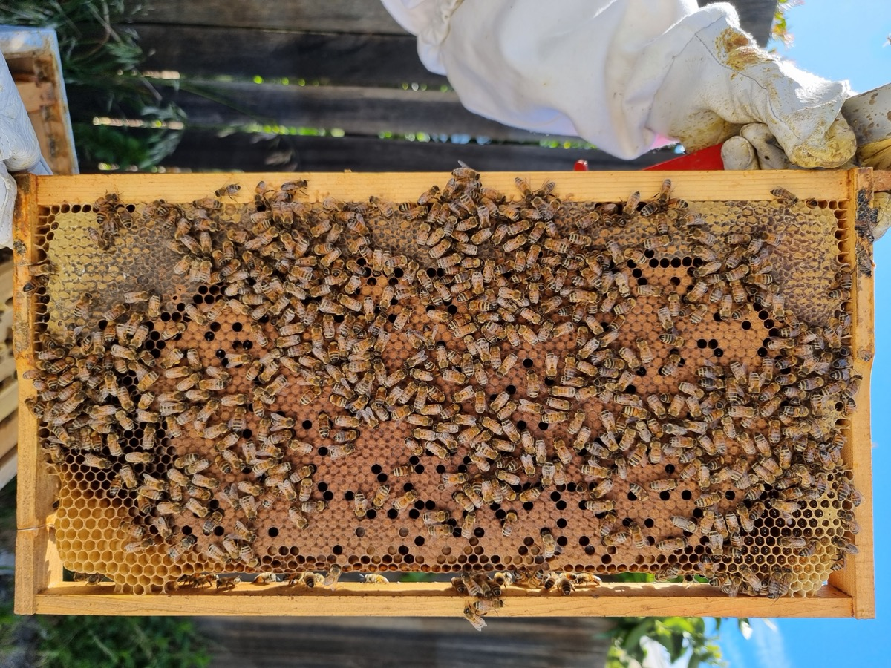
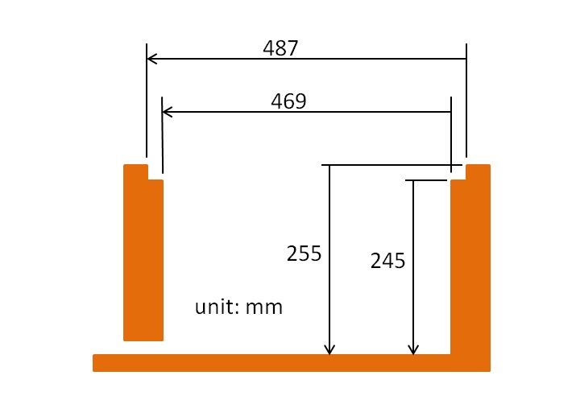
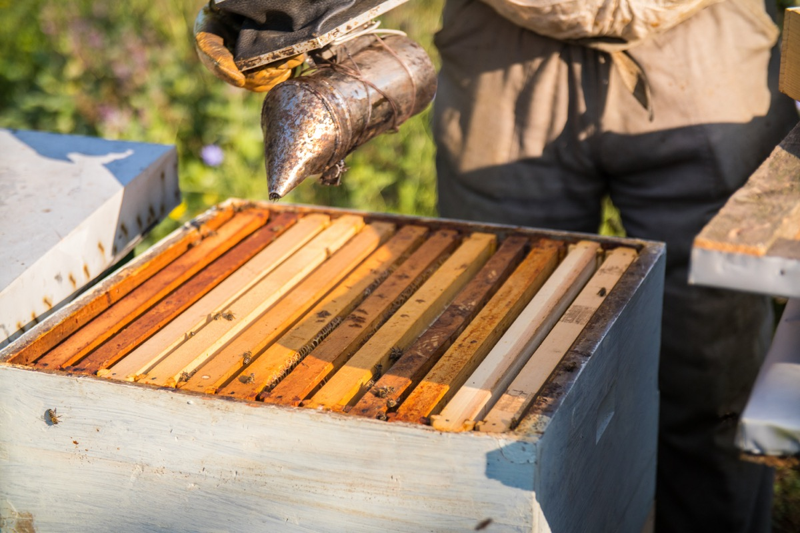

# Beekeeping — Honey, Beeswax & Pollination for the Homestead

## Read this first (the 30-second version)
1. **Bees are a long-term investment, not an emergency fix.** A brand-new hive usually needs a full year before it produces a real honey surplus — start now, before you need the honey, not during a crisis.
2. **Get bees from a package, a "nuc" (small starter colony), or a caught swarm** — a nuc is the easiest and most reliable for a true beginner.
3. **Learn to work a colony calmly with the right gear:** a veil, gloves, a smoker, and a hive tool. Smoke masks alarm pheromone and makes bees far less defensive — always have it lit and ready before you open a hive.
4. **The single biggest threat to your bees is the varroa mite**, not weather, not predators. Check for mites and treat on a schedule from day one, or expect to lose the colony within 1–3 years.
5. **Harvest honey only from frames that are at least ~80% capped** (sealed with wax) — uncapped, unripe honey has too much water and will ferment in storage.
6. **If you are stung and develop hives spreading beyond the sting site, throat/face swelling, or trouble breathing, that is anaphylaxis — a medical emergency.** See [First Aid](../first-aid/first-aid.md) immediately; this guide does not repeat that treatment here.

This guide takes a complete beginner from "why keep bees at all" through choosing equipment, getting your first bees, managing them across a full year (with North Texas heat and mild-winter specifics), harvesting honey and wax, and recognizing the pests and diseases that kill most beginner colonies.

---

## Why this matters
A well-run hive gives a household four things at once, which is why bees have been part of homesteads for thousands of years:
- **Honey** — a calorie-dense, naturally antimicrobial food that, properly capped and stored, keeps for years without refrigeration or canning. It is one of the few truly shelf-stable sweeteners/calorie sources a household can produce itself. (See [Long-Duration Nutrition](../long-duration-nutrition/long-duration-nutrition.md) for how honey fits into a stored-food calorie plan, and [Emergency Medicine & Herbal Remedies](../emergency-medicine-herbal/emergency-medicine-herbal.md) for using honey as a wound dressing and cough soother — including the critical rule that **honey must never be given to a child under 1 year old**, covered fully there.)
- **Beeswax** — a byproduct of the same hive, useful for candles, waterproofing, and soap/salve making. (See [Lighting & Candles](../lighting-and-candles/lighting-and-candles.md) and [Soap & Hygiene Making](../soap-and-hygiene-making/soap-and-hygiene-making.md) — this guide covers only how to render raw wax from the hive; those guides cover what to make with it.)
- **Pollination** — a strong hive dramatically improves fruit set on squash, melons, cucumbers, berries, fruit trees, and many other garden crops, especially when wild pollinator numbers are low. (See [Food Growing](../food-growing/food-growing.md), which also covers hand-pollination as a bee-free fallback for squash and similar crops.)
- **A renewable resource that needs almost no purchased inputs once established** — unlike livestock, bees feed themselves from the surrounding landscape for most of the year.

The tradeoff: bees are a **living system you must learn to read**. A colony can die from neglect, from a treatable mite infestation left unchecked, or from starvation in a bad winter — and once it's dead, you cannot simply "restart" it without new bees and, usually, a new season's wait. Beekeeping rewards patience and regular, unhurried inspection far more than it rewards intervention in a panic.

## Key terms (plain language)
- **Colony** — the whole bee family living in one hive: one queen, thousands of female **workers**, and (seasonally) male **drones**.
- **Hive** — the physical box/structure the colony lives in. **Colony** = the bees; **hive** = the box.
- **Frame** — a removable wooden (or plastic) rectangle that hangs inside the hive box; bees build **comb** on it. Frames let you inspect, move, and harvest without destroying the nest.
- **Comb** — the six-sided wax cells bees build to store honey/pollen and raise young ("brood").
- **Brood** — developing bees: **eggs → larvae → pupae**, sealed under a light tan wax "capping" until they emerge as adults.
- **Capped/ripe honey** — honey the bees have dried down to ~17–18% moisture and sealed under a white wax capping. This is the only honey safe to harvest and store long-term; uncapped honey is too wet and will ferment.
- **Brood box / super** — the lower box(es) where the queen lays and the colony lives year-round (brood box), versus upper box(es) added only to store surplus honey for harvest (**honey super**).
- **Queen excluder** — a metal or plastic grid with holes sized to let workers pass but block the larger queen, used to keep her out of honey supers.
- **Swarm** — roughly half a colony (with the old queen) leaving to found a new nest elsewhere — the colony's natural way of reproducing. A swarm hanging in a tree is usually calm and can often be caught to start a new hive.
- **Nuc ("nucleus colony")** — a small, already-established mini-colony (usually 4–5 frames with a laying queen, brood, and food) sold as a fast, low-risk way to start a hive.
- **Package** — 2–3 lbs of loose worker bees plus a caged queen, with no comb or brood, shipped/sold as a way to start a hive from scratch.
- **Varroa mite** (*Varroa destructor*) — a parasitic mite that feeds on bees and spreads viruses; the leading cause of colony death worldwide. Covered in depth in Part 8.
- **Flow / nectar flow** — a period when flowering plants are producing enough nectar for bees to gather a surplus beyond their own needs; the only time honey supers should go on.
- **Robbing** — bees from other colonies (or wasps) invading a weak hive to steal its honey, which can wipe out the victim colony; more common in late summer dearth.

---

# PART 1 — THE COLONY: HOW BEES LIVE

## The three kinds of bee in a hive

| Caste | Role | Numbers (healthy hive) | Notes |
|---|---|---|---|
| **Queen** | The colony's only reproducing female; lays up to ~1,500–2,000 eggs/day in peak season | 1 | Lives 2–5 years; mates once, early in life, with multiple drones on "mating flights," then never leaves the hive again except to swarm. |
| **Workers** | Sterile females; do literally every job — nursing brood, building comb, guarding, foraging, cooling/heating the hive | 15,000–60,000+ depending on season | Live ~6 weeks in summer (worked to death foraging), 4–6 **months** over winter (the "winter bees" that keep the cluster alive). |
| **Drones** | Males; sole job is mating with virgin queens (from other hives) | A few hundred to a few thousand, spring–summer only | Cannot sting (no stinger). Evicted by workers every autumn once mating season ends — normal, not a sign of disease. |

*Figure — A brood frame pulled from a hive, showing workers covering drawn comb — this is what you're looking at during the inspections described throughout Part 5. Source: Wikimedia Commons (File:Italian honeybee brood frame from Langstroth hive.jpg), Benlisquare, CC BY-SA 4.0.*

## The year of a colony (temperate climate, adjust for your region's timing)
1. **Late winter/early spring:** the queen ramps up egg-laying as days lengthen; the cluster of bees starts raising brood again, drawing down winter stores fast.
2. **Spring buildup:** population explodes as flowers bloom; this is also **peak swarm season** — a strong colony that runs out of room will split and swarm.
3. **Main nectar flow (varies by region/plants):** the colony's best chance to store a real honey surplus. This is when you add honey supers.
4. **Summer dearth:** in many climates (including North Texas) a hot, dry stretch with little blooming means little incoming nectar — colonies can even lose weight and need watching.
5. **Fall flow (if your area has one) and fall feeding:** bees build stores for winter; this is your last chance to make sure the colony has enough food before cold weather.
6. **Winter:** the colony forms a tight cluster around the queen, vibrating flight muscles to generate heat, and slowly eats stored honey. They do **not** hibernate — a healthy cluster is alive and active all winter, just conserving heat and food.

---

# PART 2 — CHOOSING A HIVE TYPE

There is no single "best" hive — each trades off cost, harvest method, and how much you handle the bees.

| Hive type | How it works | Pros | Cons | Best for |
|---|---|---|---|---|
| **Langstroth** | Stacked rectangular boxes ("supers") of removable vertical frames; the standard in modern beekeeping and almost all US equipment/extension advice | Most parts/mentorship/used-equipment available; frames reusable after honey extraction (spin out, put back); highest honey yield potential; scalable (add boxes as colony grows) | Heavy lifting (a full honey super can weigh 40–60 lbs); requires a honey extractor for full efficiency; steeper up-front cost for extractor | Most beginners — because help, parts, and knowledge are easiest to find |
| **Top-bar hive (TBH)** | A single long, trough-shaped horizontal box; bees build their own natural comb hanging from bars laid across the top, no foundation | Cheap/easy to build from scrap lumber; lighter individual combs to lift; simple, low-tech, good match for crush-and-strain harvesting (Part 6); gentler learning curve for hive mechanics | Comb is fragile (no frame support) and breaks more easily if mishandled or extracted by spinning; lower total honey yield than Langstroth; less standardized, so less mentor/parts support | Beginners prioritizing low cost and simplicity over maximum honey yield |
| **Warre ("people's hive")** | Stacked square boxes like a mini-Langstroth, but frameless (top bars only) and managed "bottom-up" — new empty boxes are added **underneath** the brood nest, mimicking a wild cavity | Low-intervention, naturalistic management; boxes are smaller/lighter than Langstroth supers | Least common in the US (harder to find local mentors/parts); "bottom" box additions require lifting the whole stack; small community of support | Beekeepers specifically wanting minimal-intervention, naturalistic management |

**Practical beginner recommendation:** start with a **Langstroth** hive unless cost or lifting strength is the deciding factor, because replacement parts, used equipment, local mentors, and county-extension advice are built around it almost everywhere in the US, including Texas. A top-bar hive is a legitimate, cheaper second choice, especially if you plan to harvest by crush-and-strain rather than buying an extractor.

*Figure — Standard interior dimensions of a Langstroth deep hive box (in millimeters): roughly 469 mm wide and 245–255 mm deep inside. It is exactly this standardization that makes Langstroth frames and boxes interchangeable between manufacturers, and that preserves the "bee space" (the ~6–9 mm gap bees leave open instead of filling it with comb or propolis) — the core insight that made the Langstroth hive the US standard. Source: Wikimedia Commons (File:Langstroth hive -Taiwan.jpg), Azman, CC BY-SA 4.0.*

---

# PART 3 — GETTING BEES

## Three ways to start a colony

**1. A nuc ("nucleus colony") — best for beginners.**
- **What it is:** 4–5 frames already drawn out with comb, brood at all stages, food stores, and a **laying, proven queen**, transferred into your hive box.
- **You need:** an empty hive box/frames sized to accept the nuc frames (confirm frame size matches before buying), and a local nuc seller (search "[your county] beekeepers association nuc sale" — most areas sell nucs in spring).
- **Why beginners like it:** the colony is already established and working; far lower failure rate than a package, because there's already brood, food, and a queen the workers know and accept.
- **Steps:** transfer the nuc's frames directly into the center of your hive box in the same order, add empty frames on both sides to fill the box, close up, and leave it alone for about a week except for a quick, calm peek to confirm the queen is laying.

**2. A package — cheaper, but a harder start.**
- **What it is:** a screened box of about 3 lbs (roughly 10,000) loose worker bees with a separate small cage holding a mated queen (usually with attendant workers and a candy plug).
- **Steps:**
  1. Have your hive box ready with empty frames (and, ideally, 1–2 frames of drawn comb or foundation).
  2. Remove the queen cage from the package; hang it between two center frames with the **candy end down and screen exposed**, so workers can chew through the candy to release her over 2–3 days (this delay lets the colony accept her scent before she's free — releasing her immediately risks the workers killing her as a stranger).
  3. Dump/shake the rest of the bees into the box around the queen cage, add remaining frames, close up.
  4. **Feed sugar syrup** (1:1 white sugar:water by volume) via an internal or entrance feeder — a new package has no stored food and no comb built yet.
  5. Check after ~1 week that the queen has been released and is laying eggs; if she's still caged and not released, free her by hand.
- **Why it's harder:** no drawn comb, no food reserve, and bees from many different source colonies — first few weeks are the most fragile.

**3. Catching a swarm — free, but unpredictable.**
- A swarm is a temporary, calm cluster of bees (often on a tree branch) that left an overcrowded hive and is scouting for a new home. Local beekeeping associations keep swarm-call lists and will often let a beginner "ride along."
- **Basic method:** wearing a veil, hold an open box/bucket under the cluster and give the branch a firm, sharp shake so the bees drop in, then quickly cover and let them settle; move the box into place at dusk, once foragers have returned.
- **Caveats:** you don't know the swarm's temperament, health, or mite load; some may have swarmed because of disease. Still a great, free way to get **more** bees once you already have experience.

## Siting the hive
- **Sun:** morning sun, afternoon shade in hot climates (very relevant in North Texas summer) helps the colony regulate hive temperature without excess fanning/water-hauling.
- **Wind and water:** a windbreak (hedge, fence) behind the hive; **never** in a low spot that floods or holds standing water.
- **Flight path:** face the entrance away from foot traffic, or place a fence/hedge 6+ ft in front of the entrance to force bees to fly up and over people's heads rather than straight across a yard at head height.
- **Water source:** bees need water daily for cooling and diluting honey; put out a shallow dish with pebbles/floats (so bees don't drown) near the hive, or they'll find your neighbor's pool or pet bowl instead.
- **Access:** leave room behind/beside the hive to stand and work it, and a stable, level base (cinder blocks or a hive stand) off the damp ground.
- **Legal/neighbor check:** confirm your city/HOA rules on backyard hives (some cities require setback distances or a water source condition), and **register your apiary with the Texas Apiary Inspection Service (TAIS)** if you're in Texas — free for hobbyists with fewer than 10 colonies, and it helps state inspectors warn you of nearby disease outbreaks. Wherever you are, check your state's equivalent apiary registration program.

---

# PART 4 — GEAR: PROTECTIVE CLOTHING, SMOKER, AND HIVE TOOL

**You need (with substitutes):**

| Item | What it does | Improvised/starter substitute |
|---|---|---|
| **Veil** (with hat or full suit hood) | Protects face/neck — by far the highest-priority protection, since facial stings are the most alarming and painful | A mosquito-net veil clipped to a wide-brim hat works; never skip this even if you skip everything else |
| **Gloves** (goatskin or thick canvas) | Protects hands during frame handling | Thick leather work gloves; many experienced keepers go bare-handed once confident, but beginners should glove up |
| **Suit or long sleeves/pants, tucked in** | Prevents stings through gaps | Light-colored, thick, smooth clothing (bees react more to dark colors and rough/fuzzy fabric, which resembles a predator); tuck pant legs into boots/socks |
| **Smoker** (metal canister + bellows) | Burning smoke triggers a feeding response and masks alarm pheromone, making bees calmer and less likely to sting during inspection | A metal can with holes and a fan/hand-bellows in a pinch; use natural fuel — dried grass, pine straw, burlap, rotten ("punky") wood — never anything treated or synthetic |
| **Hive tool** | A flat metal pry bar to separate frames/boxes glued together with **propolis** (a sticky bee-made resin) | A sturdy flat-blade screwdriver or paint scraper in a pinch, though a real hive tool is cheap and worth buying first |
| **Bee brush** | Soft-bristle brush to gently move bees off a frame you want to inspect closely | A large soft feather or handful of grass, used gently |

*Figure — A beekeeper using a lit smoker before opening a hive, the calming technique described below. Source: Wikimedia Commons (File:Beekeerper using a bee smoker (48429662551).jpg), Ivan Radic, CC BY 2.0.*

**Lighting and using the smoker:**
1. Stuff the smoker with crumpled dry fuel (pine straw, dry leaves, burlap strips), light it, and pump the bellows until it produces a steady stream of **cool, white** smoke (not hot flame — flame or hot smoke can harm bees).
2. Before opening the hive, puff a few gentle clouds at the entrance and wait ~30 seconds.
3. Lift the lid slightly, puff smoke across the top of the frames, then proceed to open fully.
4. Re-puff lightly every few minutes during a longer inspection, especially if bees start "rising" off the frames in an agitated way.
5. **Work calmly and slowly** — jerky movements and standing directly in the flight path (blocking the entrance) provoke far more defensiveness than smoke alone can offset.

---

# PART 5 — SEASONAL MANAGEMENT

## Spring: buildup and swarm prevention
- As soon as weather allows regular inspection (bees flying, temperatures reliably above ~55°F/13°C), open the hive on a calm, sunny, windless day and check: is the queen laying (look for eggs — tiny white grains standing in cell bottoms — and larvae, easier to confirm than spotting the queen herself)? Is there enough stored food?
- **Add room before the colony feels crowded** — put on a new box/super once the current one is ~70–80% full of bees and comb. A cramped colony's main response is to **swarm** (see Key Terms), which cuts your future honey harvest roughly in half and can leave your original hive queenless for weeks.
- **Watch for swarm cells** — special, larger, peanut-shaped queen cells hanging off the bottom edges of frames — a strong signal the colony intends to swarm within days. Beginner swarm-prevention options: add supers early, or split the strongest colonies yourself (move several frames of brood/bees plus food into a new box with a new or purchased queen) before they swarm on their own.

## Summer: nectar flow, then dearth
- During the main flow, keep adding honey supers ahead of need so bees always have room to store incoming nectar (a full super with nowhere to put more nectar can itself trigger swarming or bees "bearding" outside the entrance).
- In **North Texas**, expect a **hot, dry summer dearth** (roughly July–August) once spring/early-summer blooms (clover, wildflowers) finish and before fall flowers (goldenrod, frostweed, native asters) begin — nectar income can drop to near zero for weeks. During dearth:
  - Watch hive weight; a colony can actually lose stored honey during dearth, especially a small or new colony.
  - **Robbing risk rises** during dearth — reduce entrance size (an "entrance reducer," or a piece of wood/wire mesh narrowing the opening) on weaker hives so fewer guards can defend a smaller doorway.
  - Ensure a reliable water source close by; bees will work hard collecting water to cool the hive in extreme heat and may abandon a distant source for a closer, less desirable one (a neighbor's pet bowl or pool).

## Fall: feeding for winter
- After the last honey harvest, assess stores: a colony typically needs roughly **40–60+ lbs of honey** stored to make it through a temperate winter (less in a mild-winter region like North Texas, but do not cut it close).
- **Feed 2:1 sugar syrup (white sugar:water by weight or volume)** if stores are light — the heavier sugar ratio in fall mimics thicker nectar and encourages bees to store rather than immediately consume it. Stop syrup feeding once temperatures drop consistently below the low 50s°F (bees stop taking liquid feed well in the cold, and outside moisture risk rises).
- Treat for varroa mites in late summer/early fall (Part 8) — this is the single most important intervention for winter survival, because mite damage compounds through the "winter bees" that must live 4–6 months.
- Reduce the entrance for winter to help the colony defend against robbing and retain warmth, and confirm the hive has a wind block if your site is exposed.

## Winter and overwintering — Texas heat + mild-winter notes
- A winter cluster needs to be able to physically reach its stored honey — arrange stores so the cluster isn't isolated from food by an empty frame gap.
- **North/Central Texas mild-winter reality:** true hard winter is short and inconsistent; bees may fly and forage on many winter days whenever temperatures rise above the mid-50s°F, which is actually a *higher*-risk pattern than a hard, consistent northern winter — brood-rearing can restart and stop repeatedly, burning through stores faster than a colony that clusters continuously. **Check stores more than once over a Texas winter**, not just once in fall, and be ready to add emergency **candy board or fondant feed** (thick sugar paste, since syrup can chill/get moldy in cold weather) if a warm-spell check reveals low stores.
- An occasional Texas ice storm or hard freeze is usually short — the main winter risk here is starvation from an inconsistent, energy-burning winter, not sustained deep cold.
- Mouse guards (a strip of wire mesh over the entrance) help in any climate — mice can move into a weak winter cluster's warm box.

---

# PART 6 — HARVESTING HONEY

## When to harvest
Harvest only frames that are **at least ~80% capped** with white wax. Uncapped cells mean the honey is still above ~18–20% moisture and will likely **ferment** in storage. A quick beginner check: hold the frame horizontally and give it a sharp shake over the hive — ripe, capped honey stays put; thin, unripe nectar will fling out.

Leave the colony **enough honey for itself** — never harvest so heavily that you leave a colony short for the coming dearth or winter (see Part 5 for target reserves).

## Method 1 — Extracting with a honey extractor (Langstroth, reusable frames)
**What it does:** spins capped frames in a centrifuge so honey flies out by centrifugal force, leaving the wax comb structure largely intact to be returned to the hive for bees to refill — much faster for larger harvests and saves the bees the energy of rebuilding comb from scratch.

**You need:** an extractor (hand-crank or electric drum), an **uncapping knife or fork** (heated knife, serrated bread knife, or a fork works for small scale), a straining setup (fine mesh strainer or cheesecloth over a bucket), and food-grade storage jars/containers.

**Steps:**
1. Pull only capped frames; brush off any remaining bees gently outside the extracting area (do this indoors or in a bee-tight space to avoid attracting robbers).
2. **Uncap** each frame: slice or scrape the thin wax capping off both faces over a clean container (save these cappings — they're clean, honey-soaked wax, excellent for Part 7 rendering).
3. Load uncapped frames into the extractor, balanced opposite each other, and spin — start slow to avoid breaking fragile comb, then increase speed until honey has flung from both sides (flip and repeat for a fully two-sided drum).
4. Open the extractor's gate at the bottom and strain the honey through mesh/cheesecloth into a clean food-grade bucket to remove wax bits and bee parts.
5. Let it settle a day (covered, to keep out ants/moisture) so any remaining air bubbles/fine wax rise to the top, then bottle into clean, dry jars.
6. Return the emptied (but still comb-intact) frames to the hive for the bees to clean up and refill — a major time/energy savings over building new comb from nothing.

## Method 2 — Crush-and-strain (no extractor needed; typical for top-bar hives)
**What it does:** the entire wax comb is crushed to release the honey, then strained — destroys the comb (bees must rebuild it), but needs zero specialized equipment.

**You need:** a large food-grade bucket, a potato masher or clean hands, a straining bag/cheesecloth or a double-bucket setup (one bucket with holes drilled in the bottom, nested in a second solid bucket to catch the drips).

**Steps:**
1. Cut capped comb off the bar/frame into a large bowl or bucket.
2. Crush thoroughly with a masher, clean hands, or the back of a spoon until honey and wax are fully separated into a slurry.
3. Pour the crushed slurry into a straining bag or cheesecloth-lined strainer set over a clean bucket; let it drip through by gravity over several hours to a day (a warm room speeds this up).
4. Gently press/squeeze the last honey from the bag once the free-flowing drip slows.
5. Bottle the strained honey; keep the crushed wax (now separated from most of the honey) for rendering (Part 7).

## Honey moisture — why it matters
Properly cured, capped honey is ~17–18% water and will not ferment at room temperature indefinitely. Honey harvested too early (uncapped, wetter) can ferment within weeks to months, producing a sour, alcoholic off-flavor and gas pressure that can pop lids. A cheap refractometer (honey moisture meter) is a worthwhile investment if you harvest regularly; lacking one, **only harvest capped frames** and store finished honey in a cool, dry place in tightly sealed jars.

## Storing honey
- Store in **glass or food-grade plastic**, tightly lidded, at room temperature out of direct sun — properly cured honey stored this way is effectively shelf-stable for years.
- Honey may **crystallize** (turn cloudy/grainy) over time — this is normal and not spoilage; a jar in warm water (below ~110°F/43°C, not boiling, to protect its natural enzymes and antibacterial compounds) re-liquefies it.
- See [Long-Duration Nutrition](../long-duration-nutrition/long-duration-nutrition.md) for how honey fits into a broader stored-calorie plan.

---

# PART 7 — RENDERING BEESWAX

**What it does:** turns raw cappings/crushed comb (a mix of wax, leftover honey, propolis, and debris) into clean, usable blocks of beeswax.

**You need:** the raw wax/cappings saved from harvest, a large pot used **only** for wax (it never fully cleans off cookware), a double-boiler setup (a smaller pot/can inside a larger pot of water — wax is flammable and must never be melted directly over open flame), a straining cloth (old T-shirt, cheesecloth, or paint-strainer bag), and molds (a loaf pan, muffin tin, or any clean container lined with a bit of wax paper/foil).

**Steps:**
1. Rinse cappings/crushed comb gently in cool water first to remove excess honey (save this honey-rinse water — diluted, it makes a decent bee/wasp attractant or can be fed back, boiled first, to bees in a feeder).
2. Set up a double-boiler: water in the outer pot, wax material in the inner container, on **low, gentle heat** — wax melts around 145–150°F (63–66°C) and scorches/discolors above about 185°F (85°C), and melted wax vapor is flammable near open flame, so never melt it directly on a burner or over a fire.
3. Once fully melted, pour through a strainer/cloth into your mold, catching debris (dead bees, propolis bits, cocoon fragments) in the cloth.
4. Let cool slowly and fully at room temperature — do not force-cool in a fridge/freezer, which can cause cracking.
5. Once solid, pop the wax block out of the mold; scrape off any darker debris layer that settled on the bottom (the underside when poured) with a knife.
6. For cleaner wax, re-melt and re-strain through a finer cloth a second time.
7. Store finished wax blocks wrapped or bagged, away from heat and direct sun (it will soften/melt in a hot car or attic).

See [Lighting & Candles](../lighting-and-candles/lighting-and-candles.md) for turning rendered wax into candles, and [Soap & Hygiene Making](../soap-and-hygiene-making/soap-and-hygiene-making.md) for using it in soap, salves, and lotion bars.

---

# PART 8 — PESTS AND DISEASES (BEGINNER LEVEL)

## Varroa mites — the single biggest threat
**What they are:** a reddish-brown, pinhead-sized external parasite (*Varroa destructor*) that attaches to bees and larvae, feeding on them and — far more dangerously — **transmitting viruses** that are the actual cause of most mite-related colony collapse.

**Why they matter more than anything else in this section:** left unmanaged, varroa populations grow through the season and, in most climates, kill the colony outright within 1–3 years — usually showing up as an otherwise-unexplained crash in fall or winter after mite/virus damage has already been done over the summer.

**Monitoring (do this monthly in season):**
- **Sugar roll or alcohol wash test:** shake about 300 bees (a standard ½-cup scoop) from a brood frame into a jar, add either powdered sugar (shake, then shake mites out through a mesh lid onto a white surface to count — bees survive this test) or rubbing alcohol (kills the sample bees but gives a more accurate count), then count dislodged mites.
- **Rule of thumb:** more than about 3 mites per 100 bees (3%) generally warrants treatment; local extension guidance may adjust this threshold by season.

**Treatment options (beginner-friendly, follow product label exactly):**
- **Formic acid pads** (e.g., commercial strip products) — effective, also penetrates capped brood cells where mites hide, but temperature-sensitive (check label range).
- **Oxalic acid** (vaporized or dribbled, per product instructions) — most effective when the hive has little to no capped brood (early spring or a broodless winter period), since it doesn't penetrate cappings.
- **Thymol-based products** — a gentler, essential-oil-based option, generally used when temperatures and honey-super timing allow per label.
- Always follow the specific product label for dose, timing, and any restriction on use while honey supers are on the hive (some treatments are not safe to use with supers in place because of honey contamination).

## Small hive beetle (SHB)
Small (about ¼ inch), dark, oval beetles that scavenge in weak hives, laying eggs whose larvae tunnel through comb and ferment stored honey into a slimy, foul-smelling mess. Common and mostly manageable in warm, humid climates including Texas.
- **Prevention/control:** keep colonies strong (a strong colony's workers police and eject beetles), avoid leaving pulled frames/comb sitting out uncovered, and use in-hive beetle traps (oil-filled trays or diatomaceous-earth trap devices) as a beginner-friendly control.

## Foulbrood (American and European)
Bacterial diseases of **brood** (not adult bees). American foulbrood (AFB) is the more serious of the two — spore-forming, highly contagious between colonies via shared equipment, and in many US states **legally reportable** to the state apiarist/inspection service (Texas: contact the Texas Apiary Inspection Service).
- **What to look for:** an off, sometimes described as "foul" or "rotten," smell from open brood cells; sunken, discolored, greasy-looking brood cappings; a dead larva that "ropes" (stretches into a thin string) when a matchstick is drawn through it — this rope test is the classic field indicator of AFB and is worth learning from a photo/video before you need it.
- **What a beginner should do:** if you see these signs, **do not guess** — contact your state apiary inspector or a local experienced beekeeper for confirmation before doing anything else. Confirmed AFB frequently requires **burning the frames/comb and, in some protocols, the box** rather than trying to save equipment, because spores persist for decades and can re-infect future colonies. This is exactly the kind of call to hand off to an expert rather than self-diagnose from a guide.

## Wax moths
Moths whose larvae tunnel through and destroy **unprotected, unguarded comb** — almost never a problem in a strong, actively-patrolled hive, but a real threat to **stored spare frames/comb** in a shed or garage.
- **Prevention:** store spare drawn comb in a sealed container/freezer, or use moth-deterrent measures (some keepers use a labeled product approved for stored comb) between seasons; inspect stored equipment periodically for webbing or tunneling.

---

# PART 9 — STINGS, SAFETY, AND ALLERGY AWARENESS

- A honey bee can sting only once (the barbed stinger stays in the skin, tearing loose from the bee, which then dies) — **get the stinger out fast, by whatever means is quickest** (fingernail, a card's edge, or just pinching it out with your fingers) — speed of removal matters far more than the method used.
- Local reaction (pain, redness, swelling at the site) is normal and not dangerous by itself; a cold compress and an over-the-counter antihistamine/pain reliever (per package directions) can ease it.
- **Anaphylaxis** — hives spreading beyond the sting site, swelling of the face/lips/tongue/throat, trouble breathing, dizziness — is a life-threatening emergency requiring immediate epinephrine (if the person has an auto-injector) and emergency care. **Full recognition and treatment steps are in [First Aid](../first-aid/first-aid.md)** and are not repeated here; if you or a family member has a known bee-sting allergy, keep a prescribed epinephrine auto-injector on hand any time you work the hive, and make sure other household members know where it is and how to use it.
- General bite/sting comparison with wasps, fire ants, and other North Texas stinging hazards is covered in [Animal, Insect & Pest Hazards](../animal-insect-pest-hazards/animal-insect-pest-hazards.md) — read that guide alongside this one if you're weighing overall sting risk in your yard, not just from your own hive.
- **Reduce stings during hive work:** always use smoke, move slowly, avoid working the hive in bad weather (bees are more defensive before storms) or when robbing/dearth has already made a colony jumpy, and never block the entrance with your body.
- **Protect neighbors and pets:** site the hive per Part 3 (flight path, distance), and warn neighbors, especially if anyone nearby has a known bee allergy.

---

# PART 10 — MINIMAL-INPUT / "SURVIVAL" BEEKEEPING REALITIES

Beekeeping is sometimes framed as a simple, self-sufficient food source, but a beginner should understand its real limits in a genuine long-term survival or grid-down scenario:
- **Bees are not a fast or reliable emergency calorie source.** A new colony typically needs a full year to establish before producing a real surplus, and a harvest can still fail in a bad drought/dearth year. Do not count on starting a hive *after* a crisis begins — the value of beekeeping in survival planning comes from starting **now**, while normal supply chains (bees, boxes, tools, sugar for feeding) still exist.
- **Minimal-intervention approaches exist** (e.g., letting bees build fully natural comb with no foundation, skipping honey supers most years to prioritize colony survival over harvest, or running fewer, well-spaced hives) and can reduce your ongoing purchased inputs (foundation, extractor, mite treatments) — but they generally trade away yield and, notably, **do not remove the need to monitor and manage varroa mites**, which remain a threat to feral/untreated colonies just as much as managed ones. An untreated colony is not truly "no-input" — it's a colony gambling on survival odds that, region by region, are often poor.
- **A queen-less or badly diseased colony cannot simply be "fixed" with grit and persistence** — sometimes the correct beginner move really is to combine a weak colony with a strong one, requeen from a nuc, or accept a loss and restart in spring, rather than pour resources into a colony unlikely to make it.
- **Realistic expectations:** one to two established, well-managed hives can reasonably provide a household a meaningful yearly honey supply (often in the range of 30–60+ lbs per hive in a good year, far less in a poor one) plus real pollination benefit for a home garden — a genuinely useful, renewable resource, but one built on a full season's patient management, not a quick fix.
- **Build local knowledge before you need it.** Join a local beekeeping association or county Extension beekeeping class (Texas A&M AgriLife Extension runs county programs and the Texas Master Beekeeper Program) — hands-on mentorship catches problems (queenlessness, disease, mite loads) far earlier than a guide alone ever can.

---

# North Texas / regional specifics

- **Climate pattern:** mild, inconsistent winters (bees may fly and forage many winter days) followed by a strong spring buildup, then a **hot, dry summer dearth** (roughly July–August) before a fall flow from goldenrod, frostweed, and native asters. Check stores more than once over winter (Part 5) — inconsistent winter activity burns through stores faster than a hard, steady cold snap would.
- **Common regional forage:** spring clover and wildflowers, native mesquite bloom, and a strong fall flow from goldenrod/frostweed/asters give North Texas hives a reasonably good annual nectar calendar if a hive makes it through summer dearth in decent shape.
- **Heat management:** site hives with afternoon shade, ensure a reliable close water source (Part 3), and expect more "bearding" (bees clustering outside the entrance to cool the hive) on the hottest days — normal behavior, not automatically a sign of swarming or distress.
- **Small hive beetle** thrives in this region's warm, humid stretches (Part 8) — keep colonies strong and use in-hive traps proactively rather than waiting for a visible problem.
- **Registration:** register your apiary with the **Texas Apiary Inspection Service (TAIS)**, free for hobbyists with under 10 colonies — this connects you to state inspectors who can help identify diseases like foulbrood and alert you to nearby outbreaks.
- **Local mentorship:** Texas A&M AgriLife Extension county offices and local beekeeping associations run beginner classes and swarm-call lists across North Texas — a strong, low-cost way to shortcut the beginner learning curve.

---

# ⚠️ Safety — the most important warnings
> ⚠️ **Never work a hive without a lit smoker ready and a veil on**, even for "just a quick peek" — a fast, unprotected look is exactly when an unexpected defensive response catches a beginner off guard.

> ⚠️ **Anaphylaxis after a sting is a medical emergency.** Facial/throat swelling, hives spreading beyond the sting site, or trouble breathing means immediate epinephrine (if available) and emergency care — see [First Aid](../first-aid/first-aid.md). Do not wait to "see if it gets worse."

> ⚠️ **Never melt beeswax over direct/open flame.** Melted wax vapor is flammable; always use a double-boiler and gentle, controlled heat.

> ⚠️ **Never harvest uncapped (unripe) honey for long-term storage** — it will likely ferment. Only take frames that are ~80%+ capped.

> ⚠️ **Suspected American foulbrood is not a do-it-yourself problem.** Contact your state apiary inspector before moving equipment between hives or attempting your own treatment — mishandling spreads a disease that can require burning equipment to control.

> ⚠️ **Do not give honey to a child under 1 year old** (infant botulism risk) — see [Emergency Medicine & Herbal Remedies](../emergency-medicine-herbal/emergency-medicine-herbal.md).

> ⚠️ **Do not start beekeeping counting on a fast payoff.** A new colony needs roughly a full season to establish; plan accordingly if you're building this into a longer-term food-security plan.

# Troubleshooting
| Problem | Fix |
|---|---|
| Colony seems weak/small in spring | Confirm the queen is laying (look for eggs/larvae, not just the queen herself); check food stores; consider combining with a stronger colony if truly failing |
| Bees clustered/"bearding" outside entrance in heat | Normal heat-regulation behavior in Texas summer; ensure shade and a close water source; not automatically a swarm sign |
| Finding swarm cells (large peanut-shaped cells) on frames | Colony intends to swarm soon — add supers immediately or perform a manual split |
| Mite check shows more than ~3 mites per 100 bees | Treat per Part 8 (formic acid, oxalic acid, or thymol product per label) on schedule, don't wait for visible symptoms |
| Foul smell, sunken/discolored brood cappings, ropey dead larvae | Possible American foulbrood — stop, do not move equipment between hives, contact your state apiary inspector before doing anything else |
| Honey ferments in storage (sour smell, bulging lid) | It was harvested unripe/uncapped; only harvest frames that are ~80%+ capped next time |
| Rendered wax comes out dark/dirty | Re-melt and strain again through a finer cloth; scrape debris off the cooled block's underside |
| Weak hive being robbed by other bees/wasps (frantic fighting at entrance) | Reduce entrance size immediately with a reducer or wire mesh; this is more common during summer dearth |
| No local mentor or beekeeping association nearby | Contact your county Extension office (Texas A&M AgriLife Extension in Texas) or your state Apiary Inspection Service for beginner classes and swarm-call lists |
| Squash/melon plants flowering but not fruiting even with a hive nearby | Bees may still not be reaching all blooms — hand-pollinate as a fallback; see [Food Growing](../food-growing/food-growing.md) |

# Quick-reference checklist
- [ ] Chose a hive type (Langstroth recommended for most beginners) and set it up on a level stand with morning sun/afternoon shade and a water source nearby.
- [ ] Started with a nuc, package, or caught swarm — nuc is the lowest-risk choice for a true beginner.
- [ ] Registered the apiary with your state's apiary inspection service (Texas: TAIS), and checked local city/HOA rules.
- [ ] Have full protective gear and a working smoker before ever opening the hive.
- [ ] Inspect on a regular schedule (roughly every 1–2 weeks in season), watching for eggs/larvae (queen is present and laying), swarm cells, and food stores.
- [ ] Monitor varroa mites monthly in season (sugar roll or alcohol wash) and treat per label when above threshold — do this even if the colony looks healthy.
- [ ] Fed sugar syrup in fall if stores were light; checked stores more than once over a Texas winter.
- [ ] Only harvested honey frames that were ~80%+ capped; strained and stored in sealed food-grade containers.
- [ ] Rendered cappings/crushed comb into clean wax using a double-boiler, never open flame.
- [ ] Know the signs of American foulbrood and who to call (state apiary inspector) if you suspect it — never self-treat or move equipment first.
- [ ] Keep a prescribed epinephrine auto-injector on hand if anyone in the household has a known bee-sting allergy, and know the [First Aid](../first-aid/first-aid.md) anaphylaxis steps.

# Sources & further reading (in this knowledge base)
- **USDA Agriculture Handbook No. 335, "Beekeeping in the United States"** — `reference/manuals/usda_ah335_beekeeping_in_the_united_states.pdf` (comprehensive public-domain reference: colony biology, equipment, seasonal management, honey/wax handling, diseases and pests).
- **Texas A&M AgriLife Extension** — county-level beekeeping education and the Texas Master Beekeeper Program (cited in prose as a well-known authority; contact your county Extension office directly for current local class schedules).
- **Texas Apiary Inspection Service (TAIS)** — the official Texas apiary registration and inspection authority for disease reporting (including American foulbrood) and apiary registration (cited in prose; contact via Texas A&M AgriLife for current forms).
- **Images** (`images/` folder), all from Wikimedia Commons, correctly licensed and verified on the file page before inclusion:
  - *langstroth-hive.jpg* — dimensioned diagram of a Langstroth deep box interior; File:Langstroth hive -Taiwan.jpg, Azman, CC BY-SA 4.0 / GFDL.
  - *brood-frame-with-bees.jpg* — File:Italian honeybee brood frame from Langstroth hive.jpg, Benlisquare, CC BY-SA 4.0.
  - *bee-smoker-in-use.jpg* — File:Beekeerper using a bee smoker (48429662551).jpg, Ivan Radic, CC BY 2.0.
- See also: [Food Growing](../food-growing/food-growing.md) (pollination and hand-pollination fallback), [Long-Duration Nutrition](../long-duration-nutrition/long-duration-nutrition.md) (honey as a stored calorie source), [Emergency Medicine & Herbal Remedies](../emergency-medicine-herbal/emergency-medicine-herbal.md) (honey as a wound dressing/cough remedy, infant botulism warning), [First Aid](../first-aid/first-aid.md) (anaphylaxis recognition and treatment), [Animal, Insect & Pest Hazards](../animal-insect-pest-hazards/animal-insect-pest-hazards.md) (comparing bee stings to other regional stinging hazards), [Lighting & Candles](../lighting-and-candles/lighting-and-candles.md) (beeswax candles), and [Soap & Hygiene Making](../soap-and-hygiene-making/soap-and-hygiene-making.md) (beeswax in soap/salves).
