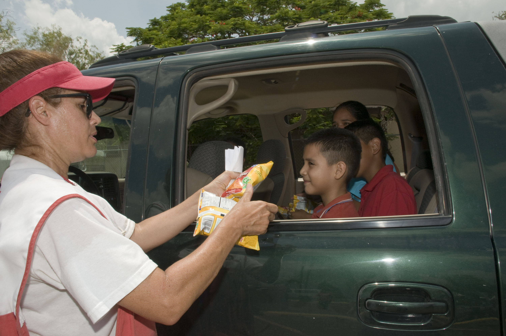

# Children & Family Emergency Operations

## Read this first (the 30-second version)
1. **Pick three meeting places now, before anything happens:** a **near** rally point just outside your home, a **far** rally point outside the neighborhood, and an **out-of-town** contact everyone can reach by phone/text. Every family member, kids included, must be able to say all three from memory.
2. **Every child old enough to talk should carry (or wear) an ID card**: full name, address, a parent's phone number, and one out-of-area contact number — in a pocket, backpack, or on a shoelace tag. This is the single fastest fix if a child gets separated from you.
3. **Give every child a real job**, sized to their age — even a 4-year-old can carry a stuffed animal and "help count" the family. A job reduces a child's fear far more than being told to "stay calm."
4. **Practice your fire, tornado, and evacuation plans on a calendar, not just once** — twice a year for fire and evacuation, once before spring storm season for tornado — framed as a fast, low-key routine, never as a scary surprise.
5. **If a child goes missing, act in the first 60 seconds:** stop searching randomly, alert every adult and any staff/security nearby immediately, describe exact clothing (this is why a "photo of the day" matters), and keep one adult stationed at the last-seen spot in case the child comes back on their own.
6. **Know your school/daycare's reunification plan and your own authorized-pickup list before an emergency**, not while you're standing outside the building trying to get in.

This guide covers the **operational, logistical side of keeping a family together and functioning** — plans, cards, drills, packing lists, and procedures. For the medical care of infants and other vulnerable people, and for the deeper psychology of calming anyone (adult or child) under stress, see the cross-references below; this guide focuses on what to *do*, not the medical or clinical detail.

---

## Why this matters
Most family emergencies don't kill anyone directly — a house fire, a tornado warning, a hurricane evacuation, a multi-day power outage. What actually causes the harm and the panic is **not having decided in advance who does what, where everyone meets, and how a lost child gets found.** Kids move slower, panic differently than adults, cannot always describe where they are, and are the most likely family members to get separated in a crowd, a fast evacuation, or a chaotic school pickup line. A family that has already rehearsed its plan turns a terrifying event into a checklist everyone already knows how to run. A family that hasn't spends the first, most dangerous minutes arguing about where to go and who's supposed to be watching whom.


*Figure — A Red Cross volunteer supports a child whose family was displaced by Hurricane Dolly in Edinburg, Texas, 2008. Source: Wikimedia Commons (File:FEMA - 37415 - Red Cross volunteer gives snacks to children in Texas.jpg), photo by Patsy Lynch/FEMA, public domain (US federal government work).* This is the practical reality this guide prepares you for — a family, displaced or separated, that already knows its plan and its rally points copes with exactly this kind of moment far better than one improvising for the first time.

## Key terms (plain language)
- **Rally point** — an agreed meeting place. **Near** = just outside your home. **Far** = outside the neighborhood, for when home itself is unreachable. **Out-of-town** = a relative/friend in a different city, used both as a place to actually go and as a communication hub.
- **Out-of-area contact** — one person outside your region that every family member calls or texts to report status; long-distance connections often work when local ones are jammed. See [Emergency Planning & Triage](../emergency-planning-triage/emergency-planning-triage.md) for the full household framework this guide builds on.
- **Separation plan** — a pre-agreed set of actions each family member takes automatically if the family gets split up, so nobody has to invent a plan while scared.
- **Reunification** — the formal process (used by schools, daycares, shelters, and disaster response) of matching children back up with an authorized adult, usually requiring ID and a pickup list.
- **Authorized pickup list** — the list, on file with a school/daycare, of exactly who is allowed to take a child, and requiring photo ID to release a child to anyone else.
- **Photo of the day** — a quick phone photo of each child, taken the morning of any event with crowds (a fair, a parade, an evacuation, moving to a shelter) showing their exact clothing, for fast, accurate descriptions if they go missing.
- **Comfort item** — a small, familiar object (stuffed animal, blanket scrap, favorite toy) that helps regulate a child's stress; carried in the go-bag specifically for this purpose.
- **Buddy system** — pairing a younger or less capable person with an older one so no one is ever unaccounted for without someone noticing quickly.

## What you need
Mostly planning, paper, and a few cheap items — this is the least expensive guide in the knowledge base to act on:
- Paper, pen, and a laminator or clear packing tape (to make ID cards durable)
- A recent photo of each child, printed or on a phone
- Index cards or business-card-sized cardstock
- A whistle per child (loud, simple, no batteries)
- One small comfort item per young child, kept in their go-bag
- A shoelace tag, wristband, or safety pin to attach an ID card to a small child's clothing at crowded events
- Copies of the household Family Communication Plan from [Emergency Planning & Triage](../emergency-planning-triage/emergency-planning-triage.md) (rally points, contacts) — this guide adds the kid-specific layer on top of it

---

# PART 1 — RALLY POINTS: THE FAMILY-WITH-KIDS VERSION

The near/far/out-of-town rally point framework itself is set up in [Emergency Planning & Triage, Part 5](../emergency-planning-triage/emergency-planning-triage.md); this section covers what makes rally points actually work **when kids are involved.**

## 1. Choosing points a child can find and describe
An adult can navigate to "the Shell station on Highway 5." A 7-year-old often cannot. Choose landmarks a child can:
- **See and recognize without reading** — a specific tree, a red mailbox, a playground slide, a particular fence post — not a street name or address alone.
- **Point to from your own yard or porch**, for the near rally point, so a scared child can physically walk there without navigating.
- **Describe in one short sentence** — practice having your child say it back to you: "the big oak tree by the Andersons' driveway," not "outside."

## 2. The three points, kid-adapted
- **Near rally point:** somewhere every child can reach from inside the house in under 30 seconds, in the dark, without adult help — a specific spot in the front yard, never across a street a small child would have to cross alone.
- **Far rally point:** a place the child has actually been to before and can recognize (a relative's porch, the flagpole at their own school, a specific pew at church) — not merely an address you've told them.
- **Out-of-town rally point:** for kids old enough to grasp it, frame it as "if we ever get split up somewhere far from home, we all try to get to Grandma's house or call her." Younger kids just need to know the out-of-area contact's name and that "if you can't find us, tell a safe grown-up to call [name]."

## 3. Teaching it so it sticks
1. Walk the actual route with each child, more than once — don't just tell them, show them.
2. Use a simple rhyme or repeated phrase ("if we get split up, go to the big tree") that a young child can recite under stress even if they can't reason it out.
3. Draw a simple hand-drawn map with your child and let them decorate/label it — kids remember what they helped make.
4. Re-walk and re-confirm every 6 months, and any time you move, change schools, or a child grows old enough to understand more detail.

```
                YOUR HOME
                    |
        [NEAR rally point] <- specific yard landmark, <30 sec, no street crossing
                    |
        [FAR rally point]  <- somewhere the child has physically visited before
                    |
   [OUT-OF-TOWN rally point / contact] <- name + phone memorized, not just written
```

---

# PART 2 — THE FAMILY SEPARATION PLAN

A separation plan answers one question in advance for every family member: **"If we get split up right now, what do I do — without waiting for instructions?"**

## 1. What each person does if split up
Write a version of this for every family member capable of following it, and review it out loud together:

1. **Stay where you are for a few minutes first** if you're in a safe spot — many separations resolve within minutes if nobody moves further apart.
2. **Go to the nearest known rally point** — near first if you're close to home, far if you're not, in that order.
3. **Tell a "safe grown-up"** if a child cannot reach a rally point alone — teach kids what a safe grown-up looks like (see Part 8) rather than "any adult."
4. **Call or text the out-of-area contact** the moment any phone signal is available, even briefly — texts often get through when calls don't (see [Communication](../communication/communication.md)).
5. **Do not go back into danger** (a burning building, floodwater, a crowd surge) to look for someone — tell a responder or official immediately instead; this is the single hardest and most important rule for parents to follow themselves.

## 2. Special separation scenarios to plan for by name, not just "in general"
- **Kids at school/daycare when the event happens** — covered fully in Part 9 (Reunification).
- **One parent traveling or at work across town** — confirm in advance how that parent gets status updates (out-of-area contact as relay) and what "come home" vs. "shelter where you are and we'll reunite later" looks like for your family's decision triggers (see [Emergency Planning & Triage, Part 3](../emergency-planning-triage/emergency-planning-triage.md)).
- **Split households / co-parenting** — both households should share the same out-of-area contact (or know each other's), so a child's status can be relayed regardless of whose custody day it is; keep a copy of custody paperwork in your document kit (see [Documents, Money & Admin](../documents-money-admin/documents-money-admin.md)).
- **A crowd or evacuation-center separation** — assign a buddy pairing (Part 1) so a break in physical contact is noticed within seconds, not minutes.

## 3. The out-of-area contact, from a kid's point of view
- Kids old enough to use a phone should have the out-of-area contact **saved under a simple label** ("Grandma Emergency") and know the phone's lock-screen emergency info is filled in.
- Younger kids just need to know the contact's **first name and that a grown-up can call them** — their ID card (Part 3) carries the actual number so the child never has to remember digits under stress.
- Practice an actual test call or text to the out-of-area contact once a year so it's a known action, not a hypothetical.

## 4. Set a family password
The American Academy of Pediatrics recommends every family agree on a **simple, memorable "family password"** — a word or short phrase known only to the family (and anyone specifically authorized, like a backup pickup adult).
- Teach every child, as soon as they can talk in short sentences: **"Only go with a grown-up who knows our special word."** This gives a child a concrete, binary test to apply under stress instead of having to judge a stranger's trustworthiness on the spot.
- Give the password to anyone you authorize in advance to pick up or help your child in an emergency (a backup adult on the school's authorized pickup list, Part 9) so a legitimate helper can still pass the test.
- Change the password if you ever suspect it's been shared outside the family, and re-teach it the same way you'd update a rally point.
- This is a supplement to, not a replacement for, the "safe grown-up" rule in Part 8 — the password is for when a specific adult approaches the child; the safe-grown-up rule is for when the child has to find help on their own.

---

# PART 3 — ID & CONTACT CARDS FOR KIDS

This is the single highest-value, lowest-cost item in this guide. A card takes ten minutes to make and can be the difference between a 5-minute reunion and a multi-hour search.

## 1. What to put on it
- **Child's full name** (and nickname if different from what they answer to)
- **Date of birth** (helps responders judge age/size quickly)
- **Home address**
- **Parent/guardian name(s) and phone number(s)** — at least two numbers if possible
- **Out-of-area contact name and phone number**
- **Medical info**: allergies (especially food/insect/medication allergies), any daily medication, any condition a responder should know immediately (asthma, seizures, diabetes, autism/communication differences)
- **Family rally points** — near and far, in the child's own words if they helped write it
- **A small current photo**, if you're making a laminated card rather than a slip of paper — helps anyone who finds the child confirm identity fast
- **"If you are lost" instructions on the back**, written for the child to read or for a helper to read aloud (Part 8 gives the wording)

## 2. Printable card template (copy this, fill in by hand, laminate or tape over)

```
┌───────────────────────────────────────────────────┐
│  CHILD SAFETY CARD                    [photo here] │
│                                                     │
│  Name: ______________________  Nickname: _________ │
│  DOB: _____________            Age: _____          │
│  Home address: ____________________________________│
│                                                     │
│  PARENT/GUARDIAN 1: ____________  Phone: _________ │
│  PARENT/GUARDIAN 2: ____________  Phone: _________ │
│  OUT-OF-AREA CONTACT: __________  Phone: _________ │
│                                                     │
│  Allergies: ________________________________________│
│  Medications: _______________________________________│
│  Medical conditions: ________________________________│
│                                                     │
│  NEAR rally point: __________________________________│
│  FAR rally point:  __________________________________│
└───────────────────────────────────────────────────┘

BACK OF CARD — read this if you find this child alone:
  "If I am lost, please:
   1) Stay with me, don't send me off alone to look for my family.
   2) Call the phone number(s) above.
   3) If you're at an event/store, tell an employee or uniformed
      staff member and stay together until my family is reached."
```

## 3. Building and carrying it
1. Fill in the front by hand or type it, print, and cut to a wallet or index-card size.
2. **Laminate it** (a laminator, clear packing tape wrapped fully around it, or a plastic sleeve) so it survives rain, sweat, and a child's pocket.
3. Attach it to something the child always has: a zippered jacket pocket, a backpack's inner pocket (not the main compartment where it could fall out), or for young children at crowded events, a shoelace tag, a wristband, or a safety-pinned card inside a shirt.
4. **For non-verbal or very young children**, consider a wearable version (a paracord/lanyard tag, a temporary tattoo with a phone number, or an iron-on label with just the parent phone number) rather than relying on a card they could lose or that could fall out of a pocket.
5. Update it **every 6 months and any time information changes** (new phone number, new school, new medication) — an out-of-date card is still far better than none, but keep it current when you can.
6. Make one for **each child**, plus a master copy kept with your household documents (see [Documents, Money & Admin](../documents-money-admin/documents-money-admin.md)) that also lists immunization records and any custody paperwork a shelter or hospital might need to see.
7. This isn't a homemade-only idea — it matches the CDC's own official **"Ready Wrigley" Backpack Emergency Card** program, which recommends the same core fields (child's info, parent contacts, an out-of-area contact, and medical notes) carried in a school backpack; use either format, the content matters more than the source.

> ⚠️ Do not put the card where a stranger could casually read it (an outward-facing backpack tag visible to anyone) if it lists your home address **or your child's full name** — a stranger who reads a child's name off a visible tag can call out to them by name and fake instant trust ("Hi Emma, your mom sent me to get you"), which defeats the "only go with someone who knows our password" rule in Part 2. For anything visible from the outside (a luggage-tag style label, a wristband worn at a crowded event), use only the child's **first name or initial** — keep the full name, address, and phone numbers on the card's inside/hidden face, read only by whoever the child hands it to or whoever finds them. A jacket-inside-pocket or wristband with just a first initial is safer than an outward luggage-tag style for daily use; save the fully-detailed version for the inside of the card or for staff-only viewing at high-crowd events like fairs and evacuations. This is exactly why the **family password (Part 2, Section 4)** matters as a second layer — even if a stranger reads a first name off a tag, they still can't pass the password test.

---

# PART 4 — AGE-APPROPRIATE RESPONSIBILITIES

Give every child a real job. A job — not a vague instruction to "be good" or "stay calm" — is what actually lowers a child's fear, because it gives them something concrete to control.

| Age group | What they can realistically do | Example job |
|---|---|---|
| **Infant/toddler (0–3)** | Nothing task-based; needs to be carried/held securely and given a comfort item | Hold their own stuffed animal or blanket; be worn in a carrier so hands stay free for others |
| **Preschool (3–5)** | Learn and recite their own full name and a parent's first name; recognize the rally point landmark; carry a small, light item | "Carry your backpack with your stuffed animal"; "hold my hand and walk to the big tree" |
| **Early elementary (6–9)** | Memorize the home address and one phone number; understand the ID card and where it is; help with simple counting/checklists | "Be the headcount helper — point to each person and count out loud"; carry a whistle |
| **Tween (10–12)** | Memorize the out-of-area contact's number; operate a flashlight/whistle/basic radio; help pack their own go-bag; supervise a younger sibling briefly under an adult's overall watch | "Pack your own bag from this list"; "carry the flashlight and check it works" |
| **Teen (13+)** | Take a real slot in the household roles table from [Emergency Planning & Triage, Part 4](../emergency-planning-triage/emergency-planning-triage.md) — kids/vulnerable-person handler, comms relay, supplies runner; know the full plan, not just their own piece | "You're in charge of your younger siblings' go-bags and headcount during the drill"; carry a copy of the family contact list |

**Rules for assigning jobs, regardless of age:**
1. Match the job to real capability, not birth order or wishful thinking.
2. Practice the job during drills (Part 5), not for the first time during a real event.
3. Praise effort and completion specifically ("you counted everyone and got it right") rather than generic reassurance — specific praise reinforces that the job mattered.
4. Rotate or adjust jobs as kids grow — revisit the table every 6–12 months.
5. **For a child or youth with special health care needs (CYSHCN)**, adapt the job rather than skipping it — a nonverbal child can still hold or point to a comfort item; a child who uses a wheelchair can be "in charge" of a specific small item stored on the chair itself. The American Academy of Pediatrics recommends keeping a written "talking points" sheet about the child's disability/needs to hand to a first responder or shelter staff member, and a medical-ID bracelet or a label on the wheelchair/backpack with emergency contact info, since a CYSHCN child may not be able to give that information verbally under stress.
6. **Cheap family-radio-service (FRS) handheld radios** (a 4-pack runs roughly $40, no license required, standard AA batteries) are a good tween/teen "communications" job — let them learn and practice with the radios during normal outings (hiking, the yard, a store) so operating one is already familiar before an emergency requires it; see [Communication](../communication/communication.md) for the deeper radio-communication picture.

---

# PART 5 — RUNNING FAMILY DRILLS

Drills are how a plan moves from paper into muscle memory. Under real stress, people (especially children) fall back on what they've rehearsed, not what they were told once.

## 1. Teach the warning sounds before you drill the response
A drill only works if a child already recognizes what's triggering it. Before running any drill, play or describe the actual sounds a child needs to react to:
- A **smoke/fire alarm** (a steady horn or beeping inside the home).
- A **tornado siren** (an outdoor rising-and-falling wail, used regionally — not every area has one; North Texas neighborhoods vary in whether they have outdoor sirens at all, so check your specific neighborhood).
- A **wireless emergency alert / weather radio tone** on a phone or NOAA weather radio (a distinct, jarring electronic tone, different from a normal notification).
- FEMA and NOAA both publish short audio/video clips of these signals (see `ready.gov` and `weather.gov/[office]` for your area) — play them for your child in a calm moment so the sound itself isn't the scary surprise during a real drill or real event.

## 2. What to drill and how often
- **Fire drill** — twice a year, matching most schools' own schedule; practice a specific home escape route from each bedroom, including a second way out if the first is blocked, and the outdoor near rally point.
- **Tornado/severe-weather drill** — at least once a year, ideally in early spring before the region's peak severe-weather season; practice moving to the safe room (interior room, lowest floor, no windows) quickly and calmly, including what to bring (a phone, shoes, a helmet or cushion for young kids if available).
- **Evacuation drill** — once or twice a year; practice grabbing go-bags, loading the vehicle, and doing a headcount within a target time (start with "however long it takes," then work toward 10–15 minutes as everyone gets faster). **Practice buckling every child into their car seat or booster correctly as part of the timed drill, not after it** — under real time pressure, a rushed, half-buckled child is a serious crash-injury risk, and a car seat/booster used incorrectly protects far less than it should; a few extra seconds to get the harness/belt right every single time is worth it even when you feel like you don't have seconds to spare. Keep each child in the seat/booster type and rear/forward-facing orientation appropriate for their current age, height, and weight (check your seat's manual or NHTSA's guidance if unsure), and never let an evacuation's urgency talk you into skipping or loosening it.
- **Lost-child drill** (see Part 8) — a short, low-key practice of "what do you do if you can't find me right now," done at home first, then optionally practiced calmly at a low-stakes crowded place like a store.


*Figure — Students of Seoul American Elementary School practice proper fire-extinguisher technique at a fire department during Fire Prevention Week, Yongsan, South Korea, 2013. Source: Wikimedia Commons (File:Students of Seoul American Elementary School learn how to properly use a fire extinguisher...jpg), photo by SSG Kevin Frazier, U.S. Army, public domain (US federal government work).* This is what a well-run, hands-on drill looks like for children — a real skill practiced calmly, in daylight, framed as a normal safety lesson rather than a frightening surprise.

## 3. How to make drills not scary
1. **Announce it as practice, in advance** — "in a few minutes we're going to practice our fire escape, just like a game" — never spring it as a surprise designed to frighten, especially for younger children.
2. **Frame it as speed and teamwork, not danger** — "let's see how fast we can all get to the big tree" works better than "pretend the house is burning."
3. **Let kids help build the plan**, not just execute it — ask a 7-year-old to help draw the rally-point map or pick which stuffed animal goes in their go-bag. Buy-in from participation beats buy-in from instruction.
4. **Keep it short** — a few minutes is enough for young children; long, repeated, high-intensity drills can create the fear they're meant to prevent.
5. **Debrief with praise, not correction-first** — start with what went right, then adjust one thing at a time for next time.
6. **Avoid drilling right before bedtime** — a scary or intense topic close to sleep can produce nightmares; do drills in daylight, ideally not right after a real scary event either.
7. **Match language to age** — for young children, "practice going out the fast way" rather than describing smoke inhalation or storm damage; for older kids and teens, more real detail is appropriate and often welcomed (see [Psychological First Aid](../psychological-first-aid/psychological-first-aid.md) for the deeper principles behind age-appropriate honesty).

## 4. What "success" looks like
A drill is working when a child can, without an adult prompting each step: get to the safe room or rally point, find their go-bag, and (if age-appropriate) recite their own ID card information. Track this loosely over time — kids improve fast with repetition.

---

# PART 6 — KEEPING CHILDREN CALM DURING AN EVENT

This section is the **operational** side of calming kids — what to pack, say, and structure in the moment. For the deeper psychology of panic control and helping any person (adult or child) in acute distress, see [Psychological First Aid](../psychological-first-aid/psychological-first-aid.md), which this section deliberately does not duplicate.

## 1. What to say
- Give **honest, bounded information** at the child's level: "There's a big storm and we're going to our safe room until it passes. We practiced this. You know what to do." Avoid both "everything is totally fine" (if it isn't) and adult-level detail a child can't use.
- Name **who is in charge** and **where the rest of the family is or when they'll be reunited** — concrete facts reduce fear more than reassurance alone.
- Expect and allow the **same question more than once** — young children process through repetition; answer calmly each time rather than showing frustration.

## 2. Routine as a calming tool
- Keep or restore small routines as fast as possible during a prolonged event — a bedtime ritual, a mealtime, a simple chore — predictability is one of the strongest anti-anxiety tools available to a family, even in a shelter or a vehicle.
- If sheltering for multiple days, hold the daily situation briefing described in [Emergency Planning & Triage, Part 8](../emergency-planning-triage/emergency-planning-triage.md) at a fixed time — kids benefit from the same predictable check-in adults do.

## 3. Comfort items
- Pack **one specific comfort item per young child** in their go-bag ahead of time (not decided in the moment) — a stuffed animal, a blanket scrap, a favorite small toy or book.
- For a child too young to choose, keep a duplicate of their most-used comfort object permanently in the go-bag so the "real" one at home doesn't need to be found under pressure.
- Comfort items are not just for toddlers — many older kids and even teens benefit from a familiar small object during a disruptive event; don't assume a child has "outgrown" the need.

## 4. Limiting exposure
- Limit a child's exposure to **frightening sights, sounds, and repeated news/disaster footage** — repeated exposure to disaster imagery is linked to worse outcomes in children, and this is easy to control even when little else is.
- Keep adult conversations about worst-case scenarios out of earshot of young children; they absorb tone and fragments even when they don't understand the content.
- Let older kids and teens have **real information** appropriate to their age rather than shielding them completely — being excluded from a family's real plan can be more frightening than the truth.
- If a child has already seen coverage or images, don't just turn it off silently — **turn it off, then ask what they think they saw and correct/clarify it**; young children in particular can misinterpret replayed footage as the disaster happening again, over and over.
- Monitor your **own** device use in front of your kids during the event — a parent doomscrolling in view of a child sends the same anxious signal as letting the child watch directly.

## 5. Recognizing a child's reaction by age (so you know what's normal)
Reactions to a disaster differ by age, and knowing the common pattern helps you respond calmly instead of being alarmed by normal behavior. Drawn from CDC and American Academy of Child & Adolescent Psychiatry (AACAP) guidance. **Note:** this table's age brackets (0–2, 2–5, 6–10, 11–19) don't line up exactly with the age brackets in the Part 4 responsibilities table (0–3, 3–5, 6–9, 10–12, 13+) — that's by design, not an inconsistency. Part 4's brackets track what a child can *practically do* (task capability, developmental milestones); this table's brackets follow the age groupings used in the child-trauma-response research literature itself. Use whichever table's boundary is closer to your specific child's developmental stage rather than trying to force the two into a single scheme.

| Age group | Common reactions | What helps |
|---|---|---|
| **Infants/toddlers (0–2)** | Little understanding of cause and effect; no way to verbalize stress; may show it through crying, clinginess, or feeding/sleep disruption | Physical closeness, calm tone of voice, restoring feeding/sleep routine as fast as possible |
| **Preschool (2–5)** | May not understand permanent loss; fear of abandonment; may **re-enact the event repeatedly** through play to process it; regression (bedwetting, thumb-sucking, baby talk) | Let them re-enact/play it out rather than stopping them; expect and tolerate temporary regression; extra physical reassurance |
| **School-age (6–10)** | May fear going to school, withdraw from friends, have trouble concentrating, do worse in school, or become **aggressive for no clear reason**; nightmares; fear of sleeping alone or with the light off | Name the behavior without punishing it ("I know you're extra jumpy today, that's normal right now"); allow a night light or other routine change for as long as needed; keep them socially connected |
| **Teens/adolescents (11–19)** | Physical/emotional changes of adolescence can make coping harder; may withdraw socially, become sad or jumpy, or carry persistent fears about a recurrence | Real information rather than shielding; encourage them to talk with peers and trusted adults; watch quietly for withdrawal that doesn't improve |

A child who is very upset over a **lost toy, blanket, or stuffed animal** during a disaster is not overreacting — to them it can represent a real, significant loss; treat it seriously rather than dismissing it ("it's just a toy").

## 6. Concrete techniques that help a child process an event
- **Give them real, small choices** — what to wear, what to eat, which bed/spot to sleep in — many things will be out of a child's control during a disaster, so highlighting the things they *can* control measurably reduces distress.
- **Let a child write or tell a simple story about what happened.** A useful starter prompt from the American Academy of Pediatrics: *"Once upon a time, a big ___ came, and it scared us all. This is what happened..."* — and make sure the story ends with where things stand now (e.g., "...now we are staying with Grandma while we find a new place"). This gives the event a beginning, middle, and a current, safe endpoint instead of leaving it open-ended in a child's mind.
- **Let them draw or make art about it** if they want to — it can reveal feelings a child can't yet put into words; if anything in the artwork concerns you, mention it to a pediatrician, counselor, or teacher rather than guessing.
- **Get outside and physically active together** — a walk, a ball, a playground — natural sunlight and movement measurably help mood and are easy to do even in a degraded situation.
- **Include the child in recovery tasks** sized to their ability (Part 4) — being useful is one of the fastest ways to counter a child's sense of helplessness.
- **Allow temporary routine changes** (a night light, sleeping in a sibling's room, an extra stuffed animal) for as long as the child needs them after the event — these are coping accommodations, not habits you need to correct right away.
- It's normal for signs of stress to **appear weeks or months after the event**, not just immediately — keep watching a child's behavior over the following months, not just during the event itself, and loop in your pediatrician if anything persists or worsens (see the ⚠️ Safety section for when this becomes urgent).

---

# PART 7 — CHILD-SPECIFIC SUPPLIES BY AGE

This section is a **packing/logistics list** — for the medical care behind these items (feeding technique, illness care, temperature regulation in small bodies), see [Childbirth & Vulnerable-Person Care](../childbirth-and-vulnerable-care/childbirth-and-vulnerable-care.md). For general household stockpile sizing (72-hour/2-week/30-day tiers), see [Supplies, Inventory & Rotation](../supplies-inventory-rotation/supplies-inventory-rotation.md); this table adds the child-specific items on top of that general framework.

| Age group | Feeding/hydration | Diapering/hygiene | Medical | Comfort/other |
|---|---|---|---|---|
| **Infant (0–12 mo)** | Formula (unopened, within date) or breastfeeding supplies (pump, bags if needed); bottles; bottled/boiled water for mixing formula | Diapers (double your estimate), wipes, diaper rash cream, a few changes of clothing | Infant fever reducer if pediatrician-approved, thermometer, any prescribed medication with a spare dose or two | Pacifier(s), a small blanket, a hat (heat loss) |
| **Toddler (1–3 yr)** | Shelf-stable toddler snacks/pouches, a sippy cup, extra formula/milk if still used | Diapers/pull-ups and wipes if not yet trained, a couple of full outfit changes | Children's fever/pain reducer if approved by their doctor, any prescribed medication | One chosen comfort item (duplicate kept in the bag), a small quiet toy or board book |
| **Child (4–12 yr)** | Shelf-stable snacks they actually like, a labeled reusable water bottle | A full change of clothes, hand sanitizer | Any daily medication with a spare supply, a written allergy/condition note for helpers who don't know the child | ID card (Part 3), a small flashlight, a whistle, a comfort item or book/game |
| **Teen (13+)** | Same as adults, but confirm they actually eat/drink enough under stress | Personal hygiene items they use | Any daily medication, a copy of their own ID/medical card | Their own go-bag they packed themselves (Part 4), phone charger/battery pack |

**Packing rules that apply to every age:**
1. **Never dilute or stretch formula** to make it last longer — this is a genuine medical risk, not just a supply problem; see [Childbirth & Vulnerable-Person Care, Section 8](../childbirth-and-vulnerable-care/childbirth-and-vulnerable-care.md) for why.
2. Rotate child supplies on the same schedule as the rest of your stockpile (check sizes/expiration every 6 months) — kids outgrow diaper sizes and clothing faster than adult gear expires.
3. Keep a **written medication/allergy list per child** in the document kit, updated whenever a prescription changes (see [Documents, Money & Admin](../documents-money-admin/documents-money-admin.md)).
4. Store child supplies in a labeled, grab-and-go bag or bin specific to each child, not mixed loose into the general household stockpile — you want to be able to hand one child's bag to one person and go.
5. **Let kids sample any ready-to-eat meals or dehydrated food you buy for the kit ahead of time**, not for the first time during an emergency — it removes the temptation to "just try one" out of curiosity and confirms the child will actually eat it under stress.

## Extra supplies for a child or youth with special health care needs (CYSHCN)
A child with a disability, chronic condition, or medical complexity needs everything above **plus** items specific to their condition, packed and reviewed with the same 6-month rotation schedule:
- **Their own power supply** for any medical equipment that needs it (battery backup, car inverter — see [Power & Energy](../power-energy/power-energy.md)).
- **Specialized feeding supplies** if used: special formula/thickeners, feeding-tube extensions, buttons, and syringes.
- **Incontinence supplies** sized correctly: diapers, ostomy bags, underpads/chucks, gloves.
- **Comfort/calming items specific to sensory needs** — noise-cancelling headphones, sensory toys, a "lovey," or other items that regulate this specific child, which may differ from the general comfort-item guidance in Part 6.
- **A medical ID bracelet** (if the child will tolerate wearing one) or an emergency-contact label affixed to a wheelchair, backpack, or wallet the child always has.
- **A written "talking points" summary** of the child's condition/needs for first responders or shelter staff (a pediatrician's office or your state's Family-to-Family Health Information Center can provide a template), plus a completed **Emergency Information Form for Children with Special Health Care Needs** (a standard form used by the American Academy of Pediatrics and many EMS/ER systems) kept with your document kit.
- If your child depends on **specialized transportation**, confirm with that provider in advance what backup options exist if their usual service is unavailable, and plan to evacuate earlier than a typical family to allow for the extra time this can take.

---

# PART 8 — LOST-CHILD PROCEDURES

## 1. Prevention
1. **Take a "photo of the day"** on your phone every time you're heading somewhere crowded (a fair, a parade, an evacuation center, a shelter) — showing exact clothing, so you can describe your child accurately if separated, without relying on memory under stress.
2. **Dress young children in bright, distinct colors** at crowded events, and consider matching family colors/hats so a quick visual scan finds them faster.
3. Make sure every child capable of understanding it wears or carries their **ID card** (Part 3) at any high-crowd event, not just at home.
4. **Teach the "safe grown-up" concept** in advance, in simple language: "If you can't find me, look for a mom with kids, a store employee in a uniform, or a police officer/firefighter. Tell them your name and that you're lost. Don't go off looking for me by yourself." Practice this as a short, calm conversation, not a scary lecture.
5. At the start of any crowded outing, do a **1-minute check-in**: point out one landmark ("if we get separated, come back to this bench") specific to that location, in addition to your standing family rally points.
6. Reinforce the **family password** (Part 2) alongside the safe-grown-up rule — the password is the child's test for whether *an adult approaching them* is legitimate; the safe-grown-up rule is what the child does when *they* have to go find help.

## 2. Response — the first minutes matter most
1. **Stay calm and act immediately** — do not wait "a few more minutes to look ourselves first" in a crowd, store, or evacuation setting; the first minutes are the most important window.
2. **Alert every adult in your group and any staff/security immediately.** In a store, venue, or shelter, tell an employee or the nearest official right away — many venues have a specific lost-child procedure (some lock doors/exits) that only activates once reported.
3. **Give an exact description**, using the day's photo if you have it: clothing color and type, height, hair color, anything distinctive — exact details are searched far faster than a vague one.
4. **Assign one adult to stay at the last-known spot** in case the child returns there on their own — children are often taught to "stay put," and a moving search can miss a child who did exactly the right thing.
5. **Do not have the whole group split up randomly to search** — coordinate: one stays put, others check specific, assigned areas (restrooms, an area near where you last were, the venue's designated help point) and report back on a set schedule rather than wandering independently and becoming separated themselves.
6. **Call the out-of-area contact if it's a wider event** (an evacuation, a shelter, an area-wide disaster) — they may become useful for relaying information to other family members trying to help from a distance.
7. **In a Presidentially declared disaster, report a missing child to local law enforcement first, then also to the National Center for Missing & Exploited Children (NCMEC)** at **1-800-843-5678 (1-800-THE-LOST)**, which activates the federally mandated National Emergency Child Locator Center (NECLC) during declared disasters at a state's request. NCMEC also deploys "Team Adam" (retired law-enforcement personnel) to help reunify displaced children during large-scale events — this is a real, national-level resource, not just a local police matter, once a disaster reaches that scale.

## 3. If your child is separated during a wide-area disaster (not just a local lost-child event)
- File a report with local law enforcement or shelter/reunification staff immediately, and separately with the NCMEC disaster line above — the two systems don't automatically share your report with each other in every jurisdiction.
- If you're sheltering and your child was separated at another facility (a school, another shelter, a hospital), tell shelter staff — many wide-area disasters use a coordinated, whole-community reunification process precisely because children get temporarily routed through different facilities than their parents.
- Keep using your out-of-area contact as a relay point — it is often easier for one fixed, reachable person to coordinate multiple search efforts than for displaced family members to coordinate with each other directly.

---

# PART 9 — SCHOOL / DAYCARE REUNIFICATION

## 1. Know the plan before you need it
- Every school and licensed daycare has a written emergency and reunification plan — request it (most post a summary; ask the front office for detail) and read it **before** an emergency, not while you're standing outside a locked building during one.
- Learn where the school's own designated reunification site is — during some emergencies (a lockdown, a building evacuation for fire/gas/structural reasons), children are moved to a secondary location, not held at the school itself.
- Confirm how the school **notifies families** during an emergency (a call/text/app system) and make sure your contact information on file is current every year.

## 2. Authorized pickup
- Confirm and keep current your child's **authorized pickup list** on file with the school/daycare — schools will not release a child to anyone not on this list, including a grandparent or family friend, without prior notice and ID.
- Add your **out-of-area contact or a trusted local backup** to the authorized list in advance, in case neither parent can physically reach the school during a wide-area event (a work lockdown, a road closure, a personal medical emergency).
- Bring **photo ID** every time you pick up a child during any emergency reunification process — expect this to be checked even for a parent the staff recognizes; this is a safety feature, not a bureaucratic obstacle, and rushing or arguing with it wastes time you don't have.

## 3. Communication during a school-based emergency
- **Do not call the school repeatedly during an active incident** — this can tie up phone lines school staff need for coordinating the actual response; use the school's official notification channel and check it before calling.
- **Do not go to the school and attempt to enter during an active lockdown or evacuation** unless directed to — this can interfere with staff/responder actions and, in a security-related event, can put you at risk; follow official instructions on where and when to go for pickup.
- Keep the school/daycare's main office number, and the reunification-site address if published, in your household contact list (see [Emergency Planning & Triage, Part 6](../emergency-planning-triage/emergency-planning-triage.md)).

## 4. The common vocabulary your school may use (Standard Response Protocol)
Thousands of US schools — including many North Texas districts — use the "I Love U Guys" Foundation's **Standard Response Protocol (SRP)**, a common-language system for the five actions a school can take during an incident. Knowing these terms in advance means a notification makes sense immediately instead of sounding like alarming jargon:

| Term | Meaning for students/staff | What it means for you as a parent |
|---|---|---|
| **Hold** | "In your classroom or area" — stay put, hallways cleared, business continues once clear | A localized, usually minor issue; no action needed from you |
| **Secure (Lockout)** | "Get inside, lock outside doors" — everyone brought indoors, exterior doors locked, business as usual inside | Something is happening **outside** the building; do not go to the school; expect normal dismissal unless told otherwise |
| **Lockdown** | "Locks, Lights, Out of Sight" — doors locked, lights off, students silent and out of view | A more serious in-building concern; **do not** call or go to the school; wait for official notification |
| **Evacuate** | Moving to a named location, possibly leaving belongings behind | Students are moving to a different site; the reunification site may not be the school itself (see Part 1) |
| **Shelter** | A named hazard (tornado, hazmat, earthquake) with a matching safety strategy (e.g., "seal the room," "drop, cover, hold") | Same logic as your own home severe-weather drill (Part 5) — expect this during tornado warnings |

## 5. What actually happens at a reunification (Standard Reunification Method)
When a "controlled release" reunification is called — for weather, a hazmat event, a building issue, or a security incident — most participating districts follow a fairly consistent, practiced sequence (the **Standard Reunification Method**, or a close variant of it). Knowing the steps in advance prevents the two most common parent mistakes: showing up without ID, and trying to bypass the process out of understandable panic.

1. **Notification.** You may be called, texted, or emailed by the district's mass-notification system. In some cases, your own child is asked to text you directly — a typical message looks like *"The school has closed, please pick me up at 3:25 at the main entrance. Bring your ID."* Students are asked to send this one message and then **stop texting** — keeping cellular network traffic low helps the school's own coordination.
2. **Getting there.** Drive carefully and watch for emergency vehicles; **park only where directed** and do not abandon your vehicle. The reunification site may be a **different location than the school itself** (Part 1) if the building was evacuated.
3. **Check-in.** Parents form a line, often organized **by the first letter of the student's last name**. While waiting, you fill out a **reunification card** — a perforated card where the top and bottom repeat the same information. Fill out a **separate card for each child** you're retrieving.
4. **ID and custody verification.** Staff check your **photo ID** against the pickup/custody information on file (this is why Part 9, Section 2's authorized-pickup list matters) and separate the card, handing you the bottom half.
5. **Reunion.** A staff member (sometimes called a "Runner") carries your card half to where students are being held (a "Student Assembly Area") to retrieve your specific child or children and bring them to you.
6. **If you can't get there yourself**, the school will only release your child to someone already on the authorized pickup list (Part 9, Section 2) — this is exactly why adding a trusted local backup to that list *before* an emergency matters.
7. **Be patient at every step.** The process exists to protect your child from being released to the wrong person during a chaotic event — arguing with or rushing the process actually slows down everyone's reunification, not just yours.
8. In rare cases involving a law-enforcement investigation, parents may be asked to step aside for a brief interview before reunion — this is uncommon but not unheard of in security-related incidents.

North Texas note: the **Texas School Safety Center** publishes Texas-specific SRP/SRM guidance and toolkits, and districts such as Frisco ISD explicitly train on this method — ask your own child's school directly whether they use SRP/SRM so you know the exact vocabulary and process to expect.

---

# North Texas / Anna, TX specifics
- **Tornado drills are already routine in Texas schools** — align your home drill timing with the school year's own severe-weather week (typically observed in spring) so kids reinforce the same habits in both places rather than learning two different routines.
- **Match your home vocabulary to your school's.** If your child's district uses the Standard Response Protocol (Part 9) — as many North Texas districts, including Frisco ISD, do — using the same terms ("shelter," "lockdown," "secure") at home means a real notification is instantly familiar instead of confusing jargon layered on top of an already-stressful moment.
- **Flash flooding affects school pickup routes** — low-water crossings near schools in Collin County can flood fast during heavy rain; know at least one alternate route to your child's school/daycare that avoids known flood-prone crossings, and expect schools to sometimes hold children rather than release them into unsafe road conditions.
- **Ice storms** are a distinct local reunification scenario: schools may dismiss early or delay dismissal for safety, and roads can become impassable quickly — keep a plan for a trusted, close-by backup adult on the authorized pickup list for exactly this situation, since a parent driving in from farther away may not be able to get there safely.
- **Summer heat drills**: when practicing evacuation drills in a Texas summer, practice loading the vehicle and getting kids/pets into air conditioning promptly — heat stress during a drill itself is a real risk; do outdoor portions of a drill in early morning or evening.
- **Rural distances**: if your far or out-of-town rally point is a genuine drive away on rural roads, confirm with your child (age-appropriately) that they understand the far rally point may take longer to reach than in a dense suburb, and that staying put/with a safe adult is still the right first move.

---

# ⚠️ Safety — the most important warnings
- **A rally point a child cannot find alone is not a real rally point.** Test it by having the child lead the way, not just describe it.
- **Never send kids out to search for each other** during a lost-child event or a wider disaster — this multiplies the number of unaccounted-for children instead of solving the problem.
- **Never release, or accept the release of, a child from a school/daycare without proper ID and authorization**, even under emotional pressure to "just let me have my kid" — the process exists because impersonation and custody disputes are real risks during chaotic events.
- **Do not stretch or dilute infant formula** to make supplies last — see [Childbirth & Vulnerable-Person Care](../childbirth-and-vulnerable-care/childbirth-and-vulnerable-care.md) for why this is dangerous, not just imprecise.
- **Never skip or loosen a car seat/booster during an evacuation because you're in a hurry** — an unrestrained or improperly buckled child is at serious risk of injury in even a minor crash, and evacuation driving conditions (traffic, panic, bad weather) make a crash more likely, not less; buckle correctly every time.
- **Do not drill so intensely or so close to bedtime that it frightens rather than prepares** — a drill that traumatizes defeats its own purpose.
- **A specific suicide plan, a child or teen expressing wanting to disappear/die, or a total inability to function** during or after an event is a mental-health emergency, not a normal reaction — go straight to the Safety section of [Psychological First Aid](../psychological-first-aid/psychological-first-aid.md) and get professional help the moment it's reachable.
- **Keep custody and guardianship paperwork current and accessible** in split households — a shelter, hospital, or school may require it during reunification, and this is not the moment to be sorting out family legal status.

# Troubleshooting
| Problem | Fix |
|---|---|
| Child can't remember the far rally point under stress | Rely on the ID card's written rally points and the out-of-area contact instead; walk the route again more times before the next drill. |
| Young child won't wear/keep an ID card | Switch to a wristband, shoelace tag, or iron-on label instead of a pocket card; make it a "special bracelet" rather than framing it as a safety device. |
| Drills are making a child anxious instead of confident | Shorten them, remove any scary language/props, let the child help plan the next one, and do them earlier in the day, never near bedtime. |
| Family gets split up with no working phones | Fall back on rally points in order (near, then far), then the out-of-area contact the moment any signal returns; assign one adult to stay put at the last-known location. |
| Child is lost in a crowd right now | Alert staff/security immediately, give the exact photo-of-the-day description, station one adult at the last-known spot, and coordinate any further search rather than scattering randomly. |
| School won't release your child to you | Confirm you're on the authorized pickup list and have photo ID ready; if not on the list, contact whoever is and have them coordinate, or call the out-of-area contact to help sort it from outside the chaos. |
| Ran out of a child's medication mid-event | Treat it as an active emergency to solve now (any reachable pharmacy, clinic, or aid station), per [Childbirth & Vulnerable-Person Care](../childbirth-and-vulnerable-care/childbirth-and-vulnerable-care.md) — do not simply wait and hope. |
| Kids fighting/panicking over who does which job | Fall back on the age-appropriate responsibilities table (Part 4) decided calmly in advance, not negotiated in the moment. |
| Child forgets the family password | Fall back on the photo-of-the-day/ID card and rally points instead; keep the password short and simple, and re-teach it more often, the same way you'd re-walk a rally point. |
| Got a school notification with unfamiliar terms ("secure," "shelter," "lockdown") | Check Part 9's Standard Response Protocol table — these are common-language terms, not a sign of a bigger emergency than what's stated; follow the specific instruction given, don't assume the worst case. |
| Child (or teen) is still showing distress signs weeks after the event | This is common and can appear later, not just immediately (Part 6) — keep watching, involve the pediatrician if it persists or worsens, and treat any expression of wanting to disappear/die as urgent (see ⚠️ Safety). |
| A CYSHCN child can't communicate their needs to a first responder or shelter staff member | Hand over the written "talking points" summary and Emergency Information Form kept in the document kit (Part 7) — don't rely on the child or a stressed parent to explain everything verbally in the moment. |

# Quick-reference checklist
- [ ] Chose a near rally point, a far rally point, and an out-of-town rally point/contact that every child can find or describe.
- [ ] Made an ID/contact card for every child, laminated, with medical info and rally points, carried or worn.
- [ ] Set a family password and taught every child old enough to understand it.
- [ ] Assigned each child an age-appropriate job (including an adapted job for any CYSHCN child) and practiced it during a drill.
- [ ] Taught kids the actual sound of your local warning signals before running a drill.
- [ ] Ran a fire drill, a tornado/severe-weather drill, and an evacuation drill in the last 12 months — framed as practice, not fear.
- [ ] Packed comfort items and a written plan for keeping routine during a prolonged event.
- [ ] Packed child-specific supplies by age (feeding, diapering, medication, comfort) in labeled, grab-and-go bags, plus any CYSHCN-specific supplies.
- [ ] Taught every child the "safe grown-up" rule and takes a photo-of-the-day at crowded events.
- [ ] Knows your school/daycare's reunification plan, its notification vocabulary (e.g., Standard Response Protocol), and confirmed the authorized pickup list is current.
- [ ] Knows the NCMEC disaster line (1-800-843-5678) as a wide-area-disaster resource, not just local law enforcement.
- [ ] Reviewed/updated all of the above in the last 6 months (kids grow, numbers change, schools change).

# Sources & further reading (in this knowledge base)
- **FEMA "Are You Ready?" Guide** — `reference/manuals/are-you-ready-guide.pdf` (family communication plans, household emergency planning, special-needs and child preparedness).
- **American Red Cross Preparedness Guide** — `reference/manuals/redcross_preparednessguide.pdf` (family communication plan templates, reunification planning).
- **CDC Emergency Preparedness Foundations** — `reference/manuals/cdc_emergency_foundations.pdf` (household planning basics, child-specific preparedness considerations).
- **Psychological First Aid Field Operations Guide** — `reference/manuals/Psychological_First_Aid_Field_Operations_Guide.pdf` (helping children cope, cited in depth in the cross-referenced guide below).
- **FEMA Family Emergency Communication Plan (fillable)** — `reference/manuals/fema_family_communication_plan_fillable.pdf` and `reference/manuals/fema_family_emergency_communication_planning_document.pdf` (the household rally-point/contact card templates this guide's kid-specific layer builds on).
- **AAP "Road to Readiness" Family Readiness Kit** — `reference/manuals/aap_family_readiness_kit.pdf` (American Academy of Pediatrics; source for the family password, reunification planning, CYSHCN supply/needs guidance, and the age-tiered coping techniques in Part 6).
- **FEMA/Red Cross "Prepare with Pedro" Activity Book** — `reference/manuals/fema_prepare_with_pedro_activity_book.pdf` (a kid-facing activity book teaching hazard recognition and warning signals in child-friendly language — hand this directly to a young child as a companion to this guide).
- **External references (not stored locally, cited for accuracy):** the "I Love U Guys" Foundation's Standard Response Protocol/Standard Reunification Method (iloveuguys.org; adapted here from New York State Education Department parent handouts describing the same national protocol, and the Texas School Safety Center's SRP/SRM toolkit for the Texas-specific note); the National Center for Missing & Exploited Children's National Emergency Child Locator Center, 1-800-843-5678 (missingkids.org/ourwork/disasters); CDC and AACAP guidance on children's age-tiered reactions to disaster.
- See also: [Emergency Planning & Triage](../emergency-planning-triage/emergency-planning-triage.md) (the household rally-point/roles framework this guide builds on), [Childbirth & Vulnerable-Person Care](../childbirth-and-vulnerable-care/childbirth-and-vulnerable-care.md) (medical care of infants and vulnerable people), [Psychological First Aid](../psychological-first-aid/psychological-first-aid.md) (calming techniques and children's psychological reactions in depth), [Evacuation, Bug-Out & Vehicle Survival](../evacuation-bugout-vehicle/evacuation-bugout-vehicle.md) (packing and driving mechanics), [Documents, Money & Admin](../documents-money-admin/documents-money-admin.md) (custody papers, medical records, ID storage), [Power & Energy](../power-energy/power-energy.md) (backup power for medical equipment), and [Communication](../communication/communication.md) (staying in contact when networks fail, including FRS radios).
