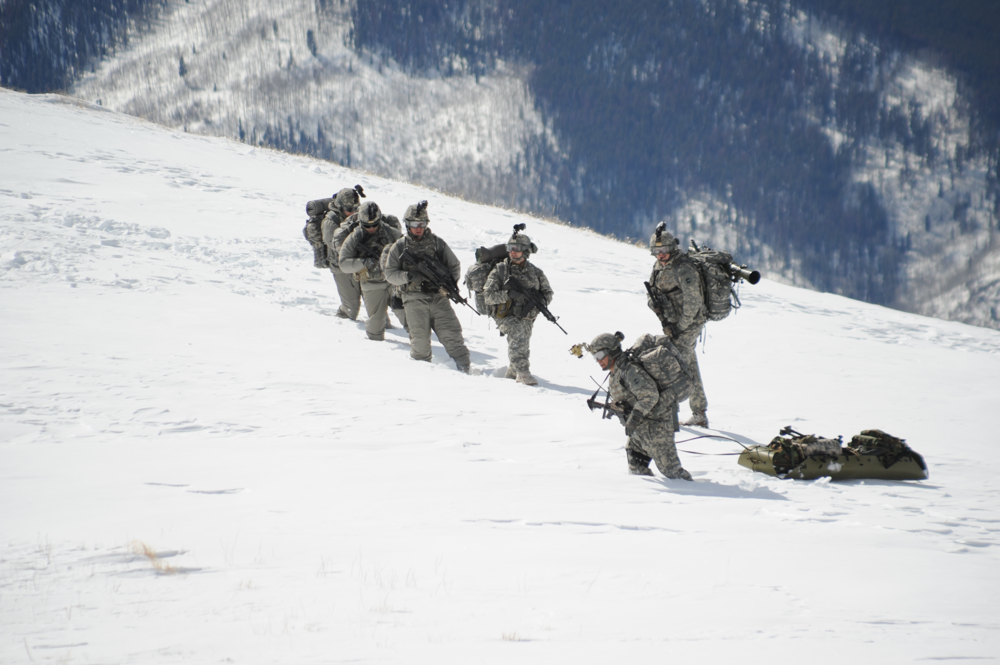
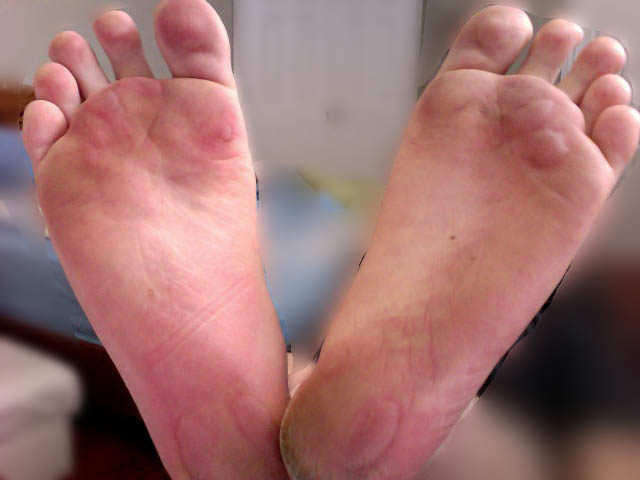
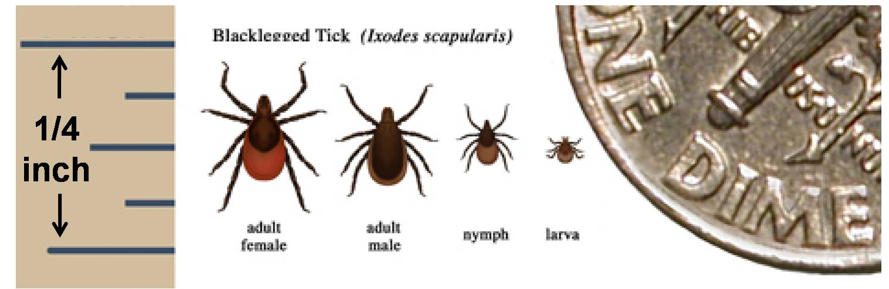

# Clothing, Footwear & Personal Protection

## Read this first (the 30-second version)
1. **Clothing is your first, always-on layer of shelter.** The right clothes prevent hypothermia, heatstroke, sunburn, blisters, insect-borne disease, and injury — before you ever build a fire or a shelter.
2. **Dress in layers you can add or remove:** a snug **base layer** that moves sweat off your skin, a **mid layer** that traps warm air, and an **outer shell** that blocks wind and rain. Take a layer off *before* you sweat through it, add one back *before* you start shivering.
3. **Avoid cotton against your skin in cold or wet conditions.** Cotton soaks up sweat/rain, stays wet, and pulls heat out of your body 25x faster than dry air — "cotton kills." Wool and synthetics (polyester, nylon, fleece) stay warm even damp.
4. **In heat, cover up loosely instead of stripping down:** loose, light-colored, breathable, long-sleeved clothing plus a wide-brim hat and sunglasses blocks sun and reflects heat better than bare skin does.
5. **Take care of your feet like they're the whole mission** — because they are. Well-fitted boots, the right sock system, and treating a "hot spot" the moment you feel it (not after it's already a blister) keeps you mobile.
6. **Stay dry, or get dry fast.** Wet clothing (from rain, sweat, or a stream crossing) is a leading cause of hypothermia even in mild weather. Have a rain layer, and know how to dry clothes without a dryer.

The rest of this guide walks through every layer of the system, hot- and cold-weather specifics, foot care, gloves/eyes/masks, tick and insect protection (important in North Texas), drying clothes without power, and field-repairing what you've got.

---

## Why this matters
Your skin and core body temperature can only tolerate a narrow range before things go wrong fast. Clothing is the layer of "shelter" that travels with you every second — it works while you sleep, while you walk, while you wait for help. Get it wrong and you can develop **hypothermia in a 50°F (10°C) rain shower** just as easily as in snow, or suffer **heat exhaustion/heatstroke** in a North Texas August afternoon in the wrong outfit. A single untreated blister can turn a walkable evacuation into an immobile emergency. A tick you never noticed because your pants weren't tucked in can put you in bed for weeks. None of this requires expensive gear — it requires understanding a system and using what you already own correctly.

## Key terms (plain language)
- **Base layer** — the layer against your skin; its job is to move ("wick") sweat away from your body, not to keep you warm.
- **Mid layer** — the insulating layer; its job is to trap a layer of warm air around your body.
- **Outer layer / shell** — the outermost layer; its job is to block wind and shed rain/snow while (ideally) letting some sweat vapor escape.
- **Wicking** — moving moisture (sweat) away from skin into the fabric, where it can evaporate, instead of pooling on your skin.
- **Insulation** — trapped air is what actually keeps you warm; the material (down, wool, synthetic fill) just holds the air still.
- **"Cotton kills"** — a survival saying backed by NIOSH/CDC cold-stress guidance: cotton absorbs and holds many times its weight in water, dries very slowly, and loses almost all insulating value when wet — while wool, silk, and most synthetics keep most of their insulating value even wet. Water (and wet fabric collapsed against skin) conducts heat away from the body roughly 25 times faster than still air, which is why a wet cotton layer chills you so much faster than the same fabric dry.
- **Vapor barrier liner (VBL)** — a waterproof layer (e.g., a plastic bag) worn between two sock or glove layers in cold conditions; it stops sweat from soaking your insulation, at the cost of a damp layer directly against skin.
- **Hypothermia** — dangerously low core body temperature; see the [First Aid guide](../first-aid/first-aid.md) for recognizing and treating it. This guide covers *prevention through clothing only*.
- **Heat exhaustion / heatstroke** — dangerous overheating; see [First Aid](../first-aid/first-aid.md) for treatment. This guide covers *prevention through clothing only*.
- **Hot spot** — a spot of friction/rubbing on your foot that feels warm, tender, or reddened — the warning sign right before a blister forms.
- **Permethrin** — an insecticide made to be applied to **clothing and gear** (not skin) that kills and repels ticks and mosquitoes and stays effective through several washes.
- **DEET** — an insect repellent applied to **exposed skin** (and some clothing) that repels (but doesn't kill) mosquitoes and ticks.
- **Respirator / dust mask rating** — a numeric/letter rating (e.g., N95) describing what percentage and type of airborne particles a mask filters; covered here at the clothing/PPE level only.

---

# PART 1 — THE LAYERING SYSTEM

**Core idea:** you build warmth and dryness out of separate layers you can add, remove, or swap — not one thick garment. This works whether you own expensive outdoor gear or only what's in a closet. NIOSH's own cold-stress guidance for outdoor/cold workers recommends **at least three layers of loose-fitting clothing** for exactly this reason — loose layers trap air better than one tight garment, and you can shed or add a layer as conditions change.

*Figure — A soldier wearing the US Army's Generation III Extended Cold Weather Clothing System (ECWCS), a 7-layer kit (base, mid, and shell pieces mixed and matched) rated from 40°F down to -60°F. The same base/mid/shell logic works with ordinary closet clothing — you don't need military gear to use the system. Source: Wikimedia Commons (File:Generation III Extended Cold Weather Clothing System (GEN III ECWCS) (4997093828).jpg), US Army Program Executive Office Soldier, CC BY 2.0.*

## Layer 1 — Base layer (next to skin)
**What it does:** Moves sweat off your skin so you don't sit in a wet layer and lose heat. NIOSH specifically calls out this layer's job as keeping moisture away from the body, not providing warmth.

**You need:** A snug (not tight) shirt and underwear/long johns.
- **Best fabrics, concretely:** merino wool (warm even wet, resists odor); **polypropylene** (the fabric NIOSH names first for cold-stress base layers — very light, wicks well, but melts/burns easily near fire, so keep it away from flames and sparks); polyester or nylon "wicking" athletic/thermal underwear; silk (good wicking, less durable, no odor resistance).
- **Improvised substitute:** any synthetic athletic shirt you already own works; a silk or synthetic-blend dress shirt is next best.
- **Avoid:** 100% cotton T-shirts and cotton underwear in cold or wet conditions — they hold sweat against your skin and, per NIOSH, lose essentially all insulating value once wet.

## Layer 2 — Mid layer (insulation)
**What it does:** Traps warm air around your body. Thicker/looser (not tighter) generally traps more air — but layered thin garments beat one thick one because you can adjust. NIOSH's guidance for this layer: wool, fleece, or synthetic fill that keeps insulating **even when wet** — a property cotton sweaters and cotton batting do not have.

**You need:** fleece, wool sweater, down or synthetic-fill jacket/vest.
- **Improvised substitute:** Multiple thinner shirts/sweaters layered; a wool blanket poncho (cut a head-hole, or pin it); stuff dry leaves, dry grass, or newspaper **between two shirts** for a genuinely effective emergency insulation layer (classic and it works — trapped air is trapped air).
- **How much:** Add layers until warm at rest, then remove one right as you start moving/working (you'll warm up from effort) to avoid sweating through everything.
- **Note on down:** down (natural or synthetic-fill) insulates extremely well per ounce but **loses almost all loft and warmth when wet** — treat a down layer like the mid layer needing the most protection from rain/snow, or choose a synthetic-fill (e.g., PrimaLoft-type) jacket instead if you expect to get wet.

## Layer 3 — Outer shell (wind/rain protection)
**What it does:** Blocks wind (which strips heat fast off skin/clothes) and sheds rain/snow so the inner layers stay dry. NIOSH's guidance: this layer should allow **some ventilation** to prevent overheating while blocking wind/rain — a fully sealed, non-breathing shell just traps sweat instead of blocking weather.

**You need:** a rain jacket, windbreaker, or poncho.
- **Improvised substitute:** a large **contractor-grade trash bag** with head- and arm-holes cut out makes a genuinely usable emergency poncho; a painter's tarp or drop cloth works as a rain cape; a car's vinyl seat cover or shower curtain in a pinch.
- **Ventilation matters:** even the best shell traps sweat if fully sealed. Unzip, vent, or remove the shell during hard uphill work; put it back on at rest stops or when wind/rain picks up.
- **Fit note:** NIOSH also flags that **tight-fitting clothing at any layer reduces blood circulation to the extremities**, making hands and feet colder faster — layers should be snug-to-loose, never constricting, especially at cuffs, boot tops, and waistbands.

## Putting it together — a simple decision table

| Condition | Base | Mid | Outer |
|---|---|---|---|
| Cool, dry, active | Wicking shirt | none or light fleece | none (windbreaker in pocket) |
| Cold, dry | Wicking base | Fleece + insulated jacket | Windbreaker if breezy |
| Cold + wet/rain/snow | Wicking base (NOT cotton) | Wool/synthetic mid | Waterproof shell — mandatory |
| Hot, dry, sunny | Loose light long-sleeve | none | Wide-brim hat, sun shirt |
| Hot, humid (North Texas summer) | Loose light wicking long-sleeve | none | none; carry rain shell for storms |

> ⚠️ **Change layers before you need to, not after.** Add a layer before you start shivering; remove one before you soak your base layer in sweat. Reacting after the fact means you're already cold or already wet.

---

# PART 2 — HOT-WEATHER CLOTHING (critical for Texas heat)

**Counter-intuitive but true: covering up loosely often beats stripping down.**

- **Loose fit, not tight.** Loose clothing lets air circulate against your skin and evaporate sweat; tight clothing traps heat.
- **Light color.** Light/white reflects sun; dark colors absorb heat.
- **Lightweight, breathable fabric.** Lightweight cotton or linen is actually fine and even preferred in dry heat (it holds a little sweat and cools you by evaporation) — the "cotton kills" rule is specifically about cold/wet conditions, not hot/dry ones. In hot, **humid** conditions (typical North Texas summer), a lightweight synthetic wicking fabric performs better because sweat can't evaporate as easily in humid air.
- **Cover skin rather than exposing it.** Long, loose sleeves and pant legs (rolled down, not up) block direct sun better than bare skin — this both prevents sunburn and reduces the total heat your skin absorbs from direct sunlight.
- **Head and eyes:**
  - A **wide-brim hat** shades your face, ears, and neck (a ball cap does not protect your ears/neck — add a bandana or "legionnaire" flap if that's all you have).
  - **Sunglasses** (UV-blocking) prevent eye strain and long-term sun damage, especially with reflective surfaces (water, concrete, snow).
  - A **light-colored bandana or buff** around the neck can be wetted to help cool you (evaporative cooling on the big neck arteries).
- **Sunscreen** on any exposed skin (face, ears, back of neck, hands), reapplied every 2 hours or after sweating heavily — treat as part of your "clothing system" for any skin you can't cover.
- **What NOT to do:** don't work bare-chested/bare-legged in direct sun for hours thinking it "cools you down" — you'll sunburn and absorb more direct radiant heat than if covered.

## North Texas heat notes
Anna/Collin County summers regularly hit 100°F+ (38°C+) with high humidity — a genuinely dangerous combination because humidity blocks the evaporative cooling your body relies on. Wear the loose/light/covered system above, drink to thirst, and rest in shade during the hottest part of the day (roughly noon–5 PM). **Treating heat exhaustion/heatstroke is covered in the [First Aid guide](../first-aid/first-aid.md)** — this section is prevention only.

---

# PART 3 — COLD-WEATHER CLOTHING

- **Trap air, don't just add weight.** Several loose, thin layers trap more warm air than one thick garment squeezed tight.
- **Cover extremities — they lose heat fastest and first show cold injury (frostbite/frostnip):**
  - **Head:** a knit hat or hood; a large share of body heat is lost through an uncovered head/neck in cold wind.
  - **Hands:** insulated gloves or mittens (mittens are warmer than gloves — fingers share warmth); a thin liner glove under a mitten lets you do fine work briefly without exposing bare skin.
  - **Feet:** wool or synthetic socks (see Part 4), boots sized to allow a layer of socks without cutting off circulation.
  - **Neck/face:** a scarf, buff, or balaclava — the neck carries major blood vessels close to the skin.
- **Avoid sweating.** Sweat-soaked clothing loses insulating value and then chills you as it evaporates/refreezes. Vent (unzip, remove a layer, push back a hood) *before* you start sweating during exertion; re-layer immediately at rest.
- **Damp = danger.** Wet cold clothing (from snow melting against you, rain, or sweat) conducts heat away from your body far faster than dry clothing or even bare dry skin against cold air. Change out of wet layers as soon as practical.
- **Sleeping/resting cold:** put on your warmest dry layers before you get cold, not after — it's much harder to rewarm than to stay warm. See the [Shelter guide](../shelter/shelter.md) for staying warm overnight without power.
- **Improvised cold insulation:** newspaper, dry leaves, dry grass, or straw stuffed between two shirts or into boots; wrap feet in plastic bags between two sock layers to add a vapor barrier that keeps socks drier (classic "vapor barrier liner" trick — socks get damp from sweat but boots/outer socks stay dry).

---

# PART 4 — RAIN AND WET PROTECTION

**Staying dry is staying alive — even in "mild" weather.** Most hypothermia cases happen in cool (not freezing), wet, windy conditions because wet skin/clothing plus wind strips heat far faster than dry cold air.

1. **Always carry or improvise a rain shell** (see Part 1, Layer 3) — a poncho, jacket, or trash-bag poncho.
2. **Protect what's under the shell first:** if rain starts, cover your torso/core before worrying about arms/legs — protecting the body's core buys you the most time.
3. **Keep a dry set aside.** If you have any spare dry clothing, keep it sealed in a plastic bag specifically to change into once you're out of the rain/at camp — never "save" it by wearing it in the wet and hoping it stays dry.
4. **Boots and wet feet:** wet feet for extended periods risk "trench foot" (painful, disabling skin breakdown from prolonged wet/cold). Change socks when they get wet if you have spares; if not, wring them out and keep moving to generate heat, and dry them at the first opportunity (Part 7).
5. **Wind + wet is the worst combination.** If both are present, prioritize shelter (getting out of the wind) over almost anything else — see the [Shelter guide](../shelter/shelter.md).

> ⚠️ Do not wait until you're already shivering or soaked to act. Put the rain shell on **before** the downpour, not during it.

---

# PART 5 — FOOT CARE AND BLISTER PREVENTION

Feet are how you get anywhere on foot in an emergency — evacuating, fetching water, checking on neighbors. Protect them like the priority they are.

## Fit and footwear basics
- **Boots/shoes should fit with room to wiggle toes but not slide at the heel.** Too tight causes blisters and circulation problems; too loose causes rubbing and blisters from slippage.
- **Break in new footwear before you need to rely on it** — never start a long walk in brand-new, unworn boots.
- **Check footwear for hidden damage:** a worn insole, a loose seam, or a stone/twig inside can cause a hot spot within minutes.

## The sock system
- **Wear a thin wicking liner sock (polyester or nylon) under a thicker cushioned wool or synthetic sock.** The two layers rub against *each other* instead of against your skin, dramatically reducing blister-causing friction. This is the single best low-cost blister prevention trick, and it costs nothing if you already own two pairs of different-weight socks.
- **Avoid cotton socks** for the same reason cotton is bad elsewhere — they hold sweat, stay damp, and soften/weaken skin (making blisters more likely), plus they lose insulating value when wet.
- **Change socks when they get wet or when you take a break, if you have spares.** Dry the wet pair (Part 7) draped over a pack or tucked inside your shirt to dry with body heat while you walk.
- **Cold + wet feet specifically:** a plastic-bag vapor barrier liner between two sock layers (Part 3) keeps the outer sock and boot interior dry even though the inner sock stays damp with sweat — a worthwhile trade-off on multi-day cold treks with limited dry sock supply.
- **Keep toenails trimmed straight across** — long or jagged nails cause blisters and jam painfully into boot toes on descents.

## Preventing blisters — do this BEFORE you feel pain
- At the first sign of a **hot spot** (a warm, tender, or reddened patch — before any blister forms), **stop immediately** and address it. Do not "walk it off" — that's exactly how a hot spot becomes a blister.
- **Cover the hot spot** with one of:
  - **Moleskin or blister pad**, cut larger than the hot spot, applied to clean dry skin (donut-shaped padding around it works well if you have a blister already).
  - **Duct tape or athletic tape** directly over the spot, smoothed flat with no wrinkles (a wrinkle becomes a new friction point).
  - A **thin layer of a lubricant** (petroleum jelly, lip balm) at the very first sign of friction, before taping, on spots that rub repeatedly (heels, between toes).
- **Reduce the cause, not just the symptom:** re-lace boots differently to shift pressure, add a second sock, or loosen/tighten the fit.

## If a blister has already formed

*Figure — Friction blisters on the sole/heel of a human foot, the classic result of an untreated hot spot. Source: Wikimedia Commons (File:Friction Blisters On Human Foot.jpg), AndryFrench, CC BY 3.0.*

- **Small, unbroken blister:** leave it intact if possible (the skin is a natural bandage) — pad around it with a moleskin donut so nothing presses directly on it, and keep moving carefully.
- **Large or painful blister you must keep walking on:** it may need draining to relieve pressure — this crosses into wound care. See the [First Aid guide](../first-aid/first-aid.md) for safely draining and dressing a blister and watching for infection. This guide's job is prevention; treat infection signs (increasing redness, warmth, pus, red streaking, fever) as a first-aid emergency.
- **After the day:** air feet out, dry socks and boot insoles fully overnight if possible (Part 7), and inspect for developing hot spots before the next day's activity.

---

# PART 6 — GLOVES, EYE PROTECTION, AND MASKS/RESPIRATORS (PPE LEVEL)

Debris, wreckage, downed trees, broken glass, and dust are common after storms, floods, and other North Texas hazards (tornadoes, ice storms). Basic PPE prevents cuts, punctures, and eye/lung injury while you do necessary work.

## Gloves
- **Work/debris gloves:** thick leather or reinforced work gloves protect against cuts, splinters, and punctures when clearing debris, handling downed branches, or working with tools/wire. Keep a pair staged with your emergency supplies.
- **Cold-weather gloves/mittens:** see Part 3 — insulated, and ideally with a water-resistant outer layer.
- **Improvised substitute:** thick leather work boots' tongues, folded cardboard-reinforced cloth, or multiple layers of heavy fabric taped at the wrist can substitute briefly for real work gloves, though they wear through fast — replace with real gloves as soon as available.
- **Disposable nitrile/latex gloves** protect against contamination (sewage, chemicals, blood) during cleanup or first aid — see [Hazmat & Contamination](../hazmat-contamination/hazmat-contamination.md) and [First Aid](../first-aid/first-aid.md) for when these are specifically required.

## Eye protection
- **Safety glasses/goggles** protect against flying debris (chainsaw work, chipping/breaking material, high wind carrying grit) and dust.
- **Improvised substitute:** any snug wraparound sunglasses; swim goggles for dust/wind; even a bandana held with a hand to shield eyes briefly from wind-driven dust.
- Always use eye protection when using power tools, hand tools under load, or working near broken glass/debris fields.

## Masks and respirators — clothing/PPE level only
This section covers **what kind of mask to reach for and its limits**; actual use during smoke or hazmat events is covered in the linked guides.

| Mask type | Blocks | Does NOT block | Use for |
|---|---|---|---|
| Cloth bandana/mask | Large dust/debris only | Small particles, smoke, chemical fumes, viruses well | Light dust, brief exposure only |
| Dust mask (basic, no rating) | Larger nuisance dust (sawdust, drywall) | Fine smoke particles, chemical vapors | Sanding, sweeping, light debris cleanup |
| **N95 (or better, e.g. N100)** | ≥95% of small airborne particles when properly fitted (mold spores, fine dust, much wildfire smoke particulate) | **Gases, chemical vapors, carbon monoxide** — an N95 does NOT protect against smoke gases or CO; it only filters particulates | Mold remediation, fine dust, wildfire smoke particulate (short-term) |
| Full/half-face respirator with cartridges | Specific gases/vapors per the cartridge rating (must match the hazard) | Whatever the cartridge isn't rated for | Chemical spills, heavy fumes — see [Hazmat & Contamination](../hazmat-contamination/hazmat-contamination.md) |

> ⚠️ **An N95 mask does not protect you from carbon monoxide, natural gas, or most chemical fumes.** If you smell gas or suspect CO, a dust/N95 mask gives false confidence — leave the area and ventilate/evacuate instead. See [Fire, Smoke & Air Emergencies](../fire-smoke-air-emergencies/fire-smoke-air-emergencies.md) and [Hazmat & Contamination](../hazmat-contamination/hazmat-contamination.md) for smoke/chemical response.
- **Fit matters as much as rating.** A gap around the nose/cheeks (facial hair, wrong size) lets unfiltered air in around the filter — the mask is only as good as its seal.
- **Improvised substitute (weak, last resort):** several layers of tightly-woven cotton (T-shirt, bandana) over nose/mouth reduces large-particle dust inhalation somewhat but is far inferior to an N95 and provides essentially no protection from smoke gases or chemical vapors.

---

# PART 7 — INSECT AND TICK PROTECTION (IMPORTANT IN NORTH TEXAS)

Blackland prairie, tall grass, brush, and warm humid weather make Collin County/North Texas good habitat for ticks (which carry diseases like ehrlichiosis and Rocky Mountain spotted fever) and mosquitoes (West Nile virus) especially spring through fall (CDC notes ticks are most active roughly April–September, but check clothing/pets year-round in mild winters). **This section covers prevention through clothing; treating bites and tick-borne illness is covered elsewhere (see below).**

*Figure — Relative size of adult male, adult female, nymph, and larval blacklegged/deer ticks (Ixodes scapularis) compared to a US dime. Nymphs (the size of a poppy seed) cause most tick-borne disease because they're hardest to spot — this is exactly why light-colored clothing and thorough tick checks matter more than trying to spot ticks by eye alone. Source: Wikimedia Commons (File:Deer tick Ixodes scapularis.jpg), CDC, public domain (US government work).*

## Clothing-based prevention (your first line of defense)
1. **Wear long sleeves and long pants** when walking through grass, brush, or wooded areas, even in warm weather — pair with the loose/light-colored heat-management approach from Part 2 to stay reasonably cool. CDC also recommends closed-toe shoes/boots over sandals in tick habitat.
2. **Tuck your pant legs into your socks or boots, and tuck your shirt into your pants.** This closes the gaps ticks use to reach skin, forcing them to crawl on the outside of clothing where you can see and remove them. Ticks cannot fly or jump — they only get on you by climbing up from ground level or grass, so blocking that route at the ankle stops most of them before they ever reach skin. Watch for over-stretched socks creating tick-sized gaps in the weave — a snug sock or a rubber band around the tuck point closes this loophole.
3. **Wear light-colored clothing** — makes small dark ticks (especially nymphs, roughly poppy-seed sized) much easier to spot before they reach skin.
4. **Stay in the center of trails/mowed paths** and avoid brushing against tall grass or low branches when you have a choice — ticks wait on vegetation tips and grab on as you pass ("questing"), they don't jump onto you.

## Permethrin — treat the clothing, not the skin
- **What it is:** an insecticide made specifically for fabric and gear, not skin. Kills ticks and mosquitoes on contact (not just repels them) and remains protective through **several washings** (CDC guidance) — check the specific product label for its stated number of washes (commonly 6 or more for consumer sprays; factory-treated garments are often rated 70+ washes over the garment's life).
- **Concentration:** CDC references **0.5% permethrin** products for treating boots, clothing, and camping gear yourself; you can also buy clothing/gear pre-treated with permethrin from the factory.
- **How to use:** spray pants, socks, shirts, and boots (especially cuffs, sock tops, and waistband — the areas ticks target first) per the product label, applying **outdoors or in a well-ventilated area**, then let dry fully (per EPA, allow the treated item to dry completely) before wearing or bringing indoors.
- **Wash permethrin-treated clothing separately** from untreated clothing — EPA notes small amounts of permethrin can transfer in the wash.
- **Do NOT apply permethrin to skin, and do not apply it to clothing while you're wearing it** — it's strictly a fabric/gear treatment, applied to garments laid out or hung up.

## DEET and other EPA-registered skin repellents
- Apply an EPA-registered repellent to exposed skin (face, neck, hands, ankles if not covered) per the product label's concentration and reapplication interval.
- **DEET:** CDC/EPA guidance points to **20–30% DEET** as the effective range for both mosquitoes and ticks — efficacy plateaus above roughly 50% (higher concentrations don't protect much longer, they just start with a longer buffer). Reported protection windows run **about 2–10 hours against ticks and 2–12 hours against mosquitoes**, depending on concentration and sweat/water exposure — ticks often need **more frequent reapplication** than mosquitoes at the same DEET strength. Follow the product label's reapplication interval; don't exceed the labeled frequency even if bites resume sooner.
- **Other EPA-registered options** (if DEET isn't available or preferred): **picaridin, IR3535, oil of lemon eucalyptus (OLE), PMD (para-menthane-diol), and 2-undecanone** — all are EPA-registered as safe and effective against ticks/mosquitoes when used per label. Picaridin and DEET are generally rated most effective for ticks specifically.
- Permethrin-treated clothing plus an EPA-registered repellent (DEET or an alternative above) on exposed skin together is the standard, most effective combination — each protects a different exposure (fabric-contact vs. bare skin).

## Tick checks — do this every time you come in from grass/brush
1. **Check your whole body**, focusing on warm, hidden spots ticks prefer: scalp/hairline, behind ears, armpits, waistband, groin, behind knees, and between toes. A hand mirror or a second person helps check your back and scalp.
2. **A lint roller works well** for rolling over skin, clothing, and gear to pick up unattached ticks you can't easily see or feel — CDC recommends this as a quick supplemental check.
3. **Check clothing too** before it goes back in the closet — a tick can ride in on fabric and bite later. **To kill ticks already on dry clothing, tumble dry on high heat for 10 minutes** (CDC guidance) — if clothing is damp, dry it longer before adding any wash cycle, since ordinary washing (hot or cold) does **not** reliably kill ticks on its own; the dryer's dry heat is what kills them, so dry first, then wash if needed.
4. **Check pets** after they've been outside; they can carry ticks into the home and onto you or other family members.
5. **Do this daily** during tick season if you're regularly outdoors, and immediately after any brush/grass/woods activity.
6. If you find an attached tick, **removal technique and watching for illness is covered in [First Aid](../first-aid/first-aid.md) and [Animal & Insect/Pest Hazards](../animal-insect-pest-hazards/animal-insect-pest-hazards.md)** — this guide's role stops at prevention.

---

# PART 8 — KEEPING CLOTHING DRY AND DRYING IT WITHOUT POWER

Wet clothing you can't dry becomes a repeating hypothermia/trench-foot/blister risk. Drying without a machine is slow but very doable.

## Prevention (easier than drying)
- Pack a spare set of clothes/socks in a **sealed plastic bag** inside your pack — guarantees at least one dry set regardless of what happens outside.
- Put on your rain shell **before** it starts raining, not after you're already wet (Part 4).
- At water crossings, remove socks/boots if feasible and cross barefoot or in dedicated water shoes, keeping your main socks dry.

## Drying methods without electricity
1. **Sun and wind (fastest free method):** hang clothing spread out (not bunched) in direct sun and moving air; turn periodically. A single warm, breezy North Texas afternoon dries most clothing in a few hours.
2. **By a fire — carefully:** hang clothing on a rack, line, or stick well back from open flame, and **never leave it unattended** — synthetic fabrics can melt and everything can scorch or catch fire faster than expected. Rotate frequently.
3. **Body heat:** wet socks or a damp base layer tucked inside your outer layer, against your torso, will dry using your own body heat while you keep moving — a good method for socks specifically during a march (this is uncomfortable briefly but effective; don't do it with soaking-wet items that would chill you, only damp ones).
4. **Wring and shake first, always** — remove as much water as possible before any drying method to cut drying time dramatically. Roll the item in a dry towel or cloth and press/twist to pull out extra moisture before hanging.
5. **Rotate a system:** if you only have one set of dry socks, wear the dry pair while the wet pair dries (sun/fire/body heat), then swap.

> ⚠️ Never dry clothing draped directly on a hot surface (engine block, stovetop, coals) unattended — scorching and fire risk. Keep a supervised distance.

---

# PART 9 — REPAIRING AND MAINTAINING CLOTHING AND FOOTWEAR

Gear that fails (a torn seam, a soaked-through boot, a lost button) becomes a real problem when stores are closed and there's no replacement. Basic field repair extends the life of what you have. Full sewing/cordage technique lives in [Tools, Knots & Repair](../tools-knots-repair/tools-knots-repair.md) — this section covers clothing-specific fixes.

## Patching tears and holes
- **Duct tape** is the fastest field patch for a torn jacket, ripped pack strap, or split boot seam — apply to clean, dry fabric, overlapping the tear on both sides.
- **Sewing kit (needle + thread):** a simple whip-stitch or running stitch closes fabric tears; reinforce with a second pass. Use heavier thread (or doubled thread) for load-bearing seams like pack straps or boot uppers.
- **Iron-on or sew-on fabric patches** for known wear points (knees, elbows, seat) extend garment life proactively before a full blowout.

## Re-waterproofing
- **Boots/leather:** clean off dirt, let dry, then apply a wax-based waterproofing dressing (or melted candle wax/beeswax rubbed in and warmed slightly to help it soak in) to seams and the upper leather. Reapply whenever water starts soaking in rather than beading up.
- **Jackets/rain shells:** older waterproof fabric loses its water-beading finish over time (water soaks in and "wets out" the fabric surface even if it doesn't leak through) — washing per the garment's care instructions and applying a spray-on or wash-in waterproofing treatment restores it.
- **Improvised waterproofing:** a layer of plastic (trash bag) between socks, or worn as an outer shell (Part 1), sidesteps the need to waterproof the garment itself.

## Improvised insulation and emergency repair
- Stuff **dry leaves, grass, straw, or newspaper** between layers of clothing for emergency insulation (Part 3) when your actual insulating layer is lost, wet, or insufficient.
- A **torn sock** can be temporarily fixed by rotating the hole to the top of the foot (away from pressure points) or doubling up with another sock over it until repaired.
- **Broken bootlace:** re-lace using a shorter pattern skipping the broken section, or replace with cordage/paracord — see [Tools, Knots & Repair](../tools-knots-repair/tools-knots-repair.md) for cordage techniques.
- **Missing buttons/zipper failure:** safety pins, paperclips, or a cord tied through buttonholes can hold a garment closed well enough to maintain its wind/rain protection until properly repaired.

---

# North Texas / regional notes
- **Summer (roughly May–September):** heat and humidity are the dominant risk — follow the loose/light/covered system in Part 2, and prioritize a wide-brim hat and sun protection. Sudden severe thunderstorms are common; keep a rain shell accessible even on a hot day.
- **Spring/fall:** tick and mosquito season peaks in tall grass and brush common on rural Collin County properties — apply Part 7's clothing-based prevention routinely, not just for "the woods."
- **Winter ice storms:** North Texas ice storms bring cold, wet conditions with power outages — the cold-and-wet combination in Part 3/4 (layering plus a waterproof shell) is exactly the scenario that causes hypothermia here, often in people who assume "it's Texas, it won't get that cold." Keep real cold-weather layers on hand even in a generally hot climate.
- **Flash flooding:** if you must move through floodwater, treat any submerged clothing/footwear as contaminated afterward (sewage, chemicals) — see [Hazmat & Contamination](../hazmat-contamination/hazmat-contamination.md) and wash/dry thoroughly per Part 8.
- **Debris after tornadoes/storms:** work gloves, sturdy boots, and eye protection (Part 6) are essential before touching downed trees, damaged structures, or broken glass — see [Home & Structural Assessment](../home-structural-assessment/home-structural-assessment.md)-adjacent hazards.

---

# ⚠️ Safety — the most important warnings
- **Cotton against skin in cold or wet conditions can kill you** — it stays wet, stops insulating, and actively pulls heat from your body. Save cotton for hot, dry conditions.
- **Change layers before you need to.** Waiting until you're shivering (cold) or soaked in sweat (heat/cold) means you're already behind.
- **Wet + wind is the most dangerous combination** for hypothermia, even in "mild" temperatures well above freezing — prioritize a dry outer shell and getting out of wind.
- **Address a hot spot on your foot immediately** — walking through it is how blisters form, and a disabling blister can end your ability to evacuate on foot.
- **An N95/dust mask does not protect against smoke gases, carbon monoxide, or chemical fumes** — do not rely on it in a gas leak, fire smoke, or hazmat situation; leave the area instead.
- **Apply permethrin to clothing/gear only, never directly to skin;** apply an EPA-registered repellent (DEET, picaridin, IR3535, OLE, or PMD) to skin instead, following label directions and reapplication intervals on both.
- **Do a full-body tick check every time** after time in grass/brush — most tick-borne illness is far more preventable through this habit than through treatment after the fact.
- **Never dry clothes unattended directly over an open flame or hot engine** — fire and scorching risk.
- This guide is for **prevention** only — for actual treatment of hypothermia, heat illness, blisters that have become infected, or tick-borne illness, go to the [First Aid guide](../first-aid/first-aid.md) immediately; these are medical emergencies once symptoms appear.

# Troubleshooting
| Problem | Fix |
|---|---|
| No proper rain shell available | Cut head/arm holes in a heavy-duty trash bag, tarp, or drop cloth for an emergency poncho. |
| Only cotton clothing available in cold/wet weather | Layer it as your outermost/driest layer only if truly nothing else exists; prioritize keeping it dry, change out the moment it's wet, and add improvised insulation (leaves/grass/newspaper) between layers. |
| Feet getting hot spots/blisters on a long walk | Stop immediately, tape/pad the spot before it worsens, adjust lacing or add a liner sock. |
| Boots soaked through | Wring/dry socks separately (sun, fire-safe distance, or body heat); waterproof boots with wax-based dressing once dry; use a plastic-bag vapor barrier over socks in the meantime. |
| No insulated gloves in cold weather | Layer socks or extra fabric as improvised mittens; keep hands in pockets/sleeves when not working. |
| No N95 masks during dusty cleanup | Use the best-fitting dust mask available; several tight cotton layers as a last resort for large particles only — but leave the area if you smell gas/chemicals regardless of mask. |
| Found an attached tick | Do not panic-pull incorrectly — see [First Aid](../first-aid/first-aid.md) for correct removal and watching for illness. |
| Unsure if ticks survived on clothing you wore outside | Tumble dry on high heat for 10 minutes (longer if damp) — this kills ticks; a regular wash cycle alone does not. Dry first, then wash if needed. |
| Torn jacket/pack strap in the field | Duct tape patch immediately; sew a reinforced stitch when you have time and a needle/thread. |
| No way to dry wet clothes and rain isn't stopping | Wring out thoroughly, layer a dry item against skin if available, keep moving to generate body heat, and dry fully at the first sun/fire/shelter opportunity. |

# Quick-reference checklist
- [ ] Base layer is non-cotton (or cotton is intentional, for hot/dry conditions only).
- [ ] Mid layer(s) staged to add/remove as temperature and effort change.
- [ ] Rain/wind shell available and put on **before** conditions turn, not after.
- [ ] Hot weather: loose, light-colored, long-sleeve clothing plus wide-brim hat and sunglasses.
- [ ] Boots fit properly, broken in, and paired with a liner + cushioned sock system.
- [ ] Hot spots treated (taped/padded) the moment they're felt — not after they blister.
- [ ] Work gloves and eye protection staged for debris/tool work.
- [ ] Correct mask type on hand, with its limits (no CO/gas protection) understood.
- [ ] Permethrin (0.5%) on clothing/gear, EPA-registered repellent (20–30% DEET or equivalent) on exposed skin, pants tucked into socks, tick checks (plus a lint roller pass) after every grass/brush exposure.
- [ ] Worn clothing from tick habitat tumble-dried on high heat 10 minutes before washing.
- [ ] Spare dry clothing/socks sealed in plastic in your pack.
- [ ] Basic repair kit (needle/thread, duct tape, spare laces) on hand.

# Sources & further reading (in this knowledge base)
- **US Army Survival Manual FM 21-76** — `reference/manuals/fm21-76_survival_manual.pdf` (clothing, cold/hot weather protection).
- **American Red Cross Preparedness Guide** — `reference/manuals/redcross_preparednessguide.pdf` (personal supplies and protective clothing).
- **FEMA "Are You Ready?"** — `reference/manuals/are-you-ready-guide.pdf` (general preparedness including clothing/PPE).
- **CDC emergency preparedness foundations** — `reference/manuals/cdc_emergency_foundations.pdf` (heat/cold illness prevention guidance).
- **NIOSH Fast Facts: Protecting Yourself from Cold Stress** — `reference/manuals/niosh_cold_stress_fast_facts.pdf` (the 3-layer base/mid/outer system, fabric guidance, and the cotton-vs-wet-insulation science behind Parts 1 and 3; also at cdc.gov/niosh/cold-stress).
- **Connecticut Agricultural Experiment Station — Tick Checks and Use of Insect Repellents** — `reference/manuals/ct_caes_tick_checks_repellents_factsheet.pdf` (permethrin/DEET concentrations, application, and tick-check technique behind Part 7).
- **CDC — Preventing Tick Bites** (cdc.gov/ticks/prevention) and **EPA — Repellent-Treated Clothing / Find the Repellent That's Right for You** (epa.gov/insect-repellents) — current federal guidance on permethrin concentration/wash durability, EPA-registered skin repellents (DEET, picaridin, IR3535, OLE, PMD), and the tumble-dry tick-kill method in Part 7.
- **Primitive Skills and Crafts** — `reference/manuals/Primitive_Skills_and_Crafts.pdf` (improvised cordage and repair techniques referenced in Part 9).
- See also: [First Aid](../first-aid/first-aid.md) (treating hypothermia, heat illness, blisters, tick bites), [Animal & Insect/Pest Hazards](../animal-insect-pest-hazards/animal-insect-pest-hazards.md) (tick-borne illness), [Fire, Smoke & Air Emergencies](../fire-smoke-air-emergencies/fire-smoke-air-emergencies.md) and [Hazmat & Contamination](../hazmat-contamination/hazmat-contamination.md) (respirator use in smoke/chemical events), [Shelter](../shelter/shelter.md) (staying warm via shelter), and [Tools, Knots & Repair](../tools-knots-repair/tools-knots-repair.md) (sewing, cordage, and repair tools).
