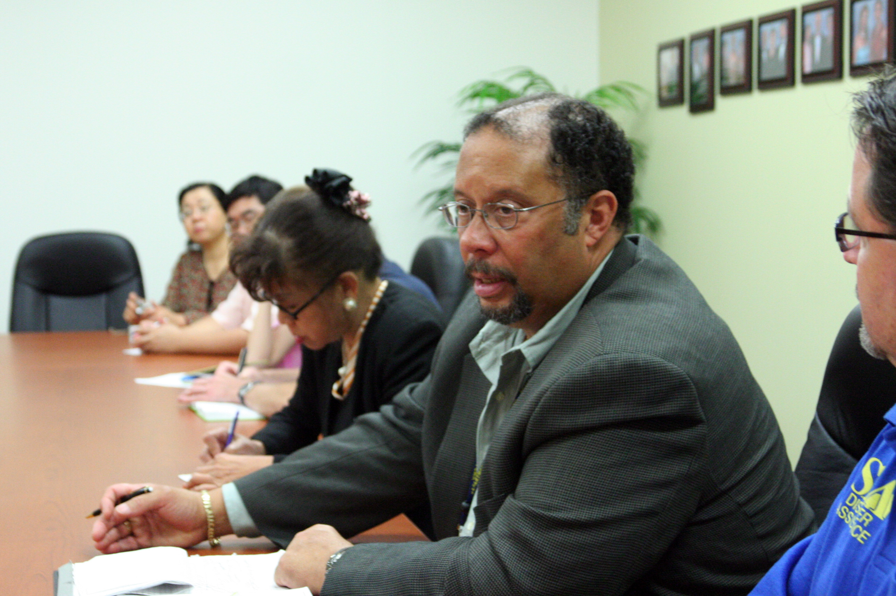

# Community Survival & Mutual Aid — Organizing Neighbors to Get Through a Long Emergency Together

## Read this first (the 30-second version)
1. **You will survive a long disaster better with 15 cooperating neighbors than alone with a bunker full of supplies.** Start talking to neighbors *before* you need them — introductions made during a crisis are far weaker than ones made in calm weather.
2. **Within the first 24–48 hours of any disaster:** knock on doors, especially of elderly, disabled, or isolated neighbors, and hold one short outdoor meeting to share what everyone knows and needs.
3. **Build three things fast:** (a) a simple **roster** of who has what skills/tools, (b) a low-tech **communication plan** (phone tree, radio channel, physical message board) that works with no power or cell service, and (c) a **meeting cadence** (same time, same place, every day or two) so people always know where to find help.
4. **Share infrastructure (water, cooking, sanitation) through clearly assigned rotations, not free-for-alls** — write down who does what and when, so nobody feels used and nobody free-rides.
5. **Prevent conflict before it starts:** agree on ground rules for sharing and decision-making on day one, while everyone is calm and cooperative — not after the first dispute.
6. **This guide is about organizing people, not defending property or triaging patients** — see the [Security & Defense guide](../security-defense/security-defense.md) for protecting your home, the [Psychological First Aid guide](../psychological-first-aid/psychological-first-aid.md) for individual emotional support, and the [Communication guide](../communication/communication.md) for the technical details of radios.

The rest of this guide walks through mapping your neighborhood, standing up communications, running fair shared infrastructure, preventing and resolving conflict, organizing labor, and keeping morale up over weeks — with a ready-to-use first-meeting agenda and a skills/resources roster template.

---

## Why this matters
Disasters are survived at the household level for the first few hours, but almost every real emergency — hurricanes, ice storms, floods, extended power outages, wildfire evacuations — stretches into days or weeks. No household stockpiles everything: one neighbor has a generator and no fuel, another has fuel and no generator; one has medical training, another has small children and no help; one has a working well, another has a working chainsaw. Historically (Hurricane Katrina, the 2021 Texas ice storm/Winter Storm Uri, the 2017 Houston floods from Hurricane Harvey, countless smaller local emergencies), the people who did best in the first days were not the most heavily armed or the most heavily stocked — they were the ones who had **already-organized neighbors** pooling what they had, checking on each other, and dividing the work. Isolated households run out of hands, run out of sleep, and run out of options. A functioning street-level group multiplies everyone's effective resources without anyone giving up what's theirs, and it catches the people who are hardest hit — the elderly person on oxygen, the parent alone with three kids, the neighbor on a fixed income with no truck.

This guide is deliberately **non-authoritarian**: nobody in a neighborhood group has power over anyone else's home, property, or medical decisions. The point of organizing is coordination and mutual support, not command. Good mutual aid runs on transparency, rotation, and consent — not on one person's orders.

## Key terms (plain language)
- **Mutual aid** — neighbors voluntarily helping each other, based on need, without payment or hierarchy (distinct from charity, which flows one direction, and from a business, which is transactional).
- **Block captain / point person** — a volunteer (not a boss) who keeps the roster, runs meetings, and relays messages. Rotate this role; it is a coordination job, not an authority.
- **Phone tree** — a simple chain: you call 2–3 people, each of them calls 2–3 more, so information spreads fast without one person calling everyone.
- **Wellness check** — a short, respectful visit or call to confirm a person is safe, has what they need, and knows how to reach the group.
- **Resource pooling** — combining tools, fuel, food, or skills from multiple households for shared use, tracked so it can be returned or repaid fairly.
- **Work rotation** — a schedule that spreads necessary but tiring jobs (watch duty, hauling water, cooking, childcare) across multiple people so no one person burns out.
- **Mediation** — a neutral third person helping two disputing people talk it through and find a solution, without taking sides or issuing a ruling.
- **Consensus / rough consensus** — a decision most people actively agree with and no one strongly blocks, reached by discussion rather than a vote or an order.
- **Isolated/vulnerable neighbor** — someone at higher risk of being missed or unable to self-rescue: elderly living alone, people with disabilities or mobility limits, people on home medical equipment (oxygen, dialysis, refrigerated insulin), non-English speakers, single parents with no nearby family, and people without a vehicle.
- **Access and functional needs (AFN)** — the standard emergency-management term (used by FEMA and CERT) for anyone who may need extra help before, during, or after a disaster: this includes people with disabilities, older adults, children, people with limited English proficiency, and people without personal transportation or support networks. Using this term when you talk to local emergency management or CERT volunteers helps them understand your neighborhood's needs in language they already use.
- **CERT (Community Emergency Response Team)** — FEMA's standardized model and training course for how ordinary residents organize to help their own neighborhood in the hours before professional responders arrive. This guide borrows CERT's organizing structure (team size, a rotating team leader, and a simple decision process) without requiring anyone to take the full course.
- **Map Your Neighborhood (MYN)** — a structured program (originated by Washington State Emergency Management Division, endorsed by FEMA) that walks a block of 15–20 households through a 9-step immediate disaster-response sequence, a shared skills/equipment inventory, and a map of utility shutoffs — built for the same first-hours problem this guide addresses. See Part 1E–1F.
- **Span of control** — the number of people one coordinator can reasonably direct at once. CERT's rule of thumb is about 5 people per leader, with an acceptable range of 2–7; beyond that, split into a second team with its own point person.
- **OPSEC (operational security)** — being careful about who knows what you have and where, so your group's resources aren't advertised to strangers. See the [Security & Defense guide](../security-defense/security-defense.md).

---

# PART 1 — MAPPING THE NEIGHBORHOOD: SKILLS, RESOURCES, AND VULNERABLE NEIGHBORS

You cannot coordinate help you don't know exists. The very first job — ideally done calmly *before* a disaster, but doable in the first hours of one — is finding out who is on your street and what they have.

**How big should the group be?** FEMA-endorsed Map Your Neighborhood (MYN) guidance, developed by Washington State Emergency Management Division, targets **15–20 households per group in denser urban/suburban areas, or about 6–7 households in rural areas** where homes sit farther apart — small enough that people can realistically know each other and reach each other on foot, large enough to have real combined capability (tools, skills, hands). On larger-lot rural roads, don't wait to hit 15–20 before organizing; group the handful of nearest households. If your street or cul-de-sac is much bigger than that, split it into two or more overlapping groups with their own point person rather than trying to run one unwieldy group; you can still share a phone tree and message board across the larger area.

## 1A. Why map skills and resources at all
In an emergency, the things that save lives and reduce suffering are rarely exotic. They are:
- A neighbor who is a nurse, EMT, veterinarian, or has extensive first-aid training.
- A neighbor with a generator, chainsaw, truck, trailer, propane stove, or well pump.
- A neighbor who is a mechanic, electrician, plumber, or carpenter.
- A neighbor with a working landline, ham radio, or satellite communicator.
- A neighbor with canning/food-preservation skills, large food stores, or livestock.
- A neighbor who speaks a language others don't, and can translate for a non-English-speaking household.
- A neighbor with childcare experience, teaching experience, or who is simply home all day and available.

None of this is useful if it stays private knowledge in each household. A **roster** turns 15 separate households into one team with a much longer list of capabilities than any single house has alone.

## 1B. How to map it — door-to-door, respectfully
1. **Go in pairs if possible** (safer, and less intimidating for the person answering the door).
2. **Introduce yourselves plainly:** "We're trying to get everyone on the street connected so we can help each other out until things are back to normal. Do you have a few minutes?"
3. **Ask open questions, don't interrogate:** "Is everyone in your house doing okay? Do you have water/power? Is there anything you're short on? Is there anything you're able to help with if a neighbor needs it?"
4. **Write it down immediately** (use the roster template in Part 1D) — memory fades fast when you're visiting 15 houses in one afternoon.
5. **Respect "no."** Some people will not want to participate, share information, or be visited. Note the household as "no contact requested" and do not push. Still keep them on a bare-bones list for wellness-check purposes if there's any safety concern (see 1C), and let them opt back in later if they change their mind.
6. **Be mindful of OPSEC.** Don't loudly announce inventories in public ("the Smiths have a full generator and 40 gallons of gas") — record specifics privately in the roster, and when talking with the group, keep language general ("a few households have generators we can call on") unless the owner is fine with specifics being shared.

*Figure — FEMA Community Relations staff and a CERT volunteer conducting door-to-door neighborhood outreach after a disaster, Ft. Pierce, Florida (Hurricane Fay response). Source: Wikimedia Commons (File: FEMA - 38779 - CR Door to Door Outreach in St. Lucie County.jpg), FEMA Photo Library / George Armstrong, public domain (US federal government work).*
This is exactly the format for your own door-to-door roster visits: go in pairs, carry something to write with, and keep the tone conversational rather than official — you're a neighbor checking in, not an inspector.

## 1C. Identifying and prioritizing vulnerable neighbors
As you map the street, flag (privately, respectfully) any household that may need **more frequent** wellness checks:
- Lives alone, especially elderly, with no visible family nearby.
- Visible mobility aids (wheelchair, walker, oxygen tank) or a disabled placard.
- Home medical equipment that needs power (oxygen concentrator, CPAP, dialysis, refrigerated medication like insulin).
- Small children with a single caregiver and no other adult in the house.
- Non-English speakers who may not get emergency information broadcast in English.
- No vehicle, or a vehicle that's clearly not roadworthy.
- Recently mentioned illness, recent surgery, pregnancy, or a new baby.

> ⚠️ Never assume — ask directly and kindly whether a person wants to be on a "check on me" list, and how they'd like to be checked on (knock, call, text). Being on this list is the neighbor's choice, not something decided about them without asking.

## 1D. Skills & Resources Roster Template
Keep one shared roster (paper original plus a photo/copy for two or three households, so no single house losing power or leaving town takes the only copy). Update it whenever anyone joins or a detail changes.

| Household / Contact name | Address / unit | Phone (+ backup contact) | Adults / kids / pets | Medical needs or vulnerabilities | Skills (medical, mechanical, trades, languages, etc.) | Equipment/resources available to share | Wellness-check needed? (Y/N, preferred method) | Notes |
|---|---|---|---|---|---|---|---|---|
| Example: J. Alvarez | 214 Oak Ct | 555-0101 (daughter 555-0199) | 2 adults, 0 kids, 1 dog | Uses oxygen concentrator (needs power) | Retired nurse, Spanish/English | Small generator, first-aid kit | Y — daily knock, prefers morning | Keep generator fuel topped for her unit first if power out |
| Example: T. Nguyen | 216 Oak Ct | 555-0102 | 2 adults, 3 kids | None known | Auto mechanic, owns truck+trailer | Truck, tools, tow strap | N | Available for hauling/transport rotation |
| | | | | | | | | |

**Fields explained:**
- *Skills* — be specific (e.g., "EMT-B certified" vs. just "medical"); specific skills are easier to call on fast.
- *Equipment/resources* — list only what the owner is comfortable sharing; note anything with limits ("generator yes, but I need it back by evening for my own fridge").
- *Wellness-check* — always get explicit consent before listing someone; respect a "no."
- Keep a **duplicate paper copy** in at least two households on the street plus a photo on multiple phones — a single point of failure defeats the purpose.

**What "skills" should actually go on the roster?** Beginners often write down too little ("handy," "medical background") to be useful in the moment. Following the CERT and Map Your Neighborhood inventory model, capture specifics in these categories:
- **Medical/health:** nurse, EMT/paramedic, doctor, dentist, veterinarian, CPR/first-aid certified, home dialysis or oxygen experience, mental-health training.
- **Trades/construction:** electrician, plumber, carpenter, roofer, HVAC, welder — and whether they have their own tools.
- **Mechanical/equipment:** mechanic, generator or small-engine repair, chainsaw operation and ownership, well-pump or septic knowledge.
- **Transportation/hauling:** truck, trailer, 4WD/high-clearance vehicle, boat (for flood areas), extra fuel storage.
- **Communication:** ham radio (call sign) or GMRS/FRS radio owner, landline, satellite communicator.
- **Food/water:** canning or food-preservation skill, livestock or well access, large stored food/water reserves, propane or rocket stove.
- **Care/support:** childcare experience, teaching background, language interpretation, retirees or others reliably home during the day.
- **Security-relevant (record privately, share generally — see OPSEC):** firearms training, prior military/law-enforcement/fire service background, dogs.

## 1E. Mapping utility shutoffs — a detail beginners often miss
While you're mapping skills and resources, also record **where each participating household's main gas meter and main water shut-off valve are located** (a MYN-model addition). This matters because gas and water emergencies are two of the most common and most time-sensitive problems after an earthquake, flood, or pipe failure, and the resident may be away, asleep, injured, or simply not know where their own shutoff is.
- Ask each household to physically show (or describe/photograph) the location of their gas meter and their main water shutoff, and whether a shutoff wrench or tool is kept nearby.
- Note it on the roster or a simple hand-drawn street map, not just in memory.
- **Never turn off a neighbor's gas or water without a real reason** (a smell of gas, hissing, a spinning meter, or a burst pipe/active leak) and, if possible, their knowledge or consent — this is about being *able* to help fast in a genuine emergency, not routine access to someone else's property.
- Once gas has been shut off, it should only be turned back on by the gas utility or a qualified professional (relighting pilots without training risks explosion) — see the [Electrical, Gas & Utility Safety guide](../electrical-gas-utility-safety/electrical-gas-utility-safety.md) for full shutoff and re-light procedure.

## 1F. The first 60 minutes — adapting Map Your Neighborhood's 9-step response sequence
The roster and utility map (1D–1E) are things you build calmly, in advance. The **9-Step sequence** below is what Map Your Neighborhood teaches households to run through in the first hour *right after* a disaster hits (earthquake, tornado, explosion, or similar sudden-onset event) — before the neighborhood-wide wellness checks in Part 2 begin:
1. **Care for your own family first.** Check everyone in your own household for injury before doing anything else.
2. **Dress safely.** Sturdy shoes, gloves, and a hat/head protection — glass, debris, and nails are the most common injuries in the first hour.
3. **Check your utilities.** Look/listen/smell for a gas leak (hissing, rotten-egg odor, a spinning meter) and shut off the gas at the meter only if you detect a leak.
4. **Shut off water** at the main valve if you suspect broken pipes, to protect your remaining stored water from contamination and prevent it draining away.
5. **Post a visible signal** at the front of your home — a card or cloth showing "OK" or "HELP" (see the signal system in Part 2A) — so a passing checker knows your status without needing to stop.
6. **Put a fire extinguisher somewhere visible** near the curb or front door if you have a spare, so neighbors fighting a nearby small fire can find one fast.
7. **Go to the pre-agreed gathering site** (the same fixed meeting spot used for your regular meeting cadence, Part 3D) as soon as your own household is stable.
8. **Form small response teams at the gathering site** — pairs or small groups (see the team-size guidance in Part 5B) to check on neighbors, monitor for hazards, and listen to radio/broadcast updates.
9. **Report back to the gathering site** with what teams found, so the group has one shared, current picture before deciding what to do next.
This sequence is designed to be learned and cued by a short video/workshop in a real MYN class, but it works fine memorized or printed on an index card kept with your emergency supplies.

---

# PART 2 — WELLNESS CHECKS ON ELDERLY, DISABLED, AND ISOLATED NEIGHBORS

## 2A. Setting up a wellness-check rotation
1. Using the roster (Part 1D), list every household that asked to be checked on.
2. Assign each one a **primary** and a **backup** checker — ideally someone within easy walking distance, since fuel/vehicles may be limited.
3. Agree on **frequency** (at minimum once every 24 hours in an active emergency; twice a day for anyone on powered medical equipment or in extreme heat/cold) and a rough **time window** so it's predictable.
4. Agree on a **signal system** for households who can't easily come to the door: e.g., a card or cloth in a front window — green ("I'm fine"), yellow ("I need something, not urgent"), red ("I need help now"). This lets a checker do a quick visual pass on a whole block without knocking on every door every time, saving time for people who need it most.

## 2B. How to do the check itself
1. Knock, announce yourself by name ("It's [name] from down the street, doing a check-in"), and wait — don't enter uninvited.
2. Ask specifically: Do you have water? Food? Any working power source? Any medications running low? Do you need anything today? Is anyone in the house sick or injured?
3. **Look, don't just ask** (with permission) — a confused answer, unusual smell, or signs of a fall can indicate a problem the person isn't able to report themselves. Note it and get help ([First Aid guide](../first-aid/first-aid.md), or your community's most medically trained member) if something seems off.
4. Record the visit (roster notes column) — even "all fine" — so the next checker knows the last known-good time.
5. If no answer and it's expected they're home: try again shortly, then escalate — check with a family contact on the roster, try another entrance, or bring a second person before deciding to force entry. **Forcing entry is a last resort** for a real emergency indication (no response plus red-flag signal, or a known high-risk medical condition) — not for a single missed knock.

**A quick decision aid for an ambiguous check** (adapted from CERT's on-scene "size-up" process, which trains volunteers to think clearly under pressure): when you're not sure whether to escalate, run through these five questions in order — (1) *What do I actually know right now* (any signal, sound, smell, or info from others)? (2) *Am I in any danger going further* (structural damage, gas smell, downed lines)? (3) *What's the worst realistic outcome if I do nothing more right now*? (4) *What's the smallest next step that gets more information* (call the backup contact, ask another neighbor, look through a window) *before* a bigger step like forcing entry? (5) *Who else should know what I've found*, so the decision isn't resting on one person's judgment alone. This same five-question habit is useful anywhere in this guide where a checker or point person has to make a judgment call with incomplete information.

## 2C. Special priorities
- **Power-dependent medical equipment:** if someone depends on oxygen, a nebulizer, refrigerated insulin, or dialysis, they are the highest priority for any shared generator time and the first to know about a battery/fuel plan. Coordinate this explicitly in your meetings — don't leave it to chance.
- **Heat and cold:** in North Texas summer heat or a winter freeze, an isolated elderly neighbor without power can deteriorate in hours, not days — increase check frequency during heat waves or freezes regardless of the overall disaster's severity.
- **Mental health check-ins matter too** — isolation, grief, and fear compound physical risk. See the [Psychological First Aid guide](../psychological-first-aid/psychological-first-aid.md) for what to say and watch for; this guide covers only the logistics of who checks and how often.

---

# PART 3 — NEIGHBORHOOD COMMUNICATIONS

You need at least two independent ways to move information, because any single method (cell towers, power, one person's memory) can fail.

## 3A. Phone tree (works as long as some phone service exists)
1. Pick a **point person** (rotates over time) who starts the chain.
2. Split the roster into groups of 3–5 households, each with a designated caller.
3. When there's news (a meeting time change, a needed resource, a warning), the point person calls their group; each of those callers immediately calls their own small group. A 20-household street can be reached in two rounds of calls instead of one person making 20 calls.
4. **Write the tree down and give everyone a copy** — who calls whom — so it works even if the point person is unavailable.
5. Text messages often go through even when calls don't (they use less bandwidth) — use text as a backup to voice calls.

## 3B. Radios (for when phone networks are down)
- Family Radio Service (FRS) radios are inexpensive, need no license, and work well at neighborhood distance (typically a real-world range of a few hundred yards to ~1–2 miles depending on terrain and buildings, far less than package claims).
- Agree on a **shared channel/frequency and a backup channel** in advance, plus a simple call sign per household ("Oak Court base, this is Oak Court 3").
- Set **listening windows** (e.g., top of every hour for 5 minutes) to save battery instead of leaving radios on continuously.
- Full technical detail on radio types, licensing (GMRS/ham), ranges, and antenna tips is covered in the [Communication guide](../communication/communication.md) — this guide only covers how a neighborhood should agree to use radios together.

## 3C. Physical message board (works with zero electronics)
1. Pick one highly visible, weather-protected, neutral location (a covered mailbox cluster, a garage door, a fence at a corner lot) as the community's board.
2. Use chalk, a whiteboard, or paper in a plastic sleeve — write date/time on every message so people know what's current.
3. Post: meeting times, urgent needs ("Need: baby formula, have: extra water"), road/hazard warnings, and wellness-check status if a household has opted to share it publicly.
4. Check the board at least once a day as part of the meeting cadence below.

## 3D. Meeting cadence
1. Hold a **short daily or every-other-day meeting** at a fixed time and place (a driveway, a shaded yard, a cul-de-sac) — predictability matters more than length. 15–20 minutes is often enough.
2. Standing agenda: safety/security updates → wellness-check status → resource needs and offers → work-rotation assignments for the next period → open floor for concerns.
3. Rotate who facilitates so no one person becomes an unelected permanent leader.
4. Keep brief written notes (even a few lines) pinned to the message board afterward for anyone who couldn't attend.

*Figure — A FEMA public information officer meeting with community members in Houston, Texas to plan neighborhood outreach after Hurricane Ike. Source: Wikimedia Commons (File: FEMA - 39099 - FEMA public information officer at a meeting with the Asian community in Texas.jpg), FEMA Photo Library / Greg Henshall, public domain (US federal government work).*
Your own neighborhood meetings don't need to be this formal — a driveway or shaded yard works fine — but the same basics apply: a fixed time and place, a clear point person running the meeting, and a plan for reaching people (including non-English speakers) who couldn't attend in person.

---

# PART 4 — SHARING WATER, COOKING, AND SANITATION INFRASTRUCTURE SAFELY

Shared infrastructure is where mutual aid produces the most benefit — and the most friction — so plan it deliberately.

## 4A. Water
- If one household has a well, cistern, pool (for non-potable uses), or large stored supply, agree explicitly on **how much, how often, and by what method** it will be shared (e.g., "haul during the 9am and 5pm rotation, 2 gallons per person per day").
- **Never mix "raw" (untreated) and "safe" (treated) water containers** across households — label clearly. See the [Water guide](../water/water.md) for treatment methods (boiling, bleach dosing, filtration) — that guide owns the technical purification steps; this guide only covers how a group organizes access fairly.
- Keep a simple hauling log (who, how much, when) on the roster or board so use stays visible and fair, and so the source household isn't left guessing where its water went.

## 4B. Cooking
- Pooling propane stoves, a rocket stove, or a working generator+appliance for cooking is efficient — cooking once for several households burns less fuel than five households each cooking separately.
- Set a **rotation for who cooks and who provides food/fuel**, and track contributions (see Part 6 on resource accountability) so it doesn't fall on one household repeatedly.
- Follow food-safety basics from the [Food Preservation & Cooking guide](../food-preservation-cooking/food-preservation-cooking.md) — perishables first, don't cross-contaminate raw meat prep surfaces, and discard anything that's been unrefrigerated too long.

## 4C. Sanitation
- If sewer/septic or water service is down, agree on a shared plan for toilets (see the [Sanitation & Hygiene guide](../sanitation-hygiene/sanitation-hygiene.md) for how to build/operate emergency toilets) — a shared, well-maintained latrine setup for several households is safer than everyone improvising separately, because it concentrates the sanitation risk in one place that can be managed carefully rather than many small unmanaged ones.
- Assign **cleaning/maintenance rotation** for shared sanitation just like cooking or water hauling — this is unglamorous work that resentment builds around fastest if left unassigned.
- Keep handwashing stations (a jug with a spigot + soap) at every shared resource point (cooking area, latrine, water point) — cheap, and it single-handedly reduces the odds of a GI illness spreading through the whole group.

> ⚠️ Illness spreads fast through shared infrastructure. Anyone with vomiting/diarrhea should not cook for the group or handle shared water containers until well; use a separate, clearly marked toilet setup for a sick household if at all possible.

---

# PART 5 — WORK ROTATIONS (WATCH, WATER, COOKING) AND SHARED CHILDCARE

## 5A. Why rotate rather than assign permanently
Long emergencies fail people through **exhaustion**, not just lack of supplies. A single person doing all the night watch, or one parent doing all the cooking, will burn out within days, get careless, and build quiet resentment. Rotating the load:
- Keeps everyone rested enough to think clearly and make good decisions.
- Spreads skill and knowledge so the group isn't crippled if one person is unavailable or hurt.
- Makes the workload visible and fair, which is one of the biggest defenses against conflict (Part 6–7).

## 5B. Building a simple rotation schedule
1. List the recurring jobs: security/watch shifts, water hauling, cooking, sanitation upkeep, childcare, wellness checks, radio monitoring.
2. List available adults and their constraints (a parent with an infant may not be available for overnight watch; someone with a bad back may not be able to haul water but can cook or monitor radios).
3. Build a simple grid — day/time down one side, job across the top, name in the cell. Post it on the message board.
4. **Rotate fairly, not just by who volunteers loudest.** Quiet people who never say no get overloaded if the schedule isn't deliberately spread; check in on whether the load feels fair, not just whether the slots are filled.
5. Build in **rest** explicitly — a person on the overnight watch rotation should not also be on the dawn water-hauling shift.

**Sizing each rotation team (borrowed from CERT's organizing model):** FEMA's CERT training uses a rule of thumb called **span of control** — one coordinator can realistically track about **5 people**, with an acceptable range of **2 to 7**, before communication and accountability start to break down. Apply the same logic to your rotations:
- The smallest working unit is **two people** ("buddy up") — never send one person alone to haul water, do a night-watch shift, or check a questionable structure.
- Each rotation (water, cooking, sanitation, watch, childcare) should have **one rotating team lead** — not a permanent boss, just the person who keeps that rotation's simple log (who's on, who covered for whom, what's needed next) and flags problems at the group meeting (Part 3D). Rotate this role the same way you rotate the meeting facilitator and block-captain role, so no one person becomes an unelected permanent authority over that task.
- If a single rotation grows past about 7 people, split it into two teams with two leads rather than leaving one person trying to coordinate everyone — the same principle CERT uses when a disaster response outgrows one team leader.

*Figure — California Military Institute cadets practicing simulated-fire suppression during CERT (Community Emergency Response Team) training, Perris, California. Source: Wikimedia Commons (File: The California Military Institute (CMI) Community Emergency Response Team (CERT) extinguishes a simulated fire.jpg), U.S. Army/California National Guard, Brandon Honig, public domain (US federal/military work).*
CERT's training model — small teams, a rotating team lead, and a simple log of who did what — is exactly the structure this guide adapts for neighborhood work rotations, without requiring anyone to take the full course themselves.

## 5C. Security/watch rotation (coordination only — tactics live elsewhere)
- Agree on shift length (2–4 hours is typical for sustained alertness), a simple watch log (time, name, anything observed), and a way to raise an alarm (whistle, radio call, knocking on doors in sequence).
- The tactics of home security, de-escalation with an intruder, and what to do if a confrontation happens are covered fully in the [Security & Defense guide](../security-defense/security-defense.md) — this guide only covers how the neighborhood schedules and staffs the rotation.

## 5D. Shared childcare
1. Ask which adults are willing and available to help watch children, and which households have children needing care while parents work on rotation jobs (water hauling, watch, cooking).
2. Set up a rotating "childcare corner" — one supervised space/time block rather than every parent solving it alone; this frees parents to take their turn in other rotations without abandoning their kids unsupervised.
3. Agree on basics up front with every family whose child will be in shared care: allergies, medical needs, comfort items, and each parent's preferences on discipline and screen/activity time — respect each family's wishes for their own child.
4. Keep an eye on both physical safety (supervision ratio, hazards) and emotional needs — children often absorb adult stress; the family-specific side of this (routines, reassurance, honest age-appropriate explanations) is covered in the [Children & Family Operations guide](../children-family-operations/children-family-operations.md).

## 5E. Pooling medical support
1. Identify on the roster anyone with medical training (nurse, EMT, medic, doctor, extensive first-aid) and anyone with a well-stocked first-aid kit or medical supplies (glucose meters, BP cuffs, extra prescription supplies if a neighbor is willing to share in a true emergency).
2. Agree in advance on a simple protocol: minor injuries/illness go to the most trained available person first; anything serious (chest pain, severe bleeding, difficulty breathing, suspected stroke, broken bones) should go toward professional emergency care the moment it's reachable — pooling neighbor skill is a bridge, not a replacement, for real medical care.
3. Keep a shared "who's trained in what, and where the group first-aid kit lives" note on the roster. Full first-aid technique, triage, and treatment steps are in the [First Aid guide](../first-aid/first-aid.md) and [Emergency Planning & Triage guide](../emergency-planning-triage/emergency-planning-triage.md) — this guide covers only how the neighborhood organizes access to that skill and equipment.

---

# PART 6 — RESOURCE ACCOUNTABILITY (FAIR TRACKING, AVOIDING DISPUTES)

Most neighborhood conflict during a long emergency isn't about ideology — it's about **who gave what, who got what, and whether it felt fair.** Prevent this with simple, visible tracking from day one.

## 6A. Principles
- **Track contributions and use of shared/pooled resources**, even informally — a notebook or whiteboard entry ("used 2 gal gas from community can — T. Nguyen, Tue") prevents "I gave more than you" disputes later, and protects the person who's actually keeping careful track from being unfairly accused.
- **Distinguish gifts from loans from barter** explicitly at the time, not after the fact. If a neighbor lends a chainsaw expecting it back, say so out loud and write it down; if it's a no-strings gift, say that too. Ambiguity here is the single biggest source of later resentment.
- **Don't assume repayment terms** — ask "do you want this back, or is this a gift, or would you rather trade for something?" For genuine trade/barter mechanics (fair-value guidelines, common items used as currency, etiquette), see the [Bartering, Trade & Exchange guide](../bartering-trade-exchange/bartering-trade-exchange.md) — this guide only covers tracking shared *community* resources fairly, not individual trades between two households.
- **Rotate who "hosts" shared resources** where practical (whoever has fuel today isn't necessarily who has it in two weeks) so the burden of being the community's supply point doesn't fall on one household indefinitely.

## 6B. A simple tracking method
1. Keep a shared ledger (a notebook at the message-board location, or the roster's margin) with four columns: **date, item/resource, from whom, to whom/what for.**
2. Update it at the time, not from memory later — memory is the #1 source of "that's not what happened" disputes.
3. Review it briefly at each group meeting (Part 3D) so everyone sees the same picture and small imbalances get caught and evened out before they become resentments.
4. If someone consistently gives much more than they receive, raise it openly and kindly at a meeting — don't let it fester silently; most people are glad to be asked how the group can better support them back.

---

# PART 7 — CONFLICT PREVENTION AND SIMPLE MEDIATION

## 7A. Prevent conflict before it starts
Set these ground rules explicitly at your **first meeting**, while everyone is calm and cooperative — not after the first argument:
1. **Decisions affecting the whole group are made by discussion and rough consensus**, not by any one person's order. No one "owns" the group.
2. **No one is obligated to share anything** — all sharing is voluntary, and no one should be shamed or pressured for what they can or can't give.
3. **Everyone's basic safety and dignity matters equally** — vulnerable neighbors aren't a lower priority, and no household's needs are dismissed because they contribute less materially (an elderly neighbor with nothing to trade still deserves a wellness check and a share of collective effort).
4. **Disagreements go to a calm conversation first**, then a mediated conversation (7B) if needed — never to public shaming, threats, or unilateral punishment (like cutting someone off from shared water).
5. **Respect "no" and respect privacy** — declining to share information or resources isn't a betrayal of the group.

## 7B. Simple mediation steps (for when two neighbors are in conflict)
1. **Get a neutral third person** — someone with no stake in the specific dispute and reasonable trust from both sides. This is a role, not a rank; anyone reasonably even-handed can do it.
2. **Separate venting from problem-solving.** Let each person say what happened and how it affected them, without interruption, before jumping to solutions.
3. **Restate each side neutrally** ("So you felt the water rotation wasn't being followed, and you felt like you were being accused unfairly — is that right?") so both people feel heard before anyone proposes a fix.
4. **Look for the practical fix, not who's "right."** Most neighborhood conflicts are solved by a scheduling change, clearer tracking (Part 6), or a direct apology — not by a verdict.
5. **Write down what was agreed** and note it at the next meeting so it doesn't quietly re-open later from a misremembering.
6. **If it can't be resolved:** the group can agree the two parties simply operate somewhat independently (e.g., not sharing that specific resource with each other) without requiring either to leave or be punished — mutual aid is voluntary, and disengagement between two households is a valid, low-drama outcome.

> ⚠️ A neighborhood group has no authority to punish, exile, or use force against a member over a resource dispute. If a conflict escalates to threats or violence, that's a safety matter — see the [Security & Defense guide](../security-defense/security-defense.md) and, the moment it's reachable, law enforcement — not something the group "sentences" someone over.

---

# PART 8 — MAINTAINING GROUP MORALE OVER A LONG EVENT

## 8A. Why morale fails, specifically
Long emergencies wear people down through **monotony, fear, uncertainty, and unacknowledged effort** — even when physical supplies are adequate. Groups that fall apart usually don't run out of food or water first; they run out of goodwill.

## 8B. Practical morale habits
1. **Keep the meeting cadence going even when there's "no news."** Predictable contact reduces anxiety more than any single announcement does.
2. **Celebrate small wins out loud** — a successful repair, a good meal, a full water reserve, a birthday. Low-cost shared moments (a communal meal, kids' game, music) rebuild energy faster than most people expect.
3. **Acknowledge effort specifically and publicly** at meetings ("thank you to the Nguyens for three days running the water hauling") — unseen labor is the fastest route to quiet resentment.
4. **Give people a say.** Groups that make decisions by genuine discussion, even slowly, sustain morale far better than ones where people feel decisions are handed down.
5. **Watch for signs of individual strain** (withdrawal, irritability, not sleeping/eating) and check in kindly — the *how* of supporting an individual's stress, grief, or fear is covered in the [Psychological First Aid guide](../psychological-first-aid/psychological-first-aid.md); this guide's job is making sure the group culture and workload don't create that strain unnecessarily in the first place.
6. **Protect rest deliberately.** Build slack into rotations (Part 5) rather than running everyone at 100% — a tired group makes worse decisions and treats each other worse.
7. **Revisit and renew the ground rules occasionally** (Part 7A) — a quick "is this still working for everyone?" at a meeting, especially after a week or two, catches quiet problems before they become open ones.

## 8C. North Texas / regional notes (e.g., Anna, TX / Collin County)
- **Rural-suburban mix:** many streets here combine larger-lot rural properties (with wells, generators, livestock, tractors) next to newer suburban subdivisions (with HOA rules but less independent infrastructure) — your roster (Part 1D) should note who has rural-style resources (well water, propane tanks, land for a shared garden or livestock) since these are often overlooked in newer developments.
- **Heat is the dominant seasonal risk** for wellness checks (Part 2) — during a summer power outage, check on power-dependent and elderly neighbors at least twice daily; heat illness can progress in hours.
- **Ice storms** (as in the February 2021 North Texas freeze) create the opposite priority: burst-pipe/no-heat wellness checks, sharing a working fireplace or generator for a few hours per household on rotation, and hauling melted snow or stored water if pipes fail — see the [Water-Flooding-Plumbing guide](../water-flooding-plumbing/water-flooding-plumbing.md) for the household-level plumbing side.
- **Distances matter:** North Texas subdivisions and rural county roads can put genuine neighbors a quarter-mile or more apart — plan phone/radio communication (Part 3) accordingly, and don't assume every household can easily walk to a central meeting point; consider a secondary meeting point for people at the edges of the group.
- **Community storm shelters/churches** are common informal gathering points in small North Texas towns during tornado warnings and severe weather — it's worth identifying one as a natural fallback meeting location alongside your own street-level plan.

---

# ⚠️ Safety — the most important warnings
- **This is a cooperation framework, not an authority structure.** No block captain, point person, or group vote can force entry to a home, confiscate a neighbor's supplies, or punish someone physically. If that line gets crossed, it is no longer mutual aid — get outside help (law enforcement, once reachable) involved.
- **Respect refusals.** Some neighbors will not want to participate, share information, or be checked on. Document their choice, don't pressure them, and don't gossip about their reasons.
- **Guard OPSEC.** Keep a written roster of who has valuable resources (fuel, generators, food stores, firearms) private among trusted organizers — broadcasting exact inventories to a wide group, especially outsiders, creates a target list. See the [Security & Defense guide](../security-defense/security-defense.md).
- **Don't let shared infrastructure become a vector for illness.** Anyone symptomatic (vomiting, diarrhea, fever) should step back from cooking and shared water handling until well; keep separate sanitation for a sick household when possible.
- **Never substitute neighbor skill for real emergency care.** A neighbor who's an EMT or has first-aid training is a bridge, not a replacement — get professional medical help the moment it's reachable for anything serious (see the [First Aid guide](../first-aid/first-aid.md)).
- **Wellness checks require consent for anything beyond a knock and a question.** Forcing entry is a last resort reserved for strong evidence of real danger (a red-flag signal plus no response, known high-risk medical condition, etc.) — not for a single missed knock or a neighbor who simply prefers privacy.
- **Track shared resources from day one.** Ambiguity about what was a gift, loan, or trade is the single most common cause of neighborhood disputes — write it down at the time.

# Troubleshooting
| Problem | Fix |
|---|---|
| Neighbors are suspicious or unwilling to participate at first | Start small — offer help without asking for anything first; let trust build through actions, not a pitch. Respect a "no" and leave the door open. |
| One household keeps giving far more than it receives | Raise it openly and kindly at a meeting (Part 6); rotate who "hosts" shared resources; ask directly how the group can support them back. |
| Phones and cell service both down | Fall back to radios (Part 3B) and the physical message board (Part 3C); keep the meeting cadence (Part 3D) as the reliable backbone. |
| A wellness-check target doesn't answer | Try again shortly, check the window signal system, contact their listed backup/family contact, then escalate with a second person before considering forced entry. |
| Two neighbors are in an open dispute over shared resources | Get a neutral third person to mediate (Part 7B); focus on a practical fix, not "who's right"; write down what's agreed. |
| Work rotation keeps falling on the same few people | Rebuild the schedule explicitly including quieter members; check in on whether the load feels fair, not just whether slots are filled (Part 5B). |
| Group morale is sagging after a week+ | Keep meetings going even with "no news"; publicly acknowledge effort; build in deliberate rest; add small shared positive moments (Part 8B). |
| A shared resource (water, generator) is running low | Revisit the rotation/dosing openly at a meeting; prioritize medically vulnerable households first (Part 2C); look for alternate sources together. |
| Someone won't be checked on but you're seriously worried | Note it, try a trusted intermediary (another neighbor they know better) rather than pressuring directly; escalate to family contact or professional welfare check if there's real danger indication. |
| Illness is spreading through the group | Isolate the sick person's cooking/sanitation/water access immediately; increase handwashing stations; see the [Sanitation & Hygiene guide](../sanitation-hygiene/sanitation-hygiene.md). |

# Quick-reference checklist
- [ ] Went door-to-door (or held a first meeting) and started a **skills & resources roster** (specific categories, not vague labels — Part 1D).
- [ ] Mapped each participating household's **gas meter and main water shutoff location** (Part 1E), and know the Map Your Neighborhood 9-step first-hour sequence (Part 1F).
- [ ] Identified vulnerable/isolated neighbors **with their consent** and set up a wellness-check rotation and frequency.
- [ ] Set up at least **two independent communication channels** (phone tree + radio or message board) and a fixed meeting cadence.
- [ ] Agreed on ground rules for sharing, decision-making, and conflict resolution **before** any dispute happens.
- [ ] Set up fair, tracked rotations for water hauling, cooking, sanitation upkeep, security watch, and childcare.
- [ ] Started a simple shared-resource ledger (date / item / from / to) to prevent disputes.
- [ ] Designated a neutral mediation approach for conflicts, and practiced restating both sides before proposing fixes.
- [ ] Built in deliberate rest and morale habits (acknowledgment, small celebrations, continued meetings even with "no news").
- [ ] Cross-checked home security, individual psychological support, family-level plans, radio technical setup, and barter mechanics in their dedicated guides rather than duplicating them here.

---

## First Neighborhood Meeting — Ready-to-Use Agenda
*Aim for 20–30 minutes for a quick first contact meeting. Hold it outdoors or in a large driveway/yard if possible so people feel free to come and go. Rotate the facilitator each time going forward.*

*If your group wants to go deeper in one sitting, the Map Your Neighborhood program runs a fuller ~90-minute version of this same meeting (traditionally with a short instructional video) that also builds the neighborhood hazard/utility map (Part 1E) and finalizes the skills/equipment roster (Part 1D) in the same meeting rather than door-to-door afterward — useful if your 15–20 households can all gather at once, per the group-size guidance at the start of Part 1.*

1. **Welcome & purpose (2 min)** — "We're here to look out for each other until things are back to normal. Nobody's in charge; we're just organizing."
2. **Quick round of introductions (5–10 min)** — name, address, who's in the household; keep it brief, this isn't the detailed roster interview (do that door-to-door separately if the group is large).
3. **Immediate safety check (3 min)** — is anyone in the group in a medical emergency or urgent danger right now? Handle that first, outside the meeting flow if needed.
4. **Skills & resources — quick call-out (5 min)** — ask who has: medical training, tools/equipment, a generator, a working vehicle, communication gear (radios), relevant trade skills. Note names; fill in the full roster (Part 1D) afterward one-on-one.
5. **Vulnerable neighbors (3 min)** — does anyone know of a neighbor who may need extra checking on? (Ask gently, don't put anyone on the spot publicly — follow up privately.)
6. **Communication plan (3 min)** — agree on the phone tree structure, radio channel (if applicable), message-board location, and the next meeting's time/place.
7. **Immediate needs (3 min)** — does anyone need something today? Can anyone offer it?
8. **Ground rules (2 min)** — read aloud: sharing is voluntary, decisions are made by discussion not order, disagreements go to a calm conversation and mediation first, everyone's safety and dignity matter equally.
9. **Close with the next meeting time and place, and thank everyone for coming.**

*After the meeting:* write brief notes and post them at the message board; begin one-on-one roster interviews (Part 1B) with anyone who wants to share more detail privately; follow up individually with anyone flagged as needing a wellness check.

# Sources & further reading (in this knowledge base)
- **FEMA "Are You Ready?" Guide** — `reference/manuals/are-you-ready-guide.pdf` (neighborhood/community preparedness, communication planning).
- **American Red Cross Preparedness Guide** — `reference/manuals/redcross_preparednessguide.pdf` (household and community preparedness, checking on neighbors).
- **CDC Emergency Preparedness Foundations** — `reference/manuals/cdc_emergency_foundations.pdf` (community-level emergency planning).
- **US Army Survival Manual FM 21-76** — `reference/manuals/fm21-76_survival_manual.pdf` (general survival planning principles applicable to group coordination).
- **FEMA CERT Basic Training Participant Manual** — `reference/manuals/fema_cert_basic_training_participant_manual.pdf` (Unit 2: CERT Organization — team size/span of control, team-leader role, on-scene size-up decision process, and documentation forms this guide's work-rotation and decision-aid sections are adapted from). Source: ready.gov, public domain (US federal government work).
- **Map Your Neighborhood (MYN) 9-Step Program** — Washington State Emergency Management Division, FEMA-endorsed (this guide's Part 1F sequence and 15–20 household group-size guidance are adapted from it; no standalone PDF added to this knowledge base — see the program's public materials at emd.wa.gov).
- See also: [Security & Defense](../security-defense/security-defense.md) (home security, de-escalation, watch tactics), [Psychological First Aid](../psychological-first-aid/psychological-first-aid.md) (individual stress/grief support), [Children & Family Operations](../children-family-operations/children-family-operations.md) (family-level plans and shared childcare detail), [Communication](../communication/communication.md) (radio types, licensing, technical setup), [Bartering, Trade & Exchange](../bartering-trade-exchange/bartering-trade-exchange.md) (individual trade mechanics and fair-value guidance), [Water](../water/water.md) (purification methods), [Sanitation & Hygiene](../sanitation-hygiene/sanitation-hygiene.md) (shared toilets and hygiene stations), [First Aid](../first-aid/first-aid.md) and [Emergency Planning & Triage](../emergency-planning-triage/emergency-planning-triage.md) (medical skill and triage detail), [Disaster-Specific](../disaster-specific/disaster-specific.md) (hazard-specific response actions), [Water-Flooding-Plumbing](../water-flooding-plumbing/water-flooding-plumbing.md) (household plumbing/freeze specifics).
