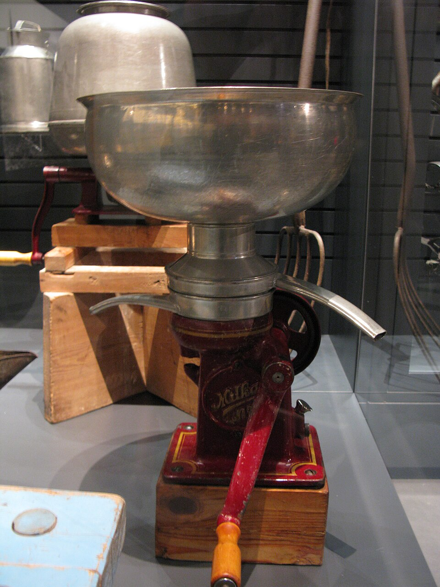
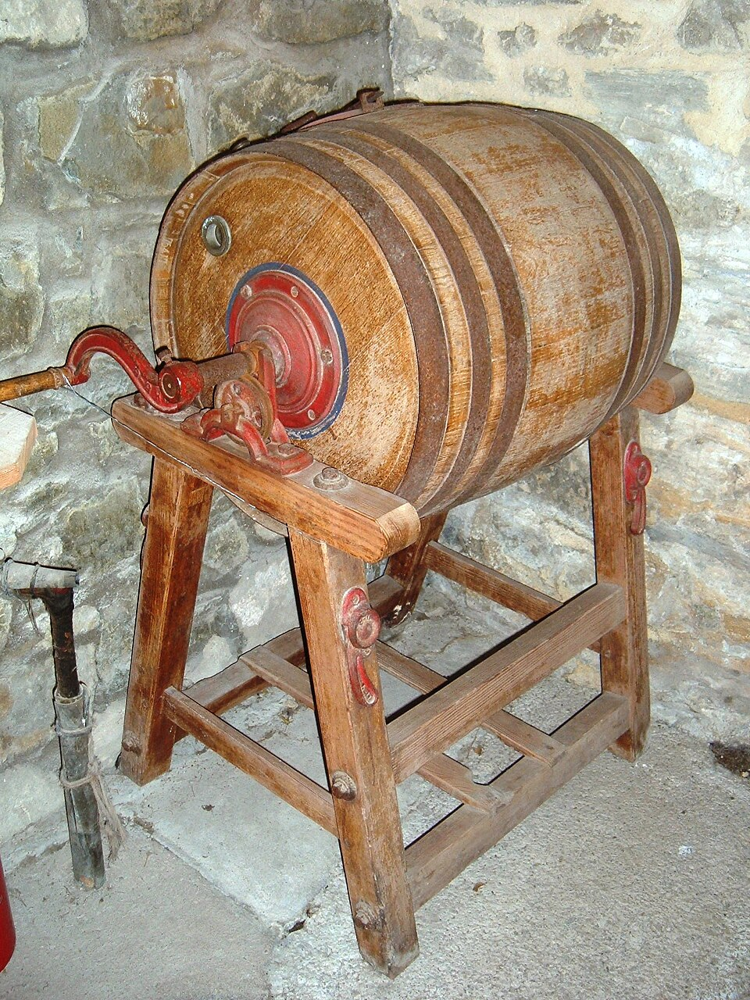
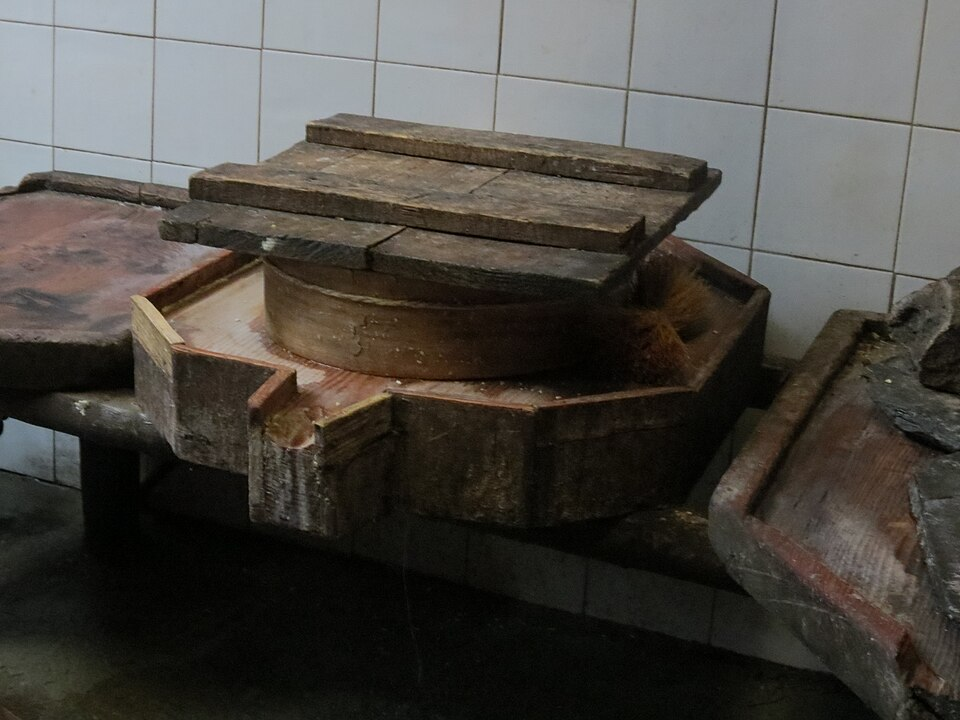

# Dairy Processing — Turning Milk Into Butter, Yogurt, Cheese & More

## Read this first (the 30-second version)
1. **Cool fresh milk fast.** Get it below 40°F (4°C) within 1–2 hours of milking — in Texas summer heat, milk left on the counter can start spoiling within an hour. An ice bath (milk container set in a bucket of ice water) is faster than a refrigerator.
2. **Decide raw or pasteurized.** If you don't personally know the animal is healthy and milking was done cleanly, or if the milk is for children under 5, pregnant women, the elderly, or anyone sick — **pasteurize it**: heat to **145°F (63°C) and hold 30 minutes**, or **161°F (72°C) and hold 15 seconds**, then chill fast.
3. **Keep everything clean.** Wash and sanitize every container, utensil, and cloth that touches milk (a mild bleach-water rinse: 1 tablespoon unscented bleach per gallon of water) — dirty equipment is the #1 cause of failed or unsafe dairy products.
4. **Almost nothing goes to waste:** cream becomes butter, the liquid left from churning is buttermilk, the liquid left from cheesemaking is whey — all three are useful foods, not trash.
5. **When in doubt, throw it out.** Off smell, odd color, sliminess, or fuzzy colored mold (not the flat white rind of an aging cheese) means discard it — don't taste-test something questionable to find out.

The rest of this guide walks a complete beginner through handling raw milk, separating cream, and making butter, ghee, buttermilk, clabber, yogurt, kefir, several soft cheeses, and a basic pressed hard cheese — using tools you likely already have or can improvise.

---

## Why this matters
A milking goat or cow gives you **more milk than one household can drink fresh**, every single day, for months. Left alone, that surplus spoils and is wasted — a real loss when grocery supply is uncertain. Turned into butter, cheese, or yogurt, the same milk becomes **calorie-dense, shelf-stable, and varied** food: a pound of butter or hard cheese keeps far longer than a jug of milk, packs far more usable fat and protein per bite, and doesn't require refrigeration once processed correctly (butter, ghee, aged hard cheese). Dairy processing is also one of the oldest food-security technologies humans have — done right, it is simple and safe; done carelessly, warm raw milk is an excellent breeding ground for the same bacteria that cause serious foodborne illness. This guide gives you the temperatures, times, and hygiene habits that separate "delicious homemade food" from "dangerous mistake."

## Key terms (plain language)
- **Raw milk** — milk that has not been heat-treated to kill pathogens. May carry *Salmonella*, *E. coli*, *Listeria*, *Campylobacter*, *Coxiella burnetii* (Q fever), or (rarely, in untested herds) *Brucella* or tuberculosis bacteria.
- **Pasteurization** — heating milk to a specific temperature for a specific time to kill disease-causing bacteria without fully cooking the milk. It is **not** sterilization — a few heat-resistant spores can survive, so pasteurized milk still needs to be kept cold.
- **Clabber** — milk that has naturally soured and thickened from its own bacteria (no added culture), common with fresh raw milk left at warm room temperature.
- **Culture / starter** — a small amount of a live-bacteria product (yogurt, buttermilk, a powdered starter, or kefir grains) added to milk to grow a specific, known, food-safe bacteria population that out-competes spoilage organisms and gives a product its flavor and texture.
- **Rennet** — an enzyme (from an animal's stomach or a vegetable/microbial source) that clots milk protein (casein) into a firm gel (curd) without needing acid or long fermentation. Used for most hard cheeses.
- **Curds and whey** — when milk is clotted (by acid, rennet, or both), it separates into **curds** (the solid protein/fat clot — becomes cheese) and **whey** (the leftover thin, yellow-green liquid — full of water, milk sugar, and some protein and minerals).
- **Clean break** — the test for whether rennet-set curd is ready to cut: slide a clean finger or knife into the curd at an angle and lift; if it splits cleanly along a sharp line (instead of the finger dragging through soft custard-like curd), it's ready.
- **Butterfat / cream** — the fat portion of milk, which is lighter than the rest and rises to the top if the milk sits undisturbed; churned cream becomes butter.
- **Buttermilk** — the liquid left over **after churning cream into butter** (traditional buttermilk) — different from the thicker, tangier **cultured buttermilk** sold in stores, though both can be used as a starter culture.
- **Ghee** — butter that has been simmered until all the water evaporates and the milk solids are removed, leaving pure, shelf-stable butterfat.
- **Homogenization** — a mechanical process (not something you do at home) that breaks milk fat into tiny, evenly distributed globules so cream doesn't rise. **Goat milk is naturally close to homogenized already** — its fat globules are smaller and lack the protein that makes cow's-milk cream clump and rise quickly, so cream separates slower and less completely from goat milk.

---

# Quick temperature & time cheat-sheet

| Product | Key temperature | Key time |
|---|---|---|
| Pasteurize (LTLT / vat method) | 145°F (63°C) | Hold 30 minutes |
| Pasteurize (HTST / quick method) | 161°F (72°C) | Hold 15 seconds |
| Cool milk after milking or pasteurizing | Below 40°F (4°C) | Within 1–2 hours |
| Churn butter — cream temperature | 50–60°F (10–16°C) | Churn 10–40 min depending on method |
| Ghee — simmer until solids brown | 200–250°F (93–121°C) | 15–30 min after melting |
| Yogurt — heat milk first | 180–185°F (82–85°C) | Hold 10–30 min |
| Yogurt — incubate after adding culture | 108–115°F (42–46°C) | 4–12 hours |
| Kefir — ferment at room temp | 68–77°F (20–25°C) | 12–24 hours |
| Acid-set soft cheese (paneer/queso fresco) — heat milk | 180–200°F (82–93°C) | Add acid until curds separate, ~5 min |
| Cultured soft cheese (chèvre/cream cheese) — set | 72–86°F (22–30°C) | 12–24 hours (or 1 hr at 85°F with rennet) |
| Rennet hard cheese — ripen with culture | 86–90°F (30–32°C) | 30–45 min |
| Rennet hard cheese — set after rennet | 86–90°F (30–32°C) | 30–45 min undisturbed |
| Rennet hard cheese — cook curds | Raise to 100–102°F (38–39°C) | Over 30–45 min |
| Aging a pressed hard cheese | 50–60°F (10–16°C), humid | Weeks to months |

Keep this table handy — nearly every method below is a variation on "heat milk to X, hold/add something, cool or drain."

---

# PART 1 — HANDLING FRESH MILK SAFELY (BEFORE YOU PROCESS ANYTHING)

> This guide picks up **after** the milk is in a clean container. For getting the milk itself — animal selection, milking technique and hygiene, chilling immediately at the milking stand, mastitis and udder health — see [Livestock & Animal Husbandry, Part 4C](../livestock-animal-husbandry/livestock-animal-husbandry.md).

## 1A. Cool it fast — the single most important step
Warm, fresh milk (close to the animal's body temperature, ~101°F/38°C for a goat) is an ideal environment for bacteria to multiply. Every extra minute it stays warm before cooling shortens its safe life and raises the risk of off-flavors and spoilage.

**You need:** a clean, food-grade container (glass jar, food-safe plastic pail, stainless steel pail) and a way to cool it. **Improvised substitutes if you have no working refrigerator:**
1. **Ice-water bath (fastest):** set the milk container (not sealed all the way — some vented lid or a cloth over the top) into a larger tub or sink of ice water so the water level comes above the milk level inside the jar. Stir the milk occasionally. This cools milk far faster than a refrigerator alone.
2. **Cold well or spring water:** lower a sealed, watertight container into a well, cistern, or flowing creek (secured so it can't wash away or tip) — groundwater in North Texas stays around 65–70°F (18–21°C) year-round, cooler than summer air.
3. **Evaporative cooling (no ice, no well):** wrap the container in a wet cloth or burlap sack, set it in the shade with airflow (a covered porch, breezeway); as the water evaporates it pulls heat out, similar in principle to a simple cooler (see [Food Preservation & Cooking](../food-preservation-cooking/food-preservation-cooking.md) for more no-power cooling methods).
4. **A buried clay pot or root cellar** stays notably cooler than outdoor air — useful for short-term storage once milk is already chilled, not as fast initial cooling.

**Target:** below 40°F (4°C) within 1–2 hours of milking. In North Texas summer heat, don't trust "a couple hours in the shade" — get milk into ice water or a working fridge as close to immediately as you can.

## 1B. Clean equipment — every time, no exceptions
Milk is a near-perfect bacterial growth medium; a dirty pail or jar can contaminate an entire batch regardless of how careful you are afterward.
1. Wash all milk containers, strainers, cloths, and tools in hot soapy water immediately after use (don't let residue dry on).
2. Rinse thoroughly — soap residue affects flavor and culturing.
3. **Sanitize** with a bleach-water rinse: **1 tablespoon of plain, unscented household bleach per gallon of water.** Soak or rinse utensils for about 2 minutes, then air-dry (don't towel-dry with a cloth that could reintroduce germs). Make this solution fresh each time — it loses strength within a day, faster in sunlight.
4. Boiling is an alternative sanitizing method for small metal/glass tools: a rolling boil for a few minutes.
5. **Use cheesecloth once and re-boil or replace it** for best results — cloth traps bacteria in its fibers even after washing. A clean, tightly-woven cotton flour-sack towel, bandana, or the leg of a clean pair of pantyhose are workable substitutes if you have no cheesecloth.
6. Wash your hands with soap before handling milk, and again after touching anything else (animals, raw meat, the bathroom, your face).

## 1C. The raw-milk-vs-pasteurized decision
Raw milk carries a real risk: bacteria such as *Salmonella*, *E. coli*, *Listeria monocytogenes*, *Campylobacter*, and *Coxiella burnetii* (the cause of Q fever) can be present even in milk that looks, smells, and tastes completely normal, especially if the animal's health hasn't been tested or milking hygiene lapsed even once. **Some of the products in this guide (clabber, some soft cheeses) traditionally rely on raw milk's own natural bacteria — but that's a deliberate, informed trade-off, not a shortcut for everyone.**

**Pasteurize when:**
- You don't personally know the animal's health history or can't be certain milking was done with clean hands, a clean udder, and clean equipment every time.
- The milk will be drunk or fed to **children under 5, anyone pregnant, the elderly, or anyone with a weakened immune system or chronic illness** — these groups are far more likely to become seriously ill from the same contamination a healthy adult might shrug off.
- You're not sure, or you're under stress and cutting corners on hygiene is more likely.

**Raw milk may be a reasonable choice when:** you know the animal and its health closely, hygiene has been consistently excellent, everyone drinking it is a healthy adult who accepts the risk, and you plan to use it quickly or for a process (clabber, some traditional soft cheeses) that specifically depends on its live bacteria.

> ⚠️ **When genuinely unsure, pasteurize.** The 30 minutes it costs is cheap insurance against a serious, sometimes life-threatening illness.

## 1D. How to pasteurize milk at home
Pasteurization does **not** sterilize milk (it isn't shelf-stable afterward) — it reduces disease-causing bacteria to safe levels. **Two standard methods, either is correct — pick based on the equipment you have:**

**Method 1 — LTLT ("low temperature, long time" / vat pasteurization) — easier for a beginner without precise fast timing:**
1. Set up a double boiler (a pot of milk inside a larger pot of water) — this keeps the milk from scorching on direct high heat.
2. Heat gently, stirring often, until the milk reaches **145°F (63°C)** on a food thermometer.
3. **Hold it at 145°F for a full 30 minutes**, stirring occasionally and adjusting heat to keep it steady — not above 145°F (higher heat starts to cook the milk proteins and changes texture, which matters if the milk will later be made into cheese) and not below.
4. Remove from heat.

**Method 2 — HTST ("high temperature, short time") — faster, needs quick accurate timing:**
1. Heat milk (double boiler or direct low heat, stirring constantly) to **161°F (72°C)**.
2. Hold for **15 seconds** exactly, then remove from heat immediately.

**After either method — cool it fast:**
5. Cool the milk quickly to below 40°F (4°C), the same way as in 1A (ice-water bath is fastest) — within about 30 minutes to a couple of hours. Slow cooling lets any surviving heat-resistant bacterial spores start growing again and lets off-flavors develop.
6. Store cold, covered, and labeled with the date.

**No thermometer at all?** This is the one process in this guide where you genuinely need one — a basic food or candy thermometer is inexpensive and worth having before you need it. A meat thermometer that reads up to 200°F works fine. Without one, you cannot reliably tell 145°F from 165°F by look or feel, and both under- and over-heating cause real problems (under-heating fails to kill pathogens; over-heating scalds the milk and ruins it for cheesemaking).

## 1E. Goat milk specifics
- **Naturally close to homogenized:** goat milk's fat globules are smaller and lack the protein ("agglutinin") that makes cow's-milk fat clump together and rise fast. Practical effect: **cream rises much more slowly and less completely** from goat milk — plan on 24–48 hours undisturbed in a refrigerator (not warm room temperature) rather than the several hours that works for cow's milk, and expect to skim a less pronounced "cream line." A hand-cranked mechanical cream separator gets a cleaner, faster separation if you process goat milk regularly.
- **Handle gently and cool fast** — goat milk is more prone to developing a "goaty" off-flavor when agitated or temperature-cycled (an enzyme called lipase, naturally present in the milk, becomes more active with rough handling and breaks down fat into flavor compounds). Strain and chill it calmly rather than sloshing it around, and don't let it warm up and re-cool repeatedly.
- Goat milk generally makes excellent soft cheese (chèvre is traditionally a goat cheese) and yogurt; it can make butter and hard cheese too, just expect a softer curd from the smaller fat globules unless you compensate (culture, rennet amount, technique) as covered in each method below.

---

# PART 2 — SEPARATING CREAM

Cream is the fat that rises to the top of undisturbed milk — the starting point for butter and ghee.

**Method 1 — Gravity settling (works well for cow's milk):**
1. Pour fresh milk into a wide, shallow container (a flat pan separates cream better than a tall narrow jar) and refrigerate, undisturbed, for **12–24 hours**.
2. A visible pale-yellow layer of cream rises to the top. Skim it off carefully with a ladle or wide spoon, or use a jar with a spigot near the bottom to drain the skim milk out from underneath, leaving cream behind.
3. **For goat milk**, extend the settling time to **24–48 hours** and expect a thinner cream line (see 1E above); a tall narrow jar refrigerated undisturbed the full time works better than a shallow pan for goat milk specifically, since disturbance re-mixes what little has separated.

**Method 2 — Mechanical cream separator:** a hand-cranked or electric device that spins milk at high speed, forcing cream and skim milk apart by centrifugal force as you pour milk in continuously. Faster and more complete than gravity, and the practical choice if you process goat milk regularly or milk more than one animal. Follow the manufacturer's assembly and cleaning instructions — every part that touches milk needs the same washing/sanitizing routine as in Part 1B.

*Figure — An antique centrifugal cream separator (museum display, Kotka, Finland). Milk is poured in at the top and spun at high speed, throwing the denser skim milk outward and letting the lighter cream collect separately — the mechanical alternative to gravity settling described above. Source: Wikimedia Commons (File:Milk separator.JPG), photo by SeppVei, public domain.*

**What's left (skim milk)** is still fully useful — drink it, use it in cooking, or use it as the milk base for cheese (traditional queso fresco and cottage cheese are often made from skim or low-fat milk).

---

# PART 3 — BUTTER

*Figure — A traditional wooden rotary crank-barrel churn (Somerset Rural Life Museum, England). The wooden barrel is mounted on a stand and turned end-over-end by a hand crank, tumbling the cream inside until the butterfat clumps and separates from the buttermilk — the same underlying principle behind jar-shaking, a dash/plunger churn, or an electric mixer, just with rotation instead of plunging. Source: Wikimedia Commons (File:Butter Churn.JPG), photo by Rodw, public domain.*

## 3A. What you need
- Cream (see Part 2), ideally around **50–60°F (10–16°C)** — cool room temperature, not fridge-cold and not warm. Too cold and the fat won't clump; too warm and you get greasy, soft butter.
- A churning method — pick whichever tools you have:
  1. **Jar-shaking** — a clean glass jar with a tight lid, filled no more than half full of cream, shaken vigorously. Simplest method, no equipment needed, good for small batches or with kids helping; takes 10–20 minutes of shaking.
  2. **Hand/dash churn or butter paddle** — a traditional plunger churn, if you have or can build one.
  3. **Electric mixer or food processor** — fastest for a modern kitchen; whip on medium-high, past the whipped-cream stage, until it visibly separates.

## 3B. Steps
1. Bring cream to 50–60°F if it's been refrigerated (let it sit out 20–30 minutes) or cool it slightly if warm.
2. Churn/shake/whip continuously. Cream goes through a whipped-cream stage first, then suddenly the texture changes — you'll see and hear a distinct **"thump"/sloshing change** as pale yellow butterfat grains clump together and separate from a thin white liquid (buttermilk).
3. Stop as soon as that separation happens (over-churning just makes a bigger mess without more butter).
4. **Pour off and save the buttermilk** (Part 3D) — don't discard it.
5. **Wash the butter:** add cold water to the butter grains in the container, knead/press it with a spoon or your hands, then pour off the cloudy water. Repeat **3–4 times until the rinse water runs clear.** This step matters — any buttermilk left inside the butter will sour it and shorten its shelf life significantly.
6. **Salt (optional):** work in about **¼–½ teaspoon of salt per cup of butter** for flavor and a modest shelf-life boost. Unsalted butter is more perishable.
7. Pack into a clean container, pressing out air pockets (air pockets encourage rancidity).

## 3C. Storage
- Refrigerated: several weeks (salted keeps a little longer than unsalted).
- Frozen: several months.
- **Room temperature without refrigeration:** salted butter can hold a few days in a cool spot (a butter crock kept in cold water, root cellar, or the coolest interior room), but in Texas summer heat, plan to refrigerate, freeze, or convert extra butter to **ghee** (Part 4), which is genuinely shelf-stable at room temperature.

## 3D. What to do with the buttermilk
The liquid left from churning butter ("traditional buttermilk") is different from the thicker, tangier **cultured buttermilk** sold in stores — but both are useful:
- Drink it, or use it in baking (biscuits, pancakes, cornbread) in place of some milk — it reacts with baking soda for extra lift.
- **Use it as a starter culture** for cultured soft cheeses (cream cheese, Neufchâtel, queso fresco all traditionally use a splash of cultured buttermilk as their live-culture source — see Part 7).
- If your buttermilk came from cream that soured naturally before churning, it has more live culture activity than buttermilk from fresh sweet cream — either works for drinking, but soured-cream buttermilk is the better cheese starter.

---

# PART 4 — GHEE / CLARIFIED BUTTER (a shelf-stable fat)
Ghee is butter with the water and milk solids removed — what's left is nearly pure fat, which does not support bacterial growth the way milk, water, or the solids do. This makes it genuinely useful **without refrigeration**, unlike plain butter.

**You need:** butter (any amount), a heavy-bottomed pot, a fine strainer or cheesecloth, a clean dry jar.

**Steps:**
1. Melt butter over low-medium heat in a heavy pot — it will foam as water boils off.
2. Continue simmering gently (roughly **200–250°F / 93–121°C**) for **15–30 minutes**, without stirring much. Milk solids will sink and start to lightly brown on the bottom (this toasting is what gives true ghee its nutty flavor — for plain "clarified butter," stop before browning and just skim the foam instead).
3. Watch for the foam to subside and the butter to turn clear golden with browned specks settled at the bottom — that's done.
4. Remove from heat, let cool slightly, then **strain through cheesecloth or a fine-mesh strainer** into a clean, completely dry jar, leaving the browned solids behind.
5. Cool fully before capping (trapped steam causes condensation, which reintroduces water and defeats the purpose).
6. **Store airtight, in a cool, dark place.** Properly made ghee (no water or solids left in it, kept dry) keeps for **weeks at room temperature** and **months refrigerated.**

> ⚠️ Any water or milk solids left in the jar will cause mold or spoilage — strain carefully and make sure the jar and lid are bone-dry before filling.

---

# PART 5 — CLABBER (NATURALLY SOURED MILK)
Clabber is the oldest, simplest cultured dairy product: **raw** milk's own natural bacteria sour and thicken it into something like a tangy, loose yogurt — no starter culture needed.

1. Leave **raw** milk, loosely covered, at warm room temperature (roughly **70–80°F**) for **1–3 days**.
2. It will thicken into a custard-like curd with a layer of whey, smelling pleasantly sour (like plain yogurt or sour cream) — that's a successful clabber.
3. **Smell and look before eating:** pleasant sour smell and clean thick texture = good. Any putrid, rotten, or otherwise "wrong" smell, sliminess, or color change = discard, don't taste it to find out.

> ⚠️ **Clabbering depends on raw milk's own live bacteria outcompeting spoilage organisms.** Pasteurized milk lacks that natural bacterial population and may rot rather than sour safely if you try to clabber it the same way — don't substitute pasteurized milk here unless you add a proper culture (in which case you're making yogurt or cultured buttermilk instead, see Parts 6–7). Clabber is a good example of a process where raw milk is the traditional and appropriate choice **if** you trust the milk's source (Part 1C).

**Uses:** eat it as-is (with fruit, honey, or savory toppings, like yogurt or sour cream), drain it through cloth for a simple soft cheese, use it in place of buttermilk in baking, or use a spoonful as a starter for your next batch.

---

# PART 6 — YOGURT AND KEFIR

## 6A. Yogurt
**You need:** milk (raw milk should be pasteurized first per Part 1D, or at minimum heated per the steps below), a live-culture starter (2–3 tablespoons of **plain yogurt with live active cultures**, store-bought or from a previous batch, or a powdered yogurt starter), a thermometer, and a way to hold a warm, steady temperature for several hours.

**Steps:**
1. Heat milk to **180–185°F (82–85°C)** and hold for **10–30 minutes**, stirring occasionally (this isn't for pasteurization — even already-pasteurized milk benefits, because the heat changes the milk proteins so the finished yogurt sets thicker).
2. Cool the milk down to **108–115°F (42–46°C)** — comfortably warm on the inside of your wrist, like a baby bottle, but not hot. **Too hot and you'll kill the culture; too cool and it won't grow well.**
3. Stir in your starter (2–3 tablespoons per quart of milk) gently but thoroughly.
4. Pour into clean jars, cover, and **incubate at 108–115°F for 4–12 hours**, undisturbed — longer incubation gives a tangier, thicker yogurt. Check by gently tilting the jar; it should hold together like a soft custard, not slosh like liquid milk.
5. Refrigerate once set — it thickens further as it chills.

**No thermometer or reliable heat source? Improvised incubation methods:**
- A cooler with a jar of hot (not boiling) water alongside the yogurt jars, lid closed.
- An oven with just the interior light on (many ovens hold ~100–110°F this way — check once with a thermometer if you can).
- Wrapped in thick towels or blankets, set near (not touching) a warm woodstove or in a sunny window.
- A wide-mouth thermos.
- Rough temperature check without a thermometer: the milk should feel warm but comfortable on the inside of your wrist or forearm — noticeably warmer than body temperature but not hot enough to be uncomfortable held there for several seconds.

**Straining for Greek yogurt or yogurt cheese (labneh):** pour set yogurt into a cheesecloth-lined strainer or colander and let it drain, refrigerated, for a few hours (thicker Greek-style) up to overnight (spreadable labneh). Save the drained whey (Part 9).

## 6B. Kefir — a good option with no thermometer at all
Kefir uses **kefir grains** (a reusable, self-perpetuating clump of bacteria and yeast, not a "grain" in the wheat sense) instead of a heat-dependent culture.
1. Add kefir grains to fresh milk in a clean jar (roughly 1 tablespoon of grains per 2 cups of milk, adjustable).
2. Cover loosely (it needs to vent gas) and leave at **room temperature (68–77°F)** for **12–24 hours** — no precise heat control needed, which makes it more forgiving off-grid than yogurt.
3. Strain out the grains (a plastic mesh strainer resists damaging them) — the grains go into your next batch of fresh milk, and the strained liquid is your finished kefir.
4. Kefir is thinner and tangier/slightly fizzy compared to yogurt, and the grains can be reused indefinitely as long as they're kept fed with fresh milk regularly.

---

# PART 7 — SOFT CHEESES (NO PRESS OR AGING REQUIRED)

Soft cheeses are the easiest entry point into cheesemaking — most are ready in under an hour of active work and don't need a press, wax, or an aging space.

## 7A. Simple acid-set cheese — paneer / queso fresco (the fastest cheese there is)
1. Heat milk (a gallon is a convenient batch size) to **180–200°F (82–93°C)**, stirring so it doesn't scorch.
2. Remove from heat and slowly stir in an acid — **vinegar or lemon juice, roughly 2–4 tablespoons per gallon of milk** — a little at a time, gently stirring, until the milk visibly separates into curds and a clear yellow-green whey (if it stays milky, add a bit more acid).
3. Let it sit undisturbed for 5–10 minutes.
4. Pour through cheesecloth (or a clean thin cotton cloth) set in a colander. Save the whey (Part 9).
5. **For soft paneer/queso fresco:** let it drain a few minutes, then gather the cloth and twist to press out more whey by hand; it's ready to use right away, sliced or crumbled.
6. **For a firmer block** (to fry or grill without melting, classic paneer style): tie the cloth into a bundle and press it under a light weight (a plate with a couple of cans on top) for 20–30 minutes, then unwrap.
7. Salt lightly if desired (queso fresco is traditionally salted; plain paneer usually isn't). Refrigerate; use within about a week.

**This is the same basic technique for paneer, simple queso fresco, and ricotta** — only the exact acid amount, milk type, and pressing time change.

## 7B. Cottage cheese
1. Warm milk gently to around **90°F (32°C)**; stir in a small amount of acid (vinegar/lemon juice) or a splash of buttermilk as a starter, and let it sit until it thickens into a soft curd (this can take from 30 minutes with added acid to several hours with just a cultured starter).
2. Cut the curd into small (½-inch) cubes with a knife.
3. Gently warm the curds and whey to about **110–120°F (43–49°C)** over 30–45 minutes, stirring occasionally, to firm the curd pieces without turning them tough.
4. Drain in cheesecloth, then **rinse the curds under cool water**, working them gently with your fingers — this stops the cooking and washes off excess tang, giving cottage cheese its characteristic mild flavor.
5. "Dress" with a splash of cream and a pinch of salt to taste, and refrigerate.

## 7C. Cultured soft cheeses — cream cheese and chèvre (goat cheese)
These rely on a **culture** (live bacteria, from buttermilk or yogurt) working slowly, usually with a small amount of rennet, rather than a quick shot of acid — giving a milder, more complex flavor than the acid-set cheeses above.
1. Warm milk (whole milk plus a little cream for cream cheese; goat milk for chèvre) to about **85–86°F (29–30°C)**.
2. Stir in a starter — a few tablespoons of fresh, plain **cultured buttermilk or plain yogurt** per quart of milk.
3. Add a very small amount of diluted rennet if using it (a fraction of a tablet, or a few drops of liquid rennet, dissolved in a little cool unchlorinated water) and stir gently for a minute or two. **Rennet is optional for a classic slow-set chèvre** — many traditional recipes use culture alone and simply wait longer.
4. Cover and let it sit **undisturbed at 72–86°F (room temperature to slightly warm) for 12–24 hours**, until it sets into a soft, yogurt-like gel that pulls slightly from the sides of the container.
5. Ladle (don't pour — this breaks the delicate curd less) into a cheesecloth-lined colander or hang it in a cloth bag over a bowl, and let it **drain 6–12 hours** (shorter for a soft, spreadable cheese; longer for a firmer log-style chèvre).
6. Salt to taste, and mix in herbs if desired. Refrigerate; use within about a week to ten days.

---

# PART 8 — RENNET HARD CHEESE BASICS (PRESSING, WAXING, AGING)
A basic pressed hard cheese takes more time and a couple of extra tools than the soft cheeses above, but the process itself is a straightforward extension of what you've already learned: culture, coagulate, cut, cook, drain, press, and age.

## 8A. What you need
- A gallon of milk (pasteurized, or heat-treated per Part 1D).
- A **mesophilic starter culture** (a small packet of powdered culture made for cheesemaking) **or** a substitute of a few ounces of fresh cultured buttermilk.
- **Rennet** — animal or vegetable-sourced, as a tablet or liquid (1 teaspoon liquid = roughly one tablet); dissolve it completely in cool, unchlorinated water before adding (chlorinated tap water can weaken it — let tap water sit out uncovered a few hours first, or use bottled/filtered water).
- Cheese salt (plain, non-iodized), a long knife, a thermometer, cheesecloth, and a mold/press (see 8C).

## 8B. The process
1. **Ripen:** warm milk to **86–90°F (30–32°C)**, stir in the culture, and let it sit at that temperature for **30–45 minutes** to let the culture get established.
2. **Set:** add the diluted rennet and stir gently, top to bottom, for about a minute. Then let the milk sit **completely undisturbed for 30–45 minutes** until it passes the **clean-break test** (Key terms) — don't rush this; a curd cut too early is fragile and leads to a crumbly, high-moisture cheese.
3. **Cut the curd** into roughly ½-inch cubes with a long knife, cutting a grid pattern straight down and then again at an angle, then let it rest 5 minutes.
4. **Cook the curd:** slowly raise the temperature to **100–102°F (38–39°C)** over **30–45 minutes**, stirring gently and occasionally — this firms the curds and pushes out more whey. Raising the temperature too fast toughens the outside of the curd while leaving the inside wet.
5. Let the curds settle, then drain off the whey (save it — Part 9) through cheesecloth.
6. **Salt the curds** — roughly 1–2 tablespoons of cheese salt per gallon batch, mixed in by hand.

## 8C. Pressing

*Figure — A wheel of Bagòss cheese in its mold during the early pressing/drying stage. The cheese sits inside a rigid mold that holds its shape while weight (here a press, but improvised weights work the same way) squeezes out remaining whey and firms the curd into a solid wheel. Source: Wikimedia Commons (File:Bagoss in press.JPG), photo by Scailyna, CC BY-SA 4.0.*

You don't need a commercial cheese press. A workable **improvised press**: a large coffee can (or similar smooth-sided tin) with holes punched from the inside out in the bottom so the cloth liner doesn't snag, a "follower" disc cut to fit inside (from a plastic lid or a smaller can lid) to push down on the cheese, and something to weigh it down (canned goods, a water jug).
1. Line the mold with cheesecloth, pack in the salted curds, fold the cloth over the top, and set the follower disc on top.
2. Press with a light weight first (a can or two of food) for about 15 minutes, in the sink or over a bowl to catch drips.
3. Unwrap, flip the cheese, re-wrap, and press again with **increasing weight** (working up toward something like 15–30 lbs, stacked cans/jugs/bricks) for **several hours to overnight**, flipping once or twice more along the way for an even shape.

## 8D. Waxing and aging
1. Remove the pressed cheese from the mold and **air-dry** at cool room temperature, turning it once or twice a day, for **2–5 days**, until the surface feels dry to the touch rather than tacky (this forms a protective rind).
2. **Coat it** to keep it from drying out or molding unpredictably during aging — melted cheese wax brushed or dipped on all sides (following the wax product's instructions), a light oil rub-and-cloth "bandage" wrap, or a food-safe vacuum seal are all workable options.
3. **Age** in a cool place, ideally **50–60°F (10–16°C)** with some humidity (a root cellar, a cool interior closet, or an insulated box with ice packs refreshed regularly) for **several weeks to a few months** depending on how firm/sharp you want it — basic pressed cheeses are edible younger (3–4 weeks), while harder, sharper styles improve over months.
4. **Turn the cheese regularly** (every few days to weekly) so moisture doesn't pool on one side.
5. **Check it periodically:** a little surface mold on an unwaxed natural rind is normal and can be wiped off with a cloth dampened in **saltwater brine**; if wax cracks, reseal it. **Fuzzy, colorful mold that has clearly penetrated into the cheese, or any foul/rotten smell, means discard that piece** — don't try to salvage past the surface on a home-aged cheese the way commercial producers sometimes can with recognized cultures.

---

# PART 9 — WHEY: DON'T THROW IT AWAY
Every cheesemaking method above produces whey — don't pour it down the drain.
- **Make ricotta from it:** heat fresh whey (ideally with a splash of milk added) to **185–200°F (85–93°C)**, then slowly stir in a little more vinegar or lemon juice until small curds form; drain through cloth. This captures the last of the protein and fat that didn't make it into your first cheese.
- **Drink it** — it's tangy and nutritious (protein, minerals, some lactose).
- **Bake with it** — substitute whey for some or all of the water or milk in bread, pancake, or biscuit recipes; it adds protein and a subtle tang.
- **Feed it to livestock** — chickens, pigs, and rabbits will readily drink or eat whey-soaked feed; see [Livestock & Animal Husbandry](../livestock-animal-husbandry/livestock-animal-husbandry.md).
- **Soak grains or beans in it** — the acidity helps soften them and can improve digestibility.
- **Use it to start a vegetable ferment** — a splash of fresh whey adds a helpful dose of lactic acid bacteria to a batch of fermenting vegetables.

---

# North Texas / small-homestead notes
- **Summer heat is the biggest daily risk here, not winter.** Fresh milk left on a counter in a North Texas July afternoon can start turning within an hour. Have your ice-water bath or cooler ready **before** you milk, not after.
- **Well water runs 65–70°F (18–21°C) year-round** in this region — a real asset for cooling milk or holding butter/cheese for a day or two if the power is out; a sealed jar lowered into a well or cistern beats leaving anything in open air.
- **Humidity works against you when aging hard cheese.** North Texas summers are hot and humid, which pushes unwanted mold growth on an aging cheese. Favor an interior closet or a dedicated cooler/insulated box over an outdoor shed, wipe the cheese with brine more often in humid stretches, and lean toward wax-coating rather than a bare natural rind if you don't have a dedicated cool, humidity-controlled space.
- **Goats are the more practical home dairy animal on typical suburban/small-acreage North Texas lots** (see [Livestock & Animal Husbandry](../livestock-animal-husbandry/livestock-animal-husbandry.md) for space and zoning notes) — plan around goat milk's slower cream separation and slightly different cheese texture rather than assuming cow's-milk behavior.
- **Winter ice storms/power outages:** a working woodstove or fireplace can double as your yogurt/clabber incubation warmth source (set jars nearby, not touching, wrapped in towels) when there's no electricity for an oven light or heating pad.

---

# ⚠️ Safety — the most important warnings
- **Raw milk can carry serious pathogens even when it looks, smells, and tastes fine.** When feeding children under 5, pregnant women, the elderly, or anyone immunocompromised — or whenever you're not fully certain of the animal's health and milking hygiene — **pasteurize** (145°F/30 min or 161°F/15 sec, then chill fast).
- **Cool milk fast, every time** — below 40°F within 1–2 hours of milking. Warm milk sitting out is the single biggest cause of spoiled or unsafe dairy in this whole process.
- **Sanitize everything that touches milk** — containers, cloths, thermometers, hands. A quick bleach-water rinse (1 Tbsp unscented bleach per gallon of water) before and after use is cheap insurance.
- **Pasteurization is not sterilization** — pasteurized milk and the products made from it still need to be kept cold; don't treat them as shelf-stable.
- **Clabbering deliberately uses raw milk's natural bacteria — don't substitute pasteurized milk into that specific method** without adding a proper culture, or you risk it rotting instead of souring safely.
- **Wash the buttermilk out of finished butter thoroughly** — leftover buttermilk inside butter causes it to sour and spoil much faster than properly washed butter.
- **Ghee must be strained free of all water and milk solids** to be shelf-stable at room temperature; any leftover moisture invites mold.
- **On aging hard cheese:** wipe off ordinary surface mold with brine; **discard any piece where colorful, fuzzy mold has visibly grown into the cheese, or that smells rotten** rather than pleasantly sharp/cheesy.
- **When in doubt, throw it out.** No dairy product in this guide is worth the risk of eating something that smells wrong, looks wrong, or feels slimy.

# Troubleshooting
| Problem | Fix |
|---|---|
| Cream won't rise from goat milk | Normal — goat milk separates slowly and incompletely. Extend settling to 24–48 hrs refrigerated in a tall jar, or use a mechanical cream separator. |
| Butter won't "come" (stays whipped-cream texture) | Cream is likely too cold — let it warm slightly toward 50–60°F and keep churning; very warm cream can also fail to churn properly (goes greasy) — cool it back down and retry. |
| Butter spoils/sours quickly | Buttermilk wasn't fully washed out — rinse and knead in cold water until it runs completely clear next time. |
| Milk won't clabber, or smells "off" instead of pleasantly sour | If using pasteurized milk, it lacks the natural bacteria to clabber safely — use raw milk you trust, or switch to a proper cultured method (yogurt/buttermilk) instead. |
| Yogurt stays runny, never sets | Culture may be dead (old starter, or milk was too hot when you added it and killed the bacteria) or incubation temperature too low/inconsistent — recheck with a thermometer and use a fresh starter. |
| Rennet curd never firms / no clean break | Rennet may be old/weak, milk may be ultra-pasteurized (won't set well with rennet at all), or temperature was off — use fresh rennet, avoid ultra-pasteurized store milk for rennet cheeses, and confirm 86–90°F with a thermometer. |
| Cheese curd is crumbly and dry | Curd was likely cut or handled before it was fully set, or cooked too hot/fast — let the set finish fully (clean-break test) and raise cooking temperature more slowly next time. |
| Cheese develops unexpected colorful mold while aging | Usually excess humidity or a less-than-clean aging space — move to a drier, cleaner spot, wipe more often with brine, or wax-coat instead of leaving a bare rind; discard if mold has penetrated the interior. |
| Milk sours before you can process it | It wasn't cooled fast enough after milking — set up your ice-water bath before milking, not after, especially in summer heat. |

# Quick-reference checklist
- [ ] Cooled fresh milk to below 40°F within 1–2 hours of milking (ice-water bath, cold well water, or evaporative cooling).
- [ ] Decided raw vs. pasteurized based on the animal's known health, milking hygiene, and who's eating it (children/pregnant/elderly/immunocompromised = pasteurize).
- [ ] Sanitized all containers, cloths, and tools with a bleach-water rinse or boiling before use.
- [ ] Have a thermometer on hand — required for pasteurizing, yogurt, and rennet cheese.
- [ ] Know which product you're making and its target temperatures/times from the cheat-sheet table.
- [ ] Saved and used the byproducts — buttermilk from churning, whey from cheesemaking — instead of discarding them.
- [ ] Washed butter until rinse water runs clear before salting/storing.
- [ ] For hard cheese: pressed, air-dried to a rind, then waxed/wrapped before aging in a cool, humidity-managed spot.
- [ ] Checked every finished product before eating — pleasant sour smell and normal texture/color = good; off smell, sliminess, or deeply penetrated colorful mold = discard.

# Sources & further reading (in this knowledge base)
- **New Mexico State University Cooperative Extension, Guide E-216, "Making Homemade Cheese"** (N.C. Flores) — `reference/manuals/nmsu_e216_making_homemade_cheese.pdf` (pasteurization time/temperature, sanitation, queso blanco, ricotta, rennet-set queso fresco, Neufchâtel, cream cheese, and mozzarella recipes with detailed temperatures and times).
- **US FDA Grade "A" Pasteurized Milk Ordinance** — the source of the standard LTLT (145°F/30 min) and HTST (161°F/15 sec) pasteurization time-temperature combinations used throughout this guide (cited in prose; a well-known public food-safety standard).
- **CDC food safety guidance** on raw milk risks and safe handling of perishable dairy foods (cited in prose).
- See also: [Livestock & Animal Husbandry](../livestock-animal-husbandry/livestock-animal-husbandry.md) (getting the milk itself — milking technique, hygiene, goat care), [Food Preservation & Cooking](../food-preservation-cooking/food-preservation-cooking.md) (no-power cold storage and the 40°F/4-hour spoilage rule), [Long-Duration Nutrition](../long-duration-nutrition/long-duration-nutrition.md) (the nutritional value dairy provides in a stockpile diet), [Water](../water/water.md) (boiling/heat basics that also underlie pasteurization), and [Sanitation & Hygiene](../sanitation-hygiene/sanitation-hygiene.md) (general cleaning and sanitizing practices).
