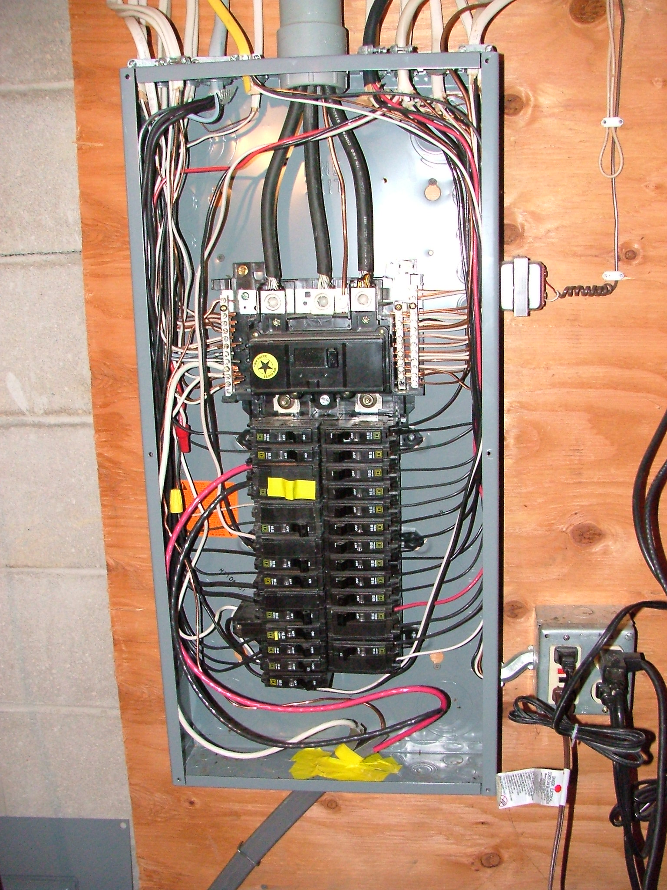
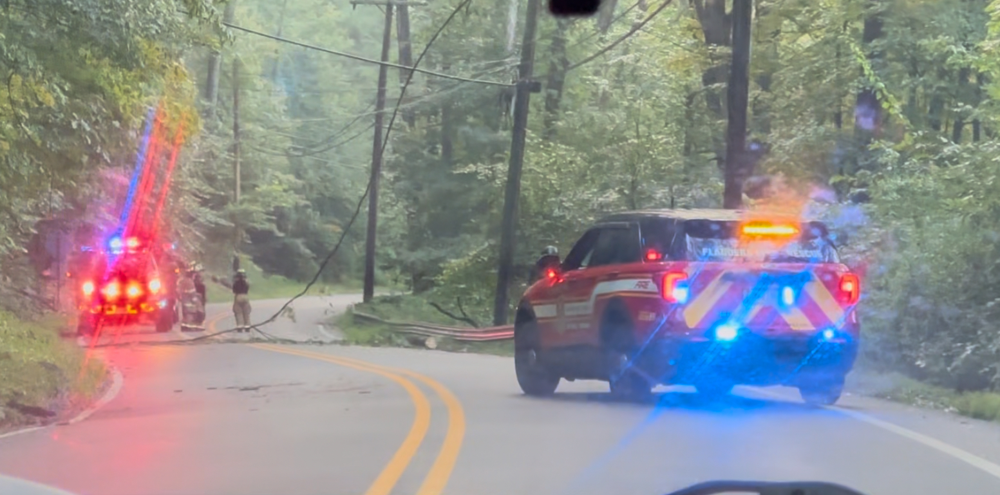
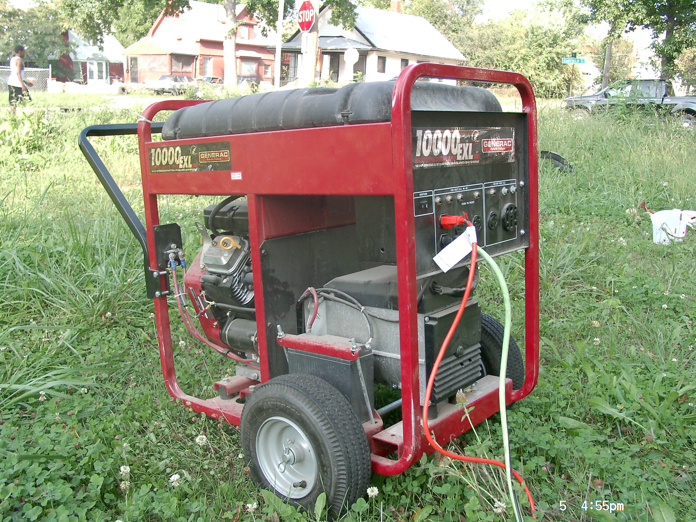

# Electrical, Gas & Utility Safety

## Read this first (the 30-second version)
1. **Electricity and gas can kill in seconds, and often give little or no warning.** When in doubt, get out and stay out — don't investigate, don't test, don't "just check."
2. **Never touch a downed power line or anything touching one** (fence, tree limb, puddle, a car). Assume every line is live. **Stay back at least 35 feet (about 10 car lengths / 10 m)** — treat **10 feet (3 m) as the bare absolute minimum** you should never come closer than even briefly, but 35 feet is the real target distance because energized current can spread through the ground well beyond 10 feet. Call 911 and the utility.
3. **Smell gas (rotten-egg odor) or hear a hiss?** Do **not** flip any switch, light a match, or use your phone inside. Leave the doors open if you can do it in passing, get everyone out and well away from the building, and call the gas company or 911 from a safe distance.
4. **Water and electricity that have mixed — a flooded panel, a submerged outlet, a wet appliance — must never be energized/turned back on by a beginner.** Get it inspected by a licensed electrician first, even if it looks dry.
5. **Never plug a generator into a wall outlet** ("backfeeding"). It can send lethal voltage down lines that utility crews believe are dead, killing them, and it can start a fire in your own house. Use a transfer switch, an interlock device, or run cords straight from the generator — nothing else.
6. **You can always shut off power at the main breaker and gas at the meter/tank valve yourself.** You should almost never turn either one back **on** yourself after a hazard — that's a job for the utility or a licensed professional.

The rest of this guide walks through the breaker panel, how to spot a developing electrical or gas hazard before it becomes an emergency, what downed lines and gas leaks actually require of you, and the generator mistakes that kill people every single storm season.

---

## Why this matters
A house fire can start from a single overloaded outlet or a frayed cord in the time it takes you to fall asleep. Natural gas and propane are heavier tricks than they seem — a leak that pools indoors needs only a small spark (a light switch, a doorbell, a phone screen lighting up) to cause an explosion that can level part of a structure. A downed power line carries anywhere from a few thousand to tens of thousands of volts — far beyond what the human body can survive contact with — and it doesn't always spark or hum to warn you; a "dead-looking" line can still be live. And every year, well-meaning people back-feed a generator into their house wiring during an outage and unknowingly kill a lineworker miles away who was working on what should have been a de-energized section of grid. None of this requires bad luck — it requires only a beginner not knowing the handful of rules in this guide. The good news: those rules are simple, and doing the right thing is almost always the passive, "leave it alone and call someone" option, not a complicated repair.

## Key terms (plain language)
- **Breaker panel / service panel / "the box"** — the metal box (often gray) where power enters your house and is split into individual circuits. Usually in a garage, basement, utility closet, or on an exterior wall.
- **Main breaker** — the single large switch (or pair of switches ganged together) at the top of the panel that controls **all** power to the entire house at once.
- **Branch circuit / breaker** — one of the smaller switches below the main; each one feeds a specific area or set of outlets/lights (e.g., "Kitchen," "Bedrooms," "AC Unit").
- **Trip** — when a breaker automatically shuts off because it detected too much current (overload) or a short circuit, protecting the wiring from overheating.
- **GFCI (Ground-Fault Circuit Interrupter)** — a special outlet or breaker (has "TEST"/"RESET" buttons) that detects current leaking to ground — such as through water or a person — and shuts off in a fraction of a second. Required near water (kitchens, bathrooms, garages, outdoors).
- **AFCI (Arc-Fault Circuit Interrupter)** — a breaker that detects the electrical "arcing" signature of a damaged wire or cord and trips before it can start a fire. Often combined with GFCI in newer panels.
- **Short circuit** — when electricity finds an unintended shortcut (e.g., through frayed wire touching frayed wire, or through water), causing a sudden surge of current — the most common cause of both tripped breakers and electrical fires.
- **De-energize / energize** — turn power off / turn power on. Professionals use "de-energize" because "off" can be ambiguous about *which* switch.
- **Backfeed** — electricity flowing backward from a generator through your house wiring, out through the meter, and onto the utility's lines — the opposite of the normal direction. Extremely dangerous (see the Generator section).
- **Transfer switch** — a device installed by a licensed electrician that lets a generator power selected house circuits while **mechanically guaranteeing** the house is disconnected from the utility grid at the same time.
- **Interlock device** — a simpler, cheaper mechanical part added to a panel that physically prevents the main breaker and a generator breaker from both being switched ON at once.
- **Meter** — the device (usually outside) that measures how much electricity or gas you use; gas meters have a shutoff valve near them.
- **Mercaptan** — the "rotten egg" chemical added to naturally odorless natural gas and propane specifically so leaks can be smelled.
- **Regulator** — the device on a propane tank or gas line that controls gas pressure; if it's damaged (e.g., knocked over tank, storm debris) it can leak.

---

# PART 1 — THE BREAKER PANEL

## Finding and reading your panel
Locate your service panel now, before an emergency — a metal door, usually gray, on a garage wall, basement wall, utility closet, or an exterior wall near where the power line enters the house. Open the door. Inside you'll see:


*Figure — A typical US residential breaker panel (load center) with the dead-front cover removed, showing rows of individual circuit breakers. Day to day you'll only see the breaker switch handles through slots in a closed cover, with a directory label listing what each one controls — this shows what's actually behind it. Source: Wikimedia Commons (File:US wiring basement-panel.jpg), davef3138, CC BY 2.0.*

```
        ┌───────────────────────────────┐
        │        SERVICE PANEL          │
        │                                │
        │   ┌──────────────────────┐     │
        │   │   MAIN BREAKER        │    │  <- large switch (or one lever
        │   │   (100A / 150A / 200A)│    │     controlling 2 switches),
        │   └──────────────────────┘     │     top or side of the panel.
        │                                │     Controls ALL power.
        │   ─────────────────────────    │
        │   │ Kitchen      │ 20A │ ON│   │
        │   │ Living Rm    │ 15A │ ON│   │  <- BRANCH breakers, each
        │   │ Bedrooms     │ 15A │ ON│   │     one labeled for a room
        │   │ AC Unit      │ 30A │ ON│   │     or appliance. This is
        │   │ Water Heater │ 30A │ ON│   │     where you'd expect labels
        │   │ Garage/GFCI  │ 20A │ ON│   │     — if yours aren't labeled,
        │   │ SPARE        │  -- │ --│   │     label them today (see below).
        │   └──────────────────────┘     │
        └───────────────────────────────┘
```

- **The main breaker** cuts power to the **entire house** at once. It's usually the largest switch, physically separate from (often above) the rows of smaller breakers, and often labeled with the total amperage of your service (100, 150, or 200 amps).
- **Branch breakers** are the smaller switches below it. Each should be labeled for what it controls. If yours aren't labeled (common in older or rental homes), spend 20 minutes now: flip one branch breaker at a time, walk the house to see what went dark/dead, and label it with tape and a marker. **Do this before an emergency, not during one.**

### How to safely shut off power
**Shutting off one circuit** (e.g., before working near an outlet, or a wet appliance): flip that breaker's switch fully to the **OFF** position (down, in most US panels). Confirm the circuit is dead by testing a lamp or outlet tester on it, not just by looking at the switch.

**Shutting off the whole house** (flooding, storm damage, working near the panel itself, suspected short you can't isolate): flip the **main breaker** to OFF. This is safe to do at any time and requires no special skill — it's simply a switch. Do it with a dry hand, and don't stand in water while doing it.

> ⚠️ You never need special tools or knowledge to turn power **off**. Turning it back **on** after any hazard (flooding, burning smell, storm damage) is where beginners should stop and call a professional — see "When NOT to reconnect," below.

### Resetting a tripped breaker (normal, everyday task)
A tripped breaker sits in a middle position — not fully with the others in the ON row, but not fully OFF either. This is normal and usually means a circuit was simply overloaded (too many devices at once), not that something is broken.
1. **Unplug or turn off** some of the devices on that circuit (you may not know which ones — start with anything high-draw: space heater, hair dryer, microwave, window AC).
2. Flip the breaker **fully to OFF**, then firmly **to ON**.
3. If it stays on: you likely had a simple overload. Bring devices back on one at a time.
4. **If it trips again immediately, or trips again soon after**, do not keep resetting it. Repeated tripping means a short circuit or a real fault in the wiring or a device — stop, unplug everything on that circuit, and if it still trips with nothing plugged in, **call a licensed electrician.** Do not "hold it in place" or tape/wedge a breaker to stay on — that defeats the safety protection and is a fire risk.

### GFCI outlets and breakers — testing and resetting
GFCI outlets (the ones with small "TEST" and "RESET" buttons, usually near sinks, in bathrooms, garages, and outdoors) protect you from shock by cutting power in a fraction of a second if current is leaking somewhere it shouldn't — including through a person.
1. **To reset a tripped GFCI outlet:** press the **RESET** button firmly. If the outlet regains power, you're done.
2. **Test them monthly:** press **TEST** (power should cut off — check with a lamp), then **RESET** (power should return). This is quick, free, and confirms the safety device actually works.
3. **A GFCI breaker in the panel** (instead of, or in addition to, an outlet) has a small reset button on its face — same idea: flip/press to reset.
4. **If a GFCI won't reset, or trips again right away or repeatedly**, that is a real warning sign — often moisture intrusion into a fixture or wiring, or a genuine ground fault. Don't force it or bypass it. Leave that circuit off and call an electrician, especially if the outlet is near water or was recently wet.

---

# PART 2 — RECOGNIZING ELECTRICAL HAZARDS BEFORE THEY BECOME EMERGENCIES

Learn these warning signs. Any one of them means **stop using that circuit/device now** and investigate or call a professional — don't wait for it to get worse.

| Warning sign | What it usually means | What to do |
|---|---|---|
| **Burning / hot-plastic smell**, no obvious source | Overheating wire, device, or connection — a leading pre-fire warning sign | Shut off the circuit (or the main if you can't isolate it) immediately; find the source before turning anything back on; call an electrician if it's in the wiring/panel itself |
| **Outlet or switch plate is warm, discolored, or has a scorch mark** | Loose connection or overload arcing inside the box | Stop using it now; shut off its breaker; have it inspected/replaced |
| **Frayed, cracked, or chewed cords** (pets, age, pinched under furniture) | Exposed live wire — shock and fire risk | Unplug and replace the cord/device; never tape over exposed wire as a fix |
| **Flickering lights** (especially just on one circuit, or when a large appliance kicks on) | Loose wiring connection, overloaded circuit, or a failing breaker | Have an electrician check it, especially if it's new or getting worse |
| **Buzzing, crackling, or sizzling sound** from an outlet, switch, or the panel itself | Arcing — active fire risk | Shut off that circuit or the main immediately; do not investigate further yourself; call an electrician |
| **Mild-to-moderate tingling shock** when touching an appliance or a metal fixture | Current leaking somewhere it shouldn't ("ground fault") | Unplug/stop using it immediately; do not touch it again until inspected; this is exactly what GFCIs are designed to catch |
| **Water and electricity together** — a wet outlet, an appliance that got splashed/submerged, standing water near the panel | One of the most dangerous combinations there is — water conducts electricity and can carry lethal current to anyone who touches it | Do **not** touch the appliance, outlet, or standing water. Shut off power at the breaker or main **without stepping in the water** if at all possible; if the panel itself is wet, do not touch it — call the utility to disconnect power at the meter/pole instead |
| **A persistent smell like an "electrical fire" smell (hot, acrid, plasticky) from the panel itself** | Serious — often a failing breaker or loose main connection | Evacuate that area, shut off the main from a dry position if reachable without danger, call the fire department if you smell smoke too, then an electrician |

> ⚠️ If you ever have to choose between stepping into water to reach a switch and just leaving the power on and getting everyone away from the area instead — **leave the power on and get away.** A breaker box you can't safely reach is a problem for the utility company, not a reason to risk electrocution.

---

# PART 3 — DOWNED POWER LINES

Downed lines are one of the most common and most lethal hazards after storms, ice, high wind, and vehicle accidents involving poles.

## The core rules
1. **Assume every downed line is live**, no matter how it looks — sparking, sagging quietly, or lying still and "dead." Power can be restored remotely without warning, and even lines that are genuinely de-energized can become energized by backfeed from a neighbor's generator (see Part 6) or by contact with another live line. OSHA's downed-conductor guidance is explicit: never assume a line is safe simply because it's on the ground, not sparking, or not humming.
2. **The one distance to remember: stay back at least 35 feet (about 10 car lengths / 10 m)** from the line itself **and from anything touching it** — a fence, a puddle, a tree branch, a parked car, another person. This is the practical "get this far back, every time" number (ESFI's public guidance). **Treat 10 feet (3 m) as the bare absolute rock-bottom minimum** you should never be closer than even for a second — but 10 feet is a last-resort floor, not a target; 35+ feet is genuinely safer because the ground itself can carry current outward from the contact point (see "step potential," below), especially on wet ground. The further back, the better; there is no such thing as "too far" here.
   - **If it's a large steel-lattice transmission tower line** (the tall high-voltage towers, not an ordinary neighborhood utility pole) — stay back **at least 100 feet**; these lines carry far higher voltage and current can arc through air itself without any contact at all.
   - **This same 35-ft-headline / 10-ft-absolute-floor rule applies everywhere in this knowledge base** — see also [Structural & Utility Emergencies](../structural-utility-emergencies/structural-utility-emergencies.md), which uses identical distances for the same reason.
3. **Never touch a downed line, or anything touching it, for any reason** — not to move it, not to help someone, not to retrieve a pet or item.
4. **Keep others away too.** Warn people nearby, block the area if you can do so from a safe distance (e.g., directing traffic away, not by placing anything ON the line), and call 911 and your electric utility immediately.
5. **Step potential:** electricity flows outward through the ground around a downed line in decreasing-voltage rings, strongest near the contact point and weaker farther out. If you're inside this zone, your two feet can be at different voltages, and current flows through your legs. If you find yourself in this zone: do **not** run (long strides = bigger voltage difference between your feet). Instead, keep your feet together and take small **shuffling steps**, or hop with both feet together, moving directly away from the line until you're well clear (35+ ft).

**Why two different numbers, and which one matters:** OSHA's general minimum-approach guidance for equipment working near lines under 50 kV is 10 feet — a bare regulatory floor written for trained workers with situational awareness, not the public. ESFI's public safety message, aimed at everyday people encountering a downed line with no way to judge its voltage, is 35 feet. This guide's headline number is **35 feet**, exactly like the household hub guide — treat 10 feet only as "if you are somehow already closer than 35 feet, do not take one more step toward the line," never as a distance you deliberately approach to.


*Figure — A downed line closing a road after a storm. Note that it can be difficult to even see a line down in low light or tangled in debris — treat any road closure, sagging tree, or unusual arrangement of wires after a storm as a possible downed line until you can identify it from a safe distance. Source: Wikimedia Commons (File:Downed power line and closed road in Morris County, NJ after a storm at night 02.jpg), Stuttle2, CC BY 4.0.*

## If a car has a line on it
This is common after a pole is struck.
- **If you are inside the car:** stay inside. The car's tires generally insulate you from the ground as long as you don't create a path between the car and the ground. Honk the horn, use a phone to call 911, and wait for the utility/fire department to confirm the line is de-energized before anyone exits.
- **Do not** let anyone outside the car touch it.
- **If the car is on fire and you must get out** (last resort — only if staying is clearly more dangerous, e.g., fire): **jump clear** with both feet leaving the car at the same time, landing together, so you never bridge a voltage difference between the car and the ground with one foot in each place. Then, without letting your feet separate more than a shuffle, hop or shuffle-step away with feet together until you are well clear (35+ ft) — do not take normal running strides.
- **Never drive over a downed line**, even one that looks dead.

## After the immediate danger
- Call **911** and your electric utility's emergency/outage line to report the exact location.
- Do not attempt to move the line with a stick, rope, dry wood, or any other object — insulation you improvise is not reliable at line voltages, and it isn't your job.
- Keep children and pets away from the entire area, not just the line itself, until utility crews confirm it's de-energized and repaired.

---

# PART 4 — NATURAL GAS AND PROPANE

## How to detect a leak
Natural gas and propane are naturally odorless; utilities add **mercaptan**, a chemical that smells like rotten eggs or sulfur, specifically so you can detect leaks by smell. Signs of a leak:
- **Smell** — a persistent rotten-egg/sulfur odor indoors, outdoors near a meter/tank, or near an appliance.
- **Sound** — a hissing or roaring sound near a gas line, meter, regulator, or appliance connection.
- **Visual, outdoors (buried lines)** — dead or discolored vegetation in an otherwise healthy strip of yard, dirt blowing/bubbling from the ground, or bubbling in standing water or a puddle over a buried line.
- **The meter itself** — if you suspect a leak, check whether the meter's dial is spinning even with all gas appliances off; movement suggests gas is flowing somewhere it shouldn't.
- **Physical symptoms in people** (a leak indoors, or carbon monoxide from an appliance malfunctioning — related but distinct hazard, see the [Fire, Smoke & Air Emergencies guide](../fire-smoke-air-emergencies/fire-smoke-air-emergencies.md)) — headache, dizziness, nausea in multiple people in the same space, especially near appliances.

**Natural gas rises; propane sinks — know which one you have.** This matters for where gas actually pools and where to check first:
- **Natural gas (methane) is lighter than air.** A leak tends to rise and collect near ceilings, in attics, and in upper corners of a room first. This is also why natural gas detectors are mounted **high** on a wall or on the ceiling.
- **Propane is roughly 1.5 times heavier than air.** A leak tends to sink and pool along the floor, in basements, crawlspaces, and other low spots — including outdoors, where it can collect invisibly in a low area near a tank. This is why propane detectors are mounted **low**, close to the floor.
- Either way, the leave-and-call rule below is identical — you are never expected to locate or approach the gas yourself.

**A word of caution about relying on smell alone ("odor fade"):** utilities and pipeline-safety researchers document a real phenomenon called **odor fade**, where the mercaptan smell can weaken or even become temporarily undetectable — most often in new pipe, after a line has just been purged/restored, or in some plastic pipe systems — because the odorant can be absorbed by rust/oxidation inside pipe walls before it reaches you. This is one more reason this guide treats *any* strength of gas smell, however faint, and *any* of the other signs (hissing, dead vegetation, symptoms in multiple people) as equally worth a full evacuation and call — don't wait for the smell to get "bad enough" to be sure.

## The leave-and-call rule
> ⚠️ **If you smell gas or suspect a leak of any strength, do this — in order — and nothing else:**
1. **Do not** flip any light switch, unplug or plug in anything, use a doorbell, light a match/lighter, or use your phone **while still inside**. Any of these can produce the spark that ignites accumulated gas.
2. **Do not** try to find the source yourself by searching room to room, and don't turn on fans hoping to clear it.
3. **Get everyone out immediately**, leaving interior doors open behind you only if that happens naturally in passing — don't stop to prop doors.
4. **Move well away from the structure** — well past your own yard, ideally to a neighbor's or across the street, before making calls.
5. **Call your gas utility's emergency line and/or 911 from a safe distance** — never call from inside or right next to the building.
6. **Do not go back in** for any reason (pets, valuables) until the gas company or fire department says it's safe.

## Shutting off gas yourself
You can and should know how to shut off your own gas supply — this is safe to do and often necessary before evacuating, if you can do it quickly on your way out (never delay evacuation to do this if the leak is strong).

**At the meter (natural gas):**
1. Locate the shutoff valve on the pipe near the meter, usually a rectangular tab/lever.
2. Using a wrench (keep one hanging or taped near the meter for this purpose), turn the valve **a quarter turn** in either direction until the tab is **perpendicular** (crosswise) to the pipe — that's OFF. (Parallel to the pipe = ON.)

**At a propane tank:**
1. Locate the valve on top of the tank (a round knob, distinct from the pressure regulator).
2. Turn it **clockwise** (as if closing a garden hose) until it stops — that shuts off the supply from the tank.
3. If you also have individual appliance shutoff valves (common with propane), close those too.

## Getting it back on — always the professional's job
> ⚠️ **Never turn your own gas supply back on and try to relight pilot lights yourself after a suspected leak, an earthquake, flooding, or any utility-initiated shutoff.** Relighting an entire system safely requires checking every appliance and connection for leaks under pressure and purging air from the lines — done wrong, unburned gas can accumulate and ignite. Most gas utilities will do this reconnection and pilot relighting for you, often at no charge, specifically because this is a job with real consequences for a small mistake. Call your utility to schedule it; don't attempt it yourself even if you feel confident.

---

# PART 5 — DAMAGED APPLIANCES, SURGES, AND FLOODED ELECTRICAL SYSTEMS

## After a power surge (lightning strike nearby, grid fluctuation, a "flicker")
- Unplug sensitive electronics proactively during storms if you have advance warning (see [Power & Energy](../power-energy/power-energy.md) for surge protection basics).
- After the fact, inspect anything that was plugged in for a burnt smell, a melted or discolored plug/cord, or a device that behaves oddly (won't turn on, resets randomly, unusually hot). **Don't keep using anything showing these signs** — even if it "still works," internal damage can develop into a fire risk later.
- Large fixed appliances (HVAC system, well pump, water heater, furnace) that took a direct or near-direct lightning hit should be checked by a professional before you rely on them again.

## After water exposure — appliances and outlets
- **Anything that was submerged, even partially** — a washing machine that flooded, an outlet below the waterline, a window AC unit that sat in standing water — must **not** be plugged in or energized until it has been inspected. Water leaves behind mineral deposits and corrosion inside components that can cause a short or fire well after everything looks and feels dry.
- This includes outlets and switches themselves, not just plug-in devices — a wall outlet that was underwater needs to be replaced, not just dried out and reused.

## Flooded electrical systems (the panel itself, or wiring inside walls)
> ⚠️ **If floodwater reached your breaker panel, wiring inside walls, or hardwired appliances (water heater, HVAC, well pump), do not attempt to turn the power back on yourself — even after the water is gone and everything looks dry.** This is one of the clearest "call a professional" situations in this whole guide, for two reasons: (1) corrosion and mineral deposits from floodwater inside a panel or conduit are a serious fire and shock risk that isn't visible from outside, and (2) if the panel was significantly submerged, the utility company itself may need to physically disconnect and re-approve service before it's safe to re-energize at all.
- Leave the main breaker OFF (or, if you're not certain the panel is safe to even approach, leave the power off at the meter/utility level — call the utility to do this if you can't reach the panel safely).
- Get a licensed electrician to inspect the entire system — panel, any submerged outlets/switches, and affected wiring — before anything is turned back on. Expect that submerged breakers, outlets, and switches typically need replacement, not just drying.
- For the broader order of operations after a flood (what to check first, drying, mold prevention), see [Recovery & Rebuilding](../recovery-rebuilding/recovery-rebuilding.md).

---

# PART 6 — GENERATOR TRANSFER SAFETY (BACKFEED — READ THIS BEFORE YOU BUY OR RUN A GENERATOR)

This section covers the **wiring and shock/electrocution safety** of connecting a generator to your house. For generator **sizing, fuel, and running-watts vs. surge-watts** guidance, see [Power & Energy, Method 7](../power-energy/power-energy.md). For **carbon monoxide** symptoms and treatment, see [Fire, Smoke & Air Emergencies](../fire-smoke-air-emergencies/fire-smoke-air-emergencies.md) — CO from a generator is a completely separate killer from backfeed, and both matter every time you run one.

## Why backfeeding kills people who aren't even near you
"Backfeeding" means connecting a generator to your house wiring in a way that lets its power flow backward — out through your breaker panel, through your electric meter, and onto the utility's power lines outside your house — instead of only forward into your own outlets.

The most common way this happens is a **"suicide cord"**: a homemade extension cord with a standard male (prong) plug on **both** ends. One end plugs into the generator, the other end plugs into a wall outlet or dryer outlet in the house — backward from how a plug is supposed to be used. This energizes your entire house's wiring from the generator side, including the wires running back out to the street.

Here's why that's lethal to someone possibly miles away: neighborhood transformers work in both directions. Normally they step utility-line voltage **down** to household voltage. Run backward, the same transformer steps your generator's household-level voltage **up** to full line voltage — often thousands of volts — right onto lines that utility crews, during a widespread outage, reasonably believe are dead because the whole area lost power. A lineworker touching what should be a de-energized line can be killed instantly by power backfed from a single house, including yours. This is not a rare or exaggerated risk — it is documented every major outage and is why utilities treat backfeeding as one of the most serious things a homeowner can do wrong.

Backfeeding this way also bypasses your house's own breaker protection in reverse, which can overload and damage your wiring or start a fire, and it risks re-energizing your house unpredictably the moment utility power is restored while your generator is still connected.

**The backfeed path, visualized:**
```
NORMAL (safe) direction:
  Utility line --> transformer (steps DOWN) --> meter --> panel --> your outlets

BACKFEED (suicide cord) -- the SAME path, running backward:
  Generator --> your outlet --> panel --> meter --> transformer (steps UP) --> utility line
                                                      ^
                                          thousands of volts now present on a line
                                          crews believe is dead — miles from your house
```
The transformer doesn't know or care which direction the power is flowing — it steps voltage up or down based only on which side it's fed from. That single fact is the entire reason a small household generator can put lethal, full line-voltage power onto the street.

## The only three safe ways to run a generator into or alongside your house

| Method | How it works | Who installs it | Notes |
|---|---|---|---|
| **Transfer switch** | A dedicated switch panel, installed by a licensed electrician, that mechanically/electrically guarantees the house cannot be connected to both the utility grid and the generator at the same time. You flip it to "GEN" only after confirming utility power is off. | Licensed electrician (code-required in most areas) | The gold-standard, safest, and most convenient option if you'll use a generator more than once or twice ever |
| **Interlock device** | A simple mechanical plate or kit added to the breaker panel that physically blocks the main breaker and a dedicated generator breaker from both being switched ON at the same time — you must flip the main OFF before the generator breaker can move to ON. | Should be installed by a licensed electrician to meet code, even though the part itself is inexpensive | A cheaper alternative to a full transfer switch; still requires the homeowner to always flip main OFF first, every time |
| **Direct cords only — no house wiring involved** | Run heavy-duty, outdoor-rated extension cords straight from the generator's own outlets to individual appliances or a window AC unit. Nothing is ever plugged into a wall outlet or breaker panel. | No installation needed | The simplest and cheapest option for beginners with no electrician access — backfeeding is physically impossible because the generator never touches house wiring at all |

**Using a transfer switch or interlock correctly, step by step (once installed by an electrician):**
1. Start the generator outdoors (see placement rules below) and let it stabilize for a minute.
2. At the transfer switch, confirm utility power is actually off (or, for an interlock, flip the main breaker fully OFF first — the interlock plate physically will not let you switch the generator breaker ON until you do).
3. Only then move the transfer switch to "GEN" (or flip the generator breaker ON, for an interlock), and turn on the specific circuits you want powered one at a time, roughly matching your generator's rated wattage — see [Power & Energy, Method 7](../power-energy/power-energy.md) for sizing.
4. To shut down: reverse the order — turn off the powered circuits, switch the transfer switch back to "LINE"/utility (or flip the generator breaker OFF before ever touching the main breaker back ON, for an interlock), then stop the generator.
5. **Never skip the order above or leave both sources able to connect at once** — the entire point of both devices is to make that physically impossible, but only if you operate them as designed.

> ⚠️ **Never use a double-male "suicide cord" to backfeed a generator through a dryer or other wall outlet.** It is illegal in most jurisdictions, it can kill utility workers and neighbors, and it offers you zero protection from shock or fire.

## Other generator wiring safety points (see Power & Energy for the full generator guide)


*Figure — A wheeled portable generator outdoors, the only safe way to run one. Keep it at least 20 feet from any window, door, or vent, on dry, level, uncovered ground — never in a garage, carport, breezeway, porch, or shed, even with doors/windows open. Source: Wikimedia Commons (File:Portable electrical generator angle.jpg), Gbleem, CC BY-SA 3.0.*

- **Place the generator outdoors only, at least 20 feet from any window, door, or vent**, exhaust pointed away from the house — never in a garage, basement, crawlspace, shed, porch, or carport, even with the door open or fans running. The CPSC is blunt about this: its mandatory generator warning label states **"Using a generator indoors CAN KILL YOU IN MINUTES,"** and **"NEVER use inside a home or garage, EVEN IF doors and windows are open."** Opening doors and windows does **not** create enough ventilation to prevent lethal carbon monoxide buildup — an average of roughly 100 Americans die this way every year, most commonly during storm-driven outages.
- Use only outdoor-rated, undamaged, properly gauged extension cords; keep the generator and all cords dry and off wet ground, and never handle the generator, its cords, or its outlets with wet hands.
- **Check for GFCI protection on the generator itself.** Most portable generators built since 2015 (and all as of more recent US electrical code cycles) have GFCI-protected 125-volt receptacles built in — look for outlets with their own small "TEST"/"RESET" buttons directly on the generator's control panel, the same idea as a GFCI wall outlet. This protects you from shock through the cord itself; test it the same way you'd test a household GFCI (Part 1) before relying on it during an outage.
- Run a battery-backed carbon monoxide detector inside the house any time a generator is running nearby, regardless of placement.
- If you smell exhaust or anyone feels dizzy/headachy while a generator is running anywhere nearby, get everyone into fresh air immediately.

---

# PART 7 — WHEN NOT TO RECONNECT SOMETHING / WHEN TO CALL A PRO OR THE UTILITY

As a rule: **you can always safely turn power or gas OFF yourself. Turning either one back ON after a hazard is usually a professional's job.** Stop and call for help — don't try to finish the job yourself — whenever any of these are true:

- A breaker trips again immediately (or soon after) every time you reset it.
- A GFCI outlet or breaker won't reset, or trips again right away.
- You see a scorch mark, melted plastic, or smell burning and can't immediately identify and remove the source.
- Floodwater reached the breaker panel, in-wall wiring, or any hardwired appliance — **even after everything dries out and looks fine.**
- Any outlet, switch, or appliance was submerged, however briefly.
- There was a lightning strike on or very near the house.
- You smell gas at any strength, however faint, or hear hissing near a gas line, meter, or appliance.
- A gas meter, regulator, or propane tank was knocked over, struck, or visibly damaged.
- There is a downed power line anywhere on or near your property, no matter how "dead" it looks.
- You are simply unsure. Uncertainty is itself a reason to call — professionals and utilities exist specifically to handle exactly this uncertainty, and in most areas the safety-critical calls (gas relight, downed-line response) are **free**.

**Who to call:**
- **Downed line, sparking, or a widespread outage:** your electric utility's emergency/outage line, and 911 if there's immediate danger to people.
- **Gas smell or suspected leak:** your gas utility's emergency line (often printed on your bill) and/or 911 — do this from outside, at a safe distance.
- **Wiring, panel, flooded electrical, repeated tripping:** a licensed electrician.
- **Relighting pilot lights / restoring gas service after a shutoff:** your gas utility — many will do this at no charge specifically because it needs to be done correctly.

---

## North Texas / regional notes (Anna, TX and Collin County area)
- **Storms and lines down together:** North Texas severe thunderstorms, straight-line winds, and the occasional tornado bring down power lines and tree limbs together, often in the same event — check for lines tangled in fallen branches before touching *any* downed limb, not just obviously bare wires.
- **Ice storms:** ice-loaded lines and tree limbs are a recurring regional hazard (e.g., the widespread outages of Winter Storm Uri, February 2021); assume any line down after an ice event is live, and expect utility crews to be stretched thin across a wide area, meaning a longer wait than usual — plan your own shutoffs and warmth/safety accordingly rather than waiting near a hazard for a quick response.
- **Rural properties with propane:** many rural North Texas homes use propane tanks rather than piped natural gas — know your tank's shutoff valve location before you need it, and keep a wrench for it accessible (not locked in a shed you can't reach during an emergency).
- **Heat and generators:** North Texas summer heat drives generator use for AC as much as winter storms drive it for heat — the backfeed and CO rules apply exactly the same in July as in February; heat does not make backfeeding any safer.
- **Older housing stock and DIY wiring:** some older homes and additions in the region have undocumented or non-permitted wiring work; treat any unlabeled, unusually old, or obviously homemade-looking panel or wiring with extra caution and a lower threshold for calling an electrician.

---

# ⚠️ Safety — the most important warnings
- **Assume every downed power line is live, always**, including ones that look dead, aren't sparking, or are lying still. Stay **at least 35 feet back** from the line and anything touching it — treat 10 feet as the bare absolute minimum you should never be closer than, never as a target.
- **Never touch a person or object that is in contact with a live or possibly-live line.** If someone is being shocked, do not touch them directly — cut power at the source if you safely can, or use a dry, non-conductive object to separate them only as an absolute last resort, and call 911 immediately.
- **Never backfeed a generator into house wiring** with a double-male "suicide cord" or by any method other than a proper transfer switch or interlock device installed to code. This can kill utility workers and neighbors, not just you.
- **Never energize a breaker panel, outlet, switch, or appliance that has been flooded** — even after it dries and looks normal — until a licensed electrician inspects it.
- **Never use a flame, lighter, or spark-producing device to search for a gas leak.** Use your nose and ears, not fire.
- **Never re-enter a building you evacuated for a suspected gas leak** until the utility or fire department clears it.
- **Never turn your own gas back on and relight pilot lights yourself** after any suspected leak or utility shutoff — call the gas company.
- **Never force, bypass, or tape a tripped breaker or GFCI to stay "on."** A safety device that keeps tripping is telling you about a real fault.
- **Water and electricity together are one of the most dangerous combinations in this entire guide.** Don't step into standing water to reach a switch or touch anything electrical with wet hands — get away and shut off power from a dry position, or call the utility to do it at the meter/pole.
- **When in real doubt about anything in this guide, do nothing and call a professional or the utility.** Every safe action in this guide (shutting off a main breaker, closing a gas valve, staying back from a line) can be done with zero specialized skill; every risky action (reconnecting flooded wiring, relighting gas, backfeeding a generator) requires a professional specifically because getting it wrong is often fatal.

# Troubleshooting
| Problem | Fix |
|---|---|
| Breaker trips repeatedly even with devices unplugged | Stop resetting it — this is a wiring/short-circuit issue, not an overload. Leave it off and call an electrician. |
| GFCI outlet won't reset | Check for moisture in the outlet or nearby wiring; if it still won't reset with everything unplugged, leave it off and call an electrician — don't bypass it. |
| Smell gas but the meter dial isn't moving | Trust your nose over the meter — leaks can occur downstream of the meter (inside the house) or from a propane tank with its own separate gauge. Follow the leave-and-call rule regardless. |
| Not sure if a power line on the ground is really "dead" | Treat it as live regardless of appearance — de-energized lines can be re-energized without warning, including by backfeed from someone else's generator. Stay 35+ ft back. |
| Generator is your only power source and you have no transfer switch or interlock | Do not plug it into any wall outlet. Run heavy-duty outdoor-rated cords directly from the generator to individual appliances instead. |
| Panel or outlets got wet in a flood but seem dry now and you're tempted to just flip them back on | Don't. Corrosion from floodwater is often invisible and shows up later as a fire risk. Get a licensed electrician to inspect first. |
| Pilot light went out after a gas shutoff and you want it working again quickly | Don't relight it yourself after any leak-related or utility shutoff — call the gas utility; many relight pilots for free specifically because doing it wrong is dangerous. |
| Can't tell which breaker controls what | Flip one at a time (when it's safe/convenient, not during an emergency) and walk the house to check; label the panel now so you're not guessing during a real event. |
| Gas smell is very faint — is it really worth a full evacuation? | Yes. "Odor fade" is a real phenomenon that can make a genuine leak smell weaker than it should; treat any strength of smell the same as a strong one and follow the leave-and-call rule regardless. |
| Downed line is on a tall steel transmission tower, not a normal utility pole | Stay back at least 100 feet, not 35 — transmission voltage is far higher and can arc through open air without any contact. |
| Generator's outlets don't have TEST/RESET buttons | Older generators may predate built-in GFCI receptacles — use a portable in-line GFCI cord adapter between the generator and your extension cords, and be extra strict about dry hands/dry ground. |

# Quick-reference checklist
- [ ] Located and labeled the breaker panel (main + every branch circuit) before any emergency happened.
- [ ] Know how to shut off the whole house (main breaker) and a single circuit (branch breaker) — both are simple, safe switch flips.
- [ ] Know how to reset a normally-tripped breaker, and know to STOP and call an electrician if it trips again immediately.
- [ ] Know how to test and reset a GFCI outlet/breaker, and to call an electrician if it won't reset or trips repeatedly.
- [ ] Can recognize burning smells, warm/discolored outlets, frayed cords, and buzzing sounds as "stop using this now" signs.
- [ ] Will stay **at least 35 ft** back from ANY downed line (100 ft for a transmission tower), always assuming it's live, treating 10 ft as an absolute never-closer-than floor — and know the shuffle-step / feet-together rule for step potential.
- [ ] Know where the gas shutoff valve (meter or propane tank) is and how to close it, and keep a wrench accessible near it.
- [ ] Know that natural gas rises (check/detect high) and propane sinks (check/detect low) — and to evacuate for any strength of smell, since "odor fade" can make a real leak smell faint.
- [ ] Know whether my generator's outlets have built-in GFCI protection (TEST/RESET buttons on the unit itself), and have an in-line GFCI adapter if not.
- [ ] Know the leave-and-call rule for a gas smell: no switches/phones/flames inside, get out, get far away, then call.
- [ ] Will never energize a flooded panel/outlet/appliance, and never relight gas pilots myself, without a professional's inspection first.
- [ ] Have a transfer switch, an interlock device, or a direct-cords-only plan for any generator — never a wall-outlet "suicide cord."
- [ ] Understand: turning power/gas OFF is always safe to do myself; turning it back ON after a hazard is usually the utility's or a licensed professional's job.

# Sources & further reading (in this knowledge base)
- **FEMA "Are You Ready?" Guide** — `reference/manuals/are-you-ready-guide.pdf` (utility shutoff procedures, downed-line and gas-leak guidance).
- **American Red Cross Preparedness Guide** — `reference/manuals/redcross_preparednessguide.pdf` (home utility safety, storm and disaster preparedness).
- **CDC Emergency Preparedness Foundations** — `reference/manuals/cdc_emergency_foundations.pdf` (post-disaster hazard assessment).
- **US Army Survival Manual FM 21-76** — `reference/manuals/fm21-76_survival_manual.pdf` (general hazard-avoidance principles referenced throughout this guide).
- **CPSC Portable Generator Safety Alert** — `reference/manuals/cpsc_portable_generator_safety_alert.pdf` (carbon monoxide statistics, mandatory generator warning-label wording, 20-ft placement rule referenced throughout Part 6).
- **OSHA "Working Safely Around Downed Electrical Wires" Fact Sheet** — `reference/manuals/osha_downed_electrical_wires_fact_sheet.pdf` (never-assume-it's-dead guidance and minimum-approach-distance basis for Part 3).
- This guide's downed-power-line distances were cross-checked against ESFI's public safety guidance (35 ft / 10 car lengths as the practical stay-back distance, 100 ft for transmission towers) and OSHA's minimum-approach-distance guidance (10 ft as an absolute floor for lines under 50 kV) — the same two figures, framed the same way, are used in [Structural & Utility Emergencies](../structural-utility-emergencies/structural-utility-emergencies.md) so the two guides agree exactly. The natural-gas-rises/propane-sinks distinction and "odor fade" phenomenon were verified against utility consumer-safety pages (e.g., PG&E, National Grid, PSEG) and propane-industry safety sources.
- See also: [Structural & Utility Emergencies](../structural-utility-emergencies/structural-utility-emergencies.md) (the quick "what do I shut off first" household hub — this guide is its deep-dive reference), [Power & Energy](../power-energy/power-energy.md) (generator sizing, fuel, and output), [Fire, Smoke & Air Emergencies](../fire-smoke-air-emergencies/fire-smoke-air-emergencies.md) (carbon monoxide poisoning), [Recovery & Rebuilding](../recovery-rebuilding/recovery-rebuilding.md) (post-flood restoration order), [First Aid](../first-aid/first-aid.md) (electric shock and burn first aid), and [Home Structural Assessment](../home-structural-assessment/home-structural-assessment.md) (checking a building for safety after damage).

**Image credits (all from Wikimedia Commons, openly licensed):**
- Breaker panel — File:US wiring basement-panel.jpg, davef3138, CC BY 2.0.
- Portable generator outdoors — File:Portable electrical generator angle.jpg, Gbleem, CC BY-SA 3.0.
- Downed power line after a storm — File:Downed power line and closed road in Morris County, NJ after a storm at night 02.jpg, Stuttle2, CC BY 4.0.
