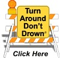

# Evacuation, Bug-Out & Vehicle Survival

## Read this first (the 30-second version)
1. **Decide fast, act faster.** The moment officials, your senses, or your gut tell you to leave, go — don't wait for a "perfect" moment. (For *whether* to evacuate vs. shelter in place, see [Emergency Planning & Triage](../emergency-planning-triage/emergency-planning-triage.md); this guide covers *how* to execute the evacuation once you've decided.)
2. **Grab your pre-packed go-bag(s) and go.** If you have 5 minutes: people, pets, go-bags, keys, phone. That's it — everything else is a bonus if you have more time.
3. **Keep your gas tank at least half full, always** — top it off to full the moment an evacuation seems likely (storm tracking your way, wildfire watch, winter storm forecast). Never plan to evacuate on an empty or near-empty tank.
4. **Have a primary route AND at least one alternate planned in advance** — written down on paper, not just in your phone.
5. **If your vehicle becomes stranded: stay with it.** A car is bigger, more visible, and better shelter than you are on foot. Make yourself visible, stay warm, and signal for help.
6. **Don't go home until officials say it's safe** — the danger often isn't over when the event ends.

The rest of this guide covers what to pack (bug-out bag vs. get-home bag, in full), the three evacuation time-levels, a vehicle emergency kit, route and convoy planning, fuel management, evacuating with kids and pets, what to take vs. leave, what to do if you get stranded, and how to safely return home. **A person who has never done this before can follow it.**

---

## Why this matters
Evacuations rarely happen on a convenient schedule. Wildfires can go from "watch" to "leave now" in under an hour; flash floods rise faster than people expect; a hurricane's track can shift and put you in a mandatory-evacuation zone with only a day or two of notice; a chemical spill or grassfire on a windy North Texas day can close a road with no warning. The single biggest predictor of a safe evacuation isn't luck — it's **preparation done before the emergency**: bags already packed, routes already chosen, a full tank of gas, and a family plan everyone already knows. People get hurt or stuck when they try to figure all of this out *during* the event, in traffic, in the dark, with a scared kid or a panicking pet, and a gas gauge on empty.

## Key terms (plain language)
- **Evacuation** — leaving your home or area ahead of, or during, a hazard because staying is more dangerous than leaving.
- **Bug-out bag (BOB) / go-bag** — a bag packed in advance with everything you need to survive **72 hours or more** away from home, grabbed on the way out the door.
- **Get-home bag / stay bag** — a smaller bag kept at work, school, or in your vehicle, built to get you **from wherever you are back to home** (or to your family) if your normal transportation fails — this may mean walking.
- **Vehicle emergency kit** — supplies that live **in the vehicle permanently**, separate from your go-bag, for roadside problems and being stranded.
- **Rally point / muster point** — a pre-agreed place where separated family members will meet or head to if they can't reach each other.
- **Out-of-area contact** — a relative or friend **outside** your region that separated family members all call/text, because long-distance calls often get through when local lines are jammed.
- **Contraflow** — emergency traffic management (usually for hurricanes) where **all lanes**, including normally inbound ones, are turned to flow outbound, away from the danger.
- **Bottleneck** — a single choke point (one bridge, one two-lane road) that an entire evacuating population must funnel through; a common cause of gridlock.
- **Re-entry** — returning to your home area after an evacuation order is lifted.
- **Range (fuel)** — the distance your vehicle can travel on its remaining fuel; shrinks in stop-and-go evacuation traffic, cold weather, and with a heavily loaded vehicle.

---

# PART 1 — The three evacuation levels: 5, 15, and 30 minutes

You will almost never get to choose how much time you have. Build your plan around the **worst case (5 minutes)** and let more time be a bonus, not a requirement.

> This section covers *how fast to move and what to grab at each time level*. For the underlying decision of *whether* a given situation calls for evacuating at all versus sheltering in place, see [Emergency Planning & Triage](../emergency-planning-triage/emergency-planning-triage.md).

| Time available | What to grab (cumulative — each level includes everything above it) |
|---|---|
| **5 minutes** ("go now") | People + pets. Your **go-bag(s)** (already packed, by the door). Car keys. Phone + wallet/purse (ID, cards). Shoes on. **Leave immediately** — do not stop to look for anything else. |
| **15 minutes** | + Medications (prescriptions, glasses, hearing aids). Phone/laptop chargers. A folder or waterproof pouch of critical documents if not already in your go-bag (see Part 8). One extra layer of clothing per person, and **change into sturdy closed-toe shoes/boots, long pants, and a long-sleeved shirt** rather than what you happen to be wearing — this is standard Ready.gov guidance and protects against debris, glass, and hot surfaces. Top off water bottles. If safe and quick, top off the vehicle's fuel tank. |
| **30 minutes** | + Load the **vehicle emergency kit** (Part 3) if not already stored in the car. Cooler with perishable food/ice, extra water jugs. Small irreplaceable valuables (photos, heirlooms — see Part 8). Secure pets that must stay in carriers; let large livestock out of barns/into a field if instructed and safe to do so. **Unplug small electronics** (TVs, radios, small appliances) to protect them from power surges — **leave freezers and refrigerators plugged in** unless flooding is a specific risk. Turn off utilities (water/gas/electricity) **only if instructed by officials or if your home is damaged** (see [Emergency Planning & Triage](../emergency-planning-triage/emergency-planning-triage.md) for full utility shutoff guidance). **Check with neighbors — especially elderly or disabled ones — who may need a ride out.** Leave a note for anyone who might come looking (where you're headed, when you left). Do a final walkthrough of the house, and lock doors and windows on your way out. Recheck tire pressure and fuel. **If your household has more than one working vehicle, consider taking only one per family to reduce road congestion** — combine into fewer vehicles when the group and cargo allow it. |

**How to practice this:** once a year, time yourself and your family doing a "5-minute drill" — everyone to the car with go-bags, from a cold start. Most families are surprised how much gets forgotten under time pressure; drilling fixes that before it matters.

---

# PART 2 — Go-bag (bug-out bag) vs. stay-bag (get-home bag)

These are **two different tools for two different problems.** Build both.

## 2A. Bug-out bag (BOB) — kept at home, grabbed on the way out
**Purpose:** survive on your own for 72 hours or more, whether you end up in a vehicle, a shelter, or on foot.

*Figure — A Red Cross "ready to go" preparedness kit and its contents. Source: Wikimedia Commons (File:FEMA - 37174 - Emergency Preparedness "ready to go" kit..jpg), FEMA Photo Library / American Red Cross, public domain (US government work).* Lay your own kit out like this once a year to check for expired food/meds, dead batteries, and outgrown kids' clothing — it's much easier to spot gaps this way than by reading a checklist alone.

| Category | Contents | Improvised substitute |
|---|---|---|
| Water | 1 gallon/day/person for 3 days, or a bottle + portable filter/purification tablets | See [Water guide](../water/water.md) for full purification methods |
| Food | 3 days of no-cook, high-calorie food per person (bars, jerky, peanut butter, canned goods + can opener) | Any shelf-stable calories you already have; rotate stock — full lists in [Supplies, Inventory & Rotation](../supplies-inventory-rotation/supplies-inventory-rotation.md) |
| Clothing | Full change of clothes, sturdy closed-toe shoes, rain layer, weather-appropriate extra layer | Layer whatever is clean and durable |
| Shelter/warmth | Emergency blanket (mylar) or compact sleeping bag, small tarp | Large contractor bags, extra blankets |
| First aid | Small kit (see [First Aid](../first-aid/first-aid.md)) + personal medications (7+ day supply, rotated) | — |
| Fire | Lighter + waterproof matches | See [Fire guide](../fire/fire.md) |
| Light | Headlamp or flashlight + spare batteries | Phone flashlight (drains battery fast — not a substitute long-term) |
| Tools | Multitool/knife, duct tape, 50 ft paracord, small tool kit | Any sturdy knife + tape |
| Navigation | Paper map of your region and evacuation routes, compass | See [Navigation guide](../navigation/navigation.md) |
| Communication | Whistle, hand-crank/battery radio, list of phone numbers on paper | — |
| Documents | Waterproof pouch with copies of ID, insurance, medical info, cash in small bills | See Part 8 below |
| Hygiene/sanitation | Travel toiletries, hand sanitizer, N95 masks, toilet paper, trash bags | See [Sanitation & Hygiene](../sanitation-hygiene/sanitation-hygiene.md) |
| Other | Work gloves, dust mask, signal mirror, seasonal items (hand warmers/sunscreen) | — |

Pack one bag **per adult** sized to what that person can actually carry a mile or two, plus a smaller version scaled down for each child (see Part 6). Store bags somewhere you pass every day (a front closet, mudroom) — not in the attic or a back shed you'd have to dig for.

## 2B. Get-home bag / stay bag — kept at work, school, or in the vehicle
**Purpose:** get you from wherever you happen to be **back to your family or home**, possibly **on foot**, if roads are gridlocked, public transit is down, or your vehicle is unusable. Smaller and lighter than a BOB — built to carry while walking, possibly for miles, in work clothes.

**Contents:**
- Sturdy, broken-in walking shoes or boots (don't rely on dress shoes/heels)
- A change of comfortable clothes and socks
- Water (at least 1 liter) + a way to purify more
- High-calorie, no-cook snacks (bars, nuts)
- Small flashlight/headlamp + whistle
- Compact first aid kit
- Lightweight rain poncho
- Cash in small bills (card readers/ATMs may be down)
- Phone battery pack + cable
- A paper map of the route home, marked in advance
- Multitool, small dust mask, work gloves
- A printed card with emergency contacts and your rally point (in case your phone dies)

Keep one in your desk at work, one in each family vehicle, and consider one in a child's backpack (age-appropriate, see [Children & Family Operations](../children-family-operations/children-family-operations.md) for how to talk to kids about this and age-appropriate contents).

---

# PART 3 — Vehicle emergency kit

This lives **in the vehicle year-round**, separate from your go-bag, and covers roadside problems on any drive, not just a declared evacuation.

**Contents checklist:**
- Jumper cables or a portable jump-start battery pack
- Basic tire repair kit + tire pressure gauge; a full-size or compact spare, checked periodically
- Small folding shovel, tow strap
- Reflective warning triangles or road flares
- First aid kit (see [First Aid](../first-aid/first-aid.md))
- Wool blanket(s), extra warm layer
- Bottled water and shelf-stable snacks
- Phone charger (car adapter)
- Paper road atlas/maps (state and county level)
- Flashlight/headlamp + spare batteries
- Multitool, duct tape, zip ties
- Small fire extinguisher (rated for vehicle fires)
- Seatbelt cutter / window-breaker tool
- Bag of sand, cat litter, or traction mats (for ice/mud/snow — winter especially)
- Ice scraper (winter regions)
- Basic fluids: engine oil, coolant, funnel (top-off amounts, not a full refill)
- Small bills of cash
- Portable tire inflator (12V or battery-powered) in addition to a manual tire repair kit — gets a slow leak or plug repair up to driving pressure without a floor pump
- A **white cloth, bandana, or distress flag** dedicated to signaling (tie to the antenna or hang from a window — see Part 9) and a **chemical light stick** for nighttime visibility that doesn't drain the vehicle battery

> This kit is for **surviving and signaling** roadside problems. The actual mechanical fixes — changing a flat tire, jump-starting a dead battery, dealing with an overheating engine, winter driving technique, and bicycle breakdowns — are covered step-by-step in [Transportation & Vehicle Emergencies](../transportation-vehicle-emergencies/transportation-vehicle-emergencies.md). Keep that guide's steps in mind; this guide focuses on evacuation planning and what to do once you are stranded (Part 9).

## Pre-season vehicle readiness check
Before wildfire season, hurricane season, or the first hard freeze, have a mechanic (or check yourself if you're able) verify:
- Antifreeze/coolant level
- Battery and ignition system condition
- Brakes
- Exhaust system (a leak can put carbon monoxide into the cabin — see Part 9)
- Fuel and air filters
- Heater and defroster (needed to keep windows clear and cabin livable if stranded in cold)
- Lights and hazard flashers all working
- Engine oil
- Thermostat
- Windshield wipers and washer fluid level, tire tread depth and pressure (including the spare)

A vehicle that fails mid-evacuation because of a problem that a 20-minute mechanic check would have caught is one of the most preventable ways to end up stranded.

---

# PART 4 — Planning evacuation routes (primary + alternate)

**Do this before you ever need it — not while you're already in the car.**

1. **Identify at least one primary route and two alternates** out of your area, in different directions if possible. A single route that everyone in your town shares is a bottleneck waiting to happen.
2. **Avoid single points of failure.** A route that depends on one bridge, one low-water crossing, or one two-lane road with no other way around is fragile — floodwater, a wreck, or downed trees can close it instantly.

**Flood water and low-water crossings — the exact numbers (verified against NWS/NOAA and Ready.gov):**

*Figure — The National Weather Service's "Turn Around Don't Drown" symbol, used on roadside signage to warn drivers away from flooded roads. Source: Wikimedia Commons (File:Turn Around Don't Drown.gif), NOAA/National Weather Service, public domain (US government work).*

| Depth of moving water | What it does |
|---|---|
| **6 inches** | Can knock an adult off their feet; can cause a passenger vehicle to lose control or stall. |
| **12 inches (1 foot)** | Will float and carry away most passenger cars. |
| **24 inches (2 feet)** | Can carry away SUVs and trucks. |

**Never drive around a barricade or through water on a roadway, moving or standing — "Turn Around, Don't Drown."** You cannot see how deep the water actually is, whether the road underneath has washed out, or whether it's carrying debris or downed power lines. Over half of all flood deaths involve a vehicle driven into flood water. This applies even to water that looks shallow or that "everyone else is driving through" — road surfaces erode unevenly, and a crossing that was fine an hour ago may not be now. Build your route planning around this: identify in advance which of your primary/alternate routes cross low-water crossings, creek bridges, or dips, and have at least one route that avoids them entirely during any flood watch/warning.
3. **Mark rally points** — a spot on the edge of town, a relative's house, or a specific parking lot — where family members will head if they get separated or can't reach each other by phone.
4. **Print paper maps and mark all routes on them.** Cell networks and GPS both fail or get overloaded during real emergencies — see [Navigation Without GPS](../navigation/navigation.md) for full detail on map reading, dead reckoning, and finding direction without electronics. At minimum, keep a marked-up paper county/state map in the vehicle kit.
5. **Know your contraflow situation** (mainly hurricane regions, but also applies to major highway evacuations): some states reverse inbound lanes to all-outbound during mandatory evacuations. Know if your route uses one and when it typically activates — check your county emergency management office's plan in advance.
6. **Convoy driving, if evacuating with multiple vehicles:**
   - Assign a lead and a trail vehicle; the lead sets pace, the trail watches for anyone falling behind.
   - **Never split up** without a pre-agreed rally point and a plan to reconnect.
   - Agree on fuel-stop intervals *before* leaving, not mid-drive.
   - Use FRS/GMRS family radios or a phone group chat for coordination — don't rely on hand signals in heavy traffic.
   - If a vehicle in your convoy breaks down, the whole group pulls over together at the next safe spot rather than leaving one vehicle to fend alone.
7. **Tell someone outside the danger area your route and ETA** — your out-of-area contact (see Key terms) should know which route you're taking and roughly when you expect to arrive.

---

# PART 5 — Fuel management

Running out of fuel in evacuation traffic is one of the most common, most preventable evacuation failures.

- **The half-tank rule (verified against Ready.gov):** keep a **half tank of gas in your vehicle at all times, year-round** — not just during an active threat — because you may need to evacuate with no warning. **When an evacuation seems likely** (a hurricane is tracking your way, a wildfire watch is issued, a winter storm is forecast), **top off to a full tank immediately.** Treat "half a tank" as your new empty — refuel opportunistically, don't wait for a "convenient" time. A full tank also helps prevent the fuel line from freezing in winter.
- **Know your real range.** Loaded down with passengers, pets, and cargo, and idling in stop-and-go evacuation traffic, a vehicle gets noticeably worse mileage than its rated highway number — often 20–30% worse. Plan fuel stops assuming a **shorter range** than normal.
- **Build in a buffer.** When planning how far you can go on a tank, subtract at least 25% from the vehicle's normal range as a safety margin, and aim to refuel again well before you'd hit empty.
- **Jerry cans (portable fuel containers):**
  - Use **DOT- or UL-approved** metal or plastic fuel containers only — 5-gallon size is common and manageable to carry.
  - Store them **away from living spaces** (a shed or detached garage, not the house), upright, out of direct sun.
  - Gasoline degrades over months; **rotate stored fuel every ~6 months** (burn it through a vehicle and refill) or use a fuel stabilizer additive if long-term storage is unavoidable.
  - Never store or use them near an open flame, and never siphon fuel by mouth.
- **Refuel opportunistically, not reactively.** Top off whenever you pass a station that's open and not jammed — don't wait until the needle is low, because during a mass evacuation, stations run out of fuel or lose power fast, and lines get long.
- **Carry small bills of cash.** Card readers and networked pumps can fail when power or connectivity is disrupted; some stations may go cash-only.

---

# PART 6 — Evacuating with children and pets

**Full logistics for kids (car seats, entertainment, keeping routine, talking to children about the emergency, age-appropriate go-bag contents) are covered in [Children & Family Operations](../children-family-operations/children-family-operations.md).** The essentials for the drive itself:
- Double-check car seats/booster seats are correctly installed **before** you're in a rush.
- Pack familiar comfort items (a stuffed animal, a favorite small toy), snacks, and any needed medications in an easy-to-reach bag.
- Keep a simple explanation ready — calm, brief, and honest — for what's happening and where you're going.

**Pets:**
- Have a carrier or leash/harness for every animal, sized and ready in advance — don't try to improvise one during the emergency.
- Pack **pet food (3+ days), a collapsible bowl, any medications, and a copy of vaccination records** — many shelters and hotels require proof of rabies vaccination to accept animals.
- Make sure every pet has a **collar with ID tags** and, ideally, a microchip registered to a current address/phone number.
- **Research pet-friendly shelters, hotels, or boarding options along your evacuation route in advance** — many public emergency shelters do not accept pets, and finding this out mid-evacuation wastes critical time.
- **Never leave a pet behind chained, caged, or loose "to fend for itself."** If you must leave without it in a true no-time-to-spare emergency, leave doors/gates unlocked if safe to do so and notify local authorities/animal control of the pet's location as soon as possible.
- Livestock and large animals: if you have advance notice, arrange transport or a safe location ahead of time; if not, and officials advise it, open gates/pastures so animals can move away from immediate danger rather than being trapped in a barn or pen.

---

# PART 7 — What to take vs. what to leave behind

**Priority order (in this order, always):**
1. **People and pets** — never delay evacuation to save belongings.
2. **Medications and medical devices** — insulin, inhalers, glasses, mobility aids; these are often irreplaceable on short notice.
3. **Documents and go-bags** (see Part 8 for the document list).
4. **Small, genuinely irreplaceable items** — photos, a family heirloom, a hard drive of family photos/records — if, and only if, grabbing them costs you no meaningful time or safety margin.
5. **Everything else is replaceable.** Furniture, electronics, frozen food, most possessions can be replaced with money and time; a life cannot.

**Leave behind (don't waste time on):**
- Large furniture, appliances, anything that won't fit or that overloads the vehicle.
- Frozen/perishable food beyond what fits in a small cooler.
- Anything you'd have to search for — if it's not already staged and ready, it's not worth the time in a fast evacuation.

> ⚠️ **Don't overload the vehicle.** A car packed to the point that mirrors are blocked, weight is uneven, or the suspension is sagging handles worse, brakes worse, and burns fuel faster — exactly when you need the vehicle most reliable. Load heavy items low and centered, and if in doubt, leave it.

## Part 8 — Documents to grab (keep a pre-made folder/pouch)
Keep these copied and stored together in a waterproof pouch, ready to grab at the 15-minute mark (originals in a fire/water-safe box or safe-deposit box when not evacuating):
- Photo ID for each family member, birth certificates, passports
- Insurance policies (home, auto, health) and account numbers
- A list of medications, dosages, and prescribing doctors for each family member
- Copies of deeds/titles, recent tax return, and a home inventory (photos of belongings) for insurance claims
- Cash in small bills
- A physical list of emergency contacts and out-of-area contact
- Pet vaccination records

Full inventory-list templates and rotation schedules for all of the above live in [Supplies, Inventory & Rotation](../supplies-inventory-rotation/supplies-inventory-rotation.md).

---

# PART 9 — If your vehicle becomes stranded

This section covers **surviving being stuck** — for the mechanical repair itself (flat tire, dead battery, overheating, getting unstuck from mud/snow), see [Transportation & Vehicle Emergencies](../transportation-vehicle-emergencies/transportation-vehicle-emergencies.md).

## The core rule: stay with the vehicle
Unless you know for certain that safety is a short, safe walk away, **stay with your vehicle.** It is:
- **Bigger and easier for rescuers to spot** than a person on foot.
- **Better shelter** from wind, rain, cold, and heat than you'll find in the open.
- **A source of warmth, a horn to signal with, and supplies** from your vehicle emergency kit.

People who leave a stranded vehicle to "walk for help" are frequently the ones search-and-rescue struggles to find, especially in poor visibility, extreme heat, or winter storms.

## If a power line falls on your vehicle
This is one of the most dangerous — and most survivable, if handled correctly — stranded-vehicle scenarios: **stay inside the vehicle.** The vehicle's tires and frame generally insulate you from the ground even if the body of the car is energized. **Do not touch any metal part of the vehicle or step outside** — stepping out with one foot on the car and one on the ground, or even just standing near the vehicle, can complete a circuit through your body. Honk the horn continuously and wait for trained utility or emergency personnel to confirm the line is de-energized and safely remove it. Only exit if the vehicle is on fire — if you must, **jump clear with both feet together and do not touch the vehicle and the ground at the same time**, then shuffle away (small steps, feet together, never lifting one foot far from the other) to avoid step-potential shock from energized ground.

## While still driving: roadway hazards that can strand or injure you
- If the road becomes hard to control (heavy rain, ice, high wind), **pull completely off the roadway, stop, and set the parking brake** rather than fighting to continue.
- **Disable cruise control** on wet, icy, or snowy roads — if the vehicle loses traction, cruise control can accelerate to hold speed, spinning the wheels faster and worsening a skid or hydroplane.
- If the disaster may have affected roadway stability (earthquake, flood, wildfire), **avoid overpasses, bridges, and areas near power lines and signs** that could be structurally compromised or come down.
- **Be alert for washed-out roads, bridges, and downed power lines** even on routes you know well — conditions can change in the time since you last checked them.

## Stay visible
- Turn on **hazard lights** — but if the battery is a concern and you're stopped for a long time, use them intermittently to conserve it rather than running them continuously for hours.
- Tie a **brightly colored cloth** to the antenna, side mirror, or door handle.
- At night, a **dome light left on** (briefly, to conserve battery) or a flashlight makes the vehicle easier to spot.
- Raise the hood if safe to do so — a universally recognized "this vehicle is disabled" signal.
- Stay **inside or right next to** the vehicle, not wandering away from it, so a search matches where you actually are.

## Stay warm and safe (winter/cold stranding)
- Run the engine **only in short bursts** — about 10 minutes each hour — for heat, to conserve fuel.
- **Crack a window slightly** whenever the engine is running, and **check that the exhaust pipe is clear of snow** before starting the engine each time — a blocked exhaust can push carbon monoxide back into the cabin. Never run the engine in an enclosed space (garage) for warmth.
- Bundle up with every blanket/layer available; huddle together for shared body heat.
- Move fingers, toes, and limbs periodically to keep circulation going and watch each other for signs of hypothermia/frostbite (see [First Aid](../first-aid/first-aid.md)).
- If you must melt snow for drinking water, do it over a heat source in a container — never eat snow directly, as it lowers your core body temperature (see [Water guide](../water/water.md) for full melting and purification steps).

## Stay safe (heat)
- Stay in the shade the vehicle provides; crack windows for airflow rather than running the AC continuously if fuel is limited.
- Ration sweat (activity), not water — rest during the hottest part of the day.
- Signal and wait; don't set out walking in open heat unless a known safe destination is very close and you're certain of the route.

## Signal for help
- Use your **horn** (a widely recognized SOS pattern is three short, three long, three short blasts, repeated) and a **whistle** if you leave the vehicle briefly to look around.
- A **signal mirror** flashed toward any aircraft or distant vehicle can be seen for miles — see [Signaling & Rescue](../signaling-rescue/signaling-rescue.md) for full signaling technique.
- If you have any charge left, send a text (which can get through when calls fail) with your location to your out-of-area contact and, if reachable, local emergency services.

---

# PART 10 — Returning home safely (re-entry)

- **Wait for official "all clear."** The most dangerous period after many disasters is the first hours/days of re-entry — downed power lines, gas leaks, unstable structures, and floodwater contamination are all still present even after the storm/fire itself has passed.
- **Check your route home** the same way you checked your route out — roads may be washed out, blocked by debris, or have weakened bridges.
- **Fill up your gas tank before heading back** and, if you have signal, check a fuel-availability app for stations along your route — post-disaster fuel shortages and outages are common in the affected area and its approaches.
- Let friends/family (and your out-of-area contact) know before you leave to go home and again once you've arrived.
- **Do not enter a damaged structure** until it's been checked for structural safety, gas leaks, and electrical hazards — see [Home Structural Assessment](../home-structural-assessment/home-structural-assessment.md) and [Structural & Utility Emergencies](../structural-utility-emergencies/structural-utility-emergencies.md) for the full inspection checklist.
- **Photograph everything before you touch or clean anything**, for insurance purposes.
- **Assume tap water is unsafe until officials confirm otherwise**; treat/boil per the [Water guide](../water/water.md), and be alert for chemical or sewage contamination (see [Hazmat & Contamination](../hazmat-contamination/hazmat-contamination.md) if you suspect chemical exposure).
- **Watch for displaced wildlife** (snakes, insects, and other animals often move into and around disturbed areas after floods, fires, and storms) — see [Animal, Insect & Pest Hazards](../animal-insect-pest-hazards/animal-insect-pest-hazards.md).
- **Check on neighbors**, especially elderly or disabled residents, once you've confirmed your own family and home are safe.

---

# North Texas / regional notes (Anna, TX / Collin County)

- **Tornadoes** develop with very short notice (minutes) — for a tornado warning, sheltering in place is almost always the right call, **not** driving to evacuate; see [Emergency Planning & Triage](../emergency-planning-triage/emergency-planning-triage.md) for that decision. This guide's evacuation planning is more relevant to slower-onset threats: wildfire/grassfire, ice storms, flooding, and hurricane remnants tracking inland.
- **Grassfires/wildfire:** the blackland prairie's dry grass and wind can carry a fast-moving grassfire; rural properties around Anna should have at least two routes off the property (many farm/ranch driveways have only one — identify a field-gate or neighbor-easement alternate in advance) and keep vehicles fueled during burn bans and red-flag wind warnings.
- **Ice storms:** North Texas ice events often catch drivers off guard because the region gets them rarely. Bridges and overpasses ice first and stay icy longest. If evacuating ahead of a forecast ice storm, leave **before** precipitation starts — roads deteriorate fast and emergency response slows dramatically once ice is down.
- **Flash flooding / low-water crossings:** this area has many low-water crossings and creek-adjacent county roads (tributaries of the East Fork Trinity River and similar). **Never drive through moving or standing water on a roadway** — "Turn Around, Don't Drown" — just **6 inches** of moving water can stall or take control of a car, **12 inches** can float most passenger cars away, and **24 inches** can carry off an SUV or truck (see Part 4 for the full breakdown). Build this into your route planning: know which of your planned routes cross low-water crossings and have an alternate that doesn't.
- **Hurricane remnants / regional evacuee traffic:** North Texas sits along common inland routes for Gulf Coast hurricane evacuees (I-45 and US-75 corridors see heavy surge traffic during Gulf hurricanes), which can clog local roads and fuel stations even when the storm itself isn't a direct local threat. During an active Gulf hurricane, expect regional traffic and fuel shortages and top off early.
- **Local routes:** in and around Anna, primary state/US highways (US-75, SH 5, SH 121, and connecting FM roads) are the fastest routes but also the first to jam; rural gravel and farm-to-market roads can serve as useful, less-congested alternates if you've scouted them ahead of time and know they won't cross a low-water crossing.
- **Alerts:** register for your county's emergency notification system (e.g., CodeRED or similar reverse-911 alert system) so you get evacuation orders directly rather than relying on word of mouth.

---

# ⚠️ Safety — the most important warnings
- **Don't wait until the last minute to decide.** If an order or your own judgment says leave, leave — traffic, fuel lines, and road conditions only get worse the longer you wait.
- **Never drive through flood water**, moving or standing, on any road — just 6 inches can stall a car, 12 inches can float one away, 24 inches can carry off an SUV or truck. Turn around.
- **Keep your tank at least half full at all times**, and top off to full the moment an evacuation seems likely; running out of fuel in evacuation traffic strands you in the worst possible place.
- **Never run a vehicle engine, generator, or any fuel-burning device in an enclosed space** (garage, closed shed) — carbon monoxide kills quickly and without warning.
- **Never siphon gasoline by mouth.**
- **If stranded, stay with the vehicle** unless you are certain safety is a short, safe distance away — don't wander off.
- **If a power line falls on your car, stay inside and don't touch any metal part of the vehicle** — honk for help and wait for trained personnel to clear it (Part 9).
- **Never leave a pet behind** chained, caged, or without a way to escape.
- **Don't overload the vehicle** — an unsafe, poorly handling vehicle is more dangerous than the belongings you left behind.
- **Don't split up a convoy** without a pre-agreed rally point.
- **Don't return home until officials confirm it's safe** — hazards like downed power lines and gas leaks are often worse right after an event than during it.
- **Practice your plan before you need it.** A go-bag you've never actually carried, or a route you've never actually driven, has hidden problems you'll only discover at the worst possible time.

# Troubleshooting
| Problem | Fix |
|---|---|
| Primary route jammed or blocked | Switch to your pre-planned alternate route immediately — don't wait in gridlock hoping it clears. |
| Running low on fuel, stations closed/out | Use your jerry can reserve; look for stations off the main highway rather than at the busiest interchange. |
| Vehicle stalls or breaks down mid-evacuation | Pull completely off the roadway, hazards on, stay with the vehicle, signal (Part 9); see [Transportation & Vehicle Emergencies](../transportation-vehicle-emergencies/transportation-vehicle-emergencies.md) for the mechanical fix. |
| Family member separated during evacuation | Head to your pre-agreed rally point; call/text your out-of-area contact — long-distance connections often work when local ones don't. |
| Cell network overloaded, calls won't connect | Send a text instead (uses less bandwidth, often gets through); use a family radio (FRS/GMRS) for convoy communication. |
| A pet isn't allowed at the shelter you reach | Use the pet-friendly shelter/hotel list you researched in advance (Part 6); as a last resort, board the pet at a veterinary clinic along your route. |
| Go-bag is missing something you needed | Note it immediately after the event and restock — treat every real evacuation (and every practice drill) as a chance to fix the bag. |
| Ice/snow blocks the vehicle's exhaust while stranded | Clear it before every engine restart to prevent carbon monoxide buildup in the cabin (Part 9). |
| A power line falls on your vehicle | Stay inside, don't touch metal parts, honk continuously, wait for trained personnel (Part 9). |
| A flooded or barricaded road is on your only route | Turn around immediately, even if it "looks shallow" or other cars are crossing — use your pre-planned alternate (Part 4). |
| Kids or pets panicking in the vehicle | Comfort items and snacks from the go-bag, calm/simple explanations, familiar routine where possible (see [Children & Family Operations](../children-family-operations/children-family-operations.md)). |

# Quick-reference checklist
- [ ] Go-bag(s) packed and staged by the door for every household member (Part 2A).
- [ ] Get-home bag in each vehicle and at work/school (Part 2B).
- [ ] Vehicle emergency kit stocked and in the car year-round (Part 3), and a pre-season mechanic check done before wildfire/hurricane/winter season (Part 3).
- [ ] Primary + at least one alternate evacuation route chosen and marked on a paper map (Part 4).
- [ ] Rally point and out-of-area contact agreed upon with all family members (Part 4).
- [ ] Fuel tank kept at least half full at all times, topped to full when an evacuation seems likely (Part 5); jerry cans stored safely and rotated.
- [ ] Car seats checked, pet carriers/leashes and pet documents ready (Part 6).
- [ ] Document pouch (IDs, insurance, meds list, cash) ready to grab (Part 8).
- [ ] Practiced a timed 5-minute evacuation drill with the whole family.
- [ ] Know the stay-with-the-vehicle rule and how to signal if stranded (Part 9).
- [ ] Know not to return home until officials confirm it's safe (Part 10).

# Sources & further reading (in this knowledge base)
- **FEMA "Are You Ready?" Guide** — `reference/manuals/are-you-ready-guide.pdf` (evacuation planning, family communication plans).
- **American Red Cross Preparedness Guide** — `reference/manuals/redcross_preparednessguide.pdf` (go-bag contents, household evacuation planning).
- **NWS/NOAA "Turn Around Don't Drown" flood safety brochure** — `reference/manuals/nws_turn_around_dont_drown_flood_safety.pdf` (verified flood-depth figures used throughout Part 4 and the North Texas notes).
- **Ready.gov Emergency Supply Kit Checklist** — `reference/manuals/ready_gov_emergency_supply_kit_checklist.pdf` (basic disaster supply kit contents referenced in Part 2 and Part 3).
- **Ready.gov "Evacuation" and "Car" guidance** (ready.gov/evacuation, ready.gov/car) — half-tank/full-tank fuel rule, car emergency kit contents, downed power line and roadway hazard guidance, one-car-per-family congestion note.
- **CDC Emergency Preparedness Foundations** — `reference/manuals/cdc_emergency_foundations.pdf` (general emergency readiness).
- **US Army Survival Manual FM 21-76** — `reference/manuals/fm21-76_survival_manual.pdf` (signaling, exposure, general field survival referenced for stranded-vehicle scenarios).
- **Wilderness Navigation Handbook** — `reference/manuals/Wilderness-Navigation-Handbook.pdf` (route and map planning fundamentals).
- **Urban Survival Reference** — `reference/manuals/Urban_Survival_text.pdf` (urban evacuation and disaster context).
- See also: [Emergency Planning & Triage](../emergency-planning-triage/emergency-planning-triage.md) (the evacuate-vs-shelter decision and utility shutoff guidance), [Transportation & Vehicle Emergencies](../transportation-vehicle-emergencies/transportation-vehicle-emergencies.md) (mechanical roadside fixes), [Navigation Without GPS](../navigation/navigation.md), [Supplies, Inventory & Rotation](../supplies-inventory-rotation/supplies-inventory-rotation.md), [Children & Family Operations](../children-family-operations/children-family-operations.md), [Signaling & Rescue](../signaling-rescue/signaling-rescue.md), [Water](../water/water.md), and [First Aid](../first-aid/first-aid.md).
