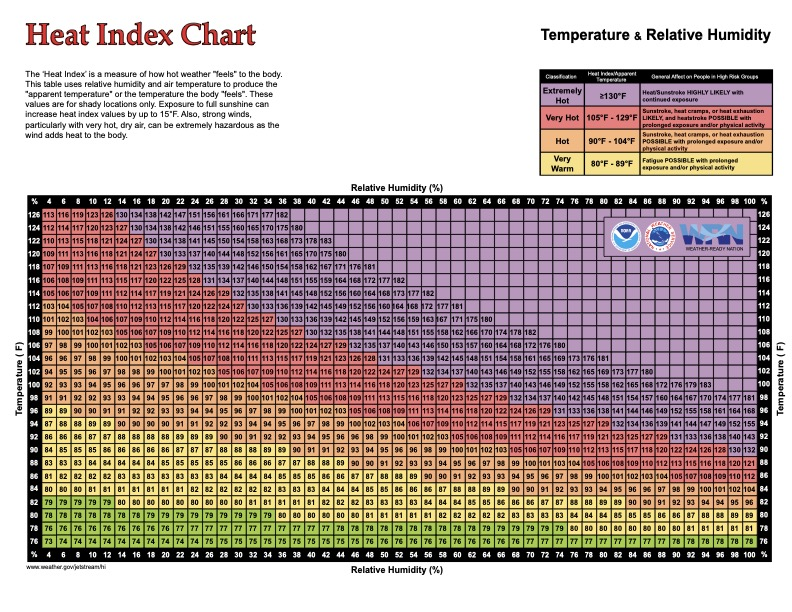
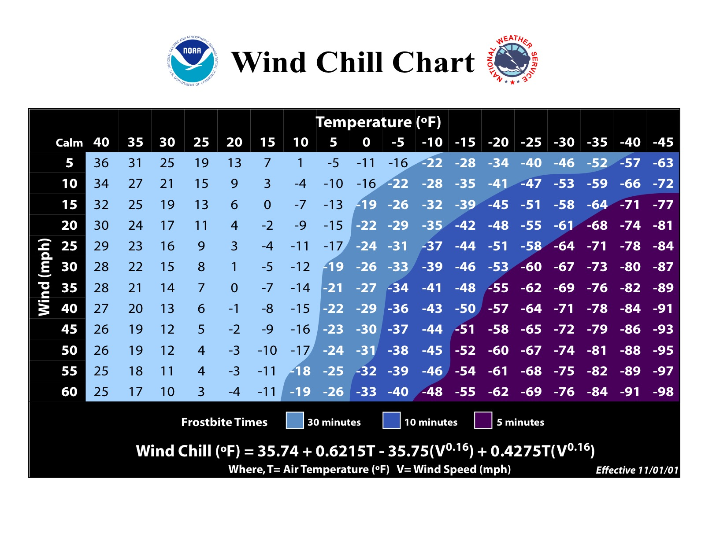

# Extreme Heat & Extreme Cold Survival

## Read this first (the 30-second version)
1. **Heat and cold both kill by overwhelming your body's temperature control — the fix is always the same shape: stop the exposure, change the environment, and treat the injury ladder before it gets worse.**
2. **Heat stroke** (confusion, hot/red skin, collapse) is a **life-threatening emergency**: get the person into shade, strip excess clothing, and **cool them aggressively with water and ice on the neck, armpits, and groin** — cold-water immersion is fastest if you can do it safely. Call for help the moment it's reachable.
3. **Hypothermia** (violent shivering that then STOPS, confusion, stumbling) and **frostbite** (numb, white/waxy skin) are also emergencies: get the person dry, insulated, and out of the wind; **rewarm frostbite only in warm water (98.6–102°F / 37–39°C)**, never over a direct flame, and **never rub frozen skin**.
4. **Never rewarm a frostbitten body part if there's a chance it could refreeze before you reach real shelter** — refreezing thawed tissue causes far worse damage than staying frozen a little longer.
5. **Stay cool without power:** shade + moving air + wet skin (evaporation) + hydration with electrolytes + resting during peak heat (roughly noon–6pm).
6. **Stay warm without power:** dry, layered, wind-blocking clothing + insulate from the ground + heat one small room only + never burn fuel indoors without ventilation (carbon monoxide kills silently).

The rest of this guide walks through **why** the body fails at each extreme, **multiple ways** to cool or warm yourself without electricity, how to protect people most at risk, and **step-by-step recognition and treatment** for every rung of the heat-illness and cold-injury ladders, plus sunburn care. **A person with zero prior training can follow this.**

---

## Why this matters
Your core body temperature normally sits within about one degree of 98.6°F (37°C). Move it a few degrees either direction and your organs — especially the brain, heart, and kidneys — stop working correctly. Heat and cold emergencies are among the **most preventable** causes of death in a power-outage disaster, because most victims give warning signs for hours before collapse, and most damage can be stopped early with nothing but shade, water, cloth, and a little planning. In North Texas, both extremes happen in the same calendar year: 100°F+ heat and dangerous humidity for months, then sudden hard freezes and ice storms (like February 2021) that can knock out power for days. This guide is written so you can act on either extreme with no electricity and ordinary household materials.

## Key terms (plain language)
- **Core temperature** — the temperature deep inside your body (as opposed to your skin), measured normally by an oral, rectal, or ear thermometer. This is what matters medically.
- **Heat index** — how hot it *feels* combining air temperature and humidity; humidity blocks sweat from evaporating, so it feels (and is) more dangerous than the thermometer alone suggests.
- **Wind chill** — how much faster exposed skin loses heat because of wind; it does not lower the temperature of objects, only how fast a body loses heat.
- **Evaporative cooling** — the cooling effect when liquid (sweat or wet cloth) turns to vapor, pulling heat from your skin. This is your body's main cooling system and also a manual technique you can copy.
- **Apparent temperature** — the technical name for what the Heat Index and Wind Chill actually calculate: not the air temperature a thermometer reads, but what a human body actually experiences given humidity or wind.
- **Vasodilation / vasoconstriction** — blood vessels near the skin widen (dilate) to dump heat when you're hot, and narrow (constrict) to conserve heat when you're cold.
- **Hyperthermia** — dangerously high core body temperature (the heat-illness family; heat stroke is its most severe form).
- **Hypothermia** — dangerously low core body temperature.
- **Frostnip** — mild, reversible skin cooling/freezing; no permanent damage.
- **Frostbite** — actual freezing of skin and possibly deeper tissue; can cause permanent damage or loss of the part.
- **Chilblains** — painful, itchy, red/purple skin damage from repeated cold-but-not-freezing exposure, especially with dampness.
- **Trench foot (immersion foot)** — tissue damage from feet being wet and cold (not necessarily freezing) for hours to days.
- **Shivering** — involuntary muscle contraction that generates heat; a *good* sign early (body still fighting) but its **disappearance** in a cold person is a **bad** sign (body is giving up).
- **Diaphoresis** — heavy, often cold and clammy sweating; a symptom seen in heat exhaustion and some heart emergencies.

---

# PART 1 — EXTREME HEAT

## How the body overheats
Your body makes heat constantly (muscle activity, digestion) and normally sheds it by: radiating heat from skin, moving warm blood to the skin surface (vasodilation) so it can radiate/convect away, and — most powerfully — **sweating**, which cools you as it evaporates. Heat becomes dangerous when:
- **Humidity is high** — sweat can't evaporate, so your main cooling system stops working even though you're still soaked in sweat. This is why heat index (not just temperature) matters, and why humid North Texas summers are more dangerous than a drier heat of the same air temperature.
- **You're dehydrated** — less blood volume means less capacity to move heat to the skin and less sweat to make.
- **The air temperature approaches or exceeds skin temperature** — you can no longer lose heat by simple radiation/convection; evaporation becomes your only tool.
- **Exertion continues** — working muscles keep generating heat faster than it can be shed.
- **The body's control center (hypothalamus) itself starts failing** — this is heat stroke: the thermostat breaks and the body can even stop sweating.

## The Heat Index — how hot it actually feels (and how to read the chart)
The **Heat Index** (also called the "apparent temperature") is what the National Weather Service (NWS) calculates by combining actual air temperature with relative humidity into the single number that matters for safety — not what the thermometer reads, but how dangerous the heat actually is to a human body. High humidity blocks sweat from evaporating, so humid heat is more dangerous than dry heat at the same air temperature.

**How to read the official NWS Heat Index chart:** find the actual air temperature down the left side, find the relative humidity percentage across the top, and read across/down to where the row and column intersect — that number (in °F) is the heat index, i.e., what it actually feels/acts like to your body.

*Figure — Official NWS Heat Index chart: air temperature (rows) vs. relative humidity (columns), color-coded by danger category. Source: NOAA/National Weather Service, public domain (www.weather.gov/jetstream/hi).*

**Sample values (°F) — notice how fast humidity raises the real danger:**

| Air temp | RH 40% | RH 60% | RH 80% | RH 100% |
|---|---|---|---|---|
| 80°F | 80°F | 82°F | 84°F | 87°F |
| 86°F | 85°F | 91°F | 100°F | 112°F |
| 90°F | 91°F | 100°F | 113°F | 132°F |
| 96°F | 101°F | 116°F | 132°F | — |
| 100°F | 109°F | 129°F | — | — |
| 104°F | 119°F | — | — | — |

*(A dash means that combination is rare/off the standard chart — very high humidity rarely accompanies the very highest air temperatures.) Note the pattern: 90°F air at 60% humidity already feels like 100°F; the same 90°F air at 100% humidity feels like a dangerous 132°F — a 42-degree jump from humidity alone, with the air temperature never changing.*

**NWS heat-index danger categories:**

| Category | Heat index | Risk to people |
|---|---|---|
| Very Warm | 80–89°F | Fatigue possible with prolonged exposure/activity |
| Hot | 90–104°F | Heat cramps, heat exhaustion possible; sunstroke possible with prolonged exposure/activity |
| Very Hot | 105–129°F | Heat cramps/exhaustion **likely**; heat stroke **possible** with prolonged exposure/activity |
| Extremely Hot | 130°F or higher | Heat stroke/sunstroke **highly likely** with continued exposure |

**Two things the chart itself flags that are easy to miss:** these values are for **shade only** — full direct sun exposure can add up to **15°F** to the effective heat index. And in **very hot, dry** conditions, strong wind adds heat to the body rather than cooling it (the opposite of wind chill in Part 2) — don't assume a hot breeze is helping once air temperature nears or exceeds skin temperature.

## Staying cool without power

### Method 1 — Shade and airflow (the free baseline)
**What it does:** Removes direct solar heating and lets any breeze evaporate sweat.
**You need:** any shade (tree, building, tarp, vehicle awning) and, ideally, moving air.
**Steps:**
1. Move out of direct sun immediately — even partial shade drops perceived heat significantly.
2. Create airflow: open windows on opposite sides of a room for cross-breeze, use a hand fan, palm frond, or piece of cardboard.
3. If you have any battery power, a small battery/solar fan aimed at damp skin multiplies cooling (see Method 2).
4. **How to tell it's working:** skin feels cooler to the touch within a few minutes; sweating slows because you're not fighting direct heat gain.

### Method 2 — Wet-cloth and evaporative cooling (most effective manual method)
**What it does:** Copies your body's own cooling system directly and works even for someone who has stopped sweating.
**You need:** water (does not need to be drinkable-safe if only touching skin) and cloth (bandana, towel, shirt).
**Steps:**
1. Soak cloth in cool water, wring so it's damp not dripping, and drape over the back of the neck, wrists, or forehead.
2. Fan the wet area, or stand where there's any breeze — moving air over wet skin speeds evaporation dramatically.
3. Re-wet every 10–15 minutes as the cloth dries.
4. **No cloth?** Wet skin directly (spray bottle, splashed water, wet hands) and fan it.
5. **Works even better than a wet cloth alone:** wet the cloth, then fan it — evaporation rate (and cooling) roughly doubles with airflow.

### Method 3 — Cooling pulse points (fast relief, small water budget)
**What it does:** Blood vessels run close to the skin at the neck, wrists, elbow creases, armpits, and groin — cooling here cools blood heading back to the core faster than cooling elsewhere.
**You need:** cool/cold water or ice, cloth to wrap ice in (never place ice directly and continuously on bare skin — brief contact is fine, prolonged direct ice contact can injure skin).
**Steps:**
1. Wrap ice or a cold, wet cloth and apply to **neck sides, armpits, and groin** for several minutes at a time.
2. Rotate between spots rather than holding one continuously if using ice.
3. This is also the go-to technique for treating heat exhaustion and heat stroke (see the ladder below) — practice it before you need it.

### Method 4 — Hydration and electrolytes
**What it does:** Replaces the fluid and salts lost in sweat so your body can keep producing sweat and keep blood volume up.
**You need:** water; salt; sugar (optional); or a store-bought electrolyte/sports drink/oral rehydration packet.
**Steps:**
1. Drink water regularly through the day rather than only when very thirsty — thirst lags behind actual need in heat.
2. If sweating heavily for hours, add electrolytes: a simple homemade mix is about **1/2 teaspoon salt + 6 teaspoons sugar per liter of safe water** (a basic oral rehydration approach) — adjust to taste, it should taste only mildly salty.
3. Avoid alcohol and excess caffeine during heat stress — both increase fluid loss.
4. **How to tell you need more:** dark yellow urine, infrequent urination, headache, or fatigue signal you're behind on fluids. Pale, frequent urine is a good sign you're keeping up.
5. See the [Water guide](../water/water.md) for finding and purifying water when supplies are low.

### Method 5 — Activity timing
**What it does:** Avoids doing hard work when both temperature and sun angle are worst.
**Steps:**
1. Schedule outdoor work, travel, or exercise for **early morning (before 10am) or evening (after 7pm)**.
2. Treat roughly **noon–6pm** as indoor/shade-only hours during a heat wave.
3. Pace work: 15–20 minutes on, then rest in shade; don't judge effort by how you'd normally handle it.

### Method 6 — Finding/making the coolest room in the house
**What it does:** Concentrates limited cooling effort into one space instead of trying to cool a whole building.
**Steps:**
1. Pick an interior, ground-floor or below-grade room without direct sun exposure (heat rises, and upper floors get much hotter).
2. Close blinds/curtains on sun-facing windows during the day; cover windows with reflective material (space blanket, foil) if available.
3. Keep this room's door closed once cooler than the rest of the house; only open windows for cross-ventilation at night when outside air is cooler than inside.
4. Group the household (especially high-risk people) into this one room rather than trying to cool the whole home.

### Method 7 — Basements and below-ground spaces
**What it does:** Earth is a natural heat buffer — basements and cellars stay many degrees cooler than the surface in summer.
**Steps:**
1. If your home or a neighbor's has a basement, storm cellar, or cellar-like space, use it during the hottest hours.
2. Bring water and a way to communicate (whistle, phone) since below-ground spaces can also trap heat/humidity if unventilated for very long stays — don't seal it up completely.
3. No basement? A shaded crawl space, a below-grade garage, or even a vehicle in deep shade with windows cracked (never sealed, never with anyone left unattended — see Method 8 and vehicle warnings below) can help.

### Method 8 — The wet-sheet trick (whole-body cooling at home)
**What it does:** Maximizes evaporative surface area over the whole body — useful for feverish or overheated people, or for sleeping through a hot night.
**Steps:**
1. Soak a lightweight sheet in cool water, wring out excess so it's damp, not soaking.
2. Drape over the body (or hang in a doorway with airflow behind it as a simple "swamp cooler" for a room).
3. Add a fan or any breeze across the wet sheet to accelerate cooling.
4. Re-wet every 20–30 minutes, or as it dries.

> ⚠️ **Never leave a person, child, or pet in a parked vehicle in heat** — interior temperatures can climb over 20°F above outside air within 10 minutes, turning a survivable 90°F day into a lethal enclosed environment.

## Protecting high-risk people in heat
Some people overheat faster and show fewer warning signs. Check on them proactively, don't wait for complaints.
- **Elderly people:** sweat less efficiently, may be on medications (diuretics, blood pressure drugs, some psychiatric meds) that impair heat response, and may under-report symptoms. Check in person at least twice a day during a heat wave; keep them in the coolest room; ensure they're drinking fluids even without thirst.
- **Infants and young children:** can't regulate temperature well and can't always communicate distress. Never leave them in vehicles even briefly. Dress in light, loose clothing; offer fluids/breastmilk frequently; watch for unusual fussiness, lethargy, or fewer wet diapers. See the [Childbirth & vulnerable care guide](../childbirth-and-vulnerable-care/childbirth-and-vulnerable-care.md) for infant-specific heat care.
- **People with chronic illness** (heart disease, diabetes, kidney disease, obesity) and those on certain medications: reduced ability to compensate for heat stress. Prioritize them for any available cooling and monitor more frequently.
- **Outdoor workers and anyone doing physical labor:** highest daily heat load. Enforce work/rest cycles (Method 5), mandatory water breaks, and buddy-checks — heat stroke can impair a person's own judgment before they realize something is wrong, so a partner watching for confusion or stumbling is a real safeguard.
- **People who are intoxicated** or without stable housing: reduced awareness of symptoms and reduced ability to seek shade/water — check on them actively during heat emergencies.

## The heat-illness ladder — recognize and treat, step by step
Heat illness is a **progression** — mild stages can advance to deadly ones within an hour if ignored, especially with continued exertion. Move a person to a cooler stage of treatment the moment you see the next stage's signs; don't wait for certainty.

### Stage 1 — Heat cramps
**Signs:** Painful muscle spasms, usually legs or abdomen, during or after hard work in heat. Person is otherwise alert and sweating normally.
**Treat:**
1. Stop activity and move to shade/cool area.
2. Stretch and gently massage the cramping muscle.
3. Drink water or an electrolyte drink (Method 4) — cramps are often from salt loss, not just water loss.
4. Rest at least until cramps fully resolve before returning to activity; if they return quickly, move to Stage 2 precautions.

### Stage 2 — Heat exhaustion
**Signs:** Heavy sweating; cool, pale, clammy skin; weakness/fatigue; dizziness; headache; nausea or vomiting; fast, weak pulse; possible fainting. Person is still mentally alert (knows who/where they are), though may be irritable.
**Treat:**
1. Move to a cool or shaded area immediately; lay the person down with legs slightly elevated.
2. Loosen or remove excess clothing.
3. Cool actively: wet cloths at neck/armpits/groin (Method 3), fan the person, mist skin with cool water.
4. Give small sips of water or an electrolyte drink if fully alert and not nauseated — do not force fluids if vomiting.
5. **Watch closely for the next 30–60 minutes.** If symptoms worsen, vomiting continues, or mental state changes at all (confusion, slurred speech, unusual behavior), **treat as heat stroke immediately** (Stage 3).
6. If not improving within 30 minutes of active cooling and rest, or if you're unsure, seek medical help.

### Stage 3 — Heat stroke (life-threatening medical emergency)
**Signs:** Core temperature typically **104°F (40°C) or higher** — CDC guidance flags danger starting as soon as body temperature is **above 103°F (39.4°C)**, so treat either reading as heat stroke rather than waiting for a precise number; **hot, red, dry OR damp skin** (sweating may have stopped, or may still be present — don't rule out heat stroke just because the person is still sweating); **confusion, slurred speech, agitation, or unusual behavior**; throbbing headache; rapid, strong pulse then possibly weak; possible seizure; **loss of consciousness**. The confusion/altered mental state — not the exact thermometer reading — is what most reliably separates heat stroke from heat exhaustion in the field, since you rarely have a working thermometer at the moment it matters.
**Treat immediately — every minute of high core temperature increases organ damage risk:**
1. **Call for professional medical help the moment it is reachable** (911, radio, send a runner) — heat stroke has a real risk of death or permanent organ damage and needs advanced care as soon as possible.
2. **Move to shade/coolest available space** immediately.
3. **Remove excess clothing.**
4. **Cool aggressively and fast** — this is the single most important action:
   - **Best: cold-water immersion.** If you have a tub, stock tank, kiddie pool, or even a large trash can, immerse the person up to the neck in the coldest water available (add ice if you have it). This is the fastest known cooling method.
   - **No tub available:** pour or spray cold water continuously over the whole body while fanning vigorously to maximize evaporation, AND pack ice or cold wet cloths at the neck, armpits, and groin (Method 3) simultaneously.
   - Keep cooling continuously — don't stop after a minute; continue until help arrives or the person is clearly improving (alert, sweating resumes, skin cooling).
5. Do **not** give anything by mouth if the person is confused, vomiting, or not fully alert (choking/aspiration risk).
6. Monitor breathing and responsiveness; be ready to place in the recovery position (on their side) if they vomit or lose consciousness, and begin CPR if breathing stops — see the [First Aid guide](../first-aid/first-aid.md) for CPR steps.
7. **Do not consider this "handled" once cooling starts** — heat stroke patients need professional evaluation even if they seem to improve, because organ damage may not be immediately visible.

> ⚠️ **Heat stroke is a true emergency.** The confusion/altered mental state is what separates it from heat exhaustion — that single sign means stop everything else and cool the person as aggressively and as fast as you possibly can while getting help en route.

## Sunburn — prevention and treatment

### Preventing sunburn
1. **SPF sunscreen** (30+ recommended) applied generously 15–30 minutes before sun exposure.
2. **Reapply every 2 hours**, and immediately after swimming, heavy sweating, or toweling off — no sunscreen is fully "waterproof" all day.
3. **Clothing** — tightly woven, loose-fitting long sleeves/pants and a wide-brim hat block more sun than sunscreen alone; specialized UPF-rated fabric is even better if available.
4. **Timing** — UV is strongest roughly **10am–4pm**; schedule sun exposure outside that window when possible (this overlaps with Method 5's heat-avoidance window).
5. **Shade** — seek it actively; note that sand, water, snow, and concrete reflect UV and increase exposure even in shade.
6. Don't rely on cloud cover — UV passes through clouds; overcast days still burn.

### Treating mild sunburn (red, painful, no blistering)
1. **Cool** the skin — cool (not ice-cold) showers/baths, or cool damp cloths, several times a day.
2. **Moisturize** with a plain, fragrance-free lotion or aloe vera gel while skin is still slightly damp to seal in moisture.
3. **Hydrate** — sunburn draws fluid to the skin surface and increases fluid loss; drink extra water.
4. **Pain relief** — over-the-counter pain relievers (e.g., ibuprofen or acetaminophen, following package dosing for the person's age/weight) can reduce pain and inflammation.
5. Leave blister-free skin uncovered and let it heal; avoid further sun exposure to the area until fully healed.
6. **Do NOT** apply butter, oil-based products, or "-caine" numbing products (like benzocaine) to sunburned skin — oils can trap heat, and numbing agents can cause allergic reactions on damaged skin.
7. **Do NOT** pop or pick at any blisters that do form — this invites infection.

### Treating severe sunburn (blistering, large area, or with other symptoms)
**Signs needing more caution:** blistering over a large area; sunburn covering a large portion of the body; fever, chills, headache, nausea, or dizziness alongside the burn (a sign of heat illness or significant fluid loss on top of the burn); confusion.
1. Treat as above (cool, moisturize gently around — not on — blisters, hydrate, pain relief).
2. Do not intentionally drain or pop blisters — if one breaks on its own, gently clean the area and cover loosely with a non-stick sterile dressing.
3. Watch closely for signs of infection over the following days: increasing redness, warmth, swelling, pus, red streaking, or fever.
4. **Get professional medical care** if there's extensive blistering, fever, signs of dehydration or heat illness, infection, or if the burn covers a large fraction of the body (this is functionally a burn injury and can impair the skin's ability to regulate temperature and fluid) — see the [First Aid guide](../first-aid/first-aid.md) for general burn care principles.

---

# PART 2 — EXTREME COLD

## How the body loses heat
Heat leaves the body four ways, and cold survival is largely about blocking all four:
- **Radiation** — body heat radiates away into cooler surroundings, especially from uncovered head, neck, and extremities.
- **Convection** — moving air (wind) strips a layer of warmed air from your skin/clothing continuously; this is what "wind chill" describes.
- **Conduction** — direct contact with something cold pulls heat away fast — this is why sitting/lying on cold ground or wearing wet clothing is far more dangerous than dry air of the same temperature (water conducts heat away from the body roughly 25x faster than still air).
- **Evaporation** — sweat or wet clothing evaporating pulls heat from the body, which is desirable in heat but dangerous in cold (getting sweaty during cold-weather exertion, then stopping, is a classic setup for rapid heat loss).

The body's defenses are vasoconstriction (pulling blood away from the skin and extremities to protect the core), shivering (generating heat through muscle activity), and behavior (seeking shelter, adding layers). These defenses can be overwhelmed by wind, wetness, exhaustion, low food/fuel reserves, alcohol, and simply not layering up in time.

## The Wind Chill chart — how fast exposed skin loses heat (and how to read it)
**Wind Chill** tells you how much faster your exposed skin loses heat because of moving air — it does **not** lower the actual temperature of objects (a car battery or a water pipe doesn't get colder because of wind chill), only how fast a **body** loses heat and how much colder it feels.

**How to read the official NWS Wind Chill chart:** find the actual air temperature across the top, find the wind speed (mph) down the left side, and read to where the row and column intersect — that number (in °F) is the wind chill. The chart's color shading also gives you the approximate **frostbite time** for exposed skin at that combination.

*Figure — Official NWS Wind Chill chart with frostbite-time shading (light blue = about 30 minutes, blue = about 10 minutes, purple = about 5 minutes to frostbite on exposed skin). Source: NOAA/National Weather Service, public domain, effective 11/01/01.*

**Sample values (°F):**

| Air temp | 5 mph wind | 20 mph wind | 40 mph wind |
|---|---|---|---|
| 30°F | 25°F | 17°F | 13°F |
| 20°F | 13°F | 4°F | -1°F |
| 10°F | 1°F | -9°F | -15°F |
| 0°F | -11°F | -22°F | -29°F |
| -10°F | -22°F | -35°F | -43°F |
| -20°F | -34°F | -48°F | -57°F |

**Approximate frostbite-time bands (from the official chart):**

| Wind chill value | Time to frostbite on exposed skin |
|---|---|
| Roughly -19°F to -34°F | About 30 minutes |
| Roughly -35°F to -59°F | About 10 minutes |
| Below about -60°F | About 5 minutes or less |

**Worked example:** 20°F air with a 20 mph wind produces a wind chill of about 4°F — already inside the 30-minute frostbite zone. The same 20°F air with calm winds is far less dangerous; **wind, not just the thermometer, is what turns "cold" into an injury risk**, which is why the North Texas notes below flag wind-driven ice-storm exposure specifically.

## Staying warm without power

### Method 1 — Layering correctly
**What it does:** Traps insulating air between layers rather than relying on one thick garment; lets you add/remove layers as activity level changes.
**You need:** multiple clothing layers — a base layer, insulating layer, and wind/waterproof outer shell (see the [Clothing & footwear guide](../clothing-footwear-protection/clothing-footwear-protection.md) for full detail).
**Steps:**
1. Base layer: moisture-wicking, snug (not cotton against skin if you'll sweat — cotton stays wet and loses insulating value; wool or synthetics are better).
2. Insulating layer(s): fleece, wool, or improvised insulation (see Method 2) to trap warm air.
3. Outer shell: wind- and water-resistant (even a poncho or large trash bag with head/arm holes works as an improvised wind/rain shell).
4. Cover extremities well: a properly insulated hat, gloves/mittens, and warm dry socks matter disproportionately — you lose significant heat through the head, hands, and feet.
5. **Adjust before you sweat**: remove a layer before hard activity, add it back during rest — sweating then cooling is a major cause of rapid heat loss.

### Method 2 — Improvised insulation
**What it does:** Adds trapped-air insulation when proper cold-weather gear isn't available.
**You need:** newspaper, dry leaves/grass, extra clothing, blankets, bubble wrap, cardboard.
**Steps:**
1. Stuff dry newspaper or dry leaves/grass between clothing layers (chest, back, inside boots) — trapped air insulates as well as many manufactured materials.
2. Sit or sleep on an insulating layer (cardboard, dry leaves, blankets, a sleeping pad) — insulating **from the ground** is often more important than the blanket on top, since the ground conducts heat away fast.
3. Wrap in multiple blankets rather than one thick one; layered blankets trap more air.

### Method 3 — Heating one room
**What it does:** Concentrates limited fuel/heat into a defensible, survivable space rather than losing it heating the whole home.
**Steps:**
1. Choose a small, interior room with few or no exterior walls/windows if possible.
2. Seal gaps around doors and windows with towels, blankets, or tape to reduce drafts.
3. Hang blankets over doorways to reduce heat loss to unused rooms.
4. Group the household in this one room, especially at night.
5. Body heat itself is a real heat source in a small, sealed space — huddling together (people, and pets if appropriate) measurably raises room temperature.

### Method 4 — Safe heat sources (and the CO warning)
**What it does:** Provides active heat when passive insulation isn't enough.
**Safer options:** a properly vented wood stove or fireplace with the flue open; a battery- or crank-powered heater; heated (safely, briefly) items like a hot water bottle wrapped in cloth placed under blankets, not against bare skin for long periods (risk of burns on numbed skin).
**Steps:**
1. Only burn fuel (wood, propane, kerosene, charcoal) in equipment **designed and vented for indoor use** with proper ventilation — a chimney/flue that's open, or a window cracked for fresh air with a battery-powered CO detector running if you have one.
2. **Never** bring a charcoal grill, gas camp stove, generator, or any device meant for outdoor use inside a home, tent, garage, or vehicle for heat — these produce carbon monoxide (CO), an invisible, odorless gas that kills without warning. Generators specifically must run outdoors, 20+ ft away from windows, doors, and vents so exhaust can't be drawn back inside.
3. Never sleep with any unvented flame or fuel-burning heater running.
4. See the [Fire & smoke / air emergencies guide](../fire-smoke-air-emergencies/) and [Power & energy guide](../power-energy/power-energy.md) for full generator/heater safety and CO detection detail.

> ⚠️ **Carbon monoxide poisoning is a leading cause of death after winter power outages.** Symptoms (headache, dizziness, nausea, confusion) can be mistaken for other illness — if anyone in a heated space develops these, get them into fresh air immediately and stop using the heat source until you're certain it's properly vented.

### Method 5 — Staying dry
**What it does:** Prevents the massive heat loss caused by wet clothing/skin (conduction + evaporation combined).
**Steps:**
1. Change out of wet clothing (from snow, sweat, or rain) as soon as possible.
2. Keep a dry set of clothes/socks reserved and protected (in a sealed bag) specifically for this purpose.
3. Cover clothing with a waterproof/wind layer before exposure to snow or rain, not after you're already wet.
4. Dry wet boots/socks near (not too close to) any heat source overnight; change socks daily if possible during extended cold exposure.

### Method 6 — Food and fluids for warmth
**What it does:** Fuels the body's internal furnace; dehydration and low blood sugar both reduce your ability to generate and retain heat.
**Steps:**
1. Eat regularly, including fats and carbohydrates, which the body burns for sustained heat production — don't skip meals in cold weather to "save" food unless truly necessary.
2. Drink warm fluids if you can heat water/tea — this helps comfort and hydration, though the core-temperature effect is modest; the bigger risk is dehydration, which is easy to underestimate in cold, dry air.
3. **Avoid alcohol** — it causes blood vessels to dilate, creating a false feeling of warmth while actually accelerating core heat loss.
4. Melt snow/ice before drinking rather than eating it directly — eating snow costs the body heat and hydrates poorly; see the [Water guide](../water/water.md) for melting and purification methods.

## Protecting high-risk people in cold
- **Elderly people:** produce and retain less body heat, may have reduced sensation (won't notice cold feet/hands until damage is done), and often take medications affecting circulation. Check on them frequently; ensure they're in the heated room; watch for confusion (an early hypothermia sign easily mistaken for normal aging).
- **Infants:** lose heat much faster than adults (large surface area relative to size) and cannot shiver effectively or communicate cold. Keep well layered, cap on the head, and check skin temperature at the chest/back of neck (not just hands/feet, which are normally cooler). Never overbundle to the point of overheating either — check regularly. See the [Childbirth & vulnerable care guide](../childbirth-and-vulnerable-care/childbirth-and-vulnerable-care.md).
- **People with chronic illness** (diabetes, circulation problems, heart disease): reduced circulation to extremities raises frostbite risk even in moderate cold; reduced ability to shiver/compensate raises hypothermia risk.
- **Outdoor workers, hikers, hunters:** highest exposure; buddy system matters because hypothermia impairs the victim's own judgment before they recognize the danger.
- **People experiencing homelessness or without reliable shelter:** highest-risk population in any cold event — community check-ins matter; see the [Community & mutual aid guide](../community-mutual-aid/) if available in this knowledge base for coordinating checks.

## The cold-injury ladder — recognize and treat, step by step

### Frostnip (mild, fully reversible)
**Signs:** Skin (usually nose, ears, fingers, toes, cheeks) becomes cold, pale or red, and numb or tingling, but remains soft to the touch — no hard/frozen feel.
**Treat:**
1. Get out of the cold/wind.
2. Rewarm gently with body heat — tuck fingers in armpits, cup hands over face, warm breath over exposed skin.
3. Do not rub aggressively; gentle warming is enough at this stage.
4. Once color and sensation return, cover the area well before going back into the cold.

### Frostbite (tissue is actually freezing — serious injury)
**Signs — superficial frostbite:** skin looks white, grayish-yellow, or waxy; feels firm on the surface but tissue underneath still feels soft/pliable when gently pressed; numbness.
**Signs — deep frostbite:** skin is hard, solid, and cold all the way through; may look white/blue/mottled; blistering (clear or blood-filled) may appear after rewarming; complete loss of sensation.

**Treat frostbite step by step:**
1. **Get the person out of the cold and out of wet/wind-exposed clothing** if at all possible before doing anything else.
2. **Assess refreeze risk first — this determines everything:** if you can only rewarm the part now but there's a real chance it will refreeze before you reach lasting shelter/warmth (e.g., you still have to walk hours through the cold), **do NOT rewarm it yet**. Protect it (see step 6) and get to a place where it can stay warm continuously, then rewarm.
3. **If you're certain it won't refreeze:** rewarm using **warm water immersion, 98.6–102°F (37–39°C)** — warm to the inside of your own wrist, not hot. Use a thermometer if you have one; if not, water that feels comfortably warm (not hot) on unaffected skin is the right range.
4. Immerse the affected part for **20–30 minutes**, until it turns red/purple and soft, and sensation begins returning. This rewarming is often quite painful — that's expected and not a reason to stop.
5. **Do NOT rub or massage the frozen area** — ice crystals in the tissue can cause additional damage to skin and blood vessels when rubbed.
6. **Do NOT rewarm using a direct flame, stove, car exhaust, or dry heat** (hot water bottle directly on skin, heating pad) — numb tissue can't feel burning and direct/dry heat causes burns on top of frostbite.
7. After rewarming: gently dry, place clean dry gauze/cloth between affected fingers/toes if applicable, cover loosely, and elevate if possible to reduce swelling.
8. **Do not walk on rewarmed/thawed frostbitten feet** if avoidable — walking on tissue that was just thawed causes further damage; it's actually preferable to walk out on still-frozen feet than on thawed ones, if walking out is the only way to reach help (another reason step 2's refreeze assessment matters so much).
9. **Get professional medical care as soon as reachable** for any frostbite beyond frostnip — deep frostbite especially can need specialized care to save tissue; do not consider home rewarming the end of treatment.

> ⚠️ **The two hard rules of frostbite: never rub frozen skin, and never thaw it if there's a real chance it will refreeze before reaching lasting warmth.** Refreezing thawed tissue is far more destructive than staying frozen a while longer.

## Hypothermia — recognize and treat, step by step
Hypothermia is a drop in core body temperature and progresses in stages. It can happen even in temperatures well above freezing if a person is wet and windblown for long enough (a major risk in North Texas's cold rain and ice events, not just in snow country).

**Mild hypothermia — signs:** shivering (often vigorous), cold/pale skin, clumsiness, slurred speech beginning, and the person is still alert and can usually rewarm themselves with help.

**Moderate to severe hypothermia — signs:** shivering **stops** (a bad sign — the body has exhausted its ability to generate heat this way); confusion, poor coordination, stumbling, irrational or apathetic behavior; slow, shallow breathing; weak pulse; drowsiness or loss of consciousness. In severe cases the person may even feel warm and try to remove clothing ("paradoxical undressing") due to confused brain function — this is a sign of a true emergency, not improvement.

**Treat, step by step:**
1. Get the person out of the cold, wind, and away from wet ground/surfaces immediately.
2. Remove wet clothing and replace with dry insulation (blankets, dry clothes, sleeping bag).
3. Insulate from the ground as well as covering on top — cold ground pulls heat away fast.
4. Cover the head and neck, which lose heat quickly.
5. If mildly hypothermic and alert: warm sweet drinks and food can help (the body needs fuel to generate heat); gentle, gradual rewarming with blankets and shared body heat is appropriate.
6. **If moderately to severely hypothermic (confused, stumbling, or shivering has stopped): handle the person GENTLY.** Avoid rough handling, vigorous rubbing, or rapid movement — a cold heart can be irritable and rough handling risks triggering a dangerous heart rhythm.
7. Do not give alcohol. Do not give food/drink to someone who is not fully alert (choking/aspiration risk) or is vomiting.
8. Do not apply direct high heat (hot bath, heating pad on high, open flame) to a moderately/severely hypothermic person — warming the skin and extremities too fast can send cold, acidic blood from the limbs back to the heart ("afterdrop") and worsen the emergency; gentle, gradual, core-focused warming (warm dry blankets, warm — not hot — packs at the chest/armpits/groin, shared body heat) is safer when advanced care isn't immediately available.
9. Check breathing and pulse carefully — in severe hypothermia, pulse and breathing can be very slow and weak; take a full 30–60 seconds to check before assuming there is none, and begin CPR only if truly no breathing/pulse is found (see the [First Aid guide](../first-aid/first-aid.md)).
10. **Get professional medical help the moment it's reachable** for anyone beyond mild hypothermia — this is a true emergency and the person needs monitoring and rewarming capability beyond what's possible in the field.

> ⚠️ **"Handle gently" is the single most important rule for anyone past mild hypothermia.** Rough movement, rubbing limbs, or overly rapid rewarming can trigger dangerous heart rhythms in a cold heart — move and warm the person slowly and carefully.

## Trench foot (immersion foot) and chilblains

### Trench foot
**Cause:** feet wet and cold (not necessarily freezing) for extended hours to days, common in flooding, prolonged rain exposure, or sweaty boots in cold weather.
**Signs:** numbness, tingling, swelling, mottled/red-to-blue skin, possible blistering; feet feel cold and look "waterlogged."
**Prevent:**
1. Keep feet as dry as possible — change socks at least once daily (more if wet), use waterproof footwear, and air feet out when resting.
2. Carry a spare pair of dry socks in a sealed bag.
**Treat:**
1. Remove wet socks/boots, gently clean and dry feet.
2. Rewarm gradually (not with direct high heat).
3. Elevate feet to reduce swelling; keep them dry and exposed to air rather than re-wrapped in damp socks.
4. Avoid walking on damaged feet more than necessary.
5. Seek medical care for significant blistering, spreading discoloration, or signs of infection.

### Chilblains
**Cause:** repeated exposure to cold-but-not-freezing, damp conditions, causing small blood vessel damage.
**Signs:** small, itchy, painful red or purple patches, usually on fingers, toes, ears, or nose; may swell or blister with repeated exposure.
**Treat:**
1. Rewarm gradually at room temperature — do not use direct heat (fire, heating pad) on the area, which worsens the itching/pain.
2. Keep the area dry and protected from further cold exposure.
3. Avoid scratching, which can break skin and invite infection.
4. Prevent recurrence by keeping the area consistently warm and dry rather than repeatedly cold-then-warm.

---

# North Texas regional notes (Anna, TX / Collin County)

## Summer heat and humidity
- North Texas summers regularly bring **100°F+ air temperatures with high humidity**, pushing the heat index well above the actual thermometer reading for weeks at a time — this is the region's single most dangerous, recurring hazard.
- Heat waves here are also **long-duration**, not just single hot days — the danger compounds because bodies (and cooling supplies, and patience) don't get an overnight break when nights stay warm too.
- Rural properties often lack shade cover in open pasture — plan work around the noon–6pm window (Method 5) especially for outdoor/agricultural work and livestock care.
- Power outages during summer storms remove air conditioning right when it's needed most — have the "coolest room" plan (Method 6) and wet-cloth supplies (Method 2) ready before a storm season, not after the power is already out.
- Blackland prairie clay soil holds heat and offers little natural shade in open fields; tree cover near homes and in town is a genuine cooling resource — use it.

## Sudden hard freezes and ice storms
- North Texas is vulnerable to **sudden, severe winter events** despite its generally mild winters — the February 2021 winter storm (Winter Storm Uri) brought sustained sub-freezing temperatures, ice, and snow together with a regional power grid failure that left millions without heat for days.
- Because these events are rare here, **many homes are poorly insulated for cold and many residents lack cold-weather gear** compared to colder climates — take hard-freeze/ice-storm warnings seriously and prepare (extra blankets, insulating layers, a heating-one-room plan) well before the temperature drops.
- **Ice storms** knock out power via ice-loaded power lines and tree limbs — plan for multi-day outages, not just an evening.
- **Frozen/burst pipes** are a major secondary hazard of these events (loss of water, flooding) — see the [Water/flooding/plumbing guide](../water-flooding-plumbing/) for pipe protection, separate from body-warming concerns covered here.
- Roads ice over quickly and the region has little salting/plowing infrastructure — avoid travel during ice events; hypothermia and frostbite risk from stranded-vehicle scenarios is real here specifically because drivers are less prepared for it than in snowier regions.

---

# Heat vs. cold — quick comparison

| | Extreme heat | Extreme cold |
|---|---|---|
| Body's core problem | Can't shed heat fast enough | Can't retain/generate heat fast enough |
| Main body defense | Sweating + vasodilation | Shivering + vasoconstriction |
| Key manual technique | Evaporative cooling (wet cloth + airflow) | Layering + insulation (trapped dry air) |
| Fastest field emergency treatment | Cold water immersion (heat stroke) | Gentle, gradual rewarming (hypothermia) |
| Progressive injury ladder | Cramps → exhaustion → stroke | Frostnip → frostbite; mild → severe hypothermia |
| Worst warning sign | Confusion + hot skin (stroke) | Shivering STOPS + confusion (severe hypothermia) |
| "Never do" rule | Don't give fluids to a confused/vomiting person | Don't rub frozen skin; don't rewarm if refreeze is likely |
| High-risk groups | Elderly, infants, chronic illness, outdoor workers | Same groups, plus anyone wet/without shelter |
| North Texas version | Months of 100°F+ heat and humidity | Rare but severe sudden freezes/ice storms |

---

# ⚠️ Safety — the most important warnings
- **Confusion is the red-flag symptom in BOTH directions.** A confused, disoriented, or unusually behaving person in extreme heat (possible heat stroke) or extreme cold (possible severe hypothermia) needs emergency-level treatment right now, not a "let's watch and see."
- **Heat stroke:** cool the person aggressively and continuously (cold water immersion is fastest) and get professional help the moment it's reachable — this can kill within hours.
- **Frostbite:** never rub frozen tissue; rewarm only in 98.6–102°F (37–39°C) water; never rewarm if refreezing before reaching lasting shelter is a real possibility.
- **Hypothermia past the mild stage:** handle the person gently — rough handling or too-rapid rewarming can trigger a dangerous heart rhythm in a cold heart.
- **Never burn fuel meant for outdoor use (charcoal, camp stoves, generators) indoors for heat** — carbon monoxide is invisible and can kill an entire household in their sleep.
- **Never leave anyone (especially children or pets) in a parked vehicle in heat**, even briefly, even with windows cracked.
- **Don't drink alcohol to "warm up"** — it accelerates core heat loss even though it feels warming.
- **Don't eat snow to hydrate in the cold** — melt it first; it costs core heat and doesn't hydrate well raw.
- **Treat sunburn blistering over a large area, or with fever/dizziness, as needing professional care**, not just home treatment.
- When professional medical help is reachable for anything in the heat-stroke, severe-frostbite, or hypothermia category, **get it** — field treatment buys time, it isn't a substitute for care.

# Troubleshooting

| Problem | Fix |
|---|---|
| No power, need to cool a room | Close blinds on sun-facing windows, pick an interior/ground-floor room, use wet-sheet trick (Part 1, Method 8) with any airflow. |
| Person confused and hot in heat | Treat as heat stroke: shade, strip excess clothing, cold water immersion or continuous pouring + ice at neck/armpits/groin, get help fast. |
| Person confused and cold, shivering has stopped | Treat as severe hypothermia: get dry/insulated, handle gently, gradual core rewarming, get help fast — do not rub limbs or use direct high heat. |
| Frostbitten hands/feet but still hours from shelter | Do NOT rewarm yet if refreeze is likely — protect and insulate the part, keep moving to reach lasting warmth, then rewarm in 98.6–102°F water once safe. |
| Only cold ground/tap water for frostbite rewarming | Warm water gradually on a stove/fire to comfortably-warm (test on your own wrist — should feel warm, not hot) before immersing. |
| No thermometer to check rewarming water temp | Water that feels warm (not hot) on your own inner wrist/forearm is in the safe range; if it's uncomfortably hot to you, it's too hot for frostbitten skin. |
| Power out during winter storm, no safe heater | Heat one small room with body heat + insulation only; layer clothing and blankets; do not bring outdoor-rated fuel devices inside. |
| Sunburn with large blistering | Do not pop blisters; cool and hydrate; seek professional care — this is a burn injury. |
| Can't tell heat exhaustion from heat stroke | If mental state is normal (alert, oriented) it's likely exhaustion — cool and monitor. If ANY confusion/altered behavior appears, treat as heat stroke immediately. |
| Wet, cold feet for hours (flooding, rain) | Change to dry socks/boots ASAP, dry and gently rewarm feet, elevate, watch for trench foot signs over following days. |

# Quick-reference checklist
- [ ] Know the confusion red flag: confused + hot = heat stroke; confused + cold/no shivering = severe hypothermia — both are emergencies.
- [ ] Have a wet-cloth/evaporative cooling plan ready for heat (cloth + water + fanning at neck/armpits/groin).
- [ ] Have a coolest-room plan for heat, and a one-room heating plan for cold, identified before an emergency hits.
- [ ] Know the frostbite rules: never rub; rewarm only in 98.6–102°F water; never rewarm if refreeze is likely before reaching shelter.
- [ ] Know the hypothermia rule: handle gently past mild stage, warm gradually, no direct high heat.
- [ ] Have layered clothing (base/insulating/shell) and extra dry socks staged for cold events.
- [ ] Have electrolyte supplies or a salt/sugar mix ready for heat hydration.
- [ ] Never plan to heat with outdoor-rated fuel devices indoors — have a CO detector if possible.
- [ ] Check on high-risk household/neighbors (elderly, infants, chronically ill, unsheltered) proactively during both heat waves and freezes.
- [ ] Sunscreen/clothing/shade/timing plan for sun exposure; know mild vs. severe sunburn treatment.
- [ ] Get professional medical help the moment it's reachable for heat stroke, deep frostbite, or hypothermia beyond mild.

# Sources & further reading (in this knowledge base)
- **US Army Survival Manual FM 21-76** — `reference/manuals/fm21-76_survival_manual.pdf` (cold-weather and hot-climate survival chapters).
- **Wilderness & Remote First Aid** — `reference/manuals/wilderness_remote_firstaid.pdf` (heat illness, hypothermia, and frostbite management when care is delayed).
- **First Aid and CPR Manual** — `reference/manuals/First_Aid_and_CPR_Manual.pdf`, and **First-Aid-and-CPR-2017_digital.pdf** (general burn, heat, and cold emergency treatment, CPR steps).
- **First aid / survival / CPR pocket guide** — `reference/manuals/firstaid_survival_cpr_pocketguide.pdf`.
- **American Red Cross Preparedness Guide** — `reference/manuals/redcross_preparednessguide.pdf` (heat wave and winter storm preparedness).
- **CDC emergency preparedness foundations** — `reference/manuals/cdc_emergency_foundations.pdf` (heat stress and cold stress guidance).
- **FEMA "Are You Ready?" guide** — `reference/manuals/are-you-ready-guide.pdf` (extreme heat and winter storm chapters).
- **NWS Heat Index Chart** — `reference/manuals/nws_heat_index_chart.pdf` (official chart + heat-illness signs infographic; source: NOAA/National Weather Service, public domain).
- **NWS Wind Chill Chart** — `reference/manuals/nws_windchill_chart.pdf` (official chart with frostbite-time shading; source: NOAA/National Weather Service, public domain, effective 11/01/01).
- **NWS heat safety** — www.weather.gov/safety/heat and www.weather.gov/safety/heat-index (heat index chart, categories, and prevention guidance).
- **NWS cold/wind chill safety** — www.weather.gov/safety/cold-wind-chill-chart (wind chill chart and formula).
- **CDC Extreme Heat** — www.cdc.gov/extreme-heat (heat-illness prevention and recognition).
- **CDC/NIOSH Cold Stress** — www.cdc.gov/niosh/cold-stress (hypothermia, frostbite, trench foot, chilblains).
- **OSHA-NIOSH heat illness guidance** — www.osha.gov/heat-exposure (heat stroke recognition/treatment, work/rest guidance).
- **Wilderness Medical Society Clinical Practice Guidelines for the Prevention and Treatment of Frostbite: 2024 Update** — McIntosh et al., *Wilderness & Environmental Medicine* (rewarming water temperature and field-care protocol).
- See also: [Shelter](../shelter/shelter.md) (building cool or warm shelter structures), [Clothing & footwear protection](../clothing-footwear-protection/clothing-footwear-protection.md) (layering systems in depth), [Water](../water/water.md) (hydration and safe snow-melting), [First Aid](../first-aid/first-aid.md) (CPR and general emergency medical care), [Disaster-specific guide](../disaster-specific/disaster-specific.md) (heat wave and winter storm event timelines), [Fire, smoke & air emergencies](../fire-smoke-air-emergencies/) and [Power & energy](../power-energy/power-energy.md) (safe indoor heating and carbon monoxide), and [Childbirth & vulnerable care](../childbirth-and-vulnerable-care/childbirth-and-vulnerable-care.md) (temperature protection for infants and other high-risk people).
