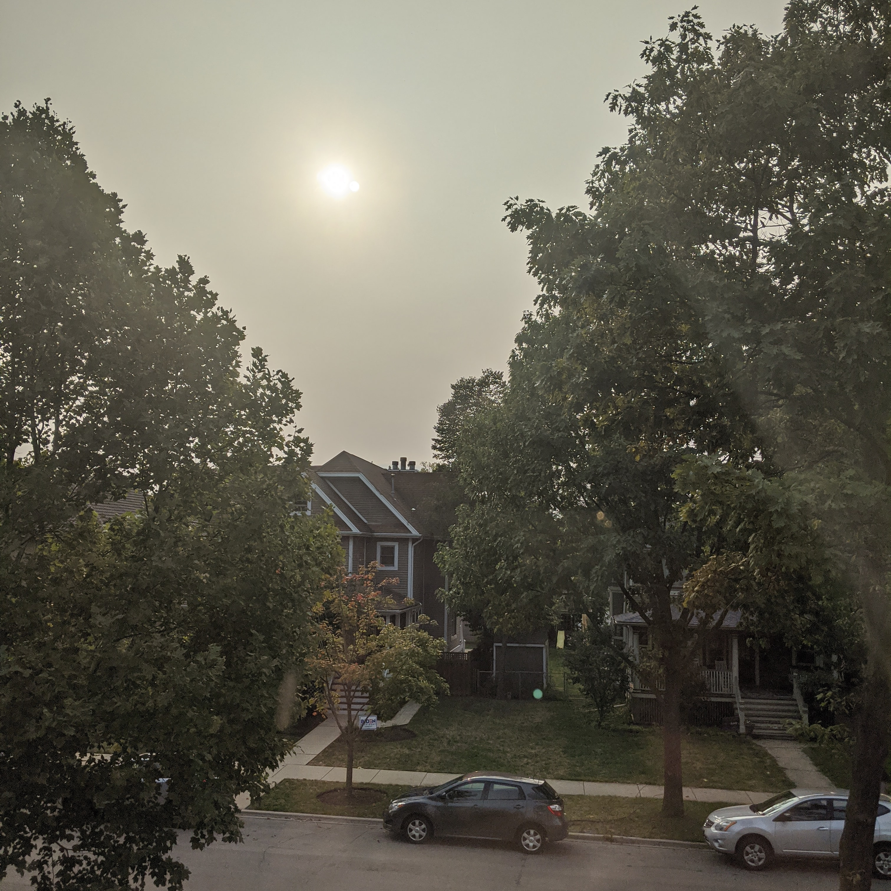
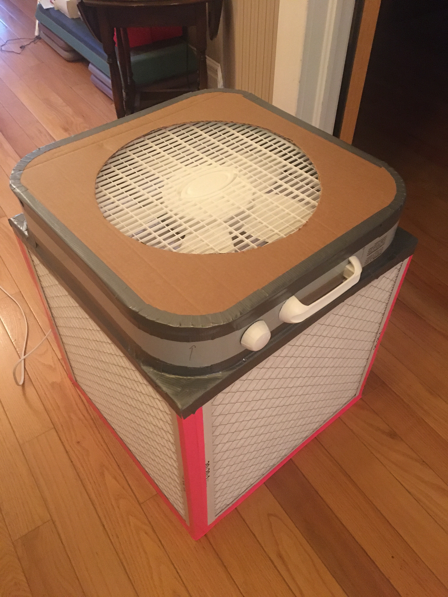
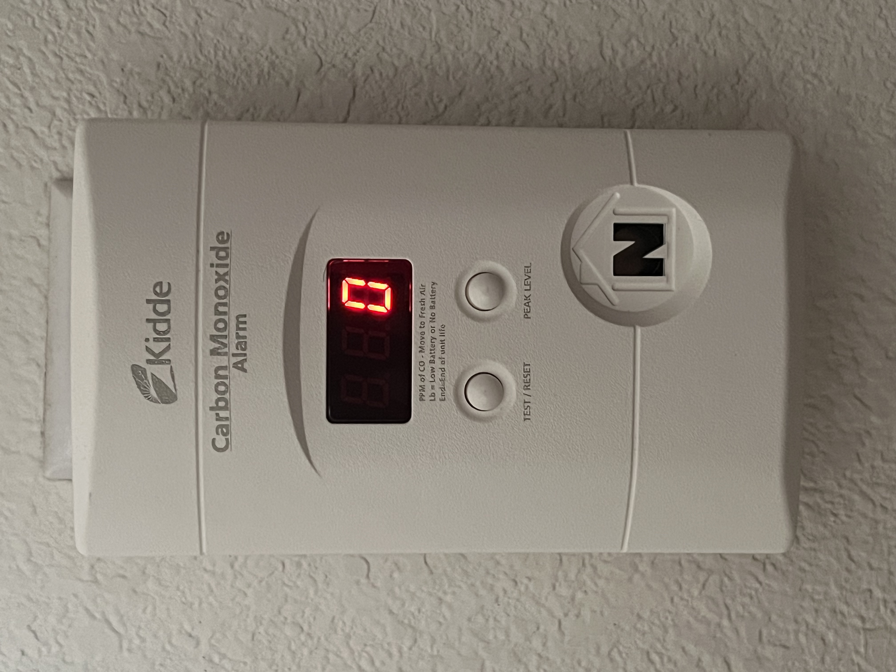

# Fire, Smoke & Hazardous-Air Emergencies

## Read this first (the 30-second version)
1. **If there's fire or heavy smoke in your home: GET OUT. Do not grab things, do not investigate, do not go back in for any reason — not pets, not phones, not photos. Once out, stay out.**
2. **Before opening any closed door in a fire, check it with the back of your hand.** Hot door or smoke leaking around it = do not open it; use your second way out.
3. **Smoke rises — crawl low, under the smoke, to your exit.** Clean(er) air is near the floor.
4. **Get to your outdoor meeting spot and call 911 from there.** Tell firefighters immediately if anyone (or any pet) is still inside.
5. **Carbon monoxide (CO) is invisible, odorless, and kills without warning.** If a CO alarm sounds, or several people/pets in the house feel sick/headachy/dizzy at once, get everyone outside into fresh air immediately, then call 911.
6. **If you smell rotten eggs (natural gas): don't flip any switch, don't light anything, don't use your phone inside — just leave, and call the gas company or 911 from outside.**
7. **For wildfire smoke or bad outdoor air:** stay inside with windows/doors shut, run your HVAC or a HEPA/box-fan air cleaner on recirculate, and use a properly fitted N95 if you must go outside.

The rest of this guide covers each of these in depth — with more than one way to solve each problem — plus how to build cheap, effective air cleaners and a clean-air room, and how to safely re-enter after a fire or bad-air event.

---

## Why this matters
A home fire can go from a small flame to an unsurvivable, smoke-filled room in **as little as 2–3 minutes** — far faster than most people expect, and faster than many fire departments can arrive. The US Fire Administration puts it bluntly: once the smoke alarm sounds, you may have **less than 2 minutes** to get out safely — modern homes, full of synthetic furnishings and open floor plans, burn much faster than homes did a generation ago. The smoke itself, not the flames, kills most fire victims: it's hot, it's toxic (carbon monoxide and cyanide gas from burning synthetics), and it's disorienting in the dark. Separately, **carbon monoxide poisoning kills quietly in homes with no fire at all** — from generators, blocked furnace flues, and charcoal grills used indoors — and it gives almost no warning before it disables you. And increasingly, **wildfire smoke drifting hundreds of miles** can make the air outside genuinely hazardous to breathe for days, even where there's no fire nearby at all. This guide gives you the decision-making and the low-cost tools to survive all of these: get out safely, recognize poisoned air before it's too late, and protect your indoor air when the outdoor air turns bad.


*Figure — Wildfire smoke haze over Oak Park, Illinois, September 2020, from fires burning hundreds of miles away on the US West Coast. Smoke this thin still raises PM2.5 and can push AQI into unhealthy ranges even where the sky only looks mildly hazy — don't wait for visibly thick smoke to check the AQI and shelter/filter (Part 3). Source: Wikimedia Commons (File:Wildfire haze, Oak Park, Illinois, 2020.jpg), Eden, Janine and Jim, CC BY 2.0.*

## Key terms (plain language)
- **Smoke inhalation** — lung/airway damage and poisoning from breathing smoke, heat, and combustion gases (especially carbon monoxide and, from burning plastics/foam, hydrogen cyanide).
- **Carbon monoxide (CO)** — a colorless, odorless, tasteless gas from incomplete combustion (anything burning without enough oxygen: generators, gas appliances, engines, charcoal, wood stoves). It replaces oxygen in your blood. Also called "the silent killer."
- **AQI (Air Quality Index)** — a 0–500 US EPA scale for outdoor air pollution, most relevant here for wildfire smoke (fine particles, "PM2.5"). Higher = worse. Above ~150 is unhealthy for everyone.
- **PM2.5** — fine particulate matter (2.5 microns or smaller) — the main harmful component of smoke; small enough to reach deep into your lungs. Ordinary cloth masks do **not** stop it; a properly fitted N95 does.
- **HEPA** — "High-Efficiency Particulate Air" filter; removes at least 99.97% of 0.3-micron particles. The gold standard for filtering smoke particles from air.
- **MERV rating** — Minimum Efficiency Reporting Value (1–20); rates how well an HVAC/furnace filter traps particles. Higher MERV = finer filtration (MERV 13 is the practical ceiling for most home HVAC systems).
- **CADR** — Clean Air Delivery Rate; tells you how much filtered air a portable air cleaner puts out per minute — used to size a purifier to a room.
- **Corsi-Rosenthal box (CR box)** — a DIY air cleaner made from a box fan and 4–5 furnace filters taped into a cube; a low-cost near-HEPA-equivalent for a room.
- **N95 / P100 respirator** — a NIOSH-certified mask that filters at least 95% (N95) or 99.97% (P100) of airborne particles, **when it seals tightly to your face**. Different from a loose surgical or cloth mask, which does not filter smoke particles well.
- **Shelter-in-place (chemical)** — sealing yourself inside a room to keep an *outdoor* toxic gas/vapor cloud from getting in — the opposite goal of a clean-air room for smoke, but similar sealing technique.
- **Backdraft** — an oxygen-starved, smoldering fire suddenly gets a rush of new air (e.g., a door or window opening) and ignites explosively. This is why you check a door's temperature before opening it — a backdraft is what you're checking for.
- **Flashover** — radiant heat in a room builds until nearly everything in it (furniture, walls, other combustibles) reaches ignition temperature and bursts into flame at nearly the same moment, independent of any new air reaching the fire. Checking a door does not predict or prevent a flashover — the only defense is getting out before it happens.

---

# PART 1 — HOUSE FIRE: ESCAPE AND SURVIVE

## 1A. Before any fire happens — build your escape plan now
The US Fire Administration's official planning sequence is: draw a map of your home showing every door and window, mark two ways out of every room, confirm no door or window is blocked, choose an outside meeting place, test your smoke alarms, practice the drill with everyone in the home, and get everyone to the meeting place. In detail:
1. **Draw a map and walk every room to identify two ways out** — usually the door, and a window. For upper floors, know where a collapsible/fire escape ladder is stored (keep one under a bed or in a closet near each upstairs bedroom window).
2. **Pick one outdoor meeting spot in front of the home** everyone (including kids) can find in the dark — USFA's own guidance favors a fixed point in front of the house (a specific tree, mailbox, or light pole) over the back or side yard, since that's also where arriving fire crews will look for you first; a neighbor's driveway works too. Never the garage or a spot fire trucks need for access.
3. **Confirm doors and windows aren't blocked** — this is its own checklist item in USFA's plan, not an afterthought: clutter, security bars without a quick-release, or a window painted/nailed shut can turn a "second way out" into a dead end exactly when you need it.
4. **Practice a fire drill** twice a year, including a version where you "can't" use the main door and must use the second way out.
5. **Assign who helps whom** — young children, older adults, people with mobility limits, and pets. Decide this in advance; don't decide it while a room is filling with smoke.
6. **Install smoke alarms** on every level and inside/outside each sleeping area; test monthly (push the test button — this is literally step 5 of USFA's plan, not optional), replace batteries at least yearly (or use 10-year sealed-battery alarms), and replace the whole unit every 10 years.
7. **Keep exits clear** — no furniture or clutter blocking doors/windows; make sure windows aren't painted or nailed shut.

## 1B. During a fire — the exact sequence
1. **The instant a smoke alarm sounds or you see fire/heavy smoke: react — don't investigate.** Do not stop to find the source, save belongings, get dressed, or call anyone from inside.
2. **Get low.** Heat and toxic smoke rise and collect at the ceiling first; the breathable air is near the floor. If there's any smoke, **crawl or crouch-walk** with your head at 1–2 feet off the floor.
3. **Check closed doors before opening them** — feel the door and the doorknob with the **back of your hand** (your palm is more likely to grip and burn on a hot knob):
   - **Cool** → open slowly, ready to slam it shut if fire/smoke rushes in; proceed to your exit.
   - **Hot, or smoke is seeping around the edges** → **do not open it.** Use your second way out (another door, or a window).
4. **Close doors behind you** as you leave each room — this alone measurably slows a fire's spread and buys time.
5. **If you must pass through smoke**, stay low, and if you have one, breathe through a damp cloth over your nose and mouth (this helps a little with irritation; it does **not** make smoke safe to breathe for long).
6. **If your clothes catch fire: STOP, DROP, and ROLL.** Stop where you are (running feeds the flame with air), drop to the ground, cover your face with your hands, and roll back and forth to smother the flames. Do the same for another person if you're helping them, or smother flames with a blanket/coat if one is at hand.
7. **Get all the way out and go to your meeting spot.** Once out, **stay out** — never re-enter for any reason.
8. **Call 911 from a safe location outside** (a neighbor's phone/house, or your cell once clear). Tell them immediately if anyone — a person or a pet — is still inside; this changes how they respond.

> ⚠️ **Never go back into a burning building** — not for pets, valuables, or phones. Firefighters are trained and equipped for this; you are not. Tell them who/what is inside and let them go in.

## 1C. If you're trapped and can't get out
1. **Close the door to the room you're in** and, if you have time, stuff a wet towel/sheet along the bottom gap and around vents to slow smoke entering.
2. **Go to a window** for air and as your best signaling point, even if it's too high to jump from.
3. **Signal for help** — wave a bright cloth/flashlight, shout, or call 911 with your exact location (room, side of the house).
4. **If smoke is filling the room**, stay low near the window/floor; keep the door sealed rather than opening it into a smoke-filled hallway.
5. **Do not jump from height** unless fire is about to overtake you — a low window straight to the ground beats a multi-story jump; use a rope/knotted sheets/fire ladder if available (see the [Tools & Knots guide](../tools-knots-repair/tools-knots-repair.md)).

## 1D. Helping others get out
- **Children**: teach them that firefighters in gear (mask, loud breathing) help — not something to hide from; kids hiding from "the scary noise" is a leading cause of fire deaths in children. Practice this specifically.
- **People who can't walk well**: pre-plan who assists; consider an evacuation chair or blanket-drag for stairs if a wheelchair can't be carried.
- **Pets**: keep leashes/carriers near an exit so grabbing one takes seconds — but never delay your own exit or re-enter to search for a pet.

---

# PART 2 — SMOKE INHALATION: RECOGNIZE IT AND RESPOND

Smoke inhalation harms in three ways at once: **heat** (burns airway tissue), **irritant particles/soot** (inflame lungs), and **poison gases** — mainly carbon monoxide and, from burning plastics/foam, hydrogen cyanide. Damage can be delayed: someone can look fine right after a fire and deteriorate hours later as airway swelling progresses.

## 2A. Recognizing smoke inhalation
| Severity | Signs |
|---|---|
| **Mild** | Coughing, sore/scratchy throat, mild shortness of breath, watery eyes, headache, soot around the nose/mouth |
| **Moderate** | Hoarse or "barking" voice, wheezing, chest tightness, dizziness, nausea, confusion, singed nasal/facial hair or eyebrows |
| **Severe (emergency)** | Trouble breathing or can't speak in full sentences, blue or gray lips/fingertips, coughing up black/sooty phlegm, severe confusion or unresponsiveness, seizure, collapse |

> ⚠️ **Soot around the nose or mouth, a hoarse voice, or singed nasal hair are red flags for airway burns** — the airway can keep swelling for hours after exposure, even in someone who currently seems fine. Anyone with these signs, or who was in a smoke-filled room for more than a minute or two, **needs emergency medical evaluation**, not just a "wait and see."

## 2B. First response steps
1. **Get the person into fresh, moving air immediately** — outdoors if possible, away from the structure and away from where smoke is drifting.
2. **Call 911** for anyone with moderate-or-worse signs, anyone who was unconscious even briefly, or anyone with singed hair/soot around the face.
3. **Position:** if breathing and conscious, help them sit upright (easier breathing than lying flat). If unconscious but breathing, place in the recovery position on their side. If not breathing, begin CPR — see the [First Aid guide](../first-aid/first-aid.md) for full CPR steps; do not delay CPR to look for other injuries.
4. **Loosen tight clothing** around the neck and chest.
5. **Give oxygen only if you're trained and it's available** (e.g., EMS arrival); don't attempt improvised oxygen delivery.
6. **Do not give food or water** to someone with any breathing difficulty or altered mental state (risk of choking/aspiration).
7. **Treat visible burns** per the [First Aid guide](../first-aid/first-aid.md) once breathing is addressed — breathing always takes priority over burns.
8. **Even mild cases should see a doctor same-day** — inhaled heat and chemicals can cause delayed airway swelling or chemical pneumonitis hours later.

---

# PART 3 — WILDFIRE SMOKE: PROTECTING YOUR INDOOR AIR

Wildfire smoke can travel hundreds of miles and make outdoor air hazardous even where there is no visible fire. The core strategy is simple: **keep outdoor smoke from getting in, and clean the air that's already inside.**

## 3A. Know the Air Quality Index (AQI) and act on it
| AQI | Category | What to do |
|---|---|---|
| 0–50 | Good | Normal activity |
| 51–100 | Moderate | Unusually sensitive people should limit prolonged outdoor exertion |
| 101–150 | Unhealthy for Sensitive Groups | Children, elderly, pregnant, and those with asthma/heart/lung disease should limit outdoor exertion |
| 151–200 | Unhealthy | Everyone should limit outdoor exertion; sensitive groups stay inside |
| 201–300 | Very Unhealthy | Everyone stay inside with air filtration running; avoid outdoor exertion entirely |
| 301+ | Hazardous | Stay inside, seal up, run air filtration; treat as an emergency for sensitive individuals |

Check a local AQI source (weather app, NWS/EPA AirNow-style reporting) if you have connectivity; without it, use your senses — persistent haze, a campfire smell indoors, or eye/throat irritation outdoors are enough reason to shelter and filter.

> In May 2024, EPA updated how PM2.5 (smoke particle) concentrations map onto the AQI number, lowering the threshold for "Good" from 12 to 9 µg/m³ and tightening the higher breakpoints too — new research showed health harm at lower particle levels than previously assumed. The 0–500 scale and category names/actions above are unchanged; what changed is that **the same AQI number now corresponds to genuinely cleaner air than it used to** — so don't assume a "moderate" reading is as tame as it sounds if you're basing that on old memory of the scale.

## 3B. Keep smoke out
1. **Close all windows and doors**, and close the fireplace damper.
2. **Set your HVAC/furnace fan to "recirculate"/"return" air, not "fresh air intake."** Many systems have an outdoor-air damper — close it if you can access it, or set the thermostat fan to "on" so it keeps circulating (and filtering) the air already inside, rather than pulling in more smoke.
3. **Upgrade your HVAC filter** to the highest MERV rating your system supports without restricting airflow too much (see 4A below) — this filters smoke particles every time air circulates.
4. **Don't add more indoor pollution**: no smoking, candles, wood-burning, frying/broiling, or vacuuming with a non-HEPA vacuum during a smoke event — all of these add particles to air you're trying to keep clean.
5. **Use a door snake / rolled towel** at the bottom of exterior doors, and weatherstrip obvious gaps, if smoke smell is getting in.
6. **Limit outdoor exposure** — if you must go out, keep it brief and wear a properly fitted N95 (Part 5).

---

# PART 4 — CLEANING THE AIR: FOUR METHODS (CHEAPEST TO MOST CAPABLE)

Use more than one of these together when air quality is bad — they stack.

## Method 1 — Upgrade your HVAC/furnace filter
**What it does:** Filters the air every time your system's fan runs — free once you own the system.
**You need:** a filter sized for your return-air slot (printed on the filter frame), MERV 13 if available.
**Steps:**
1. Check your current filter's MERV rating (usually printed on the frame) and your system's manual for the maximum MERV it can handle — older/smaller-blower systems can be overwhelmed by very dense filters, restricting airflow and stressing the blower motor.
2. Buy a **MERV 13** pleated filter if your system supports it (this is the practical sweet spot for capturing smoke-sized particles without choking most residential systems); MERV 8–11 is a reasonable fallback for older systems.
3. Replace it (arrow on the frame points in the direction of airflow, toward the furnace/blower).
4. Set the fan to run continuously ("on," not "auto") during a smoke event so it keeps filtering even when heating/cooling isn't actively running.
5. Replace it again once the smoke event ends (a filter loaded with wildfire soot won't last as long as normal).

## Method 2 — Portable HEPA air purifier
**What it does:** A true HEPA unit removes ≥99.97% of smoke-sized particles from the air it processes; effectiveness depends on matching its rated coverage (CADR) to your room size — an undersized unit in a large room does little.
**You need:** a HEPA-rated portable air purifier sized (per its CADR/room-size rating) to the room you'll use it in.
**Steps:**
1. Run it in the room you spend the most time in (bedroom at night, main living space by day) with the door closed.
2. Run on a higher speed during heavy smoke; replace/clean the filter per the manufacturer's schedule (sooner during heavy smoke).
3. Avoid units that only advertise "ionizers" or produce ozone as their main mechanism — ozone itself irritates lungs; a true HEPA filter is what you want.

## Method 3 — Simple box-fan + furnace-filter cleaner (cheapest fast option)
**What it does:** A single furnace filter taped to the intake side of a box fan pulls room air through a filter — a rough, low-cost stand-in for a purifier when you have nothing else.
**You need:** a box fan, one pleated furnace filter (MERV 13 if possible) at least as large as the fan face, duct tape or cardboard to attach it.
**Steps:**
1. Check the filter's **airflow arrow** — it should point *toward* the fan (i.e., air should be pulled through the filter into the fan intake).
2. Tape the filter flush over the back (intake) side of the fan, sealing the edges so air can't sneak around the filter unfiltered.
3. Run on high in the room you're occupying.
4. This is a stopgap — Method 4 below is meaningfully more effective for similar cost and only slightly more effort.

## Method 4 — The Corsi-Rosenthal box (best value; near-HEPA performance)
**What it does:** Four or five furnace filters taped into a cube around a box fan pull far more air through far more filter area than a single flat filter, approaching the output of commercial HEPA units at a fraction of the cost. EPA-commissioned lab testing (2021, published by EPA's Office of Research and Development) measured actual Clean Air Delivery Rate (CADR) for wildfire smoke across several DIY designs:

| Design | Measured CADR (smoke) |
|---|---|
| Box fan + one 1" MERV 13 filter, no shroud | ~111 |
| Box fan + one 1" MERV 13 filter + cardboard shroud | ~156 (+40% over no shroud, free improvement) |
| Box fan + one 4" MERV 13 filter + cardboard shroud | ~248 (+123% over the basic 1-filter design) |
| Box fan + two 1" MERV 13 filters + shroud | ~263 |
| **Full Corsi-Rosenthal box (four 1" MERV 13 filters + shroud)** | **~401** |

Takeaway: **more filter area beats a single flat filter every time** — a cardboard shroud around even a single filter is a nearly-free upgrade, and the full 4-filter cube roughly quadruples a bare single-filter setup. Use whichever tier your materials on hand allow; each step up is still worth doing.

**You need:**
- 1 box fan, **20-inch square, manufactured 2012 or later** with a UL or ETL safety listing (this matters — EPA only tested and vouches for post-2012 listed fans; older/uncertified fans lack the thermal-fuse protection EPA's safety testing relied on)
- 4 furnace filters, same size as the fan face (e.g., 20"x20"x1" or 20"x20"x2"), **MERV 13** rated (thicker 4-inch filters, if your budget/availability allows, meaningfully outperform 1-inch filters per the table above)
- 1 filter (or a cardboard shroud) as a base/back if using 5 filters, or a cardboard cut-to-fit backing if using 4
- Duct tape (wide, cloth-backed tape works best)
- A box cutter/utility knife (to trim cardboard if needed)


*Figure — A completed Corsi-Rosenthal box: four furnace filters taped into a cube with a box fan on top. This is the standard 4-filter configuration described below. Source: Wikimedia Commons (File:Corsi-Rosenthal Box.jpg), Festucarubra, CC BY-SA 4.0.*

**Diagram (cross-section, looking down):**
```
              ┌─────────────┐
              │   FILTER    │  <- filter panels form the
           ┌──┤   (side)    ├──┐   4 sides of a cube
           │  └─────────────┘  │
   FILTER  │                   │  FILTER
  (side)   │    BOX FAN sits   │  (side)
           │  on top, blowing  │
           │  UP and OUT       │
           └─────────┬─────────┘
              ┌───────┴───────┐
              │   FILTER      │  <- 4th side; fan sits
              │   (side)      │     on top of the cube
              └───────────────┘
      AIRFLOW ARROWS on every filter point INWARD
      (toward the center of the cube), pulling room
      air through each filter into the middle, then
      up and out through the fan on top.
```

**Build steps:**
1. Stand the four filters on their long edges to form an open cube, each filter's printed **airflow arrow pointing inward** (toward the center) — get this backward and it still moves air but filters far less effectively.
2. Tape the four vertical seams between adjacent filters, sealing top-to-bottom so air can't leak around the edges unfiltered.
3. Tape a fifth filter (or a cardboard square with a hole cut for airflow) to the **bottom** as a base.
4. Place the box fan **on top**, blowing **air up and out** of the cube (pulling air in through the four filtered sides); tape its edges to seal that seam too.
5. **Run on the fan's highest speed** — this is EPA's explicit recommendation, not just "highest comfortable" for noise reasons. EPA's own safety testing on this exact design found fan motor and component temperatures stayed safely below hazard thresholds even at highest speed and even with partially blocked airflow, with no measurable increase in energy draw. In a closed room this can process the air several times an hour, meaningfully dropping indoor PM2.5 within an hour.
6. **Replace filters when they look dark/gray or smell smoky** — EPA testing found a heavily loaded, dirty filter can become almost completely ineffective, so a CR box you built weeks ago for a prior smoke event may need fresh filters before it's worth running again.

> ⚠️ **Safety notes for box-fan and CR-box builds:** use only a UL/ETL-listed box fan manufactured 2012 or later (this is a real safety requirement EPA tested to, not just a suggestion); never leave it running unattended overnight for the first time without checking it stays cool; keep it away from anything flammable and away from water; don't block the fan's own motor vents with tape; unplug before modifying.

---

# PART 5 — N95/RESPIRATOR SELECTION AND CORRECT USE

## 5A. What actually protects you
| Mask type | Stops smoke particles (PM2.5)? | Stops gases (CO, VOCs, chemical fumes)? |
|---|---|---|
| Cloth mask / bandana | Poorly — not designed for fine particles | No |
| Loose surgical mask | Partially, and only if sealed well (it isn't, by design) | No |
| **NIOSH N95** (fit-tested/sealed) | Yes — ≥95% of particles when sealed | **No** — gases pass through freely |
| **KN95** (look for genuine NIOSH-listed or reputable brand) | Similar to N95 if it actually seals and is genuine (many counterfeits exist) | No |
| **P100** | Yes — ≥99.97% | No (particulate only, same as N95) |
| **Respirator with organic-vapor/chemical cartridges** | Yes (if particulate-rated) | Yes, for the specific gases the cartridge is rated for |

> ⚠️ **An N95 protects you from smoke particles, not from carbon monoxide or gas leaks.** CO and natural gas pass straight through any particulate mask. For CO, the only real protection is not being in the CO — get out and ventilate (Part 6). For a chemical/gas release, an N95 does not protect you; see Part 8.

**How much difference does this actually make?** EPA's wildfire smoke guidance for public health officials cites controlled-exposure research: a properly worn, well-sealed N95 cut a wearer's smoke-particle exposure by roughly a **factor of 16** compared to no mask at all. Cloth masks, by contrast, did far less — synthetic-fabric cloth masks cut exposure by only about a factor of 2, and cotton cloth masks by about a factor of 1.4. In plain terms: a cloth mask or bandana takes the edge off smoke exposure a little; a genuinely sealed N95 is in an entirely different category of protection. This is also why a **loosely worn** N95 (unclipped nose strip, gaps at the cheeks) gives up most of that 16x advantage — the fit-check in 5B below is what actually delivers the protection, not just owning the right mask.

## 5B. Selecting and fitting an N95
1. **Buy genuine NIOSH-approved N95s** — look for "NIOSH" plus an approval number printed on the mask/box; counterfeit KN95s are common and often perform poorly.
2. **Size matters** — masks come in different sizes; a mask that doesn't fit your face won't seal, no matter its rating. Children's faces generally cannot get a reliable seal from adult N95s — treat kids as a "get them indoors with filtration" case rather than relying on a mask outdoors.
3. **Facial hair breaks the seal** — a beard crossing the sealing edge lets unfiltered air in around it; there is no good masking fix for this beyond shaving the contact area.
4. **Fit-check every time you put one on:**
   - Cup the mask over your nose and mouth, loop straps over your head (not just ears, for real N95s), and mold the metal nose strip to your nose bridge.
   - **Positive-pressure check:** exhale sharply — air should not leak out around the edges/into your eyes; if it does, adjust.
   - **Negative-pressure check:** inhale sharply — the mask should collapse slightly toward your face, not let air rush in around the edges.
5. **Replace when** it's visibly dirty, damp, damaged, or hard to breathe through; a single N95 can typically be reused across a day or two of intermittent wear if kept clean and dry, but discard if soiled or crushed.

---

# PART 6 — BUILDING AN IMPROVISED CLEAN-AIR ROOM (FOR SMOKE)

Use this during wildfire smoke or heavy ongoing smoke/dust when you need one reliably good-air room for sleeping or for a sensitive household member (asthma, elderly, infant, heart/lung disease).

**Choosing the room:**
- Pick an **interior room with few or no windows/exterior doors** if possible (fewer gaps to seal), sized appropriately for the number of occupants (don't pick a tiny closet for a family of four — see ventilation note below).
- A bedroom is often the practical choice since people will spend hours in it.
- Avoid rooms with a fireplace, direct garage access, or a return-air vent pulling from outside.

**Steps:**
1. **Close the door and any windows.** Weatherstrip obvious gaps around the door frame with removable foam tape if you have it; a rolled towel at the door's bottom gap works too.
2. **Cover unused vents temporarily** if you know your HVAC pulls outside air (check with plastic sheeting/tape) — but do **not** permanently block heating/cooling supply vents you need running.
3. **Run an air cleaner inside the room** — a portable HEPA unit or a Corsi-Rosenthal box (Part 4) sized to the room, on continuously.
4. **Bring in what you need** for the stay — water, medications, a battery radio/phone — so you're not opening the door repeatedly.
5. **Ventilate periodically** if the room is small and heavily occupied for many hours — a fully sealed small room with several people can build up CO₂ and feel stuffy; briefly opening the door to the rest of the (also-sheltering) house for a few minutes periodically is fine. This is different from a chemical shelter-in-place (Part 8), which prioritizes an airtight seal over comfort for a shorter, more acute event.

> ⚠️ **Never run a generator, grill, camp stove, or any fuel-burning device in or near this room "for warmth" or convenience** — that turns a clean-air refuge into a carbon-monoxide trap. See Part 7.

---

# PART 7 — CARBON MONOXIDE: THE SILENT KILLER

## 7A. Common sources
- **Portable generators** — the single biggest home CO killer; even running one in a garage with the door open, or right outside a window/vent, can be fatal. Always run generators **20+ feet from the house**, downwind, and never in a garage, carport, porch, or crawlspace. Full generator safety detail: [Power & Energy guide](../power-energy/power-energy.md).
- **Vehicles running in an attached garage**, even with the garage door open.
- **Gas furnaces, water heaters, and stoves** with a cracked heat exchanger or blocked/damaged flue/chimney.
- **Charcoal or gas grills used indoors or in an enclosed porch** — never do this, ever.
- **Wood stoves and fireplaces** with a blocked or poorly drafting chimney.
- **Portable fuel-burning space heaters** used indoors without proper ventilation.

## 7B. Symptoms
CO poisoning mimics a mild viral illness at first, which is exactly why it's dangerous:
- **Early:** headache, dizziness, weakness, nausea, "flu-like" symptoms **without a fever**.
- **Worsening:** confusion, blurred vision, chest pain, vomiting.
- **Severe:** loss of consciousness, seizures, death.
- **Key clue:** **multiple people (or pets) in the same building feeling sick at the same time**, symptoms that improve when you leave the house and return when you go back inside — this pattern strongly suggests CO, not a coincidental illness.

## 7C. Detection and response
1. **Install CO alarms** — at least one per level of the home and near sleeping areas; battery, plug-in, or combination smoke/CO units all work. Test monthly; replace units per their labeled lifespan (commonly 5–7 years).
   - **Placement height doesn't matter the way it does for smoke alarms.** Unlike smoke (which rises), carbon monoxide mixes evenly through room air at normal indoor temperatures — NFPA 720 and CPSC guidance confirm effective detection isn't height-dependent, so a plug-in unit near an outlet, or one mounted high or at eye level, all work. What matters more: **at least one unit in the hallway outside each separate sleeping area** (so it can wake you), and one per level of the home if you have more than one. Follow the specific manufacturer's instructions for exact placement (e.g., minimum distance from fuel-burning appliances) and your local code.


*Figure — A plug-in residential carbon monoxide alarm. Units like this, battery models, and combination smoke/CO alarms all satisfy the "one per level, near sleeping areas" rule in step 1. Source: Wikimedia Commons (File:Kidde Carbon Monoxide Alarm.jpg), TaurusEmerald, CC BY-SA 4.0.*
2. **If a CO alarm sounds, or you suspect CO:** get everyone — people and pets — **outside into fresh air immediately.** Don't stop to open windows or search for the source first.
3. **Call 911 or the fire department from outside** and report a possible CO alarm/exposure; let them check with a meter before anyone re-enters.
4. **If someone shows symptoms**, get them to fresh air and call for emergency medical help — CO poisoning needs medical evaluation (often oxygen treatment) even after symptoms start improving in fresh air.
5. **Do not re-enter** until the source is found and fixed, and responders or a CO meter confirm the air is clear.

---

# PART 8 — NATURAL GAS LEAK RESPONSE

## 8A. Recognizing a leak
- **Smell:** a "rotten egg" odor — an intentional additive (mercaptan) since natural gas is otherwise odorless.
- **Sound:** a hissing or blowing sound near a gas line, meter, or appliance.
- **Sight:** dead/dying vegetation in an otherwise healthy patch of yard (outdoor line leak), or a white cloud/mist near a line.
- **Feel:** dizziness, headache, or irritation for no other clear reason, especially near a gas appliance.

## 8B. What to do
1. **Do not do anything that could create a spark:** don't flip light switches (on or off), don't unplug anything, don't use your phone or a lighter, don't start a car in an attached garage.
2. **Get everyone out of the building immediately**, leaving doors open behind you if it doesn't cost you time.
3. **Move well away from the structure** before calling — call your gas utility's emergency line or 911 from a safe distance, not from just outside the door.
4. **Do not attempt to find or fix the leak yourself.** Full detail on locating and safely operating a gas shutoff valve is in the [Electrical & Gas Utility Safety guide](../electrical-gas-utility-safety/electrical-gas-utility-safety.md) — only shut off gas at the meter yourself if you're trained, it's safe to reach, and professionals will be delayed; otherwise wait for the gas company or fire department.
5. **Do not re-enter** until the utility or fire department confirms it's safe.

---

# PART 9 — CHEMICAL SPILL / HAZARDOUS RELEASE AWARENESS

This section covers the **decision** of shelter-in-place vs. evacuate for an outdoor chemical release (industrial accident, tanker/train spill, chemical plant incident). For decontamination, chemical PPE, and radiological hazards, see the [Hazmat & Contamination guide](../hazmat-contamination/hazmat-contamination.md).

## 9A. Shelter-in-place or evacuate — how to decide
| Factor | Favors shelter-in-place | Favors evacuating |
|---|---|---|
| Official guidance | Authorities say "shelter in place" | Authorities say "evacuate" — **always follow official instructions when given** |
| Distance from the release | You're not close to the source | You're near/downwind of the source |
| Wind direction | Wind is carrying the plume away from you | Wind is blowing the plume toward you |
| Time to leave safely | Release is sudden/close — no safe path out | You have clear time and a clear route before it reaches you |
| Building | You have a sealable interior room available | No good sealable space, or you're already exposed outdoors |

**If told to shelter-in-place, or you judge it's the safer choice:**
1. Bring everyone (and pets) inside immediately.
2. Go to an **interior room, above ground level if the chemical may be heavier than air** (many industrial gases sink and pool low; upper floors are often safer for those), with as few windows/doors as possible.
3. **Close and lock all windows and doors.** Turn off HVAC, furnace, and any fans or vents that pull outside air.
4. **Seal gaps** with plastic sheeting and duct tape over windows, door edges/gaps, and vents — this is a tighter, more urgent seal than the smoke clean-air room in Part 6, aimed at keeping an acute outdoor hazard **out** for a shorter period (hours, not days).
5. Keep a battery radio/phone for official updates; stay sealed until officials announce it's safe or you're told to evacuate.

**If told to evacuate, or your read of the situation favors leaving:**
- Move away **crosswind or upwind** of the release if you have a choice of routes, not directly downwind.
- Follow official evacuation routes; see the [Evacuation, Bug-Out & Vehicle guide](../evacuation-bugout-vehicle/evacuation-bugout-vehicle.md) for packing and route planning.

> ⚠️ Household chemical mixing is its own hazard: **never mix bleach with ammonia or with other cleaners** — it produces toxic chloramine gas indoors. If you accidentally create fumes like this, leave the room/house immediately and ventilate before returning.

---

# PART 10 — SAFE RE-ENTRY AFTER A FIRE OR BAD-AIR EVENT

1. **Wait for the official all-clear** from the fire department, utility, or hazmat responders before re-entering after a fire, gas leak, CO event, or chemical release.
2. **Check structural safety first** — a fire-damaged building can have weakened floors, ceilings, or walls; see the [Home Structural Assessment guide](../home-structural-assessment/home-structural-assessment.md) and [Structural & Utility Emergencies guide](../structural-utility-emergencies/structural-utility-emergencies.md) before walking through freely.
3. **Ventilate before settling back in** — open windows and doors to air the structure out once it's structurally and atmospherically confirmed safe (not before a CO/gas check is confirmed clear).
4. **Leave HVAC off until inspected** after a fire (it may have drawn smoke/soot into ducting) or after a suspected gas/CO event (until the source is found and fixed).
5. **Discard anything exposed to fire heat or heavy smoke that can't be verified safe:** food (including canned goods that got hot), medications, and anything with visible soot/melted damage.
6. **Clean soot carefully** — it's an irritant; ventilate the area, wear gloves/an N95 while cleaning, and see the [Sanitation & Hygiene guide](../sanitation-hygiene/sanitation-hygiene.md) for cleanup detail.
7. **Get any fire, CO, or gas source professionally inspected and repaired** before resuming normal use of that appliance/system — do not simply reset a tripped detector and move on.

---

## North Texas / regional notes (Anna, TX / Collin County)
- **Grassfire and wildfire smoke:** blackland prairie with hot, dry summers, periodic drought, and a burn-ban season most years means fast-spreading grassfires; smoke can also drift in from wildfires well outside the county during dry, windy stretches — treat hazy skies and a campfire smell as a cue to check AQI and shelter/filter even with no local fire.
- **Wind and Red Flag Warning days:** strong, gusty spring winds raise grassfire risk (see the [Fire guide](../fire/fire.md) for outdoor fire discipline) — be extra alert to smoke smell on these days.
- **Rural propane tanks:** many rural properties here use propane rather than piped gas — the same "rotten egg" leak-response rules apply, but propane is heavier than air and pools low (basements, low ground) rather than rising, which matters for where you check and where you must never bring an open flame.
- **Post-ice-storm CO risk:** generator use — and CO poisoning — spikes after North Texas ice storms; the "20+ feet from the house, never in a garage" rule matters even more when the temptation is to run it close to a door for warmth. See [Power & Energy](../power-energy/power-energy.md).
- **Rural response times:** volunteer fire departments serving unincorporated Collin County can take longer to arrive than in-city ones — your own two-ways-out plan and working alarms matter more here, not less.
- **Dust and dryline events:** spring dust/dryline passages spike particulates like smoke does — the same HVAC-filter and clean-air-room approach (Parts 3–6) applies.

---

# ⚠️ Safety — the most important warnings
- **Get out, stay out.** Never re-enter a burning building for any reason — pets, belongings, or "just to check."
- **Feel doors before opening them in a fire.** A hot door or smoke at the edges means use your other exit; opening a hot door can trigger a backdraft. A flashover can occur without warning at a door, which is why getting out fast — not just checking doors — is the priority.
- **Carbon monoxide gives little to no warning.** Install and maintain CO alarms; if one sounds, evacuate first and ask questions later.
- **Never run a generator, grill, or any fuel-burning device indoors, in a garage (even with the door open), or right next to a window/vent.**
- **An N95 stops smoke particles, not gases** — it does not protect you from carbon monoxide, natural gas, or most chemical fumes.
- **Cloudy judgment is a symptom, not just a feeling** — CO and smoke both impair thinking; if something feels "off," leave rather than debating it in place.
- **Never mix bleach and ammonia or other cleaning chemicals** — this produces toxic gas indoors.
- **Follow official shelter-in-place or evacuate instructions** during a chemical release over your own instinct when they're available and current.
- **Don't skip re-entry checks** — a building can look fine and still have unsafe air (CO, gas) or unsafe structure after a fire.

# Troubleshooting
| Problem | Fix |
|---|---|
| Smoke alarm going off but no visible fire | Treat as real until proven otherwise — check for smoke/heat at doors before investigating; never ignore it, but don't waste time hunting for the cause while smoke fills the room |
| Can't tell if a room's air is genuinely bad or just smells faintly of smoke outside | Check AQI if you have connectivity; if not, treat any persistent smoke smell or eye/throat irritation as reason to close up and run filtration |
| HVAC filter won't fit / system airflow seems weak with a high-MERV filter | Drop to a lower MERV (8–11) rather than choking the blower; supplement with a portable HEPA unit or CR box instead |
| No box fan or furnace filters on hand | Use whatever HEPA vacuum/purifier you own on high in a closed room; a folded, tightly-woven cloth held loosely over a fan's intake is a rough last resort, far weaker than a real filter |
| N95 fogs glasses / doesn't seem to seal | Re-mold the metal nose strip firmly to your nose bridge; try a different size/brand; facial hair across the seal line will always leak — no mask fixes this |
| CO alarm sounds and won't reset after airing out | Do not assume it's a false alarm — leave again, call 911/fire department, and have the source professionally checked with a meter before trusting the space |
| Smell rotten eggs but can't tell if it's a real leak | Treat it as real: no switches, no flames, no phone use inside — leave and call from outside every time |
| Sealed a shelter-in-place room but it's getting stuffy/hard to breathe | For an acute chemical release, tolerate short-term discomfort over reseal risk; for a longer smoke event, briefly crack the door to a shared, equally-sheltering space rather than to the outside |

# Quick-reference checklist
- [ ] Two ways out of every room identified; outdoor meeting spot chosen; family fire drill practiced.
- [ ] Smoke alarms on every level and near sleeping areas; tested monthly.
- [ ] CO alarms on every level and near sleeping areas; tested monthly.
- [ ] Know the back-of-hand door check and stop-drop-roll.
- [ ] Know smoke-inhalation red flags (soot, singed hair, hoarse voice) that mean go to the ER even if "feeling fine."
- [ ] Have an HVAC filter upgrade plan (MERV 13 if the system supports it) and know how to set the fan to recirculate.
- [ ] Have (or know how to build) a box-fan filter or Corsi-Rosenthal box for cheap emergency air cleaning.
- [ ] Have genuine NIOSH N95s in the right sizes for each family member who can wear one; know the fit-check.
- [ ] Picked a room for a clean-air refuge and know how to seal/filter it.
- [ ] Never run generators/grills/camp stoves indoors or in a garage — 20+ feet outside, always.
- [ ] Know the natural-gas-leak rule: no sparks, get out, call from outside.
- [ ] Know your shelter-in-place vs. evacuate decision factors for a chemical release.
- [ ] Know the re-entry checklist: official all-clear → structural check → air check → ventilate → then resume use.

# Sources & further reading (in this knowledge base)
- **US Army Survival Manual FM 21-76** — `reference/manuals/fm21-76_survival_manual.pdf` (fire safety and emergency response fundamentals).
- **American Red Cross Preparedness Guide** — `reference/manuals/redcross_preparednessguide.pdf` (home fire escape planning, smoke/CO alarm guidance).
- **FEMA "Are You Ready?" Guide** — `reference/manuals/are-you-ready-guide.pdf` (fire safety, hazardous materials, evacuation vs. shelter-in-place decision-making).
- **CDC Emergency Preparedness Foundations** — `reference/manuals/cdc_emergency_foundations.pdf` (general hazard response foundations).
- **EPA "Wildfire Smoke: A Guide for Public Health Officials"** — `reference/manuals/epa_wildfire_smoke_guide_public_health_officials.pdf` (AQI action levels, clean-room and DIY air-cleaner guidance, N95 vs. cloth mask protection factors — the primary source for Parts 3–5 of this guide).
- **USFA "Every Second Counts: Plan 2 Ways Out"** — `reference/manuals/usfa_two_ways_out_infographic.pdf` (the official two-ways-out / meeting-place home fire escape planning sequence used in Part 1A).
- **Urban Survival Reference** — `reference/manuals/Urban_Survival_text.pdf` (structure-fire and urban hazard context).
- In prose (well-known authorities, not separate manual files in this KB): **NFPA** (NFPA 720 CO-alarm placement, home fire escape planning guidance); **US Fire Administration (USFA)** home fire escape sequence and 2-minute-escape-window statistic; **EPA** 2024 AQI update, MERV/HEPA/Corsi-Rosenthal CADR testing; **CPSC** carbon monoxide alarm placement guidance.
- See also: [Fire](../fire/fire.md) (making and safely using fire — the opposite problem from this guide), [Hazmat & Contamination](../hazmat-contamination/hazmat-contamination.md) (decontamination, chemical PPE, radiation), [Electrical & Gas Utility Safety](../electrical-gas-utility-safety/electrical-gas-utility-safety.md) (gas shutoff procedure, electrical hazards), [Structural & Utility Emergencies](../structural-utility-emergencies/structural-utility-emergencies.md) and [Home Structural Assessment](../home-structural-assessment/home-structural-assessment.md) (post-fire structural safety), [Power & Energy](../power-energy/power-energy.md) (generator CO detail), [Evacuation, Bug-Out & Vehicle](../evacuation-bugout-vehicle/evacuation-bugout-vehicle.md) (evacuation routes and packing), [Clothing & Footwear Protection](../clothing-footwear-protection/clothing-footwear-protection.md) (respiratory PPE basics), and [First Aid](../first-aid/first-aid.md) (CPR, burns, treating smoke inhalation and shock).
