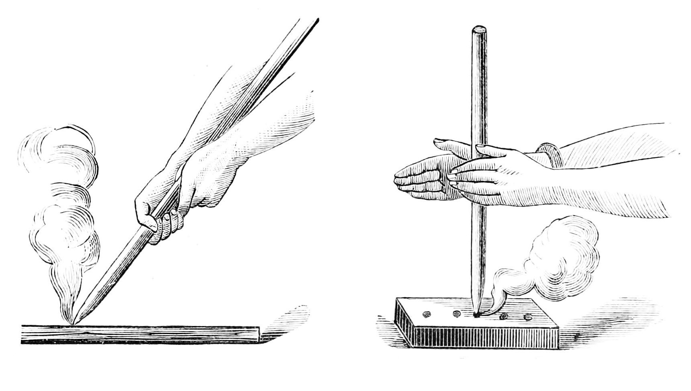

# Making and Using Fire With No Power

## Read this first (the 30-second version)
1. **Fire needs three things at once — heat, fuel, and oxygen (the "fire triangle").** Remove any one and it goes out. Add any one back correctly and it can restart.
2. **Gather three fuel sizes BEFORE you strike anything:** tinder (fluffy, catches a spark), kindling (pencil-to-thumb-size sticks), and fuel wood (wrist-size and bigger). Have at least **double** what you think you need, all within arm's reach.
3. **Build your fire lay first, light it last.** A teepee or log-cabin shape lets air flow up through the tinder. Light the tinder, not a big log — a match cannot light a log directly.
4. **Carry at least two ignition methods** (e.g., a butane lighter AND a ferrocerium rod) plus a small bag of prepared tinder (cotton balls with petroleum jelly work in rain). Redundancy is what actually keeps you warm.
5. **Never leave a fire unattended, and always have a way to fully put it out** (water and dirt) sitting next to it before you light it.
6. **In North Texas / small-town Texas (e.g., Anna, TX), dry grass ignites almost instantly** — clear a bare-dirt ring at least 10 feet in diameter down to bare mineral soil, keep the fire at least 15 feet from tents, structures, and shrubs, check burn bans, and never build a ground fire when winds are gusting.

The rest of this guide gives you **ten** ways to make fire (so you always have a backup), how to build the right fire shape for wind/rain/cooking, how to keep a fire alive overnight without watching it, and how to put one out so it never restarts.

---

## Why this matters
Fire is one of the highest-value skills in any power-outage or wilderness emergency because it solves five survival problems at once:
- **Warmth** — hypothermia (dangerously low body temperature) can kill in hours, even at temperatures above freezing if you are wet or windy-exposed. Fire is often the fastest way to raise your body temperature and dry your clothing.
- **Water purification** — boiling water for **1 full minute** (3 minutes above 6,500 ft elevation) kills the bacteria, viruses, and parasites that cause the diarrhea and vomiting that kill more disaster survivors than almost anything else. Without power, fire is usually your only way to boil water. See `../water/water.md`.
- **Cooking** — cooking food kills pathogens (harmful germs) in meat and makes many wild plants digestible and safer.
- **Signaling** — smoke by day and flame by light can be seen for miles and is a recognized international distress signal (three fires in a triangle). See `../signaling-rescue/signaling-rescue.md`.
- **Morale and light** — darkness and cold are two of the fastest ways a stressful situation turns into panic. A working fire gives light to work by and is proven to calm people down.

Because fire matters so much, this guide deliberately teaches you **multiple independent ways** to start one. If your lighter is wet, your ferro rod is lost, or the sun is behind clouds, you still have options.

---

## Key terms (plain language)
- **Fire triangle** — the three things every fire needs at the same time: **heat** (an ignition source hot enough to start combustion), **fuel** (something that burns), and **oxygen** (air). Firefighters "break the triangle" to put fires out; you use the same idea to build one.
- **Tinder** — the finest, most flammable material. It should catch a small spark or ember and burst into flame within seconds. Examples: dry grass, dead pine needles, birch bark, cotton ball fluffed and rubbed with petroleum jelly.
- **Kindling** — small sticks from pencil-thickness up to thumb-thickness. Kindling catches from burning tinder and burns long/hot enough to light real fuel wood.
- **Fuel wood** — wrist-thick branches and larger logs. This is what actually sustains a fire and produces lasting heat/coals, but it will NOT light directly from a match or spark.
- **Ember** — a glowing (but not flaming) coal of very hot material, such as the black dust produced by friction fire methods. An ember must be nurtured into an open flame by blowing air into a tinder bundle.
- **Char cloth** — cotton fabric that has been slow-cooked (charred) with no oxygen until it turns black but keeps its weave. It catches the faintest spark and holds a glowing ember for minutes, making it one of the best tinder materials there is.
- **Fatwood** (also "fat lighter" or "lighter'd") — resin-soaked wood from pine stumps/knots, usually found at the base of dead pine trees or in old stumps. It is full of flammable sap and lights even when damp; a small shaving pile lights almost like a candle.
- **Ferrocerium rod ("ferro rod" / "fire steel")** — a manufactured metal alloy rod that, when scraped hard with a sharp edge, throws sparks around 3,000°C (5,400°F) — hot enough to ignite proper tinder even when wet.
- **Char** — the blackened, partially burned material (like char cloth) that holds an ember without flaming.
- **Bow drill / hand drill** — primitive friction-fire methods that create an ember by spinning a wooden spindle against a wooden fireboard until friction-generated dust ignites.
- **Fire lay** — the physical shape/structure you build with tinder, kindling, and fuel before lighting (teepee, log cabin, lean-to, etc.).
- **Banking a fire** — covering hot coals with ash to slow their burn so they survive for hours (often overnight) and can be revived by uncovering and adding air/tinder.
- **Flashover** — a structure-fire term: a room's contents heat up until they all reach ignition temperature at nearly the same moment from radiant heat, causing the entire room to erupt in flame almost simultaneously. Relevant to structure fires, not open campfires.
- **Spot fire / ember attack** — a wildfire term: wind-carried embers land ahead of the main fire front and start new, separate fires there, common in dry grass and wind — a key reason to respect burn bans in North Texas.

---

## What you need

### Ignition tools (carry more than one if at all possible)
- Waterproof/strike-anywhere matches in a waterproof container
- Butane lighter (Bic-style)
- Ferrocerium rod with striker
- Magnifying lens or reading glasses (positive/convex lens)
- Steel wool (fine grade, "0000") + a 9-volt battery, or any battery + thin wire
- Flint (hard quartz-like rock) + carbon steel striker (back of a knife works)
- Fire piston (a specialty tool; rare in most kits)
- Potassium permanganate crystals (also a water-purification and wound-antiseptic chemical) + sugar or glycerin/antifreeze
- Hand sanitizer (60%+ alcohol) as an accelerant

### Tinder (natural or improvised — carry some, and know how to find more)
- Cotton balls rubbed with petroleum jelly (Vaseline) — carried dry in a small waterproof bag; one of the best all-around emergency tinders
- Char cloth (make ahead of time — see Method 7 prep)
- Fatwood shavings
- Dry grass, cattail fluff, thistledown, dead pine needles, birch bark (peels off in papery curls and burns even wet due to natural oils)
- Dryer lint, jute twine teased into a fluffy "bird's nest," wood shavings ("feather sticks")
- Steel wool itself can serve as both tinder and ignition catcher

### Kindling and fuel
- Pencil-to-thumb-thick dead, dry twigs ("dead and down," snap cleanly — if it bends, it's too wet/green)
- Wrist-thick and larger dry branches/split wood
- A knife or hatchet to baton (split) wood and to shave feather sticks
- Cordage/rope for lashing, if building elevated platforms in wet ground

### Improvised substitutes
- No petroleum jelly → cooking oil, lip balm, or bacon grease on cotton
- No ferro rod → flint and steel, or the lens off a pair of reading glasses/binoculars/camera
- No knife → any sharp-edged rock, broken glass, or the sharp edge of a metal can lid
- No commercial tinder → dryer lint (excellent, always available in a home), potato chips (oily, burn readily), hand sanitizer-soaked cotton

---

## The fire triangle — the one idea that explains everything below

```
                HEAT
               /    \
              /      \
             /  FIRE  \
            /  TRIANGLE \
           /______________\
       FUEL              OXYGEN

Caption: The three ingredients fire needs simultaneously.
Text description: A triangle with "HEAT" at the top point,
"FUEL" at the bottom-left point, and "OXYGEN" at the
bottom-right point, with "FIRE" written in the center. If any
one corner is removed, the fire in the center goes out.
```

Every method below is really just a different way to supply the **HEAT** corner. Every fire lay below is really just a smart way to arrange **FUEL** and let **OXYGEN** flow. Keep this picture in mind and fire-building stops feeling mysterious.

---

# PART 1 — PREPARING FUEL (do this before you try to light anything)

1. **Collect 3x more tinder than seems reasonable.** A golf-ball-to-fist-sized bundle, fluffed up loosely (not packed tight — air must move through it).
2. **Collect kindling in a range of sizes**, thinnest first: pencil lead-thick, pencil-thick, then finger-thick, then thumb-thick. Snap-test each piece — if it bends without snapping, it's too green/wet; set it aside.
3. **Collect fuel wood**, wrist-thick and bigger, more than you think you'll need (a fire always eats faster than expected). Standing dead branches ("widow-makers") are usually drier than wood lying on the ground.
4. **Stage everything within arm's reach** of where you will light the fire, organized smallest to largest, before you strike your first spark. You will only get a few seconds of flame from your tinder — don't waste it hunting for the next stick.
5. If wood is wet, **split it** — the inside of even rain-soaked wood is usually dry. Shave the dry inner wood into thin "feather sticks" (curls left attached at one end) to use as kindling.

---

# PART 2 — IGNITION METHODS

Each method below stands alone. Learn at least two — ideally a fast modern one and one primitive backup that needs no purchased tool.


*Figure 1 — Friction fire-starting methods (public-domain historical illustration). It shows only friction techniques covered in Methods 7–8 below: a stick angled down against a wooden board producing hot dust and smoke, and a **hand drill** — a vertical spindle rolled rapidly between both palms and pressed into a wooden fireboard, generating friction heat and smoke. Use it as a visual reference for the hand positions and tool shapes described in those method steps; it does not depict flint-and-steel or a bow drill.*

## Method 1: Waterproof/strike-anywhere matches
1. Buy or make waterproof matches (dip standard matches halfway in melted candle wax and let dry; store in a waterproof container with the striker strip if needed).
2. Build your fire lay (see Part 3) with tinder ready in the center.
3. Strike the match away from your body, cup your hand around the flame to shield it from wind, and hold it until it's fully lit (a few seconds).
4. Touch the flame to the base of the tinder bundle from underneath if possible, so flames rise up into it.
5. **How to tell it worked:** tinder catches and flame spreads within 5–10 seconds.
6. **If it didn't:** you likely have too little tinder or it's too tightly packed (air can't get in) — fluff it more, or add drier material, and try a second match immediately while the first ash is still hot.

## Method 2: Butane lighter
1. Shield the flame from wind with your body or cupped hands.
2. Hold the flame directly against fluffed tinder (cotton ball with petroleum jelly is ideal — it holds flame for 30–60+ seconds even in wind/rain).
3. Hold 5–10 seconds until the tinder itself is burning, not just the fluid/gas flame.
4. **How to tell it worked:** tinder continues burning after you release the lighter button.
5. **If it didn't:** the lighter may be low on fuel or flint — try shaking it, warming it in your armpit/pocket for a few minutes (cold reduces butane pressure), or switch to the ferro rod.
6. A dead (empty) lighter still has a flint wheel — you can strike it empty to throw sparks onto tinder, same as Method 3.

## Method 3: Ferrocerium rod (ferro rod)
1. Hold the tinder bundle in one hand, ferro rod resting on/near the tinder.
2. With the striker (or a knife's spine) held still, pull the **rod** backward through it in one firm, fast stroke (or push the striker forward — either direction works; consistency matters more than direction).
3. Aim the shower of sparks (about 3,000°C) directly into the tinder.
4. It may take 2–5 strikes. Once you see a spark catch (a tiny glow), gently blow on it to grow it into flame.
5. **How to tell it worked:** you see a small orange glow spreading in the tinder; gentle, steady blowing turns it into open flame within 10–20 seconds.
6. **If it didn't:** your tinder is too coarse or damp — process it finer (rub dry grass between your palms, shred bark into hair-thin fibers) and strike again; ferro rods work even when wet, so wetness of the rod itself is rarely the problem.

## Method 4: Magnifying lens / solar ignition
1. Requires direct, strong sunlight — does not work at night, indoors, or under heavy clouds.
2. Use a magnifying glass, camera lens, one lens from binoculars, or even a clear plastic bag filled with water shaped into a ball.
3. Angle the lens so it focuses sunlight into the smallest, brightest possible point on dark tinder (char cloth works exceptionally well because it's black and needs only an ember, not a flame).
4. Hold perfectly still; the focused point should smoke within 10–30 seconds.
5. Once you see smoke and a glowing ember, transfer it into a loosely bundled tinder nest and blow gently, increasing your breath gradually, until it flames.
6. **How to tell it worked:** visible smoke, then a red glowing dot that grows when you blow on it.
7. **If it didn't:** you're too far or too close from the correct focal distance — adjust distance until the light point is as small/bright as possible; also try darker tinder (char cloth, charred bark) since light-colored tinder reflects heat instead of absorbing it.

## Method 5: Battery + steel wool
1. Pull a strand of fine (0000-grade) steel wool into a loose, fluffy wad about golf-ball size.
2. Touch both terminals of a 9-volt battery to the steel wool at the same time (the two prongs on a 9V naturally sit close together, so just press the flat top of the battery onto the wool).
3. The steel wool will spark and glow red, spreading across the strands almost instantly.
4. Immediately transfer the glowing wool into your tinder bundle and blow gently to flame it up.
5. **With AA/AAA/other batteries:** touch a thin wire to both terminals and to the steel wool to complete the circuit.
6. **How to tell it worked:** steel wool visibly glows red/orange and the fire spreads through the strands like a fuse.
7. **If it didn't:** steel wool must be **fine grade** (fine wire, not coarse scrubbing pads) and the battery must have real charge — test on a small pinch first before committing your whole pad.

## Method 6: Flint and steel (traditional)
1. Hold a piece of hard flint (or any hard, sharp-edged quartz-like rock) in one hand with a piece of char cloth draped over/near the edge.
2. Strike the **back (spine) of a carbon-steel knife** or a dedicated steel striker down across the flint's sharp edge at a glancing angle, shaving off tiny hot metal sparks (NOT flint sparks — you are shaving steel).
3. Sparks land on the char cloth and should produce a small glowing ember (char cloth needs only an ember, no flame yet).
4. Fold the glowing char cloth into a dry tinder bundle and blow gently, increasing air gradually, until flame appears.
5. **How to tell it worked:** char cloth shows a spreading orange glow when you land a spark on it.
6. **If it didn't:** you need true carbon steel (stainless knives often won't spark well) and genuinely sharp flint edges; keep striking at a slightly different angle each time.

## Method 7: Bow drill (primitive friction fire — detailed)
This is the most reliable primitive method but takes practice. Expect to fail several times before succeeding — that is completely normal.

**Materials:** a straight, dry, softwood spindle (thumb-thick, 8–10 inches, like cedar, cottonwood, willow, or basswood), a flat fireboard of the same soft, dry wood (about 3/4 inch thick), a bow (a curved stick 24–28 inches with a shoelace/cordage strung loosely), a handhold (a hand-sized piece of hardwood or stone with a shallow depression to cap the spindle's top, lubricated with a bit of grease/earwax/skin oil to reduce friction at that end only), and a tinder nest.

1. Cut a shallow, round depression near the edge of the fireboard.
2. Wrap the bowstring once around the spindle so the spindle stands upright between the fireboard (bottom) and the handhold (top, pressed down with your hand).
3. Kneel with one foot holding the fireboard steady. Saw the bow back and forth in long, smooth, full-length strokes, keeping the spindle spinning vertically and the handhold pressed down firmly but not so hard that it stalls rotation.
4. Start slow to seat the spindle, then increase speed. Within 30–90 seconds of steady sawing you should see smoke and smell hot wood dust.
5. Once you see steady smoke, cut a small notch (like a slice of pie, about 1/8 of the depression) from the depression's edge to the board's edge. This lets hot black dust fall out and accumulate.
6. Continue sawing until a small pile of dark, powdery dust has formed below the notch and is smoking on its own, even without you moving the bow.
7. Carefully lift the fireboard away, leaving the smoking dust pile intact (often on a small piece of bark or leaf placed underneath beforehand to catch it).
8. Tap the dust pile gently to consolidate it into a single glowing coal, then transfer it into a loosely fluffed tinder nest.
9. Cup the tinder nest in both hands and blow steadily, gently at first and increasing, until it bursts into flame — then set it into your prepared fire lay immediately.
10. **How to tell it worked:** dark, aromatic smoke rises from the dust pile on its own after you stop sawing — that's a true ember, not just friction smoke.
11. **If it didn't:** most failures are (a) wood too hard or too wet — soft, bone-dry wood is essential; (b) bow string too loose/slipping — retighten; (c) not enough downward pressure or speed — increase both; (d) dust pile scattering before consolidating — cut a cleaner notch and catch dust on a stable leaf/bark chip.

## Method 8: Hand drill (primitive friction fire, no bow needed)
1. Use the same soft fireboard and notch setup as the bow drill, but the spindle is a longer (18–24 inch), thinner, very straight stick (like mullein or yucca stalk).
2. Place the spindle in the fireboard's depression, hold it upright between both palms flat against each other.
3. Roll the spindle rapidly between your palms while pressing straight down, working your hands from the top of the spindle down to the bottom as they naturally slide down; then quickly reset to the top and repeat, without pausing rotation.
4. This requires more speed and stamina than the bow drill because your hands, not a cord, generate all the spin — expect sore palms and several minutes of continuous effort.
5. Watch for smoke and a growing dust pile exactly as in the bow drill, then transfer the ember to a tinder nest and blow it to flame.
6. **How to tell it worked:** same as bow drill — a self-sustaining smoking dust pile.
7. **If it didn't:** hands slipping is the most common problem — a bit of fine sand or ash on your palms can improve grip; using two people (one resets hand position while the other keeps spinning) can help in a real emergency.

## Method 9: Fire piston
1. A fire piston is a small cylinder with a tight-fitting rod that, when slammed down rapidly, compresses air enough to ignite a tiny piece of tinder (usually char cloth) placed in a small cup at the rod's tip — this is the same principle as a diesel engine.
2. Place a pea-sized piece of char cloth in the piston tip's holder.
3. With the piston lightly lubricated (a drop of oil), insert the rod into the cylinder and strike it down sharply and fully in one fast motion, then withdraw it immediately.
4. Check the tip — the char cloth should be glowing.
5. Tap the ember into your tinder nest and blow it to flame.
6. **How to tell it worked:** the char cloth glows visibly the instant you withdraw the rod.
7. **If it didn't:** the strike must be very fast and complete — a slow push will not compress the air enough; check the piston's O-ring/seal for wear if repeated fast strikes fail.

## Method 10: Chemical ignition (potassium permanganate or hand sanitizer)
1. **Potassium permanganate + sugar or glycerin:** Potassium permanganate is a common water-purification and first-aid antiseptic crystal (dark purple) some kits carry. Mix a small pile of potassium permanganate crystals with a bit of white sugar (roughly equal parts) on a non-flammable surface, OR add a few drops of glycerin/car antifreeze directly onto a small pile of crystals. The chemical reaction generates heat and will ignite within seconds to a minute, producing a small flame/flare — have your tinder bundle touching it immediately.
2. **Hand sanitizer as an accelerant:** Squeeze hand sanitizer (must be 60%+ alcohol) onto damp or marginal tinder/kindling, then ignite with any spark/flame method above — the alcohol burns hot and long enough to dry out and light material that wouldn't catch otherwise.
3. **How to tell it worked:** potassium permanganate mixture smokes, then flares into flame; sanitizer visibly burns with a blue-yellow flame for 20–60 seconds, long enough to dry and catch damp kindling.
4. **If it didn't:** for the permanganate reaction, crystals may be too old/damp — they should be free-flowing dark purple powder/crystals, not clumped; add slightly more glycerin/sugar and retry on a fresh, dry surface.
5. **⚠️ Safety:** do this reaction on bare dirt or rock only, never on dry grass, never near stored fuel, and never hold it in your hand — it can flare suddenly and unpredictably hot.

---

# PART 3 — FIRE LAYS (how to arrange fuel so it actually catches and stays lit)

## Method A: Teepee fire lay (best all-around fire, especially for quick light and cooking)
1. Push one end of a long kindling stick into the ground at a slight angle in the center of your fire ring; lean 6–10 more kindling sticks around it, teepee-style, leaving a gap on the windward side (the side the wind blows FROM) to insert your lit tinder.
2. Place your tinder bundle in the very center at the base.
3. Lean thumb-thick, then wrist-thick sticks around the outside of the kindling teepee, still leaving the entry gap open.
4. Light the tinder through the gap; flames will rise up through the teepee shape, lighting each layer in turn.
5. **Works because:** the cone shape naturally channels air upward (chimney effect) and lets flame reach kindling above the tinder immediately.
6. **If it collapses/falls apart before lighting:** rebuild with thinner kindling and a tighter, smaller teepee — oversized sticks too far apart won't support each other or catch quickly.

## Method B: Log cabin fire lay (best for a long-lasting, stable cooking fire or coal bed)
1. Place two parallel fuel logs a few inches apart.
2. Lay two more logs across them at a right angle, forming a square, like a tiny log cabin.
3. Repeat, each layer at 90 degrees to the one below, 3–4 layers high, leaving the center hollow.
4. Fill the hollow center with your tinder and kindling.
5. Light the center; as it burns, the structure collapses inward on itself, feeding the fire steadily and creating a solid, even coal bed underneath — ideal for a cook fire since it stays flat and stable for a pot.
6. **If it burns unevenly or won't take:** make sure the logs are dry and that gaps between them allow air to circulate; add more kindling in the hollow before lighting.

## Method C: Lean-to fire lay (best in wind)
1. Push one long, sturdy stick into the ground at an angle, pointing away from the wind, so it forms a windbreak.
2. Pile tinder and kindling underneath/against the leeward (sheltered) side of that stick.
3. Lean smaller kindling sticks against the anchor stick, teepee-style, over the tinder, all on the sheltered side.
4. Light from the sheltered side; the anchor stick blocks wind while still letting the fire breathe.
5. **If wind still blows it out:** dig a shallow trench or use rocks/your body as an additional windbreak upwind of the fire.

## Method D: Dakota fire hole (best for low-visibility/stealth, strong wind, and minimal wood use)
```
   Ground level  ______________________
                |    |            |    |
                |    |  tunnel    |    |
                |    |  (angled)  |    |
                |____|____________|____|
                     |            |
                 [FIRE PIT]   [AIR PIT]
                  ~12in deep   ~8in deep
                  ~12in wide    ~6in wide
                  connected underground by a
                  tunnel angled toward the wind

Caption: Cross-section of a Dakota fire hole.
Text description: Two holes dug into the ground a foot or so
apart, connected underground by a diagonal tunnel. The larger,
deeper hole on one side holds the fire; the smaller hole beside
it acts as an air intake, feeding oxygen through the buried
tunnel into the base of the fire. Almost no flame or smoke is
visible above ground level.
```
1. Dig a fire pit about 12 inches deep and 12 inches wide.
2. About 8–12 inches away, dig a second, smaller hole about 8 inches deep and 6 inches wide.
3. Connect the two at their bases with an angled tunnel (dig from both sides until they meet), ideally angled so wind blows into the air hole.
4. Build a small teepee or log-cabin lay of tinder/kindling in the fire pit and light it as usual.
5. Air drawn in through the smaller hole feeds the fire from below, making it burn hotter and more efficiently with very little visible flame or smoke above ground — useful where you don't want to be seen, in strong wind, or where you have very little fuel.
6. **How to tell it worked:** fire burns hot and clean with a strong draw of air audible/visible at the intake hole; very little smoke escapes.
7. **If it didn't:** the connecting tunnel may be blocked or too narrow — clear it out and widen slightly; make sure the air-intake hole isn't downwind of the fire hole.

---

# PART 4 — STARTING FIRE IN WET, WINDY, OR COLD CONDITIONS

1. **Wet wood:** Split larger branches open — the inside is almost always dry even after rain. Shave the dry inner wood into thin, curled "feather sticks" for kindling. Look for standing dead wood rather than wood lying on wet ground. Birch bark and fatwood both burn even when wet due to natural oils/resin.
2. **Wet tinder:** Petroleum-jelly cotton balls and hand sanitizer both burn through dampness. Char cloth kept in a sealed container stays dry regardless of outside conditions — carry it that way.
3. **Wind:** Use the lean-to or Dakota fire hole lay. Build a windbreak of rocks, logs, snow blocks, or your own body before lighting. Cup hands or a jacket around the ignition point during the strike itself.
4. **Cold (including snow on the ground):** Build a platform of green logs or flat rocks under your fire lay so rising heat doesn't melt the ground underneath and sink/drown your fire. In deep snow, stamp down a firm base first.
5. **Combining problems (wet AND windy AND cold, the worst case):** prioritize a dry ignition method that doesn't depend on delicate technique — a butane lighter or ferro rod with petroleum-jelly cotton tinder is far more reliable than attempting a bow drill in these exact conditions. Save primitive methods for when you have time, dry material, and shelter from wind to practice.

---

## Maintaining and "banking" a fire overnight

1. **Feed it in stages:** once established, add fuel from smallest still-unburned size up to your largest logs, always leaving airflow gaps — don't smother a fire under one huge log.
2. **Build a bed of coals** by letting several fuel logs burn down together; a deep coal bed radiates steady heat far longer than active flame and is what you want for overnight warmth or cooking.
3. **To bank a fire for the night (keep it alive 6–8+ hours with no attention):**
   - Let the fire burn down to a thick bed of glowing coals (no large flaming logs left).
   - Add one or two large, dense, dry logs on top without stirring them.
   - Cover the entire bed with a layer of ash (not dirt, which can smother it completely) about 1–2 inches thick — ash insulates without cutting off all oxygen.
   - In the morning (or when needed), gently uncover the coals, they should still be glowing orange underneath; add fresh tinder/kindling directly onto the exposed coals and blow gently to bring back open flame.
4. **How to tell banking worked:** uncovering the ash reveals glowing orange/red coals, not cold gray ash. **If it didn't:** the ash layer may have been too thick (cutting off all air) or too thin (coals burned out) — aim for the 1–2 inch range and use bigger, denser logs going into the bank.

## Safely putting a fire out (do this every single time, no exceptions)

1. Let the fire burn down as low as possible before you plan to leave or sleep unattended without banking it.
2. **Drown it:** pour water generously over all coals and embers, not just the visible flame.
3. **Stir:** use a stick to stir the ashes and coals while continuing to add water, exposing any hidden hot spots underneath.
4. **Drown again:** add more water until no hissing or steam is produced.
5. **Feel test (use the back of your hand, held above, not touching):** if you feel any heat at all radiating from the pit, it is not out — repeat water and stirring.
6. **No water available:** smother completely with dirt or sand, mixing it thoroughly into the coals with a stick, then repeat the heat-check; dirt alone is less reliable than water and needs a very thorough mix-in.
7. **Never** bury coals and walk away assuming they're out — buried coals can smolder for days and reignite, especially in dry grass, duff (leaf litter), or peat.

---

## Regional & scenario variants

**Urban:** Open flame is often restricted by fire code/HOA rules and dangerous around gas lines, dry landscaping, and close-set structures. Use a metal fire pit, grill, or a designated hardscape area (concrete/pavers, never a wood deck) well away from siding, eaves, and dry vegetation. Charcoal chimneys and butane camp stoves are safer, faster alternatives to open fire lays for cooking/boiling water in a yard or on a balcony (never indoors — carbon monoxide risk, see `../shelter/shelter.md`). Keep a garden hose or bucket of water at hand at all times.

**Suburban/rural (general):** More room for full fire lays; still clear a bare-dirt or gravel ring at least 10 feet in diameter down to bare mineral soil, keep fire at least 15 feet from tents, structures, fences, dry brush, and low tree branches, and check local burn ban status before lighting anything outdoors.

**North Texas / small-town Texas (e.g., Anna, TX):** This region's grasses (Bermuda, Johnson grass, native prairie grasses) cure (dry out) for much of the year and ignite almost instantly from a single spark, especially July–October and during any drought. Wind here is frequently steady and gusty with little warning, and a small campfire ember can travel and start a spot fire yards away in seconds.
- Always check for an active **county burn ban** before lighting any outdoor fire — bans are common and violations can carry real legal penalties, but the real danger is the fire itself.
- Clear ALL vegetation, including dead grass and leaf litter, down to bare mineral soil for at least 10 feet in diameter around your fire ring, and keep the fire at least 15 feet from tents, structures, and shrubs; scrape a firebreak ring with a shovel if grass is present nearby.
- Never build an open ground fire when winds exceed roughly 15–20 mph or during a Red Flag Warning (a National Weather Service alert for critical fire weather).
- Keep a full 5-gallon bucket of water AND a shovel at the fire at all times; this is not optional in this region.
- If you have no safe way to build an open fire during high fire-danger conditions, prioritize a contained metal fire pit, a propane/butane camp stove, or an indoor (well-ventilated, carbon-monoxide-safe) heat source instead.

**Cold regions:** Build an insulating platform under your fire (green logs, flat rock) so melting snow/ice doesn't drown it; keep extra dry tinder inside your clothing/sleeping bag (body heat keeps it dry and ready).

**Desert:** Nighttime desert temperatures can drop sharply, making fire important for warmth despite daytime heat; wood may be scarce — use what's available (dry scrub, cactus skeleton wood) sparingly and plan fuel needs carefully since resources won't replenish quickly. Wind-driven sand can also bury/smother a fire lay — build a small windbreak of rocks.

---

## ⚠️ Safety — warnings & mistakes to avoid
- **Never** start a fire in dry grass, near dry brush, or under low-hanging dry branches — this is the #1 cause of accidental wildfires, and North Texas grass is especially fast-igniting.
- **Never** use gasoline or other volatile fuels to start or "boost" a fire — the vapor can flash-ignite explosively and burn well beyond arm's reach before you can react. Hand sanitizer (60%+ alcohol) is a much safer accelerant if you need one at all.
- **Never** leave a fire burning unattended, even briefly, unless it has been properly banked (see above) and is contained in a safe pit.
- **Never** build a fire inside a tent, vehicle, or any enclosed space, and be cautious even in a garage or screened porch — carbon monoxide is colorless, odorless, and can kill in a closed or poorly ventilated space. See `../shelter/shelter.md` for carbon monoxide details.
- **Never** assume a fire is out just because you don't see flame — always do the water-and-stir-and-feel-test method above.
- **Do not** perform the potassium permanganate + glycerin/sugar reaction in your hand or near dry vegetation — it can flare unpredictably hot.
- **Do** keep children and pets a safe distance back, and designate one calm adult as the fire's sole tender if possible.
- **Do** know your surroundings — check for overhanging branches, buried tree roots (which can carry fire underground into a root system), and nearby fuel tanks/propane before choosing a site.
- **Do** have your extinguishing method (water/dirt) staged and ready **before** you light anything, not after.

---

## Troubleshooting

| Problem | Fix |
|---|---|
| Spark/flame won't catch tinder | Tinder is too coarse, damp, or packed too tight — process it finer (rub between palms), fluff it looser so air moves through it, or switch to petroleum-jelly cotton/char cloth |
| Fire catches but dies out fast | Not enough kindling staged, or kindling too thick for the flame size — add much finer kindling immediately and don't add fuel wood too early |
| Lots of smoke, no flame | Wood is wet/green — split it open for dry inner wood, or add faster-burning dry tinder underneath the smoking material |
| Fire won't stay lit in wind | Switch to a lean-to lay or Dakota fire hole; add a windbreak of rocks/logs upwind |
| Bow/hand drill produces smoke but no ember | Not enough downward pressure or speed, wood too hard/wet, or notch too narrow to release dust — increase pressure and speed, confirm wood is bone-dry softwood, widen the notch slightly |
| Ferro rod sparks but tinder won't catch | Tinder is too thick/coarse or slightly damp — shred it much finer or dry it near an existing small flame first |
| Banked fire is cold in the morning | Ash layer was too thick (smothered) or logs too small (burned out) — use denser/larger logs and a thinner (1–2 inch) ash layer next time |
| Fire seems out but area still smells hot/smoky | Not actually out — re-drown with water, stir thoroughly, and re-check with the back-of-hand heat test before leaving |
| No dry tinder anywhere after heavy rain | Look inside standing dead wood (split it), under thick evergreen canopies where duff stays drier, or use carried petroleum-jelly cotton/hand sanitizer/char cloth |
| Lighter won't light (cold weather) | Warm it in a pocket/armpit for a few minutes — cold reduces butane pressure; switch to ferro rod if still unreliable |

---

## Quick-reference checklist

**Before lighting any fire:**
- [ ] Checked for local burn bans / Red Flag Warnings (critical in North Texas)
- [ ] Cleared a bare-dirt/gravel ring at least 10 feet in diameter down to bare mineral soil, and kept the fire at least 15 feet from tents, structures, dry grass, and low branches
- [ ] Water and/or dirt/shovel staged at the fire site, ready to use
- [ ] Tinder, kindling, and fuel wood gathered and sorted by size, more than seems necessary
- [ ] At least two independent ignition methods available
- [ ] Fire lay chosen to match conditions (teepee = general/cooking, log cabin = long cook fire, lean-to = wind, Dakota hole = stealth/high wind/low fuel)

**While burning:**
- [ ] Fire never left unattended without banking
- [ ] Fuel added in appropriate stages, airflow maintained
- [ ] Children/pets kept a safe distance back

**Before leaving or sleeping:**
- [ ] Fire banked properly (coal bed + 1–2 inches of ash) if being kept alive overnight, OR
- [ ] Fire fully drowned with water, stirred, drowned again, and heat-tested with the back of the hand until no warmth remains

---

## Sources & further reading
- `reference/manuals/fm21-76_survival_manual.pdf` — US Army survival manual; fire-craft and primitive fire methods
- `reference/manuals/Starting_a_Fire.pdf` — dedicated fire-starting reference
- `reference/manuals/Primitive_Skills_and_Crafts.pdf` — bow drill, hand drill, and other primitive techniques in depth
- `reference/manuals/are-you-ready-guide.pdf` — FEMA general preparedness, including heat/fire safety
- `reference/manuals/redcross_preparednessguide.pdf` — American Red Cross preparedness guidance
- Related topic guides: `../water/water.md` (boiling for purification), `../shelter/shelter.md` (carbon monoxide, warmth, insulation), `../signaling-rescue/signaling-rescue.md` (fire/smoke as a distress signal), `../food-preservation-cooking/food-preservation-cooking.md` (cooking over fire), `../regional-north-texas/regional-north-texas.md` (local wildfire/drought conditions)
