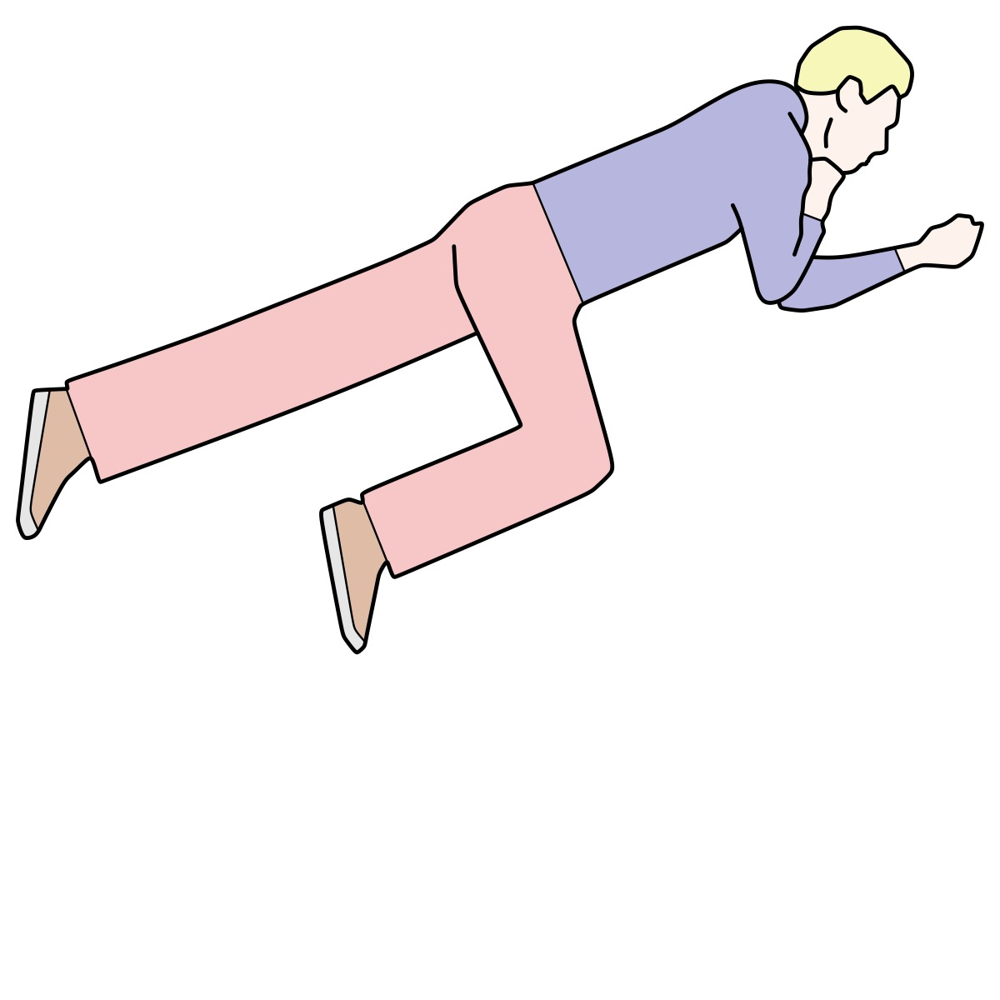
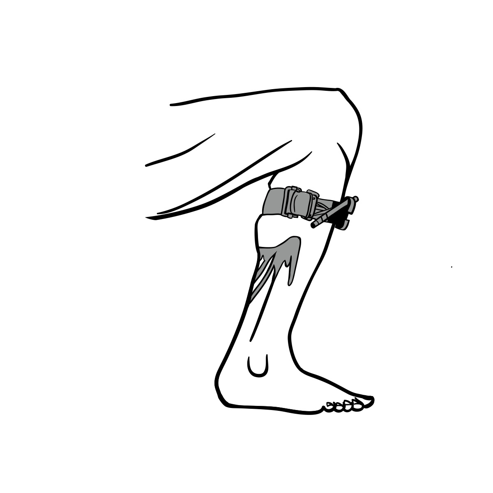
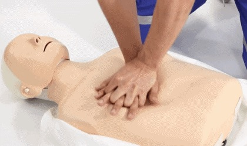
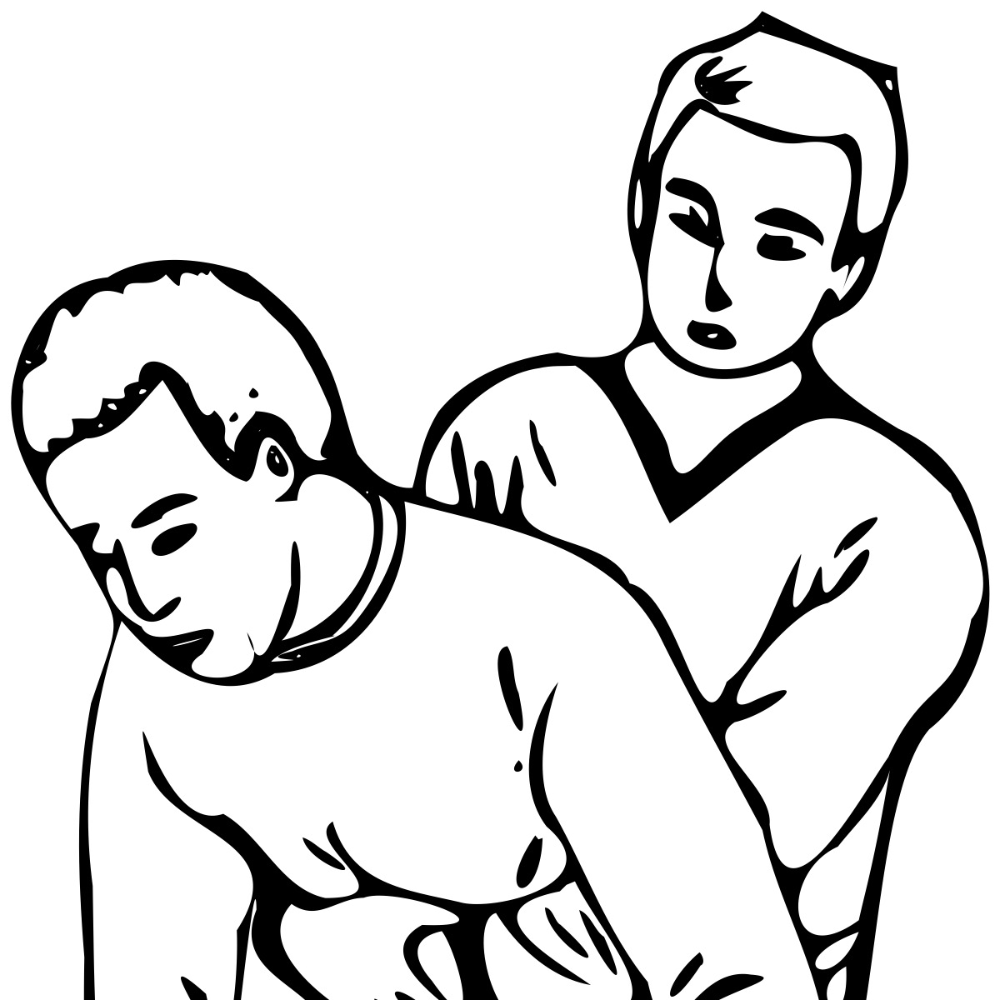
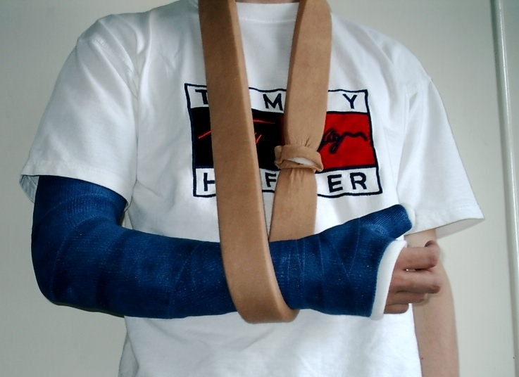

# First Aid Without a Hospital — Life-Threatening Emergencies and Basic Trauma Care

## Read this first (the 30-second version)

1. **Call for help first if any way exists** — 911, a radio, a neighbor, anyone. Even if help is hours or days away, tell someone what happened and where you are.
2. **Check the scene before you touch anyone.** Do not become a second casualty (fire, traffic, electricity, a downed attacker, floodwater).
3. **Life-threats, in order, take priority over everything else:**
   - **Severe bleeding that spurts or pools fast** → direct pressure immediately, then pack the wound, then a tourniquet if pressure fails. Note the time.
   - **Not breathing / no pulse** → start CPR immediately. Every minute without CPR after cardiac arrest lowers survival roughly 7–10%.
   - **Choking and can't talk, cough, or breathe** → back blows and abdominal thrusts (Heimlich) right away.
   - **Severe allergic reaction with throat swelling or breathing trouble** → epinephrine auto-injector (EpiPen) now if the person has one, then call for help.
4. **Everything else** (fractures, burns, sprains, minor wounds) can usually wait a few minutes while you handle the above.
5. **When in real doubt, treat it as serious and get the person to real medical care as fast as you safely can.** This guide is a bridge to professional care, not a replacement for it.

---

## Why this matters

In a working society, an ambulance is 5–10 minutes away and a hospital has a team of trained people and equipment for every one of these emergencies. In a disaster, an off-grid situation, or a remote area, that safety net may be delayed by hours, days, or gone entirely. The people who die preventably in these situations are usually lost to a small number of causes: uncontrolled bleeding, a blocked airway, cardiac arrest, or a treatable injury that turns into an infection because no one cleaned it. This guide focuses hardest on those causes because getting them right — even imperfectly — saves lives, while getting them wrong (or freezing up) costs them. Nothing here replaces a real first aid/CPR class with hands-on practice (Red Cross and AHA both teach these), but if no class is available, the steps below are the same steps taught in those classes, written so a total beginner can follow them under stress.

## Key terms (plain language)

- **DRABC / ABC** — a memorized order for checking a person: **D**anger (to you), **R**esponse (are they conscious), **A**irway (open?), **B**reathing (normal?), **C**irculation (pulse, severe bleeding).
- **CPR** — Cardiopulmonary resuscitation: chest compressions (and optionally rescue breaths) that manually pump blood when the heart has stopped, to keep the brain alive until the heart can be restarted (usually by a defibrillator/AED or hospital care).
- **AED** — Automated External Defibrillator: a public-access device that analyzes heart rhythm and can deliver a shock to restart a stopped or chaotic heart. Use one immediately if one is available — it talks you through every step.
- **Shock (medical)** — a life-threatening drop in blood flow to organs, from major bleeding, severe dehydration, infection, or severe allergic reaction. Not the same as an electric shock or emotional shock.
- **Tourniquet** — a wide strap tightened above a wound to physically stop all blood flow to a limb when direct pressure has failed to stop life-threatening bleeding.
- **Splint** — anything rigid used to hold a broken or badly injured limb still.
- **Anaphylaxis** — a sudden, severe, whole-body allergic reaction that can close the airway and drop blood pressure; it can kill within minutes and is treated with epinephrine.
- **Recovery position** — lying an unconscious but breathing person on their side so the airway stays open and fluids/vomit drain out instead of being inhaled.
- **Golden hour** — the informal idea that trauma outcomes are much better if the person reaches real surgical care within about an hour of a severe injury. It's a guideline, not a hard rule, but it's why speed matters.

---

## What you need (first-aid kit contents + improvised)

**A commercial kit should have, at minimum:** nitrile gloves (several pairs), CPR breathing barrier/face shield, gauze pads and rolled gauze, a compression bandage (Israeli/pressure bandage type), a real tourniquet (CAT or SOF-T style — improvised ones are a poor last resort), adhesive tape, triangular bandage (for slings), antiseptic wipes/solution, antibiotic ointment, tweezers, trauma shears, a thermometer, instant cold packs, splinting material (SAM splint is ideal), burn gel or clean dressings, any personal prescription medications, and an epinephrine auto-injector if anyone in the group has known severe allergies.

**If you have none of that, improvise:**
- **Gloves** → clean plastic bags over hands, or wash hands thoroughly before and after.
- **Gauze/dressings** → the cleanest cloth available — a clean cotton T-shirt, bandana, or sanitary pad; iron or boil-and-dry cloth if you have time and it isn't an active emergency.
- **Tourniquet** → a folded triangular bandage, belt, or 2-inch-plus-wide strip of sturdy cloth with a rigid stick as a windlass to twist it tight (see the tourniquet section — width matters, never use thin cord or wire).
- **Splint** → sticks, trekking poles, a rolled magazine or newspaper, a rigid piece of framing, tied on with cloth strips or tape.
- **Sling** → a triangular bandage, a shirt pinned up, or a jacket zipped with the injured arm inside.
- **Antiseptic** → clean (potable) water and mild soap is often better than nothing and safer than an unknown "remedy."

---

# LIFE-THREATENING EMERGENCIES

## Primary survey — checking someone when no professional help is coming

Do this every time, in this order, before treating anything else:

1. **Check the scene for danger** (traffic, fire, gas, electricity, unstable structure, an ongoing threat). If it's not safe, do not approach — get the person out first only if you can do so without becoming a casualty yourself.
2. **Check response.** Tap their shoulder firmly and shout, "Are you okay?" Look for any reaction — eyes opening, sound, movement.
3. **If unresponsive: shout for help / send someone to call for help now.** Do not wait until step 5.
4. **Airway.** If unresponsive and lying on their back, tilt the head back gently and lift the chin (head-tilt/chin-lift) to open the airway, unless you suspect a neck/spine injury (fall from height, diving, vehicle crash, blow to the head) — in that case, use a jaw-thrust instead if trained, or minimize head/neck movement while still opening the airway (breathing must win over spinal caution — an unbreathing person will die faster than a hypothetical spine injury will worsen).
5. **Breathing.** Look, listen, and feel for normal breathing for **no more than 10 seconds**. Occasional gasping ("agonal breathing") is **not** normal breathing — treat it as no breathing and start CPR.
6. **Circulation / severe bleeding.** Scan the whole body quickly for spurting or pooling blood. Treat major bleeding **before** minor issues, even before finishing a head-to-toe exam.
7. **Decide:** not breathing → CPR. Breathing but unconscious → recovery position + monitor + treat other injuries. Conscious → treat the specific problem, keep talking to them, keep monitoring.

```
RECOVERY POSITION (for an unconscious person who IS breathing normally)
-----------------------------------------------------------------------
        head tilted back slightly,
        cheek resting on back of hand         top leg bent at hip & knee
                 \                                      /
                  \   _____________                    /
                   \ /             \__________________/
        face -->  ( o )______________________________
                    |   torso rolled onto its side     \___ (bent knee
                    |___________________________________  props the
                                 |                          body so it
                            near arm bent,                  can't roll
                            near leg straight                forward)

  1. Kneel beside them. Straighten the arm nearest you above their head.
  2. Bring the far arm across the chest, back of hand against near cheek.
  3. Grab the far knee and pull it up, then roll them toward you onto
     their side using that knee.
  4. Tilt the head back slightly so the airway stays open; adjust the
     hand under the cheek to hold that tilt.
  5. Check breathing every couple of minutes until help arrives.
```


*Figure — Recovery position: body rolled onto its side, top leg bent at hip and knee to prop the torso, head tilted back so the airway stays clear and fluids can drain from the mouth. Source: Wikimedia Commons (File:Recovery position 02.svg), author Mrmw, CC0 1.0 (public domain).*

This position keeps an unconscious-but-breathing person's airway open and lets vomit or fluid drain out instead of being inhaled, without you having to hold them in place.

## Severe bleeding control

Uncontrolled bleeding can kill in **under 5 minutes**. Act immediately, before finishing any other exam.

1. **Expose the wound** (cut away clothing if needed) so you can see where the blood is actually coming from.
2. **Direct pressure — do this first, always.** Press hard, directly on the wound, with the thickest clean cloth/gauze available, using the flat of your hand or fingers. Do not peek or lift the dressing to check — this restarts clotting from zero. If blood soaks through, add more material **on top** of what's there; don't remove the soaked layer.
3. **If bleeding is heavy/spurting from an arm or leg and direct pressure alone isn't stopping it, pack the wound.** Push clean gauze or cloth firmly **into** the wound cavity itself (not just over the top), packing it in tightly, then hold firm direct pressure over the packed wound for at least 3 full minutes without letting up. This works for deep wounds where the bleeding point is below skin level (thigh, groin, armpit, neck-adjacent areas away from the airway).
4. **If bleeding is on a limb (arm or leg) and is life-threatening and pressure/packing fails, or you cannot maintain pressure (multiple casualties, danger, amputation) — apply a tourniquet.**


*Figure — Tourniquet placement: the band goes above the wound (between the wound and the heart), never directly on top of it or over a joint, and is tightened until bleeding fully stops. Source: Wikimedia Commons (File:Applying tourniquet.svg), author Bizhan Khodabandeh, CC BY-SA 4.0.*

Placing the tourniquet between the wound and the torso — not over the wound itself — lets it cut off arterial flow to the whole limb below it, which is what actually stops severe bleeding when direct pressure has failed.
   - Place it **2–3 inches (5–7 cm) above the wound**, directly on skin if possible (over one layer of clothing is acceptable if that's all you can manage quickly), never directly over a joint.
   - Tighten (twist the windlass, or ratchet a commercial tourniquet) until the bleeding **fully stops** — it will hurt; that means it's tight enough. A tourniquet too loose can make bleeding worse by blocking only vein return, not arterial flow.
   - **Write down or mark the exact time it was applied** (on the tourniquet itself, on their forehead/skin with a pen, or say it aloud repeatedly to someone). This time matters enormously to any medical provider who takes over.
   - **Do not loosen or remove it** once applied, except by trained medical personnel — removing it can release toxins that built up in the limb and cause a fatal drop in blood pressure. A tourniquet left on for a few hours is a real but acceptable risk to the limb when the alternative is death from bleeding.
   - If bleeding continues above the first tourniquet, apply a **second one** just above the first — do not remove the first to reposition it.
5. **For bleeding on the neck, chest, groin/armpit junctions, or scalp** (a tourniquet isn't possible there), use firm direct pressure and wound packing only, and get to real care urgently.
6. Once bleeding is controlled, treat for shock (see below) and monitor continuously — dressings can loosen.

## CPR (cardiopulmonary resuscitation)

**When to start:** the person is unresponsive AND not breathing normally (or only gasping). **When to stop:** they start breathing normally/moving on their own, an AED tells you to stop for analysis or arrives and takes over, trained help arrives and takes over, or you are physically too exhausted to continue. Do not stop to "check" every minute — real pauses cost survival.

**Adult (roughly age 12/puberty and up):**
1. Confirm unresponsive and not breathing normally (10-second check).
2. Have someone call for help and get an AED if one exists; use it the moment it arrives — it will guide you.
3. Kneel beside the chest. Place the heel of one hand on the **center of the chest** (lower half of the breastbone), other hand on top, fingers interlaced, arms straight, shoulders directly over hands.
4. **Push hard and fast: 2–2.4 inches (5–6 cm) deep, at a rate of 100–120 compressions per minute** (roughly the tempo of the song "Stayin' Alive"). Allow the chest to **fully recoil/rise** between compressions — don't lean on it.
5. Give **30 compressions**, then, if trained and willing, **2 rescue breaths** (tilt head, lift chin, pinch nose, seal your mouth over theirs or use a barrier device, blow for about 1 second each, watch for chest rise). Repeat 30:2.
6. **Hands-only CPR is a fully valid option** for an untrained bystander or if you're unwilling/unable to give breaths — continuous chest compressions at the same rate/depth, without stopping, is far better than doing nothing and is what the American Heart Association recommends for untrained rescuers.
7. Continue until one of the stop conditions above.

**Child (roughly age 1 to puberty):**
- Same 30:2 ratio for a single rescuer (15:2 if two trained rescuers are present).
- Depth: about **2 inches (5 cm)**, or about one-third the depth of the chest — one or two hands depending on the child's size, same center-of-chest location.
- Rate: same 100–120/minute.
- If alone and it's a child, give about 2 minutes of CPR before leaving to call for help (in case collapse was from a breathing problem rather than a sudden cardiac event) — unless someone else can call while you start immediately.

**Infant (under 1 year):**
- Use **two fingers** (or two thumbs with hands encircling the chest if a second rescuer is present) in the center of the chest, just below the nipple line.
- Depth: about **1.5 inches (4 cm)**, or about one-third the chest depth.
- Rate: same 100–120/minute, ratio 30:2 (single rescuer) or 15:2 (two rescuers).
- For breaths, seal your mouth over the infant's mouth **and** nose and give small, gentle puffs — just enough to see the chest rise.

```
ADULT CPR HAND PLACEMENT
-------------------------
            shoulders directly
            over hands, arms
            straight
                 |
                 v
        [==============]   <- interlaced hands, heel of
        [==============]      bottom hand on lower half
              |  |             of breastbone (sternum),
              |  |             centered on the chest
              v  v
   .-------------------------.
  (      chest / ribcage       )
   '-------------------------'
   Push hard & fast: 2-2.4 in (5-6 cm) deep, 100-120/min,
   let the chest fully rise between each compression.
```


*Figure — CPR hand placement: heel of one hand on the lower half of the breastbone, other hand on top with fingers interlaced, arms straight and shoulders over the hands. Source: Wikimedia Commons (File:Chest compressions (cropped).gif), Bangkok Hospital Phuket / Mikael Häggström, CC BY 3.0.*

Correct hand placement — centered on the sternum, not off to the side or over the ribs — is what lets a hard, straight-armed push actually compress the heart between the breastbone and spine.

## Choking (airway obstruction)

**Signs of severe/complete choking:** cannot cough, speak, or breathe; may clutch the throat; lips/face may turn blue. If they can still cough forcefully or speak, encourage coughing and do not intervene yet — a forceful cough can clear it on its own.

**Adult and child (over about 1 year), conscious:**
1. Ask "Are you choking? Can you speak?" If they can't respond, act immediately.
2. Stand behind them, lean them forward, and give **5 firm back blows** between the shoulder blades with the heel of your hand.
3. If that doesn't clear it, give **5 abdominal thrusts (Heimlich maneuver):** stand behind them, wrap your arms around their waist, make a fist with one hand thumb-side in, just above the navel, well below the breastbone; grab your fist with the other hand and thrust sharply inward and upward.


*Figure — Heimlich maneuver / abdominal thrusts: stand behind the person, wrap both arms around their waist, and thrust a fisted hand sharply inward and upward just above the navel. Source: Wikimedia Commons (File:AbdominalThrust HeimlichManoeuvre.svg), author Evolution and evolvability, CC BY-SA 4.0.*

Thrusting inward and upward from just above the navel compresses the diaphragm and lungs, forcing trapped air (and the object with it) back up out of the airway.

4. Alternate 5 back blows and 5 abdominal thrusts until the object comes out or the person becomes unresponsive.
5. **If they become unresponsive:** lower them to the ground carefully and begin CPR (compressions may help dislodge the object) — each time you open the airway to give a breath, look inside the mouth for the object and remove it only if you can clearly see it (never blind-finger-sweep).
6. **For a visibly pregnant person or someone too large to reach around:** give chest thrusts instead of abdominal thrusts, hands in the same position as CPR compressions.

**Infant (under 1 year), conscious:**
1. Hold the infant face-down along your forearm, supporting the head/jaw, head lower than the body, resting your arm on your thigh.
2. Give **5 back blows** between the shoulder blades with the heel of your hand.
3. Flip the infant face-up (supporting head/neck), and give **5 chest thrusts** with two fingers in the same location as infant CPR (center of chest, below nipple line) — **never** perform abdominal thrusts on an infant.
4. Repeat 5 back blows / 5 chest thrusts until the object clears or the infant becomes unresponsive, then begin infant CPR, checking the mouth for a visible object before each set of breaths.

## Shock (the medical kind)

Shock means organs aren't getting enough blood flow, and it can follow major bleeding, severe burns, dehydration, infection, or severe allergic reaction. **Signs:** pale, cool, clammy skin; rapid weak pulse; rapid shallow breathing; weakness or dizziness; confusion or restlessness; nausea; thirst.

1. Treat the cause first if you can identify it (stop bleeding, treat the allergic reaction, etc.).
2. Lay the person down. If there's no suspected head, neck, spine, or leg injury, raise their legs about 12 inches (30 cm).
3. Keep them warm (blanket under and over them) — shock impairs the body's ability to regulate temperature.
4. Do not give food or water by mouth if surgery might be needed or if they're not fully alert (aspiration/choking risk).
5. Loosen tight clothing. Keep monitoring breathing and responsiveness. Get real medical help as fast as possible — shock is a medical emergency that first aid can only slow, not fix.

---

# COMMON INJURIES AND ILLNESSES

## Wounds and infection

1. **Stop the bleeding first** (see above) before cleaning.
2. **Clean:** once bleeding is controlled, rinse the wound thoroughly with the cleanest water available (potable water is ideal) to flush out dirt and debris; mild soap around (not directly in) the wound helps. Remove visible debris with clean tweezers if easy to do; don't dig for deeply embedded material — that's a job for a real medical provider.
3. **Close:** small, clean, straight cuts with edges that come together can be held closed with butterfly strips of tape or an actual adhesive bandage. **Do not close** deep puncture wounds, dirty/contaminated wounds, animal or human bites, or anything gaping — these should be left open (loosely covered) and seen by a medical provider, since closing a dirty wound traps bacteria inside and raises the risk of a serious deep infection.
4. **Dress:** cover with a clean, non-stick dressing, secure with tape or a wrap, and change it at least daily or whenever it becomes wet/dirty.
5. **Watch for infection over the following days** — increasing (not decreasing) redness, warmth, and swelling; red streaking spreading from the wound toward the body; pus; the wound getting more painful instead of less; fever; swollen lymph nodes (neck, armpit, groin). **Red streaking, fever, or spreading redness are signs of a serious infection that can become life-threatening (sepsis) — this needs real medical care, including antibiotics, as soon as possible; do not try to treat it with topical remedies alone.**
6. Tetanus is a real risk from any puncture or dirty wound — if the person's tetanus vaccination isn't current and real care becomes available, they should get it.

## Burns

1. **Identify severity:**
   - **First-degree (superficial):** red, painful, no blisters (like mild sunburn).
   - **Second-degree (partial thickness):** red, very painful, blistering.
   - **Third-degree (full thickness):** white/leathery/charred, may be numb (nerve damage) — this is always serious regardless of size.
2. **Do immediately:** cool the burn under cool (not ice-cold) **running water for 10–20 minutes**. This is the single most useful first-aid action for a burn and works even if you start it a bit late.
3. **Do NOT:** apply ice directly (causes more tissue damage), butter, oil, toothpaste, or other home remedies; do not pop blisters (raises infection risk); do not peel away clothing stuck to the burn (cut around it instead).
4. Once cooled, cover loosely with a clean, non-stick dressing (not fluffy cotton). Leave small intact blisters alone.
5. **Get real medical care for:** any third-degree burn, burns on the face/hands/feet/groin/major joints, burns larger than about the size of the person's palm, burns from chemicals or electricity, or any burn on an infant or elderly person.
6. For chemical burns, brush off dry chemical first if possible, then flush with large amounts of water for at least 20 minutes.

## Fractures and splinting

1. **Signs of a possible fracture:** deformity, inability to bear weight or use the limb, severe pain at a specific point, swelling/bruising, a grinding sensation, or an obviously abnormal angle.
2. **Do not try to straighten or realign a deformed limb.** Splint it in the position you find it, unless there is no pulse/circulation below the injury — in that remote-care setting only, gentle traction to try to restore circulation may be attempted, but this is genuinely advanced and higher-risk; prefer to leave it alone and evacuate quickly whenever possible.
3. **To splint:** find something rigid (sticks, a rolled magazine, a board, trekking poles) long enough to immobilize the joint **above and below** the injury. Pad it with cloth. Tie it snugly at multiple points with cloth strips, gauze, or tape — snug enough to prevent movement, loose enough that you can still fit a finger under the tie and that fingers/toes stay pink and warm.
4. Check circulation below the splint (color, warmth, ability to feel touch) right after splinting and every 15–20 minutes; loosen immediately if the limb becomes pale, cold, numb, or tingling.


*Figure — Arm sling: the forearm is supported across the chest at roughly a 90-degree angle, with the sling tied or fastened behind the neck so the elbow, wrist, and hand are all held still. Source: Wikimedia Commons (File:Armsling.jpg), author Mednet, public domain.*

A sling takes the weight of an injured arm off the shoulder and stops the elbow and wrist from moving — the same principle applies whether you're using a commercial sling or an improvised triangular bandage.

5. Elevate the splinted limb if possible and use cold packs (wrapped, not direct on skin) to reduce swelling.
6. Any suspected fracture, especially of the thigh, hip, pelvis, or any open fracture (bone through skin), is a serious injury requiring real medical evacuation.

## Sprains and strains — RICE

1. **R — Rest:** stop using the injured area.
2. **I — Ice:** cold pack wrapped in cloth, 15–20 minutes at a time, several times a day for the first 24–48 hours (never ice directly on skin).
3. **C — Compression:** wrap snugly (not so tight it causes numbness/tingling) with an elastic bandage.
4. **E — Elevation:** raise the injured area above heart level when possible.
5. If the person cannot bear any weight at all, if there's severe deformity, or if numbness/tingling develops, treat it as a possible fracture instead.

## Head, neck, and spine injuries — when to be extra cautious

**Suspect a spine injury after:** falls from height, diving accidents, high-speed vehicle crashes, being struck hard on the head/back, or any injury with neck/back pain, numbness, tingling, or weakness in the limbs.

1. If the person is breathing and you don't urgently need to move them, **keep them as still as possible** — support the head in the position found, tell them not to move, and wait for real help if at all possible.
2. **However — airway and breathing always come first.** If they are unresponsive and not breathing, you must open the airway and start CPR even with a suspected spine injury; an unbreathing brain dies in minutes, while careful handling minimizes (does not eliminate) further spine risk.
3. Only move a person with a suspected spine injury if there is an immediate danger (fire, traffic, rising water) that requires it — and if you must, try to move the head, neck, and torso together as one unit ("log roll") rather than letting the neck twist or bend.
4. Watch for worsening headache, repeated vomiting, one pupil larger than the other, increasing confusion, or seizures after a head injury — these are signs of a serious brain injury requiring urgent real medical care.

## Hypothermia

**Signs progress with severity:** mild — shivering, cold hands/feet, clumsiness; moderate — violent shivering or shivering stops, confusion, slurred speech, stumbling; severe — no shivering, rigid muscles, very slow breathing/pulse, unconsciousness — this is a life-threatening emergency.

1. Get the person out of the cold/wet environment and out of the wind.
2. **Remove wet clothing** and replace with dry insulation; wrap in blankets/sleeping bags, covering the head and neck too.
3. Warm the body **gradually** — skin-to-skin contact under blankets, warm (not hot) water bottles wrapped in cloth against the chest/neck/groin/armpits (avoid direct heat on limbs).
4. If alert and able to swallow, give warm (not hot), sweet, non-alcoholic, non-caffeinated drinks. **Do not give alcohol** — it worsens heat loss.
5. **Handle severe hypothermia very gently** — rough handling of a severely hypothermic person can trigger a fatal heart rhythm ("rescue collapse"). Move them as little and as smoothly as possible.
6. If no pulse/breathing is detected, begin CPR, but check pulse/breathing for up to a full minute in a severely cold person before deciding — a very slow heartbeat can be mistaken for none. Severe hypothermia victims have survived long periods; do not give up on resuscitation attempts.

## Heat exhaustion vs. heat STROKE (a true medical emergency)

This distinction matters enormously in hot climates (including North Texas summers — see regional section).

**Heat exhaustion** (serious, usually not immediately life-threatening): heavy sweating, cool/clammy/pale skin, weakness, headache, nausea, muscle cramps, dizziness.
- Move to shade/cool area, remove excess clothing, cool with wet cloths and fanning, sip water or a diluted electrolyte drink, rest lying down with legs slightly raised.
- If symptoms worsen or don't improve within about 30–60 minutes, treat as heat stroke.

**Heat stroke (life-threatening — treat as a true emergency):** body temperature above about 104°F (40°C), **hot, red, and dry or damp skin**, confusion, slurred speech, agitation, seizures, or loss of consciousness. This is a medical emergency with a real risk of death or permanent organ damage.
1. Call for emergency help immediately if any way exists.
2. **Cool the person as fast as possible** — the fastest, best method is full-body immersion in cold/ice water if available; if not, douse with cool water continuously and fan aggressively, apply ice packs to neck, armpits, and groin (areas with large blood vessels close to skin).
3. Do not give fluids by mouth if the person is confused or losing consciousness (choking/aspiration risk).
4. Keep cooling continuously until help arrives or body temperature clearly drops and mental status improves — don't stop cooling efforts prematurely.

## Dehydration

1. **Signs:** thirst, dark urine or reduced urination, dry mouth, headache, dizziness, fatigue; severe signs include sunken eyes, no tears, extreme lethargy, confusion, or fainting.
2. Give small, frequent sips of clean water (not large amounts at once, which can cause vomiting) — see the water topic guide for making water safe first.
3. An oral rehydration mix (clean water with a small amount of salt and sugar) helps replace lost electrolytes if there's been vomiting, diarrhea, or heavy sweating.
4. Severe dehydration (confusion, fainting, inability to keep fluids down) needs real medical care, often IV fluids.

## Allergic reaction and anaphylaxis

**Mild allergic reaction:** localized rash, itching, mild swelling — an antihistamine (if available and appropriate for the person) and monitoring is usually enough.

**Anaphylaxis (severe, life-threatening) — signs:** difficulty breathing or swallowing, swelling of the face/lips/tongue/throat, widespread hives, dizziness or fainting, a feeling of impending doom, rapid pulse, vomiting.
1. **If the person has an epinephrine auto-injector (EpiPen or similar), use it immediately** — this guide will not state a dose; follow the device's own printed instructions and the person's prescribed device, and do not delay use waiting to "see if it gets worse."
2. Call for emergency help right away — anaphylaxis can recur after the epinephrine wears off, so real follow-up care is needed even if symptoms improve.
3. Have the person lie flat with legs raised, **unless** they're having trouble breathing — then let them sit up in whatever position is easiest for them to breathe.
4. If symptoms don't improve or worsen after about 5–15 minutes and a second auto-injector is available, it may be used per its instructions.
5. Monitor breathing and responsiveness continuously; begin CPR if they stop breathing or lose a pulse.

## Nosebleed

1. Sit the person up and **lean forward** (not back — leaning back sends blood down the throat and can cause choking/vomiting).
2. Pinch the soft, fleshy part of the nose (not the bony bridge) firmly for a full **10–15 minutes** without releasing to check.
3. A cold pack on the bridge of the nose or back of the neck can help.
4. If bleeding hasn't stopped after 20 minutes, or followed a hard blow to the face/head, or occurs with a lot of blood loss, seek real medical care.

## Dental emergencies (brief)

1. **Knocked-out permanent tooth:** handle it by the crown (chewing surface), never the root. Rinse gently with clean water if dirty (don't scrub). If possible, gently reinsert it into the socket and have the person bite down on clean gauze to hold it. If that's not possible, store it in a small container of milk (or the person's own saliva) — not tap water — and get to a dentist **within 30–60 minutes** for the best chance of saving it.
2. **Toothache:** rinse with warm salt water, floss gently to clear any trapped debris, cold compress on the outside of the cheek for swelling.
3. **Broken tooth/object lodged:** save any broken pieces, rinse the mouth, apply a cold compress for swelling, and see a dentist as soon as possible.

## When an injury is beyond self-care — get real help

Treat the following as requiring evacuation or emergency services as soon as humanly possible, even if the person seems stable in the moment: uncontrolled or recurring severe bleeding; any period of unconsciousness or ongoing confusion after a head injury; chest pain, pressure, or trouble breathing; a suspected spine injury; an open (compound) fracture or any fracture of the thigh/hip/pelvis; a third-degree burn or any burn to face/hands/feet/groin; signs of a spreading serious infection (red streaking, fever, pus, worsening pain); anaphylaxis (even after epinephrine); heat stroke; severe hypothermia; a seizure that doesn't stop within a few minutes or repeats; any snakebite from a venomous species (see regional section); pregnancy complications; and anything you are simply not sure about. **First aid buys time. It is not a substitute for surgery, antibiotics, blood products, or intensive care when those are truly needed.**

---

## Regional & scenario variants

**North Texas heat and climate:** Summers regularly bring heat index values well above 100°F. Heat stroke is a genuine local killer, especially for outdoor workers, the elderly, small children, and pets left in vehicles (a car interior can exceed 120°F within minutes even with a window cracked). Prevention matters as much as treatment: hydrate before you're thirsty, schedule hard outdoor work for early morning, wear light loose clothing, and check on elderly or isolated neighbors during heat waves. Know the heat exhaustion vs. heat stroke distinction above cold — heat stroke is a call-for-help-now emergency.

**Snakebite basics (relevant to North Texas and much of the rural South/Southwest):** The venomous pit vipers found in this region include **copperheads, cottonmouths (water moccasins), and several rattlesnake species**. All are pit vipers with triangular heads, elliptical (cat-like) pupils, and heat-sensing pits between eye and nostril — but do not waste time trying to identify or catch the snake.
- **DO:** move the person away from the snake to prevent a second bite; keep them calm and as still as possible (movement speeds venom spread through the lymphatic system); remove rings/watches/tight clothing near the bite before swelling starts; keep the bitten limb at or slightly below heart level; get to real medical care (antivenom) as fast as safely possible; note the time of the bite.
- **DO NOT:** cut the wound; try to suck out venom (by mouth or device — doesn't work and risks infection); apply a tourniquet or ice; give the person alcohol or caffeine; let them exert themselves (walking hard/running speeds venom circulation — carry them if possible).
- Copperhead bites are painful and cause significant local swelling/tissue damage but are rarely fatal to a healthy adult; cottonmouth and rattlesnake bites are more dangerous and can be life-threatening, especially to children, the elderly, or anyone with a large dose of venom. **All pit viper bites need real medical evaluation** — antivenom is the actual treatment; first aid only buys time.
- A "dry bite" (no venom injected) happens in some cases, but you cannot tell in the field — treat every bite as if venom was injected.

---

## ⚠️ Safety — warnings & mistakes to avoid

- **Do not delay calling for help** while you try to handle everything yourself — call or send someone the moment you recognize a life-threat.
- **Do not remove a tourniquet once applied**, except by trained medical personnel with the ability to manage the aftermath.
- **Do not lift a soaked dressing to "check" a wound** — it undoes clotting. Add more material on top instead.
- **Do not give food or drink to someone who is unconscious, confused, or might need surgery.**
- **Do not pop burn blisters, and never use butter, oil, or ice directly on a burn.**
- **Do not try to realign a visibly deformed fracture** — splint it as found.
- **Do not lean a nosebleed patient's head back.**
- **Do not perform a blind finger sweep in the mouth** of a choking victim — only remove an object you can clearly see.
- **Do not use ice directly on skin** (frostbite risk) — always wrap it in cloth.
- **Do not assume a rewarmed severely hypothermic person is fine after they stop shivering** — continue monitoring closely.
- **Do not cut, suck, ice, or tourniquet a snakebite.**
- **Never invent or guess a medication dose.** If you don't know the correct dose of a medicine (including epinephrine, aspirin, or anything else), don't administer it — follow the device/label instructions the person already has, or wait for someone who knows.
- **Protect yourself first** — gloves or a barrier when dealing with blood or body fluids, and never enter a scene (fire, traffic, structural collapse, an active threat) that isn't safe for you.

---

## Troubleshooting

- **"I don't know if they're breathing normally or just gasping."** Treat any doubt as "not breathing" and start CPR — CPR on someone who didn't strictly need it is far less harmful than withholding it from someone who did.
- **"The tourniquet isn't stopping the bleeding."** It's likely not tight enough — tighten further, or apply a second one just above the first; don't remove the first.
- **"I'm exhausted from doing CPR alone."** Switch with another rescuer every 2 minutes if possible (compressions get shallower as you tire, even if you don't feel it); if truly alone, continue as long as you physically can.
- **"The wound keeps reopening/bleeding after I stop pressure."** Hold pressure longer than feels necessary — a full uninterrupted 5–10 minutes, without peeking, is often required for it to actually hold.
- **"I don't have a real splint material."** Almost anything rigid works — a rolled-up magazine, sturdy branch, or trekking pole; the goal is just to stop the limb from moving, not perfection.
- **"The person refuses help or downplays how bad it is."** Trust the visible signs (deformity, uncontrolled bleeding, confusion) over their own assessment — injury and shock both impair judgment.
- **"I only have contaminated/dirty water to clean a wound."** Boiled-then-cooled water is safer than raw water; but for a life-threatening bleed, stopping the bleeding always comes before worrying about cleaning it.

---

## Quick-reference checklist

- [ ] Scene safe? Check before approaching.
- [ ] Call/send for help immediately for any life-threat.
- [ ] Check response → airway → breathing (10 sec) → severe bleeding.
- [ ] Severe bleeding: direct pressure → pack the wound → tourniquet (note the time) if needed.
- [ ] Not breathing: start CPR now (30:2, 100–120/min, full recoil) or hands-only if untrained.
- [ ] Choking, can't speak/breathe: 5 back blows, 5 abdominal (or chest, for infants) thrusts, repeat.
- [ ] Unconscious but breathing: recovery position, monitor continuously.
- [ ] Shock signs: lay flat, legs raised (unless spine/leg injury), keep warm, no food/drink.
- [ ] Any wound: clean with safe water, don't close a dirty/deep wound, dress, watch daily for red streaking/fever/pus.
- [ ] Burn: cool water 10–20 min, no ice/butter/popping blisters, cover loosely.
- [ ] Suspected fracture: splint as found, check circulation below every 15–20 min.
- [ ] Sprain: RICE (Rest, Ice, Compression, Elevation).
- [ ] Suspected spine injury: keep still unless airway/breathing demands otherwise.
- [ ] Hypothermia: dry clothes, gradual rewarming, no alcohol, handle gently if severe.
- [ ] Heat stroke (hot/dry skin, confusion, >104°F): emergency — cool aggressively, ideally cold-water immersion.
- [ ] Anaphylaxis: use their epinephrine auto-injector now, call for help, lie flat unless breathing is hard.
- [ ] Snakebite: keep calm and still, limb at/below heart level, no cutting/suction/ice/tourniquet, get antivenom care.
- [ ] Never guess a medication dose.
- [ ] When unsure or the situation is beyond this list: get the person to real medical care as fast as safely possible.

---

## Sources & further reading

- *First_Aid_and_CPR_Manual.pdf* (reference/manuals)
- *firstaid_survival_cpr_pocketguide.pdf* (reference/manuals)
- *wilderness_remote_firstaid.pdf* (reference/manuals)
- American Red Cross — First Aid/CPR/AED Participant's Manual and guidelines
- American Heart Association — Guidelines for CPR and Emergency Cardiovascular Care (adult, child, infant CPR ratios/rates/depths)
- See also: `../emergency-medicine-herbal/emergency-medicine-herbal.md` for wound-care adjuncts and herbal supportive care, `../water/water.md` for making irrigation/drinking water safe, `../psychological-first-aid/psychological-first-aid.md` for supporting survivors emotionally after trauma, and `../regional-north-texas/regional-north-texas.md` for local heat and wildlife hazards.
- **Images** (`images/` folder), all from Wikimedia Commons, openly licensed:
  - *recovery-position.jpg* — File:Recovery position 02.svg, Mrmw, CC0 1.0.
  - *cpr-hand-placement.jpg* — File:Chest compressions (cropped).gif, Bangkok Hospital Phuket / Mikael Häggström, CC BY 3.0.
  - *heimlich-abdominal-thrust.jpg* — File:AbdominalThrust HeimlichManoeuvre.svg, Evolution and evolvability, CC BY-SA 4.0.
  - *tourniquet-application.jpg* — File:Applying tourniquet.svg, Bizhan Khodabandeh, CC BY-SA 4.0.
  - *arm-sling.jpg* — File:Armsling.jpg, Mednet, public domain.
