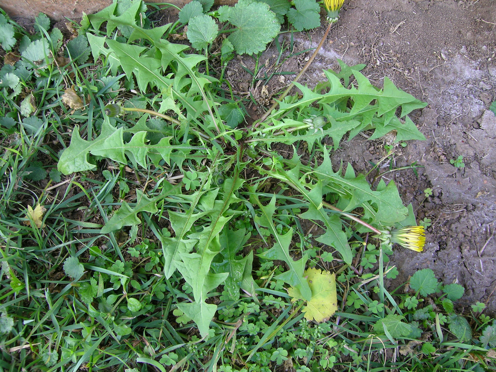
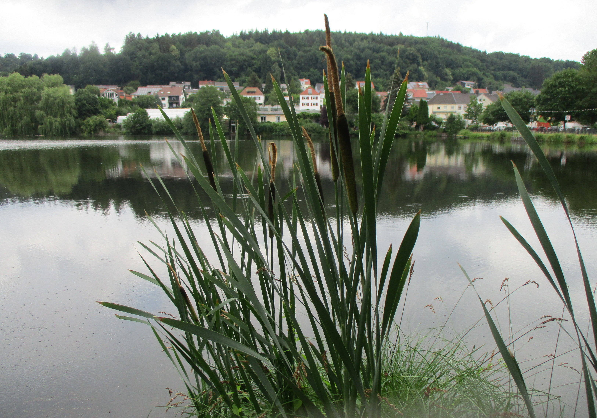
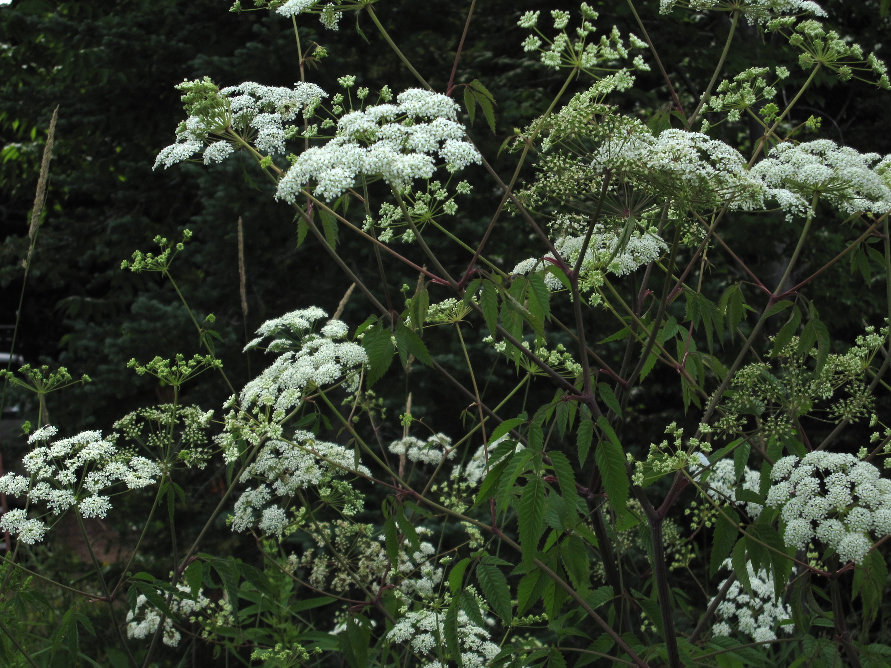
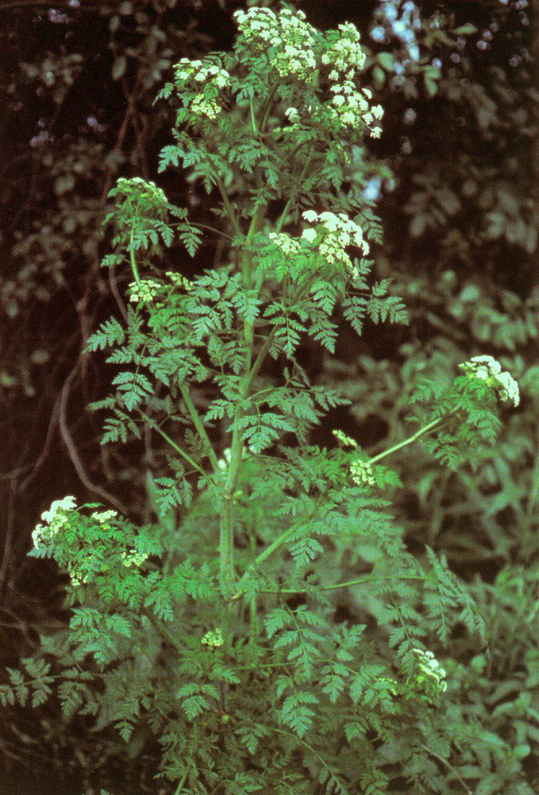
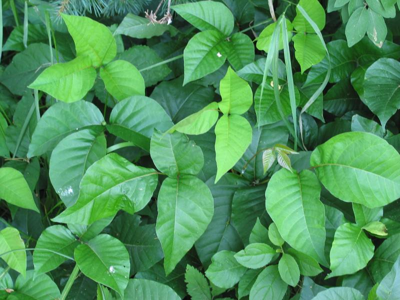

# Foraging & Wild Edibles — Finding Safe Wild Food

## Read this first (the 30-second version)
1. **The #1 rule: if you are not 100% sure what a plant or mushroom is, do NOT eat it.** Being "pretty sure" is not good enough — a handful of wild plants and mushrooms can seriously injure or kill you, and several of the deadliest ones closely resemble common edible plants.
2. **Positive identification beats every test.** Match a plant against **multiple** field marks (leaf shape, flower, stem, smell, habitat) in a real guide or against a plant you already know well — don't rely on one feature alone.
3. **Mushrooms are the highest-risk category in this entire guide.** Unless you already have expert-level mushroom identification skill, **do not eat wild mushrooms at all**, even if a test seems to say they're safe.
4. A handful of very common, easy-to-learn plants (dandelion, clover, cattail, plantain, chickweed) are safe, widespread, and forgiving for beginners — learn these first and get comfortable before expanding your list.
5. Calories from foraged wild plants are usually **small** compared to the effort spent finding them. In a real survival situation, foraging is a *supplement* to your food plan (see the [Hunting, Fishing & Trapping guide](../food-hunting-fishing-trapping/food-hunting-fishing-trapping.md)), not the main plan.
6. **If someone eats a suspected poisonous plant or mushroom, do NOT induce vomiting.** Call **Poison Control at 1-800-222-1222 (US)** or emergency services immediately — this is more important than anything else in this guide.

---

## Why this matters
In a prolonged emergency — no store, no delivery, food stocks running low — the ground around you, even a suburban yard or a roadside ditch, is full of calories and vitamins if you know what to look for. Foraging supplies vitamin C, fiber, and variety that stave off malnutrition. But this is also the survival skill where a **single identification mistake can be fatal or cause permanent organ damage**, sometimes from a plant that looks almost exactly like a "safe" one growing right next to it, and symptoms may not appear for hours after the damage is already done. This guide teaches positive identification of a short list of safe, common plants, makes sure you can recognize the deadliest lookalikes by name and feature, and gives a fallback test with clearly stated limits — never a substitute for knowing what you're eating.

## Key terms (plain language)
- **Forage / foraging** — gathering wild (not cultivated) plants, fungi, or insects for food.
- **Positive identification** — confirming a plant's identity using several independent features (not just one), ideally cross-checked against a picture guide or known specimen, until there is no reasonable doubt.
- **Lookalike** — a different plant/mushroom that resembles an edible one closely enough to cause confusion. This guide's most dangerous lookalikes are all in this category.
- **Toxin** — a poisonous substance produced by a plant, mushroom, or insect. Some act in minutes (fast toxins), some take hours or days to show symptoms (delayed toxins, the most dangerous kind because damage occurs before you feel anything).
- **Tannins** — bitter, astringent compounds in acorns, oak bark, and some other plants; not usually deadly in small amounts, but cause stomach upset and reduce nutrient absorption; removed by leaching (soaking/boiling in changed water).
- **Glochids** — the tiny, hair-fine, barbed spines on prickly pear cactus pads and fruit (in addition to the larger visible spines); they embed in skin easily, are hard to see, and must be removed before handling or eating.
- **Umbel** — an umbrella-shaped flower cluster, where many small flower stalks radiate from one point (like ribs of an umbrella). The carrot family (Apiaceae) — which includes both wild carrot and the two deadliest plants in North America — is identified partly by this flower shape, which is why this family deserves extra caution.
- **Amatoxins** — the toxin family in death cap and destroying angel mushrooms; they attack the liver and kidneys and cause symptoms only after a long delay, once damage is already underway.
- **Universal Edibility Test (UET)** — a long, staged process (from the US Army survival manual) for testing an unknown **plant** part when no positive identification is possible and starvation is a real risk. It is slow, imperfect, and **never to be used on mushrooms or fungi**.

## What you need
- A **real, illustrated plant identification guide** for your region, ideally on paper (this knowledge base includes the *US Army Illustrated Guide to Edible Wild Plants* and *A Field Guide to Edible Wild Plants* in `reference/manuals/` — read them before you need them).
- A mental list of **local plants you already know are safe** (learn them at home, in daylight, before an emergency).
- A knife or scissors for cutting samples; gloves for spiny/glochid-covered plants (like prickly pear).
- A collecting container (basket, cloth bag — avoid plastic bags for greens, they wilt and rot in heat).
- Water and a pot for washing, leaching tannins, and cooking (see [Water](../water/water.md) and [Fire](../fire/fire.md)).
- Patience — rushed identification is how poisoning happens.

---

## Method 1: Positive identification — the right way to forage
This is the primary, correct method. Everything else in this guide (the UET) is a fallback for when this fails and you are genuinely desperate.

1. **Find the plant in a guide with pictures**, ideally more than one guide or source, and matching your actual geographic region and season.
2. **Check multiple features, not just one:** leaf shape and arrangement (opposite vs. alternate; simple vs. compound), stem (round/square, hollow/solid, hairy/smooth, color), flower shape and color, fruit/seed appearance, root structure, overall habitat (wet ditch vs. dry field vs. shade), and smell when crushed.
3. **Check the "3 out of 3" rule**: pick three independent, distinguishing features of the edible species you think you've found (for example: leaf arrangement, flower shape, and stem/habitat) — the plant must match **all three**, not just one or two, and must not also match a known toxic lookalike on any of them. If it matches an edible species on some features but not all, or if a well-known toxic lookalike shares some of those same features, treat it as unidentified — do not eat it.
4. **Know what part is edible and how it must be prepared.** Many edible plants have toxic parts (green potato sprouts, rhubarb leaves, apple seeds, elderberry raw fruit) — "the plant is edible" does not always mean "every part, raw, is safe."
5. **Verify with a second source before eating a new plant for the first time**, and the first time you try a new plant, eat only a small amount even after positive ID, in case of personal allergy or sensitivity.
6. **Keep a mental (or written) "life list"** of plants you have positively identified and eaten safely before — over time this becomes your reliable, fast list, and you'll need the slow process (and the UET) less often.

**How to verify:** you should be able to name, from memory, at least three distinguishing features of the plant that separate it from its most dangerous lookalike, before you put any part of it in your mouth.

---

## Method 2: The Universal Edibility Test (UET) — full procedure and its limits
Use this **only** for a plant you cannot positively identify, only when food is genuinely scarce, and **never** for mushrooms/fungi (see the Mushrooms section below — this test does not work on them and can get you killed). This procedure is slow by design — roughly 24 hours per plant part — because that is what it takes to catch delayed reactions.

**Before you start — automatic disqualifiers.** Do NOT test any plant that has any of these warning signs; discard it immediately regardless of how hungry you are:
- Milky or discolored sap (a few exceptions like dandelion exist, but only if positively identified — as an unknown, treat milky sap as disqualifying).
- Spines, fine hairs, or thorns on the part you'd eat.
- Bitter or soapy taste in a tiny nibble test (see below), or an almond scent in the leaves/stems/woody parts (can indicate cyanide-producing compounds).
- Umbrella-shaped flower clusters (umbels) — this shape is shared by wild carrot, celery, and parsley (safe) but ALSO by water hemlock and poison hemlock (deadly). Because misidentifying this family is one of the most common fatal foraging mistakes in North America, **skip the entire test and simply avoid any unidentified umbel-flowered plant.**
- Grain heads with a pink, purplish, or black spur (possible ergot fungus contamination).
- Beans, bulbs, or seeds inside pods (many legumes and bulbs are toxic raw and some stay toxic no matter how prepared).
- Plant, sap, or fruit resembling dill, carrot, or parsnip growing wild near water (this is exactly where water hemlock grows).

**The steps** (from the US Army survival manual approach):
1. **Test only one plant, and only one part of that plant, at a time** (leaves separately from stems, separately from roots — toxicity often differs by part).
2. **Do not eat anything else for 8 hours before starting** so you can clearly attribute any reaction to the test plant.
3. **Smell it.** A strong or acrid odor is a caution sign, though its absence doesn't guarantee safety.
4. **Skin contact test:** rub a piece of the plant on the inside of your wrist or elbow. Wait 15 minutes. Any burning, itching, redness, or rash = fail, discard this plant.
5. During the whole test, take nothing by mouth except **water** and the plant part under test.
6. Prepare a small sample the way you intend to eat it (raw, boiled, etc. — test each preparation separately, since cooking changes some toxins).
7. **Lip test:** touch a small piece to the outer edge of your lip. Wait **3 minutes**. Burning, tingling, itching = fail, discard.
8. **Tongue test:** if the lip test passed, place a small piece on your tongue and hold it (do not chew) for **15 minutes**. Any reaction = fail, discard.
9. **Chew test:** chew a small piece thoroughly, holding it in your mouth for **15 minutes**. **Do not swallow.** Any burning, numbness, or odd sensation = spit out, rinse mouth, discard the plant.
10. **Swallow test:** if nothing has happened, swallow the small chewed piece. Then **wait 8 hours** eating and drinking nothing but water. Any cramping, nausea, vomiting, dizziness = that plant part is not safe — **do NOT induce vomiting** (risk of aspiration; ipecac is no longer recommended). Call **Poison Control at 1-800-222-1222 (US)** or emergency services immediately.
11. **Larger sample:** if 8 hours pass with no reaction, eat about a **quarter cup** of the same plant part, prepared the same way. Wait another **8 hours**.
12. **Only after all of this** — with no reaction across roughly 24 hours total — is that specific part of that specific plant, prepared that specific way, reasonably judged edible. You must repeat the entire process for other parts (root vs. leaf) or other preparations (raw vs. cooked) of the same plant.

**Limitations you must understand — why this test is a last resort, not a green light:**
- It catches only fast-acting, single-dose toxins. It does **not** catch toxins that build up over repeated meals (cumulative poisons), toxins that take longer than 8 hours to act, or toxins that only cause harm in larger quantities than you tested.
- It cannot detect toxins that damage organs silently before symptoms appear — by the time you feel sick from some poisons, the damage is already done. This is exactly why it must never be used on mushrooms.
- A negative reaction from one part of a plant tells you nothing about a different part (leaves vs. roots can have completely different toxicity).
- The test takes roughly a full day per plant part, uses food you may not have to spare, and still is not a guarantee — it lowers risk, it does not eliminate it. Positive identification (Method 1) is always better when available.

---

## Method 3: Common, widely-recognized safe edibles (learn these first)
These plants are common across most of the US, easy to learn, forgiving of minor ID mistakes because they lack dangerous lookalikes (mostly — read the cautions), and provide real nutrition.

**Dandelion (*Taraxacum officinale*).**
- ID: basal rosette of deeply jagged, toothed leaves (the name means "lion's tooth"); single bright-yellow composite flower atop a smooth hollow stalk; milky white sap; matures into the familiar white puffball seed head.
- Prep: young leaves raw or cooked (older leaves are bitter — boil in one or two changes of water to mellow); flowers raw, battered, or made into syrup/wine; roots washed, sliced, and roasted until dark brown as a coffee substitute.
- Verify: no dangerous lookalikes in North America; the closely related cat's-ear (*Hypochaeris radicata*) is also edible, so confusion is low-risk.


*Figure — Common dandelion (*Taraxacum officinale*), EDIBLE. Key ID features visible: the basal rosette of deeply jagged ("lion's tooth") leaves and the single bright-yellow composite flower on a smooth hollow stalk. Source: Wikimedia Commons (File:Taraxacum officinale plant10 (16189311200).jpg), Harry Rose, CC BY 2.0.*

**Cattail (*Typha* spp.).**
- ID: tall (4–8 ft), grass-like plant standing in shallow water, ditches, or pond edges; flat, strap-like leaves; the unmistakable brown, corn-dog-shaped flower spike on a tall stalk.
- Prep: young spring shoots — peel back the outer leaves to the tender white core and eat raw or cooked ("Cossack asparagus"); the starchy rhizome (root) can be pounded/washed in water to extract usable starch; the yellow pollen (in season) can be shaken into a bag and used to bulk up flour; young green flower spikes can be boiled and eaten like corn on the cob.
- Caution: before the seed head forms, cattail's straplike leaves can be confused with **iris** (toxic) growing in the same wet habitat. **Wait for or confirm the distinctive brown flower spike, or an established white, spongy rhizome base**, before harvesting from an unflowering stand.


*Figure — Cattail (*Typha latifolia*), EDIBLE. Key ID feature visible: the unmistakable brown, corn-dog-shaped flower spike on a tall stalk above flat, strap-like leaves in shallow water. Source: Wikimedia Commons (File:20220622Typha latifolia1.jpg), AnRo0002, CC0 1.0.*

**Clover (*Trifolium* spp., red and white).**
- ID: leaves in groups of three oval leaflets (rarely four); round, ball-shaped flower heads, pinkish-red or white.
- Prep: flowers and young leaves can be eaten raw in small amounts, but are more digestible boiled or steeped; dried flowers/leaves make a mild tea. Eating large amounts raw can cause bloating — cook or limit quantity.
- Verify: no dangerous lookalike; wood sorrel (*Oxalis*, also 3-leaflet but heart-shaped leaflets and yellow flowers) is a common look-similar plant and is also edible (tastes sour, contains oxalic acid — fine in moderation).

**Acorns (all *Quercus*/oak species).**
- ID: any oak tree; acorns are nuts with a distinctive cap.
- Prep: **all raw acorns are high in bitter tannins and must be leached before eating.** Shell them, chop or grind the meat, then either (a) boil in several changes of water, replacing the water every 20–30 minutes until it no longer looks dark/tea-colored and the acorn no longer tastes bitter, or (b) soak whole/chopped nuts in a cloth bag in a stream or repeatedly-changed cold water for several days. Dry the leached acorn meal and grind into flour, or roast and eat as-is.
- Note: white oak acorns (rounded leaf lobes) have less tannin and need less leaching than red/black oak acorns (pointed leaf lobes).

**Pine needles and pine nuts (true pines, *Pinus* spp.).**
- ID: true pines have needles bundled in clusters of 2, 3, or 5 attached at the base — this bundling is the key feature.
- Prep: steep chopped young needles in hot (not boiling) water 10–15 minutes for a vitamin-C-rich tea; pine nuts (seeds) can be extracted from mature cones of pinyon and other large-seeded pines and eaten raw or roasted.
- ⚠️ **Caution:** do NOT confuse true pine with **yew** (*Taxus* spp.), an ornamental evergreen with flat, dark needles (not bundled) and red berry-like fruit — yew is toxic and sometimes fatal. Also, some pine species' needle tea (e.g., ponderosa/lodgepole pine) is discouraged for pregnant women due to a reported association with miscarriage — when in doubt during pregnancy, skip pine needle tea.

**Wild berries — brambles (blackberry, raspberry, dewberry — *Rubus* spp.).**
- ID: thorny canes, compound (toothed, multi-leaflet) leaves, white or pink 5-petaled flowers, and the fruit is an **aggregate** of many small round drupelets fused together (not a single smooth berry).
- Prep: eat raw when ripe (fully colored, easily pulls from the stem); no dangerous preparation needed.
- General rule of thumb (not a guarantee): aggregate berries like these are almost always safe; berries that are white or yellow are disproportionately likely to be toxic and should be avoided as an unknown. This is a helpful pattern, not a substitute for identification.
- Elderberry (*Sambucus*) is a related bonus plant: dark purple/black berries in flat clusters are edible but **must be cooked** — raw or unripe elderberries and all other parts of the plant contain compounds that cause nausea; red elderberry species are more toxic and best avoided by beginners.

**Plantain (*Plantago major* and *P. lanceolata* — a common lawn weed, unrelated to banana-plantain).**
- ID: low rosette of leaves with strong parallel veins running the length of the leaf (tear a leaf gently and you'll see the fibrous veins stay connected like tiny threads); *P. major* has broad oval leaves, *P. lanceolata* has narrow lance-shaped leaves; small flower spike rising from the center.
- Prep: young leaves raw in salad; older leaves are tough and fibrous — cook (boil or sauté) them. Also traditionally chewed or crushed and applied directly to insect bites/stings/minor scrapes as a soothing poultice (see the [First Aid guide](../first-aid/first-aid.md) for wound care basics).

**Chickweed (*Stellaria media*).**
- ID: small, weak, sprawling stems with opposite oval leaves; tiny white star-shaped flowers with 5 deeply notched petals that look like 10; the diagnostic feature is a **single line of fine hairs running up one side of the stem, switching sides at each leaf node** — check this with a hand lens or close look if unsure.
- Prep: entire above-ground plant is edible raw, mild mild spinach-like taste, good in salad or as a cooked green.
- ⚠️ Caution: scarlet pimpernel (*Anagallis arvensis*), a toxic lookalike, has **square** stems (chickweed's are round) and orange-red flowers instead of white — check both the stem shape and the hairline feature if flowers aren't present.

---

## ⚠️ Dangerous poisonous lookalikes — know these by sight and by name
A very small number of plants cause the overwhelming majority of serious foraging poisonings. Learn to recognize these specifically, even if you never plan to eat them, because knowing what to *avoid* is as important as knowing what to eat.

**Water hemlock (*Cicuta* spp.) — the most acutely poisonous plant in North America.**
- Grows in wet ground: stream banks, ditches, marshes — the same habitat foragers look in for cattail and watercress.
- ID: umbrella-shaped (umbel) clusters of small white flowers; hollow stem, often streaked or blotched with purple; when the root is cut lengthwise, it shows **hollow chambers** with a yellowish oily liquid — a distinctive and diagnostic feature.
- Contains cicutoxin. Even a small bite can cause violent seizures within minutes and death. There is no home remedy — this is a "do not touch the root or eat any part, ever, unless a genuine expert has confirmed otherwise" plant.


*Figure — ⚠️ WARNING: Water hemlock (*Cicuta maculata*), DEADLY POISONOUS — do not eat. Key ID feature: umbrella-shaped (umbel) clusters of small white flowers on a stem often streaked or blotched with purple, growing in wet ground. The most acutely poisonous plant in North America. Source: Wikimedia Commons (File:Cicuta maculata.jpg), Williammehlhorn, public domain.*

**Poison hemlock (*Conium maculatum*) — also deadly, also an umbel.**
- ID: tall (up to 6–8 ft), smooth hollow stem with **purple or reddish splotches**, fern-like/lacy leaves, small white umbel flowers, and a distinctive **musty, "mousy" smell** when crushed.
- Contains coniine, the toxin historically used to execute Socrates. Causes progressive paralysis starting in the feet, moving upward, leading to respiratory failure.
- Both hemlocks are sometimes confused with the edible **wild carrot / Queen Anne's Lace** (*Daucus carota*): the key difference is that wild carrot has a **hairy** stem (both hemlocks are smooth/hairless) and often a single small dark red-purple flower in the very center of the white umbel, plus a carrot smell when the root is crushed.
- **Because this plant family (Apiaceae/carrot family) contains both extremely safe species and the two deadliest plants on this continent, and because beginners frequently cannot tell them apart reliably, the safest rule for a beginner is: avoid the entire umbel-flowered family in the wild unless you have expert, hands-on confirmation.**


*Figure — ⚠️ WARNING: Poison hemlock (*Conium maculatum*), DEADLY POISONOUS — do not eat. Key ID feature: fern-like/lacy leaves and small white umbel flowers; crushed foliage has a musty, "mousy" smell. (This species typically also shows purple or reddish stem splotches, though they are not clearly visible in this particular photo.) Contains coniine, the toxin used to execute Socrates. Source: Wikimedia Commons (File:Conium maculatum.jpg), William & Wilma Follette / USDA-NRCS PLANTS Database, public domain (U.S. federal government work).*

**Poison ivy (*Toxicodendron radicans*) — not a food plant, but the single most important contact-hazard for anyone foraging in North Texas woods, fencerows, and creek edges.**
- ID: "leaves of three, let it be" — compound leaves in groups of three glossy, pointed leaflets, the middle leaflet on a longer stalk than the two side ones; leaflet edges can be smooth, toothed, or lobed (variable); grows as a low plant, trailing vine, or hairy-looking climbing vine on trees; leaves turn red in fall; may have small white-ish berries.
- Contains urushiol oil, which causes an itchy, blistering allergic rash (contact dermatitis) on skin contact — including from touching tools, gloves, or pet fur that brushed the plant, and from smoke if the plant is burned (inhaling burning urushiol can cause severe internal reactions). Not fatal in typical exposure, but painful and easily spread by scratching then touching other skin.
- **Caution: this is a touch hazard, not something to eat — while foraging for cattail, blackberries, or other wet-ground/edge plants, watch for and avoid this plant's foliage entirely; wash skin, clothing, and tools promptly with soap and water after suspected contact.**


*Figure — ⚠️ WARNING: Poison ivy (*Toxicodendron radicans*), NOT EDIBLE — contact hazard, avoid touching. Key ID feature: compound leaves always in groups of three glossy leaflets ("leaves of three, let it be"), the center leaflet on a longer stalk. Causes an itchy, blistering skin rash on contact (urushiol oil). Source: Wikimedia Commons (File:Toxicodendron radicans.jpg), Esculapio, public domain.*

**Nightshades (*Solanum* spp.) and relatives.**
- ID: clustered berries, star-shaped 5-petaled flowers (often purple or white with a yellow center), alternate leaves.
- Unripe green berries and the leaves/stems of nightshade plants contain solanine, which causes GI distress, confusion, and in severe cases can be fatal. This same compound is why green-skinned or sprouted potatoes should never be eaten — cut away and discard any green parts and sprouts before cooking potatoes.
- True deadly nightshade (*Atropa belladonna*) is uncommon in the wild in most of the US but garden-escaped ornamental nightshades exist — treat any unidentified nightshade-family berry as toxic until proven otherwise.

**Pokeweed (*Phytolacca americana*) — common in North Texas fields, fencerows, and disturbed ground.**
- ID: large plant (up to 6–10 ft), **distinctive magenta/purple-red stems**, large simple leaves, and drooping clusters (racemes) of dark purple-black berries.
- All mature parts — root, stem, mature leaves, and berries — are toxic (phytolaccatoxin) and cause severe vomiting/diarrhea; the root is the most toxic part. Traditional "poke sallet" made from very young shoots requires an expert multi-boil, multi-drain preparation method that this guide does not endorse for beginners — **the purple stem and dark berry clusters are your warning sign; leave this plant alone.**

---

## ⚠️ Mushrooms — a special, extreme caution
Mushroom identification is a specialized skill that takes years to develop safely, because:
- The deadliest mushrooms in North America **closely resemble edible ones**, sometimes differing only in subtle features like spore print color or a partially buried cup at the base of the stem.
- Mushroom toxins are frequently **delayed-onset**: by the time symptoms appear (sometimes 6–24 hours or more later), organ damage (especially to the liver and kidneys) may already be irreversible.
- **The Universal Edibility Test does not work on mushrooms and must never be used on them.** The slow-onset nature of the deadliest mushroom toxins means you could pass every stage of that test, feel completely fine for a day, and still have fatal liver failure already in progress.
- All folk "tests" — a silver spoon turning black, mushrooms that insects/animals eat, mushrooms that peel easily, cooking "neutralizing" poison — are **myths** and have killed people who trusted them. None of them work.

**Two names every forager should know by sight, even without becoming a mushroom expert:**
- **Death cap (*Amanita phalloides*)** — responsible for the majority of fatal mushroom poisonings worldwide. Greenish-yellow to white smooth cap, white gills, a ring (skirt) partway down the white stem, and a cup-like structure (volva) at the base, often hidden just under the soil surface. A sickly-sweet smell has been reported. Contains amatoxins.
- **Destroying angel (*Amanita bisporigera/virosa/ocreata* and related all-white *Amanita* species)** — pure white all over, with the same ring-and-volva structure as death cap, and the same deadly amatoxins.
- **The general danger pattern to remember: white gills + a ring around the stem + a cup at the base of the stem** is a combination found in the deadliest mushroom genus. Treat any mushroom matching this pattern as lethal and do not touch it with bare skin more than briefly.

**Bottom line: unless you have trained, hands-on mushroom identification experience (ideally verified in person by an expert, not just from photos), do not eat any wild mushroom, ever, in a survival situation.** The calories a mushroom provides are never worth the risk of liver failure.

---

## Method 4: Insects as food
Once correctly identified, edible insects are often a safer and denser protein source than marginal wild plants, with less identification risk than mushrooms.

**Generally safe, common choices:**
- Crickets and grasshoppers — remove legs, wings, and head before cooking; avoid harvesting from areas that may have been sprayed with pesticide (roadsides, farm edges, treated lawns).
- Ants — many species are edible (some taste sour from formic acid); avoid biting/stinging fire ants unless well cooked, and avoid single specimens from unknown colonies near chemical use.
- Termites — soft-bodied, easy to gather from rotten logs, good fat content.
- Grubs/mealworms found in rotting wood or stored grain — cook before eating.
- Cicadas — best gathered right after they molt (soft, pale "teneral" stage), before the shell hardens.

**Avoid:**
- Brightly colored insects (bright warning colors often signal toxins).
- Hairy or spiny caterpillars (can cause skin irritation or contain toxins).
- Insects with a strong defensive odor when disturbed (e.g., stink bugs).
- Spiders, ticks, and scorpions (not insects; some are venomous, some carry disease — skip them).
- Adult flies and mosquitoes (disease vectors — not worth the minimal calories).
- Any insect gathered from carrion, sewage, or areas of known pesticide/herbicide use.

**Preparation:** always cook insects thoroughly (boiling or roasting) before eating — this kills parasites and bacteria, deactivates some natural toxins, and greatly improves both safety and taste. Raw insects should only be considered a true last resort.

---

## Regional & scenario variants

**Urban/suburban:** dandelion, clover, plantain, and chickweed are often abundant in lawns, sidewalk cracks, and parks — but avoid any lawn/park plant that may have been treated with herbicide or pesticide (ask, or avoid manicured HOA-style lawns and golf courses entirely). Avoid roadside plants close to traffic (heavy-metal/exhaust contamination) and anything growing in or near stormwater runoff.

**Rural/general:** wider variety available — fence lines, pastures, and woodland edges hold brambles, acorns, and wild greens. Always check with a landowner before foraging on private property, and stay alert for pesticide/herbicide use on farmland edges.

**Cold climates:** most soft green foraging is seasonal (spring/summer); pine needle tea remains available through winter from evergreen conifers and is a valuable vitamin C source when other greens are dormant; conserve energy — don't spend more calories searching than you'll gain.

**Desert:** prickly pear (see North Texas section below) and mesquite are the anchor foods across much of the arid Southwest; water sources dictate where green forage exists at all — look near washes and any spot with standing moisture.

**North Texas specifics:**
- **Mesquite (*Prosopis glandulosa*)** — extremely common tree/shrub across North Texas. Ripe (yellow-tan, dry, rattling) pods can be ground into a sweet, nutritious flour (mesquite meal). **Inspect every pod carefully: any dark spots, fuzzy mold, or off smell means discard it** — mesquite pods are prone to fungal contamination (including aflatoxin-producing molds) especially after rain or in humid stretches; when in doubt, throw it out.
- **Prickly pear (*Opuntia* spp.)** — iconic Texas cactus; pads are "nopales," fruit are "tunas." **The fine, hair-like glochids are the real hazard** — more troublesome than the large spines because they're hard to see and embed in skin painlessly at first. Harvest with tongs or thick leather gloves; singe glochids off over a flame or scrape them off firmly with a knife before touching pads/fruit with bare skin, then peel. Diced nopales can be boiled or grilled (tastes tart, a bit like green bean/okra); ripe tunas (deep red/magenta, late summer) are sweet — peel very carefully (skin still carries glochids), and don't chew the small hard seeds excessively.


*Figure — Eastern prickly pear (*Opuntia humifusa*), EDIBLE (pads and fruit, glochids removed first). Key ID feature: flat, paddle-shaped pads (cladodes) with clusters of spines and, less visibly, fine hair-like glochids that must be singed or scraped off before handling bare-handed. Source: Wikimedia Commons (File:Eastern Prickly Pear Cactus (Opuntia humifusa) - 15912892523.jpg), wackybadger (Joshua Mayer), CC BY-SA 2.0.*
- **Pecans (*Carya illinoinensis*, the Texas state tree)** — common along river bottoms and creek lines statewide; nuts ripen in fall inside a green husk that splits open; check for a small weevil exit hole and discard infested nuts.
- **Dewberries/blackberries (*Rubus* spp.)** — very common in ditches, fencerows, and woodland edges; ripen late spring into early summer; no dangerous lookalike, just avoid unripe (hard, sour, but not toxic) fruit.
- **Wild onion vs. death camas — the single most important North Texas caution in this guide.** True wild onion/garlic (*Allium canadense* and related species) has grass-like leaves and, critically, **always smells distinctly like onion or garlic when the leaf or bulb is crushed**. The toxic look-similar death camas (*Toxicoscordion*/*Zigadenus* spp.) grows in similar grassy habitat, has similar-looking grass-like leaves and a bulb, but has **no onion smell at all**. **The rule: if it does not smell strongly of onion or garlic when crushed, it is not wild onion — do not eat it, no matter how similar it looks.** This single smell test has prevented, and its absence has caused, real foraging poisonings.

```
   THE SMELL TEST — wild onion vs. death camas
   ┌─────────────────────────────────────────────┐
   │  grass-like leaves + underground bulb        │
   │  found in a field or grassy area              │
   └───────────────────┬───────────────────────────┘
                       │
              crush a leaf or bulb
                       │
        ┌──────────────┴───────────────┐
        ▼                               ▼
  strong ONION/GARLIC smell      NO onion smell (or
  = likely wild onion/garlic       faint/earthy/none)
  (still confirm other features)  = DEATH CAMAS or unknown
        │                               │
        ▼                               ▼
   proceed with normal ID          DO NOT EAT — discard,
   caution (Method 1)              wash hands
```
*Figure — the mandatory smell test that separates safe wild onion/garlic from toxic death camas. Never skip this step, and never eat an allium-looking bulb that fails it.*

---

## ⚠️ Safety — warnings & mistakes to avoid
- **"I'm pretty sure" is not identification.** If you cannot name at least three features that separate your plant from its most dangerous lookalike, do not eat it.
- **Never test mushrooms with the Universal Edibility Test, or any homemade test.** The deadliest mushroom toxins are delayed — you can pass every stage and still suffer fatal organ damage days later.
- **Avoid the entire umbel-flowered (carrot) family as an unidentified forager** — it contains both safe vegetables and the two deadliest plants in North America (water hemlock, poison hemlock), and beginners frequently cannot reliably tell them apart in the field.
- **A purple-splotched or purple-streaked stem on an umbel plant, or a plant growing directly in standing water with a chambered, oily-liquid root, is a hard stop — treat as water hemlock or poison hemlock and walk away.**
- **Purple/magenta stems with dark hanging berry clusters = pokeweed.** Leave it alone unless you're an expert following a proper multi-boil preparation.
- **No onion smell = not wild onion.** This single check prevents one of the most common fatal plant-lookalike mistakes.
- **Remove all glochids from prickly pear before eating or handling bare-handed** — singe or scrape thoroughly; they cause painful, hard-to-remove skin and mouth irritation.
- **Inspect mesquite pods for mold before grinding into flour** — discard any with dark spots or fuzz.
- **Cook insects before eating** — this kills parasites and reduces toxin risk; avoid brightly colored, hairy, or foul-smelling insects.
- **One new plant at a time, small amount first**, even after positive identification, in case of personal allergy.
- **Never eat a plant or mushroom found near sprayed lawns, roadsides, farms using pesticide, or industrial runoff**, regardless of species — chemical contamination is a separate risk from the plant's natural toxicity.
- **When in doubt, throw it out.** A missed meal is a minor setback; a poisoning in a survival situation (with no hospital access) can be fatal.
- **If a poisoning is suspected, do NOT induce vomiting** — aspiration risk, and ipecac is no longer recommended by medical authorities. **Call Poison Control at 1-800-222-1222 (US)** or emergency services immediately; the webPOISONCONTROL online tool (poison.org) can also help.

## Troubleshooting
| Problem | Fix |
|---|---|
| Found an unfamiliar plant and I'm hungry | Do not eat it on a guess. Check it against a guide (Method 1). If truly unidentifiable and starvation is a real risk, and it has no automatic disqualifiers (umbel flowers, milky sap, spines, bitter/soapy taste, almond smell), consider the full 24-hour Universal Edibility Test — never on mushrooms. |
| Plant has umbrella-shaped white flower clusters | Treat as a hard "no" unless you are already expert-certain it's a safe species (like garden dill/parsley/carrot you planted yourself). This family contains water hemlock and poison hemlock. |
| Found mushrooms and I'm very hungry | Do not eat them. No test is reliable for mushrooms; the risk of fatal, delayed liver damage is not worth the calories. |
| Acorns taste very bitter after shelling | Not leached enough — boil in more changes of water (or soak longer in a stream) until the water stays light and the taste is no longer bitter. |
| Got prickly pear glochids in skin | Use tweezers, or press strong tape/duct tape onto the area and peel off; do not rub the area or touch your eyes; wash the area after. |
| Onion-looking bulb doesn't smell like onion when crushed | Do not eat it — likely death camas or another toxic bulb. Discard and wash hands. |
| Mesquite pods have dark spots or a musty smell | Discard those pods; do not grind them into flour (possible mold/aflatoxin contamination). |
| Ate an unidentified plant and now feel sick | **Do NOT induce vomiting** (aspiration risk; ipecac is no longer recommended). **Call Poison Control at 1-800-222-1222 (US)** or emergency services immediately; the webPOISONCONTROL online tool (poison.org) can also help. Treat as a medical emergency (see [First Aid guide](../first-aid/first-aid.md)). Save a sample of the plant if possible to help identify the cause. |
| Not sure if a berry is safe | If it's an aggregate berry (many small fused segments, like a raspberry) from a thorny bramble, it's very likely safe; if it's white, yellow, or grows in threes/clusters on an unidentified plant, avoid it. |

## Quick-reference checklist
- [ ] Positively identified the plant using multiple features (leaf, stem, flower, smell, habitat) — not just one.
- [ ] Checked it is not one of the known dangerous lookalikes (water hemlock, poison hemlock, nightshade, pokeweed, death camas).
- [ ] Confirmed which part is edible and how it must be prepared (raw vs. cooked vs. leached).
- [ ] For an unidentified plant with no disqualifiers, ran the full Universal Edibility Test (24 hours) if truly desperate — never on mushrooms.
- [ ] Avoided all wild mushrooms unless a true expert has confirmed identification in person.
- [ ] Removed glochids/spines/tannins as needed (prickly pear, acorns) before eating.
- [ ] Cooked insects before eating and avoided brightly colored/hairy/foul-smelling ones.
- [ ] Avoided plants from sprayed lawns, roadsides, and contaminated ground regardless of species.
- [ ] Ate a small amount first, even of a known plant, prepared a new way.

## Sources & further reading
- **US Army Illustrated Guide to Edible Wild Plants** — `reference/manuals/US_Army_Illustrated_Guide_to_Edible_Wild_Plants.pdf` (plant photos/illustrations, preparation notes).
- **A Field Guide to Edible Wild Plants** (Peterson Field Guide series) — `reference/manuals/a-field-guide-to-edible-wild-plants.pdf` (detailed regional ID keys).
- **Mushroom identification** is deliberately NOT covered by a reference in this collection — accurate mushroom ID requires an expert in person and a current regional field guide, and a single mistake can be fatal. Do not attempt wild-mushroom ID from any text description alone. See the safety warnings above.
- **US Army Survival Manual FM 21-76** — `reference/manuals/fm21-76_survival_manual.pdf` (Universal Edibility Test procedure, general foraging safety).
- See also: [Hunting, Fishing & Trapping](../food-hunting-fishing-trapping/food-hunting-fishing-trapping.md) (higher-calorie food strategies to pair with foraging), [Food Preservation & Cooking](../food-preservation-cooking/food-preservation-cooking.md) (leaching, drying, and cooking what you gather), [Regional: North Texas](../regional-north-texas/regional-north-texas.md) (local plant calendar), [First Aid](../first-aid/first-aid.md) (responding to a suspected poisoning), and [Water](../water/water.md) (needed for leaching, washing, and cooking).
