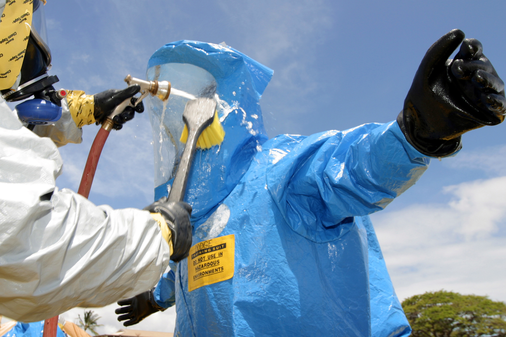
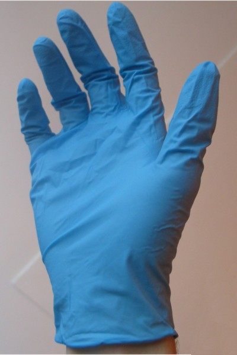
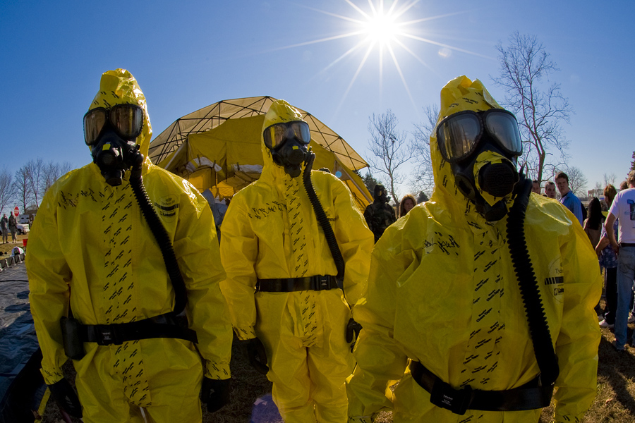

# Hazardous Materials & Contamination

## Read this first (the 30-second version)
1. **If a chemical is on skin or in an eye: get contaminated clothing OFF immediately, then flush with plain water for 15–20 minutes.** Removing clothing alone removes most of the contamination — don't waste time hunting for a "special" solution first.
2. **If you smell something dangerous, taste metal/chemicals in the air, or see people suddenly collapsing nearby, get out or seal a room — don't wait to be sure.** Move crosswind and uphill/upwind from the source, away from low ground where heavy gases pool.
3. **For a sudden outdoor chemical release you can't escape fast:** go inside, shut and lock windows/doors, turn off heating/air conditioning and fans, and seal gaps with wet towels or tape and plastic. This is "shelter-in-place." Switch to evacuation only when officials say it's safe to travel, or if the building itself becomes unsafe.
4. **For radiation/fallout ("get inside, stay inside, stay tuned"):** get inside the most massive building available, go to the basement or the most interior room, and stay there — official guidance is a minimum of 24 hours unless told otherwise. Radioactive fallout loses most of its danger within the first day.
5. **Never mix cleaning chemicals.** Bleach + ammonia and bleach + acid (vinegar, some toilet-bowl cleaners) both make **toxic gas** in a normal kitchen or bathroom. This kills people every year — treat it as an absolute rule, not a guideline.
6. **When in doubt, call for help the moment you can:** 911 for an active emergency, and **Poison Control at 1-800-222-1222** (US) for exposure/ingestion questions. This guide is for the gap before help arrives, not a replacement for it.

The rest of this guide explains recognition, decontamination, storage, shelter-vs-evacuate decisions, radiation basics, and PPE limits in detail, with more than one method for each so you always have a backup option.

---

## Why this matters
Most people will never face a military chemical attack, but nearly everyone will, at some point, be near a **household chemical accident**, an **industrial or transportation spill** (a tanker truck, a rail car, a nearby plant), or a **power/utility failure that damages containment** (a flooded chemical storage building, a fire releasing fumes). Unlike a cut or a burn, chemical and radiological harm is often **invisible while it's happening** — you can be absorbing a poison through your skin or lungs for minutes before symptoms appear, and by then the damage is set. The good news: a handful of simple, physical actions — **get it off you, flush it, don't mix things, get inside and seal up, keep distance and mass between you and danger** — handle the overwhelming majority of real-world household and community hazmat situations. You do not need a gas mask or a bunker; you need to know these actions cold, and to do them in the first minute, not after research.

## Key terms (plain language)
- **Hazmat (hazardous material)** — any substance that can harm health, safety, or property: industrial chemicals, fuels, pesticides, cleaning products, and radioactive material.
- **Contamination** — hazardous material physically present on a person, object, food, or water. Contamination is a *physical* problem (the stuff is there) — you deal with it by removing/diluting/blocking it, not by "waiting it out."
- **Exposure** — contact with a hazard through a **route of entry**: skin (absorption), lungs (inhalation), mouth (ingestion), or a wound (injection-like entry).
- **Decontamination ("decon")** — the process of removing contamination from a person, object, or area, most often by removing clothing and rinsing with water.
- **Corrosive** — a chemical that chemically burns/destroys tissue on contact (strong acids, strong bases like drain cleaner or bleach concentrate).
- **Volatile / off-gassing** — a chemical that evaporates into breathable fumes at room temperature (many solvents, fuels, ammonia).
- **Vapor density** — whether a gas is heavier or lighter than air. Heavier-than-air gases (like chlorine) sink and pool in low spots (basements, ditches, storm drains); lighter gases rise and disperse faster.
- **Shelter-in-place** — staying inside a sealed building rather than traveling through outdoor contamination.
- **Radiation** — energy given off by unstable ("radioactive") atoms. You cannot see, smell, or feel it — you only know it's present from detection equipment or from an official warning (e.g., after a nuclear plant incident or a nuclear detonation).
- **Fallout** — radioactive dust and debris that settles out of the air after a nuclear detonation, dangerous mainly through external exposure and if inhaled/ingested/left on skin.
- **Half-value layer** — the thickness of a given material that cuts gamma radiation passing through it roughly in half. More thickness = more halvings = much less radiation getting through (each added layer multiplies the reduction).
- **PPE (personal protective equipment)** — gloves, masks/respirators, goggles, and protective clothing that reduce (never eliminate) your exposure.
- **Placard** — the diamond-shaped hazard label required on trucks, rail cars, and storage tanks carrying regulated hazardous materials, with a UN number identifying the exact substance.

---

# PART 1 — RECOGNIZING A CHEMICAL EXPOSURE

Chemicals reach the body by three main **routes**, often at the same time:

| Route | How it happens | Typical warning signs |
|---|---|---|
| **Skin (absorption/contact)** | Splash, spray, contact with a contaminated surface or clothing | Burning, redness, itching, blistering, numbness, a chemical smell on skin/clothes |
| **Breathing (inhalation)** | Fumes, vapor, smoke, dust in the air | Coughing, choking, throat/nose burning, wheezing, shortness of breath, headache, dizziness, nausea, confusion |
| **Ingestion (swallowing)** | Contaminated food/water, hand-to-mouth contact, accidental drinking | Burns around the mouth, drooling, vomiting, abdominal pain, throat pain |

**Situational clues that a chemical release may be happening nearby** (react to any of these — don't wait for all of them):
- An unusual, strong odor: chlorine/pool-like, ammonia (sharp, sinus-burning), rotten eggs (often added to natural gas — see the [Electrical, Gas & Utility Safety guide](../electrical-gas-utility-safety/electrical-gas-utility-safety.md)), solvent/paint-thinner smell, or any smell strong enough to make your eyes water.
- A visible cloud, mist, or colored vapor, especially low to the ground or drifting from a truck, rail car, tank, or building.
- Dead insects, birds, or fish in an area with no other explanation.
- **Multiple people becoming ill at the same time in the same area** — this pattern (versus one person with a medical issue) strongly suggests an environmental cause. Treat it as a hazmat event: get people out and get help.
- Placards (diamond hazard labels) visible on an overturned or leaking vehicle, or on a nearby fixed tank.

> ⚠️ If your body starts giving you warning signs (burning eyes/throat, sudden headache, nausea, coughing) in a place that smelled fine minutes ago, **leave immediately** and get to fresh air. Don't stay to investigate the smell.

---

# PART 2 — IMMEDIATE RESPONSE TO SKIN & EYE EXPOSURE (DECONTAMINATION)

**The single most important fact in this entire guide: removing contaminated clothing removes most of the contamination.** CDC and HHS's Chemical Hazards Emergency Medical Management (CHEMM) program give a precise, sourced breakdown of exactly how much each step removes, and it holds for both chemical and radiological (fallout) contamination:
- **Removing outer clothing alone: up to ~90%** of the contamination gone, with zero water used.
- **Wiping exposed skin with a dry paper towel/wipe: another ~9%** — bringing you to roughly **99%** before you've touched a hose.
- **Showering/rinsing with water and drying off: brings total contamination down to ~99.9%.**

In other words, **clothing off is the single highest-value action in this entire guide** — it does more than the shower that usually gets all the attention. Do it first, every time, even before you have water ready.


*Figure — A survey team member is washed down in a decontamination line during a weapons-of-mass-destruction training exercise (US Navy, Pearl Harbor, 2003). This shows the sequence in practice: contaminated outer layer already removed, now a head-to-toe water rinse. Source: Wikimedia Commons (File:US Navy 030522-N-3228G-005...), US Navy photo by PH1 William R. Goodwin, public domain (US government work).*

## The core rule, in order
1. **Get away from the source** (move to fresh air / away from the spill) if you safely can.
2. **Remove contaminated clothing immediately** — see Method 1 below for how.
3. **Flush the affected skin/eyes with plain water** for **15–20 minutes minimum**, longer for anything corrosive (strong acid or base) or if pain continues.
4. **Bag the clothing**, don't just drop it on the floor (Part 2C).
5. **Get medical help** — call 911 or Poison Control (1-800-222-1222) as soon as you can, and follow their guidance; tell them the substance name if you know it.

## Method 1 — Full-body decon with running water (best option: hose, shower, or outdoor spigot)
**What it does:** Physically washes the chemical off skin and hair before it can be absorbed or continue burning.

**You need:** a hose, shower, or bucket of clean water; mild soap if available; a change of clean clothes; large plastic bags for the contaminated clothes.

**Steps:**
1. **Cut clothing off rather than pulling it over the head** whenever the substance may be on the front of the body — pulling contaminated fabric over the face can drag the chemical across eyes, nose, and mouth. Scissors or a knife along a seam works; don't waste time with buttons.
2. Set the bagged, cut clothing aside immediately (Part 2C) — don't let it touch clean skin, other people, or furniture.
3. Stand under running water (shower, hose, or have someone pour from a bucket) and rinse **from head down**, so runoff carries the chemical away from unaffected areas, not across them.
4. Use mild soap and lukewarm water if available — **don't scrub hard**; vigorous scrubbing can push some chemicals deeper into skin or break skin open. A gentle wash is enough.
5. Keep rinsing for **at least 15–20 minutes**. For anything you know is strongly corrosive (drain cleaner, industrial acid/base, unknown chemical with visible burning), keep flushing longer and get medical care regardless of how it looks afterward — corrosive burns keep damaging tissue until fully diluted and removed.
6. Pat dry with a clean towel (don't rub) and dress in clean, uncontaminated clothes.
7. Watch for delayed symptoms over the next hours (redness, blistering, breathing trouble) and seek medical care if anything develops or worsens.

## Method 2 — Eye flush (do this immediately for any eye exposure)
**What it does:** Dilutes and washes out the chemical before it can damage the cornea; the eye is thin, sensitive tissue and reacts fast.

**Steps:**
1. If the person wears contact lenses and they can be removed in a few seconds without extra delay, remove them; otherwise don't waste time chasing lenses — start flushing.
2. Tilt the head to the side with the **affected eye down and outward**, so contaminated runoff doesn't flow into the other eye or down the face.
3. Hold the eyelid open with clean fingers and pour a **gentle, steady stream of clean water or saline** across the eyeball from the inner corner (near the nose) outward, continuously.
4. Continue for **15–20 minutes minimum** — set a timer; it feels like a long time and people stop too early. For a corrosive chemical, flush longer.
5. Don't rub the eye. After flushing, seek medical evaluation — chemical eye injuries can look better than they are.

**No sink/eyewash station?** A clean water bottle with a thin stream, a garden hose on gentle flow, or someone slowly pouring from a cup all work — the key is a **continuous gentle stream for the full time**, not a single splash.

## Method 3 — No running water available (bucket/wipe/"dry" decon)
**What it does:** Gets most of the contamination off when a hose or shower isn't available, or when cold weather makes wet decon dangerous (hypothermia risk).

**Steps:**
1. **Still remove clothing first** — this step alone does most of the work and needs no water at all.
2. If you have any water (even a small bottle or canteen), pour it over the skin repeatedly, wiping with a clean cloth between pours and using a fresh section of cloth each wipe (a contaminated cloth reused on clean skin spreads the chemical back around).
3. **True dry decon (no water at all, or freezing conditions):** blot — don't rub — exposed skin with an absorbent dry material: a clean cloth or paper towel, or a fine absorbent powder like flour, baby powder, or oatmeal, which soaks up oily/liquid contaminants; then brush/wipe the powder off. This is a stopgap, not a substitute for water and soap the moment they're available.
4. In cold weather, balance the risk: getting a chemical off quickly matters, but a soaking-wet person outdoors in freezing temperatures can develop hypothermia fast — get the person somewhere warm and dry immediately after decon, and warm dry decon (Method 3) may be safer than an outdoor hose in winter. See the [Clothing & Footwear Protection guide](../clothing-footwear-protection/clothing-footwear-protection.md) for cold-injury prevention once decon is done.

## Method 4 — Helping someone else
1. **Protect yourself first** — gloves if available, and position yourself upwind/uphill of the contaminated person so you're not standing in fumes or runoff.
2. Let the person remove their own clothing if they're able; assist only what's necessary, and avoid bare-hand contact with contaminated fabric.
3. Get them to water fast — for a corrosive chemical, seconds matter more than modesty or shelter; rinse in place if that's faster than moving them.
4. Once decon and immediate first aid are done, follow the burns/chemical-exposure guidance in the [First Aid guide](../first-aid/first-aid.md) and [Emergency Medicine & Herbal guide](../emergency-medicine-herbal/emergency-medicine-herbal.md) for wound care, and call 911/Poison Control.

## Part 2C — Handling and bagging contaminated clothing
1. **Cut clothing off** rather than pulling it over the head (Method 1, step 1).
2. Place it directly into a **plastic bag** (a garbage bag works), avoiding contact with your skin, and **double-bag** it — one bag inside another, each sealed with a knot or tape.
3. Label the bag "**CONTAMINATED**" with a marker, and keep it **outside the living space and away from HVAC air intakes** until you know what it was exposed to and how to dispose of it safely.
4. **Wash your hands** thoroughly after handling the bag, even if you wore gloves.
5. Don't put a bag of unknown industrial chemical contamination in with regular household trash — if the substance is unknown or clearly industrial, contact your local hazmat/fire department or household hazardous-waste program for disposal guidance once things have stabilized. Clothing exposed only to a common household cleaner can usually be laundered separately (extra rinse cycle, away from other laundry) once flushed and aired out.

> ⚠️ **Time matters more than perfection.** A fast, "good enough" decon in the first minute beats a "perfect" decon that starts ten minutes late. Get clothes off and water flowing — refine everything else afterward.

---

# PART 3 — HOUSEHOLD CHEMICAL HAZARDS & SAFE STORAGE

Most hazmat exposure that ordinary households actually face isn't an industrial disaster — it's **their own cleaning products, pesticides, and fuel**, mishandled or mixed.

## The #1 rule: never mix cleaning chemicals
| Mix | Produces | Symptoms |
|---|---|---|
| **Bleach (sodium hypochlorite) + ammonia** (glass cleaner, some floor cleaners, urine) | **Chloramine gas** | Coughing, chest pain, shortness of breath, fluid in the lungs in severe cases |
| **Bleach + acid** (vinegar, some toilet-bowl cleaners, rust removers) | **Chlorine gas** | Burning eyes/throat, coughing, breathing difficulty — can be fatal in an enclosed bathroom |
| **Hydrogen peroxide + vinegar** | Peracetic acid (corrosive irritant) | Skin/eye/respiratory irritation |
| **Different drain cleaners together** | Unpredictable violent reactions, heat, gas | Splashing, burns, gas release |

**The safe rule:** use one cleaning product at a time, rinse the surface with plain water between different products, and **never** combine bleach with anything except plain water. If you accidentally create fumes: leave the room immediately, open windows/doors if you can do so quickly on your way out, and don't go back in until it's fully ventilated (many minutes to hours, and longer in a small bathroom).

## Common household hazards and safe storage
- **Bleach and other chlorine products:** store away from ammonia-containing products and acids; original container, capped tightly, away from heat.
- **Drain cleaners, oven cleaners, some toilet-bowl cleaners:** often strongly acidic or basic (corrosive). Store upright, original container, away from kids/pets, never decant into an unlabeled bottle.
- **Pesticides/herbicides:** keep in original labeled containers only — **never** in a drink bottle or unmarked jar (a leading cause of accidental poisoning). Store in a locked shed or cabinet **separate from the house**, away from any well, cistern, or water source, and away from food storage. Follow label mixing/application instructions exactly; more is not more effective and increases exposure risk to people, pets, and groundwater.
- **Fuel (gasoline, propane, kerosene):** store only in approved, labeled containers, in a detached, ventilated structure (not an attached garage if avoidable, never in the living space), away from any ignition source (water heater pilot light, outlets). Keep quantities small. See the [Electrical, Gas & Utility Safety guide](../electrical-gas-utility-safety/electrical-gas-utility-safety.md) for gas-leak-specific guidance.
- **General storage habits:** keep chemicals in their original, labeled containers so you (and first responders) always know what they are; store acids and bases on separate shelves; keep all household chemicals out of reach of children and away from anything used for food or drinking water; do a periodic check for old, leaking, or unlabeled containers and dispose of them at a household hazardous-waste collection event rather than the trash or a storm drain.
- **How professional household-hazardous-waste (HHW) collection sites organize storage** (a useful model to copy at home, per EPA guidance): **oxidizers** (pool chemicals containing hypochlorites, fertilizers containing nitrates) are kept **separate from all other chemicals and from each other**; **reactives** (ammunition, water-reactive chemicals) are kept **separate from everything else**; containers are kept **closed at all times**, labeled with contents and the date you acquired them, stored **off the ground** but at or below eye level (so a leak is visible and a fall doesn't happen from a high shelf), with enough space between containers that a leak or spill from one can't reach another. Applying the same logic in a garage or shed — closed containers, labeled, incompatible categories physically separated, nothing stacked precariously overhead — prevents most home chemical-storage accidents before they start.

> ⚠️ If a chemical is ingested, **do not induce vomiting** unless a poison control specialist or medical professional tells you to — for corrosive substances, vomiting can cause a second burn on the way back up. Call **Poison Control (1-800-222-1222)** or 911 first and follow their instructions exactly.

---

# PART 4 — INDUSTRIAL / TRANSPORT ACCIDENT AWARENESS: SHELTER-IN-PLACE VS. EVACUATE

Hazmat isn't only in your kitchen — tanker trucks, rail cars, pipelines, and fixed industrial tanks move and store chemicals through and near most communities. You will rarely know the exact chemical involved, but the response pattern is consistent.

## Recognizing a transport/industrial release
- A crashed or leaking tanker truck or rail car, especially with visible vapor, liquid pooling, or an unusual smell.
- A **placard** (diamond-shaped label) on the vehicle or tank — a 4-digit UN number identifies the specific substance to responders using the DOT Emergency Response Guidebook. You don't need to identify it yourself; **note the number if you can do so safely from a distance** and report it to 911 — don't approach to read it.
- A siren, reverse-911 call, or emergency alert naming a "shelter-in-place" or "evacuation" order for your area — always follow official instructions over general guidance in this book, since responders know the specific chemical and wind conditions.

## Deciding: shelter-in-place or evacuate?
This is the same decision framework covered in the [Emergency Planning & Triage guide](../emergency-planning-triage/emergency-planning-triage.md) — this section adds the hazmat-specific mechanics.

**General rule:** if the release is nearby, sudden, and you cannot immediately and safely put distance between yourself and it (e.g., it's already outside your door), **shelter-in-place first** — sealing a room is faster and safer than driving through a contaminated area. If you have clear advance warning and time to leave before the plume/spill reaches you, **evacuate** — moving away from a hazard entirely beats sheltering next to it.
- **Move crosswind, upwind, and uphill/upstairs** from the source if you must move outdoors — never walk or drive directly downwind (fumes travel with the wind) or through low ground, ditches, or storm drains (heavy gases pool there).
- Close car windows and shut off outside air/recirculate cabin air if driving away from a release.
- **Always follow official evacuation or shelter orders** the moment you receive them, even if they contradict your own read of the situation — officials have wind, chemical, and monitoring data you don't.

## How to shelter-in-place (seal a room) for a chemical release
**What it does:** Creates a barrier of still air between you and an outdoor chemical cloud until it disperses or officials give the all-clear.

**You need:** an interior room, ideally **above ground level** (many industrial/hazardous gases are heavier than air and sink into basements and low areas — pick an upper floor if the release is a heavy gas; for radiological fallout the opposite applies, see Part 5), plastic sheeting or large trash bags, duct tape, wet towels, a battery or hand-crank radio.

**Steps:**
1. Get everyone (and pets) inside quickly; if outside, wipe off/decon before entering if the substance is on you (Part 2).
2. Choose an interior room with as few windows and doors as possible, above ground level if practical.
3. **Turn off** heating, air conditioning, and any fans or vents that pull outside air in. Close the fireplace damper.
4. **Seal**: close and lock windows and doors; tape plastic sheeting over windows, vents, and door frames; stuff a wet towel along the bottom of the door.
5. Bring water, any medications, a phone, and a battery/hand-crank radio into the room with you.
6. **Stay tuned** to local news/radio/official alerts for the all-clear or evacuation order; don't leave the sealed room to "check outside."
7. When officials say it's safe, ventilate the house thoroughly (open windows, run fans) before resuming normal activity.

```
        SEALED SHELTER-IN-PLACE ROOM (chemical release)
   ┌───────────────────────────────────────────┐
   │  Interior room, upper floor if heavy gas   │
   │                                             │
   │   [door] ← wet towel along bottom gap      │
   │   [window] ← taped plastic sheeting        │
   │   [vent] ← taped shut                      │
   │                                             │
   │   HVAC OFF · fans OFF · fireplace closed   │
   │   people + pets + water + radio inside     │
   └───────────────────────────────────────────┘
        Wait for official "all clear" — then ventilate.
```

---

# PART 5 — RADIATION BASICS (kept simple)

Radiation is invisible and easy to feel intimidated by, but the practical response for an ordinary person rests on **three simple principles** used by every radiation safety program in the world:

## Time, Distance, Shielding
1. **Time** — the less time you spend near a radiation source, the less dose you receive. Get away and get inside as quickly as possible; don't linger to look.
2. **Distance** — radiation intensity drops off sharply with distance (roughly with the square of the distance — doubling your distance cuts exposure to about a quarter). This inverse-square rule is a simplification that holds cleanly for a small, single (point) source; real fallout is spread over the ground across a wide area, so the drop-off with distance is less dramatic than the simple formula suggests — distance still helps, just don't expect a clean "double the distance, quarter the dose" result outdoors after a real fallout event. Put as much distance as you safely and quickly can between yourself and a known source or a fallout-affected area.
3. **Shielding** — dense, thick material absorbs radiation. Concrete, brick, earth, and water all block far more radiation than wood or drywall. **More mass between you and the source = more protection.**

## The rule for a nuclear detonation or major radiological release: "Get inside, stay inside, stay tuned"
1. **Get inside** the nearest sturdy building immediately — a car offers very little shielding; a building (especially with a basement or interior core) offers much more.
2. **Stay inside** — official guidance for fallout after a nuclear detonation is a minimum of **24 hours** in shelter, longer if instructed. Fallout radioactivity decays fast at first: a widely used rule of thumb ("the rule of sevens") is that radiation levels drop to about **1/10th** after 7 hours, about **1/100th** after 2 days (7×7 hours), and about **1/1000th** after about 2 weeks (7×7×7 hours) compared to the level 1 hour after the event. This means the **most dangerous period is the first several hours**, and staying sheltered through that window matters enormously.
3. **Stay tuned** — use a battery or hand-crank radio (don't count on cell networks or the internet) for official instructions on when it's safe to move, whether to evacuate, and where to go.

> ⚠️ You cannot see, smell, or feel radiation. Never assume an area is safe just because it looks normal — rely on official announcements and, if you have one, a radiation detection device, not on your senses.

## If you are caught outdoors during the detonation itself (the first seconds)
This is the moment before "get inside" — the blast flash, wave, and heat arrive in seconds, before you could reach shelter even if you tried. Ready.gov's nuclear-explosion guidance is specific about this window:
1. **If you see a sudden, intense flash of light, take cover immediately** — do not stop to look at it (the flash can cause temporary blindness or eye damage). Get behind or under anything solid: a wall, a vehicle, a ditch, furniture.
2. **Lie face down** to protect exposed skin from heat and flying debris, and cover your head and neck with your arms or clothing.
3. **If you're driving, stop the car safely and duck down inside it** rather than trying to keep driving to a building — a moving vehicle in a blast wave is dangerous, and the vehicle still gives some protection from flying debris even though it is a poor radiation shield.
4. **After the blast wave passes** (seconds, not minutes), get up and get inside the nearest, most substantial building immediately — this is when "get inside" begins.
5. **You usually have a real window before fallout itself arrives at ground level** — often **more than 15 minutes** for areas outside the immediate blast-damage zone, per FEMA/Ready.gov guidance. That's enough time to reach the best shelter location you identified in advance (basement or the middle of a large multi-story building) rather than diving into the nearest flimsy structure — but don't wander or delay to be choosy; move with purpose to the best shelter you can reach quickly.
6. **Outdoor areas, vehicles, and mobile homes do not provide adequate shelter** from fallout radiation once it arrives — they are a bridge to get you moving, not a place to wait out the 24-hour sheltering period.

> ⚠️ Never stop to view a bright flash or a mushroom cloud, and never go outside to look after an explosion you weren't caught in — flying debris, heat, and later fallout are all invisible dangers layered on top of the visible ones.

## Radioactive contamination vs. radiation exposure (a useful distinction)
- **Exposure** to radiation (like an X-ray) doesn't make you radioactive.
- **Contamination** means radioactive particles (dust, ash, debris) are physically on your skin, clothes, or in the environment — and this **can be washed off**, the same way chemical contamination can. If you've been in a fallout-affected area: remove outer clothing (this alone removes most surface contamination, per Part 2), and wash exposed skin and hair with soap and water, avoiding harsh scrubbing that could break skin.

---

# PART 6 — SIMPLE FALLOUT-SHELTER PRINCIPLES

If you must remain sheltered for hours or days after a radiological event, focus on **mass** and **position**:

- **Go to the interior, and go down.** A basement is far better than a ground floor, which is far better than a top floor near the roof. If there's no basement, the most interior room, away from all exterior walls, windows, and the roof, is next best — surrounding rooms and floors act as shielding mass between you and outside fallout.
- **More surrounding material is better.** A below-ground shelter under a multi-story building (with floors of material above and around you) shields far better than a single-story house with no basement.
- **Rough rule-of-thumb "halving thickness" for gamma radiation** (approximate — actual shielding varies with the type and energy of radiation; the point is *relative*, not exact): roughly **half an inch of lead**, about **an inch of steel**, roughly **2.2–2.4 inches of concrete**, about **4 inches of packed earth**, roughly **7 inches of water**, or about **9–11 inches of wood** each cut incoming gamma radiation roughly in half. Achievable, ordinary shielding is more protective than it might sound — a few feet of earth or a couple of concrete walls stack up several halvings fast. **Stacking layers multiplies the effect** — this is why "get underground, in the middle of a big building" works so well: you're stacking many halving-layers of dirt, floors, and walls between you and the fallout outside.
- **Use what you have:** stack books, filled water containers, packed earth, or bagged sand around a shelter space (a basement corner, an interior closet) to add mass on the side facing outside/upward.
- **Cover stored food and water** before and during a fallout event — sealed containers keep fallout dust out (Part 7).
- **Don't rush outside** to check on things — fallout is most dangerous when freshly deposited; every hour sheltered before venturing out reduces your dose substantially per the rule of sevens above.

---

# PART 7 — CONTAMINATED FOOD AND WATER

Chemical or radiological contamination of food/water is a **physical** problem — the contaminant is either on the outside of something (can be washed/wiped off) or has soaked into it (usually cannot, so discard).

## What's generally safe
- **Sealed, factory-packaged cans and jars:** the contents are protected; **wash and sanitize the outside** of the container with soap and water (wipe down surfaces exposed to chemical residue or fallout dust) before opening, and dispose of any outer paper label that was directly contaminated.
- **Water in sealed, capped containers** (bottled water, a sealed cistern or tank): safe on the outside contamination front; wipe the cap/opening before opening.
- **Fallout dust settling on a covered water source:** once settled, the dust stays mostly at the surface — draw water from **below the surface**, avoiding stirring up the settled layer, or let it settle longer and skim/filter it out (see the DIY filter method in the [Water guide](../water/water.md)). Filtering removes fallout particles physically; you still need normal disinfection (boiling, bleach, etc. — see the Water guide) for any biological contamination, since fallout removal and germ-killing are two separate jobs.

## What to discard
- Any food in **permeable packaging** — cardboard boxes, plastic wrap, bags, unsealed jars — that was directly exposed to a chemical spill, chemical fumes settling as residue, or fallout dust. These can't be reliably decontaminated; the safer call is to throw them out.
- **Fresh produce, uncovered food, or open containers** exposed to a chemical release or fallout — wash thoroughly with clean water if you choose to try to salvage firm produce with intact skin (like a whole potato or an orange you'll peel), but when in doubt, discard.
- **Any water from an open, uncovered source** (an open barrel, pond, or cistern with the lid off) after a nearby chemical release — treat as contaminated and find another source (Water guide, Part 1).

> ⚠️ If you're unsure whether food or water is safe after a hazmat event, the safer choice is always to discard/find another source rather than risk ingestion — you can replace food and water; you can't easily undo poisoning.

---

# PART 8 — PPE BASICS (WITH HONEST LIMITS)

Household PPE buys you **minutes of reduced exposure to get away or finish a task** — it is not a substitute for leaving a dangerous area, and beginners should not use it as a reason to stay in a hazardous atmosphere.


*Figure — A disposable nitrile glove, the realistic level of household PPE most people actually have on hand. Good for splash/contact protection with common cleaners; not a substitute for a real chemical-rated glove against solvents or fuels. Source: Wikimedia Commons (File:Disposable nitrile glove.jpg), public domain.*


*Figure — Hazardous-material decontamination operators in full protective suits with M40 field protective masks, awaiting patients during a mock nuclear-attack exercise (US Air Force, Muscatatuck Urban Training Center, 2009). This is what real, complete chemical/radiological PPE looks like — full-body suit, sealed respirator, and gloves as one integrated system. **No ordinary household owns this or is trained to use it correctly** — the honest point of this photo is to show the gap between "a dust mask and some gloves" and what actually stops a hazardous atmosphere. Source: Wikimedia Commons (File:091108-F-8594F-797 (4100783730).jpg), US Air Force photo by Benjamin Faske, public domain (US government work).*

| Item | What it actually protects against | Real limits |
|---|---|---|
| **Nitrile/rubber gloves** | Splashes of many household chemicals, blood/body fluids, mild solvents | Thin household gloves degrade fast against strong solvents/fuels; check the glove's chemical-resistance chart if handling anything industrial; replace if torn, swollen, or discolored |
| **N95 (or similar) mask** | **Particles only** — dust, fallout particulate, some biological aerosols | **Does NOT protect against gases or vapors** — chlorine, ammonia, carbon monoxide, fuel fumes, chemical vapors all pass straight through. Also doesn't seal well against facial hair. See the [Fire, Smoke & Air Emergencies guide](../fire-smoke-air-emergencies/fire-smoke-air-emergencies.md) for air-quality/smoke specifics |
| **True respirator (half-face/full-face with cartridges)** | Specific gases/vapors **only if fitted with the correct cartridge** (organic vapor, acid gas, etc.) and properly fit-tested | Wrong cartridge = no protection at all; an untrained person often can't tell if a cartridge is exhausted; **most households don't own one or know which cartridge they'd need** — don't rely on improvising this for an actual toxic gas release |
| **Goggles (sealed)** | Splashes and vapors reaching the eyes | Ordinary glasses do **not** seal and offer little protection against splash or vapor |
| **Improvised barriers** (rain poncho/garbage bag as a splash apron, duct tape at wrists/ankles, rubber boots) | Brief splash/contact protection while moving through or escaping a contaminated area | Buys minutes, not sustained protection; not airtight, not chemical-rated — use to **get out**, not to **stay in** |

**The honest bottom line:** if you smell or suspect a genuinely toxic gas (chlorine, ammonia, unknown industrial fumes) and you don't have a properly fitted respirator with the correct cartridge, **your real PPE is distance** — get out of the area or seal a room (Part 4), don't improvise a mask and remain. Reserve gloves/goggles/masks for the parts of this guide where you're handling contaminated clothing, wiping surfaces, or doing decon on someone else — not for standing inside a gas cloud.

---

# North Texas / Collin County specifics

- **Transportation corridors:** US-75, the Dallas North Tollway extension, and US-380 carry regular truck traffic near Anna/McKinney, and BNSF/Union Pacific rail lines run through the region — both routinely move regulated hazmat (fuel, industrial chemicals, agricultural chemicals). A rollover or derailment is the most likely local "industrial/transport" hazmat scenario. Note placard numbers only from a safe distance and report to 911; do not approach.
- **Rural/agricultural chemical storage:** many Collin County properties store bulk fertilizer, herbicide, and pesticide in outbuildings — apply the Part 3 storage rules (original containers, locked/separate shed, away from wells and stock ponds) especially seriously here, since well and pond water contamination directly threatens drinking water covered in the [Water guide](../water/water.md).
- **Regional nuclear awareness:** the nearest commercial nuclear power plant to the DFW area is Comanche Peak (near Glen Rose, roughly 90+ miles southwest) — a serious incident there is a low-probability, high-consequence event; if one ever occurred, follow official emergency alerts exactly (they would specify shelter-in-place vs. evacuation routes) rather than improvising.
- **Heat:** North Texas summers are long and hot — sealing a room for shelter-in-place (Part 4) with HVAC off can get uncomfortably hot fast; prioritize getting the seal done first, then manage heat (fans running only if the room is otherwise sealed from outside air, water to drink, light clothing) — don't compromise the chemical seal to cool off unless heat illness becomes the bigger immediate danger.
- **Storms and flooding:** flash flooding can carry chemical storage buildings, fuel tanks, or agricultural chemical sheds into floodwater — after a flood, treat any standing water as potentially chemically contaminated in addition to the sewage contamination covered in the Water guide, and inspect any home chemical storage that was submerged (discard anything the flood reached — labels and containers may be compromised even if not visibly damaged).

---

# ⚠️ Safety — the most important warnings
- **Never mix cleaning chemicals** — bleach + ammonia and bleach + acid both produce toxic gas in an ordinary bathroom or kitchen. This is the single most common way ordinary households create a hazmat emergency for themselves.
- **Clothing off, then water, in that order, within the first minute** — don't delay decon looking for a "proper" solution; plain water and speed beat a perfect method applied late.
- **Don't induce vomiting after swallowing a chemical unless told to by Poison Control or a medical professional** — corrosive substances can burn twice.
- **N95/dust masks do not stop gases** — don't mistake particle protection for gas protection.
- **Never enter a sealed, low, or enclosed space (basement, tank, cellar, storm drain) where a heavy gas may have pooled** without ventilating first and having a way to be pulled out — heavy gases can silently displace breathable air.
- **Don't drive or walk downwind, downhill, or through low ground near a chemical release** — move crosswind/upwind/uphill instead.
- **You cannot detect radiation with your senses** — rely on official alerts, not on how the air "looks" or "feels."
- **When sheltering from fallout, staying inside for the first many hours matters most** — the temptation to go check on things early is exactly when radiation is at its worst.
- **When in doubt, get out and call for help** — 911 for an active emergency, Poison Control (1-800-222-1222) for exposure questions. This guide bridges the gap before help arrives; it does not replace professional hazmat response.

# Troubleshooting
| Problem | Fix |
|---|---|
| Chemical on skin, no hose or shower available | Remove clothing first (does most of the work alone); pour any available water repeatedly while wiping with a clean cloth (Method 3); seek water/medical help ASAP |
| Chemical in eye, no eyewash station | Tilt head, affected eye down/out, pour clean water or a water bottle across it continuously for 15–20 min; don't rub; seek medical care after |
| Accidentally mixed bleach with another cleaner and smell fumes | Leave the room immediately, don't go back to "clean it up," ventilate fully once safe, seek fresh air/medical help if you inhaled fumes |
| Smell chemical fumes outside but can't tell where from | Move crosswind and uphill away from the smell, get inside, call 911 to report it, don't investigate the source yourself |
| Not sure whether to shelter or evacuate | If the hazard is already close/sudden and you can't get clear of it quickly, seal a room now; if you have real advance warning and a clear escape route, leave before it arrives; always follow official orders once issued |
| Only cardboard/plastic-wrapped food available after a spill or fallout event | Discard it — permeable packaging can't be reliably decontaminated; rely on sealed cans/jars (wipe the outside first) instead |
| No true respirator and a toxic gas is present | Do not improvise a mask and remain — leave the area or seal a room; PPE here is distance, not gear |
| Contaminated clothing but no plastic bags | Use any sealable container, or set clothing far outside the living space away from people/pets/HVAC intake until proper bagging/disposal is possible |
| Caught outdoors when a sudden bright flash/explosion happens (possible nuclear detonation) | Take cover immediately, lie face down, cover head/neck with arms — don't stop to look at the flash; once the blast wave passes (seconds), get up and move to the best shelter you can reach quickly; you typically have 15+ minutes before fallout arrives |

# Quick-reference checklist
- [ ] Recognized the exposure route (skin, breathing, ingestion) and warning signs.
- [ ] Got contaminated clothing off first — cut rather than pulled overhead.
- [ ] Flushed affected skin/eyes with plain water for 15–20+ minutes.
- [ ] Bagged contaminated clothing (double-bagged, labeled, kept away from living space).
- [ ] Checked household chemicals are stored safely and never mixed (bleach ≠ ammonia/acid).
- [ ] Decided shelter-in-place (seal a room, HVAC off) vs. evacuate (move crosswind/upwind/uphill), and followed any official order.
- [ ] Applied time-distance-shielding for radiation; if fallout is possible, got inside, went to the interior/basement, and stayed tuned to a battery/hand-crank radio.
- [ ] If caught outdoors during a detonation itself: took cover, lay face down, covered head/neck, then moved to the best shelter once the blast wave passed (before fallout arrives, typically 15+ minutes).
- [ ] Treated sealed containers as safer than open/permeable packaging for food and water after any contamination event.
- [ ] Used PPE (gloves, goggles, N95, improvised barriers) only for its real limits — not as a reason to remain in a toxic atmosphere.
- [ ] Called 911 and/or Poison Control (1-800-222-1222) as soon as reachable.

# Sources & further reading (in this knowledge base)
- **US Army Survival Manual FM 21-76** — `reference/manuals/fm21-76_survival_manual.pdf` (general hazard response and field first aid principles).
- **FEMA "Are You Ready?" Guide** — `reference/manuals/are-you-ready-guide.pdf` (hazmat, radiological, shelter-in-place, and evacuation guidance).
- **American Red Cross Preparedness Guide** — `reference/manuals/redcross_preparednessguide.pdf` (household chemical safety and disaster preparedness).
- **CDC Emergency Preparedness Foundations** — `reference/manuals/cdc_emergency_foundations.pdf` (decontamination and public health emergency guidance).
- **Urban Survival Guide** — `reference/manuals/Urban_Survival_text.pdf` (industrial/urban hazard awareness).
- **FEMA/Ready.gov "Be Prepared for a Nuclear Explosion" information sheet** — `reference/manuals/ready_nuclear_explosion_infosheet.pdf` (get inside/stay inside/stay tuned, the immediate-detonation moment, fallout timing, shelter-location selection).
- **EPA Household Hazardous Waste (HHW) Transfer Station Quick Start Guide** — `reference/manuals/epa_household_hazardous_waste.pdf` (professional storage-separation logic — oxidizers, reactives, closed/labeled containers — behind the household storage rules in Part 3).
- **CDC / HHS CHEMM (Chemical Hazards Emergency Medical Management)** — decontamination effectiveness percentages (clothing removal, wiping, showering); cited by URL (chemm.hhs.gov/decontamination_bak.htm; cdc.gov/radiation-emergencies) since the source PDFs are not distributable offline.
- See also: [Fire, Smoke & Air Emergencies](../fire-smoke-air-emergencies/fire-smoke-air-emergencies.md) (air filtration, clean-air rooms, CO, smoke), [Electrical, Gas & Utility Safety](../electrical-gas-utility-safety/electrical-gas-utility-safety.md) (gas leaks), [Water](../water/water.md) (making drinking water safe), [First Aid](../first-aid/first-aid.md) and [Emergency Medicine & Herbal](../emergency-medicine-herbal/emergency-medicine-herbal.md) (chemical burns/poisoning treatment), and [Emergency Planning & Triage](../emergency-planning-triage/emergency-planning-triage.md) (the general shelter-in-place vs. evacuate decision framework).
