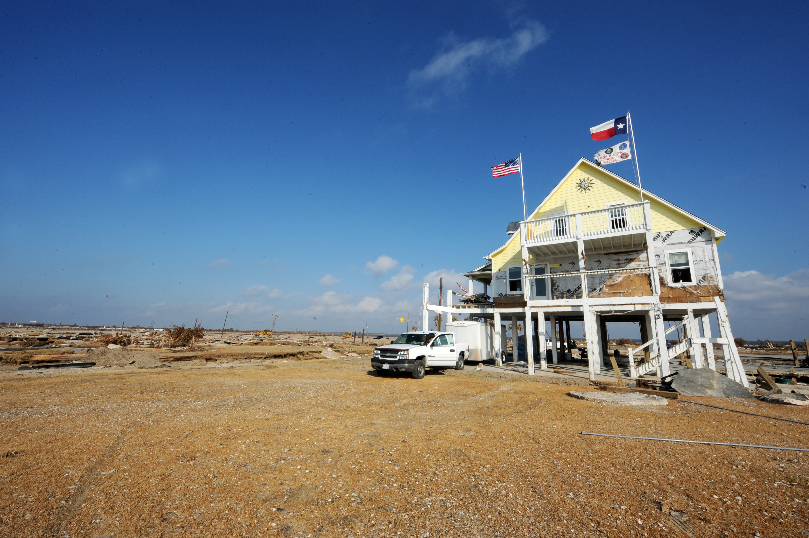
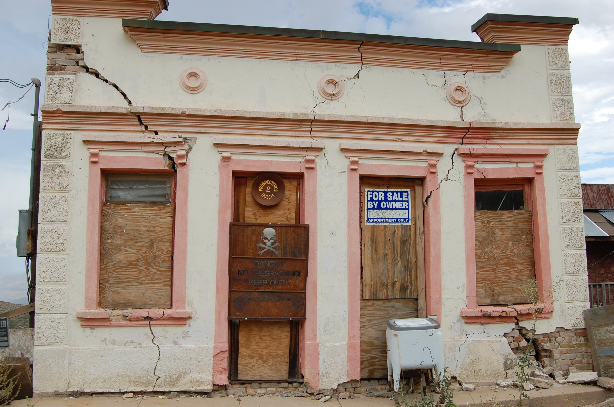
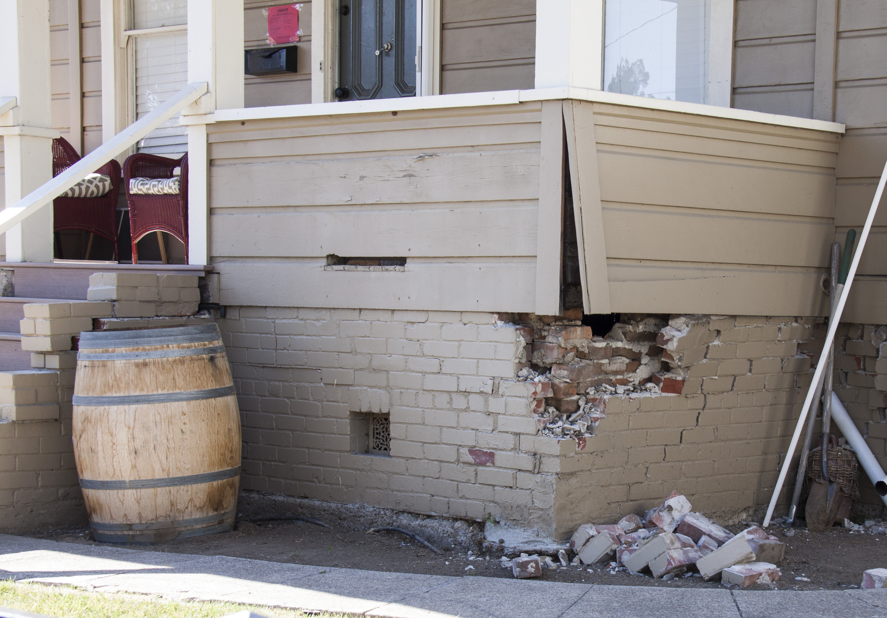

# Home & Structural Assessment After a Disaster

## Read this first (the 30-second version)
1. **Look before you walk.** From a safe distance, scan the whole outside of the house: is it leaning, twisted, or sitting differently than before? Any gas smell? Any wires down on or near it? **If yes to any of these, do not go in — call 911 or the utility and wait for a professional.**
2. **If it looks basically intact, walk the outside first, then the inside**, room by room, always with an exit path behind you.
3. **Know the collapse red flags:** a **sagging or bulging ceiling**, a **leaning wall**, a **foundation that has visibly shifted or dropped**, or a **roof ridge that isn't straight**. Any one of these means **get out and stay out** until a professional says otherwise.
4. **Small cracks are usually fine; wide, new, growing, or horizontal cracks are not.** When in doubt, mark the crack, watch it, and treat it as serious until proven otherwise.
5. **Stabilize, don't rebuild.** Tarps over roof holes and plywood over broken windows are meant to keep weather and further damage out for days to weeks — not to fix the structure.
6. **When you're not sure, don't guess — get a professional or official inspection.** This guide teaches you to catch obvious danger and buy time, not to replace an engineer.

The rest of this guide walks you through a full, systematic inspection in a safe order, explains what separates a cosmetic crack from a dangerous one, teaches emergency roof tarping and window boarding step by step, and gives you a clear framework (modeled on the "green/yellow/red" system professionals use) for deciding whether to occupy a damaged building.

---

## Why this matters
After a tornado, hurricane, earthquake, flood, ice storm, or fire, the building that kept you safe can itself become the danger. Structures that look standing can have a cracked foundation, a roof deck barely held up by damaged rafters, or a wall pushed out of plumb — and they can fail suddenly, without warning, especially during aftershocks, high wind, heavy rain, or when someone adds weight (walking on a damaged floor, water pooling on a sagging roof). Every year people are killed or seriously hurt not by the original disaster but by re-entering a compromised building, walking under a sagging ceiling "just to grab something," or getting near a downed line or gas leak they didn't recognize. A slow, methodical walk-around — done in the right order, from the outside in, looking for specific warning signs — is what separates a homeowner who protects their family from one who becomes a second casualty of the same storm.

## Key terms (plain language)
- **Structural element** — a part of the building that holds it up: foundation, load-bearing walls, framing (studs, rafters, joists), and the roof deck. Damage here is dangerous. Damage to *non-structural* things (drywall, paint, gutters, fences) is usually just repair work, not a safety emergency.
- **Load-bearing wall** — a wall that helps hold up the roof or the floor above. Removing or badly damaging one can cause collapse. (If you're not sure which walls are load-bearing, assume any wall could be until told otherwise.)
- **Foundation** — the base the house sits on: a concrete slab, a crawlspace with a perimeter footing, or a full basement.
- **Settlement** — normal, slow sinking/shifting of a foundation over years as soil compresses. Old, stable, hairline cracks are usually settlement, not disaster damage.
- **Racking** — a building twisted out of its square shape (often by wind or seismic force), which shows up as doors/windows that no longer close and diagonal cracks.
- **Plumb** — perfectly vertical. A wall that is "out of plumb" is leaning.
- **Placard** (green/yellow/red tag) — a physical sign or sticker a trained inspector puts on a structure after a disaster, using the real-world **ATC-20** rapid-evaluation system: **green = INSPECTED** (no apparent structural hazard found — this does *not* mean undamaged, just apparently safe to occupy), **yellow = RESTRICTED USE** (damage limits occupancy to specific areas, times, or purposes noted on the tag itself), **red = UNSAFE** (continued occupancy poses a threat to life safety — entry is prohibited for any reason, including to grab belongings, unless the building official gives written authorization). This guide teaches you to make your own **provisional** version of that judgment before an official arrives — an official placard, once posted, always controls over your own read.
- **Egress** — a way out. Always keep one clear and known before you go further into a damaged structure.
- **Sagging / bulging** — a ceiling or roof deck curving downward or ballooning, usually from water weight or broken framing. A strong sign of imminent collapse.

---

# PART 1 — BEFORE YOU GO NEAR THE STRUCTURE

Do this entire part **from a distance**, before you set foot on the property if possible, and definitely before you walk up to or touch the building.

```
        SCAN THE WHOLE OUTSIDE FROM A SAFE DISTANCE FIRST
                          │
      ┌───────────────────┼────────────────────┐
      ▼                   ▼                    ▼
 Leaning / twisted    Smell of gas /       Nothing obviously
 building, roofline   hissing sound /      wrong from a distance
 not straight,        downed wires on             │
 house shifted off    or near structure            ▼
 its foundation             │              Proceed to PART 2 —
      │                     │              the walk-around
      ▼                     ▼              inspection
   STOP.                 STOP.
 Do not enter.        Do not enter, don't
 Call a building      flip switches or use
 official or          a phone/lighter near
 structural           the house. Move
 engineer.            everyone upwind and
                       away, then call 911
                       or the gas/power
                       utility from a
                       safe distance.
```

1. **Look at the whole silhouette.** Compare the roofline, walls, and chimney to how you remember them (or to an undamaged neighboring house of similar design). A roof ridge that dips, a wall that leans, or a house that looks twisted or shifted relative to its foundation are all reasons to stop and get a professional before going any closer. Per **FEMA P-234, "Repairing Your Flooded Home,"** the specific exterior checks that matter most are: is the building shifted off its foundation, is the foundation itself visibly cracked or damaged, is the building "racking" (twisted out of square rather than square and plumb), is any part of the building actually missing or crushed, and is the roofline out of position — any one of these means stop and get a professional opinion before going closer, let alone inside.

   
   *Figure — A house left standing on the Bolivar Peninsula (Gilchrist, TX) after Hurricane Ike, September 2008, surrounded by slabs where neighboring homes were swept away. It's a real-world reminder of the "compare the silhouette, don't assume from the street" rule: this exact scenario is discussed again in the North Texas section — tornado and flood damage paths can be this uneven, so assess your own structure independently of what happened next door. Source: Wikimedia Commons (File:FEMA - 38879 - House survives Hurricane Ike in Texas.jpg), Jocelyn Augustino/FEMA Photo Library, public domain (US federal government work).*
2. **Smell and listen before you approach.** A rotten-egg smell or a hissing sound near the house or gas meter means a possible gas leak. **Do not** go in, flip any switch, ring a doorbell, or use a phone or lighter near the building — any spark can ignite gas. Move everyone well away and upwind, and call 911 or your gas utility from a safe distance. Full gas-leak response steps are in [Electrical, Gas & Utility Safety](../electrical-gas-utility-safety/electrical-gas-utility-safety.md).
3. **Look for downed power lines** on, near, or draped across the structure, fences, or trees touching it. **Treat every downed or hanging wire as live**, even if it looks dead, is on the ground, or is on a "de-energized" pole — power can be restored remotely without warning. Stay at least 35 feet (about 10 m, roughly a school-bus length) back, keep others away, and report it. Immediate shutoff and downed-line procedures are in [Structural, Utility & Household Emergencies](../structural-utility-emergencies/structural-utility-emergencies.md) and [Electrical, Gas & Utility Safety](../electrical-gas-utility-safety/electrical-gas-utility-safety.md) — this guide only covers spotting the hazard during your walk.
4. **Check the ground and surroundings** for sinkholes, washed-out soil, leaning trees or power poles that could still fall, standing floodwater (which can hide holes, debris, downed wires, or contamination), and pooling gas/fuel smells from a damaged tank or vehicle.
5. **If everything above is clear**, proceed calmly and deliberately to the systematic walk-around in Part 2. Bring a flashlight (even in daytime — interiors may be dark), sturdy closed-toe boots, thick work gloves, and a phone. Tell another person where you're going and set a time to check in.

> ⚠️ If ANY of the following are true, do not enter under any circumstances until a professional or official has cleared the building: gas smell, downed wires touching the structure, visible leaning/shifting of the whole building, or a part of the structure has already partially collapsed.

---

# PART 2 — THE SYSTEMATIC WALK-AROUND INSPECTION

Work in this order every time: **outside first, all the way around, then inside**, and always room to room with a clear path back to your exit. Never go into a room alone with no one aware of where you are. Carry a flashlight, and mark problem spots with tape, chalk, or a photo (useful later for insurance — see [Documents, Money & Emergency Administration](../documents-money-admin/documents-money-admin.md)) as you find them rather than trying to remember everything.

## 2A. Foundation
Walk the entire visible perimeter of the foundation (slab edge, crawlspace vents, or basement walls).

**Cosmetic / usually not urgent:**
- Thin, hairline cracks (thinner than a credit card, roughly under ⅛ inch / 3 mm) running mostly **vertically**, especially near corners of window/door openings — very common shrinkage cracks, especially in newer concrete or in clay-soil regions (see North Texas section).
- Old cracks with dirt, paint, or caulk already inside them (they've clearly been there a while and haven't changed).

**Serious — treat as a red flag:**
- **Horizontal cracks** running side to side across a foundation wall — this can mean the wall is being pushed in/bowing from soil or water pressure and may be failing structurally. Unlike vertical cracks, **even a hairline horizontal crack deserves prompt professional attention** — width matters less here than direction, because it usually signals the wall is being pushed inward, not just shrinking.
- **Stair-step cracks** in brick or block foundations that follow the zig-zag of the mortar joints, especially if wider at one end than the other (a "trapezoid" gap) — a sign of uneven settlement, one corner of the house sinking faster than the rest, or lateral movement.
- Any crack **wider than about ¼–⅜ inch (6–10 mm)**, or one you can fit a pencil or coin edge into. As a rule of thumb: under ⅛ inch is usually cosmetic, ⅛–¼ inch should be watched, and anything wider than ¼ inch warrants a professional look regardless of direction.
- A crack that is clearly **new** (bright, clean edges, no dirt/paint inside) or that you can watch **growing** — mark each end with a pencil line and the date, or put a strip of tape across it (a taped "witness mark" that snaps or a pencil line the crack grows past is the low-tech version of the crack monitors/tell-tales a professional would install); check again in a day. Widening tape/marks = active movement = serious.
- **White, chalky mineral deposits (efflorescence)** or damp staining right at or around a crack — a sign water has been moving through it, which both indicates the crack is or was open all the way through the wall and can accelerate further damage over time.
- The whole foundation visibly **out of level, sunken on one side, or separated from the walls** above it (a gap you can see daylight or insert fingers into).
- Doors and windows that suddenly stick, won't latch, or have new gaps — this often shows up first as a foundation/framing problem, not a door problem.


*Figure — A real, open structural crack in a building wall caused by ground settlement/subsidence, showing how a serious crack tends to be wide, continuous, and clearly follow the direction of movement rather than staying hairline-thin. Compare its width and directness against the "cosmetic vs. serious" tests above before deciding whether a crack you find is a watch-it or a call-a-professional situation. Source: Wikimedia Commons (File:Cracked building in Jerome.jpg), Tobyc75, CC BY-SA 3.0.*

```
VERTICAL CRACK           HORIZONTAL CRACK           STAIR-STEP CRACK
(often cosmetic)         (serious — wall bowing      (often settlement —
                          or failing)                 follow the mortar)
     │                     ───────────────              ___
     │                                                  |   |___
     │                     (crack runs side               |___|   |
     │                      to side, may bow                   |___|
     │                      inward)                    (zig-zags with
                                                          the brick/block
                                                          joints)
```

## 2B. Walls (interior and exterior)
- **Bowing or leaning:** stand back and sight down the wall, or hold a level/straight board against it. A wall that bulges outward or leans is a structural concern, not cosmetic — especially in a basement wall (soil/water pressure) or an exterior wall after wind load.
- **Large diagonal cracks**, especially running from the corners of doors and windows toward the ceiling — a classic sign of racking (the building twisted out of square) from wind or seismic force.
- **Separation**: a gap where a wall meets another wall, the ceiling, or the foundation — daylight visible through a corner, or a wall that has visibly pulled away.
- **Sound and feel**: tap along drywall/plaster — a hollow, different sound in one area than the rest can mean water damage or a break behind the surface. Damp, soft, or spongy drywall is both a water-damage and (if it's a load path) a possible structural concern.
- **Crumbling or cracked mortar** in brick/block walls, especially combined with bulging — mortar failure lets a wythe of brick separate from the structure behind it.

## 2C. Roof and ceiling — the highest collapse risk
This is the single most dangerous area to get wrong. **Never walk under, or into a room below, a ceiling that is sagging, bulging, stained and heavy-looking, or making cracking/creaking sounds.** Water-soaked insulation and drywall can weigh many times its dry weight and can let go with no further warning.

- **From outside:** does the roofline (the ridge, the peak) run straight, or does it dip/sag anywhere? A sagging ridge means the rafters or trusses underneath may be broken or overloaded. Look for missing sections, visible holes, tarps already blown off, or a section that looks lower than the rest.
- **From inside, on the top floor:** look at the ceiling. **Brown/yellow water stains** mean water got into the attic or roof structure — even if the ceiling looks flat today, saturated insulation and wet framing above it can still fail. A ceiling that **sags, dimples, or bulges downward**, or drywall that looks swollen, is telling you it is holding weight it isn't designed for — **leave that room immediately and keep others out** until it's professionally assessed or safely dried and confirmed sound.
- **Attic access (only if the ceiling below showed no sag/stain and you feel the floor is solid):** if you can safely open an attic hatch, shine a light in — do you see daylight through the roof deck, wet or sagging insulation, water stains on the rafters, or broken/split rafters? Don't put your weight anywhere except directly on the ceiling joists (walking between them can put a foot through the ceiling).
- **Listen.** Cracking, popping, or creaking sounds from a roof or ceiling under load (rain, standing water, or snow) is not "settling" — it's a warning. Get everyone out from under it immediately.

> ⚠️ A sagging or bulging ceiling can collapse with no further warning, sometimes hours or days after the storm that caused it, especially if it rains again or someone adds weight (attic storage, walking, standing water). Treat it exactly like a leaning wall: get out, keep out, mark it, and get a professional to assess before anyone re-enters that space.

## 2D. Broken glass and debris
- Broken glass, splintered wood, and downed drywall/insulation are the most common cause of cuts and puncture wounds during a walkthrough. Wear thick-soled boots (not sandals or sneakers) and heavy gloves before you go further.
- Sweep or carefully clear a path before walking through a room rather than stepping over debris — hidden nails, glass shards, and sharp metal (roofing, siding, appliance edges) are common and often invisible under dust or in low light.
- Don't lean ladders or metal tools against gutters, downspouts, or siding near any point where a wire could be touching the structure.
- If a room is more debris than floor, treat it as unsafe to cross casually — clear a narrow, deliberate path rather than walking freely.

## 2E. Signs of water intrusion
Water damage is both a health hazard (mold, contamination) and, if severe, a structural one (saturated framing, weakened drywall/subfloor).
- Staining, discoloration, or peeling paint on ceilings and walls, especially in patterns that run downhill from a roof or window.
- A musty or "wet basement" smell — often present before visible staining shows up.
- Warped, buckled, or spongy flooring; swollen baseboards or door frames; drywall that has visibly bulged or crumbled at the bottom (a classic sign of a flood that has since receded).
- Visible **mud/water lines** on walls showing how high a flood reached.
- Dampness you can feel by hand on interior walls, especially near the floor or around windows/roof penetrations.
- This guide only covers *spotting* these signs as part of the safety walk-through. Full drying, mold-prevention timelines, and cleanup steps are in [Water, Flooding & Plumbing Emergencies](../water-flooding-plumbing/water-flooding-plumbing.md); the broader cleanup/mold/insurance arc is in [Recovery & Rebuilding](../recovery-rebuilding/recovery-rebuilding.md).

## 2F. Spotting electrical hazards during the walkthrough
You are looking, not touching or testing.
- Scorch marks, melted plastic, or a burning smell around outlets, switches, or the breaker panel.
- Sparking, buzzing, or a panel/outlet that got wet or was underwater — **do not touch or reset anything that was submerged**; it needs a professional inspection before it's used again.
- Exposed or frayed wiring anywhere, especially where a wall or ceiling has been damaged.
- Water pooling near or dripping onto outlets, the breaker panel, or any electrical fixture.
- If you find any of these, don't touch switches or outlets in that area and don't try to reset a breaker for a circuit you suspect is damaged. Full detection detail, shutoff steps, and "when it's safe to reset vs. when to call an electrician" are in [Electrical, Gas & Utility Safety](../electrical-gas-utility-safety/electrical-gas-utility-safety.md).

## 2G. Spotting gas leaks during the walkthrough
- Rotten-egg smell (an additive called mercaptan, put in odorless natural gas specifically so it can be smelled) or a hissing sound near appliances, the meter, or a wall.
- Dead or discolored vegetation in an otherwise healthy area, or bubbling in wet soil, near a buried gas line — an outdoor sign of an underground leak.
- A pilot light that won't stay lit, or an unusual flame color, on a gas appliance.
- If you notice any of these: **leave immediately, don't flip any switch or use a phone/lighter inside**, get everyone out, and call your gas utility or 911 from outside. Full leak response and how to shut off gas yourself are in [Electrical, Gas & Utility Safety](../electrical-gas-utility-safety/electrical-gas-utility-safety.md).

---

# PART 3 — TEMPORARY REPAIRS

The goal of a temporary repair is simple: **keep weather and further damage out for days to a few weeks**, until proper repairs or a professional can take over. Do not attempt roof work in the dark, in wind, in rain, or with lightning nearby — wait for a calm, dry window.

## 3A. Roof tarping, step by step
**You need:** a heavy-duty poly tarp (look for **"6-mil" or better**, meaning about 0.006 inch/0.15 mm thick; ordinary hardware-store blue tarps are typically a lighter 8×8 weave around this thickness, while reinforced/woven "silver" or "super-heavy-duty" tarps are thicker, hold up longer to sun and wind, and are worth the extra cost for anything you expect to leave up more than a few days), 2×4 lumber (or similar straight boards) to use as battens, exterior deck screws (2½–3 inch), a drill/driver, a stable extension ladder taller than the eave, work gloves, a utility knife, and — for steep or tall roofs — a roof harness anchored to the opposite slope or a ladder stabilizer. **Improvised substitutes:** heavy plastic sheeting or a large painter's tarp doubled up if a proper tarp isn't available (won't last as long); bricks/sandbags/bagged gravel instead of screws on a low-slope roof you'd rather not put more holes in.


*Figure — A house in Dorado, Puerto Rico with a blue tarp installed over storm-damaged roof sections after Hurricane Maria. This is the same style of covering used in the FEMA/U.S. Army Corps of Engineers **Operation Blue Roof** program (see below) — note the tarp is pulled taut and anchored well beyond the visible damage, the same principle taught in the steps below. Source: Wikimedia Commons (File:House with blue tarp after Hurricane Maria in Dorado, Puerto Rico.jpg), U.S. Army Corps of Engineers, South Atlantic Division, public domain (US federal government work).*

**Safety first:**
- Never do this alone, in the dark, in wind, in rain, or if lightning is anywhere nearby.
- If the ceiling below the damaged area already showed sagging or cracking sounds (Part 2C), **do not get on the roof** — the deck may not hold your weight. Call a professional.
- Wear rubber-soled shoes/boots, use a harness or have someone footing the ladder, and never step near a hole in the deck.

**Steps:**
1. **Assess from the ground and from inside first** — use binoculars to look at the damage from the ground, and check for water stains/daylight from inside the attic, before you ever climb up.
2. **Clear the area** around the damaged spot of loose debris (branches, torn shingles) so the tarp can lie flat.
3. **Measure and cut** the tarp so it extends at least 4 feet (1.2 m) beyond the damaged area on every side, and long enough to go **over the roof ridge (peak) and down the other side by at least 2 feet**. Anchoring over the ridge into undamaged roof lets you screw into sound wood instead of the damaged section.
4. **Wrap each edge of the tarp around a 2×4 batten** ("burrito-wrap" it) rather than screwing straight through bare tarp material — this spreads the load and keeps the screw from tearing through in wind.
5. **Fasten the ridge-end batten first**, screwing through the wrapped tarp into solid rafters/roof deck on the undamaged side of the peak.
6. **Pull the tarp taut down the slope** and fasten the bottom and side battens the same way, working from the top down, so each layer overlaps the one below it like shingles — this sheds water instead of trapping it.
7. **If you need more than one tarp**, overlap seams by at least 12 inches (30 cm), with the **higher piece on top of the lower piece** — never the reverse — so water runs over the seam, not under it.
8. **Check it after the next rain** from inside (attic and top-floor ceilings); tighten or re-tape edges that flap or lift.

**Low-slope / flat-roof alternative:** if you don't want more roof penetrations, weigh down the tarp's edges and folds with sandbags, tube sand, or bagged gravel instead of screws, making sure wind can't get under any edge.

**When NOT to DIY this:** the roof pitch is steep, the building is more than one story and beyond what a normal extension ladder safely reaches, you saw sagging/cracked framing from inside, there are downed power lines on or near the roof, or you're simply not confident on a ladder. Call a roofing or tarping professional. After a federally declared disaster, ask about **Operation Blue Roof**, a free U.S. Army Corps of Engineers program (run through FEMA) that sends a licensed contractor to install a **fiber-reinforced polypropylene/canvas/nylon sheet** — heavier-duty and longer-lasting than a homeowner-grade poly tarp — over an eligible storm-damaged roof at no cost to the homeowner. It only covers roofs made of materials the sheeting can be nailed to (standard shingles, etc.) — slate, clay tile, and asbestos-cement roofing generally aren't eligible because the installation itself would cause more damage. Ask your county emergency management office or check BlueRoof.gov after a qualifying disaster.

## 3B. Window boarding and covering
**You need:** exterior-grade plywood, at least ½ inch thick (⅝–¾ inch for larger openings), a tape measure, a saw (or have panels pre-cut to size), a drill, and wood screws (or masonry screws/anchors for brick openings) long enough to bite at least 1½ inches into solid framing or masonry — not just the window trim. **Improvised substitutes for light/interim weatherproofing only (not security or storm protection):** heavy contractor trash bags or plastic sheeting and tape to keep rain out of a broken pane until you can board it properly.

**Steps:**
1. **Put on cut-resistant gloves and eye protection** before touching any broken glass.
2. **Clear remaining glass from the frame.** Working from outside if possible, gently knock loose shards free so they fall away from you, or ease them out with a gloved hand; bag sharp glass separately and label it before it goes in the trash.
3. **Measure the full opening, including trim**, and cut the plywood to overlap it by 2–3 inches on every side so your screws land in solid wall framing, not just the window frame.
4. **Pre-drill screw holes** around the perimeter of the board, spaced every 12–16 inches (30–40 cm).
5. **Fasten the board** with screws biting at least 1½ inches into solid framing (use masonry screws/anchors if fastening into brick).
6. **For larger openings**, add a diagonal or "X" brace of furring strips across the board for extra wind resistance.
7. **Label each boarded window from inside** (tape and marker: room name) so family members and any responders understand the layout, and so you remember which rooms have lost their light source.

---

# PART 4 — SAFE DEBRIS REMOVAL

- **Wear PPE before touching anything:** sturdy closed-toe boots (steel-toe if you have them), thick work gloves, eye protection, and an N95 or better dust mask for dusty, moldy, or insulation-laden debris. Make sure your **tetanus vaccination is current** (within about 10 years, or sooner if you're injured and unsure) before doing debris work — punctures from nails and metal are common.
- **Lift with your knees, not your back**; get help for anything heavy or awkwardly shaped, and use a dolly, wheelbarrow, or tarp-drag instead of carrying when possible.
- **Test debris piles before committing your weight** — a pile can shift, hide a drop-off, or conceal broken glass, nails, or live wiring.
- **Watch for wildlife** displaced by the disaster hiding in debris piles — snakes, stinging insects, and rodents are common (see the North Texas note below).
- **Never cut into or pull apart debris that could be structural** (a fallen beam, a wall section) without knowing what it's still holding up — get a professional assessment first if you're unsure whether something is load-bearing debris or just wreckage.
- Sorting debris (vegetative, construction material, appliances, hazardous items) speeds up curbside pickup after a declared disaster; see [Recovery & Rebuilding](../recovery-rebuilding/recovery-rebuilding.md) for the full cleanup and disposal process — this section only covers doing it safely, not the full sorting/disposal system.

---

# PART 5 — THE DECISION FRAMEWORK: SHOULD YOU OCCUPY THIS STRUCTURE?

Professional inspectors after a major disaster use a fast "green/yellow/red" placard system (the real-world version is called **ATC-20 rapid evaluation**, originally written for earthquake-damaged buildings and now used after most kinds of disasters) to sort buildings quickly. You can use the same logic to make your own **provisional** call while waiting for an official one — but remember, your own read is a stopgap, not a substitute for a professional when there's real doubt.


*Figure — An actual ATC-20-style red "UNSAFE" tag posted on a home's door in Napa, CA after the 2014 earthquake — the crumbling foundation visible beside the door is exactly the kind of damage that earns a red tag. Once a tag like this is posted, it controls: don't re-enter for any reason, including to retrieve belongings, until an official changes it. Source: Wikimedia Commons (File:Napa, Calif., August 24, 2014 -- The red tag posted on this door means the building is unsafe... - DPLA), Eilis Maynard/FEMA, public domain (US federal government work).*

**🟩 GREEN — INSPECTED, apparently safe, no obvious restriction**
- No visible foundation shift or serious cracking; only cosmetic hairline cracks.
- Walls plumb, no bowing or large diagonal cracks.
- Roofline straight, no sagging/bulging ceilings anywhere.
- Doors and windows open and latch normally.
- No gas smell, no exposed/scorched wiring, no active water intrusion.
- **Provisional judgment:** livable while you complete cleanup and repairs; still get a professional look if you have any lingering doubt, especially after a major event.

**🟨 YELLOW — RESTRICTED USE, limited entry**
- Cracked but stable-looking foundation; some roof damage but rafters/trusses appear intact from inside; water intrusion present but no structural sag; a few isolated broken windows; utilities damaged but hazards controlled (gas/power already shut off).
- **Provisional judgment:** brief, limited entry only — avoid the specific damaged areas, don't let children, elderly, or mobility-impaired household members wander unsupervised, and don't sleep there overnight until it's been checked further. An official yellow tag will usually spell out exactly which areas, times, or purposes are restricted — treat your own "yellow" as the more cautious, whole-building version of that until you have specifics. Get a professional or official inspection before returning to normal, extended occupancy.

**🟥 RED — UNSAFE, do not enter**
- Leaning or out-of-plumb walls; visible foundation displacement or a building that's shifted off its footing; a sagging/bulging ceiling or roof; any partial collapse already visible; an unresolved gas leak; downed power lines touching the structure; large structural cracks in load-bearing walls.
- **Provisional judgment:** do not enter for any reason, including to retrieve belongings, until a licensed structural engineer or building/code official has inspected and cleared it. This mirrors the real ATC-20 rule: a red-tagged building may only be entered by the public with the building official's written authorization (trained safety-assessment teams are the exception). If people are already inside when you identify a red condition, get them out immediately and don't send anyone back in.

**If the structure already has an official placard** (a physical tag from a building inspector, fire marshal, or emergency management official), **that placard controls** — follow it regardless of what your own walk-around concluded, and don't attempt to override a red tag based on your own judgment. Note that a green "INSPECTED" tag does not certify the building is undamaged or guarantee it will survive another event — it only means no *apparent* structural hazard was found at the time of that inspection.

**When to call for a professional or official inspection, always:**
- Any red-flag condition from Part 2 (leaning walls, foundation displacement, sagging/bulging ceiling, large or growing cracks).
- Before resuming normal occupancy of anything you rated yellow.
- Any time your home was flooded above the electrical outlets or breaker panel.
- Any time you simply aren't sure — a structural engineer's inspection is far cheaper than a wrong guess.

---

# PART 6 — WALK-WITH INSPECTION CHECKLIST

Print or save this and carry it room to room. Mark each line ✔ (fine), ⚠ (watch/photo it), or ✘ (stop — red flag).

**Before approaching:**
- [ ] Building not leaning/twisted/shifted off foundation, viewed from a distance
- [ ] No gas smell or hissing sound
- [ ] No downed/hanging wires on or near the structure
- [ ] Ground around house free of sinkholes, washouts, standing floodwater

**Exterior walk (all the way around):**
- [ ] Foundation: crack type/width noted; any horizontal or stair-step cracks; any new/growing crack marked and dated
- [ ] Foundation level; no visible sinking or gap between foundation and wall above
- [ ] Walls plumb; no bowing, bulging, or large diagonal cracks
- [ ] Roofline straight; no sag, no missing sections, no visible holes
- [ ] Chimney plumb and intact
- [ ] Windows/doors intact or safely marked for boarding

**Interior walk (room by room, exit path always behind you):**
- [ ] Ceilings flat — no sag, bulge, stain, or cracking sounds (if any found: leave that room, mark door, keep everyone out)
- [ ] Attic (only if ceiling below was clear): no daylight through roof deck, no wet/broken rafters
- [ ] Walls plumb; no new large cracks; no hollow/soft spots when tapped
- [ ] Floors solid; no give, buckling, or soft spots
- [ ] Doors/windows open, close, and latch normally
- [ ] No scorch marks, melted plastic, or burning smell at outlets/panel
- [ ] No standing water or dripping near any electrical fixture
- [ ] No gas smell near appliances/meter; pilot lights normal
- [ ] Broken glass/debris cleared or marked before walking through

**Decision:**
- [ ] Overall provisional call: 🟩 Green / 🟨 Yellow / 🟥 Red
- [ ] If Yellow or Red: professional/official inspection requested and scheduled
- [ ] Photos taken of all damage before cleanup or repair (see [Documents, Money & Emergency Administration](../documents-money-admin/documents-money-admin.md))

---

# North Texas / regional notes (Anna, TX and Collin County area)
- **Blackland prairie clay soil** in this region shrinks in drought and swells when wet, which causes **slow, ongoing foundation cracking independent of any single disaster** — many area homes already have some hairline slab or foundation cracks from normal seasonal soil movement. This makes the "is this crack new?" test (mark it, date it, watch for growth) especially important here: don't assume every crack you find after a storm was caused by the storm, but don't dismiss a crack just because "this soil always cracks" either — a new, wide, or actively growing crack is still a red flag.
- **Tornadoes** in this area can produce very narrow, sharply-defined damage paths — one house can be missing its roof while the house next door has only minor shingle loss. Never assume your house is fine because the street looks fine, or unsafe because a neighbor's house was destroyed; assess your own structure independently.
- **Hail**, extremely common here, often causes damage that isn't obviously visible from the ground: granule loss on shingles, dented gutters/vents/AC units, and bruised (soft-spot) shingles that will leak later even though there's no hole today. This is a functional-damage/insurance issue more than a safety one — document it (see [Documents, Money & Emergency Administration](../documents-money-admin/documents-money-admin.md)) even if it doesn't change your occupancy decision.
- **Ice storms** add heavy loads to roofs and trees; a roof that held up in a summer thunderstorm can sag under an ice-and-fallen-limb load it wasn't built for — recheck ceilings after any ice event, not just wind events.
- **Slab-on-grade foundations** (common in newer North Texas construction) hide their framing under the slab, so foundation problems here show up as wall/door symptoms (sticking doors, new wall cracks) rather than a visible crawlspace — pay extra attention to Part 2A/2B's door-and-window clues.
- **Snakes and stinging insects** displaced by storms are commonly found in fresh debris piles in this region during warm months — always look before you reach into or lift debris by hand.
- After a federally declared Texas disaster, ask your county emergency management office about **Operation Blue Roof** availability for free temporary roof tarping.

---

# ⚠️ Safety — the most important warnings
- **Never enter a structure with a gas smell, downed wires touching it, or a visibly leaning/shifted frame.** Call for help and wait.
- **Never walk under or into a room below a sagging, bulging, or water-stained ceiling.** It can collapse with no further warning.
- **Treat every downed wire as live**, no matter how it looks or where it is.
- **A crack alone rarely tells the whole story** — width, direction (horizontal is worse than vertical), and whether it's new/growing matter more than its mere presence.
- **Don't rely on your own "green" call alone after a major disaster** — get a professional or official inspection whenever there's real doubt, and always follow an official placard if one has already been posted.
- **Don't put weight on a roof deck** if the ceiling below already showed sag, stain, or cracking sounds.
- **Wear proper PPE (boots, gloves, eye protection, dust mask) before touching debris or broken glass.**
- **This guide does not replace a structural engineer.** It teaches you to recognize danger and buy time safely, not to certify a building sound.

# Troubleshooting
| Problem | Fix |
|---|---|
| Not sure if a crack is old or new | Mark both ends with pencil/tape and the date; check again in 24–48 hours. No change = likely old/cosmetic; wider or longer = active and serious. |
| Ceiling looks stained but not sagging — safe to enter? | Treat any water-stained ceiling with caution; keep weight/time in that room minimal, watch for new sag, and get it checked before assuming it's fine long-term. |
| Can't tell if a wall is load-bearing | Assume it could be until confirmed otherwise; don't remove, cut into, or lean heavily on any damaged wall without professional input. |
| Roof damage but too high/steep to tarp safely | Weigh down a tarp over the hole from what you can safely reach, cover what you can from inside with plastic sheeting to slow leaks, and call a professional or ask about Operation Blue Roof. |
| Found a downed wire near the house | Stay back at least 35 ft, keep everyone else back, don't touch anything metal near it, and report it to 911 or the utility — do not attempt to move it yourself. |
| Broken window, no plywood available yet | Clear glass safely, tape a heavy contractor bag or plastic sheeting over the opening to keep weather out until you can board it properly. |
| House has an official red tag but "looks fine" to you | Follow the tag. Official placards are based on inspection details you may not be able to see or judge yourself — do not re-enter until it's changed by an official. |
| Debris pile looks like it might be hiding something structural | Don't pull on or cut it apart yourself — get a professional to assess before disturbing it. |

# Quick-reference checklist
- [ ] Scanned the whole exterior from a distance first — no leaning, no gas smell, no downed wires.
- [ ] Walked the outside foundation, walls, and roofline before going in.
- [ ] Checked every ceiling for sag/stain/bulge before standing under it.
- [ ] Marked and dated any cracks to watch for growth.
- [ ] Noted (not touched) any electrical or gas hazard signs.
- [ ] Wore boots, gloves, and eye protection before handling debris or glass.
- [ ] Made a provisional green/yellow/red call — and requested a professional/official inspection for anything yellow or red.
- [ ] Tarped any roof holes and boarded any broken windows, working top-down and shingle-style.
- [ ] Photographed all damage before cleanup or repair.
- [ ] Kept everyone out of any red-flagged area until cleared.

# Sources & further reading (in this knowledge base)
- **FEMA P-234, "Repairing Your Flooded Home"** — `reference/manuals/fema_p234_repairing_your_flooded_home.pdf` (the source for the outside-first structural check list in Part 1 — foundation shift, racking, missing/crushed sections, roofline out of position — plus flood-specific repair guidance).
- **American Red Cross, "Returning Home After a Hurricane or Flood" (checklist)** — `reference/manuals/redcross_returning_home_after_flood_hurricane.pdf` (a short, practical pre-entry and walk-through checklist consistent with Parts 1–2 of this guide).
- **FEMA "Are You Ready?" Guide** — `reference/manuals/are-you-ready-guide.pdf` (post-disaster safety and structural hazard awareness).
- **American Red Cross Preparedness Guide** — `reference/manuals/redcross_preparednessguide.pdf` (damage assessment and recovery basics).
- **US Army Survival Manual FM 21-76** — `reference/manuals/fm21-76_survival_manual.pdf` (shelter/structure fundamentals).
- **CDC Emergency Preparedness Foundations** — `reference/manuals/cdc_emergency_foundations.pdf`.
- **Urban Survival Guide** — `reference/manuals/Urban_Survival_text.pdf` (structural hazard awareness in populated areas).
- **Build Shelter Guide** — `reference/manuals/Build_Shelter_Guide.pdf` (structural basics referenced for repair context).
- **ATC-20, "Procedures for Postearthquake/Post-Disaster Safety Evaluation of Buildings"** (Applied Technology Council) — the professional standard behind the green/yellow/red (INSPECTED/RESTRICTED USE/UNSAFE) placard system described in Part 5. This standard is copyrighted by ATC and is referenced here in prose only (not reproduced or included as a file in this knowledge base).
- See also: [Structural, Utility & Household Emergencies](../structural-utility-emergencies/structural-utility-emergencies.md) (during-event shutoffs and first response), [Electrical, Gas & Utility Safety](../electrical-gas-utility-safety/electrical-gas-utility-safety.md) (deep electrical/gas hazard handling), [Water, Flooding & Plumbing Emergencies](../water-flooding-plumbing/water-flooding-plumbing.md) (drying out and mold prevention), [Recovery & Rebuilding](../recovery-rebuilding/recovery-rebuilding.md) (the fuller cleanup/recovery arc), [Documents, Money & Emergency Administration](../documents-money-admin/documents-money-admin.md) (insurance/FEMA documentation), and [Disaster-Specific Survival Guides](../disaster-specific/disaster-specific.md) (per-hazard before/during/after actions).
