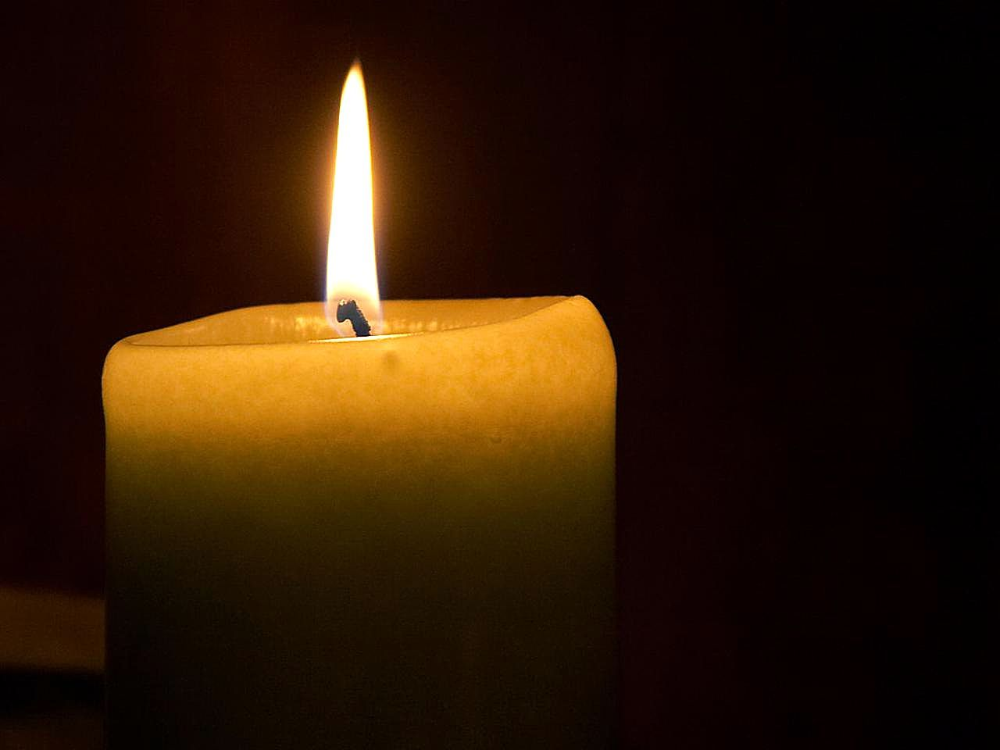
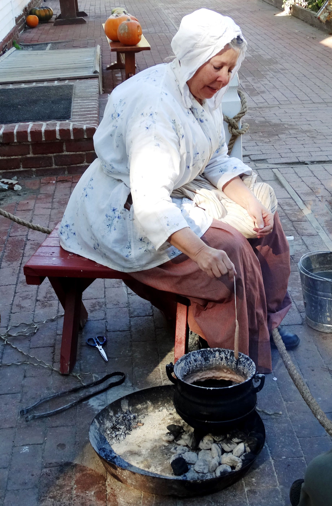
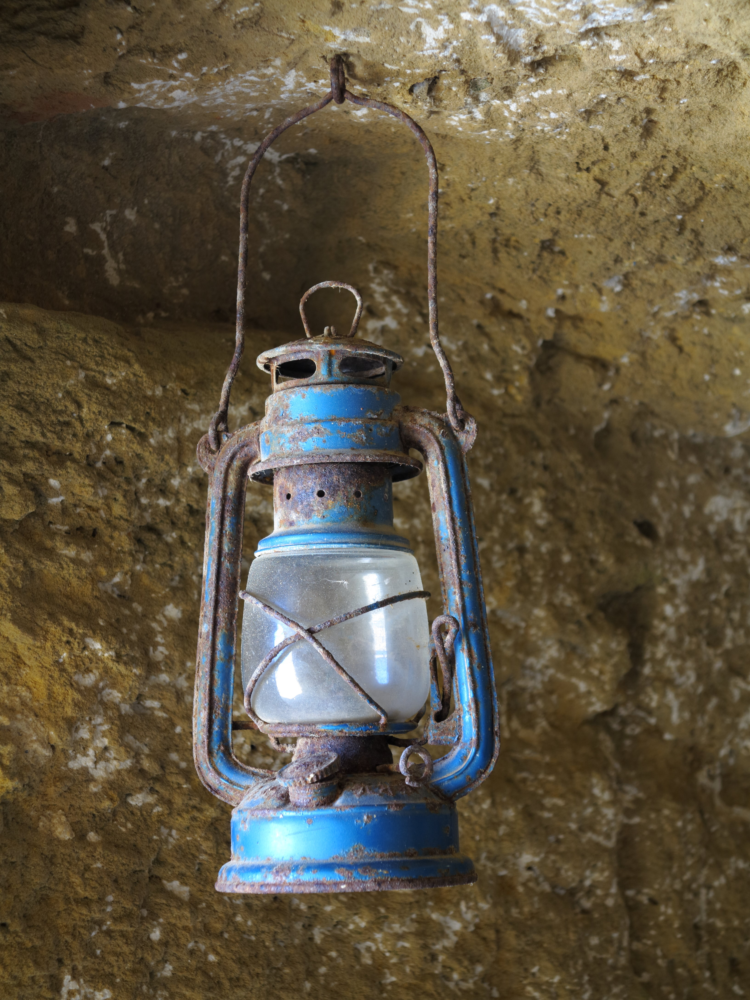

# Emergency Lighting — Candles, Oil Lamps & Improvised Light Without Power

## Read this first (the 30-second version)
1. **Light is not optional — it prevents falls, fires from fumbling in the dark, and panic.** But an open flame is also the single easiest way to burn your house down during an emergency. Every method below trades convenience for fire risk; manage that risk on purpose.
2. **Fastest safe option if you have ANY oil or shortening in the kitchen:** float a cotton-string wick (held up by a foil disc or washer) in a jar with 1–2 inches of cooking oil. It burns for hours, won't flare, and uses stuff you already have.
3. **Never leave any open flame unattended — not even for a minute — and never take one into a bedroom to fall asleep with it lit.** This single rule prevents most home candle-fire deaths.
4. **Never burn anything (candle, lamp, or shortening can) in a sealed room with no airflow.** Flames consume oxygen and produce carbon monoxide (CO); crack a window or door.
5. **Never use gasoline, camp-stove fuel (white gas), or lighter fluid in an open-wick lamp or candle** — they're far too volatile and can flash or explode. Stick to oils, fats, wax, kerosene, or purpose-made lamp oil.
6. **Keep flames 12+ inches from anything that can burn, on a stable non-flammable surface, out of reach of kids and pets, and always have a way to smother it (metal lid, sand, baking soda) within reach.**

The rest of this guide gives you **candle-making** (four wax types), **oil lamps** (five build variants), and several **zero-prep improvised lights**, so you always have more than one option — plus the fire-safety rules that matter most when the light source is a live flame in a dark house.

---

## Why this matters
When the power goes out, darkness itself becomes a hazard: people trip on stairs, cut themselves fumbling for tools, can't find medication, and — very commonly — burn themselves or their house down trying to make light. Emergency lighting also does real work beyond just "seeing": it lets you keep doing tasks (cooking, first aid, childcare, repairs), it makes children and anxious adults calmer, and it lets you spot hazards (a gas smell, a flooding floor, an intruder) before you step in them. The trade-off is that the simplest, most available forms of backup light — candles and oil lamps — are open flames, and **home candle fires and fatalities spike sharply during power outages**, because people who don't normally use candles suddenly rely on them, place them carelessly, and fall asleep with them burning. This guide exists to give you good light **and** keep you from becoming a fire statistic while getting it. For light that doesn't involve fire at all (batteries, solar, hand-crank, rechargeable power stations), see the [Power & Energy guide](../power-energy/power-energy.md) — that should be your first choice whenever you have it; treat everything in this guide as what you do when batteries and electric light have run out.

## Key terms (plain language)
- **Wick** — the string or cord that draws melted wax or liquid fuel up to the flame by capillary action (like a paper towel soaking up water) and controls how the fuel burns.
- **Capillary action** — the way a liquid climbs up a narrow fiber or gap against gravity; this is how a wick "pulls" fuel to the flame without you having to pump it.
- **Priming a wick** — pre-soaking a raw cotton wick in melted wax before use, so it lights easily and burns evenly instead of just burning like plain string.
- **Tunneling** — when a candle burns a narrow hole straight down the middle and leaves solid wax untouched on the sides, wasting most of the candle. Usually means the wick is too small for the candle's diameter.
- **Flash point** — the lowest temperature at which a liquid's vapors can ignite. Low flash point (gasoline, camp fuel, alcohol) = very easy to flare up or explode; high flash point (kerosene, vegetable oil, tallow) = safer for a slow open-wick lamp.
- **Tallow** — rendered (melted and strained) fat from cattle or sheep; a traditional candle and lamp fuel. See the [Livestock guide](../livestock-animal-husbandry/livestock-animal-husbandry.md) for rendering instructions.
- **Rendering** — melting raw animal fat and straining out the solid tissue, leaving clean fat (tallow or lard) behind.
- **Rushlight** — a strip of dried plant pith (traditionally the rush plant) dipped in fat and burned instead of a candle; the low-tech ancestor of the candle.
- **Chimney (lamp)** — the glass tube around an oil lamp's flame that improves airflow (draft), making the flame brighter and steadier and protecting it from wind or drafts.
- **CO (carbon monoxide)** — an invisible, odorless, poisonous gas produced by any burning flame, worse in an unventilated space. See the [Fire, Smoke & Air Emergencies guide](../fire-smoke-air-emergencies/fire-smoke-air-emergencies.md).

---

# PART 1 — MAKING CANDLES

Candles store a lot of light-hours in a small, stable, spill-proof package — the fuel (wax) is solid at room temperature, so a candle can't leak or tip over and pour fuel everywhere the way a liquid lamp can. The trade-off is that making a good one takes some care with the wick size and fuel choice.

## 1A. Choosing your wax

| Wax | Where it comes from | Burn quality | Difficulty | Notes |
|---|---|---|---|---|
| **Paraffin** | Petroleum by-product; sold as "canning wax" or slab candle wax at grocery/craft stores | More smoke/soot than beeswax or soy; cheap and widely available | Easiest — melts ~130–150°F (54–65°C), forgiving | Best first wax to learn on |
| **Beeswax** | Rendered honeycomb/cappings — see the [Beekeeping guide](../beekeeping/beekeeping.md) | Brightest, cleanest-burning, longest-lasting, natural honey smell, very little soot | Harder — high melting point (~145–150°F/63–66°C), needs a bigger wick | Best result, most work to source |
| **Tallow / lard** | Rendered animal fat — see the [Livestock guide](../livestock-animal-husbandry/livestock-animal-husbandry.md) | More smoke and odor than beeswax; smokier if not well-clarified | Moderate — needs rendering and double-straining first | The traditional "everyone had it" survival candle wax |
| **Soy wax** | Soybean oil, hydrogenated; sold as container-candle wax | Clean-burning, low soot, but very soft — melts easily so it needs a container, won't stand freely as a taper | Easy — low melt point (~120°F/49°C) | Good for jar/tin candles, not for pillars or tapers |

> ⚠️ **Never melt wax directly over an open flame or stovetop burner.** Wax has a flash point and can catch fire if it overheats — it behaves exactly like a **grease fire** if it ignites. Always melt wax in a **double boiler**: a smaller pot or a clean tin can sitting inside a larger pot of simmering water, so the wax never touches direct heat. **If wax catches fire, never use water** (it will splatter burning wax and spread the fire) — smother it with a metal lid, or use baking soda or a Class B/K extinguisher.

## 1B. Wicks — the part that actually matters most
A candle's wick size, more than the wax type, determines whether it burns well or badly.

**You need:** a wick. **Substitutes, in order of quality:** braided cotton candle wick (craft store) → 100% cotton string/twine (not synthetic — synthetics melt/melt into a bead instead of burning) → a cotton shoelace with the plastic tip cut off → torn strips of cotton cloth (old T-shirt, bandana) tightly twisted or braided into a cord → strands pulled from cotton twine/rope → a cotton ball twisted into a tight strand (short-burning, use for small candles/lamps only).

**Priming a wick (do this for any raw string):**
1. Cut the wick a couple of inches longer than you need.
2. Dip it fully into melted wax for 10–15 seconds, then pull it out straight and let it cool for a minute.
3. Repeat once more. A primed wick lights faster and burns more evenly than dry string.

**Sizing rule of thumb:**
- **Too thin a wick** → the flame stays small, wax on the sides never melts, and the candle **tunnels** down the middle, wasting most of the wax and burning out early.
- **Too thick a wick** → tall, flickering, sooty flame; wax pool spreads too fast; candle burns hot and fast and can become unsafe (flame over 1 inch/2.5 cm tall is too big).
- **General starting point:** a wick that's roughly a heavy sewing-thread-thickness braid works for a 3/4–1 inch (2–2.5 cm) diameter candle; go up one size for each additional inch of diameter, and go up **one size further** for beeswax or a **container** candle (the glass holds heat in, so it needs a hotter/bigger flame to melt out to the edges) compared with the same diameter in paraffin poured freestanding.
- **Test it:** burn a new candle for 1–2 hours. The melted wax pool should reach close to the edge by then without the flame growing tall or smoking. If it tunnels, next time use a larger wick; if it smokes/flares, use a smaller one.
- **Trim every wick to 1/4 inch (6 mm)** before each lighting — a long, untrimmed wick is the #1 cause of smoking, soot, and mushrooming (a carbon blob forming on the tip).

## 1C. Method — Dipping (best for tapers and rushlights, no mold needed)
**What it does:** builds up a candle in thin layers by repeatedly dipping a wick into melted wax.

**You need:** melted wax in a container tall and narrow enough to fully dip your wick length (a clean, tall can works well), a primed wick, and a way to cool it between dips (a bucket of cool water, or just air).

**Steps:**
1. Melt wax in a double boiler until fully liquid.
2. Dip the primed wick straight down into the wax, all the way, then pull straight out.
3. Let it cool 20–30 seconds (or dip briefly in cool water) until the coating is firm to the touch.
4. Dip again. Each layer adds a small amount of thickness.
5. Repeat 10–20+ times until the candle is your desired thickness (roughly 1/2–3/4 inch / 1.5–2 cm for a hand-dipped taper).
6. Hang to fully harden for a few hours before trimming the wick and burning.

**How to tell it worked:** the candle should be roughly the same thickness top to bottom and stand on its own. **If it didn't:** lopsided or drippy dips usually mean the wax was too hot (let it cool a bit between batches) or you didn't let each layer firm up before the next dip.

## 1D. Method — Pouring into a mold (best for pillars and standalone shapes)
**You need:** any heat-safe or disposable container as a mold — a clean tin can, a cut-down milk carton, a muffin tin, small paper cups, a section of PVC pipe standing on foil, or a metal cookie cutter on a foil-lined tray. A stick, skewer, or pencil laid across the top to hold the wick centered and straight. Modeling clay, hot glue, or a dab of melted wax to seal the wick hole if your mold has one at the bottom.

**Steps:**
1. Seal the wick's bottom exit hole (if any) from the outside so wax can't leak.
2. Tie the wick to the center of a stick laid across the mold's opening, so it hangs straight down the middle and just touches (or is a half-inch above) the bottom.
3. Melt the wax in a double boiler. Let it cool for about 10–15 minutes off the heat until it's just starting to look slightly less than fully clear (this reduces cracking and sinking).
4. Pour it into the mold slowly, leaving a little room at the top.
5. Let it cool **at room temperature** — don't put it in a fridge or freezer, which cools it unevenly and cracks it.
6. As it cools, a dip or "sink hole" often forms around the wick — after a couple of hours, poke a small hole near the wick and top it off with a little more melted wax.
7. Let it fully harden overnight before removing from the mold and trimming the wick to 1/4 inch.

## 1E. Method — Pouring into the final container (jar/tin candles; best for soy and tallow)
Good when your wax is soft (soy) or you don't want to un-mold it. Stick a wick tab (a small metal disc, a flattened bottle cap, or a folded scrap of foil) to the bottom center of a clean jar or tin with a dab of hot wax, tie the wick to a stick across the rim to keep it centered, pour in wax as above, let cool undisturbed, then trim. **Let any new candle cure (sit unburned) for 24–48 hours** before the first burn — this lets the wax fully set and improves burn quality.

## 1F. Rendering and clarifying tallow (for candle- or lamp-making)
Raw animal fat burns dirty; **clarified** (double-rendered) tallow burns much cleaner. Full rendering technique is in the [Livestock guide](../livestock-animal-husbandry/livestock-animal-husbandry.md); the short version:
1. Cut raw fat into small chunks and melt it slowly in a pot (low heat, never leave it unattended — rendering fat is itself a grease-fire risk).
2. Strain the melted fat through cheesecloth or a clean cotton cloth into a container, discarding the solid bits (cracklings).
3. Let it cool and solidify, then scrape off and discard any dark, watery, or gritty layer at the very bottom — that's where the impurities that cause smoke and odor collect.
4. Re-melt the cleaned fat once more and strain again for the cleanest burn (this second pass is what "clarified" means).

## 1G. Burn-time and brightness comparison
Actual numbers vary with wick size, wax, and drafts — use this as a planning guide, not an exact promise.

| Light source | Relative brightness | Typical burn time | Notes |
|---|---|---|---|
| Small tealight | Dim (reading up close only) | 4–5 hours | Cheapest, widely stockpiled |
| Standard taper (3/4 in / 2 cm dia.) | Moderate | ~1 hour per inch of height (7–10 hrs for a 10 in taper) | Classic dipped candle |
| Votive (2.5 oz / 70 g) | Moderate | 10–15 hours | Needs a holder — soft, will slump without one |
| Pillar (2–3 in / 5–7.5 cm dia.) | Moderate–bright | Roughly 5–9 hours per inch of height, wider = slower per inch but more total wax | Best "sits and burns for a while" option |
| Beeswax (any shape) | Brightest of the waxes, least smoke | ~20–30% longer than the same size in paraffin | Worth the extra effort if you have the wax |
| Tallow candle | Dimmer, smokier than beeswax/soy | Similar burn time to paraffin at the same size | Smoke means: use in a ventilated space |

---

# PART 2 — OIL LAMPS

An oil lamp burns liquid fuel drawn up a wick, instead of solid wax. Advantages over candles: you can refill it (a candle is single-use), it's often brighter and steadier, and many common kitchen liquids work as fuel. Disadvantage: liquid fuel can spill or tip, so stability and fuel choice both matter more.

## 2A. Safe fuels vs. dangerous fuels — read this before lighting anything

| Fuel | Safe for an open-wick lamp? | Notes |
|---|---|---|
| Olive oil | **Yes — safest common choice** | Very high flash point, burns clean and dim, hard to ignite by accident |
| Other cooking oils (canola, vegetable, corn, sunflower) | **Yes** | Slightly more smoke/soot than olive oil; all work |
| Rendered animal fat / tallow / lard (melted to liquid) | **Yes** | Traditional fuel; clarify it first for less smoke |
| Kerosene / purpose-made "lamp oil" (clear K-1, or liquid paraffin lamp oil) | **Yes, in a lamp designed for it** | Brighter than oils/fats; buy fuel sold specifically for lamps, not off-brand "torch fuel" |
| Butter / ghee | Yes, in a pinch | Historically used; smokier than clean vegetable oil |
| Citronella / tiki-torch fuel | **No, not indoors** | Often mineral-spirit based; meant for outdoor torches with more airflow, produces harsher fumes |
| Gasoline, camp-stove fuel (white gas), lighter fluid, denatured/rubbing alcohol in an open bowl | **NEVER** | Flash point is far too low — vapors can ignite explosively before or after you light the wick. These belong only in sealed, purpose-built stoves/lanterns designed for them, used per their own instructions, never as candle/lamp fuel |
| Diesel | **No** | Hard to light, smoky, and not worth the risk |

> ⚠️ **Never use gasoline indoors, ever, for any lighting purpose.** Its vapors are heavier than air, spread invisibly, and can be ignited by a spark or flame across a room — this is a leading cause of catastrophic burn injuries in emergencies.

## 2B. The classic olive-oil-in-a-jar lamp (simplest, safest starting point)
**What it does:** a shallow pool of oil with a floating wick — dim but steady, and about as safe as an open flame gets.

**You need:** a small glass jar or shallow dish, cooking oil (olive oil is the classic and safest choice), a cotton wick or substitute, and a small disc — a bottle cap, a metal washer, a circle of aluminum foil, or a slice of cork — with a hole in the center to hold the wick upright and floating.

**Steps:**
1. Pour oil into the jar to a depth of about 1–2 inches (2.5–5 cm).
2. Punch or poke a small hole in the center of your foil/cork/cap disc.
3. Thread the wick through the hole so about 1/4–1/2 inch (6–12 mm) sticks up above the disc and the rest hangs down into the oil, touching the bottom.
4. Float the disc on the oil surface so the wick tip stands just above it.
5. Let the wick soak for 3–5 minutes before lighting so it's fully saturated.
6. Light the tip. Trim it to about 1/4 inch if the flame is tall or smoky.

**How to tell it worked:** a small, steady yellow flame that doesn't smoke. **If it won't stay lit:** the wick is too dry (let it soak longer) or too long above the disc (trim it shorter). **If it smokes:** trim the wick, or the oil is too far below the disc (top off the oil).

## 2C. Mason-jar oil lamp (a more finished, refillable build)
**You need:** a mason jar with a two-piece lid, a nail or awl, a length of copper tubing or a metal wick-holder (or simply a hole with a snug wick through it), a wick, and lamp oil or kerosene (or cooking oil — burns dimmer but is safer).

**Steps:**
1. Punch a hole in the center of the flat lid disc (not the ring) with a nail and hammer.
2. Push your wick through the hole so it's snug — if it's loose, wrap it with a bit of foil or use a short length of tubing as a collar so fuel doesn't seep out around it.
3. Fill the jar about 3/4 full with fuel.
4. Screw the lid on with the wick threaded through, so the bottom of the wick reaches into the fuel.
5. Let the wick soak 5–10 minutes, then trim the top to 1/4 inch and light.
6. To refuel, extinguish first, let it cool, then unscrew and refill — **never add fuel to a lit or still-hot lamp.**

## 2D. Improvised no-shopping lamps

**Tuna-can oil lamp** — a genuine two-for-one: light now, food after (or use up the oil, then eat the tuna).
1. Use a can of tuna packed **in oil** (if packed in water, drain it and add a few tablespoons of cooking oil instead).
2. Punch a small hole in the lid (or use it opened, with the wick resting in the oil).
3. Push a cotton wick down through the hole into the oil, leaving a short length above the lid.
4. Let it soak a couple of minutes, then light. Burns roughly 1–3 hours depending on the oil left in the can.

**Button/floating-wick lamp (stretches a small amount of oil)**
```
        wick tip (lit) ──►  •
                             |
   ┌─────────────────────────────────────┐
   │        thin OIL layer floating       │  <- oil floats on water
   │═══════════════════════════════════│
   │                                       │
   │             WATER                    │  <- bulk of the dish is just water
   │                                       │
   └───────────────────────────────────────┘
        wick threaded through a washer/button,
        which floats right at the oil-water line
```
*Figure — Fill a wide, shallow, stable dish mostly with plain water, then pour in only a thin film of cooking oil on top (oil floats on water and won't mix). Thread a wick through a metal washer or button so it floats at the surface with the tip just poking up through the oil layer. Because you only need a thin skin of oil rather than filling the whole dish, this uses very little fuel per hour of light, and the water underneath adds a safety margin if the dish gets bumped.*

**Crisco / vegetable-shortening candle (long, slow-burning backup light)**
1. Take a can of solid vegetable shortening (leave it in its original metal can, or a similar heat-tolerant metal container — **avoid plastic tubs**, which can soften after hours of internal heat).
2. Push one or two wicks (cotton or jute twine) down to the bottom with a skewer, leaving about an inch sticking out of the top.
3. Light the exposed wick tip. The heat melts a small pool of shortening around the wick, which the wick then draws up continuously.
4. A full 1-pound (450 g) can with a single wick is commonly reported to burn on the order of **40+ hours** — treat that as a rough estimate, since it varies with wick count and size, not a guarantee.
5. Place it on a stable, non-flammable surface (a metal tray or plate) — it produces a little heat as well as light, and the can will get warm.

**Crayon candle (last-resort, very short-term option)**
- Ordinary wax crayons will burn: stand one upright (point up) in a bit of sand, clay, or a bottlecap for stability, and light the tip. A crayon typically burns for roughly **15–30 minutes**.
- ⚠️ Crayon wax contains pigment and burns noticeably **sootier and smokier** than real candle wax — use it only briefly, only as a stopgap, and always with ventilation. A box of crayons adds up to a fair number of total light-hours, but it's a last resort, not a primary plan.

## 2E. Rushlights (traditional, if you have fat but nothing else)
Before candles were common, households made light from dried plant pith dipped in fat.
1. Gather common rush (a marsh/wetland grass-like plant) or a similar pithy reed stem.
2. Peel back the tough outer green skin, leaving one thin strip intact lengthwise to hold the soft white pith together, and let it dry for a few days.
3. Dip the dried pith repeatedly in melted tallow or fat (the same double-boiler safety rules as candle-making apply), letting it cool slightly between dips, until it's coated.
4. Burn it held at a shallow angle in a simple pincer/clip holder, or wedged in a split stick, so the flame travels along its length. It burns dim and cheap — historically people made many at once because each one only burns for roughly 15–30 minutes depending on length.

---

## 2F. Reflectors — get more usable light from the same flame
A flame lights a room in every direction, most of which you're not using. A reflector redirects that wasted light where you need it.
- **Foil backdrop:** crimp a sheet of aluminum foil, shiny side out, into a curved shape behind the candle/lamp — instantly throws more light forward.
- **Tin-can reflector:** cut a can lengthwise, leaving one side intact as a hinge, and open it up behind the flame with the shiny inside facing the light.
- **Light-colored wall or a mirror** placed close behind the flame does the same thing for free.
- **A "candle box":** an open-fronted box lined with foil, with the candle inside, throws a surprising amount of directed light onto a work surface (like reading or first aid) while using less total fuel than lighting the whole room.

## 2G. Conserving light
- Use **one central lamp** for a shared task or room instead of one per person.
- Use a **reflector** rather than a second flame.
- **Trim wicks** to 1/4 inch — an untrimmed wick wastes fuel as soot instead of light.
- A **chimney** (glass tube around the flame, as on a hurricane lamp) improves draft, giving a brighter, less smoky flame from the same fuel.
- Extinguish it the moment you leave the room or finish the task — don't let it burn "just in case."

---

# North Texas / regional notes
- **Outage causes here are seasonal:** summer thunderstorms and high winds take down lines; winter ice storms (like the February 2021 event) can knock out power for days in freezing cold; tornado damage is sudden and local; extreme summer heat can strain the grid into rolling blackouts. Plan lighting for both a muggy 100°F night and a below-freezing ice-storm night.
- **Never use flame lighting for heat.** A candle or shortening-can lamp gives off a little warmth but is nowhere near enough to heat a room — don't try to make it do double duty in an ice storm. See the [Power & Energy guide](../power-energy/power-energy.md) for safe supplemental heat and CO precautions.
- **Grassfire risk:** the Blackland Prairie has a real grassfire season (drought summers and dormant winter grass both burn readily). If you're doing evening chores outdoors near dry grass, hay, or a barn, prefer a battery lantern over any open flame — a knocked-over oil lamp near a hay barn is a fast, serious fire. See the [Livestock guide](../livestock-animal-husbandry/livestock-animal-husbandry.md) for barn fire-safety notes.
- **Local supply during an outage:** cooking oil, cotton fabric/twine, and canning paraffin are ordinary grocery/craft-store items in Anna and Collin County, so most of Part 1 and 2 can be built from what's already in the pantry. Rural Collin County has a fair number of backyard beekeepers — beeswax may be locally available; see the [Beekeeping guide](../beekeeping/beekeeping.md).

---

# ⚠️ Safety — the most important warnings
- **Never leave any open flame — candle, oil lamp, or shortening-can lamp — burning unattended.** Not "just running to the next room," not while asleep. Extinguish it first.
- **Never take an open flame into a bedroom to fall asleep with it lit.** This is the single largest cause of fatal home candle fires.
- **Keep flames 12+ inches (30 cm) from anything flammable** — curtains, bedding, paper, dry decorations — and on a stable, level, non-flammable surface where it can't be knocked over by a child, pet, or open window draft.
- **Ventilate.** Any open flame uses up oxygen and produces some carbon monoxide, worse in a small closed room. Crack a window or door. If anyone feels a headache, dizziness, or nausea while a flame is burning indoors, get everyone into fresh air immediately — see the [Fire, Smoke & Air Emergencies guide](../fire-smoke-air-emergencies/fire-smoke-air-emergencies.md) for CO symptoms and response.
- **Never melt wax directly over a stovetop flame** — use a double boiler. A wax fire behaves like a grease fire: **never use water on it**; smother with a metal lid, baking soda, or a Class B/K extinguisher.
- **Never refuel a lit or still-hot lamp.** Extinguish, let it cool, then refill.
- **Never use gasoline, white gas/camp-stove fuel, lighter fluid, or open alcohol as lamp/candle fuel** — their flash points are far too low and they can flare or ignite explosively. Stick to oils, fats, wax, kerosene, or lamp oil sold for that purpose.
- **Keep flames and fuel out of reach of children and pets.** Kerosene and lamp oil are also a poisoning hazard if swallowed — store labeled, sealed, and up high; call Poison Control immediately if ingested.
- **Keep working smoke alarms running on battery backup**, even during an outage, and prefer battery/LED flameless candles as your default whenever the task allows — reserve real flame for when you specifically need its brightness or have no batteries left.
- **Never burn an open flame near medical oxygen equipment in use** — oxygen-enriched air makes fires burn far more intensely.

# Troubleshooting
| Problem | Fix |
|---|---|
| Candle tunnels down the middle, wax left on the sides | Wick is too small — use a larger wick size, or in a pinch let the top layer melt fully across before it re-hardens each time |
| Candle smokes, tall flickering flame, soot forming | Wick is too big or too long — trim to 1/4 inch; if it's still too big, use a smaller wick next batch |
| Wick won't stay lit / keeps drowning in oil | Wick too long above the float or not soaked long enough — trim it shorter and let it soak longer before lighting |
| Oil lamp flame very dim or dies quickly | Oil hasn't reached the wick yet — let it soak longer, or top off the oil so the wick's lower end stays submerged |
| Wax pool overflows a container candle | Container isn't level, or wick too big for the container — level the surface; reduce wick size next time |
| Wax caught fire while melting | Do NOT use water. Smother with a metal lid, baking soda, or a Class B/K extinguisher. |
| Smoky, sooty crayon or tallow flame | Expected — these are smokier fuels; use only briefly and ventilate; trim the wick shorter |
| Shortening-can lamp tips or the container softens | Move it to a metal tray/plate; avoid plastic tubs for anything burning for many hours |

# Quick-reference checklist
- [ ] Chose a fuel/wax that's actually safe for an open-wick lamp (oils, fats, wax, kerosene/lamp oil — never gasoline or camp fuel).
- [ ] Wick is primed, correctly sized, and trimmed to 1/4 inch before lighting.
- [ ] Melted wax in a double boiler, never directly over a flame.
- [ ] Placed the flame on a stable, non-flammable surface, 12+ inches from anything that can burn.
- [ ] Cracked a window/door for ventilation; watching for headache/dizziness as a CO warning sign.
- [ ] Have a smother-it plan ready (metal lid, baking soda, extinguisher) before lighting.
- [ ] Will extinguish it before leaving the room or going to sleep — no exceptions.
- [ ] Kept flames and fuel out of reach of kids/pets; fuel stored sealed and labeled.

# Sources & further reading (in this knowledge base)
- **USFA Topical Fire Research Series — Candle Fires** — `reference/manuals/usfa_candle_fires_topical_report.pdf` (US Fire Administration data on how and why home candle fires start).
- NFPA candle safety guidance and CPSC candle hazard data (cited in prose above; not duplicated as a separate PDF in this knowledge base).
- **US Army Survival Manual FM 21-76** — `reference/manuals/fm21-76_survival_manual.pdf` (general field fire-making and improvisation background).
- **American Red Cross Preparedness Guide** — `reference/manuals/redcross_preparednessguide.pdf` (household emergency lighting and supply guidance).
- See also: [Fire](../fire/fire.md) (making the flame in the first place), [Fire, Smoke & Air Emergencies](../fire-smoke-air-emergencies/fire-smoke-air-emergencies.md) (carbon monoxide and indoor-flame safety in depth), [Power & Energy](../power-energy/power-energy.md) (battery, solar, and electric light — your safer first choice when available), [Beekeeping](../beekeeping/beekeeping.md) (a beeswax source), and [Livestock & Animal Husbandry](../livestock-animal-husbandry/livestock-animal-husbandry.md) (rendering tallow).

---

### Images in this guide's `images/` folder


*Figure — A candle flame. Trim any wick to about 1/4 inch (6 mm) before lighting — a long untrimmed wick, as discussed in Part 1B, is the most common cause of smoking and sooting. Source: Wikimedia Commons (File:Candle flame (1).jpg), Jon Sullivan, public domain.*



*Figure — Hand-dipping candles, the traditional layer-by-layer technique described in Part 1C: a primed wick is dipped into melted wax, cooled briefly, and dipped again dozens of times until it reaches full thickness. Source: Wikimedia Commons (File:Dipping Candles, Riley's Farm, Oak Glen, CA 11-15 (22302310264).jpg), Don Graham, CC BY-SA 2.0.*



*Figure — A hurricane-style oil lamp. The glass chimney (Part 2G) improves draft for a brighter, steadier flame and shields it from drafts, and the enclosed base is far more tip-resistant than an open dish. Source: Wikimedia Commons (File:Blue Hurricane Lamp.JPG), TeWeBs, CC BY-SA 4.0.*
