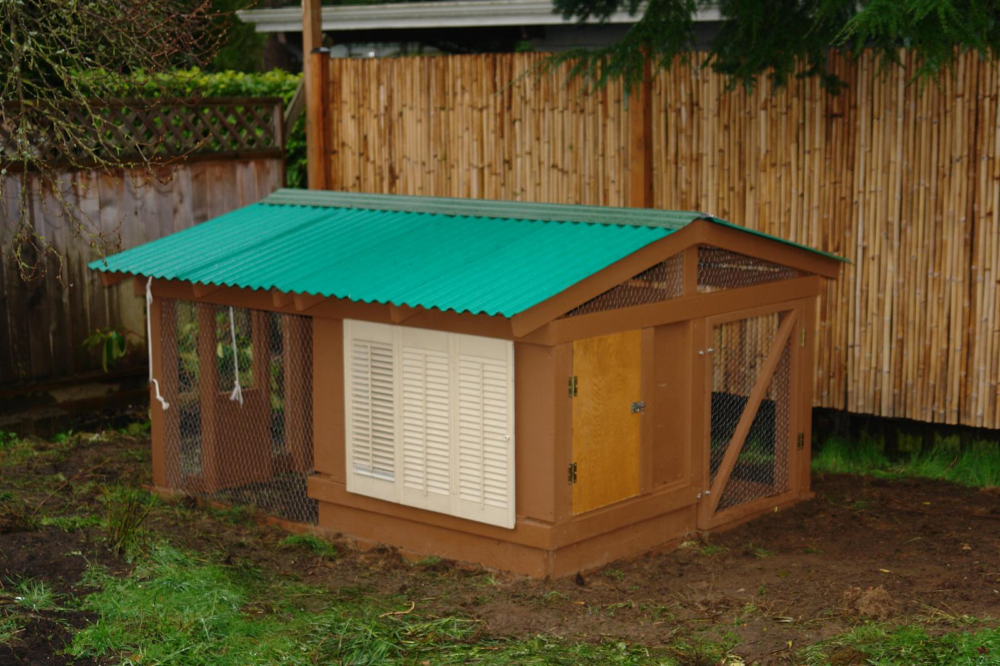
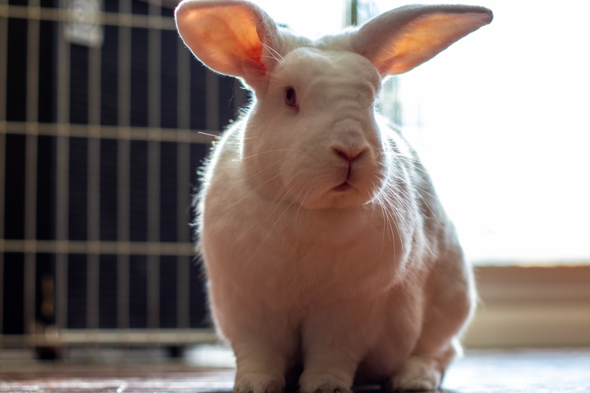
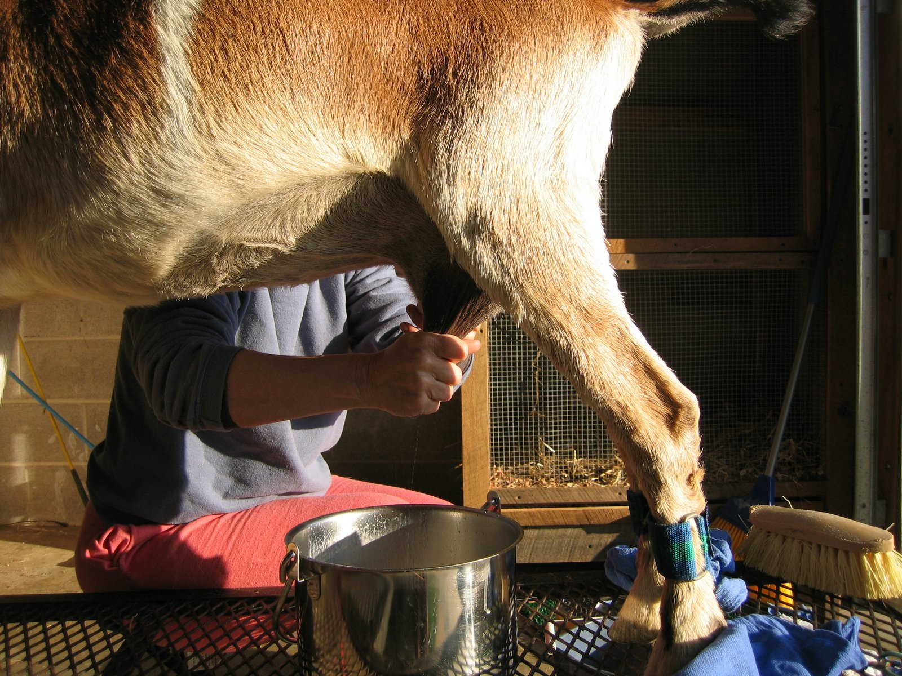

# Backyard Livestock & Animal Husbandry for Food Self-Sufficiency

## Read this first (the 30-second version)
1. **Chickens are the easiest entry point:** cheap, small, fast-maturing, and they give you eggs within 5–6 months — start here if you've never kept an animal before.
2. **Meat rabbits are the most feed-efficient meat animal you can raise in a backyard:** a doe can produce 25–40+ lbs of meat a year from a space smaller than a garden shed, on a ~31-day pregnancy.
3. **Goats need more space, fencing, and skill** but give you both milk (daily, for a household) and meat, and browse brush/weeds other animals won't eat.
4. **Every animal needs the same four things or it dies or gets sick:** clean water daily, the right feed in rodent-proof storage, shelter from Texas heat AND winter cold snaps, and protection from predators. Skimping on any one of these is the #1 cause of failure.
5. **Decide BEFORE you get animals whether you can actually kill and process them.** If you cannot, or won't be able to when it matters, raise them for eggs/milk only, or have a clear plan (this guide covers humane methods, but they take practice — practice before you must rely on it).
6. **Quarantine every new or sick animal for at least 2–4 weeks** before it joins your flock/herd — disease introduced to a small backyard group can wipe out all of it in days.

---

## Why this matters
Grocery store meat, eggs, and milk depend on a supply chain that can break: fuel shortages, trucking disruptions, storms, or extended economic stress can empty shelves for weeks. Unlike a garden (which gives you one harvest a season), backyard livestock gives you a **renewing** source of protein and fat — eggs daily, milk daily, meat on a breeding cycle you control. The tradeoff is real, ongoing effort: animals need care **every single day**, including the day you're sick, the day it's 105°F, and the day it's 15°F with ice on the ground. An animal that is fed and watered inconsistently produces less, gets sick more, and can die — turning an asset into a loss (of the animal, the money spent on it, and the time invested). This guide is honest about that effort so you can choose species that match your space, time, and stomach for the harder parts (killing and processing an animal you raised).

## Key terms (plain language)
- **Husbandry** — the day-to-day work of keeping animals healthy: feeding, watering, housing, breeding, and disease prevention.
- **Biosecurity** — practices that keep disease out of your animals (quarantine, clean boots/tools, controlling contact with wild birds/rodents/other people's animals).
- **Broiler** — a chicken raised specifically for meat (grows fast, butchered young, 8–12 weeks).
- **Layer** — a chicken kept for egg production.
- **Pullet / cockerel** — a young female / young male chicken before full maturity.
- **Molting** — the annual period (usually fall) when hens lose and regrow feathers and stop laying for 4–8 weeks.
- **Broody** — a hen that wants to sit on eggs to hatch them (stops laying, sits on the nest).
- **Kindling** — a doe rabbit giving birth.
- **Gestation** — pregnancy length (rabbits ~31 days; goats ~150 days/5 months).
- **Kidding** — a doe goat giving birth (to "kids").
- **Doe/buck (rabbits & goats)** — female/male. **Wether** — a castrated male goat.
- **Weaning** — when young animals stop nursing and move to solid feed only.
- **Culling** — removing (by selling, rehoming, or butchering) an animal that is unproductive, sick, or aggressive, to protect the health/resources of the rest.
- **Forage/browse** — plants animals eat directly from the land (grass = forage; brush, leaves, weeds = browse, which goats prefer).
- **Withdrawal period** — the time after giving an animal medication before its meat/milk/eggs are safe to consume — critical if you ever use dewormers or antibiotics.
- **Dispatch** — humane killing of an animal for meat.

---

# PART 1 — CHOOSING WHAT TO RAISE

Match the animal to your space, budget, climate tolerance, and how fast you need food. No single animal is "best" — most serious backyard operations run 2–3 of these together (e.g., chickens for eggs + rabbits for fast meat).

| Animal | Minimum space | Startup cost (rough) | Time to first food | Ongoing daily effort | Best for |
|---|---|---|---|---|---|
| **Chickens (layers)** | 3–4 sq ft/bird in coop + 8–10 sq ft/bird run | Low–moderate | Eggs: 5–6 months | 10–20 min | Eggs, beginners, small yards |
| **Chickens (meat/broilers)** | Same as above, temporary | Low | Meat: 8–12 weeks | 10–20 min | Fast, repeatable meat |
| **Meat rabbits** | 1 hutch (~30"×36") per adult | Low | Meat: ~10–12 weeks from breeding | 10–15 min | Best feed-to-meat ratio, quiet, small footprint |
| **Ducks** | Similar to chickens + water access | Low–moderate | Eggs: 5–7 months | 15–25 min | Wet climates, slug/pest control, rich eggs |
| **Dairy goats** | 200+ sq ft shelter/dry lot per goat, more on pasture/browse | Moderate–high | Milk: after first kidding (~7–12 months from breeding a doeling) | 30–60 min (2x/day milking) | Daily milk for a household, brush clearing |
| **Meat goats** | Same as dairy, less milking labor | Moderate | Meat: 6–10 months | 15–30 min | Meat + brush clearing, tougher/hardier |
| **Pigs** | 200+ sq ft per pig, sturdy fencing | Moderate–high | Meat: 5–6 months | 20–40 min | Large fat/meat yield, food-scrap recycling; smell, escape-prone, needs strong fencing |

**Rules of thumb for a beginner:**
- **Start small and with one species.** Learn chickens for a full year (through a Texas summer AND winter) before adding rabbits or goats.
- **Never get a single social animal.** Chickens, ducks, goats, and rabbits (for goats/chickens especially) are healthier and calmer in groups of 2+ (rabbits are the exception — house adults **separately**, see Part 3).
- **Zoning/HOA:** check local ordinances before buying — many Texas suburbs restrict roosters, goats, or livestock count. Rural county land is generally unrestricted but check any HOA/deed restrictions.
- **Have a plan for what happens if you can't feed them** (drought, no store feed available) — see Part 7 on feed storage and Part 1's foraging notes. An animal you can't feed is a liability, not an asset.

---

# PART 2 — CHICKENS

Chickens are the single best beginner animal: cheap, small, social, and productive within months.

## 2A. Coop and run
- **Coop (enclosed shelter, used at night and in bad weather):** 3–4 sq ft of floor space per standard-size bird (more is better — crowding causes stress, pecking, and disease). Needs: a solid roof, walls that block wind/rain, **ventilation up high** (near the roof, not at bird level — moist stale air causes respiratory disease), a floor you can clean, and roosting bars (2–3 inches wide, rounded edge, ~2 ft off the ground, allow 8–10 inches of bar per bird).
- **Nest boxes:** 1 box per 3–4 hens, about 12"×12"×12", lined with straw or shavings, mounted lower than the roosts (hens should never sleep in nest boxes — they'll foul the nesting material). Place them in the darkest, calmest part of the coop.
- **Run (outdoor fenced area):** at least 8–10 sq ft per bird if they're confined all day; less matters if they free-range part time. Ground cover (grass, mulch, sand) should be managed — bare wet dirt breeds parasites and disease.
- **Flooring/bedding:** pine shavings, straw, or sand on the coop floor, 3–4 inches deep. The **deep litter method** (let bedding build up, stirring in fresh material on top and mucking out fully 2–4 times a year) composts in place and reduces smell and labor — see composting cross-reference below.

## 2B. Predator-proofing (the #1 cause of losses)
Chickens are prey animals for nearly everything: hawks, owls, raccoons, opossums, skunks, foxes, coyotes, bobcats, snakes (eggs and chicks), and neighborhood dogs.
- **Hardware cloth, not chicken wire**, on any opening a predator could reach — ½-inch **welded hardware cloth**, not the woven "chicken wire" (raccoons can reach through chicken wire and pull a bird apart, or simply tear it).
- **Bury or apron the fence line** 12 inches down (or lay an "apron" of wire flat on the ground extending 12–24 inches outward from the base) to stop digging predators.
- **Cover the run** with wire or netting overhead if hawks are active in your area — aerial predators are a daily threat in open Texas country.
- **Lock the coop door every night without exception.** Automatic coop door closers (timer or light-sensor) are worth the money if you might miss a night.
- **No gaps bigger than a raccoon's fist** (about the size of a golf ball) — check every seam, especially around vents and where walls meet the roof.
- Cross-reference: [Animal, Insect & Pest Hazards](../animal-insect-pest-hazards/animal-insect-pest-hazards.md) covers identifying and deterring specific predators/pests around your property.

## 2C. Feed and foraging
- **Commercial feed by life stage:** chick starter (18–20% protein) from hatch to ~8 weeks → grower feed (16–18%) to point-of-lay (~18–20 weeks) → layer feed (16% protein, added calcium) once laying starts. **Do not** feed layer feed (extra calcium) to chicks or non-laying birds — it can damage their kidneys.
- **Free-choice oyster shell** (separate small dish, not mixed into feed) gives laying hens the calcium they need for eggshells without over-supplementing non-layers in a mixed flock.
- **Grit** (small insoluble stones) is needed if birds don't have dirt/gravel access — it lets their gizzard grind food, since chickens have no teeth.
- **Foraging/free-ranging** cuts feed costs significantly — chickens eat bugs, grass, and kitchen scraps. Safe kitchen scraps: vegetable trimmings, stale bread, cooked rice. **Never feed:** raw dried beans, avocado skin/pit, chocolate, moldy food, or very salty food.
- **A laying hen eats roughly ¼–⅓ lb of feed per day.** Plan feed storage accordingly for your flock size (see Part 7).

## 2D. Water
- Chickens drink surprisingly large amounts, especially in Texas summer heat (up to 1–2 cups per bird per day, more when hot). **Water access is the #1 factor limiting egg production** — hens skip laying quickly once thirsty.
- Use nipple-style waterers or covered founts to keep water cleaner and reduce drowning/dirtying. Clean weekly at minimum; algae grows fast in Texas heat.
- In winter freezes, use a heated base or swap frozen waterers for fresh several times a day — chickens can't peck ice for water.

## 2E. Egg production
- A healthy laying-breed hen lays roughly **250–300 eggs/year** in her first two laying years, declining after that. Production drops in the shortest days of winter (unless supplemented with light) and stops during molting.
- Collect eggs **at least once daily** (twice in summer heat) to keep them clean and prevent hens from learning to eat their own eggs.
- Unwashed, intact eggs kept at room temperature keep about 1–2 weeks; washing removes the natural protective "bloom," so wash only right before use, or refrigerate washed eggs (then they keep 3+ months refrigerated).

## 2F. Brooding chicks
- **Broody hen method:** let a broody hen sit on fertilized eggs for 21 days; she handles temperature and turning herself. Simple, but not all breeds/hens go broody.
- **Incubator/brooder box method:** incubate eggs 21 days at ~99.5°F, 45–55% humidity (spike to 65%+ the last 3 days), turning 3–5x/day until day 18. After hatch, move chicks to a **brooder** (draft-free box with bedding): keep at **95°F the first week**, reducing by 5°F per week until they're feathered out (~5–6 weeks) or match outdoor temperature. Use a red heat lamp (reduces pecking) or radiant brooder plate (safer, lower fire risk than a lamp) secured so it cannot fall into bedding — heat lamp fires are a real and common cause of coop fires.
- Provide chick starter feed and fresh water (a shallow, chick-safe waterer to prevent drowning) from day one.
- **People-protection (CDC backyard-poultry Salmonella guidance):** live poultry can carry *Salmonella* even when they look healthy. Always wash hands with soap and water right after handling chicks, eggs, or anything in the coop/brooder; don't kiss or snuggle birds against your face; **children under 5 should not handle chicks** or clean coop equipment; and don't eat or drink in the brooding/coop area.

## 2G. Basic diseases and biosecurity
- **Watch for:** lethargy, pale comb, discharge from eyes/nose, coughing/sneezing (respiratory disease), sudden drop in egg production, diarrhea, limping.
- **Common issues:** external parasites (mites/lice — check under wings and vent; treat with poultry-safe dust), internal worms (fecal check or routine dewormer per label), bumblefoot (swollen foot pad from a cut/splinter — clean and treat early), egg binding (a hen straining unable to pass an egg — warm Epsom-salt soak and vet/experienced-keeper help if it doesn't resolve quickly).
- **Biosecurity basics:** quarantine any new bird 30 days before adding to the flock; don't let new keepers or visitors' shoes track manure from other flocks in; keep wild bird feeders away from the run (wild birds carry disease); clean waterers/feeders regularly; remove sick birds immediately to a separate space.
- **When to call a vet or extension office:** sudden multiple deaths, or symptoms matching reportable diseases (e.g., avian influenza signs — sudden death, severe respiratory distress, swelling of head/comb) — contact your state veterinarian or Texas Animal Health Commission; do not just wait it out.

## 2H. Humane butchering and processing for meat
> ⚠️ Practice matters. If possible, learn from an experienced keeper or a class before you must rely on this alone.
1. **Withhold feed (not water)** for 8–12 hours before processing — empties the digestive tract and makes cleaning easier.
2. **Method — cervical dislocation (fast, low-equipment) or the killing cone + sharp knife (cleaner bleed-out):** In the cone method, invert the bird head-down into a traffic-cone-shaped killing cone (calms it), extend the head, and make a quick, decisive cut across the throat (both carotid arteries and jugular veins) with a very sharp knife. Death from blood loss follows in seconds; the bird may flap reflexively — this is a nerve response, not distress, once the cut is made correctly.
3. **Scald:** dunk the bird in 140–150°F water for 30–60 seconds (test-pluck a wing feather; if it pulls free easily, it's ready) to loosen feathers.
4. **Pluck** by hand or mechanical plucker immediately while warm.
5. **Eviscerate:** remove head and feet, open the body cavity carefully (avoid puncturing the intestines), and remove organs; save the heart, liver, and gizzard (giblets) if desired.
6. **Chill immediately** in ice water for at least 1–2 hours, then refrigerate or process further. Chilling quickly is a food-safety requirement, not optional.
- Full cooking, drying, canning, and storage instructions live in [Food Preservation & Cooking](../food-preservation-cooking/food-preservation-cooking.md) — this guide covers only the raising and initial dispatch/dressing.

---

# PART 3 — MEAT RABBITS

Rabbits are the most feed-efficient meat animal for a small backyard: quiet, odorless if managed well, and a doe can theoretically produce many times her own body weight in offspring meat per year.

## 3A. Housing
- **One adult per hutch/cage**, except a buck briefly introduced to a doe for breeding — adult rabbits (especially does, and unrelated bucks) fight, sometimes fatally, if housed together.
- **Cage size:** roughly 30"×36" (about 7.5 sq ft) floor space per adult meat-breed rabbit, taller breeds/larger does need more; a nursing doe with a litter needs more room plus a nest box.
- **Wire-floor cages** (14-gauge welded wire, ½"×1" mesh on the floor) let droppings fall through for easy cleaning and drier, healthier rabbits — but provide a solid resting mat/board in one section so feet don't stay on wire constantly (prevents sore hocks).
- **Placement:** shaded, well-ventilated, protected from direct sun and rain, and raised off the ground (both for airflow/cleaning and to deter predators/rodents). In Texas summer, rabbits are more heat-sensitive than cold-sensitive — see Part 7 heat notes.
- **Predator-proofing:** hutches must resist raccoons, dogs, snakes (which can kill and eat kits/young rabbits through gaps), and birds of prey — same hardware-cloth-not-chicken-wire principle as chickens.

## 3B. Feed
- **Commercial rabbit pellets** (16–18% protein for growth/lactation, formulated for rabbits specifically) are the reliable baseline. Feed roughly ¼–⅝ cup per day for a maintenance adult; more for pregnant/nursing does (they can eat free-choice while nursing).
- **Hay (grass hay, e.g., Bermuda or coastal — common and cheap in Texas) should be available at all times** — it's essential for digestive health, not just filler, and helps prevent GI stasis (a dangerous slow/stopped gut).
- Fresh greens/garden scraps (in moderation, introduced gradually) supplement well; avoid iceberg lettuce (low nutrition) and anything treated with pesticides.
- Always provide fresh water — a rabbit drinks roughly as much water as feed by weight, more in Texas heat; use a sipper bottle or heavy crock that can't tip or foul.

## 3C. Breeding cycle
- **Rabbits don't have a heat cycle like most mammals** — does are near-continuously receptive, and ovulation is triggered by mating itself, which makes them highly efficient breeders.
- **Breeding:** take the doe to the buck's cage (not the reverse — does can be territorial and injure a buck introduced to her space). Supervise; remove her after mating (often quick).
- **Gestation is about 31 days** (range 28–35; if she doesn't kindle by day 34, check for a false pregnancy or health issue).
- **Nest box:** provide around day 27–28, filled with clean straw. The doe will pull her own fur to line it shortly before kindling.
- **Kindling** (birth) usually happens quickly, often at night, with litters typically of 4–12 kits. Avoid disturbing the doe right around kindling.
- **Kits** are born hairless, blind, and helpless — entirely dependent on the nest box's fur/straw insulation and the doe's once- or twice-daily nursing visits (rabbits do not nurse constantly like many mammals; a doe visiting the box briefly once a day is normal, not neglect).
- **Weaning** around 4–6 weeks old; kits can be fully separated from the doe by 8 weeks. A doe can be rebred as early as a few weeks after kindling, but giving her a rest between litters improves her health and litter quality long-term.

## 3D. Humane dispatch and processing
> ⚠️ As with poultry, practice under guidance if at all possible before relying on this alone.
1. Most meat rabbits are processed at **8–12 weeks old** (around 4–5 lbs live weight, "fryer" stage) for the best feed-to-meat ratio; older "roasters" yield more meat per animal but cost more feed per pound gained.
2. **Method:** a sharp, sudden blow to the back of the skull (cervical dislocation done correctly, or a purpose-built rabbit dispatch tool) causes immediate unconsciousness and death; done incorrectly, cervical dislocation can cause suffering — learn the correct hand position from an experienced source or reputable video before attempting it, or use a broomstick-restraint method under guidance.
3. **Bleed out** immediately by cutting the throat/head, hang by the back legs.
4. **Skin:** cut around the hocks and down the inside of the hind legs, peel the skin off like a glove (rabbit skin separates easily from the carcass, much easier than most animals).
5. **Eviscerate**, saving the liver/heart/kidneys if desired; rinse the carcass in cool water.
6. **Chill immediately** in ice water or a refrigerator for several hours before cooking or further processing — see [Food Preservation & Cooking](../food-preservation-cooking/food-preservation-cooking.md) for cooking/storage methods.

---

# PART 4 — DAIRY / MEAT GOATS

Goats need the most space, fencing, and skill of the animals in this guide, but reward you with daily milk and the ability to turn brush/weeds inedible to other livestock into food.

## 4A. Shelter and fencing
- **Shelter:** a simple 3-sided, well-ventilated structure open to the south (blocking north wind) is enough in most of Texas — goats need protection mainly from rain, wind, and direct sun, not elaborate barns. Allow roughly **15–20 sq ft per goat** under roof, more for kidding season.
- **Fencing is the single hardest part of keeping goats — they are notorious escape artists** and will test, climb, and push through weak fencing.
  - **Woven wire ("field/goat fencing"), 4 ft high minimum**, is the standard; add a strand of electric wire at goat-nose height (about knee-to-chest height) along the inside to discourage pushing/climbing.
  - Check fences regularly for gaps — goats find them.
  - Never use barbed wire alone for goats (injury risk to their coats/skin, and it doesn't reliably stop a determined goat).
- **Bedding:** straw or shavings, kept dry — wet bedding is a major cause of hoof problems (foot rot).

## 4B. Feed and browse
- **Goats are browsers, not grazers** — they prefer brush, weeds, leaves, and shrubs over grass, which makes them excellent for clearing overgrown land (a real asset if you're managing acreage) but means pure grass pasture alone won't fully feed them.
- **Hay (grass hay, free-choice) plus browse** covers a maintenance goat; lactating does and growing kids need **grain/concentrate supplementation** (a commercial dairy goat or "sweet feed" ration, typically 1–3 lbs/day for a milking doe depending on production).
- **Minerals matter:** goats need copper (similar to cattle). Do **NOT** feed sheep mineral to goats — it is deliberately **LOW** in copper (sheep are copper-sensitive) and causes copper **deficiency** in goats over time. Use a **goat-specific mineral** (~1,500–1,800 ppm copper) free-choice. Conversely, **never feed goat or cattle mineral to sheep** — the added copper can be fatal to them. Do not skip this — mineral deficiency (or toxicity, in the sheep direction) causes real, visible health problems.
- Toxic plants exist in most Texas yards/pastures (e.g., azalea, oleander, certain wilted stone-fruit leaves) — know what's growing in your goats' reach; when in doubt, fence it off or remove it rather than assume the goat will avoid it.

## 4C. Milking basics
- A doe typically needs to have **kidded** to produce milk, and milk production is highest for roughly the first 2–4 months after kidding, tapering over a 8–10 month lactation.
- **Milk twice daily, at consistent times (roughly 12 hours apart)** — irregular milking reduces supply and risks painful engorgement/mastitis.
- **Basic hygiene:** wash the udder with a clean, warm, diluted-soap or udder-wash cloth before milking; strip the first squirt or two from each teat into a separate cup (discard — it has the highest bacteria count) before milking into your clean container.
- **Chill milk immediately** (within 1–2 hours) to below 40°F — raw milk spoils and can carry pathogens if left warm; never mix warm fresh milk into already-chilled milk (it warms the batch).
- A dairy goat in milk typically produces roughly **1–3 quarts (1–3 liters) per day**, varying widely by breed, individual, and stage of lactation.

## 4D. Kidding
- **Gestation is about 150 days (~5 months).**
- Signs of approaching labor: udder filling/"bagging up," ligaments near the tail going soft, restlessness, separating from the herd.
- Most does kid without assistance. Have towels, iodine (for dipping the kid's navel to prevent infection), and a warm, draft-free space ready.
- **When to intervene:** if hard labor (visible straining) continues more than 30–60 minutes with no progress, or a kid is presented wrong (anything other than two front feet and a nose first, or two back feet first), you may need to assist or call an experienced goat keeper/vet — malpresentation is one of the few true goat emergencies.
- Make sure each kid nurses **colostrum** (the first, antibody-rich milk) within the first few hours of life — this is critical for the kid's immune system and survival.
- **Zoonosis warning at kidding:** birth fluids, the placenta, and newborn kids can carry organisms that cause serious illness in people — notably **Q fever (Coxiella burnetii)** and **Chlamydophila abortus** (an abortion-causing organism in goats). **Pregnant women and anyone immunocompromised should not handle birth fluids, the placenta, or newborn kids**, and should avoid the kidding area during and shortly after birth. Everyone else should wear gloves, wash hands thoroughly afterward, and dispose of birth material promptly rather than letting it linger.

## 4E. Common issues
- **Parasites (internal worms)** are the #1 health issue in goats in humid regions like Texas — monitor with the **FAMACHA eyelid-color method** (checking inner-eyelid color as an anemia indicator) rather than blanket-deworming on a calendar, which speeds up dewormer resistance.
- **Mastitis** (udder infection): swollen, hot, painful udder, abnormal milk (clumpy, bloody, or watery) — treat early; discard milk from an affected quarter, keep milking it out to clear infection, and consult an experienced keeper/vet for treatment options.
- **Foot rot/overgrown hooves:** trim hooves every 6–8 weeks; keep bedding dry.
- **Bloat:** a genuine emergency — a distended, tight left side from gas buildup, often after sudden access to rich feed (heavy grain or lush legume pasture). Walk the goat, avoid the triggering feed going forward, and get experienced/vet help quickly if it doesn't resolve.

---

# PART 5 — DUCKS AND PIGS (BRIEF NOTES)

## 5A. Ducks
- Hardier than chickens in many respects (more disease-resistant, tolerate cold and wet well) and excellent at eating garden pests (slugs, snails).
- Need **water deep enough to dunk their whole head** (not necessarily a pond — a low tub works) to keep eyes/nostrils clean; this is a health requirement, not a luxury.
- Lay fewer but larger, richer eggs than chickens; meat breeds (e.g., Pekin) grow quickly.
- Messier than chickens — their play with water muddies bedding/ground fast; plan drainage.
- Same predator and coop-security principles as chickens apply.

## 5B. A pig (if you have the space)
- Needs sturdy, goat-level-serious fencing (pigs are strong and will root under/push through weak fences) and roughly 200+ sq ft per pig minimum, more if not on pasture.
- Highly efficient at converting food scraps/garden waste into meat and fat, and can be raised from weaner to butcher weight (~250 lbs) in about 5–6 months on a grain-based diet.
- Rooting behavior will tear up any grass/dirt area fast — plan for mud management, especially in Texas clay soil after rain.
- Butchering a pig is a larger, more equipment-intensive undertaking (scalding tank or skinning, larger carcass handling) — get hands-on guidance or attend a processing day before doing your own first pig; it is not a good "first animal to butcher alone."

---

# PART 6 — UNIVERSAL HUSBANDRY BASICS (applies to all species above)

## 6A. Clean water — every species, every day
Every animal above needs **daily clean water access**, and consumption rises sharply in Texas summer heat. Algae, droppings, and debris foul water fast in heat — check and refresh at least daily, more in summer. Frozen waterers in winter cold snaps must be broken/refreshed multiple times a day; animals will not eat enough dry feed if they can't drink. See [Water](../water/water.md) for general water-safety principles if your own water supply is disrupted — animals can generally tolerate water that's less pristine than human drinking water, but not visibly contaminated or algae-choked water.

## 6B. Feed storage vs. rodents
- Store feed in **rodent-proof containers** — galvanized metal trash cans with tight lids, not the original paper/plastic feed bags, which mice and rats chew through easily.
- Rodents drawn in by loose feed bring disease risk to your animals and to you, and attract snakes (which follow rodents).
- Rotate feed stock (oldest first); buy only what you'll use in 4–6 weeks in humid Texas conditions, since feed can mold in storage.
- Keep a buffer supply if possible, and know basic **emergency forage/substitute feeds** for your species (kitchen scraps for chickens, garden/yard weeds for goats and rabbits) in case store feed becomes unavailable — but never sudden, wholesale diet changes; introduce anything new gradually to avoid digestive upset.

## 6C. Manure handling and composting
- Manure is a resource, not just waste — properly composted, it becomes valuable garden fertilizer (see [Food Growing](../food-growing/food-growing.md) for using finished compost in a garden).
- **Compost, don't apply fresh:** fresh manure (especially poultry, which is "hot"/high-nitrogen) can burn plants and carries pathogens; compost it (turning periodically, reaching internal heat) for at least **60–90 days minimum** before applying near food crops, longer for safety margin.
- Keep manure/soiled bedding piles away from wells, water sources, and living/food-prep areas — this is a sanitation issue as much as a gardening one. Full waste-management, latrine, and disease-prevention principles are in [Sanitation & Hygiene](../sanitation-hygiene/sanitation-hygiene.md).
- Regular mucking-out reduces flies, odor, and parasite loads in all housing.

## 6D. Texas heat and cold care
- **Summer heat (the bigger day-to-day risk in North Texas):** provide shade structures, good airflow/ventilation (not just a roof — moving air matters), and unlimited cool water. Watch for open-mouth panting in chickens, goats going off feed, and rabbits stretched flat/lethargic — all are heat-stress warning signs; move animals to the coolest available shade, provide frozen water bottles to lean against, and reduce handling during the hottest midday hours.
- **Winter cold snaps/ice storms:** North Texas gets sudden hard freezes. Draft-free, dry shelter matters more than heat itself — wet + windy is far more dangerous to livestock than dry cold. Provide extra bedding (deep straw), block wind gaps, and check water sources multiple times daily to break ice. Cross-reference: [Extreme Heat & Cold](../extreme-heat-cold/extreme-heat-cold.md) for the human-focused version of these same weather hazards.

## 6E. Humane slaughter, carcass processing, and safe meat handling
- The species-specific dispatch methods are in Parts 2H (chickens) and 3D (rabbits); goats/pigs are larger undertakings best learned from an experienced processor or class before attempting alone.
- **Universal rules:** work quickly and calmly to minimize the animal's stress beforehand (calm handling in the hours before, not chasing/cornering); use a sharp, dedicated knife; chill meat promptly; keep raw meat, tools, and surfaces clean and separated from ready-to-eat food.
- **Full cooking, curing, smoking, canning, and safe-storage instructions are covered in depth in [Food Preservation & Cooking](../food-preservation-cooking/food-preservation-cooking.md)** — this guide's scope ends at dispatch and basic dressing.
- **The nutritional value** these animals provide (protein, fat, and how to plan a diet around them long-term) is covered in [Long-Duration Nutrition](../long-duration-nutrition/long-duration-nutrition.md).

## 6F. Quarantine and biosecurity
- **New animals:** isolate at least 2–4 weeks from your existing flock/herd, watching for illness, before mixing.
- **Returning animals** (e.g., after a show, sale barn, or vet visit) should also be quarantined before rejoining the group.
- **Separate species where practical**, especially keeping wild waterfowl away from domestic poultry (avian influenza risk) and limiting contact between your animals and neighbors'/strangers' animals.
- **Sick animal protocol:** isolate immediately in a separate space, use dedicated tools/boots for that animal, wash hands/change clothes between handling sick and healthy animals, and don't guess on anything that could be reportable/contagious — see 6G.

## 6G. Veterinary care when none is available
Large-animal (and increasingly, poultry/rabbit) veterinary access is genuinely limited in many rural areas even in normal times, and may be entirely unavailable in a wider emergency.
- **Before you need one:** identify your nearest large-animal or mixed-practice vet and your county's Texas AgriLife Extension office **now**, while things are normal — extension agents are a free, expert, non-emergency resource for husbandry questions and can often be reached by phone.
- **Build a basic animal first-aid kit:** vet wrap, blood-stop powder, iodine, electrolyte powder, a good digital thermometer (know normal temps for your species), and antiseptic wound spray.
- **Know normal vs. abnormal** for each species you keep (normal temperature, behavior, appetite) so you can recognize a real problem early, when simple intervention still works.
- **Accept the limits of self-treatment.** Basic wound care, supportive fluids/electrolytes, and isolating a sick animal are reasonable to do yourself. Surgery, difficult births beyond simple repositioning, and diagnosing/treating unfamiliar diseases are not — the honest answer when no vet is reachable is sometimes humane culling to prevent suffering, which is a hard but real part of keeping livestock.
- **Never guess on medication dosing** for an unfamiliar drug or species — wrong dosing can kill the animal or, via meat/milk/eggs, harm you through drug residue. If you don't have clear, species-specific dosing from a reliable source, don't administer it.

---

## North Texas / regional notes
- **Climate reality:** Anna/Collin County sees both 100°F+ summer stretches with drought and occasional hard freezes/ice storms — every species above needs a real plan for **both** extremes (shade + unlimited water in summer; draft-free dry shelter + non-frozen water in winter), not just one.
- **Common local hazards:** coyotes, bobcats, raccoons, opossums, hawks/owls, and venomous snakes (copperheads especially) are all present on blackland-prairie rural/suburban edges — predator-proofing (Part 2B) is not optional here. See [Animal, Insect & Pest Hazards](../animal-insect-pest-hazards/animal-insect-pest-hazards.md) for identification and property-level deterrence.
- **Feed/hay availability:** coastal Bermuda and native prairie hay are locally common and generally cheaper than imported alfalfa; buy local when possible and store dry, off the ground, protected from Texas humidity swings that promote mold.
- **Local resources:** Texas A&M AgriLife Extension has a county office in nearly every Texas county (including Collin County) offering free publications, phone advice, and 4-H/youth livestock programs — an excellent free, non-emergency knowledge resource for exactly the situations covered in this guide.
- **HOA/zoning:** many North Texas suburbs (inside city limits) restrict or ban roosters, goats, and other livestock even on large lots — verify before investing in animals if you're not on unrestricted rural/agricultural-exempt land.

---

# ⚠️ Safety — the most important warnings
- **Never house predators-vs-prey combinations loosely** (dogs/cats with poultry/rabbits) without supervision — even a normally gentle pet dog can kill a whole flock in minutes on instinct.
- **Chicken wire is not predator-proof** — use welded hardware cloth for anything you need to actually keep animals safe from raccoons, and bury or apron the base of all pens.
- **Never feed layer feed (high calcium) to chicks, roosters, or non-laying birds** — it can cause kidney damage over time.
- **Never use sheep mineral for goats** — it is deliberately low in copper (sheep are copper-sensitive) and will cause copper deficiency in goats over time; use a goat-specific mineral (~1,500–1,800 ppm copper) instead. **Conversely, never feed goat or cattle mineral to sheep** — the added copper can be fatal to them.
- **Heat lamps are a leading cause of coop/barn fires** — secure them so they cannot fall into bedding, and prefer radiant brooder plates where possible.
- **Chill meat and milk promptly** (within 1–2 hours) — bacteria multiply fast in Texas heat, and undercooked/mishandled meat and unpasteurized milk both carry real foodborne-illness risk.
- **Never guess at medication doses**, and respect any withdrawal period before eating meat/eggs/milk from a treated animal.
- **Quarantine new and returning animals** — skipping this is how a single sick bird or goat wipes out an entire small flock/herd.
- **Practice humane dispatch methods correctly before you must rely on them** — a poorly executed attempt causes more suffering, not less; learn from an experienced person or reputable instructional source first if at all possible.
- **Malpresented births (goats especially) are a true emergency** — know the normal presentation (front feet + nose, or both back feet) so you recognize a problem quickly.
- **If in doubt about a disease outbreak (sudden multiple deaths, severe respiratory symptoms) — call your state veterinarian or extension office rather than guessing or spreading it further.**

# Troubleshooting
| Problem | Fix |
|---|---|
| Hens stopped laying | Check daylight (add supplemental light if <14 hrs), water access, molting season, stress (predator nearby, overcrowding), age (hens slow after year 2). |
| Raccoon/predator got into coop despite a fence | Upgrade chicken wire to welded hardware cloth; bury/apron the perimeter 12"+; check for gaps at roofline and vents; lock the door every night. |
| Rabbit doe won't build a nest / no kits at day 34 | Check for false pregnancy, re-palpate/re-breed if needed; ensure nest box was provided by day 27–28; consult an experienced rabbit keeper if repeated. |
| Goat escaping fence repeatedly | Add an interior electric strand at nose height; check and repair gaps immediately (goats find and exploit every weak point); consider it a fencing problem, not a "bad goat" problem. |
| Animals going off feed/lethargic in summer | Suspect heat stress — move to best shade, add airflow, offer extra cool water/frozen water bottles, reduce handling in midday heat. |
| Water frozen in a cold snap | Break/replace multiple times daily; consider a heated base for the coldest stretches; never let animals go without drinking water because "it's too cold to check." |
| Milk/meat tastes off or spoils fast | Chill within 1–2 hours of milking/dispatch; check cleanliness of milking/processing routine; discard anything that smells wrong rather than risk it. |
| Sick animal, symptoms unclear | Isolate immediately; check temperature/appetite/behavior against normal; call your county AgriLife Extension office or a vet if reachable; don't guess on medication. |
| Manure smell/flies becoming a problem | Muck out more frequently; start active composting (turn pile, keep it hot) rather than letting it sit fresh; move piles away from living/water areas. |

# Quick-reference checklist
- [ ] Chose species matched to available space, time, climate tolerance, and zoning/HOA rules.
- [ ] Built predator-proof housing (welded hardware cloth, buried apron edges, locking doors) before bringing animals home.
- [ ] Set up daily clean water and rodent-proof feed storage.
- [ ] Learned the correct life-stage feed for each species (chick starter → grower → layer; rabbit pellets + free-choice hay; goat-specific mineral — never sheep mineral for goats, and never goat/cattle mineral for sheep, since each species' safe copper level is the opposite of the other's).
- [ ] Know the breeding cycle basics (rabbit gestation ~31 days; goat gestation ~150 days) and have supplies ready (nest box, kidding kit) before due dates.
- [ ] Practiced or studied humane dispatch methods before needing them for real.
- [ ] Have a quarantine plan (2–4 weeks) for any new or returning animal.
- [ ] Identified your nearest large-animal vet and county Extension office now, before an emergency.
- [ ] Set up a manure/composting routine kept well away from water sources and living space.
- [ ] Planned for both Texas summer heat and winter cold snaps for every species kept.

# Sources & further reading (in this knowledge base)
- **Texas A&M AgriLife Extension — "The Small Laying Flock"** — `reference/manuals/tamu_small_laying_flock.pdf` (coop/nest box design, feed by life stage, brooding, egg production).
- **Texas A&M AgriLife Extension — "Rabbit Project Reference Manual"** — `reference/manuals/tamu_rabbit_project_reference_manual.pdf` (housing, breeding cycle, feeding, and processing for meat rabbits).
- **USDA APHIS — "U.S. Dairy Goat Operations"** — https://www.aphis.usda.gov/sites/default/files/goat09_is_dairygoatops_1.pdf (national dairy goat management practice data; cited by URL — not mirrored locally).
- **Oregon State University Extension — "Raising Rabbits for Meat"** — https://extension.oregonstate.edu/sites/extd8/files/documents/ec1651.pdf (cited by URL).
- **University of Maine Cooperative Extension, Bulletin #1044 — "Backyard Production of Meat Rabbits in Maine"** — https://extension.umaine.edu/publications/1044e/ (cited by URL).
- **Ask Extension / eXtension.org** — poultry, rabbit, and goat production Q&A network of university Cooperative Extension specialists — https://ask.extension.org/ (cited by URL).
- See also: [Food Preservation & Cooking](../food-preservation-cooking/food-preservation-cooking.md) (butchering follow-through, curing, canning, safe storage of meat/milk/eggs), [Food Growing](../food-growing/food-growing.md) (growing feed crops/pasture and using finished compost), [Sanitation & Hygiene](../sanitation-hygiene/sanitation-hygiene.md) (manure and waste sanitation), [Animal, Insect & Pest Hazards](../animal-insect-pest-hazards/animal-insect-pest-hazards.md) (predator/pest identification and deterrence), [Long-Duration Nutrition](../long-duration-nutrition/long-duration-nutrition.md) (planning a diet around the protein/fat these animals provide), and the [North Texas regional guide](../regional-north-texas/regional-north-texas.md).

---

### Images in this guide's `images/` folder

*Figure — A well-built backyard chicken coop with an attached run, showing the kind of solid, predator-resistant enclosed shelter described in Part 2A. Source: Wikimedia Commons (File:Backyard chicken coop.jpg), Josh Larios, CC BY-SA 2.0.*

*Figure — A New Zealand White rabbit, one of the most common meat-rabbit breeds in the US thanks to its fast growth, calm temperament, and good feed conversion (Part 3). Source: Wikimedia Commons (File:New Zealand white rabbit ears low.jpg), Elizabeth Chamberlain, CC BY 2.0.*

*Figure — Hand-milking a dairy goat, showing the basic technique described in Part 4C. Source: Wikimedia Commons (File:Goat Milking.jpg), Olaf Gradin, CC BY-SA 2.0.*
