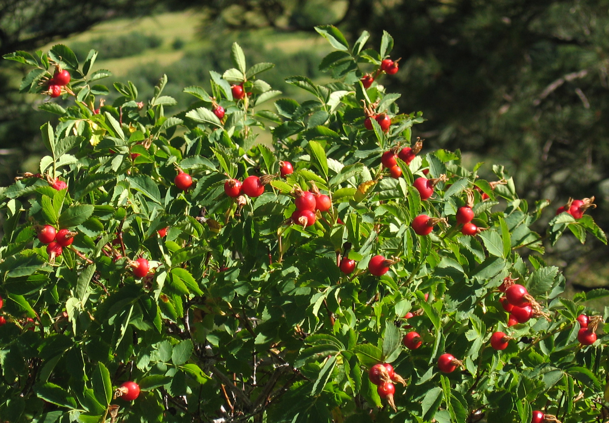

# Long-Duration Nutrition — Staying Healthy on Emergency Food for Weeks and Months

## Read this first (the 30-second version)
1. **Calories keep you alive for weeks; they do not keep you healthy for weeks.** A person can eat "enough food" every single day and still develop a disabling, even fatal, deficiency disease after a month or two of eating the same narrow stockpiled foods (rice, pasta, canned goods, white flour) with no fruit, vegetables, or variety.
2. **The fastest, cheapest insurance is a bottle of ordinary multivitamins** — buy a large bottle now, store it with your food, and give one tablet a day to everyone (adult-dose or children's per label) once fresh food becomes scarce. This alone prevents most of what's in this guide.
3. **Add real plants whenever you can:** sprout seeds on a counter (ready in 2–5 days, no soil, no sun — see the [Food Growing guide](../food-growing/food-growing.md)), forage safe wild greens (see [Foraging guide](../food-foraging-wild-edibles/food-foraging-wild-edibles.md)), or grow a few containers. Fresh plant matter is the single best defense against the deficiency diseases below.
4. **Never ration children, pregnant or nursing women, the elderly, or the sick to "stretch the food."** They need MORE nutrients per pound of body weight than a healthy adult, not less — cut healthy adults' portions first (see Part 5).
5. **Watch for early warning signs** — unusual tiredness, bleeding/swollen gums, tingling hands and feet, patchy skin rash on sun-exposed areas, trouble seeing in dim light, unusual paleness, or a child's swelling belly/ankles despite "enough" food. These are your body telling you a specific nutrient is missing, weeks before it becomes an emergency — act by adding the food in Part 2, and get real medical care the moment it's reachable.
6. **During any illness with vomiting or diarrhea, rehydration comes before nutrition** — use an oral rehydration solution (see the [Emergency Medicine guide](../emergency-medicine-herbal/emergency-medicine-herbal.md)) and keep eating small amounts as soon as fluids are tolerated; don't let sickness become an excuse to stop feeding a child.

The rest of this guide explains **why** calorie-counting fails over the long haul, walks through each major deficiency disease with its early signs and prevention foods, and gives you a practical plan for keeping a monotonous stored-food diet nutritionally complete — for weeks, and for months.

---

## Why this matters
Short emergencies (a few days without power, a weekend without a grocery run) are a calorie problem: eat what you have, don't starve, move on. **Long emergencies — weeks to months of relying on a stockpile, a garden, rationed food aid, or a monotonous "beans and rice" diet — become a *nutrient* problem instead.** The body stores some vitamins for weeks (vitamin A, vitamin D, B12), some for only days to a few weeks (vitamin C, thiamine), and some minerals are lost continuously and must be replaced daily (iron, iodine). A stockpile heavy on rice, wheat, corn, pasta, canned meats, and sugar can supply 2,000+ calories a day and *still* be missing vitamin C, several B-vitamins, and enough complete protein — leading to real, historically well-documented diseases: scurvy, beriberi, pellagra, night blindness, anemia, goiter, and kwashiorkor. These aren't obscure — they were common in besieged cities, prison camps, ships at sea, refugee camps, and famines, precisely because people had "enough food" by calorie count but not by nutrient variety. The good news: every one of these is fully preventable with cheap, simple additions to a stored-food diet, and this guide tells you exactly what to add and why.

## Key terms (plain language)
- **Macronutrients** — the nutrients that provide calories/energy: carbohydrates, fats, and protein. Most stockpiled "survival food" is heavy on these.
- **Micronutrients** — vitamins and minerals needed in small amounts but essential for the body to function; they provide **no calories** but prevent deficiency diseases.
- **Deficiency disease** — an illness caused specifically by *lack* of one nutrient over time (not by lack of calories overall).
- **Complete protein** — a protein source containing all nine essential amino acids in adequate amounts (meat, fish, eggs, dairy, soy are complete on their own). Most single plant foods are *incomplete* (missing or low in one or more amino acids) but become complete when combined with a complementary plant food (see Part 2H).
- **RDA (Recommended Dietary Allowance)** — the average daily amount of a nutrient that meets the needs of nearly all healthy people; used here only as a rough planning reference, not a medical prescription.
- **Malnutrition** — a broad term covering both *undernutrition* (too few calories and/or nutrients — wasting, stunting, deficiency disease) and *overnutrition*; this guide focuses on undernutrition in an emergency context.
- **Kwashiorkor** — a protein-deficiency disease (see Part 2H) distinct from calorie-deficiency wasting (marasmus).
- **Fortification** — nutrients added to a food during processing (e.g., iodized salt, fortified flour, vitamin D milk) — check labels, since fortified staples quietly prevent several of the diseases below.
- **ORS (Oral Rehydration Solution)** — a mixed solution of clean water, salt, and sugar used to treat dehydration from vomiting/diarrhea; full recipe in the [Emergency Medicine guide](../emergency-medicine-herbal/emergency-medicine-herbal.md).

---

# PART 1 — Why calories alone aren't enough

## 1A. The calorie trap
A pantry audit (see [Survival Logistics](../survival-logistics-resources/survival-logistics-resources.md)) tells you how many *days* your food will last by total kilocalories. That math is necessary but not sufficient. Two stockpiles with identical calorie totals can have wildly different outcomes over 60–90 days:

| Stockpile A (calorie-only thinking) | Stockpile B (calorie + nutrient thinking) |
|---|---|
| White rice, pasta, white flour, sugar, vegetable oil, canned meat | Same base, **plus**: dried beans/lentils, a case of multivitamins, sprouting seeds, canned tomatoes, powdered milk, peanut butter, a few bags of dried fruit |
| Meets calorie target; misses vitamin C, most B-vitamins, calcium, fiber | Meets calorie target **and** most micronutrient needs |
| Deficiency symptoms likely to appear by week 4–12 | Deficiency risk greatly reduced |

The fix isn't more food — it's **variety and a few specific cheap additions**, covered in Part 3.

## 1B. Fats and salt still matter
Don't swing to the opposite extreme and strip out fat or salt to "eat healthy" during a crisis:
- **Fat** is calorie-dense (9 kcal/gram vs. 4 for carbs/protein), carries fat-soluble vitamins (A, D, E, K), and adds satiety and palatability to a monotonous diet. Peanut butter, cooking oil, nuts, and fatty canned fish are efficient stockpile items.
- **Salt (sodium)** is lost through sweat and is needed for basic body function; in Texas heat with hard physical work, salt needs go up, not down. Use **iodized** salt specifically (see Part 2G) — it solves two problems (sodium and iodine) with one product.
- The goal during an emergency is not a "clean" diet — it's a **complete** one. Save dietary restriction for normal times.

## 1C. Complementary foods, in one sentence
No single stockpiled food is nutritionally complete on its own. The practical fix is **diversity of source, not perfection of any one item** — grains + legumes + some animal or dairy product + a vitamin-C source + a fat source, rotated, beats any single "superfood."

---

# PART 2 — The deficiency diseases: what they are, early signs, and prevention

> ⚠️ Everything below is about **prevention through food**. If someone already shows moderate-to-severe signs of any of these diseases, treat it as a real medical problem — get professional medical help the moment it is reachable. Do not attempt to self-treat with injections, prescription-strength vitamin doses, or "megadosing" — normal food-level amounts prevent these diseases; treating an established deficiency safely is a medical task.

## 2A. Vitamin C deficiency — Scurvy
**What it is:** Vitamin C (ascorbic acid) is needed to build collagen, the protein that holds skin, blood vessels, and gums together, and to help the body absorb iron. The body cannot make or store vitamin C for long — reserves run out after roughly **4–12 weeks** of a diet with none at all.

**Early signs (in order of appearance):** unusual fatigue, irritability, and joint/muscle aches → then **bleeding and swollen gums**, easy bruising, tiny red/purple spots on the skin (especially around hair follicles), and slow-healing wounds → in advanced, prolonged cases: loosening teeth, old wounds reopening, and bone/joint pain.

**Prevention — foods and amounts:** Adults need only about **65–90 mg/day** (about one medium orange, ~68–70 mg) to prevent scurvy — much less than "megadose" marketing suggests. In a survival setting without citrus:
- **Sprouts** (see [Food Growing, Method 1](../food-growing/food-growing.md)) — fresh sprouted mung beans, lentils, or alfalfa are one of the fastest, most reliable vitamin-C sources you can produce with zero outdoor space, ready in days.
- **Fresh or wild greens** — dandelion greens, chickweed, wild lettuce, and many common "weeds" are vitamin-C rich; see the [Foraging guide](../food-foraging-wild-edibles/food-foraging-wild-edibles.md) for safe identification — never eat a wild plant you cannot positively identify.
- **Rose hips** (the red/orange fruit left behind after a wild or garden rose's petals fall) are exceptionally high in vitamin C — steep several crushed, dried, or fresh hips in hot (not boiling — heat degrades vitamin C) water for a tea, or eat the flesh raw (avoid the fine seed hairs, which can irritate the throat/gut — strain them out).

*Figure — Rose hips, the fruit left after the petals of a rose (wild or garden) drop, are an exceptionally concentrated wild vitamin-C source — usable fresh, dried, or steeped as a tea. Source: Wikimedia Commons (File:Woods rose hips.jpg), author Dcrjsr, CC BY 3.0.*

- **Pine needle tea** — steep fresh, chopped needles from a true pine (*Pinus* spp., needles in bundles) in hot water; see the [Foraging guide](../food-foraging-wild-edibles/food-foraging-wild-edibles.md#method-3-common-widely-recognized-safe-edibles-learn-these-first) for identification and the pregnancy caution on certain pine species. **Never use yew** (flat, unbundled dark needles, red berry-like fruit) — it is toxic.
- **Organ meat**, especially liver, retains meaningful vitamin C even though muscle meat has very little.
- **Potatoes** (if stored/grown) contain a modest but useful amount, especially eaten with skins, and are often overlooked as a vitamin-C source because they aren't a "fruit."
- A basic **multivitamin** (Part 3A) is the simplest year-round insurance.

> ⚠️ Vitamin C is destroyed by heat, air, and long storage — don't boil vitamin-C foods longer than necessary, and eat sprouts/greens promptly rather than storing them cooked for days.

## 2B. Thiamine (Vitamin B1) deficiency — Beriberi
**What it is:** Thiamine helps the body convert carbohydrates into usable energy and supports nerve function. Diets based heavily on **polished (white) rice or other heavily milled/refined starches**, with little else, are the classic historical cause — milling removes the outer bran layer where thiamine is concentrated.

**Two forms, both serious:**
- **"Dry" beriberi** — nerve damage: tingling, numbness, or burning in the feet/hands, muscle weakness, difficulty walking.
- **"Wet" beriberi** — cardiovascular: swelling (edema) in the legs, shortness of breath, rapid heart rate, can progress to heart failure.

**Prevention:** Diversify the starch base — don't rely on white rice/refined flour alone for weeks:
- Whole grains (brown rice, whole wheat, oats) instead of only refined versions.
- Legumes (beans, lentils, split peas) — good thiamine source and adds protein.
- Sunflower seeds, pork (notably thiamine-rich among meats), and nuts.
- Fortified cereals/flour (check the label — many US flours are enriched with thiamine).

## 2C. Niacin (Vitamin B3) deficiency — Pellagra
**What it is:** Historically epidemic in populations eating corn (maize) as the near-exclusive staple **without** traditional alkaline processing. Corn's niacin is chemically bound and largely unusable by the body unless released by soaking/cooking with an alkali (lime/ash) — a process called **nixtamalization**, used for centuries in Mesoamerica (and the reason pellagra was historically rare there despite corn-heavy diets, but common in 19th–20th century populations that adopted corn without adopting the processing step).

**Early signs — classically remembered as the "3 Ds" (a 4th, death, if untreated):**
1. **Dermatitis** — a symmetric, sunburn-like rash on skin exposed to sunlight (back of hands, neck, face); skin can thicken, crack, and darken with continued exposure.
2. **Diarrhea.**
3. **Dementia** — confusion, memory problems, irritability, in advanced cases.
4. (Untreated, severe, prolonged cases can be fatal.)

**Prevention:**
- **Don't rely on corn/cornmeal as a near-exclusive staple for weeks.** Rotate in other grains, beans, and protein sources.
- **If corn is a major part of the diet, process it traditionally:** simmer whole dried corn kernels in water with a food-grade alkali — either wood ash (from a clean hardwood fire, mixed into water to make a rough lye solution) or **cal**/pickling lime (calcium hydroxide, sold for pickling — **not** the citrus fruit) — for 30–60 minutes, then let stand, rinse the corn thoroughly several times to remove excess alkali, and use it to make hominy or grind into masa/nixtamalized cornmeal. This single step converts bound niacin into a usable form.
- Eat meat, fish, eggs, milk, peanuts, and legumes alongside corn — these supply both niacin and tryptophan (which the body can partially convert to niacin), covering the gap even without processing.

## 2D. Vitamin A deficiency — Night blindness and xerophthalmia
**What it is:** Vitamin A maintains the retina's ability to adjust to low light and keeps the surface of the eyes moist and healthy; it also supports immune function.

**Early signs:** **Night blindness** — difficulty seeing in dim light or at dusk — is usually the *first* noticeable sign, often before anything else changes. Left uncorrected for a long time it can progress to dry, thickened eye tissue (**xerophthalmia**) and, in severe prolonged deficiency (mainly documented in malnourished children in famine/refugee settings), permanent eye damage. Vitamin A deficiency also increases susceptibility to infections.

**Prevention:**
- **Animal sources (most easily absorbed form, "retinol"):** liver and other organ meats (very concentrated — a little goes a long way), egg yolks, whole milk/dairy, fatty fish.
- **Plant sources (as beta-carotene, which the body converts to vitamin A):** carrots, sweet potatoes, pumpkin, winter squash, and dark leafy greens (spinach, collards, kale). Eating these **with some fat** (cooking oil, a little butter/lard) significantly improves absorption of the carotene.

> ⚠️ Vitamin A is fat-soluble and stored in the body (unlike vitamin C), so it takes longer to become deficient but also means **true megadosing (very large supplement overdoses, not food amounts) can be toxic** — stick to food sources and ordinary multivitamin label doses, never "extra" vitamin A supplements as a home remedy.

## 2E. Vitamin D deficiency
**What it is:** Vitamin D helps the body absorb calcium for bone health and supports muscle and immune function. The body makes most of its vitamin D from **sunlight on skin**, not food — diet alone rarely supplies enough.

**Early/ongoing signs:** bone pain, muscle weakness or aches, increased fall/fracture risk in adults; in children, **rickets** (soft, bowed bones) with prolonged severe deficiency.

**Prevention:**
- **Sunlight is the primary source** — roughly 10–30 minutes of midday sun on bare arms/legs/face, a few times a week, is generally enough for most skin tones in most climates (darker skin needs more time; very fair skin needs less and burns faster — balance against sunburn risk). **North Texas has abundant sun most of the year** — the main risk is the opposite problem: people sheltering indoors constantly (heat, storms, safety concerns) and missing sun exposure entirely for weeks.
- **Food sources** (useful backup, especially in winter or when stuck indoors): fatty fish (salmon, sardines, canned tuna), egg yolks, fortified milk, and fortified cereals — check labels, since fortification varies by country/brand.
- A basic multivitamin containing vitamin D is a reasonable safety net during extended indoor sheltering.

## 2F. Iron deficiency — Anemia
**What it is:** Iron is required to make hemoglobin, the part of red blood cells that carries oxygen. Iron is lost continuously (more so through menstruation, growth, and blood loss from injury) and must be replaced through diet.

**Early signs:** unusual fatigue and weakness, pale skin and pale inner eyelids/gums, shortness of breath on exertion, dizziness, cold hands and feet, headaches, brittle nails.

**Prevention:**
- **Heme iron (best absorbed):** red meat, organ meats (especially liver), poultry, fish.
- **Non-heme iron (plant-based, absorbed less efficiently but still useful):** beans, lentils, dark leafy greens, fortified cereals/flour.
- **Boost absorption:** eat a vitamin-C source (Part 2A) **at the same meal** as an iron source — vitamin C significantly improves non-heme iron absorption. Classic pairing: beans + tomatoes, or lentils + a squeeze of citrus.
- **Reduce absorption blockers:** tea and coffee contain tannins that inhibit iron absorption — avoid drinking them at the same meal as iron-rich food if anemia is a concern; separate by an hour or two if possible.

## 2G. Iodine deficiency — Goiter
**What it is:** Iodine is required to make thyroid hormone, which regulates metabolism. Chronic deficiency causes the thyroid gland to enlarge (**goiter** — visible swelling at the front of the neck) as it works harder to capture scarce iodine. In pregnancy, iodine deficiency is especially serious — it can affect the baby's brain development (see Part 4C).

**Prevention:**
- **Use iodized salt** specifically — check the label; not all salt is iodized (e.g., most specialty/sea salts and some kosher salts are not, unless labeled). If stockpiling salt for a long emergency, **make at least part of your reserve iodized table salt** for this reason, alongside any non-iodized salt used for meat curing/preservation.
- Seafood and seaweed (naturally very high in iodine) if available; dairy and eggs also contribute meaningfully in many diets due to iodine in animal feed/processing.
- Inland regions (like North Texas) have essentially no natural iodine in local food or soil — iodized salt is the practical, reliable answer here, not foraged or local food.

## 2H. Protein deficiency — Kwashiorkor (and its cousin, marasmus)
**What it is:** Two related but distinct protein-energy malnutrition diseases, most often described in young children but relevant to anyone on a very low-protein diet for a long period:
- **Kwashiorkor** — occurs when calorie intake is roughly adequate (often from a starchy, low-protein diet — the classic historical description is a child weaned onto starchy gruel with little protein) but **protein is severely lacking**. Signature sign: **swelling (edema)** — a puffy face, swollen belly, and swollen feet/ankles — which can mask underlying wasting and make the person look less malnourished than they are. Also causes skin changes (patchy, peeling, discolored skin), hair changes (thinning, color change, easily plucked), fatigue, and irritability.
- **Marasmus** — severe wasting from *overall* calorie and protein deficiency (not calories-adequate-but-protein-poor like kwashiorkor) — visible severe thinness, loss of muscle and fat, but usually **no** swelling.

**Prevention — getting complete protein from a stockpile:**
- **Animal protein, dairy, eggs, and soy are "complete" on their own** — they contain all essential amino acids in useful amounts.
- **Plant proteins are usually "incomplete" individually but become complete when combined.** The classic and most practical stockpile combinations:

| Combine this... | ...with this | Why it works |
|---|---|---|
| Rice | Beans/lentils | Grains are low in lysine, high in methionine; legumes are the reverse — together they cover both |
| Corn/cornmeal | Beans | Same principle — a staple worldwide (e.g., corn tortillas + beans) |
| Wheat/bread | Peanut butter or lentil soup | Peanuts and lentils fill wheat's amino acid gaps |
| Any grain | Any legume | General rule of thumb for a stockpile-based diet |

- **Important, current nutrition science note:** you do **not** need to eat the grain and the legume in the exact same meal — eating a reasonable variety of protein sources **across the same day** covers the same amino-acid needs for a healthy adult. The "always combine at every meal" rule is outdated but the underlying strategy — don't rely on a single narrow plant protein for weeks on end — is still exactly right, and matters most for growing children (Part 4B), who benefit from protein spread more evenly across meals.
- **Watch children especially closely** if the stockpile diet is starch-heavy and protein-light for an extended period — a swelling belly or puffy feet in a child who is "eating enough" by volume is a warning sign, not reassurance; add protein immediately (beans, powdered milk, eggs, canned meat/fish, peanut butter) and seek medical evaluation if swelling doesn't resolve quickly.

---

# PART 3 — Making a monotonous stored-food diet nutritionally complete

Assume the realistic situation: your base stockpile is rice, pasta, canned goods, and shelf-stable staples (see [Supplies, Inventory & Rotation](../supplies-inventory-rotation/supplies-inventory-rotation.md) for how much to store, and [Food Preservation & Cooking](../food-preservation-cooking/food-preservation-cooking.md) for how to prepare it without power). Here's what closes the nutrient gaps, cheaply, before you ever need it:

## 3A. Store a large bottle of ordinary multivitamins
This is the single highest-value, lowest-effort addition to any long-duration food plan. A standard adult multivitamin/multimineral (containing vitamin C, the B-vitamins including thiamine and niacin, vitamin A, vitamin D, iron, and iodine) covers most of Part 2 in one tablet a day. Buy children's chewable versions for kids (follow the label's age dosing — do not give adult-strength tablets to small children). Store with your food, check the expiration date, and rotate it like any other supply. **This does not replace real food** — it's a backstop for the gaps a monotonous diet leaves, not a substitute for adding actual variety when you can.

## 3B. Sprout seeds — fastest fresh nutrition, no soil or sun required
See [Food Growing, Method 1](../food-growing/food-growing.md) for the full jar-sprouting procedure. Store dry mung beans, lentils, alfalfa, or radish seed specifically as sprouting stock (cheap, compact, shelf-stable for years) and you have a renewable vitamin C and folate source that takes only days, indoors, with rinse water alone.

## 3C. Forage safe wild greens and fruit when available
See the [Foraging & Wild Edibles guide](../food-foraging-wild-edibles/food-foraging-wild-edibles.md) for full identification, the Universal Edibility Test, and dangerous lookalikes — **never eat a wild plant on nutrition guesswork alone; positive identification always comes first.** Many common "weeds" (dandelion, chickweed, purslane, clover) are meaningfully nutrient-dense and free.

## 3D. Grow a little, even in small spaces
See the [Food Growing guide](../food-growing/food-growing.md) for windowsill containers, raised beds, and full gardens. Even a few pots of leafy greens or herbs meaningfully supplements a stored-food diet's vitamin content over months.

## 3E. Prioritize organ meats when you have any meat source at all
Liver, heart, and kidney (from livestock, poultry, or wild game) are dramatically more nutrient-dense than muscle meat — concentrated vitamin A, B-vitamins, iron, and some vitamin C. If you or a neighbor raises or processes any animal, don't discard organ meat as "undesirable" — in a long-duration nutrition plan it is some of the most valuable food available.

## 3F. Use dairy and eggs whenever available
Backyard chickens, a neighbor's dairy goat/cow, or stored powdered milk/eggs cover several gaps at once (protein, vitamin A, vitamin D, iodine, calcium). Powdered milk and powdered eggs store for a long time and are worth including in a long-duration stockpile specifically for this reason, not just as a calorie source.

## 3G. Rotate your grain base; don't default to only the most refined option
Whole-grain rice, oats, and whole wheat store nearly as long as their refined counterparts and directly address Part 2B/2C. If corn is a major grain in your stockpile, keep pickling lime (calcium hydroxide) on hand specifically for nixtamalization (Part 2C).

---

# PART 4 — Special populations: who needs more, and who should never be cut

## 4A. Infants (under 12 months)
- **Breastfeeding is the safest option in almost every emergency scenario** and should be actively protected and supported — a breastfeeding infant under 6 months needs no additional water or food, even in hot climates, and breast milk provides both nutrition and infection protection when clean water and formula supplies are uncertain. Keep the mother and baby together, help her find a private, calm space to nurse, and make sure **she** eats and drinks enough — a stressed, underfed mother can still usually breastfeed adequately, but her own nutrition and hydration should be protected as a priority, not an afterthought.
- **If formula-feeding is necessary:** ready-to-feed (RTF) liquid formula is safer in an emergency than powdered formula, because it needs no water mixed in and comes in sterile single-use containers. If only powdered formula is available, it must be mixed with **safe (disinfected) water** (see the [Water guide](../water/water.md)) using clean, sanitized bottles — contaminated mixing water or dirty bottles are a major diarrhea/dehydration risk in exactly the population least able to tolerate it.
- **Never dilute formula to stretch supply** — this causes both malnutrition and dangerous electrolyte imbalance. If formula is genuinely running out, seek help/resupply urgently rather than watering it down.
- Full delivery, newborn, and infant-care detail is in the [Childbirth & Vulnerable Care guide](../childbirth-and-vulnerable-care/childbirth-and-vulnerable-care.md).

## 4B. Children
- Children need **more nutrients per pound of body weight** than adults, especially protein, iron, vitamin A, and calcium, because they're actively growing.
- **Never apply an adult ration cut to a child** (see Part 5) — a child's ration stays at its full target even when adults around them are eating less.
- Watch specifically for the kwashiorkor warning sign (Part 2H) in children on a starch-heavy stored-food diet — a swollen belly or puffy feet is not a sign of "enough food," it can be the opposite.
- Spread a child's protein and calories across several smaller meals/snacks rather than one or two large ones — children tolerate this better and it improves absorption.

## 4C. Pregnant and nursing women
- Calorie needs increase modestly (roughly +300–450 kcal/day in the 2nd/3rd trimester, +450–500 kcal/day while nursing — see [Survival Logistics, Part 2A](../survival-logistics-resources/survival-logistics-resources.md)), but **nutrient** needs increase more than calories do, especially:
  - **Iron** (supports increased blood volume) — anemia in pregnancy raises real risks for both mother and baby.
  - **Iodine** — deficiency during pregnancy can affect the baby's brain development; this is one of the clearest reasons to make sure iodized salt reaches pregnant household members specifically.
  - **Folate** (a B-vitamin) — important for the baby's development; leafy greens, legumes, and fortified grains are useful sources; a prenatal vitamin, if available, is the most reliable source.
- **Never cut a pregnant or nursing woman's rations to stretch food supply** — this is one of the two groups (with children) explicitly protected in ration planning (Part 5).
- Avoid pine needle tea from certain pine species during pregnancy (Part 2A) and avoid iodine tincture (used for water disinfection) as a routine dietary iodine source.
- See the [Childbirth & Vulnerable Care guide](../childbirth-and-vulnerable-care/childbirth-and-vulnerable-care.md) for labor, delivery, and postpartum care.

## 4D. The elderly
- Often eat less overall due to reduced appetite, dental problems, or medication side effects — actively check that elderly household/neighborhood members are getting enough food and fluid, don't assume "they'll ask."
- More vulnerable to dehydration (blunted thirst sensation) and to the consequences of deficiency diseases (falls from vitamin D/calcium deficiency, slower wound healing from vitamin C/protein deficiency).
- Softer, easier-to-chew preparations of stockpile staples (well-cooked beans, ground/shredded meat, soaked grains) help maintain intake if dental issues limit what they can eat.

## 4E. The sick and injured
- Illness, fever, and wound healing all **increase** calorie and protein needs — this is exactly the wrong time to reduce someone's rations, even under a household-wide rationing plan (Part 5).
- Encourage frequent small meals/fluids rather than expecting a sick person to eat large amounts at once.
- See Part 6 for feeding and rehydration during acute illness specifically.

## 4F. Diabetics
- Nutrition planning for a diabetic household member is about **consistent carbohydrate timing matched to their medication schedule**, not simply "less sugar" — skipping or delaying meals while still taking a usual insulin/medication dose is a genuine medical emergency risk, not a rationing detail.
- Favor steady, complex-carbohydrate meals (beans, whole grains) spread evenly across the day over large sugary or refined-starch meals, and coordinate meal timing with medication dosing — see [Survival Logistics, Part 5](../survival-logistics-resources/survival-logistics-resources.md) and [Emergency Medicine — Diabetes](../emergency-medicine-herbal/emergency-medicine-herbal.md) for the medication-management side of this.

---

# PART 5 — Rationing without causing malnutrition

If your food math (see [Survival Logistics, Part 2](../survival-logistics-resources/survival-logistics-resources.md)) shows you need to stretch a limited supply across more days than it currently covers, ration **calories carefully** and protect **nutrient variety** at the same time:

1. **Cut healthy adults' calories first and only.** FEMA guidance confirms healthy adults can safely tolerate a meaningful, temporary calorie reduction; children and pregnant/nursing women should **not** be reduced.
2. **Even while rationing calories, keep nutrient variety going for everyone.** A smaller portion of a varied meal (some protein, some vitamin C source, some fat) prevents deficiency disease far better than a full-calorie portion of only one starchy food. Rationing calories and rationing nutrient diversity are two different dials — don't turn both down at once.
3. **Keep the multivitamin going daily even (especially) during calorie rationing** — it's cheap insurance exactly when food variety is hardest to maintain.
4. **Prioritize protein and vitamin-C foods for growing children even as adult calorie portions shrink** — these are the two nutrients where several-week gaps cause the fastest, most visible harm (Part 2A, 2H).
5. **Re-check for early deficiency signs weekly** during any extended rationing period (Part 2 "early signs" for each disease, plus the general fatigue/poor-healing/hair-and-skin-change signs already flagged in the [Survival Logistics guide](../survival-logistics-resources/survival-logistics-resources.md)) — these are your signal to prioritize resupply or foraging, not to "push through."

---

# PART 6 — Feeding and rehydrating someone who is sick

- **Rehydration always comes first** during vomiting/diarrhea illness — dehydration kills faster than a few missed meals. Use the ORS recipe and dosing in the [Emergency Medicine guide](../emergency-medicine-herbal/emergency-medicine-herbal.md) (clean water + sugar + salt in the correct ratio); do not improvise your own ratio, since too much salt is genuinely dangerous, especially for children.
- **Don't stop feeding for long.** Once fluids are tolerated, resume small amounts of bland, easy food (rice, bananas, toast, broth, plain crackers) — prolonged fasting, especially in a child, does more harm than a temporarily reduced appetite.
- **Fever and infection increase calorie and protein needs**, not the reverse — a sick person needs the *same or more* nutrition, delivered in smaller, more frequent, easier-to-tolerate portions, not less.
- **Watch for the severe-dehydration warning signs** (sunken eyes, no tears when crying, dry mouth, little/no urination for 6+ hours in infants or 8+ hours in adults, tented skin, extreme lethargy) — these mean get real medical help immediately if any way exists to reach it, while continuing ORS in the meantime.
- Full illness-management detail (fever, diarrhea, respiratory infection, wound infection signs) is in the [Emergency Medicine Without a Doctor guide](../emergency-medicine-herbal/emergency-medicine-herbal.md) and the [First Aid guide](../first-aid/first-aid.md) — this guide only covers the nutrition/feeding side of recovery.

---

## North Texas / regional notes (Anna, TX and Collin County)
- **Sun exposure (vitamin D) is rarely the limiting factor here** — North Texas gets abundant sunshine most of the year. The real regional risk is behavioral: extreme summer heat (heat index well above 100°F) drives people indoors into air conditioning for months at a stretch, and winter ice-storm sheltering does the same — both can accidentally eliminate sun exposure for weeks. A few minutes of arm/leg sun exposure on a porch or in shade-adjacent time outdoors, even briefly, helps; a multivitamin covers the rest.
- **Iodine must come from stockpiled iodized salt** — this inland blackland-prairie region has no natural iodine in soil or local food the way coastal areas do; make sure at least part of any stored salt is iodized table salt, not only kosher or curing salt.
- **Local fresh-food resupply options worth stockpiling toward or planning around:** backyard chickens (eggs — common on rural North Texas properties), a garden or container greens (see [Food Growing, North Texas note](../food-growing/food-growing.md)), common wild edibles noted in the [Foraging guide](../food-foraging-wild-edibles/food-foraging-wild-edibles.md) (dandelion, prickly pear pads and fruit — prickly pear fruit ("tuna") is a useful regional vitamin-C source in late summer), and pecans (native and widely available in this region — a good stockpile-friendly fat/protein source with a long shelf life if kept cool and dry).
- **Texas A&M AgriLife Extension** (Collin County office) is a useful, often-overlooked local resource for food-growing and food-safety questions if phone/internet service is intermittent but not fully down.
- **Heat and rationing interact:** hard outdoor work in North Texas summer heat increases both calorie and salt/electrolyte needs — don't apply a calorie-rationing plan (Part 5) uniformly without accounting for who is doing physical labor outdoors versus sheltering indoors.

---

# ⚠️ Safety — the most important warnings
- **A full-calorie diet can still cause a deficiency disease.** Don't let "we have enough food" create false confidence — check for *variety*, not just quantity.
- **Never ration children, pregnant/nursing women, the elderly, or the sick to stretch food supply.** Cut healthy adults' portions first, and only as far as needed.
- **Do not attempt to treat an established, moderate-to-severe deficiency disease yourself with megadose supplements or improvised injections.** Food-level prevention is safe and this guide's job; treating a real deficiency disease is a medical task — get professional care the moment it's reachable.
- **Vitamin A and vitamin D are fat-soluble and can be toxic in true megadose amounts** (not from food, but from large uncontrolled supplement overdoses) — stick to ordinary multivitamin label doses, never "extra" doses as a home remedy.
- **Never dilute infant formula to stretch it** — this risks both malnutrition and dangerous electrolyte imbalance in a baby.
- **Never eat a wild plant for its nutrition value alone without positive identification** — see the [Foraging guide](../food-foraging-wild-edibles/food-foraging-wild-edibles.md); a "healthy" wild plant eaten by mistake for a toxic lookalike is a far bigger risk than the deficiency you were trying to prevent.
- **Rehydration before nutrition** during vomiting/diarrhea illness — see Part 6 and the [Emergency Medicine guide](../emergency-medicine-herbal/emergency-medicine-herbal.md).
- **Diabetics: never skip meals while continuing usual medication doses** — coordinate timing, don't just cut food.

# Troubleshooting
| Problem | Fix |
|---|---|
| Diet is mostly rice/pasta/canned goods with no fresh food for weeks | Start daily multivitamins immediately (Part 3A); begin sprouting (Part 3B) same day; forage safe greens if available (Part 3C). |
| Bleeding/swollen gums, unusual bruising, fatigue after a month+ of stored food | Suspect early scurvy — add vitamin C sources today (rose hips, sprouts, wild greens, organ meat, Part 2A); seek medical care if it doesn't improve within 1–2 weeks of adding vitamin C. |
| Tingling/numbness in feet/hands, or leg swelling with shortness of breath, on a white-rice-heavy diet | Suspect beriberi — switch to whole grains, add legumes/pork/sunflower seeds (Part 2B); seek medical care, especially for the "wet"/swelling form. |
| Sunburn-like rash on hands/neck/face plus diarrhea, on a corn-heavy diet | Suspect pellagra — nixtamalize corn (Part 2C) or reduce reliance on corn; add meat/eggs/legumes; seek medical care. |
| Trouble seeing at dusk/night | Suspect early vitamin A deficiency — add liver, egg yolks, dairy, or orange/dark-green vegetables with some fat (Part 2D). |
| Household member stuck indoors for weeks (heat, ice storm, safety) | Watch for vitamin D gap — get brief sun exposure when safe to do so; add fatty fish/eggs/fortified milk or a multivitamin (Part 2E). |
| Unusual paleness, fatigue, shortness of breath on exertion | Suspect iron-deficiency anemia — add red meat/organ meat/legumes/greens, and pair iron-rich meals with a vitamin-C source (Part 2F). |
| Visible neck swelling over weeks/months | Suspect iodine deficiency (goiter) — confirm iodized salt is part of the household's stockpiled salt (Part 2G). |
| Child has a swollen belly or puffy feet despite "eating enough" | Suspect kwashiorkor (protein deficiency, not overfeeding) — add protein sources immediately (beans, eggs, powdered milk, canned meat/fish) and seek medical evaluation (Part 2H). |
| Food math shows a shortfall against how long the event might last | Ration healthy adults' calories only; never cut children/pregnant/nursing/elderly/sick; keep nutrient variety and the multivitamin going for everyone (Part 5). |
| Someone is vomiting/has diarrhea and refuses food | Rehydrate first with ORS; resume small bland meals as soon as any fluid is tolerated — don't let sickness become prolonged fasting (Part 6). |

# Quick-reference checklist
- [ ] A large bottle of adult multivitamins (plus a children's version if there are kids) is stored with the food stockpile, dated, and rotated.
- [ ] Sprouting seeds (mung bean, lentil, alfalfa) are stocked and someone in the household knows the jar method.
- [ ] The grain base includes some whole grains, not only refined rice/pasta/flour.
- [ ] At least some legumes (beans, lentils) are stockpiled alongside grains for complete protein.
- [ ] Iodized table salt is part of the stored salt supply, not only non-iodized/curing salt.
- [ ] Pickling lime (calcium hydroxide) is on hand if corn is a major stockpiled grain.
- [ ] Powdered milk/eggs or a plan for fresh dairy/eggs is in place.
- [ ] Everyone knows the early warning signs for scurvy, beriberi, pellagra, night blindness, anemia, goiter, and kwashiorkor (Part 2).
- [ ] Ration plan (if needed) cuts healthy adults only — never children, pregnant/nursing women, the elderly, or the sick.
- [ ] The household knows the ORS recipe and rehydration-before-food rule for illness (Part 6).
- [ ] Diabetic household members have a plan coordinating meal timing with medication.

# Sources & further reading (in this knowledge base)
- **ICRC Nutrition Manual for Humanitarian Action** (Alain Mourey, 2008) — `reference/manuals/icrc_nutrition_manual_for_humanitarian_action.pdf` — principles of human nutrition and the pathology of nutritional crisis (deficiency diseases covered in Part 2 of this guide).
- **FEMA 477 "Food and Water in an Emergency"** — `reference/manuals/fema_food_and_water_in_an_emergency.pdf` — general food-storage and rationing guidance (the "ration calories, not children" principle cited in Part 5).
- **WHO/WEDC Technical Note 9** (water quantity) and general WHO nutrition guidance — `reference/manuals/who_wedc_water_quantity_emergencies.pdf` and WHO nutrition publications (cited in prose; WHO/UNICEF-style ORS ratio referenced in Part 6).
- **CDC** — emergency preparedness and infant/child feeding-in-emergencies guidance (cited in prose; general foundations also at `reference/manuals/cdc_emergency_foundations.pdf`).
- **MedlinePlus** (US National Library of Medicine) — consumer-level medical reference on vitamin/mineral deficiency diseases (cited in prose).
- **USDA Dietary Guidelines for Americans** — general nutrition and dietary-pattern reference (cited in prose).
- **Sphere Handbook** (humanitarian minimum standards) — food security and nutrition chapter, general reference for population-level nutrition planning in emergencies (cited in prose).
- See also: [Supplies, Inventory & Rotation](../supplies-inventory-rotation/supplies-inventory-rotation.md) (how much food to store), [Food Preservation & Cooking](../food-preservation-cooking/food-preservation-cooking.md) (preparing stored food without power), [Food Foraging & Wild Edibles](../food-foraging-wild-edibles/food-foraging-wild-edibles.md) (wild vitamin-C and green sources), [Food Growing](../food-growing/food-growing.md) (sprouting and gardening for fresh nutrition), [Survival Logistics & Resources](../survival-logistics-resources/survival-logistics-resources.md) (calorie math and rationing), [Emergency Medicine Without a Doctor](../emergency-medicine-herbal/emergency-medicine-herbal.md) (ORS recipe, illness management, diabetes/chronic conditions), [First Aid](../first-aid/first-aid.md), and [Childbirth & Vulnerable Care](../childbirth-and-vulnerable-care/childbirth-and-vulnerable-care.md) (infant feeding, pregnancy, elderly care).
