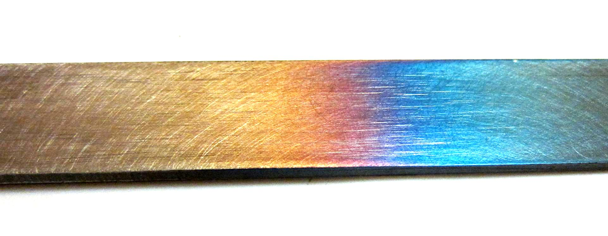
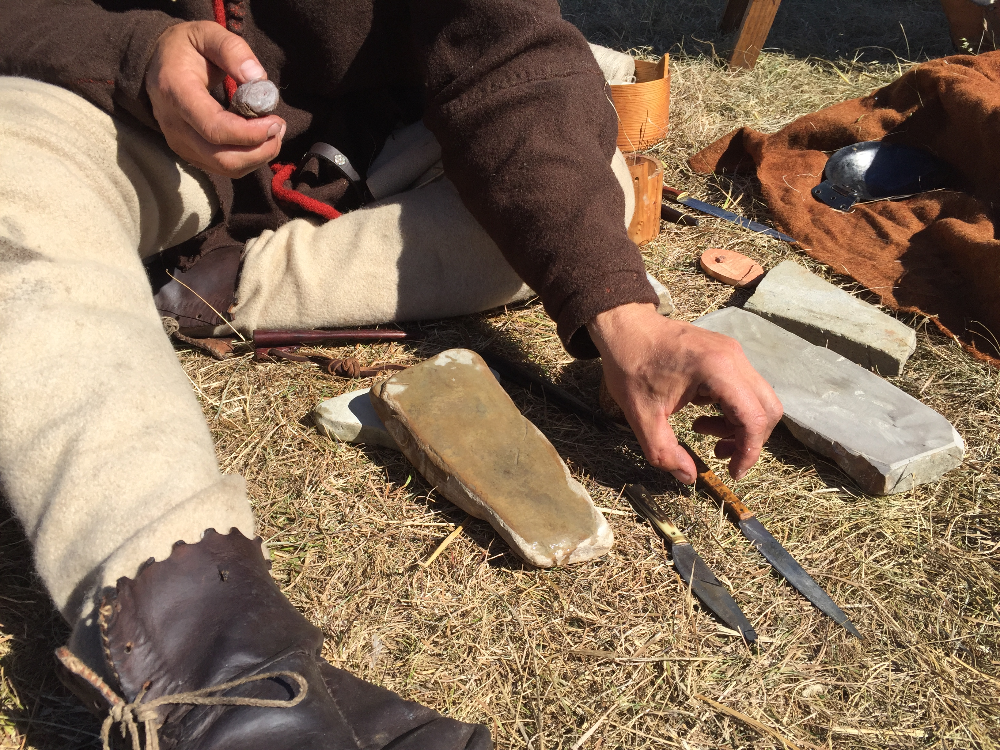

# Basic Metalwork & Tool-Making — Forging, Sharpening & Repair

## Read this first (the 30-second version)
1. **Sharpening is the single highest-value skill here.** A sharp knife, axe, or pair of scissors is safer and more useful than anything you could forge from scratch — learn the stone technique and how to feel for a "burr" before anything else.
2. **Cold metalwork solves most problems with no forge or fire:** cutting, filing, drilling, bending, and riveting scrap metal fixes a hinge, re-haft a tool, or makes a bracket with hand tools alone.
3. **A forge is just three things** — a hearth, a forced-air source, and fuel (lump hardwood charcoal is easiest). An "anvil" can be scrap steel or a section of railroad rail; it doesn't need to be a real blacksmith's anvil.
4. **Only carbon (tool) steel hardens and tempers by heat** — old files, leaf springs, and some saw blades qualify; mild steel, rebar, and most modern hardware steel cannot, no matter how you heat and quench it.
5. **Always wear eye protection before you strike, grind, or cut metal**, and never work bare-handed near hot steel, sparks, or a quench bucket that can flash into flame.
6. **Know when to call a professional.** Forge-welding and structural welding (frames, load-bearing hinges, anything a life depends on) take years to learn safely — this guide tells you where that line is.

---

## Why this matters
When stores and repair shops are unreachable, every tool has to last, and every hinge, blade, and bracket that breaks has to be fixed with what's on hand. Most of that work needs **no forge**: a dull knife, an axe that won't bite, or a rusted-shut hinge are solved with a stone, a file, and a wrench. Going further — building a simple forge and learning to draw out, bend, punch, and heat-treat steel — lets you make replacement hardware (nails, hooks, tent stakes, simple blades) from scrap that's otherwise useless: an old leaf spring, a broken file, a length of rebar. None of this requires becoming a professional smith or welder — it requires patience, good safety habits, and knowing which small skill below actually fits the problem in front of you.

## Key terms (plain language)
- **Bevel / edge angle** — the angled surface ground onto an edge; a smaller angle is sharper but more fragile, a larger one is tougher but cuts worse.
- **Burr (wire edge)** — a thin curl of metal pushed to the back of an edge during sharpening; feeling for it tells you a bevel is fully ground.
- **Grit** — abrasive coarseness: low numbers (100–400) remove metal fast and fix damage; high numbers (1000–8000) polish.
- **Mild steel** — common low-carbon steel (most rebar, angle iron, hardware). Easy to forge, won't crack, but **cannot be hardened**.
- **Carbon/tool steel** — steel with enough carbon (roughly 0.5%+) to respond to hardening/tempering. Old files, many leaf springs, older saw blades.
- **Anneal** — soften hardened steel by heating it and cooling it very slowly (buried in ash) so it can be filed, drilled, or forged without cracking.
- **Harden (quench)** — heat carbon steel to its critical temperature, then cool it fast (oil or water) to make it hard and brittle.
- **Temper** — a gentler reheat after hardening that trades a little hardness for toughness. Skipping it leaves tools dangerously brittle.
- **Forging moves** — **drawing out** (thinning/lengthening), **upsetting** (thickening/shortening), **bending**, **punching** a hole.
- **Scale** — flaky black oxide on hot steel; brush it off, don't hammer it in.
- **Tuyere** (TWEE-yer) — the pipe/opening that feeds air into a forge fire.
- **Flux** — keeps oxygen off hot metal so a joint can bond (borax for forge-welding; paste/liquid flux for solder and braze).
- **Solder / braze / weld** — three joining strengths, weakest to strongest: solder melts only a low-temperature filler; braze melts a hotter brass/bronze filler onto un-melted base metal; weld actually fuses the base metals together.

---

# PART 1 — SHARPENING (the highest-value skill here)

Almost every dull-tool problem — knife, hatchet, chisel, scissors — is solved the same way: **hold a consistent angle, grind until a burr forms along the whole edge, then remove that burr.**

## How a stone works
A stone (natural, ceramic, or diamond) is a controlled abrasive. Coarse grit resets damage; fine grit polishes an edge already established. Water stones need wetting, oil stones need honing oil, diamond stones can be used dry. What matters most is holding the angle and progressing coarse → fine.

```
        SIDE VIEW — holding a consistent sharpening angle

        blade -->  \
                     \___ this angle stays constant
                        \    while you stroke
   ═══════════════════════\═══════════════════  <- stone (flat)

   Typical angle guide (per side, from the blade centerline):
     Straight razor / fillet knife . . 10-15°  (sharp, fragile)
     Kitchen / pocket knife  . . . . . 15-20°
     Hunting / camp knife  . . . . . . 20-25°
     Axe / hatchet, wood chisel . . .  25-30°
     Scissors  . . . . . . . . . . . . one bevel/blade, ~40-70°
```

**Field trick for judging an existing angle:** lay the blade flat on the stone, then tilt the spine up until the bevel just lifts and contacts evenly — that's roughly the angle to match.

## Method 1 — Knife on a stone
**You need:** a stone (or improvised substitute below), water/oil as the stone requires.
1. Wet/oil the stone; start on the coarsest grit the edge needs.
2. Lay the blade at your angle and draw it **edge-first** across the stone, as if slicing a thin layer off the surface, light-to-moderate pressure. Push away, lift, reset — don't drag the edge backward into the stone.
3. Alternate sides evenly (e.g., 10 strokes per side), angle constant.
4. **Feel for the burr:** run a fingertip carefully along the spine toward the edge (never along the edge) on the side opposite where you're stroking. A burr feels like a tiny continuous ridge running the full length. Don't move on until you feel it edge-to-edge.
5. Once one side has a full burr, flip and raise it on the other side.
6. Step up through finer grits with lighter passes — this refines, it doesn't re-shape.
7. **Remove the burr** with several very light alternating strokes, pressure easing toward zero, or by stropping.
8. **Test:** it should shave arm hair or slice paper cleanly. If it just slides, go back to step 2.

**Stropping:** draw the blade **backward** (spine-leading, edge trailing) across leather, cardboard, or denim — a few light passes per side. This is the standard last step after any stone.

## Method 2 — Axe or hatchet
Axes use a thicker, more obtuse edge (25–30°/side) built to survive impact, not slice.
1. Secure the head (clamp, or brace the poll on your knee/a block).
2. Use a round/puck stone in a circular motion following the curve, or a flat stone in short arcs.
3. Alternate sides at the same angle until a burr runs the full edge.
4. Finish with light strokes or a strop.
5. **Nicked/rolled edge:** reset it with a coarse stone or bastard file first (files cut on the push stroke only — lift on the return).

## Method 3 — Chisels and plane irons
These use a **single bevel on one face only** — the back stays perfectly flat.
1. Flatten the back occasionally on a coarse-to-fine progression; never round it over.
2. Grind the bevel (25–30°) the same way as a knife, keeping the back off the stone entirely.
3. Raise a burr on the flat back, remove it with the back held dead flat on the finest stone.
4. Strop both faces to finish.

## Method 4 — Scissors and shears
1. Disassemble at the pivot if possible; otherwise open fully to expose each bevel.
2. Sharpen only the **outer bevel** of each blade at its existing (steep, 40–70°) angle — never the flat inner faces that slide against each other.
3. A few light, even strokes per blade is enough; remove any burr with light flat passes on the inner face.
4. Test on scrap paper/cloth; a jam usually means the pivot screw needs adjusting, not more grinding.

## Improvised sharpening surfaces
- **Unglazed base of a ceramic mug/plate or bathroom tile** — a decent fine-grit substitute.
- **Broken glass edge (car window, bottle)** — an effective ultra-fine final polish; handle carefully.
- **Concrete or flat sandstone** — coarse, for resetting a badly damaged edge.
- **Sandpaper taped to a board or glass** — step through grits (80 → 220 → 600 → 1000+) exactly like stones.
- **A worn leather belt, back side out**, for stropping, with a dab of toothpaste or polishing compound.

> ⚠️ A dull blade is more dangerous than a sharp one — it slips and needs more force, which is how most cuts happen. Re-sharpen before it gets that bad.

---

# PART 2 — COLD METALWORK (no forge needed)

Most repairs — a loose hinge, a cracked bracket, a broken handle fitting — need only hand tools at room temperature.

## Cutting
- **Hacksaw:** fine blade (24–32 TPI) for thin sheet/tube, coarser (14–18 TPI) for solid stock; keep at least 3 teeth in contact at all times. Let the saw's weight do the work.
- **Cold chisel + hammer:** score a line around the piece, then deepen it in passes rather than trying to cut through in one strike.
- **Angle grinder with cutoff wheel:** fast, but the highest-risk tool here for kickback and thrown sparks — full face shield, gloves, long sleeves, no exceptions.
- **Bolt cutters / tin snips** for wire and sheet metal.

## Filing
Files cut on the push stroke only — lift clear on the return (dragging dulls the file). Use a coarse (bastard) file to remove material fast, then a fine file to true the surface. Clean the teeth often with a wire brush; secure the work in a vise rather than filing freehand.

## Drilling
1. **Center-punch** the location so the bit doesn't wander.
2. Drill a small pilot hole first for anything beyond a small hole in steel.
3. **Oil the bit** (cutting oil, or any household oil) — dry drilling in steel overheats and dulls it fast.
4. Steel wants lower speed and steady pressure than wood; a smoking or blue-turning bit means slow down and add oil.
5. Clear metal chips often (they're sharp) and back the bit out periodically on deep holes.

## Bending
- **In a vise:** clamp at the bend line, lever over with a pipe slipped over the free end, or hammer progressively.
- **Around a fixed point:** wrap stock around a pipe or anvil edge for a curve, for thinner material.
- **Simple jig:** two bolts set in a heavy board, spaced slightly wider than the stock — lever the stock around one bolt using the other as a fulcrum.
- Cold bending work-hardens metal (stiffer and more brittle each flex) — repeated bends in one spot can snap it; heat (Parts 3–4) makes repeated or heavy bending easier and safer.

## Riveting
1. Drill matching holes through both pieces, sized to the rivet shank.
2. Insert the rivet (solid rivet, or an improvised one cut from a nail/bolt shank) so it protrudes evenly both sides.
3. Back one head firmly against a solid steel surface.
4. **Peen** the other end: strike the center first to start it mushrooming, then work around the rim to spread it into an even dome.
5. If the joint wobbles, the rivet was too loose or wasn't fully upset — redo with a snugger fit.
6. **Pop rivets** (with a rivet gun) are faster for sheet metal and only need one-side access.

## Fasteners
Salvage nuts, bolts, washers, and screws from old furniture/appliances before buying new. Match the fastener to the job (wood screws for wood, machine screws/bolts for metal-to-metal, self-tappers for sheet metal without a nut behind it). Start any nut/bolt by hand — if it binds immediately, back out and realign rather than forcing it. No matching fastener on hand: a bent nail substitutes for a cotter/hinge pin, and twisted wire (baling wire, coat-hanger) lashes or temporarily secures almost anything. A stripped screw hole in wood is fixed by packing it with glued splinters/toothpicks, letting it set, and re-driving the screw.

## Repairing common tools and hinges
- **Loose axe/hammer handle:** re-drive the existing wedge deeper, or add a new one (wood or a cut nail) into the kerf. Soaking the head-end overnight swells the wood as a short-term fix only — plan a proper re-wedge or re-haft soon (see the [Tools, Knots & Repair guide](../tools-knots-repair/tools-knots-repair.md) for haft-fitting technique).
- **Rusted-shut hinge:** work penetrating oil into the pin, tap it loose, work it back and forth, re-oil.
- **Broken hinge leaf or pin:** drill out the broken pin and replace it with a cut nail/bolt shank of matching diameter; reinforce a cracked leaf by riveting or bolting a scrap-steel strap across the crack.

---

# PART 3 — SETTING UP AN IMPROVISED FORGE

A forge does one job: hold fuel at a much higher temperature than an open fire can reach, by forcing air through it. You need only a **hearth**, an **air source**, and **fuel** — plus a hard surface (an "anvil") to hammer against.

> ⚠️ A real jump in effort, cost, and risk compared with Parts 1–2. Read the Safety section before you light anything.

## The hearth
- **Brake-drum forge (classic beginner build):** an old brake drum on a stand (pipe-leg tripod or concrete blocks), with a hole for the air pipe (tuyere) in the drum floor; ash/clinker fall or are raked out.
- **Ground forge/firepot:** a shallow dug bowl in bare dirt or gravel, or a steel pipe/pan set into the ground, with the air pipe entering from the side.
- **Steel wheelbarrow or washtub**, lined with a few inches of dirt/sand for insulation, air pipe through the side near the bottom.

```
     SIDE VIEW — simple brake-drum / firepot forge

           fuel mounded here, work buried
           in the hottest part (near air blast)
                  \   |   /
             ______\__|__/______
            /   charcoal fire    \
           |   (brake drum bowl)  |
            \____________________/
                    |   ^
                    |   |  air blast up through
                ____|___|____   a pipe/tuyere
               |  air pipe   |  from a blower or bellows
               |_____________|
                    ^
              hand-crank blower, bellows, or fan
```

## Air source
- **Hand-crank blower** (old forge blower, or a salvaged squirrel-cage fan) — the traditional, most controllable option.
- **Double-lung bellows** (hinged boards with a leather/canvas bag between, one-way valves) — works, takes practice to build and pump.
- **A shop-vac or hair dryer on "cold/no-heat" fan only, throttled with a damper** — workable, but a heat setting can melt the housing; never leave the unit itself near flame or sparks.
- **Hand-fanning** (stiff cardboard) nurses a small fire for light work but tires fast and won't sustain real forging.

## Fuel
**Lump hardwood charcoal** (grill charcoal, or homemade — see the [Fire guide](../fire/fire.md)) is the easiest beginner fuel: lights easily, hot enough for small-to-medium stock, little smoke or clinker. **Do not use briquettes** — their binders and fillers burn dirty and don't reach forging heat reliably. Blacksmithing coal/coke burns hotter but is harder to source and needs more fire-tending skill; charcoal is the practical starting point. Expect a small fire to burn several pounds of charcoal per hour.

## The "anvil"
A real anvil (flat face, tapered horn, square hardy hole) is nice but not required.
- **A section of railroad rail**, stood on end on a stump — the classic improvised anvil; the flat rail-head top is your working face, and an angled cut section or nearby pipe substitutes for a horn.
- **A sledgehammer head, face-up, sunk into a stump or packed sand/dirt** for small stock.
- **Any heavy flat steel** (plate, I-beam offcut, engine block) mounted solidly so it can't bounce or rock.
- The requirement that matters is **mass and rigidity** — a light or loose anvil soaks up your blows instead of bouncing them back into the work.

```
     SIDE VIEW — railroad-rail anvil on a stump

       flat working face (rail head)
      ┌─────────────────────┐
      │  ▓▓▓▓▓▓▓▓▓▓▓▓▓▓▓▓▓  │ <- rail standing on end,
      │  ▓▓▓▓▓▓▓▓▓▓▓▓▓▓▓▓▓  │    base bolted/wedged into stump
      └─────────┬───────────┘
                 │
          ═══════╪═══════   <- heavy stump/timber base,
            (braced so it can't rock or move)
```

## Basic forge tool kit
Hammer (2–3 lb cross-peen or ball-peen), tongs (or large locking pliers as a substitute), a cutting hardy/cold chisel, a punch, a wire brush to clear scale, a quench bucket (Part 5), and PPE: safety glasses/face shield, leather gloves, a leather or heavy-cotton apron, hearing protection (all detailed in the Safety section).

---

# PART 4 — BASIC BLACKSMITHING MOVES

## Reading the heat
Judge color **in shade or dim light** — direct sun (common in Texas) washes out the color and invites overheating.

| Color | Approx. temp | Meaning |
|---|---|---|
| No glow | below ~900°F/480°C | Too cold — hammering here ("working in the black") cracks the steel. |
| Dark/dull red | ~900–1100°F/480–590°C | Marginal — light bending only. |
| Cherry/bright red | ~1300–1500°F/700–815°C | Good general working range. |
| Orange | ~1600–1800°F/870–980°C | Ideal forging heat — fastest, cleanest shaping. |
| Yellow | ~1800–2000°F/980–1090°C | Very hot, works fast, scales quickly. |
| White, sparking | 2000°F+/1090°C+ | **Danger — the steel is burning.** Pull it out immediately. |

**Rule of thumb:** reheat as soon as color drops below cherry red — cold-hammering is how beginners crack their work.

## Method 1 — Drawing out
Makes a point/taper/longer-thinner section. Heat to orange; hammer near the edges first, working inward, rotating the stock a quarter-turn between blows so it stays even on all sides. Reheat the moment color drops below cherry red rather than forcing more blows from a cooling piece.

## Method 2 — Bending
Heat only the section to bend. Position it exactly over the anvil edge/horn (or a pipe/fork) and lever or hammer it over in one smooth motion. Use the horn for a tight radius, the square edge for a sharp angle. Check the angle warm — it can still be tweaked.

## Method 3 — Punching a hole
Heat the area to orange; punch straight down over the hardy hole (or a punching block) about two-thirds through, then **flip and punch back from the other side** to meet your start — this avoids dragging a ragged slug through from one face. A tapered drift, driven through and rotated, sizes and cleans the hole.

## Method 4 — Upsetting
Heat the end of a bar and strike it straight down, end-on, against the anvil — this thickens and shortens it (for a bolt head, or the head end of a nail) before drawing the rest out.

## Forge-welding — overview only
Joining two pieces by bringing both to near-white heat, fluxing the joint (traditionally borax), and hammering them together fast enough to fuse. **This is genuinely difficult** — precise heat judgment and split-second timing that take real practice to get reliable. It's included here so you know the concept and its limits, not as something to expect to master from a description. If a repair truly needs steel fused, treat it as a job for an experienced smith or use a Part 6 joining method instead.

## Simple beginner projects
- **S-hook:** draw a taper on one end, curl it around the anvil horn; reheat and curl the other end the opposite way.
- **Tent stake:** draw a point on one end of rod stock (rebar works well and needs no hardening); bend a small loop at the other end for a guyline.
- **A simple blade** (from a worn file or leaf spring) is a longer project: anneal first, draw out and shape the bevel/tang, then move to Part 5 for hardening and tempering — treat a first blade as a learning piece, not a tool to depend on.

---

# PART 5 — HEAT TREATING CARBON STEEL

**This only works on carbon (tool) steel.** Mild steel, most rebar, and most modern hardware will not get noticeably harder no matter how you heat and quench them.

## Carbon steel vs. mild steel
- **File test:** mild steel files easily; unhardened carbon steel resists a bit more; already-hardened steel makes the file skate/skip.
- **Spark test (grinder):** long, sparse yellow-orange sparks = mild steel; bright white sparks that fork and burst repeatedly = higher-carbon steel.
- **Likely carbon steel:** old files/rasps, leaf springs, older saw/mower blades, some coil springs. **Likely mild steel:** most rebar, mild angle/flat bar, most new hardware and fence wire.

## Step 1 — Anneal (if starting from a hardened source)
Files and springs usually arrive already hardened and can crack or shatter a drill bit if worked cold. Heat to cherry red and cool it **as slowly as possible** — buried in wood ash or sand overnight — before shaping.

## Step 2 — Hardening
1. Shape and finish the piece first — hardened steel is very hard to file or drill.
2. Heat evenly to the critical (non-magnetic) temperature: hold a magnet to it — around **1400–1450°F/760–790°C** it stops attracting. Close enough to the hardening point for most carbon steels.
3. **Quench immediately**, moving the piece slightly to break the vapor pocket around it.
   - **Oil** (plain vegetable oil, or purpose-made quenching oil) is beginner-friendlier — slower cooling cracks fewer pieces.
   - **Water** cools faster (harder) but cracks thin/complex shapes much more often — save it for simple, thick shapes once you have experience.
   - Never quench in a sealed or narrow-necked container.
4. Test with a file: it should skate, not bite. If it still bites, the piece didn't reach temperature, wasn't quenched fast enough, or isn't carbon steel.

> ⚠️ **Oil can flash into flame at the quench surface** — quench outdoors, use a metal container with a lid nearby to smother a flare-up, and keep well clear of anything you'd quench in water.

## Step 3 — Tempering (never skip this)
A just-quenched piece is hard but dangerously brittle. Tempering trades a little hardness for the toughness that makes it safe to use.
1. Polish the surface near the edge so temper colors are visible.
2. Reheat gently and evenly (oven, low flame held back, or near — not in — the forge fire), watching for a color band creeping along the polished surface.
3. **Quench again the instant the right color reaches the edge**, to lock in that temper.

| Temper color | Approx. temp | Typical use |
|---|---|---|
| Very pale/light straw | ~380–400°F/195–205°C | Scrapers, razors — hardest, most brittle |
| Straw/dark straw | ~440–460°F/225–240°C | Punches, drill bits |
| Bronze/brown | ~460–480°F/240–250°C | Axes, wood chisels |
| Purple/brown-purple | ~500–520°F/260–270°C | Knives, cold chisels — good all-around temper |
| Dark blue | ~540°F/280°C | Screwdrivers |
| Bright blue | ~560°F+/295°C+ | Springs, wrenches — toughest, softest |

*Approximate and alloy-dependent — treat as a starting guide, and test the finished edge before trusting it.*

## Mild steel and forged (not hardened) pieces
Rebar and other mild-steel items (stakes, hooks, brackets) don't need — and can't usefully receive — hardening or tempering. Their strength comes from toughness and good forging technique, not heat treatment. Save Part 5 for pieces that are actually carbon/tool steel and need a hard edge.

---

# PART 6 — JOINING METAL: rivets, wire, solder, braze, weld

| Method | Strength | Equipment | Best for |
|---|---|---|---|
| Wire twisting/lashing | Weak, temporary | Pliers, wire | Quick field fixes, cracked handles, temporary hinges |
| Riveting | Strong, permanent | Drill, hammer, rivets (or nails/bolts) | Handle repairs, hinge straps, sheet-metal patches — no heat |
| Soldering | Weak-to-moderate | Iron/torch, solder, flux | Thin sheet, small electrical/plumbing joints — not load-bearing |
| Brazing | Moderate-to-strong | Torch, brass/bronze rod, flux | Dissimilar metals, cast-iron repairs, thin steel |
| Forge-welding | Strong, if done well | Forge, flux, hammer, practice | Traditional smith joins — hard to learn alone (Part 4) |
| Arc/MIG/oxy-fuel welding | Strongest | Welder or gas set, PPE, training | Structural/load-bearing repairs — a professional's job |

Soldering melts only the filler metal at a low temperature (~360–450°F/180–230°C) onto clean, fluxed metal — fine for small, low-stress joints, useless under real load. Brazing melts a brass/bronze rod at a much higher temperature (~1600–1700°F/870–930°C) into a fluxed joint without melting the base pieces — considerably stronger, and practical for thin steel, cast iron, or dissimilar metals if you have a suitable torch. Welding actually fuses the base metals and gives the strongest joint, but needs dedicated equipment, real training, and serious PPE (auto-darkening helmet, heavy gloves, flame-resistant clothing) beyond improvised, self-taught work.

> ⚠️ **For anything structural or load-bearing** — a vehicle frame, a gate hinge under real weight, a ladder — get a professional welder or experienced smith to do or check it. A weak joint can look fine and fail without warning.

---

# PART 7 — SALVAGING AND IDENTIFYING USEFUL STEEL

- **Leaf springs** (vehicle suspensions, junkyards) are widely available carbon/spring steel, good for blades, chisels, and punches once annealed and re-shaped — they arrive already hardened/tempered, so anneal (Part 5) before hard cold work.
- **Old files and rasps** are usually high-carbon tool steel, excellent for small blades and punches — grind off the old teeth and anneal first, since they're hard and brittle as-is. Avoid chrome-plated files if identifiable (toxic fumes when heated).
- **Rebar** is almost always mild steel: forgiving, won't crack, but won't hold a hardened edge — good for stakes, hooks, brackets, not blades.
- **Old saw/mower blades and some coil springs** are often usable carbon steel.
- **Quick field ID:** the Part 5 file test and spark test work on any unknown scrap before you invest time shaping it.

---

# North Texas / Anna, TX regional notes
- **Scrap sourcing:** ranch/farm country means old leaf springs, disc-harrow blades, worn files, and rebar offcuts turn up at rural scrapyards, farm sales, and metal-recycling drop-offs; many rural properties already have a scrap pile in a barn or fence row.
- **Charcoal is easy to buy locally** even when smithing coal isn't — a practical reason to start with the charcoal-forge methods in Part 3.
- **Burn bans and grass-fire risk:** North Texas blackland prairie is drought- and grassfire-prone. Check for an active county burn ban, clear a wide bare-dirt/gravel pad around the hearth, and keep water and a rake on hand — see the [Fire guide](../fire/fire.md).
- **Summer heat:** forge work adds real heat on top of already-brutal Texas summers — work early morning or evening, take shade/water breaks, and watch for heat-illness signs (see [Extreme Heat & Cold](../extreme-heat-cold/extreme-heat-cold.md)).
- **Rural farriers and hobby smiths** are more common here than in dense urban areas — a realistic source of hands-on teaching for anything beyond this guide.

---

# ⚠️ Safety — the most important warnings
- **Eye protection is non-negotiable.** Wear safety glasses or a face shield any time you strike, grind, cut, or work near a forge fire — flying scale and sparks cause permanent eye injury instantly.
- **Hot steel looks identical to cold steel.** Treat every piece near a fire as hot until confirmed otherwise, and never grab a workpiece or hearth surface bare-handed. Radiant heat burns skin at a distance too — cover up.
- **Ventilation and fumes:** never run a charcoal/coal forge in an enclosed space — carbon monoxide is odorless and can kill without warning. Never heat galvanized (zinc-coated) or chrome-plated scrap without maximum ventilation — the fumes are toxic.
- **Quench-fire risk:** oil can flash at the surface — keep a lid within reach, quench outdoors, and stay clear of dry grass or other fuel.
- **Hearing protection:** hammer-on-anvil and grinder noise causes cumulative damage — wear earplugs for extended sessions.
- **Stored energy in scrap:** leaf springs and coil springs hold real mechanical energy cold — clamp them down and cut/bend slowly, watching for sudden movement.
- **Don't work alone on anything risky** if you can avoid it.
- **Know your limits:** forge-welding, structural welding, and anything load-bearing or life-safety-related belong to an experienced smith or certified welder — this guide is for small repairs and simple projects, not a substitute for that expertise.

# Troubleshooting
| Problem | Fix |
|---|---|
| Edge won't get sharp | No burr yet — check by feel on the opposite side; if there's none, check your angle and pressure. |
| Edge chips/rolls right after sharpening | Angle too shallow for the tool's use — increase it slightly and re-grind. |
| Scissors won't cut after "sharpening" | You likely ground the flat inner face by mistake; also check the pivot screw tension. |
| Drill bit smoking/blue in steel | Too fast or too much pressure, no lubricant — slow down, add oil, let it cool. |
| Forge fire won't get hot enough | Not enough air — check the tuyere isn't blocked, increase air flow, use lump charcoal (not briquettes). |
| Steel keeps cracking when hammered | Too cold ("working in the black") — reheat to at least cherry red. |
| Steel sparking/burning in the fire | Overheated (white heat) — pull it out and let it cool into range; it may already be damaged. |
| Hardened piece isn't actually harder | Not carbon steel, didn't reach temperature, or wasn't quenched fast enough — test with file/spark test first. |
| Blade shatters/chips after hardening | Never tempered (or tempered too pale) — reheat to a darker color and re-quench. |
| Riveted joint wobbles | Rivet too loose or not fully peened — redo with a snugger fit, peen the full rim. |
| Soldered joint fails under load | Solder is too weak for the job — use brazing, a rivet/bolt, or a real weld instead. |

# Quick-reference checklist
- [ ] Learned to feel for a burr and sharpen a knife/axe at the correct angle before anything else.
- [ ] Have a sharpening stone or know an emergency substitute (mug base, sandpaper, concrete).
- [ ] Can cut, file, drill, bend, and rivet scrap metal with basic hand tools.
- [ ] Understand a forge only needs a hearth, forced air, and fuel — and an anvil can be scrap steel or rail.
- [ ] Know the color-to-temperature working range (dark red too cold, orange ideal, white/sparking = burning).
- [ ] Can tell carbon steel from mild steel with the file/spark test before trying to heat-treat anything.
- [ ] Know the hardening (non-magnetic, quench) and tempering (color, re-quench) sequence, and never skip tempering.
- [ ] Have eye protection, gloves, and a ventilation plan before lighting any forge.
- [ ] Know which joining method (rivet/wire/solder/braze/weld) fits the strength the repair actually needs.
- [ ] Know the point where a job needs a real welder or smith instead of improvising further.

# Sources & further reading (in this knowledge base)
- **US War Department TM 10-440, "The Blacksmith and the Welder" (1941)** — `reference/manuals/tm10-440_blacksmith_and_welder_1941.pdf`. Forge/anvil setup, hand-forging operations, heat colors and heat-treating, tool dressing, and a welding overview; the primary reference for Parts 3–6.
- **US Army Survival Manual FM 21-76** — `reference/manuals/fm21-76_survival_manual.pdf` (general tool-improvisation and field-craft context).
- **Primitive Skills and Crafts** (reference manual) — `reference/manuals/Primitive_Skills_and_Crafts.pdf` — primitive/no-metal tool-making that complements this guide's metal focus.
- See also: [Tools, Knots & Repair](../tools-knots-repair/tools-knots-repair.md) (the general toolkit, knots, handle/haft repair), [Fire](../fire/fire.md) (fire-building and charcoal basics), [Clothing, Footwear & Personal Protection](../clothing-footwear-protection/clothing-footwear-protection.md) (eye protection, gloves, PPE), [Extreme Heat & Cold](../extreme-heat-cold/extreme-heat-cold.md) (working safely in North Texas summer heat), and the [North Texas regional guide](../regional-north-texas/regional-north-texas.md).

---


*Figure — A blacksmith working at an anvil, hammer in one hand and tongs holding the workpiece in the other — the same basic stance and tool pairing described in Parts 3–4, whether your anvil is a real one or a section of railroad rail. Source: Wikimedia Commons (File:Blacksmith at anvil.JPG), photo by Trewin, CC BY-SA 3.0.*


*Figure — Temper colors forming on a polished strip of carbon steel as it is gently reheated after hardening — pale straw (hardest/most brittle) progressing through bronze and purple to blue (toughest/softest) as temperature climbs, matching the table in Part 5. Source: Wikimedia Commons (File:Tempering colors in steel.jpg), photo by Zaereth, CC0/public domain.*


*Figure — A set of natural sharpening stones in coarse, medium, and fine grades, illustrating the coarse-to-fine progression in Part 1: reset a damaged edge on the coarsest stone, then refine and polish through progressively finer stones. Source: Wikimedia Commons (File:Knife sharpening stones.jpg), photo by bjornfalkevik, CC BY-SA 4.0.*
