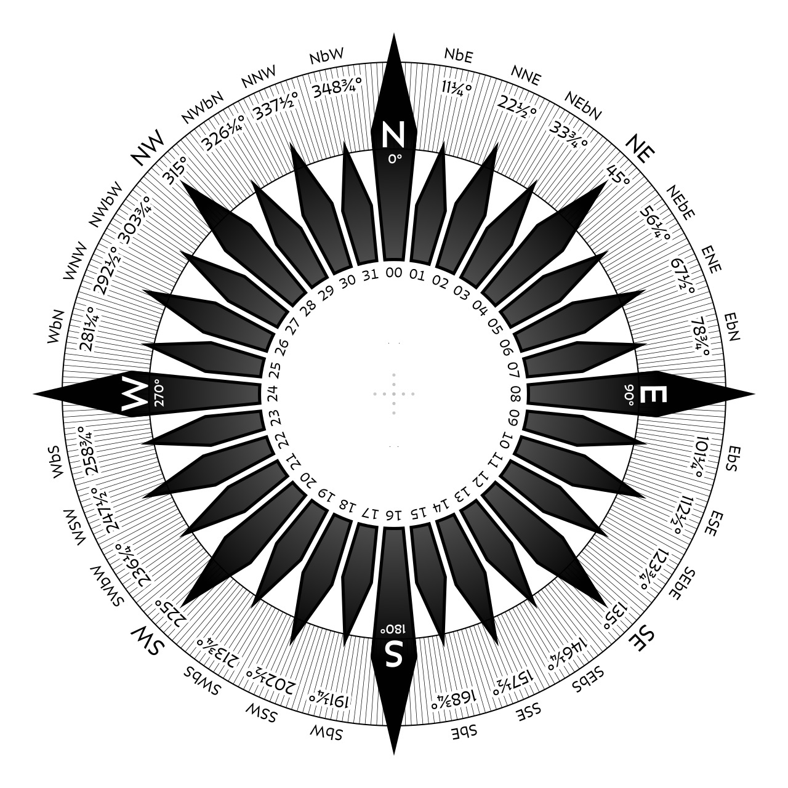
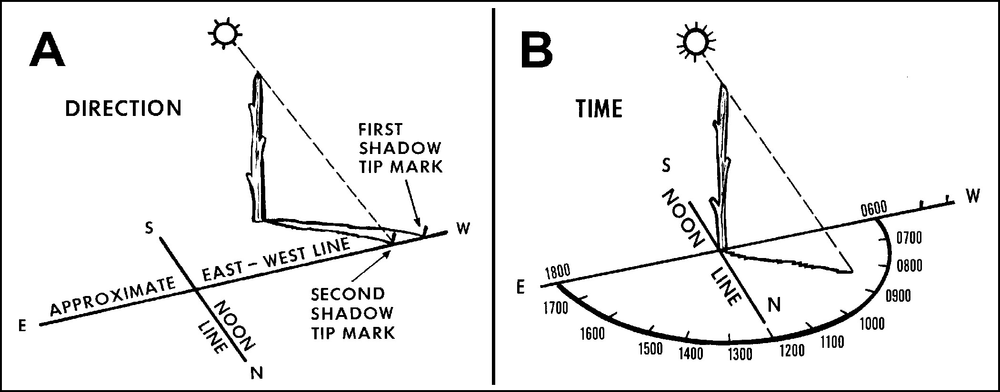
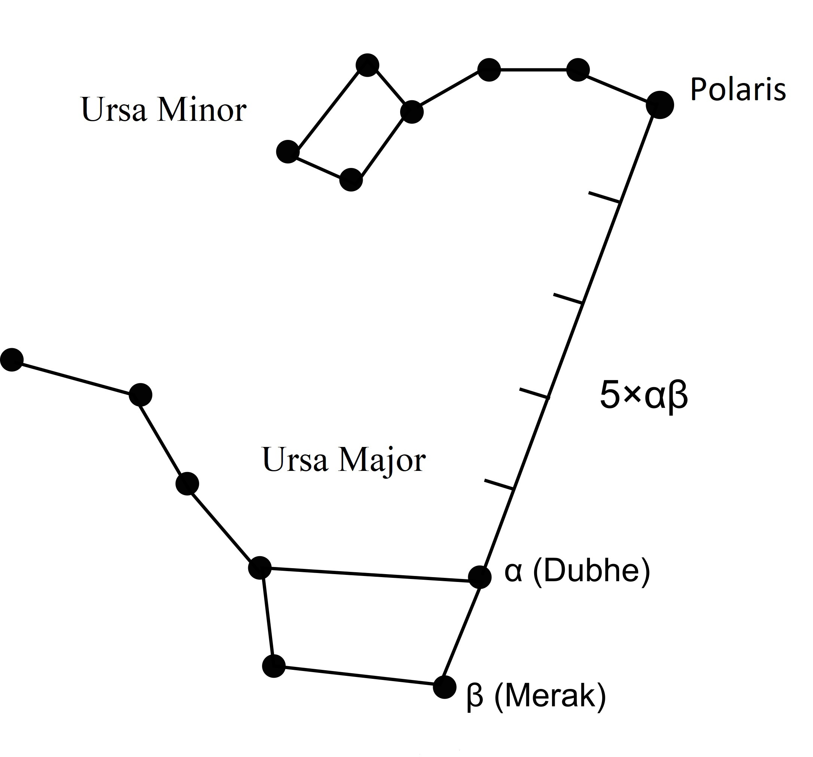

# Navigation Without GPS

## Read this first (the 30-second version)
1. **The instant you realize you are lost or turned around: STOP.** Stop walking. Think. Observe. Plan. Panicked movement is the single biggest cause of people getting more lost and using up the daylight, water, and energy that rescuers need you to still have.
2. **In most cases, staying put is safer than wandering.** If people know where you are headed and when you're due back, staying near a visible spot (a clearing, a trail, a stream) and signaling is usually smarter than blundering deeper into unfamiliar terrain.
3. **If you must move, you need a direction and a way to hold it.** A compass is best. Without one: the sun, the stars (Polaris at night), or a shadow stick will all give you true or approximate direction. None require batteries or signal.
4. **Track your own movement.** Count your paces, use landmarks ("handrails"), and mark your trail so you can retrace it or tell rescuers exactly where you went.

The rest of this guide gives you the STOP protocol, how to use a map and compass correctly (including magnetic declination), the shadow-stick method, sun and star direction-finding, natural sign clues (and their myths), pace counting and dead reckoning, and how to build an improvised compass. **A person who has never navigated before can follow it.**

---

## Why this matters
Getting lost is rarely one big mistake — it's a string of small ones: not looking back at the trail, following a game path, cutting through brush "to save time," walking after dark. Once you're disoriented, panic makes it worse: people walk in circles (studies show most people, without a direction reference, drift into a curved path within an hour), backtrack the wrong way, or push into rougher terrain trying to "get somewhere." Search-and-rescue statistics consistently show that people who stop moving and stay visible are found faster than people who keep wandering. At the same time, knowing how to find true or approximate direction — with a compass or without one — lets you make a deliberate, informed choice about whether to stay or move, and if you move, to move in a straight, trackable line instead of in circles. Good navigation is not about being clever; it's about being systematic.

## Key terms (plain language)
- **STOP** — Stop, Think, Observe, Plan. The first mental drill the moment you suspect you're lost.
- **Bearing (azimuth)** — a direction expressed in degrees, 0–360°, measured clockwise from north (000° = north, 090° = east, 180° = south, 270° = west).
- **True north** — the direction to the geographic North Pole (where lines of longitude meet). Maps are drawn to true north.
- **Magnetic north** — the direction a compass needle actually points, toward the Earth's shifting magnetic north pole.
- **Magnetic declination** — the angle (in degrees) between true north and magnetic north at your location. It varies by place and changes slowly over years. Ignoring it can put you a mile or more off course over a long distance.
- **Orienting a map** — rotating a map so its "north" lines up with actual north, so features on the map point the same way as the real terrain.
- **Dead reckoning** — figuring your position by tracking direction traveled and distance covered from a known starting point, without landmarks.
- **Pace count** — the number of steps (usually counted every time your **same** foot — e.g., left — touches the ground) it takes you to walk 100 meters; used to estimate distance traveled.
- **Handrail** — a linear feature (road, ridge, fence line, power line, stream) that you can follow or use to keep yourself oriented.
- **Catching feature (backstop)** — a large, hard-to-miss feature (a highway, a river, a lakeshore) beyond your target that tells you "if you hit this, you've gone too far — turn back."
- **Circumpolar / pole star** — a star that appears to stay in roughly the same spot while other stars wheel around it, because it sits near the axis the sky appears to rotate on. In the Northern Hemisphere, that's **Polaris**.

## What you need
**Ideal kit (any subset helps):**
- Baseplate or lensatic compass
- Topographic map of your area (paper, waterproofed or in a ziplock bag)
- Analog (hands-and-face) wristwatch
- Small notebook and pencil, or flagging tape/surveyor's tape
- Whistle (for signaling while you figure out direction — see the signaling-rescue guide)

**If you have none of that, you can improvise with:**
- A straight stick about 1 meter (3 ft) long, and two smaller marker sticks or stones (for the shadow-stick method)
- A sewing needle or straight pin, a magnet (or silk/wool cloth, or hair), and a small container of still water with a leaf or bit of cork (for a floating improvised compass)
- Your own two hands and eyes — the sun, shadows, and (at night) the stars cost nothing and are almost always available

---

## Method 1: STOP — the first thing to do when you realize you're lost
This is not optional and comes before any direction-finding.

1. **Stop.** Sit down if you can. Do not take another step until you've thought this through. The urge to "just keep going and see what's over there" is the thing that turns "temporarily misplaced" into "seriously lost."
2. **Think.** When did you last know for certain where you were? How long ago, and roughly how far and in what direction have you traveled since then? Do you have water, extra layers, a light source, and daylight left?
3. **Observe.** Look around for anything familiar — a sound (traffic, water, people), a trail, a distinctive landform, the position of the sun. Check your immediate surroundings for hazards (weather coming in, unstable ground, dropping temperature) before you decide anything.
4. **Plan.** Decide, deliberately, between three options:
   - **Stay put** (usually the right call if someone knows your plans and when you're overdue, if it's getting dark, if weather is turning, or if you're injured or exhausted).
   - **Try to retrace your exact path** back to the last known point (only if you're confident you can identify it and daylight/energy allow).
   - **Move deliberately toward a known catching feature** (a road, ridgeline, or river you're sure lies in a specific direction) using one of the direction-finding methods below — only if staying put is clearly worse (no one expects you, no shelter, no water).

**How to verify:** Before moving at all, you should be able to state out loud (or write down) which of the three options you picked and *why*. If you can't articulate a reason, you're not ready to move — sit back down and observe longer.

---

## Method 2: Map and compass
This is the most accurate method when you have both tools, and it works in any weather, day or night.


*Figure — A compass rose showing all 32 traditional directional points and their abbreviations (N, NbE, NNE, NEbN, NE, NEbE, ENE, EbN, E... around the full circle), each labeled with its compass-card position (00–31) and degree bearing (e.g., NE = 045°), the same layout used on nautical charts and printed in the corner of many topographic maps. Use it to translate between compass-degree bearings (Method 2) and plain-language directions (e.g., "northeast" = 045°). Source: Wikimedia Commons (File:Compass-rose-32-pt.svg), JamesLucas, CC BY-SA 4.0.*

### Parts of a baseplate compass
```
        Direction-of-travel arrow
                  |
                  v
        +-------------------+
        |     [ index line ]|
        |    ,-------.      |
        |   /  N       \    |   <- rotating bezel
        |  |  W    E     |  |      (marked 0-360 deg)
        |   \    S      /   |
        |    `-------'      |
        |   [ orienting     |
        |     arrow/lines ] |  <- inside the bezel, fixed to it
        |                   |
        |   magnetic needle |  <- red end points to magnetic north
        +-------------------+
              baseplate
        (clear plastic, has a ruler
         edge for measuring on maps)
```
- **Baseplate** — the clear plastic base; its straight edge is used to draw or align lines on a map.
- **Direction-of-travel arrow** — molded into the baseplate, points where you will walk.
- **Rotating bezel (dial)** — marked 0–360°; turns independently of the baseplate.
- **Orienting arrow / orienting lines** — inside the bezel, rotate with it; used to line up with north on the map or with the magnetic needle.
- **Magnetic needle** — the free-spinning needle; the red (or luminous) end points to magnetic north.

### Taking a bearing to a visible object
1. Hold the compass flat and level in front of you, roughly at chest height.
2. Point the direction-of-travel arrow straight at the object you want a bearing to.
3. Without moving the baseplate, turn only the bezel until the orienting arrow lines up exactly under the red (north) end of the magnetic needle — "put red in the shed."
4. Read the number on the bezel at the index line. That is your bearing in degrees.

### Following a bearing (walking a known bearing)
1. Turn the bezel to the bearing number you want to walk (line it up with the index line).
2. Hold the compass flat, then turn your **whole body** (not just the compass) until the red needle sits inside the orienting arrow — "red in the shed" again.
3. The direction-of-travel arrow now points the way to walk. Pick a landmark in that exact line (a tree, rock, distinct bush) and walk to it — don't stare at the compass while walking, you'll wander.
4. At the landmark, repeat: sight a new landmark on the same bearing and walk to it. This "leapfrogging" keeps you on a straight line through obstacles like thick brush.

### Magnetic declination — why it matters
Magnetic north and true north are not the same place, and the difference (declination) can be 0° to over 20° depending on where you are on Earth. Topographic maps print the local declination in the margin (e.g., "12° E" or "6° W").
- **Compass (magnetic) bearing → true/map bearing:** **ADD an East declination** (or **subtract a West declination**).
- **True/map bearing → compass setting to walk:** **SUBTRACT an East declination** (or **add a West declination**). ("East is least, subtract" is the memory aid for this map-to-compass direction.)
- **Simplest fix:** many compasses let you physically set the declination once (a small adjustment screw) so afterward "red in the shed" already accounts for it automatically.
- For short trips or emergency travel, a few degrees of error rarely matters — but over several kilometers it can put you a mile or more off target, so account for it whenever you have a map bearing to follow to a specific point.

### Orienting a map
1. Lay the map flat.
2. Place the compass on the map with the baseplate's edge along a north-south grid line, direction-of-travel arrow pointing to the top of the map.
3. Turn the whole map (with compass still on it) until the magnetic needle's red end lines up with the orienting arrow, adjusted for declination.
4. The map now points the same way as the real world — features to your left on the map are to your left in reality.

**How to verify:** Take a bearing to a landmark you can identify on the map (a hilltop, tower, road junction). Walk 50–100 meters and take the bearing again. If you moved correctly, the landmark's bearing should have shifted in a way consistent with your travel direction, and your position, plotted from two bearings (resection), should land near where you actually are.

---

## Method 3: The shadow-stick method (no compass needed)
Works anywhere the sun casts a visible shadow, even through light cloud.


*Figure — Official U.S. military illustration of the stick-and-shadow method: push a stick upright into the ground, mark the tip of its shadow, wait, mark the shadow tip again after it has moved, and the line connecting the two marks runs east-west (first mark west, second mark east), letting you derive north-south. Source: Wikimedia Commons (File:Stick and Shadow Method.jpg), U.S. Armed Forces (from FM 21-76-1 / MCRP 3-02H / NWP 3-50.3 / AFTTP(I) 3-2.26, *Survival, Evasion, and Recovery*, 1999), Public Domain (U.S. government work).*

```
Step 1              Step 2 (~15-20 min later)     Step 3
                                                    
    O sun                O sun (moved)                 
     \                    \                        W-----+-----E line
      \                    \                        \    |
   ----+---- stick     ----+----                     \   |
       |                   |  \                        \ |
       |mark A             |mark A  mark B               X <- first mark (A)
       |(tip of shadow)    |     (new tip of shadow)     line from A to B
   ground                ground                          runs roughly
                                                           EAST-WEST
```
1. Push a straight stick (about 1 m / 3 ft) vertically into flat, level ground so it casts a clear shadow. Time of day doesn't matter, but mid-morning to mid-afternoon gives a cleaner result.
2. Mark the exact tip of the shadow with a small stone or twig. Call this point **A**.
3. Wait 15–20 minutes (the longer you wait, the more accurate the result, up to about an hour). The shadow tip will have moved as the sun crossed the sky.
4. Mark the new shadow tip. Call this point **B**.
5. Draw or lay a straight line from **A to B**. This line runs approximately **east–west**, with **A being west and B being east** (because the sun moves east to west across the sky, so the shadow tip moves west to east).
6. Stand with the first mark (A/west) at your left foot and the second mark (B/east) at your right foot — you are now facing **north**. Draw a second line at a right angle through the midpoint of A-B for a rough north-south line.

**How to verify:** Around local solar noon, the shadow should be at its shortest and pointing close to true north (Northern Hemisphere) — check that your derived north-south line roughly matches the shortest-shadow direction. Cross-check against the sun/watch method (Method 4) or a known landmark if available; they should agree within about 10–20°.

---

## Method 4: Sun position and the analog watch method
**Basic sun facts:** the sun rises roughly in the east and sets roughly in the west, but only exactly due east/west on the equinoxes; it swings toward the southern sky (Northern Hemisphere, outside the tropics) at midday, so at local solar noon your shadow points roughly north.

**Analog watch method (Northern Hemisphere):**
1. Hold the watch flat, face up.
2. Point the **hour hand** at the sun (sight along it toward the sun; if the sun is low, point the hand at its direction along the horizon).
3. Find the midpoint between the hour hand and the 12 o'clock mark. Bisect that angle.
4. That bisecting line points **south**. (Before 12 noon, bisect the angle going clockwise from the hour hand to 12; after noon, the same bisection still gives south — the shorter arc between the hour hand and 12 is the one to bisect.)
5. Adjust one hour if your area is on daylight saving time (use "1 o'clock" as the reference mark instead of 12 during DST).

**Digital watch workaround:** draw a clock face on paper or in the dirt showing the current time, then use the drawn hour hand the same way.

**How to verify:** Cross-check the derived south line against the shadow-stick method done at the same time — they should point the same direction within about 10–15°. This method is approximate (can be off 10-20°) — good enough for a general heading, not for precise bearings.

---

## Method 5: Finding north at night using the stars
No moving parts, no batteries, works as long as the sky is clear.

### Finding Polaris (the North Star) via the Big Dipper

*Figure — Star chart showing how to find Polaris: locate the two stars forming the outer edge of the Big Dipper's cup (Merak and Dubhe), then follow an imaginary line through both of them, extended outward roughly 5 times the distance between them, to reach Polaris, the North Star. Facing Polaris means facing true north. Source: Wikimedia Commons (File:A method to find Polaris at 5x the distance of Merak and Dubhe of Ursa Major.jpg), Filip em and Hansmuller, CC BY-SA 4.0.*

```
                *  Polaris (North Star)
               /
              /  (imaginary line, extended
             /    about 5x the distance
            /     between the two "pointer" stars)
           /
          *  <- pointer star (outer edge of the Dipper's "cup")
         /|
        * |
        |  \
        *   * <- pointer star
       /   /
      *   *
       \ /
        *
   (Big Dipper / Plough — part of Ursa Major)
```
1. Find the **Big Dipper** (also called the Plough), a group of seven bright stars shaped like a ladle/saucepan — four stars forming the "cup" (bowl) and three forming the curved "handle."
2. Identify the two stars that form the **outer edge of the cup** (the side farthest from the handle) — these are the "pointer stars."
3. Draw an imaginary line through those two pointer stars, extending it away from the cup, roughly **5 times** the distance between them.
4. That line lands on a moderately bright star that doesn't seem to be part of any obvious bright pattern — this is **Polaris**, the North Star.
5. Polaris sits almost exactly above true north (within about 1°) and stays roughly in the same spot in the sky all night, while the rest of the stars appear to wheel around it. Face Polaris and you are facing **true north**.

**Backup: Cassiopeia.** If trees or terrain block the Big Dipper, look for **Cassiopeia**, a bright "W" or "M"-shaped constellation roughly opposite the Big Dipper across Polaris — Polaris sits roughly between them.

**Orion (general reference, not a north-finder).** The three-star "belt" of Orion is visible in both hemispheres in season and is a useful, easily recognized landmark for re-identifying your position in the sky night to night, and its belt stars rise due east and set due west — useful as a rough east-west check.

**Southern Hemisphere reference: the Southern Cross.** There is no bright pole star visible from the Southern Hemisphere. Instead, find the Southern Cross (Crux), a small, distinct four- or five-star cross shape. Extend the long axis of the cross (from the top star through the bottom star) about 4.5 times its own length; that point, dropped straight down to the horizon, is close to true south. This is included for reference/travel — it does not apply to North Texas.

**How to verify:** Watch Polaris over 30–60 minutes — unlike other stars, it should barely seem to move, while stars near the horizon visibly shift. If what you identified moved noticeably, you found the wrong star — recheck the Big Dipper pointer-star line.

---

## Method 6: Natural direction signs (use with caution)
These are backups, not primary methods — they are rough and can be wrong. Never rely on just one.

- **Moss on trees — MYTH, mostly.** "Moss grows on the north side of trees" is unreliable. Moss grows wherever it's damp and shaded, which can be any side of a tree depending on nearby cover, slope, and local wind — don't use this as a real direction indicator.
- **Sun-facing vegetation.** In the Northern Hemisphere, especially at forest edges or on hillsides, trees and undergrowth are often thicker/greener on the south-facing side (more sun exposure) and thinner on the shaded north side. Useful only as weak supporting evidence, gathered from several trees, not one.
- **Prevailing wind.** In many regions the prevailing wind holds fairly steady for weeks at a time (check local knowledge or the weather-prediction guide) — bent/leaning tree growth, snow drifts, or dust deposits can hint at the prevailing wind direction if you know what that direction normally is locally.
- **Snow.** Snow tends to melt faster and linger less on south-facing slopes (more direct sun in the Northern Hemisphere) — patchy snow can hint at which slope faces south.
- **General rule:** use two or more independent methods (e.g., shadow stick AND sun/watch AND a natural sign) and see if they agree before trusting a direction enough to act on it.

---

## Method 7: Dead reckoning and pace counting
Use this to track distance traveled when you have no map features to reference, or to navigate a known bearing and distance from a map.

### Measuring your personal pace count
1. On flat, clear, known ground, measure out exactly 100 meters (or 100 yards — pick one and stay consistent). A football field is close to 100 yards; many tracks/trails have marked distances.
2. Walk it at your normal pace, counting only every time your **same foot** (pick left or right and stick with it) touches the ground.
3. Repeat 2–3 times and average. That average number is your personal "pace count per 100 meters" on flat ground.
4. **Redo this** on the terrain type you'll actually be walking (uphill, downhill, thick brush, snow, sand) — pace count changes significantly with terrain, fatigue, and pack weight (uphill and rough terrain can increase your count 10-30%+).

### Using dead reckoning
1. Know your starting point, your direction (bearing), and your pace count per 100 m.
2. Walk the bearing (Method 2), counting paces.
3. Every time you hit your 100-meter pace count, mark it (a pebble in a pocket, a knot in cord, a tally mark in a notebook) and reset your count to zero.
4. Your estimated distance traveled = (number of 100m marks) × 100m + partial count converted proportionally.

**How to verify:** Check your dead-reckoning estimate against any known feature you cross (a trail junction, a stream, a fence) whose position you can find on a map — if your estimated distance and the map distance to that feature are close, your pace count and bearing-holding are working.

---

## Method 8: Handrails, backstops, and marking your trail
- **Handrail** — pick a linear feature that generally parallels your intended direction (a road, ridge, power line, stream, tree line) and walk along or near it instead of navigating purely by bearing. Easier and less error-prone than holding a precise compass bearing through rough terrain.
- **Catching feature / backstop** — before setting out, identify a large feature beyond your target that you cannot miss (a highway, a lake shore, a river). If you reach it, you've gone too far — stop, and known you need to correct sideways rather than continuing forward.
- **Marking your trail:**
  - Break small branches or bend saplings (without damaging living trees excessively) at eye height every 20–50 meters.
  - Use flagging tape, tied loosely (biodegrades slowly — remove it later if practical, or use it only in genuine emergencies).
  - Build small rock cairns (stacked stones) at direction changes or junctions.
  - Note distinctive landmarks and the time you passed them in a notebook.
  - Marking your trail does double duty: it lets you retrace your steps, and it gives searchers a trail of breadcrumbs to follow if you become truly stuck.

**How to verify:** Periodically look back the way you came — a trail that's easy to follow forward is often hard to recognize in reverse. If you can't easily identify your last two or three markers by looking back, mark more frequently.

## Estimating distance and time (quick field rules)
- **Average adult walking pace on a flat trail:** roughly 3–5 km/h (2–3 mph) with a light load; expect **half that or less** on rough terrain, in thick brush, at night, or exhausted.
- **Rule of thumb for climbing:** add about 1 extra hour of travel time for every 300 meters (1,000 ft) of elevation gain, on top of flat-ground time.
- **Daylight remaining:** hold your flat hand at arm's length, fingers together, aligned so the top of your index finger touches the bottom of the sun. Each finger-width between the sun and the horizon is roughly 15 minutes of daylight remaining (varies with latitude/season — treat as a rough guide, not exact).

---

## Method 9: Making an improvised compass (magnetized needle)
If you have no compass at all, you can build a rough one.

1. **Magnetize a needle or straight pin.** Options, in order of speed:
   - Stroke it 40–60 times in one direction only (lifting it away between strokes, not dragging back and forth) against a magnet (a speaker magnet, a fridge magnet, a magnetic clasp).
   - No magnet: stroke it repeatedly, one direction, against silk, wool, or your hair (weaker magnetization, works but takes longer and gives a weaker, less reliable result).
   - Alternative: if you have a battery and some wire, wrap the wire around the needle several dozen times and briefly touch the ends to the battery terminals — this induces magnetism.
2. **Float it.** Cut a small disc of cork, a dry leaf, or a thin wood chip. Lay the magnetized needle on top of it (or push it through the material so it lies flat), then float this on the still water in a non-metal container (a puddle in a leaf, a cup, a still pool away from wind).
3. **Let it settle.** Keep the container away from wind, metal objects, and other magnets. The needle will slowly rotate and settle pointing along the local magnetic north-south line.
4. **Determine which end is north.** Cross-check against a known direction (shadow stick, sun position, or a star fix) — the needle only tells you the north-south *line*, not which end is which, unless you calibrate it against something else first, or you know which end touched the magnet's marked pole.

**How to verify:** Nudge the float to spin it, then let it re-settle — it should come back to rest on the same line each time. If it settles differently every time, the needle isn't sufficiently magnetized; repeat the stroking step with more passes.

---

## Regional & scenario variants

**NORTH TEXAS (flat, cross-timbers/prairie terrain):** This region has very few natural landmarks (hills, distinctive peaks) to navigate by, so lean on human-made and grid features instead:
- **Roads and section lines.** Much of rural North Texas is laid out on a mile-square (or half-mile) survey grid, with farm-to-market roads and section-line roads running almost due north-south and east-west. If you hit a road, it very likely runs close to a cardinal direction — use that as an instant orientation check.
- **Power lines and pipeline right-of-ways.** These cut long, straight, cleared corridors across the landscape and make excellent handrails — visible from a distance and easy to walk along.
- **Water flows toward the Trinity River (or the nearest major drainage).** Following any flowing creek downhill/downstream in the DFW area will generally lead you toward a larger tributary and eventually the Trinity River system, which passes through populated areas — a reliable "when in doubt, follow the water downstream" backstop in this specific region.
- **Fences.** Barbed-wire fences in this region overwhelmingly follow property/section lines, which are usually cardinal (N-S-E-W) — another quick orientation aid.
- **Heat haze and flat horizons** make distant landmark sighting harder in summer — rely more on compass bearings and pace count here than on "spot a landmark and walk to it."

**Dense forest / heavy tree canopy:** GPS-quality star and sun sighting is hard; prioritize the compass and handrails (streams, ridgelines). Shadow-stick method needs a small clearing.

**Desert / open country:** Landmarks may be visible for miles, making sun/star navigation easier, but heat shimmer distorts distant objects at midday — take bearings in early morning or evening when possible, and carry more water margin since navigation errors cost more here.

**Snow-covered terrain:** Tracks (your own and others') are easy to follow but also easy to lose in fresh snowfall or wind-blown snow — mark your trail more frequently and note that white-out conditions can erase all landmarks; a compass becomes far more important.

**Urban/suburban disaster (loss of normal landmarks from damage):** Street grids, water towers, tall buildings, and even downed street signs on the ground can substitute for natural handrails; storm drains and slope generally follow toward local creeks/rivers just as in wilderness settings.

---

## ⚠️ Safety
- **Never travel at night through unfamiliar terrain** unless staying put is clearly more dangerous (e.g., rising floodwater, wildfire). Night travel dramatically increases fall and injury risk, and injuries are far more dangerous than being lost.
- **Do not split up a group** to search for the way — this multiplies the number of lost people. Stay together unless a clear, agreed plan (with a firm turnaround time) says otherwise.
- **Tell someone your plan before you go**, including your route and expected return time — this is the single most effective thing you can do to ensure a fast rescue if you do get lost.
- **A compass needle can be deflected by nearby metal** (belt buckles, knives, phones, vehicles, rebar) — keep it at least 30 cm (1 ft) from metal objects and electronics when taking a reading.
- **Watch for weather and terrain hazards while navigating** — don't stare at a compass or the sky so intently that you walk into a hole, off a bank, or into thorny/toxic plants; look up and around every few steps.
- **Water and warmth take priority over movement.** If moving toward a bearing will exhaust your water or exposure protection before you reach your target, stop and reassess — a wrong destination reached in bad shape is worse than staying found-able and stable.
- **Sun/watch and shadow-stick methods are approximate** (commonly 10-20° off) — do not rely on them alone for precision route-finding around cliffs, water crossings, or other hazards; use the widest safety margins you can.

## Troubleshooting
- **"My shadow-stick line doesn't match my watch-method line."** Redo both more carefully — make sure the stick is truly vertical and the ground flat for the shadow method, and make sure you accounted for daylight saving time in the watch method. If they still disagree by more than ~20°, trust the shadow-stick method (it's generally more accurate) and try a star fix after dark to confirm.
- **"I can't find the Big Dipper."** It's not visible from all latitudes at all times of year (it can dip low or below the horizon in some seasons/locations, especially far south). Look for Cassiopeia instead, or wait — the sky rotates through the night and the Dipper may rise later.
- **"My compass needle won't settle / keeps drifting."** You're near metal or magnetic interference — move at least a few meters away from vehicles, tools, structures, and try again on open ground.
- **"I don't know my pace count and have no way to measure 100 m now."** Use a rough average as a starting estimate (roughly 65 paces per 100 m for an average adult on flat ground counting one foot only), but treat any distance estimate from it as approximate until you can calibrate properly.
- **"I followed a bearing and hit a lake/cliff I have to go around."** Don't just walk around it randomly — pick a 90° offset, count paces around the obstacle, then turn back to your original bearing and subtract the same number of offset paces once you're clear, so you return to your original line rather than drifting permanently sideways.
- **"It's overcast and I can't see the sun or stars."** Try natural sign clues in combination (vegetation density, snow patterns, known prevailing wind) — but weight them lightly, stay conservative, and strongly consider staying put until conditions clear rather than committing to a long walk on weak direction information.
- **"I think I'm walking in circles."** This is extremely common without a direction reference — one leg is usually slightly stronger/longer-strided, causing an unconscious drift. This is exactly why Methods 1-6 exist: stop, re-establish a direction reference (compass, sun, stars, or shadow stick), and pick a landmark to walk toward rather than trying to walk "straight" by feel.

## Quick-reference checklist
- [ ] STOP the moment you suspect you're lost — Stop, Think, Observe, Plan.
- [ ] Decide deliberately: stay put, retrace known path, or move to a known catching feature — and be able to say why.
- [ ] If you have a compass: check/set declination, orient your map, take and follow bearings using "red in the shed."
- [ ] No compass, daytime: shadow-stick method (two shadow-tip marks ~15-20 min apart) or analog-watch method; cross-check the two against each other.
- [ ] No compass, night, clear sky: find the Big Dipper's pointer stars, extend ~5x to Polaris, face it — that's true north.
- [ ] Treat moss, prevailing wind, and vegetation clues as weak backups only, and use at least two together.
- [ ] Measure your pace count per 100 m before you need it; recount for the terrain type you're actually on.
- [ ] Use handrails (roads, streams, ridgelines, power lines) and identify a catching feature/backstop before setting out.
- [ ] Mark your trail as you go (broken branches, cairns, notes) so you can retrace it.
- [ ] North Texas: use section-line roads, power line corridors, and downstream-toward-the-Trinity as your primary orientation aids — don't expect hills or peaks to help.
- [ ] Never navigate at the cost of running out of water, daylight, or safety margin — reassess constantly.

## Sources & further reading
- reference/manuals/Wilderness-Navigation-Handbook.pdf
- reference/manuals/fm21-76_survival_manual.pdf
- US Army FM 3-25.26, *Map Reading and Land Navigation*
- National Park Service and mountain rescue "STOP" and lost-person behavior guidance
- See also: ../signaling-rescue/signaling-rescue.md (what to do to be found once you've decided to stay put or reach a catching feature), ../shelter/shelter.md (building shelter while staying put), ../weather-prediction/weather-prediction.md (reading sky and wind signs that also aid natural direction-finding), ../regional-north-texas/regional-north-texas.md (regional landmarks and drainage detail)
