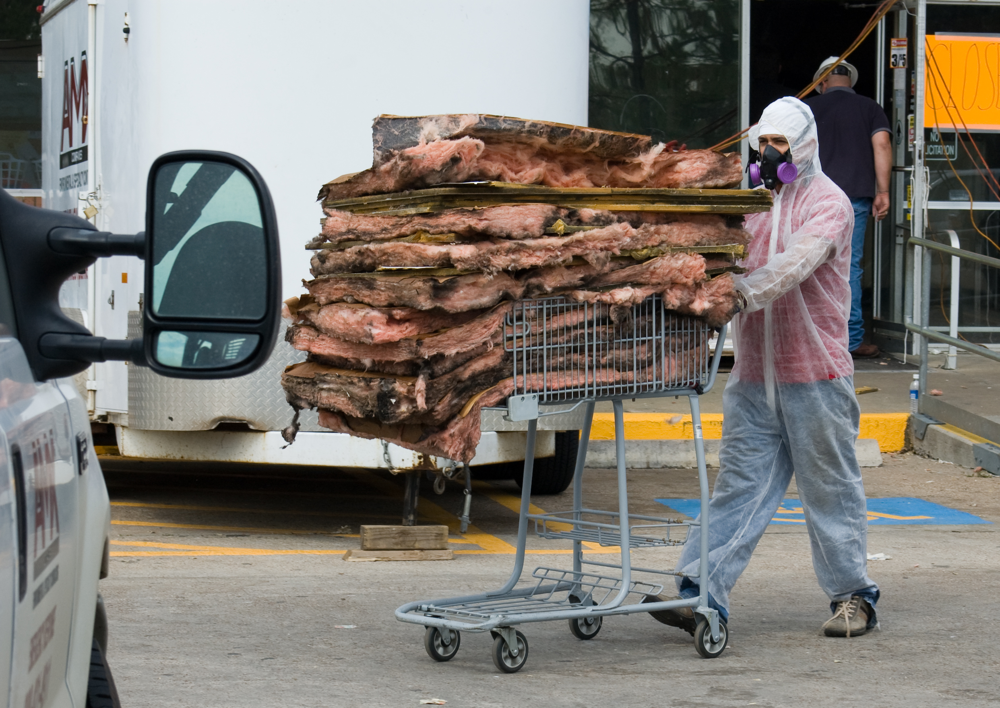
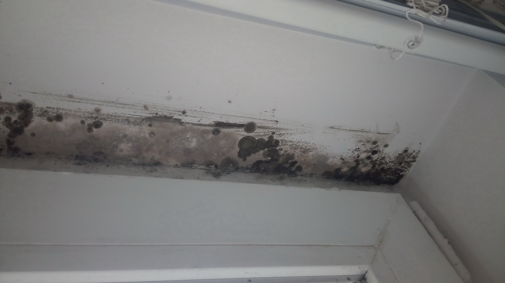

# Recovery & Rebuilding After a Disaster

## Read this first (the 30-second version)
1. **People before property.** Account for everyone, treat injuries, and get clear of immediate hazards (gas smell, downed wires, unstable structure, floodwater) before you touch anything else.
2. **Don't rush back in.** If your home took structural damage (flood, fire, tornado, earthquake, major storm), do a safety sweep from *outside* first, and get a professional inspection before staying inside overnight. Detailed structural checks live in the [Home Structural Assessment guide](../home-structural-assessment/home-structural-assessment.md).
3. **Document before you touch.** Photograph and video everything — damage, serial numbers, piles of debris — *before* you clean up or throw anything away. Insurance and FEMA both require this.
4. **Race the clock on water and mold.** Wet materials start growing mold within **24–48 hours**. Start drying immediately; anything wet you can't dry in 48 hours should be treated as contaminated or removed.
5. **Restore utilities in the right order, and only when it's safe** — gas and electric need inspection after major damage; details are in [Electrical, Gas & Utility Safety](../electrical-gas-utility-safety/electrical-gas-utility-safety.md).
6. **Close the loop.** Once the immediate crisis is over, do an after-action review and rebuild your stockpile — recovery isn't finished until you're better prepared than you were before the event.

This guide walks through recovery **in order, from minute one to months later**: the first 24 hours, damage assessment, safe cleanup, disposing of contaminated water/food, mold prevention, debris hazards, insurance/FEMA documentation, utility restoration, restocking supplies, and the after-action review that makes the next disaster less painful. It does not replace the deep dives on structural inspection, utility shutoff, flood/mold remediation, claims paperwork, or restocking lists — it points to them at the right moment and focuses on **the arc of recovery itself.**

---

## Why this matters
The disaster event itself is often shorter and, in a strange way, simpler than what follows: a tornado passes in seconds, a flood peaks in a day, a power outage might last a week — but *recovery* can take weeks to years. Most disaster-related injuries and deaths after the initial event happen during this recovery phase: people are electrocuted by downed lines while inspecting damage, cut by debris while cleaning up, poisoned by carbon monoxide from generators run indoors, or sickened weeks later by mold or contaminated water they didn't treat as dangerous. Recovery done badly can also cost you your insurance claim, your health, and months of avoidable rebuilding. Recovery done well — methodical, documented, safety-first — turns a disaster into a one-time setback instead of a repeating one.

## Key terms (plain language)
- **Safety sweep** — a first, cautious walk-through (often from outside first) to spot hazards before anyone re-enters or starts cleanup.
- **Structural damage** — damage to the parts of a building that hold it up (foundation, walls, roof framing) versus cosmetic damage (drywall, paint, flooring).
- **Category 1/2/3 water** — a water-damage classification: Category 1 is clean (e.g., a broken supply line), Category 2 ("grey water") has some contamination (e.g., washing-machine overflow), Category 3 ("black water") is grossly contaminated (sewage backup, floodwater, storm surge) and must be treated as hazardous. Most disaster flooding is Category 2 or 3.
- **Mold remediation** — the process of safely removing mold growth and the conditions that caused it, as opposed to just painting over it.
- **PPE** — personal protective equipment (gloves, boots, eye protection, respirator/mask).
- **After-action review (AAR)** — a structured look-back at what happened, what worked, what failed, and what to change — borrowed from military and emergency-management practice.
- **FEMA Individual Assistance** — federal disaster aid for individuals/households, available only after a federal disaster declaration for your area; separate from insurance.
- **Adjuster** — the insurance company's representative who inspects damage and determines the payout.
- **Proof of loss** — the formal, signed document you submit to your insurer listing damaged/destroyed items and their value.
- **Load-bearing** — a wall or structural element that holds up the building; damage here is far more serious than to a non-load-bearing wall.

---

# PART 1 — THE FIRST 24 HOURS

The first day sets the tone for everything after. Move through these in order — don't skip ahead to cleanup while hazards or missing people are unresolved.

## 1. Safety sweep (minutes 0–30)
1. **Stop. Look. Listen** before moving. Note gas odors (rotten egg smell), the hiss of a gas leak, sparking or arcing sounds, running/dripping water, and structural sounds (creaking, popping).
2. **Check yourself and those with you first** for injuries — treat life-threatening bleeding, breathing problems, and shock before anything else. See the [First Aid guide](../first-aid/first-aid.md).
3. **Do not enter a damaged structure yet.** Walk the *outside* perimeter first if the building was hit by a tornado, flood, earthquake, fire, or falling tree. Look for: leaning walls, a sagging or partially collapsed roof, foundation cracks wider than a pencil, separated corners, and anything overhead that could fall (loose bricks, dangling gutters, hanging tree limbs). Full structural triage steps are in the [Home Structural Assessment guide](../home-structural-assessment/home-structural-assessment.md) — use it before anyone re-enters.
4. **Immediate-hazard checklist before anyone goes further:**
   - [ ] No smell of natural gas or propane anywhere near the structure.
   - [ ] No downed or sagging power lines on or near the property (treat every downed line as energized — see [Electrical, Gas & Utility Safety](../electrical-gas-utility-safety/electrical-gas-utility-safety.md)).
   - [ ] No standing floodwater against exterior walls or in a basement with live electrical circuits.
   - [ ] No visible structural collapse, leaning, or sagging.
   - [ ] No fire, smoldering material, or smoke smell.
5. **If any box above is unchecked, stay out and stay back** at least the length of a utility pole (about 10 ft / 3 m minimum) from downed lines, and call 911 or the utility company. Do not try to move a line or a tree resting on one yourself.

> ⚠️ Never enter a structure that has visible structural damage until it's been checked by someone qualified, even if it "looks okay enough." Buildings can collapse hours or days after the event as damaged supports finally give way.

## 2. Account for people (minutes 15–60, in parallel with the sweep)
1. Do a head count of everyone who was with you — family, roommates, neighbors nearby.
2. If someone is missing, check the most likely places first (where they were last seen, a designated family meeting point) before assuming the worst.
3. Check on immediate neighbors, especially elderly, disabled, or those living alone, if it's safe to do so — but don't enter damaged buildings to do it.
4. If cell networks are down, use text messages (they often get through when calls don't), a battery/hand-crank radio for official information, or a pre-arranged out-of-area contact as a relay point. See the [Communication guide](../communication/communication.md).
5. Register you're safe if a service is active (Red Cross Safe and Well, FEMA app) so others aren't searching for you.

## 3. Immediate hazard control (hour 1–4)
Once people are accounted for and the worst structural risks are ruled out:
1. **If you smell gas:** do not flip any switch, light a match, or use a phone inside. Leave the area, and shut off the gas at the meter only if you know how and can do it safely from outside; otherwise leave it to the utility company/fire department. Full shutoff procedure: [Electrical, Gas & Utility Safety](../electrical-gas-utility-safety/electrical-gas-utility-safety.md).
2. **If wires are down:** stay away, keep others away, and report it. Assume every downed line is live even if the power "seems out."
3. **If there's active flooding:** don't walk or drive through moving water (6 inches can knock an adult down; 12 inches can float a car). Treat any water that touched the outside world as contaminated (Category 2/3) — see [Water, Flooding & Plumbing](../water-flooding-plumbing/water-flooding-plumbing.md).
4. **If a generator is running:** it must be **outdoors, 20+ feet from any door, window, or vent**, never in a garage even with the door open — carbon monoxide kills quickly and without warning. See [Power & Energy](../power-energy/power-energy.md).
5. **Secure the site:** if a door, window, wall, or roof section is open to the outside, board it up or tarp it (temporary, not a permanent fix) to keep out weather, animals, and looters once it's safe to do so.

## 4. First 24 hours checklist
- [ ] Safety sweep done from outside before anyone re-enters.
- [ ] Everyone accounted for; injuries treated; neighbors checked if safe.
- [ ] Gas, downed lines, floodwater, and structural collapse hazards identified and avoided.
- [ ] "I'm safe" message sent to an out-of-area contact.
- [ ] Generator (if used) placed outdoors, far from openings.
- [ ] Open building envelope (broken windows/doors/roof) temporarily secured.
- [ ] Photos/video started (see Part 5) before any cleanup begins.
- [ ] Plan made for where you'll sleep tonight if the home isn't safe.

---

# PART 2 — DAMAGE ASSESSMENT WALKTHROUGH

Once the first 24 hours are behind you and immediate hazards are controlled, walk the property methodically and **in daylight**, not at night, so you don't miss hazards.

## Order of the walkthrough
1. **Outside first, top to bottom:** roof (from the ground with binoculars — don't climb a possibly-damaged roof), gutters, siding/brick, windows, foundation visible from outside, trees/limbs overhanging the structure, fences, sheds, driveway/walkway cracking or heaving.
2. **Utilities, before entering:** note the position of the electrical meter, gas meter, and water shutoff — you'll need these later (Part 7). Do not touch or operate them yet unless there's an active emergency (Part 1).
3. **Inside, room by room, only after the structure is cleared for entry:** start at the point of damage (the flooded room, the fire's origin, the side that took the tornado's impact) and work outward.
4. **Attic and crawlspace last**, and only with a flashlight, sturdy footwear, and someone else aware you're up there — these are common places for hidden water damage, damaged wiring, and weakened framing.

## What to look for, room by room
| Area | Check for |
|---|---|
| Ceilings | Sagging, brown/yellow water stains, bulging, cracks radiating from one point |
| Walls | Cracks (especially diagonal, stair-step in brick, or wider than a pencil), bulging, water lines, soft/spongy drywall |
| Floors | Warping, buckling, soft spots, standing water, uneven or sloping sections that weren't there before |
| Windows/doors | Won't close/latch properly (a sign the frame has shifted), cracked glass, water intrusion around frames |
| Roof (from ground/attic) | Missing/lifted shingles, exposed decking, daylight visible through the roof from inside the attic, sagging rafters |
| Foundation | New cracks, especially horizontal ones or ones you can fit a coin into; doors/windows newly out of square |
| Electrical | Scorch marks, melted outlets, water-soaked panels, breakers that won't reset |
| Appliances/HVAC | Water lines on units, scorching, anything that was submerged |

> ⚠️ A wall or ceiling crack you can slide a coin into edge-on, a door frame that's gone visibly out of square, or a floor with new noticeable slope are all signs of possible structural damage — stop and get a professional structural inspection before continuing normal use of that area. Full inspection criteria and a severity scale live in the [Home Structural Assessment guide](../home-structural-assessment/home-structural-assessment.md).

## Categorize what you find
As you go, sort damage into three buckets — this drives what you do next:
1. **Cosmetic** (paint, drywall skim coats, minor trim) — safe to live with while you plan repairs.
2. **Functional but damaged** (a soaked carpet, a broken window, a non-working outlet) — needs cleanup/repair soon but isn't an immediate danger once isolated (e.g., breaker off).
3. **Structural or systemic** (foundation cracks, sagging roof framing, scorched wiring, sewage-contaminated flooding) — needs a professional before you resume normal use of that space.

## Damage assessment checklist
- [ ] Walked the exterior top-to-bottom before entering.
- [ ] Located (not yet touched) the electric, gas, and water shutoffs.
- [ ] Walked every interior room, plus attic/crawlspace with a flashlight.
- [ ] Sorted findings into cosmetic / functional-damaged / structural-systemic.
- [ ] Anything structural flagged for professional inspection before use.
- [ ] Photos taken of every finding (see Part 5) before touching anything.

---

# PART 3 — SAFE CLEANUP PRACTICES

*Figure — A hazmat/remediation worker in full PPE (protective suit, gloves, respirator, boots) removing flood-damaged insulation after Hurricane Ike, Winnie, TX, 2008. This is the heavy-duty end of the PPE spectrum (large-area, Category 2/3 water, or professional remediation); most household cleanup only needs the boots/gloves/goggles/N95 combination described below, but the picture shows why full-body coverage matters when the contamination or mold load is high. Source: Wikimedia Commons (File:FEMA - 39239 - Worker in Hazmat suit in Texas.jpg), Samir Valeja/FEMA, public domain (US federal government work).*

## PPE — what to wear before you touch anything
The CDC's core disaster cleanup guidance (Clean Up Safely After a Disaster; Reentering Your Flooded Home) recommends, at minimum: an N95 respirator (or higher), goggles, and protective gloves — with rubber boots added for any sewage or floodwater contact. Match the level below to what you're actually facing; more contamination or more airborne dust/mold means more PPE, not less.

- **Sturdy, closed-toe boots** — ideally with a puncture-resistant sole; nails and glass hide in debris. **Rubber/waterproof boots** specifically for anything that touched floodwater or sewage (they also don't need to be thrown away after — hard rubber can be disinfected, unlike leather).
- **Thick work gloves** (leather or heavy rubber/nitrile) for general debris handling — not thin disposable gloves, which tear on debris. **Waterproof rubber gloves** (dishwashing-style or heavier) for anything that touched floodwater, sewage, or mold; CDC specifically calls out protective gloves as one of its three minimum items for any disaster cleanup.
- **Eye protection** (safety glasses or, better, sealed **goggles**) — debris, dust, mold spores, and splashed contaminated water all threaten eyes; goggles are preferred over open safety glasses when working around mold or floodwater because they seal against splash and dust.
- **A well-fitting N95 (or better) respirator mask** whenever dust, mold, insulation, or ash is present — this is CDC's stated minimum for reentering a flooded or moldy home. A cloth mask or surgical mask is **not** enough for mold or ash; it doesn't seal to the face or filter fine particles.
  - **N95** (minimum): fine for brief, small-scale work — under roughly the 10 sq ft DIY mold threshold (Part 5), light dust, or general debris handling.
  - **P100 (or N100)** respirator or a half-/full-face air-purifying respirator with a HEPA/P100 filter: use for more extensive mold work (roughly 10–100 sq ft, the EPA's "Level II" range — Part 5), heavy dust, or ash from a structure fire.
  - **Full-face powered air-purifying respirator (PAPR)** and disposable coveralls (e.g., Tyvek-type suits): the EPA's guidance for remediating mold over roughly 100 sq ft — at that scale, this is professional remediation-company territory, not a DIY job (Part 5).
  - Whatever level you use, a respirator only protects you if it **seals** to your face — facial hair, a poor fit, or wearing it loosely defeats the seal. Follow the package fit instructions.
- **Disposable or washable coveralls** over your clothes when handling mold, sewage-contaminated material, or ash — easier to decontaminate or discard than street clothes, and keeps contamination off your skin and out of your house/car afterward.
- **Long sleeves and pants** even in Texas summer heat — scrapes and cuts from debris get contaminated easily; balance this against heat illness risk (see Part 3's heat note below).
- **After removing PPE:** wash your hands and face (and shower if you handled sewage, mold, or ash) before eating, drinking, or touching your face; launder or dispose of contaminated clothing separately from other laundry.

## Lifting and moving debris safely
1. **Lift with your legs, not your back**: bend knees, keep the load close to your body, keep your back straight, don't twist while lifting.
2. **Test before you lift** — push or nudge a heavy item first to gauge real weight; get help or a dolly/hand truck for anything questionable.
3. **Two-person carries** for anything awkward or over roughly 50 lb — don't be a hero, this is one of the most common sources of new injuries during cleanup.
4. **Clear a path first** so you're not stepping over other debris while carrying a load.
5. **Take breaks and hydrate** — cleanup exertion in North Texas summer heat is a real heat-illness risk; see the North Texas subsection below and the [First Aid guide](../first-aid/first-aid.md) for heat exhaustion/heat stroke signs.

## Sharps and hidden debris
1. **Assume every pile of debris has nails, screws, broken glass, and splinters in it**, even if you can't see them — this is the single most common cleanup injury.
2. Use a rake or a stick to turn over debris piles before reaching in with a gloved hand.
3. Collect loose nails/screws/glass into a dedicated puncture-proof container (a metal can, a thick box) — don't just sweep them aside where a bare foot will find them later.
4. Watch for exposed nails in boards you're moving or stepping over (very common after roof or fence damage) — a board with nails pointing up is a classic stepped-on-nail injury.
5. Keep tetanus vaccination current if you do a lot of disaster cleanup work over the years (talk to a healthcare provider — this guide does not give medical dosing advice).

## Debris hazards beyond sharps

*Figure — Flood-damaged household debris piled at the side of a road, ready for disposal, Oklahoma. This is a realistic picture of what a debris pile actually looks like — mixed furniture, insulation, and household items, all of which can hide nails, glass, and displaced containers (see below). Source: Wikimedia Commons (File:FEMA - 32291 - Household debris piled on the side of a road in Oklahoma.jpg), FEMA, public domain (US federal government work).*

- **Downed power lines in or near debris** — treat any wire in a debris pile as live; do not move debris that has a wire tangled in it. Call the utility company.
- **Broken glass and splintered wood** — common in tornado and high-wind debris; wear the eye protection and gloves above.
- **Older building materials** — homes and buildings built before the early 1980s may contain **asbestos** (old insulation, floor tile, roofing, siding) or **lead paint** (pre-1978). Both are dangerous mainly when disturbed (cut, sanded, or crumbled) and become airborne. **Do not saw, sand, or aggressively break up old plaster, tile, insulation, or siding of unknown age.** If you suspect asbestos or lead-painted material, wet it down lightly to keep dust from becoming airborne, leave it in place, and get a professional assessment before demolition — this is a case where "when to call a pro" is not optional.
- **Propane tanks, fuel containers, and chemical containers** displaced by flood or wind — don't move or open unknown containers; treat as hazardous until identified. See the [Hazmat & Contamination guide](../hazmat-contamination/hazmat-contamination.md).
- **Animals and insects displaced by the disaster** — snakes, fire ants, and other wildlife often shelter in debris piles, especially after flooding in North Texas. See the [Animal, Insect & Pest Hazards guide](../animal-insect-pest-hazards/animal-insect-pest-hazards.md).

## North Texas cleanup note
Summer cleanup in Collin County heat (regularly 95–105°F) turns into a heat-illness risk fast, especially in PPE. Work in the cooler parts of the day (early morning/evening), take shade breaks every 20–30 minutes, drink water on a schedule rather than waiting for thirst, and watch yourself and others for heat exhaustion (heavy sweating, weakness, nausea) versus heat stroke (hot/dry skin, confusion — this is a medical emergency). After heavy rain events, standing debris piles and downed brush are also where fire ants relocate their mounds — watch where you put gloved hands.

---

# PART 4 — DISPOSING OF CONTAMINATED WATER AND SPOILED FOOD

## Contaminated water
1. **Treat all floodwater as contaminated** (Category 3/"black water") — it can carry sewage, chemicals, fuel, and agricultural runoff, especially in North Texas where flooding often crosses pastureland and roads.
2. **Do not use floodwater for drinking, cooking, or bathing**, even boiled, if it may contain chemical or fuel contamination — boiling only kills germs, not chemicals (full explanation of what boiling/bleach can and can't remove is in the [Water guide](../water/water.md)).
3. **Standing water indoors** (a flooded basement, a pooled room): once it's safe to do so (power off in that area, confirmed no electrical hazard), pump or bail it out and direct it away from the foundation, not into a neighbor's yard or a storm drain feeding a waterway if avoidable.
4. **Any stored drinking/tap water that was exposed to floodwater, lost pressure during a boil-water notice, or sat in a compromised system should be discarded** unless your water utility or local health department has issued an all-clear. Don't trust "it looks fine" — invisible contamination is the whole danger.
5. Full flood-specific drying and water-source safety detail: [Water, Flooding & Plumbing](../water-flooding-plumbing/water-flooding-plumbing.md) and [Water](../water/water.md).

## Spoiled food
1. **When in doubt, throw it out.** This is the standard rule from FEMA and the CDC for a reason — you cannot tell by smell or taste alone whether food carries a dangerous bacterial load.
2. **Refrigerator, power out:** food is generally safe for about **4 hours** in a closed fridge without power (less if opened frequently). After that, perishables (meat, dairy, eggs, leftovers, cut produce) should be discarded unless you can verify with a thermometer they stayed at 40°F/4°C or below.
3. **Freezer, power out:** a full freezer holds safe temperature about **48 hours** (24 hours if half full) if the door stays closed. Food with ice crystals still visible and that's still cold (40°F/4°C or below) can usually be refrozen or cooked; food that's been above 40°F/4°C for more than 2 hours should be discarded.
4. **Any food that touched floodwater** — including canned goods with dented, bulging, rusted, or unlabeled cans — should be discarded. Floodwater can force contamination past can seals and jar lids even without visible damage.
5. **Any food with an unusual odor, color, or texture**, or that was left at room temperature more than 2 hours (1 hour above 90°F/32°C — relevant in Texas summer), gets thrown out.
6. **Items that can't be properly sanitized after floodwater contact should be discarded outright, not just washed** — per CDC guidance this includes wooden cutting boards, baby bottle nipples and pacifiers, and any porous kitchenware; these materials absorb contamination in ways a wipe-down or even boiling can't fully reverse.
7. **Disposal:** double-bag spoiled food to control odor and pest attraction (important in North Texas heat, where spoiled food draws flies, ants, and wildlife within hours); keep it away from cleanup areas and out of reach of children and pets until collection.

---

# PART 5 — MOLD PREVENTION AND REMEDIATION BASICS

Mold is one of the most common and most underestimated post-disaster hazards after any water intrusion — flooding, roof leaks, burst pipes, or firefighting water. It doesn't just ruin materials; it can trigger serious respiratory problems, especially for children, the elderly, and anyone with asthma or a compromised immune system. This section follows current EPA guidance (*A Brief Guide to Mold, Moisture and Your Home*; *Mold Remediation in Schools and Commercial Buildings*) and CDC guidance (*Reentering Your Flooded Home*; *Clean Up Safely After a Disaster*).

*Figure — Mold growing on the head jamb of an interior window frame in a multi-story building, the result of trapped winter moisture. This is what early-stage indoor mold looks like on a hard surface — dark, fuzzy-edged discoloration following a moisture line. Source: Wikimedia Commons (File:Indoor Mold.jpg), Alexander Davronov, CC BY-SA 4.0.*

## The 24–48 hour window
> ⚠️ **EPA's guidance is explicit: "If wet or damp materials or areas are dried 24-48 hours after a leak or spill happens, in most cases mold will not grow."** Speed matters more than almost anything else in this section — every hour you wait before starting to dry things out is an hour mold gets a head start. Assume mold is already present if a flooded home has been closed up for several days (CDC).

1. **The moment it's safe to do so** (power confirmed safe in wet areas — never run electrical equipment in standing water, and never turn on a flooded HVAC system before a mold-experienced professional has checked and cleaned it — an untreated flooded HVAC system will spread mold through the whole house the moment it runs), start removing standing water and increasing airflow.
2. **Remove standing water fast.** If you have safe electricity, a wet/dry shop vacuum, the vacuum function of a carpet steam cleaner, an electric transfer pump, or a sump pump are the fastest ways to pull out bulk water; without power, buckets and mops.
3. **Open windows and doors** if outdoor humidity is lower than indoor humidity (common after a storm clears in North Texas); if outdoor air is more humid, keep the space sealed and dehumidify instead.
4. **Run fans and dehumidifiers continuously**, pointed to move air across wet surfaces, not just into open air. Aim fans so air sweeps across the wet material (floor, wall) rather than just circulating room air — moving air across the surface is what actually speeds evaporation.
5. **Remove wet porous materials you can't dry within 48 hours:** wet carpet padding, soaked drywall (cut out at least a foot above the visible waterline), waterlogged insulation, and soaked upholstered furniture are very difficult to dry fully and are common mold breeding grounds. When in doubt, it's cheaper to remove and replace than to fight mold in a material that held water.
6. **Non-porous materials** (tile, metal, solid wood furniture, glass, some plastics) can usually be cleaned, dried, and kept.
7. **Wipe down hard surfaces** with a plain detergent-and-water solution first ("scrub mold off hard surfaces with detergent and water, and dry completely" — EPA) to remove residue, then, if mold is already visible on a hard non-porous surface, a solution of about **1 cup of unscented household bleach per gallon of water** on the surface (not on people, and never mixed with ammonia-based cleaners — that combination produces toxic chloramine fumes). Ventilate the area well while doing this and wear gloves and eye protection (Part 3 PPE list). Note that even a fully cleaned hard surface may show permanent staining or cosmetic damage from the mold — that's expected and not a sign the cleaning failed.

## When you can DIY vs. when to call a professional
EPA's own remediation guidance for larger buildings scales PPE and containment to the *size* of the affected area, and gives a useful mental model even for a house:

| Affected area (EPA action level) | Who typically handles it | Minimum PPE (EPA) | Containment |
|---|---|---|---|
| **Under ~10 sq ft** (roughly a 3 ft × 3 ft patch) — EPA "Level I" | A homeowner/occupant, in most cases | N95 respirator, gloves, goggles | None specified — just isolate the immediate work area |
| **~10–100 sq ft** — EPA "Level II" | Trained maintenance staff or a remediation pro | Half-face or full-face air-purifying respirator with a HEPA/P100 filter | Limited containment: single layer of 6-mil polyethylene sheeting sealing off the work area, kept under negative pressure |
| **Over ~100 sq ft** — EPA "Level III" | A professional mold remediation company | Full-face powered air-purifying respirator (PAPR); disposable protective clothing | Full containment: double poly sheeting layers plus a decontamination airlock |

EPA is explicit that these tiers are organized by **square footage to make technique selection practical, not because there's a specific health-effect cutoff at exactly 10 sq ft** — use judgment: a small patch of heavy, black, actively-growing mold can warrant more caution than a larger patch of light surface mold, and vice versa.

**DIY is reasonable when:**
- The wet/moldy area is small — **under about 10 square feet of visible mold** (EPA's rule of thumb, roughly a 3×3 ft patch).
- Water was clean (Category 1 — e.g., a supply-line break) and you dried it within 24–48 hours.
- You have no respiratory conditions, aren't pregnant, and aren't dealing with young children or elderly household members in the affected space.

**Call a professional mold remediation company when:**
- Visible mold covers more than roughly 10 square feet, or you can smell a musty odor but can't locate/access the source (inside walls, under flooring, in HVAC ducting).
- The water was Category 2 or 3 (grey/black water — sewage, floodwater, storm surge).
- Mold is inside HVAC ductwork, or the HVAC system was flooded (spreading it through the whole house is a real risk if disturbed or run incorrectly — get it professionally inspected and cleaned before turning it on, per CDC).
- Anyone in the household has asthma, allergies, a compromised immune system, or is very young or elderly.
- You've already tried cleaning it and it keeps coming back — that usually means a hidden moisture source (a slow leak, poor ventilation, an unresolved humidity problem) still needs to be found and fixed, not just the visible mold.

## Preventing mold from returning
- Fix the moisture source permanently, not just the visible mold — mold recurring is almost always a sign of unresolved water intrusion.
- Keep indoor humidity below roughly 50% where practical; a dehumidifier helps in humid North Texas summers.
- Ensure crawlspaces and attics are ventilated, not sealed and damp.
- Detailed flood-specific drying steps, moisture meters, and structural drying order live in the [Water, Flooding & Plumbing guide](../water-flooding-plumbing/water-flooding-plumbing.md) and in FEMA P-234 *Repairing Your Flooded Home* (`reference/manuals/fema_p234_repairing_your_flooded_home.pdf`), which walks through drying sequence, salvage-vs-discard decisions material by material, and rebuilding to reduce future flood/mold risk.

---

# PART 6 — DOCUMENTING LOSSES FOR INSURANCE AND FEMA

Good documentation, done *before* cleanup, is often the difference between a smooth claim and a denied or lowballed one.

## Do this before you throw anything away or start repairs
1. **Photograph and video everything** — wide shots of each room/area showing the overall damage, then close-ups of specific damaged items, water lines on walls, structural cracks, and debris. Walk through narrating out loud on video if you can (date, what you're looking at).
2. **Don't discard damaged items until documented**, except where health/safety requires immediate disposal (spoiled food, sewage-soaked material) — in that case, photograph first, then discard, and keep a written list with estimated value, purchase date if known, and a receipt if you have one.
3. **Keep damaged items you're unsure about** in a safe, dry, out-of-the-way spot until the adjuster has seen them or told you it's fine to dispose of them.
4. **Make emergency repairs only** (tarping a roof, boarding a window) to prevent further damage — keep receipts and photos of the "before" state, since insurers generally expect and cover reasonable temporary protective measures.
5. **Keep every receipt** related to the disaster: temporary lodging, emergency repairs, cleanup supplies, generator fuel — many of these are reimbursable under insurance "additional living expenses" coverage or FEMA assistance.

## Working with insurance and FEMA
- Contact your insurance company as soon as practical to open a claim; ask about **additional living expenses (ALE)** coverage if you can't stay in your home.
- FEMA Individual Assistance is separate from insurance and only available after a federal disaster declaration for your area — apply even if you're unsure you qualify; being denied doesn't cost you anything, and FEMA aid generally cannot duplicate what insurance already covers.
- Full detail on the claims process, proof-of-loss forms, adjuster meetings, appeal rights, and organizing paperwork long-term lives in the [Documents, Money & Admin guide](../documents-money-admin/documents-money-admin.md) — use it alongside this section.

## Documentation checklist
- [ ] Photos/video of every room and every damaged item, taken before cleanup.
- [ ] Written inventory list started: item, estimated value, damage description.
- [ ] Damaged items kept (not discarded) until adjuster review, except health-hazard items (photographed first).
- [ ] All receipts for temporary lodging, repairs, and supplies kept together.
- [ ] Insurance claim opened; ALE coverage asked about.
- [ ] FEMA Individual Assistance applied for, if a federal declaration covers your area.

---

# PART 7 — RESTORING UTILITIES SAFELY

Utility restoration has an order for a reason: doing it out of order risks fire, electrocution, gas explosion, or damaging equipment further.

## General order of operations
1. **Structural safety confirmed first** — don't restore any utility to a structure that hasn't been cleared as structurally safe to occupy (Part 2 / [Home Structural Assessment guide](../home-structural-assessment/home-structural-assessment.md)).
2. **Gas** — if it was shut off (or you smell gas), do **not** turn it back on yourself. The gas utility or a licensed technician needs to inspect the line and appliances and relight pilot lights; turning gas back on incorrectly is a leading cause of post-disaster explosions and fires.
3. **Electrical** — if the panel, wiring, or any outlets were exposed to water or visible fire damage, get an electrician's inspection before restoring power to that circuit or the whole panel. If only the utility's exterior connection was affected (a common outage cause) and your home's wiring is undamaged, power may return automatically when the utility restores service — but if your home took water or fire damage, don't assume it's safe just because the street has power again.
4. **Water** — after a boil-water notice or any suspected contamination event, don't resume normal tap use until the utility or health department declares it safe; flush and disinfect fixtures per their guidance once cleared.
5. **HVAC and appliances** that were flooded or scorched need inspection before use — a soaked furnace, water heater, or AC unit can have hidden electrical or gas hazards.

## When to insist on a professional inspection
> ⚠️ Always get a professional inspection before restoring gas or electric service if: the utility was shut off due to damage (not just a routine outage), there was any flooding above outlet height, there's visible scorching/melting, or you smell gas at any point. This is not optional — these are the categories of mistake that kill people during recovery.

Full step-by-step shutoff/restoration procedures, breaker and valve locations, and generator safety are covered in the [Electrical, Gas & Utility Safety guide](../electrical-gas-utility-safety/electrical-gas-utility-safety.md) and [Structural & Utility Emergencies guide](../structural-utility-emergencies/structural-utility-emergencies.md) — read those before touching any shutoff or restoring service yourself.

## Utility restoration checklist
- [ ] Structure confirmed safe to occupy before restoring any utility.
- [ ] Gas restoration left to the utility/licensed technician if it was ever shut off or suspected leaking.
- [ ] Electrical panel/wiring inspected by an electrician if exposed to water, fire, or visible damage.
- [ ] Water use resumed only after utility/health department clears a boil-water or contamination notice.
- [ ] Flooded or scorched appliances (furnace, water heater, HVAC) inspected before use.

---

# PART 8 — REPLENISHING SUPPLIES AND REBUILDING YOUR STOCKPILE

Recovery consumed supplies — food, water, batteries, first aid materials, fuel, cash. Rebuilding the stockpile is part of recovery, not an afterthought, because the next event doesn't wait for you to feel ready.

1. **Inventory what's left first** — don't restock blind; you may have more (or less) of something than you think after a chaotic few days of use.
2. **Replace consumed items in priority order:** water storage, non-perishable food, any medications used or that expired during the event, batteries, first-aid supplies used during treatment, fuel for generators/vehicles.
3. **Replace anything damaged**, not just consumed — a flooded first-aid kit or water-damaged battery stash needs full replacement, not just topping off.
4. **Use the event as a stress test:** what ran out first? What did you wish you had more of? What turned out to be useless weight? Feed these answers into what you restock and how much.
5. **Rotate as you restock** — put the newest items at the back, oldest at the front, so nothing quietly expires unnoticed before the next event.
6. Full restocking lists, quantities per person, and rotation schedules: [Supplies, Inventory & Rotation guide](../supplies-inventory-rotation/supplies-inventory-rotation.md) — use it as your restocking checklist after reading this section.

---

# PART 9 — THE AFTER-ACTION REVIEW

Once the immediate crisis has passed — utilities restored, claims filed, cleanup substantially done — sit down (as a household, if applicable) and deliberately review what happened. Skipping this step is the single biggest reason people repeat the same mistakes in the next disaster.

## How to run a simple after-action review
This is a scaled-down version of the **after-action review (AAR) / improvement-plan process** emergency management agencies (including FEMA) use after real incidents — the household version keeps the same logic: what we expected, what happened, what to change, on paper, while it's fresh.

1. **Do it while memory is fresh** — within a week or two of things stabilizing, before details blur. Waiting months means you'll remember the drama and forget the specifics that actually matter (which valve was hard to find, which flashlight had dead batteries).
2. **Ask four questions, in order, honestly, one household domain at a time** (see the domain list below):
   - **What did we expect to happen, and what actually happened?** (Where were our assumptions wrong?)
   - **What worked well?** (Keep doing this — write it down too, not just the failures, so you don't accidentally change something that was fine.)
   - **What didn't work, or ran out, or failed?** (Fix this.)
   - **What will we do differently next time?** (Turn this into a concrete action item with an owner and, ideally, a date — "buy a second flashlight" not "we should have more light sources.")
3. **Write it down in a simple table**, one row per finding, so nothing gets lost in conversation:

   | Domain | What happened | What worked | What failed | Action item (owner, target date) |
   |---|---|---|---|---|
   | Water | example: ran out of stored water day 3 | example: filter worked well | example: only had 3-day supply | example: buy 2 more weeks of storage (Matt, by next month) |

   A one-page note today saves relearning the same lesson under stress next time. Store it with your other emergency documents (see [Documents, Money & Admin](../documents-money-admin/documents-money-admin.md)) and set a calendar reminder to re-read it before the next high-risk season (e.g., before spring severe-weather season or before hurricane season if relevant to you).
4. **Cover every domain, not just supplies** — walk through each one deliberately rather than trusting memory to surface it unprompted:
   - **Communication:** Did your plan work? Could you reach everyone? Did the out-of-area contact relay correctly?
   - **Meeting point / accountability:** Did everyone know where to go? Did the head-count process (Part 1) actually work under stress?
   - **Utilities:** Did you know where the gas, electric, and water shutoffs were *before* you needed them? How long did it take to find them?
   - **Evacuation (if used):** Did the route, timing, and go-bag hold up, or did something get left behind or take too long to gather?
   - **Supplies:** What ran out first? What was never used and turned out to be dead weight?
   - **Documentation/insurance:** Did you photograph before cleanup? Was anything discarded that you wish you'd documented first?
   - **Recovery process itself:** Did you know this guide's order of operations (safety sweep → assessment → cleanup → documentation → utilities → restocking) going in, or did you improvise and lose time/safety margin as a result?
   See the [Emergency Planning & Triage guide](../emergency-planning-triage/emergency-planning-triage.md) for the planning side this review feeds back into.
5. **Include the emotional/psychological side.** Recovery is stressful, and it's normal for household members (including children) to show signs of stress well after the physical danger has passed — ask directly ("how are you doing with all this?") rather than assuming silence means everyone's fine. The [Psychological First Aid guide](../psychological-first-aid/psychological-first-aid.md) covers recognizing and supporting this.
6. **Close the loop, don't just file it.** An AAR that sits in a drawer unread is wasted effort — the value is entirely in acting on the findings (Part 8 restocking, updated plans, a new skill learned) and in actually re-reading it before the next event, not in the writing exercise alone.

## Rebuilding preparedness stronger
- Turn every after-action finding into one concrete change: a new item in the kit, a new plan step, a new skill someone in the household learns, a new document copied to a safe second location.
- Reassess your specific regional risks in light of what just happened — if this event was a flood, revisit flood-specific prep; if it was a tornado, revisit shelter-in-place plans; if it was a long power outage, revisit power/backup planning ([Power & Energy guide](../power-energy/power-energy.md)).
- Share lessons with neighbors and your local mutual-aid network — recovery is faster and safer when a community learns together. See the [Community & Mutual Aid guide](../community-mutual-aid/community-mutual-aid.md).
- Re-date and re-check your stockpile rotation schedule so the next event doesn't find you with expired supplies again.

## North Texas / regional recovery notes
- **Tornadoes:** damage is often hyper-local (one street hit hard, the next block untouched) — expect uneven utility restoration and debris-clearing timelines block by block; document damage even if neighbors' claims seem to move faster.
- **Flash floods:** North Texas clay soil sheds water fast, so flooding can rise and recede within hours, but the contamination risk (agricultural runoff, low-water crossings) is high — treat all flood water as Category 3 (see Part 4) even if it looked "just like rain."
- **Ice storms:** extended power outages are the recurring theme; recovery often centers on frozen/burst pipes (see [Water, Flooding & Plumbing](../water-flooding-plumbing/water-flooding-plumbing.md)) discovered only once things thaw — inspect plumbing carefully after any hard freeze event even if nothing looked wrong immediately.
- **Grassfires:** ash and smoke damage cleanup requires the same respirator precautions as mold work; also check for smoldering material that can reignite hours or days later, especially in dry, windy conditions typical of a North Texas drought.
- **Heat:** cleanup after any North Texas summer disaster carries its own heat-illness risk on top of the disaster's direct damage — pace the work (Part 3).

---

# ⚠️ Safety — the most important warnings
- **Never re-enter a structurally damaged building without a professional clearance if there's any sign of structural failure** (leaning, sagging, wide new cracks, doors/windows out of square).
- **Never restore gas service yourself after a shutoff or suspected leak** — always a utility or licensed technician.
- **Never run a generator indoors or near an opening** — carbon monoxide is invisible, odorless, and fast-acting.
- **Treat all floodwater and anything it touched as contaminated** — when in doubt about food or water safety, throw it out.
- **Don't disturb old building materials (pre-1980s) that might contain asbestos or lead paint** — wet down lightly and leave in place for a professional if you suspect either.
- **Start drying water damage within 24–48 hours** to prevent mold; remove porous materials you can't fully dry in that window.
- **Never mix bleach with ammonia-based cleaners** — the fumes are toxic.
- **Document before you discard** — photos and an inventory list, before cleanup, protect your insurance and FEMA claim.
- **Downed power lines are always live** until a utility confirms otherwise — stay back and keep others back.

# Troubleshooting
| Problem | Fix |
|---|---|
| Not sure if the building is safe to enter | Do the outside-first safety sweep (Part 1); if any doubt about structural integrity, get a professional inspection before entering — see [Home Structural Assessment](../home-structural-assessment/home-structural-assessment.md). |
| Smell gas after the event | Leave immediately, don't use switches/phones inside, call the gas utility or 911 — don't try to restore gas yourself. |
| Mold already visible and spreading | If under ~10 sq ft and from clean water, DIY-clean per Part 5; if larger, from grey/black water, in ductwork, or a vulnerable person is in the home, call a remediation professional. |
| Insurance adjuster hasn't come yet but items are in the way | Photograph everything first, keep the items if possible, and only discard health-hazard items (already photographed) before the adjuster arrives. |
| Power restored to the street but not sure it's safe in the house | If the home had water/fire damage to wiring or the panel, get an electrician's inspection before restoring that circuit — don't assume street power means house power is safe. |
| Don't know where to start on cleanup | Follow the order in Part 2 (assessment) before Part 3 (cleanup) — assess and document first, then clean, room by room from the point of damage outward. |
| Ran out of a key supply mid-recovery | Note it for the after-action review (Part 9) and prioritize it first when restocking (Part 8). |
| Debris pile with a downed wire tangled in it | Do not touch or move it — treat the wire as live and call the utility company. |

# Quick-reference checklist
- [ ] Safety sweep from outside completed; people accounted for; immediate hazards (gas, wires, floodwater, collapse) avoided.
- [ ] Damage assessment walkthrough done top-to-bottom, outside-then-inside, findings sorted cosmetic/functional/structural.
- [ ] Cleanup done with proper PPE, safe lifting, and sharps caution; asbestos/lead-suspect materials left undisturbed for a pro.
- [ ] Contaminated water and spoiled food identified and safely discarded (when in doubt, throw it out).
- [ ] Wet materials drying started within 24–48 hours; mold-prone porous materials removed if not fully dryable in time.
- [ ] Everything photographed/documented before cleanup or disposal; insurance claim and FEMA application (if eligible) filed.
- [ ] Utilities restored in safe order, with professional inspection for gas/electric after real damage.
- [ ] Stockpile inventoried, consumed/damaged items replaced, rotation dates refreshed.
- [ ] After-action review written down within a couple weeks; concrete changes identified for next time.

# Sources & further reading (in this knowledge base)
- **FEMA P-234, "Repairing Your Flooded Home"** — `reference/manuals/fema_p234_repairing_your_flooded_home.pdf` (full room-by-room and material-by-material drying, cleaning, salvage-vs-discard, and rebuilding guidance after a flood — the deepest single reference for Parts 2, 3, and 5 of this guide).
- **EPA, "A Brief Guide to Mold, Moisture and Your Home"** — `reference/manuals/epa_moldguide_brief_guide.pdf` (source for the 24–48 hour drying window and the ~10 sq ft DIY-vs-professional mold threshold used in Part 5).
- **EPA, "Mold Remediation in Schools and Commercial Buildings"** — source for the EPA action-level table (10 sq ft / 10–100 sq ft / 100+ sq ft) in Part 5; see `epa.gov/mold/mold-remediation-schools-and-commercial-buildings-guide`.
- **CDC, "Reentering Your Flooded Home"** and **"Clean Up Safely After a Disaster"** — source for the minimum-PPE guidance (N95, goggles, gloves) and HVAC/flooded-system cautions in Parts 3 and 5; see `cdc.gov/natural-disasters/safety` and `cdc.gov/floods/safety`.
- **CDC, "Keep Food and Water Safe After a Disaster or Emergency"** — source for the refrigerator (4 hr) / freezer (24–48 hr) time limits and the discard-not-wash items (wooden cutting boards, baby bottle nipples/pacifiers) in Part 4; see `cdc.gov/food-safety/foods/keep-food-safe-after-emergency.html`.
- **FEMA "Are You Ready?"** — `reference/manuals/are-you-ready-guide.pdf` (disaster preparedness, recovery, and rebuilding guidance).
- **American Red Cross Preparedness Guide** — `reference/manuals/redcross_preparednessguide.pdf` (recovery and cleanup practices).
- **CDC Emergency Preparedness Foundations** — `reference/manuals/cdc_emergency_foundations.pdf` (contaminated water/food disposal, mold and health guidance).
- **US Army Survival Manual FM 21-76** — `reference/manuals/fm21-76_survival_manual.pdf` (general safety and hazard-avoidance principles applied here to recovery).
- See also: [Home Structural Assessment](../home-structural-assessment/home-structural-assessment.md) (detailed structural inspection & tarping), [Electrical, Gas & Utility Safety](../electrical-gas-utility-safety/electrical-gas-utility-safety.md) and [Structural & Utility Emergencies](../structural-utility-emergencies/structural-utility-emergencies.md) (shutoff/reconnect safety), [Water, Flooding & Plumbing](../water-flooding-plumbing/water-flooding-plumbing.md) (drying and mold specifics), [Documents, Money & Admin](../documents-money-admin/documents-money-admin.md) (insurance claims and paperwork), [Supplies, Inventory & Rotation](../supplies-inventory-rotation/supplies-inventory-rotation.md) (restocking lists), [Psychological First Aid](../psychological-first-aid/psychological-first-aid.md), [Emergency Planning & Triage](../emergency-planning-triage/emergency-planning-triage.md), and [Community & Mutual Aid](../community-mutual-aid/community-mutual-aid.md).
