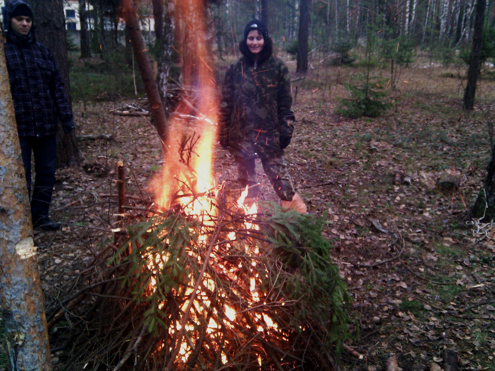
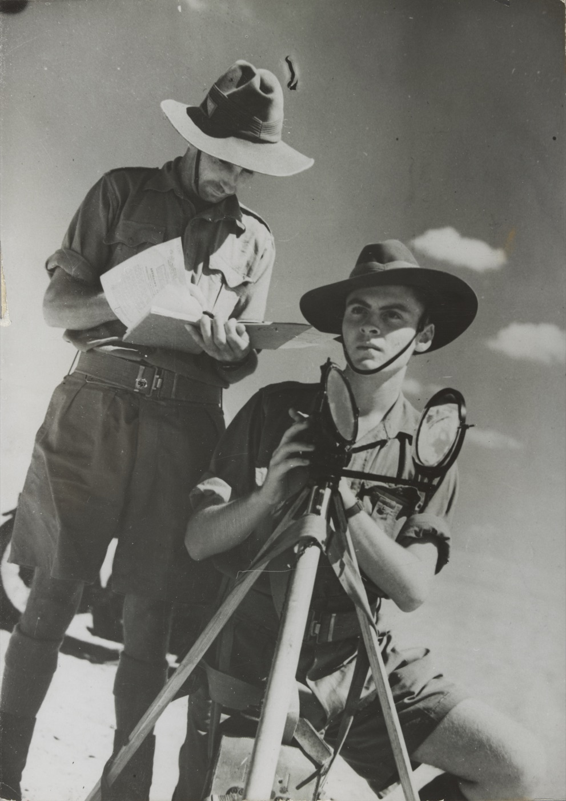
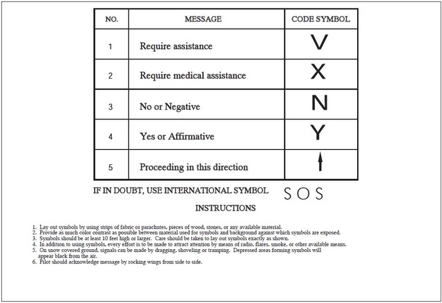
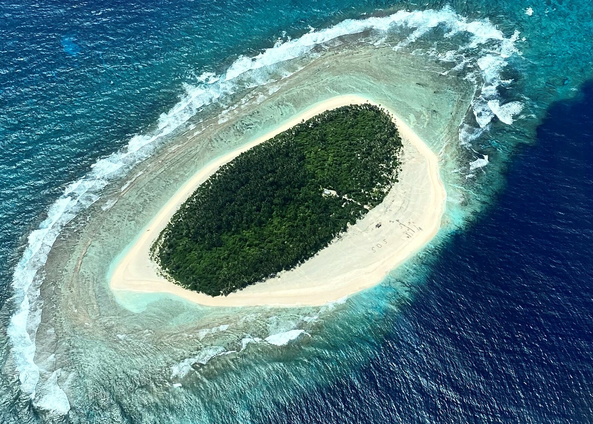

## Read this first

If you are lost, injured, or stranded, your single most important job is to become **easy to find**. Rescuers — whether that's a search-and-rescue helicopter, a hiker on a ridge, or a neighbor on a rooftop after a flood — cannot help you if they don't know where you are. Signaling is the skill of turning your location into something that stands out against its background: a sound that isn't natural, a flash that isn't sunlight on water, a shape that isn't a rock formation.

This guide covers every practical signaling method available to an untrained person with limited gear: fire and smoke, mirrors, whistles, ground symbols, lights, movement, and phones/beacons. It also covers the single most important decision in any rescue situation — whether to **stay put** or **try to self-rescue**.

Read this before you need it. In an actual emergency, stress narrows your thinking; having the steps already in your head (or in this file, readable offline) will save critical time.

## Why this matters

Search and rescue (SAR) statistics consistently show that people who are found quickly are people who make themselves *visible and audible*, not people who hide from bad weather in a way that also hides them from rescuers. A person who builds one good signal fire, blows a whistle in the pattern rescuers are trained to recognize, or lays out a giant "V" on open ground can cut search time from days to hours. Conversely, someone who is quiet, camouflaged, and moving unpredictably can be missed even when searchers pass within sight of them.

Signaling also works in urban and disaster scenarios — after a flood, earthquake, or grid failure, being visible from the air or from a passing boat/vehicle matters just as much as in the wilderness.

## Key terms

- **Signal fire** — a fire built and maintained specifically to produce visible smoke (day) or flame (night) as a distress signal, not for warmth or cooking.
- **Heliograph / signal mirror** — a small reflective surface (mirror, glass, polished metal, phone screen) used to flash sunlight at a target such as an aircraft or distant ridge.
- **Ground-to-air signal** — a large symbol built on open ground (branches, rocks, trampled snow, clothing) meant to be read from an aircraft.
- **Rule of Three** — the internationally recognized distress convention: **three of anything** (three fires, three whistle blasts, three shots, three flashes) signals "I need help," as opposed to one or two of the same thing, which reads as normal background activity.
- **SOS** — the standard distress call, in Morse code: three short, three long, three short (`···  ———  ···`). Also used as a ground symbol.
- **PLB** — Personal Locator Beacon, a dedicated device that sends your GPS location to satellites and triggers a real search-and-rescue response, distinct from a phone.
- **Attraction vs. location signals** — attraction signals (fire, whistle, mirror flashes) get a searcher's attention; location signals (ground symbols, bright clothing laid out) confirm exactly where you are once attention is on your area.
- **Contrast** — how much a signal stands out from its background (color, brightness, shape); the core principle behind almost every signaling method.

## What you need

Minimum gear (much of this can be improvised):

- A whistle (a plastic emergency whistle is loud, doesn't tire out like your voice, and works when you're hoarse or hurt)
- A signal mirror, or any reflective object (phone screen, CD, polished can bottom, foil, sunglasses lens, watch face)
- A light source with a strobe or blink capability (headlamp, flashlight, phone flashlight)
- Materials for a signal fire: dry tinder/kindling, larger fuel wood, and "smoke fuel" (green leafy branches, pine boughs, or — if available and safe to burn — rubber/oil-soaked rags for thick black smoke)
- Brightly colored or high-contrast material to lay out or wave (tarp, clothing, space blanket — the reflective silver/orange kind is ideal)
- A charged phone, even with no service (see Method 7)
- Optional but excellent: a PLB or satellite messenger device
- Something to build ground symbols with: rocks, logs, trampled vegetation, snow, or your own body

You do not need all of these. One good whistle and the knowledge in this guide is enough to dramatically improve your odds.

## Method 1: The Rule of Three (the universal distress pattern)

This is the foundation of every other method below. Learn it first.

1. Whatever signal you make — sound, light, fire, smoke — **make it in a group of three**, evenly spaced, then pause, then repeat.
2. Space the three signals with clear, deliberate gaps (roughly 1 fire per point of a triangle; roughly 2-3 seconds between whistle blasts or flashes).
3. Repeat the set of three periodically (every few minutes for fire/mirror; whenever you hear a plane, vehicle, or voice for whistle/light).
4. If you are the one hearing/seeing a possible distress signal, a reply of **one or two** blasts/flashes tells the person in distress "I see you / I hear you, help is coming."

**How to verify:** Anyone trained in wilderness or maritime safety — and most outdoor-savvy civilians — recognizes three-of-anything as distress. If you only have energy or resources for one thing in this entire guide, make it "always signal in threes."

## Method 2: Signal fires (day = smoke, night = flame)

Fire is one of the most effective long-range signals available, visible for miles as flame at night and miles as smoke by day.

1. **Choose a site** on the highest open ground you can safely reach, away from overhanging trees or dry brush that could carry the fire into a wildfire. Near water is good if it's also open and elevated (reflects light, and rescuers travel waterways).
2. **Build three separate fire piles** arranged in a triangle (a recognized distress shape) or in a straight line, spaced several meters apart. Three fires burning together is a stronger, more recognizable distress signal than one large fire.
3. **Prepare each pile in layers**: tinder at the base, kindling above it, then larger fuel wood stacked ready to add. Keep all three piles ready to light **but only light them when you have a real chance of being seen** (you hear/see aircraft, boats, or vehicles) — this conserves fuel, since maintaining three fires continuously is exhausting.
4. **For daytime smoke**: once the fire has a solid flame, pile on green, leafy branches, damp grass, or pine boughs. Green/damp vegetation makes thick white/gray smoke that stands out against a green forest or blue sky. If you have access to something like rubber (old tire scraps, rubber hose) or oil-soaked rags, adding these produces thick **black** smoke, which contrasts better against snow, sand, or a light-colored sky. Never burn anything toxic to breathe yourself — stand upwind.
5. **For nighttime**: keep the flame tall and bright rather than smoky — fire is visible from far greater distances at night than smoke is by day. Feed dry fuel to keep flames high, not smoldering.
6. **Keep the fire circle clear** of overhanging branches and dry leaf litter; scrape a bare-earth ring around each pile before lighting.
7. **Maintain a "ready" pile** of extra fuel at all times so you can boost the fire the instant you spot a potential rescuer.


*Figure — A signaling fire built and maintained specifically to produce a tall, visible column of smoke, photographed during cosmonaut survival training. This is the look you're aiming for: strong flame at the base feeding a distinct, rising smoke column, not a low smoldering pile. Source: Wikimedia Commons (File:Signaling fire during preparatory work for survival training. (6429788251).jpg), photo by Samantha Cristoforetti, CC BY 2.0.*

**How to verify:** A properly fed signal fire should be producing a distinct column of smoke or a visible flame that a person a mile or more away, with a clear line of sight, would notice as different from ambient haze or campfire glow. If your smoke is thin and drifting away rather than a solid column, add more green fuel.

## Method 3: Signal mirror / heliograph

A mirror flash can be seen for many miles in good sunlight — sometimes farther than any other visual signal — and takes almost no energy to use.

1. **Hold the mirror close to your eye**, reflective side facing the sun.
2. **Extend your other hand** at arm's length, forming a "V" or "peace sign" with two fingers pointed at the target (aircraft, ship, ridge, person).
3. **Catch the sunlight on the mirror** and angle it so the bright spot of reflected light lands on your extended fingers/hand.
4. **Look through the mirror's aiming hole** if it has one (most emergency signal mirrors have a small hole or mesh in the center) — you should see a bright "fireball" of light lined up with the target, seen through the hole, while the mirror is against your cheek/eye.
5. **If your mirror has no aiming hole**, improvise: hold two fingers up in a V toward the target, catch the sun's reflection on the mirror, and walk the reflected light spot onto your fingers, then tilt slightly until it appears to pass "through" the V toward the target.
6. **Sweep slowly** back and forth across the target area rather than holding perfectly still — an aircraft or search party may only catch the flash for an instant, and slow sweeping increases the odds the flash crosses their eyes.
7. **Flash in sets of three** whenever possible, even when just aiming generally at the horizon in hopes of catching a searcher you can't yet see or hear.
8. Continue flashing periodically even on hazy or overcast days — mirrors can still work with diffused light, just at shorter range.


*Figure — Two signallers operating a Mance Mark V heliograph (a tripod-mounted signal mirror device) during desert training, 1940. The signaller sights through the mirror toward the target while adjusting its angle to catch and aim the reflected sunlight — the same aim-through/sight principle used with a handheld emergency signal mirror. Source: Wikimedia Commons (File:Australian Heliograph in Egyptian Desert 1940.png), Australian Department of Information (photographer not credited), public domain.*

**How to verify:** Practice this on a sunny day at home before you ever need it: have a partner stand 50-100 meters away and tell you when they see the flash on their face. This is a skill that's nearly impossible to learn correctly for the first time under stress — practice now.

## Method 4: Whistle

A whistle carries much farther than the human voice, doesn't rely on you having a strong voice (useful if injured, exhausted, or hoarse from shouting), and takes almost no energy.

1. **Use a dedicated emergency whistle** if you have one (pealess/storm whistles work even when wet or cold, unlike voice or pea-whistles that can jam).
2. **Blow three sharp, distinct blasts**, evenly spaced (roughly one blast per second, pause, repeat set).
3. **Pause and listen** for a response (a returned blast pattern, shouting, or other signal) before repeating.
4. **Repeat every few minutes**, and immediately whenever you hear voices, vehicles, dogs, or aircraft — sound carries better than you'd expect, especially across water or in still air, and search teams are specifically trained to listen for repeating patterns of three.
5. If you have no whistle, **shout in sets of three** ("Help! Help! Help!") rather than continuously — it's more recognizable as distress and saves your voice.
6. Whistle blasts beat voice for range and endurance; save your voice for when a searcher is close enough to hear words (directions, "I'm hurt," etc.).

**How to verify:** In open terrain, a whistle can typically be heard at least a half-mile away, farther with wind at your back — noticeably farther than a shout. If searchers are calling out and you can hear them, respond immediately with three blasts even if you're not sure they can hear you yet.

## Method 5: Ground-to-air signals (V, X, SOS)

Pilots and aircrew are trained to look for and recognize a small set of large ground symbols. These work even if you are unconscious of an aircraft's exact position, asleep, or unable to make sound/light signals at the moment a plane passes.


*Figure — Ground-Air Visual Code reference chart showing five recognized ground-to-air symbols: **V** = require assistance; **X** = require medical assistance; **N** = "no" or "negative"; **Y** = "yes" or "affirmative"; and an **arrow** = "proceeding in this direction" — plus **SOS**, the universal distress call. Each is built from simple straight-line strokes so it can be laid out with logs, rocks, or trampled ground (see the symbols and build instructions below). Source: Wikimedia Commons (File:Ground-Air Visual Code for Use by Survivors.png), U.S. Federal Aviation Administration, Aeronautical Information Manual §6-2-6, public domain (U.S. government work).*

1. **Pick the largest open, flat area** you can find with a clear view of the sky — a field, ridge, sandbar, dry lakebed, or clearing. Size matters: aim for symbols **at least 3 meters (10 feet) long per stroke**, and larger is always better (searchers may be scanning from high altitude).
2. **Build symbols from anything that contrasts with the ground**: dark logs/branches on snow or sand, light-colored rocks/sand on dark ground, trampled/dug trenches in grass or snow, spread-out brightly colored clothing, tarps, or a space blanket.
3. **Use one of these three recognized symbols**, per FM 21-76 and international ground-to-air codes:
   - **V** = "Require assistance" (general distress/need help)
   - **X** = "Require medical assistance" (someone is injured and cannot travel)
   - **SOS** = universal distress call, also valid as a ground symbol
4. **Make the strokes thick and with strong contrast**, not thin lines — a thin line of rocks can disappear from altitude; a thick, high-contrast stroke (wide trench, large pile, big tarp panel) reads clearly.
5. **Keep proportions roughly balanced** — each stroke of the letter should be similar in length and at least 1 meter wide, with strokes several times longer than they are wide (a good rule of thumb ratio is about 6:1 length-to-width) so the shape reads as a letter and not a random blob from the air.
6. **Anchor loose materials** (clothing, tarps) with rocks so wind doesn't scatter your symbol.
7. **Add movement or color nearby** if possible (wave a bright cloth) to draw the eye to the fixed symbol first.
8. **Maintain and repair** the symbol — wind, rain, and snow degrade ground symbols over time; check and rebuild them daily if you are staying in place for more than one day.

```
GROUND-TO-AIR SIGNAL SHAPES (build large, high-contrast, on open ground)

  V  =  NEED ASSISTANCE          X  =  NEED MEDICAL HELP

   \       /                       \         /
    \     /                         \       /
     \   /                           \     /
      \ /                             \   /
       V                               \ /
                                         X
                                        / \
                                       /   \
                                      /     \
                                     /       \

  S O S  (also valid; use large blocky letters, not cursive)

   ###   ###   ###           each stroke: 3+ meters long,
   #      #   #   #          thick (1m+ wide), strong
   ###   #   #   #           contrast against background
      #  #   #   #
   ###   ###   ###

Caption: Build any one of these on the largest open, flat
ground available. Use logs, rocks, trenches, or bright
fabric anchored against wind. Bigger and thicker is always
more visible from altitude than a thin or small symbol.
```


*Figure — A real rescue: three mariners stranded on Pikelot Island (Micronesia) in 2020 spelled out "SOS" in large letters on the beach, which an Air National Guard aircrew spotted from the air and used to locate them. This shows exactly what Method 5 describes in practice — a large, high-contrast, simple block-letter ground symbol built with whatever materials (here, palm fronds/beach debris) were on hand. Source: Wikimedia Commons (File:Andersen KC-135 crew locates missing mariners on lone island in the Pacific (cropped).jpg), U.S. Air National Guard, public domain (U.S. government work).*

**How to verify:** Stand back and view your symbol from as far away and as high up as you can (a nearby rise, a tree you can safely climb) — if you can't immediately read the letter from that vantage point, it's too small, too thin, or lacks contrast; rebuild it bigger.

## Method 6: Flashlight, strobe, and Morse SOS

At night, or in low visibility, a light is often your most effective signal.

1. **Use a strobe function** if your flashlight/headlamp has one — a strobing light is instantly recognizable as artificial/distress and is far more attention-grabbing than a steady beam.
2. **If no strobe, flash manually in the SOS pattern**: three short flashes, three long flashes, three short flashes, then pause and repeat.
   - Short flash: on/off quickly (about half a second)
   - Long flash: on for about 2-3 seconds
   - Pattern: `· · ·  — — —  · · ·` (dot dot dot, dash dash dash, dot dot dot)
3. **Aim the light toward the most likely direction of rescue** — a road, ridge, water body, or the direction aircraft have been heard.
4. **Sweep slowly across the horizon** periodically rather than pointing at one fixed spot the whole time, similar to mirror technique, to increase the chance of crossing a searcher's line of sight.
5. **Conserve batteries** — signal in bursts when you have reason to believe someone may be nearby (engine sounds, voices, aircraft) rather than continuously all night, unless you have power to spare.
6. A phone screen set to max brightness, turned on and off in the SOS pattern, is a usable backup if you have no flashlight.

**How to verify:** SOS in Morse is symmetric and easy to double check yourself: three short, three long, three short — if you find yourself unsure of the count, simplify to just three total flashes at a time, which is still recognized as the Rule of Three distress pattern.

## Method 7: Flagging, movement, and making yourself visible

Aircraft and search parties are drawn to **motion and contrast** far more than to a stationary object, even a brightly colored one.

1. **Wave a brightly colored or reflective item** overhead in broad, slow arcs — a jacket, tarp, space blanket (reflective side out), or branch with fabric tied to it.
2. **Get to high, open ground** whenever safely possible — a hilltop, ridge, rock outcrop, or clearing gives you both a better view of potential rescuers and makes you visible from farther away and from more directions, including from the air.
3. **Increase contrast** between yourself and your surroundings: stand in front of a dark tree line if wearing bright clothes, or on light sand/snow if wearing dark clothes — the goal is to never blend in.
4. **Avoid unnecessary camouflage** — resist the instinct to seek deep shelter that hides you from wind and rain if it also hides you completely from view; balance shelter needs against visibility (see `../shelter/shelter.md`).
5. **Stay together as a group** if with others — a cluster of people and gear is easier to spot than a single person, and pooled signaling effort (more whistles, more mirrors) is stronger.
6. **Combine movement with sound**: wave and whistle simultaneously if a possible rescuer is in sight or in hearing range.

**How to verify:** Ask: "If I were a pilot or search team scanning this area from a distance, would I notice something odd here, or does it look like the rest of the landscape?" If the honest answer is "it blends in," change position, add contrast, or add motion.

## Method 8: Electronic signaling (phone and PLB)

Modern electronics are often the fastest path to rescue and should be tried immediately and kept charged/conserved throughout an emergency.

1. **Try to call or text 911 (or local emergency number) even with no visible signal bars.** In the US and many countries, phones will attempt an emergency call on **any available carrier's tower**, not just your own — a call that fails as a normal call may still connect as an emergency call. Text messages sometimes get through on marginal signal that won't support a voice call, so try both.
2. **Turn on airplane mode, then re-enable only Wi-Fi/cell search briefly** if your battery is low, to conserve power between attempts; searching for a signal continuously drains battery fast.
3. **Move to higher, more open ground** to search for signal — signal often improves dramatically on a ridge, roof, or open field compared to a valley or dense tree cover (directly relevant in flat North Texas terrain — see Regional section below).
4. **If you have a Personal Locator Beacon (PLB) or satellite messenger**, activate it according to its instructions (usually a guarded switch or button held for several seconds) and leave it running with a clear view of the sky — these transmit your GPS coordinates directly to a dedicated search-and-rescue satellite system and generally produce the fastest, most reliable rescue response of any method in this guide.
5. **Conserve phone battery** for actual emergency use: turn off screen brightness, close unused apps, and only power on periodically to check for signal if you are not actively mid-call/text, once you've made your best initial attempts.
6. **Note your GPS coordinates** from your phone's map/compass app or a dedicated GPS unit if possible, even without service — you can read these out once you do get a connection, or write them on your ground signal/note.

**How to verify:** After attempting an emergency call/text, check your phone for any confirmation (call log entry, "message sent" status) even if you're not sure it connected — a message can sometimes send successfully even on a signal so weak the call itself dropped.

## Regional & scenario variants

- **North Texas (flat, open terrain):** Much of North Texas is flat prairie and farmland with few natural high points. Use what elevation exists deliberately: **water towers** (visible for miles and often near towns/roads), highway overpasses, grain elevators, barn roofs, and any hill or rise. **Roads themselves are excellent signaling locations** — a stalled vehicle, a person waving from a roadside, or a ground symbol built in a field next to a road will be seen by passing traffic far sooner than in deep wilderness. Open flat land also means **smoke and mirror flashes travel exceptionally far** with nothing to block line of sight — use this to your advantage rather than assuming you need mountains to signal effectively.
- **Wilderness/forest:** Prioritize finding any clearing, ridge, or rock outcrop for ground symbols and fire, since tree canopy blocks both smoke visibility and phone signal. Rivers and lakeshores are natural clearings and rescue-travel corridors.
- **Desert:** Signal fires are highly effective at night (visible for very long distances in clear desert air); by day, mirror flashes and light-colored ground symbols on dark rock (or dark symbols on light sand) work especially well due to high sun exposure and open sightlines.
- **Maritime/coastal:** Signal mirrors are extremely effective over water due to long unobstructed sightlines; an EPIRB (the maritime equivalent of a PLB) should be activated immediately if available. Flares, if carried, follow the same "three" distress convention.
- **Urban/disaster (flood, earthquake, grid failure):** Get to a rooftop or high floor, hang bright/reflective material from windows, and use flashlight SOS at night; the same ground symbols (X for medical, V for assistance) are recognized by disaster-response helicopters checking rooftops. Phones often still find signal on backup cell towers or other carriers even when home service is down — keep attempting calls/texts.
- **Winter/snow:** Trample or dig trenches into snow to form ground symbols (snow's contrast makes trenches very visible from the air); dark clothing or dark branches laid on snow also read clearly. Conserve fire fuel carefully, as gathering dry wood is harder.

## ⚠️ Safety

- **Never build a signal fire that you cannot control.** Clear a wide bare-earth perimeter, keep water or dirt on hand to extinguish quickly, and never leave a large fire unattended in dry, windy, or drought conditions — an out-of-control fire turns a rescue situation into a life-threatening wildfire.
- **Do not burn anything that produces dangerously toxic smoke to breathe in an enclosed or downwind position** — stand upwind of your own fire, and if using rubber/plastic for black smoke, keep it small and be aware of the fumes.
- **Never point a laser pointer, signal mirror flash, or bright light directly at an aircraft's cockpit at close range** — momentarily blinding a pilot is dangerous; aim the general flash in the aircraft's direction and sweep, rather than fixating a steady beam on the windshield.
- **Do not exhaust yourself shouting continuously** — save your voice; use a whistle or wait for closer proximity before relying on voice.
- **Do not wander far from your signals to search for rescuers** — if you've invested effort in a fire, ground symbol, or known location, leaving it unattended to go looking for help yourself can mean a search team finds your signal but not you (see Stay vs. Go below).
- **Battery conservation matters** — do not run a phone flashlight or strobe continuously for hours if you may need power later for an emergency call; balance visibility against having power when it matters most.
- **Three of anything, not one** — a single flash, single shot, or single fire can be mistaken for something ordinary (lightning, a hunter, a campfire); always default to sets of three to avoid being misread as normal activity.

## Troubleshooting

- **"My mirror flash doesn't seem to be reaching anyone."** Practice the aiming technique (Method 3) beforehand if possible; without an aiming hole, use the two-finger V technique and sweep slowly rather than holding still — a stationary flash is easy to miss, a sweeping one is more likely to cross someone's eyes.
- **"My fire makes a little smoke but it's not a strong column."** Add more green, leafy, or damp material directly onto strong flame/coals — smoke quality depends on burning green fuel on a hot fire, not a smoldering weak one; build the flame up first, then add smoke fuel.
- **"I don't have a whistle and I'm losing my voice."** Use any hard object to bang out sets of three against metal, rock, or wood — a repeated sharp knocking sound in threes carries and is far less tiring than shouting.
- **"My phone shows no service at all."** Still attempt an emergency call and a text — emergency calls can route through any available tower regardless of your carrier; also try moving to higher/more open ground, since a small improvement in signal can be the difference between no connection and a connected emergency call.
- **"I built a ground symbol but I'm not sure it's visible from the air."** View it yourself from as far and high as you safely can; if it doesn't read clearly from a distance, make the strokes thicker (not just longer) and increase contrast (darker materials on light ground or vice versa).
- **"I hear a plane/helicopter but it's flying away."** Don't chase it. Immediately begin your loudest/brightest available signal (mirror, fire boost, whistle in threes) — aircraft on search patterns typically return on a grid pattern, and a missed pass is common; stay at your signal location so the next pass can find you.
- **"It's overcast and I have no fire, no phone signal — what can I still do?"** Ground symbols, whistle blasts in threes, waving bright/reflective material, and movement still all work without sun or fire; overcast conditions reduce mirror effectiveness but don't eliminate it entirely — diffuse light can still produce a visible flash at closer range.

## The decision: Stay or Go

This decision matters as much as any signaling technique, because it determines whether your signals ever get a chance to work.

- **Generally, STAY** if: someone knows your planned route/return time and is likely to alert search and rescue; you are injured or exhausted; you have shelter, water, and can maintain signals; or the terrain/weather makes travel dangerous. A stationary, well-signaled position is far easier for organized search efforts to find than a moving target.
- **Consider moving (carefully, marking your trail)** only if: no one knows to look for you and none will realize you're missing soon; you have a specific, reachable, known destination (a road, ranger station, water tower) visible or confidently known to be close; you have no way to survive long enough at your current spot (no water source, severe exposure risk); or you can move to noticeably better signaling ground (a hilltop, a road, an open field) without much added risk.
- **If you do move**, leave clear sign of your presence and direction at your original location — a large ground symbol, a note with date/time/direction of travel, and markers along your route — so a search team that reaches your start point can follow you.
- **Whichever you choose, keep signaling.** Staying doesn't mean staying silent — maintain your fire, mirror, whistle, and ground symbols the entire time you wait.

## Quick-reference checklist

- [ ] Default to the **Rule of Three** for every signal type — three fires, three blasts, three flashes, then pause and repeat
- [ ] Try phone call/text to 911 immediately, even with no visible bars; activate a PLB/satellite messenger if you have one
- [ ] Move to the highest, most open ground safely available (hill, ridge, water tower, overpass) to improve every signal type at once
- [ ] Build ground-to-air symbols (V, X, or SOS) large, thick, and high-contrast on the most open flat ground nearby
- [ ] Prepare a signal fire in three piles/triangle, ready to light; use green/damp fuel for daytime smoke, dry fuel for bright night flame
- [ ] Practice mirror aiming (V-finger or aiming-hole technique) and sweep slowly across likely search directions
- [ ] Use a whistle in sets of three rather than shouting; save your voice
- [ ] At night, use a strobe or manual SOS flash pattern (··· — — — ···), aimed toward likely rescue directions
- [ ] Increase your visual contrast and add motion (waving bright/reflective fabric) whenever a possible rescuer may be in sight or hearing range
- [ ] Decide deliberately between staying (usually safer) and moving; if moving, mark your original location and route clearly
- [ ] Conserve fuel, battery, and voice — signal in bursts tied to real opportunities (aircraft/vehicle/voice heard) rather than continuously, except at night with fire/light where visibility rewards sustained effort

## Sources & further reading

- reference/manuals/Signaling_Techniques.pdf — dedicated signaling methods reference, including mirror/heliograph aiming and ground-to-air symbols
- reference/manuals/fm21-76_survival_manual.pdf — U.S. Army Survival Manual FM 21-76, sections on signaling, ground-to-air recovery codes, and rescue procedures
- See also: `../fire/fire.md` for fire-building fundamentals, `../navigation/navigation.md` for locating high ground and route-marking, `../regional-north-texas/regional-north-texas.md` for local terrain notes, `../communication/communication.md` for broader emergency communication, `../shelter/shelter.md` for balancing shelter against visibility
