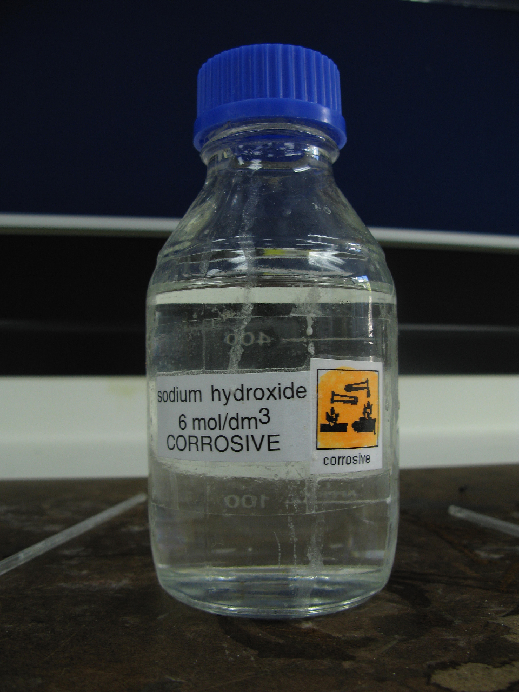
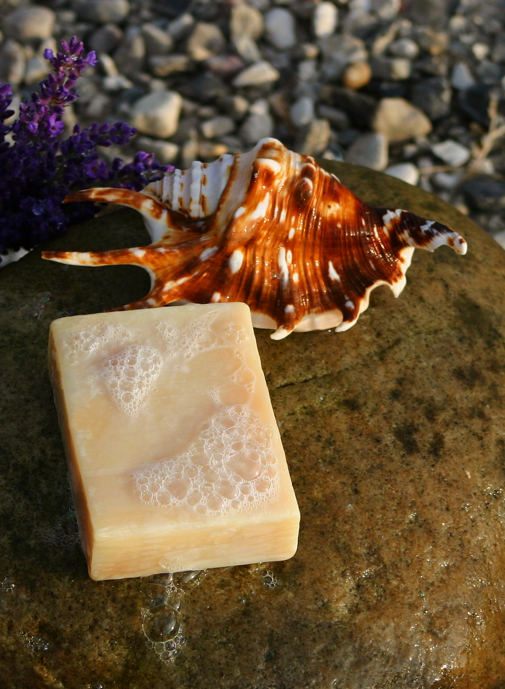

# Making Soap & Hygiene Supplies From Scratch

## Read this first (the 30-second version)
1. **Soap is just fat + a strong alkali (lye) + water.** Store-bought **lye (sodium hydroxide, NaOH)** gives predictable, safe bar soap. **Wood-ash lye** is real but unpredictable in strength — treat it as a *cleaning-solution/soft-soap* fallback, not a precise recipe.
2. **Lye is caustic — it can blind you or burn your skin on contact.** Always: **safety glasses + rubber/nitrile gloves**, work in **fresh air**, **add lye TO water** (never the reverse — adding water to lye can erupt and splash), and **never use aluminum** containers or utensils (lye dissolves aluminum and releases dangerous hydrogen gas).
3. **You do not need lye at all for basic hygiene.** Baking soda cleans teeth, plain water + cloth + a little soap (or none) cleans skin, and soapwort/yucca plants make suds without any lye.
4. **Cold-process soap** (fat + lye solution + water, mixed to "trace," poured in a mold) must **cure 4–6 weeks** before use — it is still caustic and harsh right after making.
5. **Hot-process soap** (cooked after mixing) finishes saponifying in a few hours and is usable within days — trade speed for a rougher-looking bar.
6. **If lye touches skin:** flush with cool running water for **15–20 minutes**, remove contaminated clothing. **If it touches eyes:** flush continuously with clean water for **at least 20–30 minutes and keep flushing until emergency responders take over** — alkali (lye) burns penetrate longer than acids — holding the eyelid open, and get emergency medical care immediately. Do **not** use vinegar or any neutralizer. Lye eye injuries can cause permanent blindness in minutes.

The rest of this guide walks a total beginner through rendering fat, making lye two different ways, cold-process and hot-process soap step-by-step with real numbers, no-lye cleaning options, and other hygiene supplies (tooth powder, improvised toothbrush, deodorant, basic cleaners).

---

## Why this matters
In a long emergency, disease — not the disaster itself — is often the biggest killer. Dirty hands, unwashed bodies, and unbrushed teeth spread the germs that cause diarrhea, skin infections, and dental abscesses, at exactly the time when a doctor, dentist, or pharmacy may be unreachable. Soap is one of the single most effective disease-prevention tools ever invented — it doesn't just rinse dirt away, it physically breaks apart the fatty membranes of many bacteria and viruses. When store soap runs out and can't be resupplied for months, knowing how to render fat, source or make lye, and turn them into real soap — plus simple substitutes for toothpaste, deodorant, and cleaners — keeps a household functioning and healthy long after the shelves are empty. This guide focuses on **cold- and hot-process soap making**; for the daily hygiene habits soap supports (handwashing technique, bathing with little water, laundry, menstrual hygiene, isolating a sick person), see the [Sanitation & Hygiene guide](../sanitation-hygiene/sanitation-hygiene.md), which this guide does not repeat.

## Key terms (plain language)
- **Lye** — a strong alkali (base) used to break fat down into soap. Two kinds matter here:
  - **Sodium hydroxide (NaOH)** — "caustic soda," sold as store lye (drain cleaner or soap-making lye). Makes **hard bar soap**. Reliable, measurable strength.
  - **Potassium hydroxide (KOH)** — what you get from leaching hardwood ashes with water. Makes **soft/liquid soap** unless "salted out." Strength varies and is hard to measure precisely at home.
- **Saponification** — the chemical reaction where fat + lye + water turn into soap (and glycerin, a moisturizing byproduct). It is **not reversible** by rinsing — it takes the right ratio and time.
- **Tallow** — rendered (melted and strained) fat from beef or mutton/lamb. Hard, makes long-lasting bars.
- **Lard** — rendered pig fat. Softer than tallow, still makes good bar soap.
- **Rendering** — melting raw fat slowly and straining out the solid bits (cracklings) to leave clean, pourable fat.
- **SAP value (saponification value)** — how much lye a specific fat needs to fully turn into soap. Every fat/oil has a different SAP value; this is why you can't just guess — see the table in Part 3.
- **Superfat** — intentionally using *slightly less* lye than the SAP value calls for, so a little unreacted fat is left in the finished bar (gentler on skin, and a built-in safety margin against "lye-heavy" soap). Beginner recipes should use **5–8% superfat**.
- **Trace** — the point during mixing when the soap batter has thickened enough that a drizzle from the spoon/blender leaves a visible trail on the surface for a second or two before sinking back in. This is when you pour it into the mold.
- **Cold process (CP)** — mixing fat + lye solution at moderate temperature and letting the chemical reaction finish slowly inside the mold over weeks.
- **Hot process (HP)** — cooking the soap batter after trace (slow cooker, double boiler) so saponification finishes in hours, not weeks.
- **Curing** — the weeks-long resting period after unmolding when a CP bar loses water, hardens, and the last of the lye finishes reacting, making the bar milder and longer-lasting.
- **Trace-time caustic burn risk** — raw soap batter (before it cures) is still highly alkaline and will irritate or burn skin — treat it like the raw lye solution until it has cured.
- **Saponins** — natural soap-like compounds in certain plants (soapwort, yucca) that make suds in water **without any lye or saponification** at all.

---

# PART 1 — RENDERING FAT (TALLOW & LARD)

**What it does:** Turns raw animal fat trimmings into clean, storable fat suitable for soap (and cooking). This is the single most common "you need" ingredient below.

**You need:** raw fat trimmings (beef/lamb fat = tallow when rendered; pork fat = lard), a large pot, water, a heat source, cheesecloth or a clean thin cotton cloth, a strainer, and heat-safe storage containers (jars, tins).

> If you don't raise or butcher your own animals, see the [Livestock & Animal Husbandry guide](../livestock-animal-husbandry/livestock-animal-husbandry.md) for humane butchering and using every part of the animal, including trimmed fat. Kitchen fryings/drippings saved over time work too, but must be clarified first (Method 2 below).

## Method 1 — Wet rendering (best for beginners; gentler, cleaner result)
1. Cut or grind the raw fat into small chunks (smaller pieces render faster and more evenly).
2. Put the fat in a pot with about an equal volume of water (the water keeps the fat from scorching and helps separate impurities).
3. Heat **slowly** over low heat, stirring occasionally, for 1–3 hours, until the fat has fully melted and the solid bits ("cracklings") have shrunk, browned, and floated free.
4. Strain through cheesecloth into a heat-safe container, pressing the cracklings to squeeze out the last fat. Save the cracklings — they're edible and a good source of fat/calories.
5. Let the container cool undisturbed. The clean fat rises and hardens on top; any water and impurities settle underneath. Once solid, lift the fat cake off, scrape off any soft/discolored residue on its underside, and re-melt briefly to pour off any remaining water pooled below.
6. Store in a sealed jar in a cool, dark place. Well-rendered tallow can keep for many months at cool room temperature (longer refrigerated/frozen); if it ever smells rancid/sour, don't use it for soap or food.

## Method 2 — Dry rendering / clarifying kitchen fryings (for pan drippings, not raw fat)
1. Place saved fryings/drippings in a pot with an equal amount of water.
2. Bring to a boil, remove from heat, and stir.
3. Add 1 quart of cold water for each gallon of hot liquid; do **not** stir again.
4. Let stand until fully cool. The clarified fat solidifies on top — lift it off. This step removes salt and food particles left over from cooking, which would otherwise spoil a soap batch.

**How to tell it worked:** clean rendered fat is pale, firm (tallow) or soft-white (lard), and smells neutral, not meaty or rancid. **If it didn't:** a strong meaty/rancid smell means impurities remain — re-render with fresh water, or discard if it smells sour/spoiled rather than just "meaty."

---

# PART 2 — MAKING LYE

You have two real options: **buy sodium hydroxide** (reliable, recommended) or **leach it from hardwood ashes** (free, but weak and unpredictable). Read both before choosing.

## 2A. Store-bought lye (sodium hydroxide, NaOH) — the reliable option
Sold as "100% sodium hydroxide" or "lye" for soap making, or as some drain cleaners (check the label — it must be **pure NaOH with no additives, metal flakes, or other chemicals**; many modern drain cleaners are not pure lye and are unsafe substitutes). It comes as white flakes, pellets, or beads.

**Why prefer it:** a known, consistent concentration lets you calculate an exact, safe recipe (Part 3) with a real superfat safety margin. This is the method the two extension guides in this knowledge base's reference library (see Sources) are built around, and it's what almost all modern soap makers use.

**Handling and storage:**
- Keep it in its original sealed, labeled container, in a dry place, out of reach of children and pets. It absorbs moisture from air over time — reseal tightly after each use.
- Never store it in a container that could be mistaken for food or drink.

## 2B. Wood-ash lye (potassium hydroxide) — the free but unreliable option
**What it does:** Water leached slowly through hardwood ashes dissolves potassium carbonate/hydroxide compounds, producing a caustic "lye water." This is the traditional pioneer method, and it genuinely works — but its strength depends on the wood species, how completely it burned, ash freshness, and how much water you use, so **you cannot calculate a precise, safe fat ratio from it the way you can with store lye.**

**You need:** clean ash from **hardwood only** (oak, hickory, ash, maple, beech — common in and around North Texas woodlots and creek bottoms). **Do not use** softwood/pine ash (resin content gives poor, unpredictable lye and a bad smell), ash from treated/painted/glued lumber, charcoal briquettes (additives), or ash contaminated with trash. A wooden barrel or large bucket with small holes drilled in the bottom, straw or gravel for a filter layer, a non-metal (or stainless) catch container, and rainwater or other soft water (hard water leaches poorly).

**Steps — the drip-barrel method:**
1. Line the bottom of the barrel/bucket with a few inches of straw or small gravel over the drainage holes, to filter the ash and slow the flow.
2. Fill the barrel with hardwood ash, packing it loosely.
3. Slowly pour rainwater over the ash — a little at a time, letting it soak in — until water begins dripping from the bottom.
4. Catch the dripping liquid ("lye water") in a **non-aluminum** container underneath. It will look brownish-yellow.
5. **Pour the same liquid back over the ash 2–4 more times** (recirculate it) to concentrate it further — this is the step most beginners skip, and skipping it is the main reason home wood-ash lye turns out too weak to make soap.

**Testing strength (traditional field tests — approximate only, not a substitute for a real measurement):**
- **Egg/potato float test:** a fresh egg or a peeled potato should float with roughly a quarter-sized patch showing above the surface. If it sinks, the lye is too weak — recirculate through the ash again or boil the liquid down to concentrate it.
- **Feather test:** dip a clean feather in the lye water; if the barbs start to dissolve/disintegrate within a few minutes, the lye is strong enough to make soap.
- ⚠️ **These are rough folk tests, not a lab measurement.** Even when they say "strong enough," the concentration still isn't consistent enough to calculate a safe superfat margin the way sodium hydroxide allows. Expect the resulting soap to be **soft or liquid**, not a hard bar, and expect batch-to-batch variation.

**Making the ash-lye stronger for soap (traditional fix):** boil the collected lye water down in a non-aluminum pot to reduce its volume and concentrate it, testing again with the float test as you go.

**"Salting out" (turning soft potassium soap into a harder bar):** once you've cooked ash-lye and fat into a soft soap (Part 4's hot-process method works for this), stir in ordinary salt (canning/pickling salt, not iodized if you can help it) dissolved in hot water. The salt makes the soap curds separate from the liquid and float — skim them off, and you have a firmer, more bar-like soap, though still less predictable than an NaOH bar.

> ⚠️ **Bottom line:** wood-ash lye is a legitimate emergency skill and a fine base for a **cleaning solution** (see Part 5) or a rough soft/liquid soap. For soap you intend to use on skin regularly, **store-bought sodium hydroxide is strongly preferred** because you can calculate a safe, mild recipe.

---

# PART 3 — COLD-PROCESS SOAP, STEP BY STEP (the main method)

**What it does:** Mixes measured fat with a measured lye solution; the chemical reaction (saponification) finishes slowly over weeks inside the mold and during curing. Produces the hardest, longest-lasting, mildest bars when done right.

**You need:**
- Rendered fat (Part 1) — tallow, lard, or a mix. (Vegetable oils like olive or coconut oil also work and are commonly blended in, but this guide's beginner recipe uses a single animal fat to keep the ratio simple.)
- **Sodium hydroxide (lye)** — see Part 2A. **Do not substitute wood-ash lye in this precise recipe** (Part 2B) — use it only for the soft-soap/hot-process route in Part 4/Part 5.
- Water (distilled or clean rainwater preferred; hard tap water can affect the lather).
- A **kitchen scale that weighs in grams** — soap making is measured by **weight, never volume**. A misjudged cup of lye can make dangerously caustic soap.
- Two heat-safe containers: one for the lye solution (glass, stainless steel, or heavy HDPE plastic — **never aluminum, tin, or non-stick-coated pans**), one for melting the fat.
- A stick (immersion) blender or a sturdy whisk, a thermometer, a mold (a wax-paper- or freezer-paper-lined wooden or cardboard box, silicone mold, or loaf pan), and full safety gear (below).

## Safety setup (do this before you touch the lye)
> ⚠️ **Read this before starting. Lye is the most dangerous material in this entire guide.**
- Wear **safety glasses or goggles** (not just regular glasses) and **rubber, nitrile, or neoprene gloves** — no bare skin contact.
- Work in a **well-ventilated area** — outdoors or by an open window/fan. Dissolving lye releases sharp fumes for a minute or two; avoid breathing directly over the container.
- **Always add lye TO water — never water to lye.** Adding water to concentrated lye can cause a violent, splattering reaction. Pour the lye crystals slowly into the water while stirring, not the reverse.
- Use **only non-aluminum** containers and utensils. Lye reacts with aluminum to release flammable, toxic hydrogen gas and pits the metal — use stainless steel, glass, enamel, or heavy plastic.
- Mixing lye and water gets **hot fast** (up to ~200°F/93°C) — this is normal, but handle the container carefully and let it sit somewhere stable to cool.
- Keep children, pets, and distracted people **out of the work area** entirely, from mixing through pouring into the mold.
- Have a **plan for spills**: keep a clear path to a sink or hose, and know where the nearest running water is before you start.

## The formula (why exact numbers matter)
Every fat needs a different amount of lye to fully saponify — that's the **SAP value**. Use too little lye and the soap stays greasy and won't preserve well; use too much and the bar is caustic and will burn skin. The **superfat** discount (5–8% less lye than the full SAP value) builds in a safety margin.

| Fat | Approx. SAP value (NaOH) |
|---|---|
| Lard (pork fat) | 0.139 |
| Tallow (beef/mutton fat) | 0.140 |
| Coconut oil | 0.183 |
| Olive oil | 0.134 |
| Vegetable shortening | 0.136 |

**Formula:** `grams of lye needed = grams of fat × SAP value × (1 − superfat fraction)`

**Water** is typically **30–38% of the fat's weight** for a beginner recipe (more water = softer bar that takes longer to cure; less water = firms up faster but is trickier to mix).

## Beginner recipe — 100% lard or tallow soap, ~5% superfat (makes about 8–10 bars)
| Ingredient | Amount |
|---|---|
| Rendered lard or tallow | 900 g (≈ 2 lb) |
| Sodium hydroxide (lye) | 119 g |
| Cold water | 300 g (≈ 300 mL) |

*(Check this math yourself before scaling: 900 g × 0.139 (lard) × 0.95 ≈ 119 g. If you change the amount of fat, or switch fats, or want a different superfat percentage, recalculate — do not just scale by eye. If you have internet access ahead of time, print out a lye calculator's output for your exact fats as a backup reference.)*

## Steps
1. **Weigh everything precisely** on the gram scale — fat, lye, and water, each in its own container.
2. **Put on your safety gear** (goggles, gloves). In a well-ventilated space, slowly pour the weighed lye into the weighed cold water (never the reverse), stirring gently until fully dissolved. It will fume briefly and heat up — set it aside somewhere stable and child/pet-free to cool.
3. Melt the weighed fat gently until fully liquid, then let it cool. You want the fat and the lye solution to reach roughly similar, moderate temperatures before combining — around 90–110°F (32–43°C) for lard/tallow is a reasonable beginner target (warmer for harder fats like pure tallow, cooler for softer fats like lard, per the temperature guidance in this guide's reference Extension circular).
4. **Slowly pour the lye solution into the melted fat** (not the reverse), stirring gently and continuously with the stick blender or whisk.
5. Mix until the batter reaches **trace** — it thickens to a light-pudding consistency, and a drizzle from the blender/spoon leaves a visible trail on the surface for a second before sinking back in. With a stick blender this can take just a few minutes; by hand-whisking it may take much longer.
6. Pour the batter into your lined mold. Tap it on the counter a few times to release air bubbles. Cover with cardboard or a lid, and insulate with a towel or blanket on top to hold the heat in — this helps the reaction finish evenly (the historic method: "cover and let remain undisturbed for 24 hours").
7. **Leave it undisturbed for 24–48 hours.** It will likely go through a "gel phase" (turning darker and translucent in the center) — this is normal and means the reaction is proceeding.
8. **Unmold and cut into bars** once firm enough to hold its shape (usually 1–2 days). Wear gloves still — it's not fully cured yet.
9. **Cure the bars for 4–6 weeks** in a dry, ventilated spot, turning occasionally, spaced so air reaches all sides. This lets the soap harden, lose excess water, and finish neutralizing — **do not use it on skin before curing is complete**, as fresh soap is still alkaline enough to irritate or burn.

**How to tell it worked:** after curing, the bar is firm, doesn't crumble, produces a normal lather with water, and doesn't feel slippery/slimy on wet skin (a persistent slick, slippery feel after rinsing is a sign of excess free lye — see Troubleshooting).

**If it didn't:** see the Troubleshooting table near the end of this guide.

---

# PART 4 — HOT-PROCESS SOAP (faster, more forgiving of ash-lye's unreliability)

**What it does:** Cooks the soap batter after trace so saponification finishes in hours rather than weeks. Good when you need usable soap sooner, and the traditional route for finishing soft ash-lye soap (Part 2B) into something usable faster.

**You need:** everything from Part 3 (fat, lye, water, scale, safety gear) plus a slow cooker, double boiler, or heavy pot you can hold at a low simmer without scorching.

**Steps:**
1. Follow Part 3, steps 1–5, to reach trace.
2. Transfer the batter to a slow cooker (low setting) or a pot over very low, indirect heat (double boiler).
3. Cook, stirring occasionally, for roughly 1–3 hours. It will pass through stages: a thin gel, then a translucent, glossy mass that looks like petroleum jelly or mashed potatoes with a slightly waxy sheen. This translucent stage is the sign the lye has fully reacted.
4. **Test a small cooled sample** on your tongue (touch briefly, don't hold it there) — if it gives a sharp, electric "zap," saponification isn't complete; keep cooking and test again in 15–20 minutes. No zap means it's done. (This zap test only applies to fully-cooked hot-process batter, never to raw cold-process batter, which is always unsafe to taste.)
5. Once done, pack the thick paste into a mold, pressing to remove air pockets. It sets much faster than cold-process.
6. Unmold within a day or two. Hot-process soap is generally safe to use within a few days to a week, though letting it sit 1–2 weeks further still improves hardness and mildness.

**How to tell it worked:** the finished paste looks uniformly translucent/glossy with no zap on the tongue test, and hardens into a usable, non-greasy bar. **If it didn't:** an oily sheen or greasy feel after cooking usually means it needs more cook time; a batch that never gels can mean the fat and lye temperatures were too far apart at mixing — next time, get both closer in temperature before combining.

---

# PART 5 — NO-LYE ALTERNATIVES (no chemistry, no waiting)

You do not have to make lye-based soap at all to get clean. Two real fallback options:

## 5A. Wood-ash lye water as a plain cleaning solution (not a soap)
Skip the soap-making step entirely and use the leached ash-lye water itself (Part 2B) as a degreasing wash for pots, tools, and heavily soiled laundry — the same mild alkaline effect that makes plain wood ash useful for handwashing in a pinch (see the [Sanitation & Hygiene guide, Section 5](../sanitation-hygiene/sanitation-hygiene.md)) is stronger in liquid ash-lye form. Rinse items well afterward; this is a cleaning aid, not something to leave on skin.

## 5B. Saponin plants — soapwort and yucca (real soap substitutes, zero lye)
Certain plants contain **saponins**, natural compounds that foam in water without any chemical reaction at all.
- **Soapwort (*Saponaria officinalis*)** — a naturalized garden/roadside plant; crush the leaves, stems, or roots and agitate vigorously in water to raise suds usable for washing hands, hair, or delicate fabric.
- **Yucca** — common across Texas; the roots (and in some species, leaves) are pounded/crushed and worked in water to produce lather, a technique long used by Native peoples of the Southwest.

> ⚠️ **Correct plant identification is essential before using any plant this way** — see the [Foraging & Wild Edibles guide](../food-foraging-wild-edibles/food-foraging-wild-edibles.md) for positive-ID method and poisonous lookalikes before you rely on any wild plant. When in doubt, don't use it.

**Steps (general method for either plant):**
1. Crush/pound the plant material (roots give the most suds) to expose the saponins.
2. Soak or vigorously agitate it in a small amount of warm water for a few minutes.
3. Strain out the plant fibers; use the sudsy water directly for washing hands, hair, or laundry.
4. **This is a mild cleanser, not a disinfectant** — it lifts dirt and oil but does not reliably kill germs the way real soap's fat-breaking action or an alcohol/bleach solution does. Follow with plain water rinsing, and prefer real soap or a disinfectant when treating a wound or before food handling if you have any available.

---

# PART 6 — OTHER HYGIENE SUPPLIES FROM SCRATCH

## 6A. Tooth powder (no toothpaste needed)
**You need:** baking soda (sodium bicarbonate) — plain, unscented. Optional: a small pinch of plain salt, a tiny drop of peppermint or cinnamon extract for taste, or a pinch of ground cinnamon.
1. Use baking soda straight, or mix roughly 4 parts baking soda to 1 part salt if you want a slightly more abrasive plaque-scrubbing powder.
2. Dip a wet toothbrush (or the improvised toothbrush below) into the powder and brush as normal, at least twice a day.
3. Rinse well with water afterward.

> ⚠️ **Do not use baking soda as your everyday toothpaste indefinitely without a break** — its abrasiveness can wear enamel over months of exclusive daily use. It's an excellent emergency fallback; return to a fluoride toothpaste the moment it's available, and see a dentist for any real tooth pain (see the dental emergency reference in Sources).

## 6B. Improvised toothbrush ("chew stick")
1. Cut a fresh, green twig about 6 inches (15 cm) long, roughly pencil-thick, from a **known non-toxic hardwood** (many fruit and nut trees used in cooking are safe choices; when in doubt about a species, don't put it in your mouth — check the Foraging guide's identification method first).
2. Chew or mash one end gently until the fibers fray into a soft, brush-like tuft.
3. Dip the frayed end in tooth powder or plain water and brush as normal. Trim/re-fray or cut a fresh twig every few days.
4. **Alternative:** wrap a clean cloth or piece of gauze around a finger, dab with tooth powder, and rub the teeth and gums — crude but effective in a pinch. A clean, thin, strong thread can substitute for floss between teeth.

## 6C. Deodorant
1. **Dry powder method:** pat a small amount of plain baking soda (or a baking-soda + cornstarch/arrowroot mix, roughly half and half, to reduce irritation) under clean, dry underarms. Cornstarch/arrowroot alone (no baking soda) helps absorb moisture even without odor control.
2. **Vinegar wipe:** wipe underarms with a cloth dampened in diluted white vinegar (odor-causing bacteria dislike the acidity); let air-dry before dressing.
3. **Alcohol wipe:** a cloth dampened with plain rubbing (isopropyl) alcohol wipes down and disinfects the underarm area, reducing odor-causing bacteria, and evaporates quickly.
4. **Test any of these on a small patch of skin first** — baking soda directly on skin irritates some people; if redness or itching develops, switch to the cornstarch-only or vinegar option.

## 6D. Basic cleaning solutions
- **All-purpose surface cleaner:** equal parts white vinegar and water in a spray bottle; wipe and let air-dry. Do not use on natural stone (marble/granite), which vinegar's acid can etch.
- **Scrubbing paste for pots/tough grime:** baking soda plus a little water to form a paste; scrub, then rinse.
- **Disinfecting surfaces/sick-room items:** a diluted household bleach solution — see the [Sanitation & Hygiene guide](../sanitation-hygiene/sanitation-hygiene.md) for the correct dilution ratios and contact times; do not improvise your own bleach ratio.
- **Heavy degreasing (tools, greasy pots, workshop items — not skin):** wood-ash lye water (Part 5A) is a strong, free degreaser for non-food-contact items.

## 6E. Lye-free emergency body cleaning (little or no soap, little or no water)
- **Sponge bath:** wet a cloth, add a small amount of soap if available, wash and rinse in sections — face, underarms, groin, feet first, since these matter most for skin infections. A liter or two of water can adequately clean one person; see the fuller technique in the [Sanitation & Hygiene guide, Section 6](../sanitation-hygiene/sanitation-hygiene.md).
- **No soap at all:** plain water and vigorous rubbing with a clean cloth still removes a meaningful amount of surface oil, sweat, and loose dirt — always better than nothing, especially on hands before eating or tending a wound.
- **Dry shampoo:** work a small amount of cornstarch or plain baking soda into the roots of the hair, let it sit a minute to absorb oil, then brush/comb out thoroughly.
- **Alcohol/witch hazel wipe-down:** a rubbing-alcohol- or witch-hazel-dampened cloth wiped over the body is a fast, low-water way to reduce odor-causing bacteria between real washes (avoid on broken skin/open wounds — it stings and can damage healing tissue).

---

## North Texas / regional notes
- **Fat supply:** North Texas households that raise or process their own livestock (common on rural Collin County properties) will have ready access to beef tallow and pork lard trimmings from butchering — see the [Livestock guide](../livestock-animal-husbandry/livestock-animal-husbandry.md) for humane processing.
- **Hardwood ash:** post oak, blackjack oak, pecan, and other hardwoods common on North Texas properties and creek bottoms are suitable for wood-ash lye; mesquite works but its low, dense ash yield makes it a slower source. Save ash from your wood-burning fire pit or stove (see the [Fire guide](../fire/fire.md)) rather than discarding it.
- **Summer heat and curing:** hot, dry North Texas summers actually help cold-process soap cure faster (better evaporation) — but keep curing bars out of direct sun and away from high humidity swings, which can cause a rough "soda ash" film on the surface (cosmetic only, doesn't affect function).
- **Yucca** is extremely common on North Texas rangeland and in xeriscaped yards, making it one of the more locally accessible no-lye suds plants (Part 5B); soapwort is less common in the wild here but sometimes grown as a garden plant.
- **Ventilation in extreme heat:** if making lye solution outdoors in summer, work in shade during the cooler part of the day — the lye-water reaction adds heat on top of already-hot ambient temperatures, increasing heat-stress risk while you're wearing gloves and goggles.

---

# ⚠️ Safety — the most important warnings
- **Lye can blind you.** Any lye (dry, solution, or raw soap batter) that gets in the eyes needs **immediate, continuous flushing with clean water for at least 20–30 minutes and keep flushing until emergency responders take over** — alkali (lye) burns penetrate longer than acids — and **emergency medical care right away** — do not wait to see if it "gets better." Do **not** use vinegar or any neutralizer. See the [First Aid guide](../first-aid/first-aid.md) for chemical-exposure first aid basics while arranging care.
- **Always add lye TO water, never water to lye.** Reversing this order can cause a violent, splattering, boiling reaction.
- **Never use aluminum** cookware, containers, or utensils with lye — it reacts to release flammable/toxic hydrogen gas and pits the metal. Use stainless steel, glass, enamel, or heavy-duty (HDPE) plastic.
- **Wear safety glasses/goggles and gloves** every time you handle dry lye or lye solution, from mixing through pouring the batter into the mold.
- **Work in a ventilated area.** Dissolving lye gives off sharp fumes — avoid breathing directly over the container; work outdoors or with a window open/fan running.
- **Skin contact:** flush immediately with cool running water for 15–20 minutes; remove any contaminated clothing. Do **not** rely on vinegar or other "neutralizers" on skin — water flushing is the correct first response, and any burn beyond mild redness needs medical evaluation.
- **Keep children, pets, and confused/impaired people completely out of the work area**, and store dry lye, lye solution, and un-cured soap batter somewhere they cannot reach, clearly labeled.
- **Never taste or use raw cold-process soap batter** — it is caustic until saponification finishes. The tongue "zap test" applies only to *fully-cooked* hot-process batter, never to cold-process batter at any stage.
- **Cure cold-process soap for the full 4–6 weeks** before regular use on skin. A soap that still feels slick/slimy after rinsing with water, well past its cure date, may have excess free lye — do not use it; see Troubleshooting.
- **Wood-ash lye is not a precision ingredient.** Don't substitute it into the exact-measurement cold-process recipe in Part 3 — use it for cleaning solutions, soft soap, or hot-process methods where the traditional float/feather tests and longer cook times provide more of a margin.
- **Ventilate when boiling down lye water or cooking hot-process soap** — both release some fumes/steam that shouldn't be breathed in a closed, unventilated space.

---

# Troubleshooting
| Problem | Fix |
|---|---|
| Soap batter never reaches trace | Fat and lye solution were probably too different in temperature, or under-mixed — keep stirring/blending; if it truly won't thicken after a long while, temperatures may have been too low — gently rewarm both and continue. |
| Finished cured bar still feels slick/slippery after rinsing | Likely excess free lye (too little superfat, or a measurement error) — do not use on skin; you can try re-melting and re-processing with additional fat (an advanced fix called "rebatching"), or discard and remake with rechecked measurements. |
| Soap is soft, greasy, or won't harden | Too little lye for the fat used, or too much water — recheck your SAP-value math; a fat with a lower melting point (like pure lard) also cures softer than tallow. |
| Cracks or a white, ash-like film form on the cut bars during cure | Usually just cosmetic "soda ash" from surface contact with air during a temperature/humidity swing — harmless; can be reduced next time by covering the mold during the first 24 hours. |
| Wood-ash lye won't pass the float/feather test | Recirculate the same liquid through the ash again (2–4 passes), or boil it down to concentrate it further. |
| Hot-process batch still has an oily sheen and "zaps" the tongue | Keep cooking at a low simmer, stirring occasionally, and retest every 15–20 minutes. |
| Lye splashed on skin or eyes | Skin: flush with cool running water 15–20 minutes, remove contaminated clothing, seek care if burning persists. Eyes: flush continuously for at least 20–30 minutes, holding the eyelid open, and keep flushing until emergency responders take over — alkali (lye) burns penetrate longer than acids; do not use vinegar or any neutralizer. Get emergency medical care immediately — do not wait. |
| No lye available at all | Use wood-ash lye (Part 2B) for a soft soap/cleaning solution, or skip lye entirely and use soapwort/yucca suds (Part 5B) or plain water + cloth (Part 6E). |
| Tooth powder feels too harsh/abrasive | Cut the salt, use baking soda alone or diluted with a little water into a paste, and don't scrub hard — let the powder do the work. |
| Deodorant causes skin irritation | Switch to cornstarch/arrowroot alone (no baking soda), or use the vinegar-wipe method instead. |

# Quick-reference checklist
- [ ] Rendered clean fat (tallow/lard) by wet-rendering or clarifying fryings.
- [ ] Chose a lye source: store-bought sodium hydroxide (reliable, for precise cold-process recipes) or wood-ash lye (free, for soft soap/cleaning only).
- [ ] Have safety gear ready: goggles, gloves, ventilation, non-aluminum containers, kids/pets kept out.
- [ ] Weighed fat, lye, and water precisely on a gram scale using the SAP-value formula (never measured lye by volume).
- [ ] Added lye TO water (never the reverse), let it cool, then combined with the melted fat and mixed to trace.
- [ ] Poured into a lined mold, insulated, and let sit undisturbed 24–48 hours.
- [ ] Cut into bars and set to **cure 4–6 weeks** (cold-process) before regular use — or finished cooking to the translucent stage for hot-process (usable within days).
- [ ] Know the no-lye fallbacks: wood-ash lye water as a cleaner, soapwort/yucca suds, plain water + cloth.
- [ ] Stocked or improvised other hygiene supplies: baking-soda tooth powder, a chew-stick or cloth-and-powder toothbrush substitute, baking-soda/vinegar/alcohol deodorant options, vinegar and baking-soda cleaning solutions.
- [ ] Know the lye first-aid steps by heart: skin → flush ≥15 min with water; eyes → flush at least 20–30 min (alkali penetrates longer; no vinegar/neutralizer) and get emergency care immediately.

# Sources & further reading (in this knowledge base)
- **University of Arkansas Cooperative Extension, Circular No. 305, "Home-Made Soap"** (Mrs. Ida A. Fenton, reprint June 1936) — `reference/manuals/uark_extension_homemade_soap_1936.pdf` (fat clarifying, water/lye ratios, temperature chart, cold-process technique and curing — the basis for this guide's beginner recipe steps).
- **Washington State College Extension Service, Circular 105, "Making Soap at Home"** (December 1946) — `reference/manuals/wsu_extension_making_soap_at_home_1946.pdf` (clarifying fryings/cracklings, simple fat-to-lye-to-soap yield ratios).
- **CDC and OSHA** chemical-safety guidance on sodium hydroxide (caustic soda) handling and first aid — general prose reference for the safety rules in this guide.
- **DENTAL-EMERGENCY-SURVIVAL-GUIDE.pdf** — `reference/manuals/DENTAL-EMERGENCY-SURVIVAL-GUIDE.pdf` (what to do for real tooth pain/injury beyond what tooth powder can help with).
- See also: [Sanitation & Hygiene](../sanitation-hygiene/sanitation-hygiene.md) (handwashing technique, bathing with little water, laundry, menstrual hygiene, greywater — the daily habits this guide's soap supports), [Livestock & Animal Husbandry](../livestock-animal-husbandry/livestock-animal-husbandry.md) (humane butchering and sourcing tallow/lard), [Fire](../fire/fire.md) (heat source for rendering fat, boiling lye water, and cooking hot-process soap; a source of hardwood ash), [Foraging & Wild Edibles](../food-foraging-wild-edibles/food-foraging-wild-edibles.md) (positive plant identification before using soapwort or yucca), [First Aid](../first-aid/first-aid.md) (chemical burn and eye-exposure first aid), and [Food Preservation & Cooking](../food-preservation-cooking/food-preservation-cooking.md) (using rendered fat and cracklings as food, not just for soap).

---

### Images in this guide's `images/` folder

*Figure — Dissolved sodium hydroxide (lye) solution, the caustic alkali used in Part 2A and Part 3. Handle exactly like this at home: eye protection, gloves, and a non-aluminum container. Source: Wikimedia Commons (File:Sodium hydroxide solution.jpg), Matthew Sergei Perrin, CC BY 2.0.*

*Figure — Finished, cured handmade bar soap, the end result of the cold-process method in Part 3 after its 4–6 week cure. Source: Wikimedia Commons (File:Handmade soap.jpg), Malene Thyssen, CC BY-SA 3.0 / CC BY 2.5 / GFDL.*
