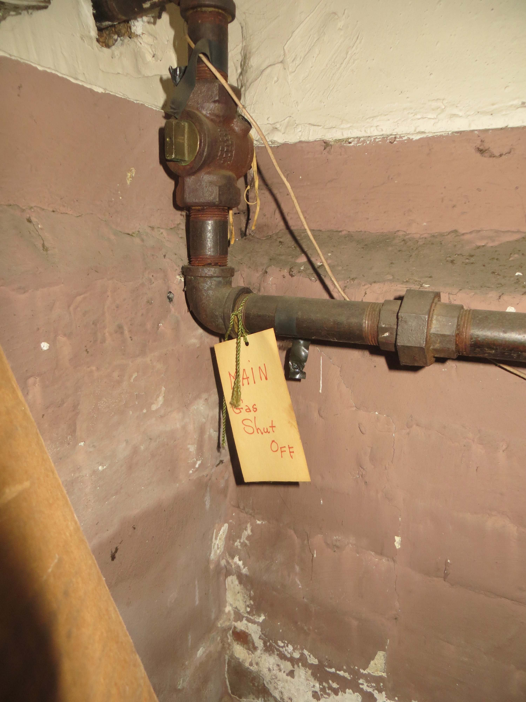
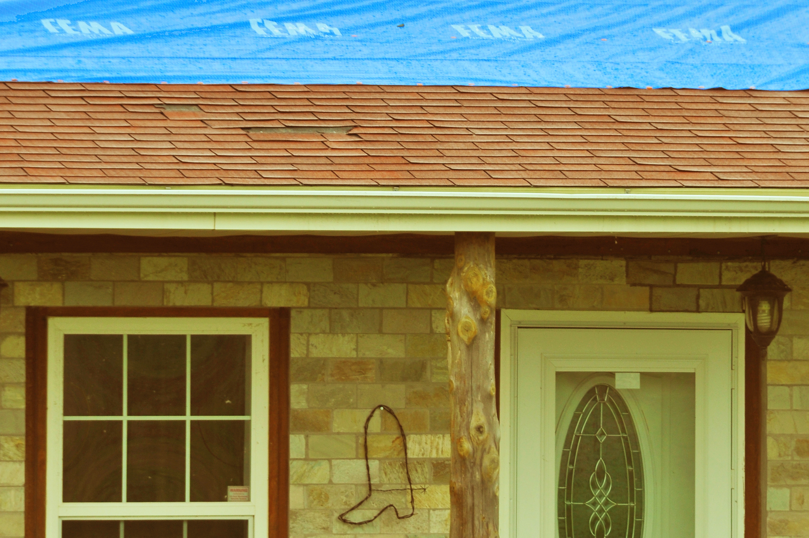

# Structural, Utility & Household Emergencies

## Read this first (the 30-second version)
1. **Know where your three main shutoffs are BEFORE you need them** — water main valve, electrical main breaker, and gas meter valve. Walk to each one right now if you haven't already; five minutes today can save your house tomorrow.
2. **Water gushing, flooding, or a burst pipe → shut off the water main immediately**, then open a low faucet to drain the pipes.
3. **Burning smell, sparking, arcing, or wet electrical parts → shut off the main breaker** if you can reach the panel safely and it is dry. If the panel itself is wet or you're standing in water, do NOT touch it — get out and call the utility.
4. **Smell of gas (rotten eggs) or a hissing sound → get everyone out first, THEN shut off the gas at the meter from outside if you can do so safely** without re-entering. Call the gas utility from outside or a neighbor's — never use a light switch, phone, or anything that could spark near a suspected leak. **Never turn the gas back on yourself.**
5. **Sewage backing up → stop using all water in the house immediately** (no flushing, no sinks, no washer) and keep everyone away from the contaminated area.
6. **A tree, wire, or heavy damage touching the house → assume any downed line is live.** Stay back at least 10 feet minimum, ideally 35 feet or more (electricity can spread through the ground itself), keep everyone else back too, and call 911 and the utility before touching anything.
7. **When in doubt about whether the building itself is safe, get out and stay out** until a professional or official says otherwise. See the safety checklist near the end of this guide.

The rest of this guide walks through each of these in full beginner detail, plus what to do about a damaged roof, broken windows, and a generator, and gives you a practical way to judge whether to stay in the house or leave it.

---

## Why this matters

A house is a system of water, electricity, and gas working together, and when one part fails suddenly — a burst pipe, a downed line, a cracked gas fitting, a tree through the roof — the danger often isn't the initial event, it's what happens in the next few minutes if nobody knows how to isolate it. Water left running floods a house in hours. Electricity left live in standing water electrocutes people. Gas left on after a leak can fill a house invisibly and detonate from a single spark — a pilot light, a doorbell, a phone ringing. Sewage left backing up spreads disease through a home in a single afternoon. In almost every one of these emergencies, **the single most important skill is knowing exactly where the shutoff is and how to operate it**, because that is the difference between a contained problem and a catastrophe. This guide exists so that a person who has never touched a breaker panel or a gas valve can do it correctly, under stress, the first time.

## Key terms (plain language)

- **Main shutoff** — the single valve or switch that stops an entire utility (water, gas, or electricity) from entering the house, as opposed to a valve/breaker for just one fixture or room.
- **Curb stop** — the water shutoff valve located outside, near the property line (often in the yard, near the sidewalk or street), that belongs to the utility; usually a backup to your interior shutoff.
- **Breaker panel (load center)** — the metal box, usually gray, containing all the circuit breakers for the house; the **main breaker** inside it cuts power to the whole panel at once.
- **Circuit** — one branch of wiring serving a specific set of outlets/lights/appliances, each protected by its own breaker (or fuse in older homes).
- **Gas meter** — the device (usually a silver/gray dial-and-pipe assembly mounted outside the house) that measures gas use; the **shutoff valve** is on the pipe at or just before the meter.
- **Backfeed (generator)** — electricity from a generator flowing backward into the house wiring and out onto the utility's lines, which can electrocute line workers who believe the line is dead. Never plug a generator into a wall outlet.
- **Blackwater** — water contaminated with sewage/human waste; always treat it as infectious, never as "just dirty water."
- **Load-bearing wall/member** — a wall, beam, or post that holds up part of the structure above it; damage here is far more serious than damage to a non-structural (partition) wall.
- **GFCI (Ground Fault Circuit Interrupter)** — an outlet or breaker that shuts power off within milliseconds if it detects current leaking somewhere it shouldn't (like through a person); required near water (kitchens, bathrooms, garages, outdoors) and a good early sign something is wrong if it keeps tripping.
- **Transfer switch** — a device installed by a licensed electrician that safely connects a generator to house wiring by physically disconnecting the house from the utility grid first, making backfeeding impossible.
- **Excess Flow Valve (EFV) / seismic shutoff valve** — an automatic valve some gas meters have that shuts gas off by itself if flow suddenly surges (a broken line) or the ground shakes hard (earthquake); if you find gas already off and didn't shut it, this may be why — treat it like any other shutoff and call the utility rather than resetting it yourself.
- **Category 3 water ("blackwater")** — the restoration-industry term for water contaminated with sewage or other gross contamination; the same thing this guide calls blackwater, always treated as a biohazard.
- **Placard (green/yellow/red tag)** — the colored notice a building official or structural engineer posts after a post-disaster safety inspection: green means no apparent hazard, yellow means restricted/limited entry, red means unsafe to enter at all. See Part 3.

---

# PART 1 — THE THREE MAIN SHUTOFFS (find these before an emergency)

## 1A. Water main shutoff

**What it does:** Stops all water from entering the house — the single fastest way to stop a flood, a burst pipe, or a leak from getting worse.

**Where to find it (check all of these — houses vary):**
1. **Inside, where the water line enters the house** — most common. Look in the garage, a utility closet, the mechanical room, or (if you have one) the basement, usually within a few feet of where the pipe comes up through the floor or wall, often near the water heater. In much of Texas and other slab-on-grade regions with no basement, this is typically a valve **inside a utility closet or garage**, or in a small **in-ground valve box in the front yard** near an exterior hose bib.
2. **At the water meter**, which is often in a concrete box in the ground near the street or sidewalk — this has a **curb stop**, which technically belongs to the utility, but you may need to use it if your interior valve is missing, broken, or you can't reach it. You'll need a **curb key** (a long T-handled tool) or a large flathead screwdriver/pliers to turn it; many hardware stores sell inexpensive curb keys — keep one if your interior shutoff is unreliable.
3. **On a private well:** there usually isn't a single "main valve" in the same sense — instead, **shut off the breaker or disconnect switch for the well pump** (labeled "well pump" in the breaker panel, or a separate disconnect box near the pressure tank). This stops the pump from continuing to force water into a broken line. You can still close any valve after the pressure tank as a second layer.


*Figure — A water meter/curb-stop box with its lid removed, showing the valve at the bottom set into the ground near the street. Yours will normally be covered by a round iron or plastic lid flush with the yard/sidewalk — lift the lid (a screwdriver or curb key usually pries it) to reach the valve inside. Source: Wikimedia Commons (File:Uncovered meter box in Avonhead, Christchurch 2022-10-27.jpg), Thomas Booker (CoderThomasB), CC0 1.0 Public Domain.*

**Two valve types you'll encounter:**
- **Gate valve** — a round wheel handle. Turn **clockwise** (righty-tighty) until it stops to close. Takes several full turns.
- **Ball valve** — a straight lever handle. Turn it **90 degrees** so the lever is **crosswise to the pipe** to close (in line with the pipe = open).

**A note on the curb stop specifically:** the valve inside the meter box at the street is usually a **specialized valve that needs a curb key** (a long T-handled steel rod, 3–6 feet, that seats into a square or pentagon nut on top of the valve) — an ordinary wrench often can't reach it because it sits a foot or more below grade in a narrow pipe sleeve. It typically turns like a gate valve: a quarter to a half-turn or more, clockwise to close. This valve legally belongs to the utility, so use it only when you truly can't reach or operate your interior shutoff — but knowing where it is and having a curb key on hand is a reasonable backup for any homeowner, and some utilities are fine with residents using it in a genuine emergency (confirm your local utility's policy if you can, before you need it).

**Steps:**
1. Locate the valve (do this today, before an emergency, and tell everyone in the household where it is).
2. Turn it closed (see above).
3. Confirm it worked: open a faucet somewhere low in the house — flow should stop or slow to a trickle within a few seconds to a minute (some residual water will still drain out of the pipes).
4. If the leak was hot water, also shut off the power/gas to the water heater (Part 1B/1C) so it doesn't run dry and burn out or overheat.

> ⚠️ If the valve is stuck, corroded, or won't fully close, do not force it hard enough to snap the handle — try penetrating oil, gentle steady pressure, or move to the curb stop/street valve instead, and call a plumber.

## 1B. Electrical main breaker

**What it does:** Cuts off electricity to the entire house at once — essential when there's sparking, arcing, a burning smell, exposed wiring, or water near anything electrical.

**Where to find the panel:** garage, basement, utility closet, hallway, or mounted on an exterior wall. It's a metal box (gray or beige), often with a hinged door.


*Figure — A typical US residential breaker panel (load center) with the dead-front cover removed, showing rows of individual circuit breakers. In a real panel you normally only see this much detail with the cover off; day to day you'll just see breaker switch handles through slots in a closed cover, with a directory label listing what each one controls. Source: Wikimedia Commons (File:US wiring basement-panel.jpg), davef3138, CC BY 2.0.*

**Finding the main breaker inside the panel:**
- It is usually a **larger breaker** than all the others — a two-pole (double-width) switch, commonly rated 100, 150, or 200 amps, and it is typically labeled **"MAIN"**.
- It's most often located at the **top center** of the panel (some panels put it at the bottom, or as a separate box entirely near the meter outside — a "meter-main combo").
- All the smaller, single breakers below/around it are individual circuits (labeled on a directory sheet, usually taped inside the panel door).

```
        ┌───────────────────────────────┐
        │   BREAKER PANEL (door open)   │
        ├───────────────────────────────┤
        │   ┌─────────────────────┐     │
        │   │   MAIN   100-200A   │     │  <- flip THIS one for
        │   └─────────────────────┘     │     whole-house shutoff
        ├───────────────────────────────┤
        │  [15A] [15A] [20A] [20A]      │  <- individual circuits
        │  [15A] [20A] [15A] [30A]      │     (labeled: kitchen,
        │  [20A] [15A] [15A] [15A]      │      bedroom, dryer, etc.)
        └───────────────────────────────┘
```

**Steps:**
1. Make sure your hands are **dry** and you are **not standing in water**. If the panel or the floor in front of it is wet, **do not touch it** — leave and call the utility or an electrician to disconnect power from outside (at the meter).
2. Open the panel door.
3. If only one room/circuit is the problem (e.g., one outlet is sparking), you can flip **just that breaker** off — check the directory label, or flip breakers one at a time while a helper checks which room loses power.
4. For a whole-house emergency (fire risk, flooding reaching the panel, storm damage to wiring), flip the **MAIN** breaker to OFF.
5. **Older homes with a fuse box instead of breakers:** there is usually a **main fuse pull-out block** (a gray handle you pull straight out) or a large main fuse/cartridge — pulling the block or removing the main fuse cuts all power. Use a dry hand and don't touch any metal parts inside.
6. **Extra margin of safety, if you own one:** a cheap **non-contact voltage tester** (a pen-shaped tool, a few dollars at any hardware store) beeps/lights up near live wiring without you touching anything metal. Holding it near the panel or a suspect outlet before you touch anything is a good habit, but it is a supplement to the rules above, not a replacement for them — a "no reading" result never means it's safe to touch a wet panel or exposed wiring.
7. **If the panel or breaker was ever underwater** (flood, burst pipe reaching it): do not simply dry it out and flip it back on. Submerged breakers, outlets, and switches corrode internally in ways you can't see and can fail (or start a fire) later even if they look and test fine at first — FEMA's post-flood guidance is that anything electrical that was underwater should be replaced, not reused, and the whole system re-inspected by a licensed electrician before power is restored.

> ⚠️ Never reset a breaker that trips immediately every single time — that means there's an active short or fault. Leave it off and call an electrician instead of repeatedly flipping it.

## 1C. Natural gas shutoff at the meter

**What it does:** Stops gas flow to the entire house — furnace, water heater, stove, dryer, fireplace — used when you smell gas, hear hissing, see damaged gas piping, or after major structural damage (earthquake, vehicle strike, fallen tree on the gas line).

**Where to find it:** The gas meter is typically mounted **outside the house**, on an exterior wall, where the gas line enters — a silver/gray assembly with a round dial and a pipe running through it. The **shutoff valve** is on the pipe, usually on the street/inlet side of (or right at) the meter.

**Some homes also have an indoor gas shutoff valve.** Older homes and homes with an unfinished basement often have a second, interior shutoff valve on the gas pipe where it enters the house — separate from the outdoor meter valve. If your home has one, it's worth finding and labeling it (a handwritten tag works fine) ahead of time, since it can be faster to reach than the outdoor meter in some emergencies. It works the same way as the meter valve: a quarter-turn of the tab/lever shuts it off.


*Figure — An interior gas shutoff valve on a basement pipe, identified with a handwritten "MAIN Gas Shut OFF" tag tied to the pipe. This is a supplementary indoor shutoff, distinct from the outdoor meter valve described above — some older homes have one, some don't. Source: Wikimedia Commons (File:Marked gas shuttoff.JPG), CraigKelley62, CC BY-SA 4.0.*

**The valve itself:** a valve with a **rectangular tab or lever** on it, turned with a wrench — this is sometimes called a **quarter-turn ball valve**.
- **Tab/lever in line with the pipe = OPEN.**
- **Tab/lever turned 90 degrees (a quarter turn), crosswise to the pipe = CLOSED.** It only ever needs that one quarter-turn in either direction to go fully open or fully closed — you cannot "half-close" it usefully, and you don't need to hunt for a specific direction; turn it a quarter-turn and check the tab against the pipe to confirm which state you're in.

**A note on automatic shutoff valves:** many newer meters (and required in some earthquake-prone states) also have a built-in **Excess Flow Valve (EFV)**, which can trip and shut off gas automatically if flow suddenly surges far beyond normal — e.g., a gas line snaps or a fitting fails downstream. Some homes, especially in seismic regions, also have a separate **seismic (earthquake) shutoff valve** that trips from strong shaking alone. If you ever find the gas already off and you didn't shut it yourself, this may be why. Either way, **do not attempt to reset an automatic valve yourself** — treat it exactly like a manual shutoff and call the gas utility to inspect the line and restore service.

**You need:** an adjustable/crescent wrench or a dedicated gas shutoff wrench sized to the tab (often a 1-inch or 12-inch adjustable wrench works). **Keep one at the meter or somewhere obviously nearby** — during a real emergency you may not have time to search for tools, and the valve can be stiff.

**Steps:**
1. If you smell gas (a "rotten egg" odor — this smell is an additive, natural gas itself is odorless) or hear hissing: **get everyone out of the house first.** Don't flip light switches, don't use your phone inside, don't light anything, don't start a car in an attached garage.
2. Once outside and clear, if you can safely reach the meter without going back near the source of the smell, turn the valve 90 degrees so the tab is crosswise to the pipe — that's off.
3. Move well away from the house and call the gas utility's emergency line (it's usually printed on your gas bill — save the number in your phone now) and/or 911.
4. **Do NOT go back inside** until the utility or fire department clears it.

> ⚠️ **Never turn the gas back on yourself, and never try to relight pilot lights after a shutoff.** When gas is shut off, air enters the lines. Turning it back on requires purging that air and safely relighting every single pilot light and appliance while checking for leaks at each one — this must be done by the gas utility or a licensed professional. Doing it yourself risks an explosion or a slow, unlit gas leak building up in a closed room. This is the one utility in this guide you secure yourself but never personally restore.

---

# PART 2 — RESPONDING TO SPECIFIC EMERGENCIES

## 2A. Burst or leaking pipe

**Steps:**
1. **Shut off the water main** (Part 1A) — this is priority one, before you do anything else.
2. If water is pooling near outlets, the breaker panel, or any electrical fixture, and the panel is dry and reachable, **shut off power to that area or the main breaker** (Part 1B). If the panel itself is wet, don't touch it — call for help.
3. **Open the lowest faucet in the house** to drain remaining water out by gravity, and open a higher faucet to let air in so it drains faster.
4. **Contain the water:** buckets, towels, tarps under the leak; move furniture, rugs, and electronics out of the path.
5. **Find the break** — trace the pipe, and look for wet drywall, a bulging ceiling, or a wet stain, which often marks a hidden leak inside a wall or ceiling before it becomes visible at a single point.
6. **Temporary patch options** (all temporary — a plumber must do the real repair):
   - A **pipe repair clamp** (a rubber sleeve with metal bands, sold at hardware stores) wrapped directly over the leak and tightened.
   - **Plumber's epoxy putty**, kneaded by hand and pressed firmly over a small crack or pinhole on a wiped-dry section of pipe; let it cure per the package time before any water pressure returns.
   - A **rubber patch (bicycle-tire patch, rubber glove, or sheet) plus a hose clamp** cinched tightly over the damaged section.
   - Several tight wraps of **self-fusing silicone repair tape** (not ordinary electrical tape, which won't hold water pressure long) as a short-term seal.
7. Call a plumber. **Do not turn the water main back on** until the repair (temporary or permanent) is in place and you're ready to test it slowly, watching for leaks.
8. If the pipe is frozen but hasn't burst yet, do NOT use an open flame to thaw it — see **../water-flooding-plumbing/water-flooding-plumbing.md** for safe thawing methods and freeze prevention.

## 2B. Sewage backup

**Recognizing it:** water or waste backing up into a tub, sink, shower drain, or floor drain — usually starting at the **lowest** fixture in the house — instead of draining normally. This means a blockage somewhere in the sewer line or a septic system problem, and what's coming up is **blackwater**, also called **"Category 3" water** in restoration/insurance terminology — the most contaminated class of water damage there is.

**Why this is more dangerous than it looks:** the CDC identifies well over 100 different disease-causing organisms that can be present in sewage-contaminated water, including bacteria (*E. coli*, *Salmonella*, *Campylobacter*), viruses (norovirus, hepatitis A), and parasites (*Giardia*, *Cryptosporidium*) — the same organisms that cause severe diarrhea, vomiting, and in some cases more serious illness. This is why professional restoration standards treat Category 3 water as a full biohazard, never a routine cleaning job.

**Steps:**
1. **Stop using all water in the house immediately** — no flushing, no running sinks, no washing machine, no dishwasher. Adding more water pushes the backup further and makes the overflow worse.
2. **Get people (especially children) and pets away** from the affected area.
3. **Ventilate** — open windows, run an exhaust fan; don't recirculate the air through central HVAC if you can help it.
4. **Keep electrical off** in the affected area if outlets or the breaker panel are near or below the waterline.
5. **Never touch it without protection:** rubber boots, rubber gloves (nitrile or heavy rubber, not thin disposable gloves), and eye protection at an absolute minimum before any contact or cleanup; add an **N95 mask or better** if you'll be near splashing, spraying, or drying residue, since some contamination becomes airborne as it dries. Avoid touching your face, and don't eat or drink in the affected area. Wash hands thoroughly with soap afterward, and wash or dispose of any clothing that contacted it separately from other laundry. Anything porous that was soaked — carpet, drywall, upholstery, insulation, unsealed wood — usually cannot be fully disinfected and should be considered for disposal, per standard Category 3 water damage practice.
6. **Figure out the scope:**
   - **Only one fixture backing up** → likely a localized clog; a plunger or a plumbing snake at that fixture may clear it.
   - **Multiple fixtures across the house backing up at once** (e.g., the toilet gurgles when you run the washing machine) → a **main sewer line blockage**. Stop testing by flushing more — call a plumber for a main-line snake or hydro-jetting.
   - **On a septic system:** if every drain in the house backs up, suspect a **full or failed septic tank or a clogged drain field**. Stop all water use, call a septic service, and stay off the drain field area (especially if the ground is wet/saturated) — it can be structurally unstable and is contaminated.
7. Clean contaminated surfaces with a disinfecting bleach solution once material is removed, ventilate and dry the area thoroughly, and consider professional water/sewage remediation for anything beyond a small, contained spill.

## 2C. Household flooding — first actions

**Steps:**
1. **Electrical safety comes before saving belongings.** If water is rising toward outlets, appliances, or the breaker panel, and the panel is dry and safely reachable, shut off the main breaker (Part 1B). **If you would have to stand in water to reach the panel, do not do it** — leave that area and call the utility to disconnect power from outside instead.
2. **Move people and pets to higher ground** — a higher floor, or the roof if truly necessary — and stay out of moving exterior floodwater. Never drive through a flooded road: as little as 12 inches of moving water can float a car ("Turn Around, Don't Drown").
3. **Shut off gas** (Part 1C) if floodwater threatens gas appliances or lines, or if officials instruct you to.
4. **Move valuables, medications, and important documents up and out** of the flood zone while it's still safe to do so.
5. **Do not use anything electrical or gas-powered that got wet** — outlets, appliances, the furnace, the water heater — until a professional inspects it, even after it dries. Wet insulation and corroded contacts are a hidden fire and shock risk that can show up later, not just during the flood.
6. **Photograph the damage** for insurance before you move or discard anything, if it's safe to pause and do so.
7. **Re-entering after you evacuated and water has receded — do this in order** (from FEMA's flood-recovery guidance): use a flashlight, never an open flame or lighter, to look around as you approach (a gas leak can be present and invisible). Before going in, look at the foundation and structure from outside for obvious damage or a lean. Once inside, **check for gas odor first** — if you smell it, leave immediately and follow Part 1C. If there's no gas smell and the main breaker/panel is dry and reachable, leave power **off** until a licensed electrician has inspected anything that got wet — do not just dry it out and flip it back on (see Part 1B, step 7). Watch the floor for displaced boards, sagging spots, or animals (snakes and other wildlife often shelter in flooded structures) before walking normally. Open windows and doors to ventilate and begin drying only once you've confirmed no gas hazard.
8. Once it's safe to be inside and drying can begin, see **../water-flooding-plumbing/water-flooding-plumbing.md** for detailed drying, mold-prevention, and well/boil-water guidance.

## 2D. Damaged roof or broken windows — emergency weatherproofing

**Tarping a damaged roof**


*Figure — A FEMA-provided tarp temporarily protecting a tornado-damaged roof (Tecumseh, Oklahoma, 2010) until permanent repair. This is the same basic goal as a homeowner DIY tarp job: fully cover the damaged area, overhang it generously, and anchor every edge so wind can't get underneath and peel it off. Source: Wikimedia Commons (File:FEMA - 44325 - Blue tarp on a tornado damaged home in Oklahoma.jpg), Win Henderson/FEMA Photo Library, US government work — public domain.*

**You need:** a heavy tarp — ideally a **reinforced poly tarp rated 6-mil or heavier** (the kind FEMA's own "Operation Blue Roof" program uses is UV- and fire-rated reinforced polyethylene) sized to overhang the damage by several feet on every side, furring strips (roughly **1×3 boards** work well) or 1×2/2×4 lumber, **roofing nails or 2.5-inch or longer galvanized screws**, a ladder, and ideally a helper. Rope and sandbags as a backup anchor method if you cannot safely get on the roof.

> If you're in a federally declared disaster area after a hurricane or major storm, check whether **FEMA's Operation Blue Roof** (run by the US Army Corps of Engineers) is active in your area — it provides and installs a free temporary tarp roof (rated to last about 30 days) for eligible primary residences with less than 50% structural damage, at no cost to you, while you arrange permanent repairs.

**Steps:**
1. **Only get on the roof if it's genuinely safe:** dry (not raining or icy), reasonable pitch, daylight, someone spotting you from the ground, sturdy shoes, and no line-of-sight to any downed power line nearby. **If you have any doubt, do not climb up** — a fall is far worse than a leaking roof for a day or two; wait for a professional or a calmer moment.
2. Clear loose debris off the area first.
3. Unroll the tarp so it extends **3–4 feet past the damaged area on every side**, and drapes **over the roof ridge/peak** if the damage is anywhere near the top, so water sheds off the tarp rather than running underneath it.
4. **Wrap each edge of the tarp around a furring strip/board**, then screw or nail **through the board and into solid roof decking** (not just through the bare tarp, which will tear loose in wind) — this spreads the load like a "burrito wrap" along each edge.
5. Secure all edges this way, plus the ridge if you can reach it. If you can't safely reach the ridge, weigh the tarp down with sandbags tied together with rope draped over the roof as a backup.
6. Recheck after any additional wind. This is **temporary** — schedule a real roof repair immediately; see **../home-structural-assessment/home-structural-assessment.md** for assessing the underlying damage.
7. When the real repair happens, ask about **roof-to-wall connections** (hurricane straps/clips) if you're in a wind-prone area — FEMA's wind-damage guidance identifies a weak roof-to-wall connection as one of the most common reasons roofs fail catastrophically in high wind, and retrofitting straps during a repair is far cheaper than doing it as a standalone project later.

**Boarding a broken window**

1. Clear broken glass completely first — gloves on, sweep thoroughly, dispose of shards safely (wrapped, labeled).
2. Measure the window opening. Cut plywood (½ inch or thicker, exterior-grade) to overlap the frame by a few inches on every side.
3. **Screw the plywood into the wooden window frame or the wall studs around it — not just into trim or drywall.** Use structural screws roughly every 12 inches around the full perimeter.
4. If the glass is cracked but not broken through, a stopgap before boarding is plastic sheeting taped firmly over both sides of the crack — board it properly as soon as you can.
5. If you live somewhere with recurring storm risk, **pre-cut and label a plywood panel for each window** ahead of time so you're not measuring and cutting during an actual storm.

## 2E. Fallen trees on or near the house

**Steps:**
1. **Check for power lines before anything else.** Is the tree touching a line, or is any line down nearby? **Treat every downed line — and anything touching it, including the tree itself, a fence, or a puddle — as energized**, even if it's silent, sparking or not, and looks dead — you cannot tell a live line from a dead one by looking at it. Stay back **at least 10 feet (3 m) as an absolute minimum**, but treat the ground within roughly **35 feet (10 m)** of the line as a possible energized zone too (electricity can spread outward through the ground itself, especially wet ground) — so the more distance, the better. Keep everyone else and pets back too, and call 911 and the utility immediately. Don't touch the tree, don't try to move it, and don't drive over a line lying on the ground.
   - **If you're already inside a vehicle that a downed line has fallen on:** stay inside. The tires generally insulate you as long as you don't touch the ground and the vehicle at the same time. Honk the horn and wait for help; tell anyone nearby to stay away from the car. Only get out if there's fire or another immediate life threat — if you must, **jump clear with both feet together** (don't let one foot touch the ground while any part of you still touches the car) and then **shuffle away** in small steps with your feet together and touching the ground at all times, all the way clear of the area — this keeps both feet close to the same electrical potential so current doesn't flow through your body via a stride-length voltage difference.
   - **If you find someone in contact with a downed line:** do not touch them or anything touching them — you will likely be electrocuted too. Call 911 immediately and wait for the utility/fire department instead of attempting a rescue.
2. **If the tree fell on the house:** don't enter or use the room directly under the impact until it's checked. From a safe distance, look for daylight showing through the roof, a sagging ceiling, or a wall that looks like it's leaning or bulging — signs of hidden structural damage (see Part 3 below).
3. **Don't cut a tree that's under tension** — leaning against the house, bent, wedged against another tree, or resting on a wire — yourself. A trunk or limb under tension can whip violently or kick back the saw when cut; this is a job for a professional tree service or arborist, especially anything resting on the structure or a line.
4. Small, clearly detached branch debris away from doors and walkways can be moved cautiously by hand; leave anything large, anything touching the roofline, or anything you're unsure about to professionals.
5. Once it's genuinely safe, tarp any roof opening the tree created (Part 2D) to stop water intrusion while repairs are arranged.

## 2F. Recognizing electrical hazards indoors

Watch and smell for:
- A burning or hot-plastic smell with no visible fire source.
- Outlet or switch cover plates that feel **warm or hot**.
- Buzzing, crackling, or humming from an outlet, switch, or the panel itself.
- Visible sparking at an outlet or switch.
- Lights that flicker or dim, especially in sync with a specific appliance turning on — can mean an overloaded circuit or a loose connection.
- A breaker that **trips immediately every single time** you reset it — this means an active short or fault; stop resetting it.
- Discolored, melted, or scorched outlet or switch covers.
- A tingling sensation when you touch an appliance, faucet, or metal fixture — a possible ground fault; stop using it and get it checked.
- Exposed, frayed, or pest-chewed wiring anywhere.
- Any electrical component sitting in or near standing water.

**What to do:** unplug what you can safely reach without touching anything wet or actively sparking, shut off that circuit (or the main breaker, Part 1B) if you can reach the panel safely, and call an electrician. If there's active arcing, sparking, or any fire risk, get everyone out of the house and call 911 first.

## 2G. Isolating a generator safely (high-level — see linked guides for full detail)

- **Never plug a portable generator into a wall outlet or directly into your house wiring.** This can **backfeed** electricity out through lines the utility believes are dead, which can kill line workers restoring power, and can also destroy the generator or your appliances.
- The only safe setups are: **(a)** a **transfer switch** installed by a licensed electrician, which physically disconnects the house from the grid before the generator connects, or **(b)** running devices on cords plugged **directly into the generator's own outlets** — nothing routed through house wiring.
- Run it **outdoors only**, well away from windows, doors, and vents (carbon monoxide is a major killer here). Full generator sizing, placement, and carbon-monoxide safety are covered in **../power-energy/power-energy.md** and **../electrical-gas-utility-safety/electrical-gas-utility-safety.md** — read those before you ever run one.

---

# PART 3 — IS THIS BUILDING SAFE TO STAY IN RIGHT NOW?

This is a **quick field check**, not a full inspection — for a detailed post-disaster structural assessment, see **../home-structural-assessment/home-structural-assessment.md**. Use this to decide, in the first minutes after damage, whether to remain inside or get everyone out.

**Get out immediately, and don't go back in, if you notice any of these:**
- Smell of natural gas anywhere, or a hissing sound near a gas line/appliance.
- A roof, floor, or ceiling that visibly sags, bows, or is getting worse as you watch.
- New cracks in a foundation or wall **wider than a pencil (about ¼ inch)** — especially diagonal cracks, or any crack that goes all the way through a wall.
- The house visibly shifted off its foundation, or an exterior wall or chimney that looks like it's leaning.
- Doors or windows that suddenly jam, won't latch, or show new gaps — can mean the frame itself has shifted or racked.
- Exposed or sparking wiring, or a breaker panel that is wet.
- Standing water inside touching outlets or the breaker panel.
- Popping, cracking, or creaking sounds coming from the structure itself.
- New daylight visible through a roof or wall.
- After an earthquake, tornado, flood, or fire: any structural beam, post, or load-bearing wall that looks cracked, charred, warped, or out of place.

**If you see any of these:** get everyone out, note the specific hazard so you can describe it to responders, and **do not re-enter** until a structural engineer, fire marshal, utility crew, or local official clears it. **When in doubt, get out and stay out** — this is the one rule worth remembering above all the others in this section.

**If none of these signs are present** and the utilities have been safely secured (or confirmed properly restored), it's generally reasonable to remain in the building short-term — but keep monitoring, especially after aftershocks, additional storms, or continued rain, since damage can worsen or reveal itself over the following hours and days.

**What official inspectors will actually do — the placard system:** after a widespread disaster, local building officials or structural engineers often go door-to-door doing a rapid visual safety assessment and post a colored placard on the building so everyone (residents, responders, utility crews) instantly knows its status:
- **GREEN — "Inspected":** no apparent hazard found; safe to occupy (though usually still subject to normal repairs).
- **YELLOW — "Restricted Use":** some hazard exists; entry may be limited to certain areas, for a limited time, or only for brief re-entry to retrieve essentials — follow whatever restriction is written on the placard.
- **RED — "Unsafe":** do not enter for any reason until a follow-up detailed inspection clears it — this is the same "get out and stay out" conclusion this guide reaches from the red-flag list above, just made official and visible to everyone else too.

If you see one of these placards posted on your home (or a neighbor's) after an inspection, treat it as authoritative — don't remove it, and don't re-enter a red- or yellow-tagged building against its restriction even if it "looks fine" to you; the inspector may have found something (foundation movement, a compromised beam) that isn't obvious from a beginner's visual check.

---

## North Texas / regional notes (Anna, TX and Collin County)

- **Slab foundations are standard here** (basements are rare), so your water main shutoff is most often a valve inside a garage or utility closet, or an in-ground valve box in the front yard — not in a basement. Find it and mark it before you need it.
- **Winter Storm Uri (February 2021)** demonstrated the region's biggest utility risk: North Texas homes and pipes are generally **not built for hard, sustained freezes**, and a multi-day statewide grid failure meant burst pipes were common across the region simultaneously, overwhelming plumbers for weeks. Know your water main shutoff **before** a hard-freeze warning is issued, not during one — see **../water-flooding-plumbing/water-flooding-plumbing.md** for pipe-freezing prevention and thawing.
- **Tornado and severe storm season (roughly March–June)** brings the region's most common causes of roof damage, broken windows, and fallen trees. Keep a tarp, plywood cut to your window sizes, screws, and a charged drill on hand before storm season starts, not after the first hailstorm sells out every hardware store in Collin County.
- **Flash flooding** is common on the flat blackland prairie, especially near creeks (e.g., Slayter Creek, Throckmorton Creek) and the East Fork Trinity River floodplain. Homes near these should know all three shutoffs cold and act at the first flood watch, not the warning.
- **Rural properties** commonly run on a **private well and/or septic system** rather than city water/sewer. Know the well pump's breaker/disconnect location (this is your water "shutoff" on a well) and your septic tank's pump-out schedule; a septic backup with no city sewer to fall back on means calling a septic service, not the city.

---

# ⚠️ Safety — the most important warnings

- **Never turn gas back on yourself, and never relight pilots after a shutoff.** This is the one utility you secure yourself but always leave the restoration to the gas utility or a licensed professional.
- **Never touch a breaker panel, outlet, or any electrical component with wet hands or while standing in water.** If the panel itself is wet or damaged, leave it alone and call the utility to disconnect power from outside.
- **Treat every downed power line as live, always**, no matter how it looks or sounds — and treat anything touching it (a fence, a puddle, a fallen tree) as live too. Stay back **at least 10 feet minimum, ideally 35 feet or more**, and call 911/the utility. If you must move away from one (e.g., a line fell on your car), **shuffle away with small steps, feet together and touching the ground at all times** — never stride normally or jump with one foot leading.
- **Never plug a generator into a wall outlet.** Backfeeding can kill utility workers and destroy your house wiring — use a transfer switch or the generator's own outlets only.
- **Sewage is always a biohazard.** Never touch it bare-handed, and stop using water in the house the moment you notice a backup, rather than "testing" it by flushing again.
- **Don't climb on a roof, cut a leaning/tensioned tree, or enter a room under fallen debris if you have any doubt about safety** — call a professional instead. A cautious delay beats an injury every time.
- **When in doubt about the structure itself, get out and stay out** until someone qualified says it's safe.

# Troubleshooting

| Problem | Fix |
|---|---|
| Can't find the water main valve | Check garage, utility closet, near the water heater, or an in-ground box in the front yard; as a backup, use the curb stop at the street with a curb key or pliers. |
| Water valve is stuck/won't close fully | Don't force the handle hard enough to snap it — try penetrating oil and steady pressure, or shut off at the curb stop instead, and call a plumber. |
| Breaker keeps tripping the instant you reset it | Stop resetting it — that means an active short or fault. Leave it off and call an electrician. |
| Panel or floor in front of it is wet | Do not touch it. Leave the area and call the utility to cut power from outside (at the meter). |
| Gas valve tab is too stiff to turn by hand | Use an adjustable/crescent wrench; keep one stored at the meter. If it still won't move, evacuate and call the gas utility to shut it off. |
| Multiple drains backing up at once | Likely a main sewer line clog (or septic failure, if on a septic system) — stop all water use and call a plumber/septic service; don't keep flushing to "test" it. |
| No way to safely reach the roof to tarp it | Don't climb up — weigh a tarp down over the area with sandbags/rope from the ground if possible, or wait for a professional; a temporary leak beats a fall injury. |
| Tree is resting on the house and on a power line | Do not touch either. Stay back 35+ feet, call 911 and the utility, and wait for professionals to clear the line before any tree work begins. |
| A downed line fell on your car | Stay inside the car, honk for help, keep others away. Only exit for fire/life threat — jump clear with both feet together, then shuffle away in small steps, feet together, never touching car and ground at once. |
| Gas is off and you didn't shut it | May be an automatic Excess Flow Valve or seismic shutoff that tripped on its own — don't try to reset it; call the gas utility. |
| Not sure if cracks/damage mean "leave now" | If cracks are wider than a pencil, diagonal, growing, or paired with jamming doors/sagging floors, leave immediately — see the Part 3 checklist. |
| A red or yellow placard is posted on the house | Treat it as authoritative — don't enter a red-tagged building at all, and don't exceed a yellow tag's stated restriction, even if it looks fine to you. |

# Quick-reference checklist
- [ ] Located and physically tested the **water main shutoff** (and know the curb stop as backup).
- [ ] Located the **electrical main breaker** in the panel and know how to reach it safely.
- [ ] Located the **gas meter shutoff valve** and keep a wrench near it.
- [ ] Know NOT to touch a wet/damaged panel, a downed line, or sewage without protection.
- [ ] Have a tarp and cut-to-size plywood ready before storm season for roof/window damage.
- [ ] Know never to backfeed a generator — transfer switch or direct cords only.
- [ ] Know the Part 3 "get out now" red-flag list for judging structural safety.
- [ ] Saved the gas utility's and electric utility's emergency phone numbers in your phone.

# Sources & further reading (in this knowledge base)
- **FEMA "Are You Ready?" Guide** — `reference/manuals/are-you-ready-guide.pdf` (utility shutoff basics, home emergency preparedness).
- **American Red Cross Preparedness Guide** — `reference/manuals/redcross_preparednessguide.pdf` (household emergency response, damage assessment basics; Red Cross utility-shutoff guidance for water/gas/electric was cross-checked directly against redcross.org for this update).
- **CDC Emergency Preparedness Foundations** — `reference/manuals/cdc_emergency_foundations.pdf` (sewage/blackwater and flood contamination hazards).
- **Urban Survival text** — `reference/manuals/Urban_Survival_text.pdf` (structural damage and household emergency scenarios).
- **US Army Survival Manual FM 21-76** — `reference/manuals/fm21-76_survival_manual.pdf` (general emergency field procedures).
- **FEMA P-234, "Repairing Your Flooded Home"** — `reference/manuals/fema_p234_repairing_your_flooded_home.pdf` (re-entry sequence after a flood, submerged-electrical replacement guidance, structural/utility damage assessment).
- **FEMA, "Against the Wind: Protecting Your Home From Hurricane Wind Damage"** — `reference/manuals/fema_against_the_wind_hurricane_wind_damage.pdf` (roof-to-wall connections/hurricane straps and wind-damage prevention, relevant to Part 2D and North Texas storm season).
- Downed-power-line distances and the vehicle-contact procedure were verified against the Electrical Safety Foundation International (ESFI) and major US utility safety pages; the gas-meter quarter-turn/no-self-relight rule and Excess Flow/seismic shutoff valve behavior were verified against utility (PG&E, SoCalGas) and CDC-adjacent consumer safety sources; sewage pathogen and Category 3 water classification were verified against CDC and IICRC-aligned restoration-industry guidance; the placard (green/yellow/red) rapid-assessment system reflects the ATC-20-style post-disaster building safety evaluation process used by US building officials.
- See also: [Electrical & Gas Utility Safety](../electrical-gas-utility-safety/electrical-gas-utility-safety.md) (deep breaker/gas-leak/generator-transfer-switch detail), [Water, Flooding & Plumbing](../water-flooding-plumbing/water-flooding-plumbing.md) (frozen pipes, boil-water notices, drying and mold, wells), [Home Structural Assessment](../home-structural-assessment/home-structural-assessment.md) (full post-disaster structural inspection and tarping detail), [Fire, Smoke & Air Emergencies](../fire-smoke-air-emergencies/fire-smoke-air-emergencies.md), [Power & Energy](../power-energy/power-energy.md) (generator sizing, CO safety, off-grid power), and [Finding Water and Making It Safe to Drink](../water/water.md).

**Image credits (all from Wikimedia Commons, openly licensed):**
- Water meter/curb-stop box — File:Uncovered meter box in Avonhead, Christchurch 2022-10-27.jpg, Thomas Booker (CoderThomasB), CC0 1.0.
- Breaker panel — File:US wiring basement-panel.jpg, davef3138, CC BY 2.0.
- Gas meter/shutoff valve — File:Marked gas shuttoff.JPG, CraigKelley62, CC BY-SA 4.0.
- Roof tarp — File:FEMA - 44325 - Blue tarp on a tornado damaged home in Oklahoma.jpg, Win Henderson/FEMA Photo Library, US government work (public domain).
