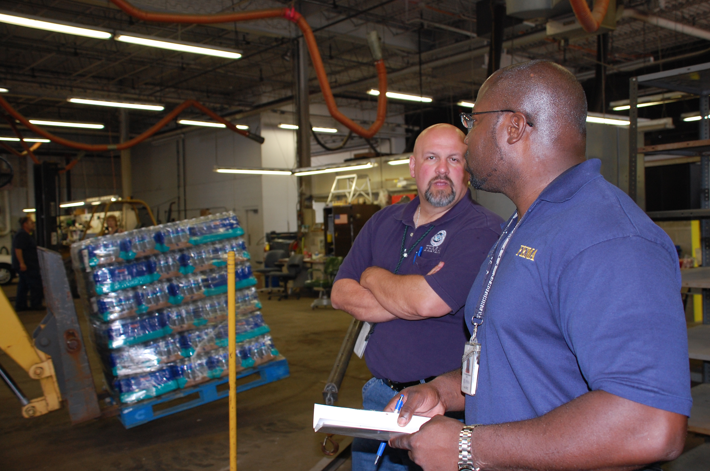
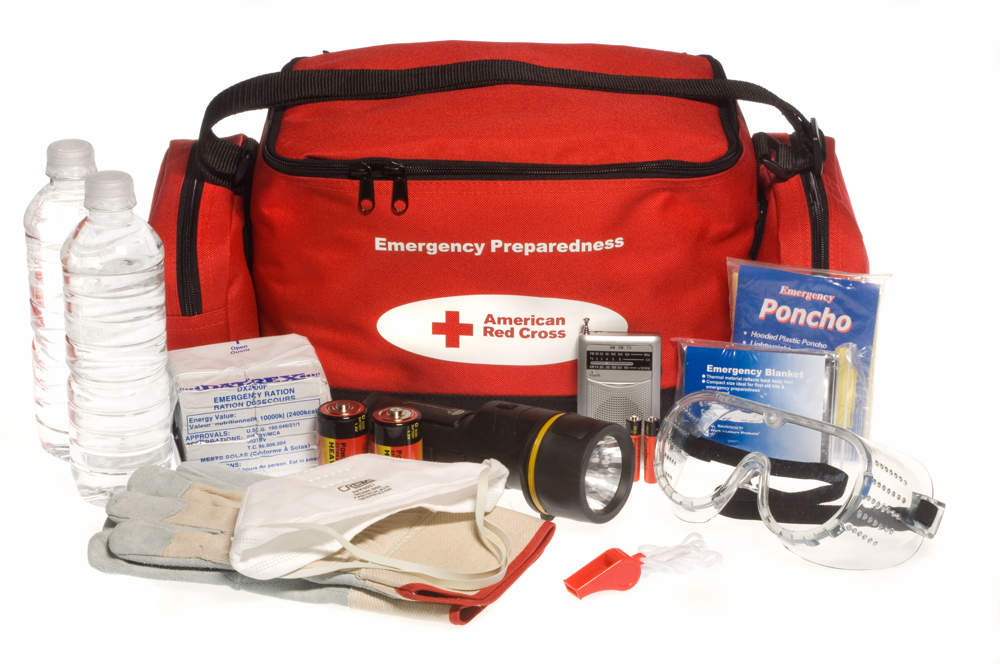

# Emergency Supplies, Inventory & Rotation

## Read this first (the 30-second version)
1. **Build in tiers, not all at once:** start with a **72-hour kit** for everyone in the household, then grow it to a **2-week** supply, then (if you have room and budget) a **30-day** supply.
2. **Water:** store **1 gallon per person per day, minimum** — more in Texas heat and for kids, nursing mothers, and the sick (see the math below). That's **14 gallons/person for 2 weeks**.
3. **Food:** aim for about **2,000 calories/person/day** of shelf-stable food you'll actually eat, plus a manual can opener. Store what you eat; eat what you store.
4. **Medication:** keep a **rolling minimum 2-week buffer** of every prescription (30-day if your insurer allows early refill), plus a basic OTC kit.
5. **Date everything, use FIFO** ("First In, First Out" — oldest goes to the front/top and gets used first), and **check the whole stockpile on a schedule** (daylight-saving time changes are an easy twice-a-year reminder).
6. **Pack it so you can grab it:** labeled bins by category, staged near an exit, with a written inventory card taped to each bin.

This guide covers **what to have, how much, and how to keep it fresh**. For rationing supplies **during** an actual event (daily consumption logs, "days remaining" math) see [Survival Logistics & Resources](../survival-logistics-resources/survival-logistics-resources.md). For the portable go-bag itself, see [Evacuation & Bug-Out Vehicle](../evacuation-bugout-vehicle/evacuation-bugout-vehicle.md).

---

## Why this matters
Disasters rarely announce themselves days in advance. Grocery store shelves empty within hours of a tornado warning, ice storm forecast, or boil-water notice — bread, water, and batteries go first. FEMA and the Red Cross both recommend households be able to shelter in place, without outside help, for **at least 72 hours**, and ideally **two weeks**, because that is realistically how long it can take for utilities to be restored, roads to clear, or aid to arrive after a major event. A stockpile that exists but is expired, disorganized, or impossible to find in the dark is nearly as bad as no stockpile — the goal isn't just *owning* supplies, it's owning supplies you can **find, trust, and use** under stress.

## Key terms (plain language)
- **Shelf-stable food** — food that keeps safely at room temperature without refrigeration (canned, dried, freeze-dried, vacuum-sealed, or properly preserved).
- **FIFO (First In, First Out)** — a rotation rule: the oldest stock is placed where it will be used first (front of shelf, top of stack), and new stock goes behind/under it.
- **Rotation** — periodically using and replacing stored items before they expire, so the stockpile is always close to fresh.
- **"Best by" / "use by" date** — manufacturer's estimate of peak quality, not always a hard safety cliff for shelf-stable dry goods (see the Food section for what's actually dangerous vs. just lower quality).
- **Grab-and-go / bug-out kit** — a pre-packed, portable kit meant to be carried if you must leave immediately (detailed in the Evacuation guide; this guide only covers organizing the *stationary* stockpile it's drawn from).
- **Tiered readiness** — building supplies in stages (72-hour → 2-week → 30-day) so you always have a complete, usable level of coverage rather than a half-finished pile.
- **Caloric density** — how many calories a food provides per unit of weight/volume; matters for how much space and weight your food stockpile takes.
- **Potable** — safe to drink (see the [Water guide](../water/water.md) for making questionable water safe).

---

# PART 1 — TIERED SUPPLY LISTS

Build in this order. Each tier assumes the previous tier is already done — don't buy 30 days of food before you have 72 hours of water.

## Tier 1 — 72 Hours (3 days): the baseline everyone should have

| Category | Item | Amount (per person, 3 days) |
|---|---|---|
| Water | Drinking + hygiene water | 3 gallons |
| Food | Shelf-stable, no-cook-optional meals/snacks | 9 meals + snacks (~6,000 cal total) |
| Light | Flashlight or headlamp + spare batteries | 1 per person |
| Light | Backup: candles + lighter/matches (adult-supervised only) | 1 set per household |
| Medication | Prescription buffer | 3 days' doses, minimum |
| Medication | Basic OTC kit (pain reliever, anti-diarrheal, antihistamine) | 1 small kit per household |
| Hygiene | Hand sanitizer, wet wipes, travel toiletries, trash bags | 1 set per person |
| Radio | Battery or hand-crank NOAA weather radio | 1 per household |
| Cash | Small bills, various denominations | see [Documents & Money](../documents-money-admin/documents-money-admin.md) |
| Documents | Copies of ID, insurance, medical info | see [Documents & Money](../documents-money-admin/documents-money-admin.md) |
| Tools | Manual can opener, multitool, duct tape | 1 set per household |

> This tier should live in (or be quickly transferable to) a portable bag — see [Evacuation & Bug-Out Vehicle](../evacuation-bugout-vehicle/evacuation-bugout-vehicle.md) for the go-bag packing list itself.

## Tier 2 — 2 Weeks: the realistic "shelter in place" target

Multiply Tier 1's per-person daily rates by 14 and add household-level items:

| Category | Per person, 14 days | Household additions |
|---|---|---|
| Water | 14 gallons (see math below) | Water storage containers, purification backup (bleach/tablets/filter — see [Water guide](../water/water.md)) |
| Food | ~28,000 calories (~2,000 cal/day) | 2-week menu (see Part 3), spices/comfort food, pet food |
| Medication | 14 days' prescriptions | Full OTC kit incl. fever reducer, rehydration salts, anti-nausea |
| Batteries | Full spare set for every device | Battery organizer/tester, rechargeable + charger if power allows |
| Fuel | — | Propane/gasoline reserve for cooking, a generator, or a vehicle (see Part 5) |
| Hygiene | Full toiletry kit | Extra toilet paper, feminine hygiene, diapers, laundry soap, bleach |
| Seasonal | — | Season-appropriate gear (Part 6) |
| Light/power | — | Backup lighting for every room used, power bank(s) |

## Tier 3 — 30 Days: deep pantry / extended-disruption readiness

This tier is about **depth and variety**, not new categories — mostly Tier 2 scaled up, plus:

| Category | Additions at 30 days |
|---|---|
| Water | 30 gal/person if space allows; identify and test a backup source (rain catchment, pond, well) per the [Water guide](../water/water.md) — storing 30 gal/person (≈250 lb of water) is often impractical, so a *tested backup source + purification plan* substitutes for pure storage volume. |
| Food | Bulk staples (rice, beans, flour, oats) in food-grade buckets with oxygen absorbers; multivitamins to cover nutritional gaps |
| Medication | 30-day buffer where prescriber/insurer allows; document dosing schedule in writing (see [Documents & Money](../documents-money-admin/documents-money-admin.md)) |
| Fuel | Larger propane reserve (multiple 20 lb cylinders), stabilized gasoline rotation plan |
| Barter/community | Small stock of high-demand trade goods (see community/barter guides) |
| Equipment | Backup cooking method independent of grid (camp stove, rocket stove — see [Fire guide](../fire/fire.md)) |

> ⚠️ **Do not skip tiers.** A partial 30-day food stockpile with no 72-hour water plan is a worse position than a complete 72-hour kit. Depth without a foundation fails first.

---

# PART 2 — WATER: HOW MUCH AND WHY (the math)

**Baseline formula:** `1 gallon per person per day × number of people × number of days`

This gallon splits roughly:
- **½ gallon for drinking**
- **½ gallon for cooking, brushing teeth, and minimal hygiene**

### Worked examples

| Household | Days | Base calculation | Total |
|---|---|---|---|
| 1 adult | 3 days | 1 gal × 1 × 3 | **3 gallons** |
| Family of 4 | 3 days | 1 gal × 4 × 3 | **12 gallons** |
| Family of 4 | 14 days | 1 gal × 4 × 14 | **56 gallons** |
| Family of 4 | 30 days | 1 gal × 4 × 30 | **120 gallons** |

### Quick-reference table — baseline gallons needed by household size and tier
Use this to size your containers before you shop. All figures are the **1 gal/person/day floor**; see the heat adjustment below for the Texas-summer upward revision.

| Household size | 72 hr (3 days) | 2 weeks (14 days) | 30 days |
|---|---|---|---|
| 1 person | 3 gal | 14 gal | 30 gal |
| 2 people | 6 gal | 28 gal | 60 gal |
| 4 people | 12 gal | 56 gal | 120 gal |
| 6 people | 18 gal | 84 gal | 180 gal |

**Why full 30-day storage is heavy, not just bulky:** water weighs about **8.3 lb/gallon**, so a family of 4's 120-gallon, 30-day baseline is roughly **1,000 lb** of water alone — a real floor-loading and space concern, which is why Tier 3 (Part 1) treats a *tested backup source + purification plan* as a legitimate substitute for pure storage volume once you're past 2 weeks.

### Adjust upward — the baseline is a floor, not a ceiling
- **Texas summer heat / hard physical activity:** add **50–100% more** — plan **1.5–2 gallons/person/day**. A family of 4 for 2 weeks at 1.5 gal/day = **84 gallons**, at 2 gal/day = **112 gallons**.
- **Children:** similar per-body-weight needs to adults but lose water fast when active/playing; do not under-ration a thirsty child.
- **Nursing mothers:** add roughly **an extra quart (about 1 liter) per day** for milk production.
- **Anyone sick, injured, feverish, or vomiting/with diarrhea:** water losses can double; add extra and prioritize oral rehydration.
- **Pets:** roughly **½–1 gallon per day per medium/large dog**, less for cats/small pets — budget separately, don't dip into human water.

**Heat-adjusted totals (family of 4, the North Texas summer case):**

| Rate | 3 days | 14 days | 30 days |
|---|---|---|---|
| 1 gal/person/day (floor) | 12 gal | 56 gal | 120 gal |
| 1.5 gal/person/day (heat/exertion) | 18 gal | 84 gal | 180 gal |
| 2 gal/person/day (heavy exertion, feverish/sick member) | 24 gal | 112 gal | 240 gal |

### Where to put it
- Store in **clean, food-grade, tightly-sealed containers**, labeled "DRINKING WATER" with the fill date.
- **Rotate stored tap water every 6 months**; commercially sealed bottled water can be kept per its printed date, generally 1–2+ years.
- Full details on containers, sanitizing them, finding emergency water, and making questionable water safe are in the [Water guide](../water/water.md) — **don't duplicate that depth here; this guide only covers how much to store and how to rotate it.**

*Figure — commercially-sealed bottled water is the easiest way to bank toward the 2-week/30-day tiers: no container prep, no 6-month rotation clock (just check the printed date), and easy to count in whole cases. Source: Wikimedia Commons (File:FEMA - 44998 - Pallets of Bottled Water in Iowa.jpg), FEMA/Leo "Jace" Anderson, public domain (US federal government work).*

---

# PART 3 — FOOD: HOW MUCH AND WHAT

**Baseline formula:** `~2,000 calories per person per day` (adjust: active adults, teens, and pregnant/nursing women may need 2,200–2,800; sedentary/smaller adults and young children may need 1,400–1,800). When in doubt, store a bit more — shelf-stable surplus is rarely wasted.

### Worked calorie math — total calories to store by household size and tier

| Household size | 72 hr (3 days) | 2 weeks (14 days) | 30 days |
|---|---|---|---|
| 1 person | 6,000 cal | 28,000 cal | 60,000 cal |
| 2 people | 12,000 cal | 56,000 cal | 120,000 cal |
| 4 people | 24,000 cal | 112,000 cal | 240,000 cal |
| 6 people | 36,000 cal | 168,000 cal | 360,000 cal |

*(Household total = 2,000 cal × number of people × number of days. Recalculate up for active/pregnant/nursing members and down slightly for young children using the ranges above.)*

**Turning calories into a shopping list — typical calories per common unit** (check the actual label; brands vary):

| Item | Typical serving | ~Calories |
|---|---|---|
| Canned chili (15 oz can) | 1 can | 400–480 cal |
| Canned tuna/chicken (packed in oil) | 5 oz can | 250–300 cal |
| Canned tuna (packed in water) | 5 oz can | 120–180 cal |
| Peanut butter | 2 tbsp | ~190 cal |
| White rice, dry | 1 cup dry (≈4 servings cooked) | ~675 cal |
| Pasta, dry | 2 oz dry (1 serving) | ~200 cal |
| Rolled oats, dry | 1 cup dry | ~300 cal |
| Granola/protein bar | 1 bar | 100–250 cal |
| Powdered milk | ⅓ cup dry (≈1 cup reconstituted) | ~80–100 cal |
| Freeze-dried camping meal pouch | 1 serving (varies 1–2.5 servings/pouch) | 250–600 cal |

Add these up against the household-total table above to check you're actually hitting the target — it's easy to under-buy calorie-dense staples like rice/oats and over-buy low-calorie canned vegetables.

### Choosing shelf-stable foods
Pick foods that are **(1) calorie-dense, (2) require little or no cooking/water, (3) your household will actually eat, and (4) have a long shelf life.**

| Category | Examples | Typical shelf life (unopened, cool/dry storage) |
|---|---|---|
| Canned proteins (low-acid: meat, poultry, fish, beans, chili, soup) | Tuna, chicken, beans, chili, SPAM | 2–5 years |
| Canned vegetables/fruit (high-acid: fruit, tomato products, juices) | Corn, green beans, peaches, tomato sauce (keep the liquid — it's drinkable) | 12–18 months (USDA); often fine longer if the can is undamaged and stored cool/dry |
| Grains/starches | Rice, pasta, instant potatoes, oatmeal | 1–2 years (rice much longer if sealed) |
| Peanut butter / nut butters | — | 1–2 years |
| Crackers, granola/protein bars | — | 6–12 months |
| Powdered milk, dried fruit | — | 1–2 years |
| Freeze-dried / dehydrated staples in Mylar + O2 absorber (rice, beans, wheat) | Bulk bucket-stored staples | 20–30 years per USDA/university extension data if kept sealed, cool, and dry |
| Freeze-dried meals | Commercial camping-style pouches | 10–25 years (check packaging — varies by brand/packaging quality) |
| Comfort/morale food | Coffee, tea, hard candy, chocolate | Varies — rotate often |
| Baby formula/food (if needed) | — | Check label — rotates fastest of all |

> **On "best by" dates:** USDA guidance is that these are quality (not safety) markers for most shelf-stable dry and canned goods — a can with no bulging/rust/leaks and normal smell is usually still safe well past its date if stored cool and dry. High temperatures (over 100°F, a real risk in an uninsulated Texas garage or attic) accelerate spoilage risk sharply — store food in conditioned space, not a hot garage.

**Must-haves alongside the food itself:**
- A **manual can opener** (write it on the checklist — this is the #1 forgotten item).
- A way to heat food without grid power if desired (camp stove, rocket stove — see [Fire guide](../fire/fire.md)), though pick some items that are edible cold/straight from the can as a no-fuel fallback.
- Basic seasonings — morale matters over 2 weeks of plain rice and beans.

### Example 2-week menu (per adult, ~2,000 cal/day, no refrigeration needed)

| Day | Breakfast | Lunch | Dinner | Snack |
|---|---|---|---|---|
| Odd days (1,3,5,7,9,11,13) | Instant oatmeal + powdered milk + dried fruit | Canned tuna + crackers | Canned chili + canned corn | Peanut butter + granola bar |
| Even days (2,4,6,8,10,12,14) | Cereal + powdered/shelf-stable milk | Canned chicken + instant rice | Pasta + canned tomato/meat sauce | Trail mix + dried fruit |

Rotate in canned fruit, extra crackers, and hard candy/coffee throughout as morale boosters. Scale quantities by household size and adjust for kids' smaller portions.

> Full food-safety, cooking-without-power, and preservation techniques (canning, dehydrating, root cellaring) are covered in [Food Preservation & Cooking](../food-preservation-cooking/food-preservation-cooking.md) — this guide only covers **how much to stockpile and how to rotate it**.

---

# PART 4 — MEDICATIONS AND MEDICAL SUPPLIES

> ⚠️ This section covers **stockpile quantities and organization only.** It is not medical advice, and this guide does **not** provide dosing information — always follow your prescriber's or the product label's instructions.

### Prescription medications
- **Minimum target: a rolling 14-day buffer** beyond your next refill date for every regularly-taken prescription. Where your insurer/pharmacy allows a **30-day** early-refill window (common after regional disaster declarations, and sometimes year-round), use it to build toward the 30-day tier.
- Keep a **written list**: medication name, dose, prescribing doctor, pharmacy, and refill date — stored with your documents (see [Documents & Money](../documents-money-admin/documents-money-admin.md)), not just in your head.
- Store in original labeled containers; keep away from heat/humidity (not in a hot car or garage in Texas summer).
- **Rotate the buffer itself**: when you get a new refill, use the oldest bottle first (FIFO) so the buffer never goes stale.
- If on insulin or other refrigerated medication, plan power backup or a cooler + ice packs and know how long it stays viable unrefrigerated (check the package insert/pharmacist).

### Basic OTC (over-the-counter) kit — build once, restock as used
- Pain/fever reducer (e.g., acetaminophen or ibuprofen per household preference)
- Antihistamine (allergic reactions, insect stings)
- Anti-diarrheal and anti-nausea medication
- Oral rehydration salts or sports drink powder
- Antacid
- Basic first-aid supplies (bandages, gauze, antiseptic, tape, gloves) — full first-aid kit contents and wound care are in a dedicated first-aid guide; this section only covers the OTC/medicine-cabinet portion of the stockpile.
- Thermometer
- Any household-specific needs: EpiPen replacements before expiration, glucose tablets, inhalers

### Rotation rule for medical supplies
- Check **expiration dates twice a year** (tie it to a clock-change or birthday you'll remember).
- Move anything expiring in the next 6 months to the "use soon" front of the cabinet; replace immediately upon use or expiry.

---

# PART 5 — BATTERIES AND FUEL STORAGE

## Batteries
- **Standardize sizes** where possible (e.g., AA across flashlights, radio, and lanterns) to simplify stockpiling.
- Store a **full spare set for every device**, plus 50% extra loose stock.
- Keep batteries **out of the devices** during long storage (corrosion risk) and in a cool, dry place — heat drains and damages them fast, a real risk in a Texas garage in summer.
- **Alkaline batteries:** typically 5–10 year shelf life unopened; check "best by" date and rotate oldest stock into daily-use devices (TV remotes, clocks) so nothing sits past its prime, replacing with fresh stock.
- **Rechargeables (NiMH) + solar or hand-crank charger:** a good supplement if you expect an extended outage — no shelf-life expiry concern, but confirm the charging method still works without grid power.
- Use a simple **battery tester** during each rotation check to catch weak cells before an emergency, not during one.

## Fuel storage — propane and gasoline

> ⚠️ **Fuel storage is one of the most dangerous parts of a stockpile if done wrong.** Fire, explosion, and carbon monoxide poisoning are real risks. Follow the safety rules below exactly.

### Propane
- **Storage:** Store cylinders **outdoors or in a detached, well-ventilated structure** (shed, not attached garage or inside the house) — propane is heavier than air and pools in low spots if it leaks. Keep upright, away from direct sun and any ignition source.
- **Shelf life:** Propane itself **does not expire** or degrade in a sealed cylinder — it can be stored indefinitely. What ages is the **cylinder** itself, per DOT rule 49 CFR 180.209: a standard portable DOT cylinder must be **requalified within 10–12 years of its manufacture date** (the exact initial window has shifted between rulemakings — check the stamped date on the collar and ask your propane exchange/refill dealer which applies to your tank), and then **every 5 years thereafter** if requalified by visual inspection (the common method for consumer-size cylinders). **The simplest practical rule for a household: exchange or have any cylinder professionally recertified once it's within a year or two of its stamped date — don't wait for a refill station to reject it.**
- **Amounts:** A standard 20 lb cylinder (the common gas-grill size) runs a typical camp stove for roughly 10–20 hours of cooking, or a small propane heater for several hours per lb depending on BTU rating — keep at least one full spare cylinder per device you depend on, more for the 30-day tier.
- ⚠️ **Never** use outdoor propane appliances (grills, camp stoves not rated for indoor use) inside a house, garage, tent, or RV — carbon monoxide builds up silently and kills. Always have working CO detectors near any fuel-burning appliance used indoors.

### Gasoline
- **Storage:** Only in **approved, tightly-sealed gasoline containers** (red, labeled, "type II/III" safety cans), stored in a detached shed or garage, away from the house, out of direct sun, and away from any ignition source (water heater pilot light, etc.).
- **Shelf life:** Modern **ethanol-blended (E10) pump gas** — what most stations sell — starts losing potency and can begin phase-separating (the ethanol/water fraction splits from the gasoline) in as little as **30–90 days**; non-ethanol/pure gasoline holds up longer, roughly **3–6 months** untreated. **Add a fuel stabilizer at the time of purchase** (follow the product's mixing ratio) to extend usable life to roughly **1–2 years** — treat this as a planning ceiling, not a guarantee, and still rotate it; don't assume a stabilized can is good indefinitely.
- **Rotation:** Treat gasoline as a **use-and-replace** fuel, not a set-and-forget one — burn through older stock in vehicles/mowers/generators every few months and refill with stabilized fuel, rather than letting cans sit for years.
- **Amounts — worked generator example:** check your generator's fuel-consumption chart for gallons-per-hour at your expected load (a mid-size portable generator running a fridge, some lights, and a fan is commonly **~0.5–1 gal/hour at half load**). At 1 gal/hour × 8 hours/day × 3 days = **24 gallons** — more than most households can safely store (see the limit below), which is why generator planning should pair a modest fuel reserve with a **realistic, reduced runtime** (critical loads only, cycled on/off) rather than assuming continuous power. Most households store **5–15 gallons** as a practical, safely-manageable maximum — check local fire code limits for residential storage, which can be more restrictive.
- ⚠️ **Never** store gasoline near any open flame, water heater, or furnace pilot light. Never siphon by mouth. Never run a generator inside a garage, basement, or near windows/doors — carbon monoxide from generator exhaust kills quickly and without warning; run generators **outdoors, at least 20 feet from any window, door, or vent**, pointed away from the house.
- **Vehicle fuel:** Keep vehicle gas tanks **at least half full** as a standing rule during hurricane/tornado/ice-storm season — this doubles as an easily-rotated reserve and ensures you can evacuate without needing a working gas station.

---

# PART 6 — HYGIENE SUPPLIES

Stockpile enough for the tier you're building toward (72hr / 2wk / 30 days), per person:

- Toilet paper (a practical planning figure: ~1 roll per person per 5–7 days of heavy/emergency use)
- Soap (bar and/or hand sanitizer, 60%+ alcohol)
- Wet wipes (multi-use: hygiene, cleaning, diapering)
- Toothbrush, toothpaste, floss
- Feminine hygiene products
- Diapers/wipes sized correctly if applicable — babies outgrow sizes, so **rotate stock every few months** regardless of expiry
- Trash bags (doubles as waste disposal, ponchos, and tarp material)
- Laundry soap (hand-washing quantity, not machine-size)
- Household bleach (unscented, for both disinfecting water and sanitizing — see the [Water guide](../water/water.md)) and general disinfecting supplies

Full sanitation methods (latrines, greywater, handwashing stations when plumbing fails) are in [Sanitation & Hygiene](../sanitation-hygiene/sanitation-hygiene.md) — this section only covers what to **stockpile**.

---

# PART 7 — SEASONAL EQUIPMENT: NORTH TEXAS SPECIFICS

North Texas (Anna, TX / Collin County / blackland prairie) swings between brutal summer heat and occasional severe winter ice storms, so your stockpile should shift seasonally, not stay static.

### Summer heat readiness (roughly May–September)
- **Extra water** — bump storage toward the 1.5–2 gal/person/day upper range (see Part 2 math); heat and any physical exertion (yard cleanup, storm debris) sharply increase loss.
- Battery or hand-crank **fans**; cooling towels/bandanas; extra electrolyte/rehydration packets.
- Sunscreen, wide-brim hats — heatstroke and dehydration are the dominant local summer risks, more likely than the storm itself.
- Check that any generator/propane gear is rated and ventilated properly for running AC or fans — see fuel safety rules above.

### Winter ice storm readiness (roughly December–February)
- North Texas ice storms can down power for **days**, and the region is poorly equipped (compared to northern states) to clear roads — plan to shelter in place.
- **Extra blankets, sleeping bags rated well below expected lows, hand warmers.**
- Insulating supplies for pipes (know how to shut off and drain your water system — see [Water-Flooding-Plumbing](../water-flooding-plumbing/water-flooding-plumbing.md) if covered there) to prevent burst pipes.
- Alternative heat source **rated for safe indoor use** with a working CO detector — never a grill or generator indoors (see fuel section above).
- Rock salt/sand for walkways; keep vehicle gas tank topped off (doubles as fuel reserve and prevents fuel line freeze).

### Tornado season (roughly March–June, secondary peak in fall)
- No special stockpile category, but keep your grab-and-go bins (Part 8) staged and know your safe room — see [Evacuation & Bug-Out Vehicle](../evacuation-bugout-vehicle/evacuation-bugout-vehicle.md) and [Disaster-Specific](../disaster-specific/disaster-specific.md) guides.

**Swap seasonal bins twice a year** (a natural pairing with the battery/medication expiration check in Part 4 and Part 8) — pull summer gear out in spring, winter gear out in fall.

---

# PART 8 — THE ROTATION SYSTEM (FIFO, dating, and schedule)

A stockpile that isn't rotated becomes a liability — expired medication, dead batteries, and stale food discovered mid-emergency. Use this simple system:

### 1. Date everything when it goes in
- Write the **purchase or repackage date** directly on the item (permanent marker) or on masking tape if you don't want to mark the original packaging.
- For bulk-repackaged staples (rice, beans in buckets), label with contents **and** date on the outside.

### 2. Arrange for FIFO (First In, First Out)
- **Shelves:** new stock goes to the **back/bottom**; oldest moves to the **front/top** where you'll grab it first for daily use.
- **Bins:** if bins aren't shelved, put a **written date range on the outside** of each bin so you don't have to dig to know what's oldest.

### 3. Keep a simple written inventory
A basic table taped inside your pantry door or stored with your documents works — it doesn't need software:

| Item | Quantity | Date stored | Expires/rotate by | Location |
|---|---|---|---|---|
| Canned chili | 12 cans | 2026-01 | 2028-01 | Pantry shelf 2 |
| AA batteries | 24 | 2026-01 | 2033 (check pack) | Utility bin B |
| Ibuprofen | 2 bottles | 2026-01 | 2028-06 | Medicine bin |
| Propane cylinder | 2 × 20 lb | 2026-01 | Recert. 2036 (cylinder date) | Shed |

### 4. Put rotation on a recurring schedule
Tie checks to something you'll actually remember:
- **Every time clocks change (spring/fall)** — check smoke detector batteries, rotate flashlight/radio batteries, review medication buffer, swap seasonal gear (Part 6).
- **Every 6 months** — replace stored tap water, review OTC kit and first-aid supplies, check gasoline stabilizer status.
- **Once a year** — full inventory count against your written list, check all "best by" dates in the food stockpile, confirm propane cylinder recertification date isn't approaching, review household size/needs changes (new baby, new pet, new medication).

**Sample annual rotation calendar** — pin a version of this to the inside of your pantry/bin door so the schedule survives even if you forget the "why":

| When | Task |
|---|---|
| **January** | Full annual inventory count against the written list; check all food "best by" dates; confirm propane cylinder recertification date isn't within the next 1–2 years. |
| **March** (spring clock change) | Rotate flashlight/radio/smoke-detector batteries into daily-use devices; swap winter seasonal bin out, summer bin in (Part 7); review medication buffer. |
| **June** (~6-month mark) | Replace stored tap water; check gasoline stabilizer status and rotate fuel through vehicles/mower/generator; review OTC/first-aid kit. |
| **September** | Mid-cycle spot check: hygiene/diaper sizing if applicable, hurricane-season fuel/water top-off before peak season. |
| **November** (fall clock change) | Rotate batteries again; swap summer bin out, winter bin in; replace stored tap water (second 6-month mark); review medication buffer again. |

Adjust the months to fit your own memory hooks (birthdays, tax day, back-to-school) — the exact dates matter less than having **fixed, recurring dates you will not skip.**

### 5. Use-then-replace, not just check-then-discard
Where practical, **cook a stockpiled meal or use stockpiled batteries in daily life** on your rotation date rather than throwing expired stock straight in the trash — this keeps cost down and confirms the item still actually works. Immediately restock what you used.

### 6. What actually needs to be thrown out vs. what's just "lower quality"
- **Throw out immediately:** bulging, leaking, or rusted cans; anything with mold or off odor; medication past its hard expiration if potency/safety matters (ask a pharmacist if unsure); gasoline that smells "varnish-like" or sour.
- **Usually fine past "best by" (use judgment, inspect first):** unopened dry goods (rice, pasta, sugar) properly sealed and kept dry; canned goods with no can damage, often well past printed date if stored cool and dry.
- **When genuinely unsure about food safety** — full detail in [Food Preservation & Cooking](../food-preservation-cooking/food-preservation-cooking.md); when in doubt, throw it out.

---

# PART 9 — GRAB-AND-GO ORGANIZATION

Even a large, well-rotated stockpile is useless if you can't find or carry the parts you need in the dark, in a hurry, in the rain.

*Figure — a packed 72-hour "ready to go" bag with its contents displayed: this is the level of pre-sorted, grab-in-one-motion organization to aim for with each household member's Tier 1 bin/bag. Source: Wikimedia Commons (File:FEMA - 37174 - Emergency Preparedness "ready to go" kit..jpg), FEMA/American Red Cross, public domain (US federal government work).*

### Bin system
- Use **clear or labeled opaque bins**, one category per bin (Water/Purification, Food, Medical/OTC, Batteries/Light, Hygiene, Tools, Documents-copy). Clear bins let you see contents at a glance; if using opaque, label boldly on **two sides**, not just the top (bins get stacked).
- Tape a **printed inventory card** to the outside of each bin listing contents and the date last checked — matches the written inventory table in Part 8.
- Keep bins **off the floor** in flood-prone areas (shelving, or elevated in a garage) — relevant across most of North Texas given flash-flood risk.

### Staging for fast departure
- Keep Tier 1 (72-hour) bins and go-bags **staged near a primary exit** — mudroom, front closet, garage nearest the door — not buried in an attic or back of a storage unit.
- Keep car keys, phone chargers, and the document folder (see [Documents & Money](../documents-money-admin/documents-money-admin.md)) with or next to the staged bins so a 2-minute departure is possible.
- Assign each household member (old enough) a specific bin or bag to grab — decide this **before** an emergency, not during one.

### Labeling conventions
- Front-facing label: **category + household member (if personal) + last-checked date**.
- Color-code by household member or by tier (e.g., red tape = 72-hr grab bag, blue tape = 2-week stationary stock) if it helps your household move faster under stress.

> For the actual **contents and packing** of the portable 72-hour go-bag itself (what goes in each person's bag, weight considerations, vehicle kit), see [Evacuation & Bug-Out Vehicle](../evacuation-bugout-vehicle/evacuation-bugout-vehicle.md) — this guide's bin system is about organizing the **stationary** stockpile it's drawn from.

---

# ⚠️ Safety — the most important warnings
- **Never store gasoline or propane inside the living space** — attached garages are a compromise at best; detached sheds or outdoor cages are safer. Both fuels can explode or asphyxiate.
- **Never run a generator, camp stove, or grill indoors, in a garage, or near open windows/doors** — carbon monoxide is invisible, odorless, and kills quickly. Install and maintain CO detectors near any fuel-burning appliance.
- **Never let stored gasoline sit indefinitely untreated** — old gas gums up engines and can degrade to the point of being unusable or unsafe; stabilize and rotate it.
- **Never assume a "best by" date on medication is optional for anything safety-critical** (e.g., EpiPens, insulin) — replace on schedule; when in doubt, ask a pharmacist.
- **Never let your water stockpile substitute for a purification plan** — storage runs out; know how to find and treat more water (see [Water guide](../water/water.md)).
- **Never stack heavy bins where they can fall**, and never block an exit path with stockpile bins.
- **Keep raw/expired items separate and clearly marked** from active stock so no one accidentally uses something that should have been discarded.

# Troubleshooting

| Problem | Fix |
|---|---|
| Don't know what's already in the stockpile | Do a full inventory now using the table in Part 8; tape a card to every bin going forward. |
| Food/medication expired without being noticed | Set the recurring twice-a-year check (clock-change reminder) from Part 8, section 4. |
| Gasoline smells sour/varnish-like | Do not use in an engine you rely on for evacuation — dispose per local hazardous-waste rules and replace with fresh, stabilized fuel. |
| Batteries corroded in a device | Discard the corroded batteries and device battery contacts should be cleaned (baking-soda/water on contacts, dry fully); store spares outside devices next time. |
| Can't afford a full 30-day stockpile at once | Build strictly in tiers — 72 hours first, fully — then add ~1 extra week's worth of food/water each month until you reach 2 weeks, then 30 days. |
| Bins too heavy to carry quickly | Split into smaller bins by weight, not just category; assign lighter bins to kids/elderly members. |
| Unsure if canned food is still good | Check for bulging, rust, leaks, or off smell first — if the can is intact and it smells normal, unopened canned goods are often safe well past the date; when genuinely unsure, discard. |
| Propane cylinder past its recertification stamp | Do not refill it — exchange or have it professionally recertified before use. |

# Quick-reference checklist
- [ ] 72-hour tier complete: water (1 gal/person/day × 3), food (~2,000 cal/person/day), light, meds, radio, cash, documents.
- [ ] 2-week tier complete: water (14 gal/person, more in heat), 2-week food menu, full OTC kit, battery spares, fuel reserve, hygiene kit.
- [ ] 30-day tier (optional, as space/budget allow): bulk staples, deeper fuel reserve, tested backup water source.
- [ ] Every item dated on entry; FIFO shelving/bin order maintained.
- [ ] Written inventory list exists and is stored with household documents.
- [ ] Recurring check scheduled (clock-change twice a year at minimum).
- [ ] Propane stored outdoors/detached, cylinder recertification date tracked.
- [ ] Gasoline stabilized, stored in approved containers away from the house, rotated regularly.
- [ ] Seasonal bins (summer heat / winter ice) swapped twice a year.
- [ ] Grab-and-go bins labeled, staged near an exit, with an inventory card on each.
- [ ] Household members each know which bin/bag is theirs to grab.

# Sources & further reading (in this knowledge base)
- **FEMA "Are You Ready?" guide** — `reference/manuals/are-you-ready-guide.pdf` (household preparedness stockpiling and supply lists).
- **American Red Cross Preparedness Guide** — `reference/manuals/redcross_preparednessguide.pdf` (water storage, disaster supply kits).
- **CDC Emergency Preparedness Foundations** — `reference/manuals/cdc_emergency_foundations.pdf` (water storage and shelf-life guidance).
- **US Army Survival Manual FM 21-76** — `reference/manuals/fm21-76_survival_manual.pdf` (food and water procurement fundamentals underlying storage quantities).
- **FEMA "Food and Water in an Emergency" (FEMA 477)** — `reference/manuals/fema_food_and_water_in_an_emergency.pdf` (developed with the American Red Cross and USDA; water-gallon and 2-week food-supply planning figures).
- **Ready.gov Emergency Supply List checklist** — `reference/manuals/ready_gov_emergency_supply_checklist.pdf` (printable tiered supply checklist).
- Facts in this guide were also checked against current **Ready.gov "Build A Kit"/"Water"/"Food"** pages, **USDA/FSIS shelf-stable food safety guidance**, and **DOT 49 CFR 180.209** (propane cylinder requalification).
- See also: [Survival Logistics & Resources](../survival-logistics-resources/survival-logistics-resources.md) (rationing and consumption tracking *during* an event), [Evacuation & Bug-Out Vehicle](../evacuation-bugout-vehicle/evacuation-bugout-vehicle.md) (portable go-bag contents), [Food Preservation & Cooking](../food-preservation-cooking/food-preservation-cooking.md) (preservation methods and food safety), [Documents & Money](../documents-money-admin/documents-money-admin.md) (cash/document kit), [Water](../water/water.md) (finding and purifying water), and [Sanitation & Hygiene](../sanitation-hygiene/sanitation-hygiene.md).
