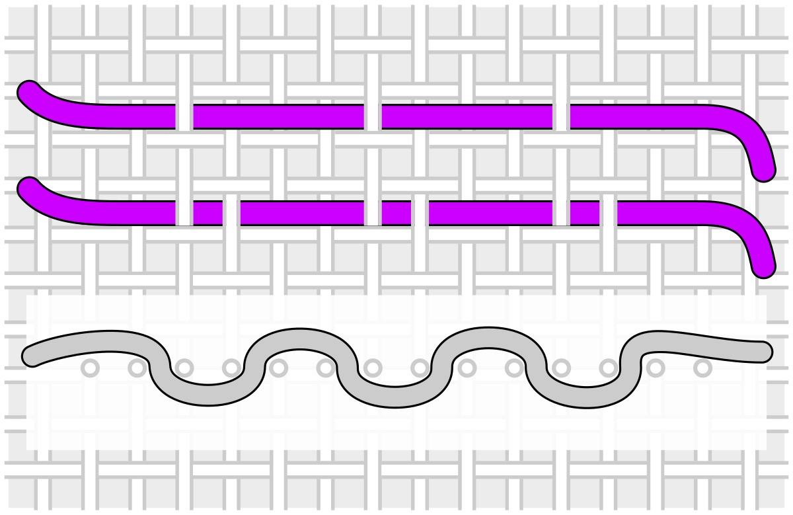
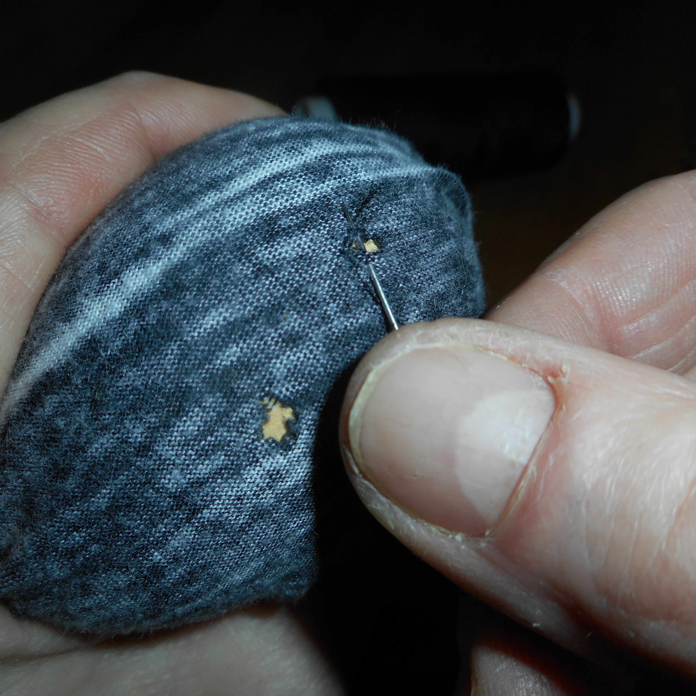
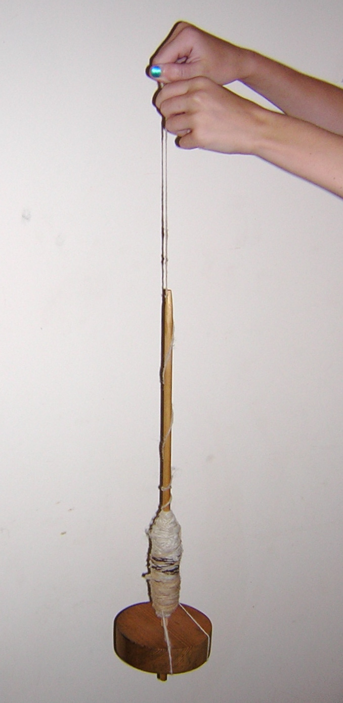

# Textiles & Making/Mending Clothing From Scratch

## Read this first (the 30-second version)
1. **Learn five hand stitches and you can fix almost any garment:** running stitch, backstitch, whip (overcast) stitch, blanket stitch, and hem (slip) stitch. All you need is a needle, thread, and a few minutes.
2. **Mend small damage before it becomes big damage.** A loose button, a small snag, or a starting seam-split takes two minutes to fix now and an hour (or a ruined garment) to fix later. Check seams, cuffs, and pockets regularly — "preventive mending."
3. **A hole in a knit (like a sock) needs darning, not a patch** — you weave new thread across the gap to rebuild the fabric, because a patch alone won't hold on stretchy knit material.
4. **You can build simple, wearable garments (a poncho, a basic tunic, pants, a bag) from rectangles of cloth with no pattern** — just body measurements, straight seams, and the stitches above.
5. **Fiber matters as much as construction.** Wool insulates wet, cotton does not; know what you're working with (see [Clothing, Footwear & Protection](../clothing-footwear-protection/clothing-footwear-protection.md) for how that plays out in real weather).
6. **Spinning, knitting/crochet, felting, dyeing, and hide-tanning are real, valuable skills — but they take practice and time.** This guide gets you a working start on each; expect your first attempts to be rough, and keep practicing.

The rest of this guide covers the hand-sewing kit and core stitches, mending and repair in depth, fiber and fabric properties, making simple garments and bags from rectangles, thread and cordage from plant fiber and sinew, hand-spinning yarn, basic knitting/crochet, wool felting, natural dyeing, a pointer-level overview of rawhide and brain-tanning, and repurposing old clothing.

---

## Why this matters
Clothing takes damage constantly from friction, sun, washing, and use, and in a long emergency there is no store to replace it at. A single skill — sewing on a button, closing a seam, darning a sock heel — is the difference between gear that lasts years and gear that fails in a season. Beyond repair, textile skills let you make what you don't have: a poncho from a blanket, a bag from a shirt, insulating layers stuffed with wool or leaves, cordage and thread from plants and hide. None of this requires a sewing machine, a pattern, or expensive tools — just a needle, thread, patience, and the techniques below. Clothing is the layer of shelter you wear every hour of every day (see [Clothing, Footwear & Protection](../clothing-footwear-protection/clothing-footwear-protection.md)); keeping it intact directly affects whether you stay warm, dry, and protected.

## Key terms (plain language)
- **Warp / weft** — in woven fabric, the warp threads run the length of the fabric (usually stronger, less stretchy); the weft threads run across, woven over-and-under the warp.
- **Woven fabric** — made by interlacing two sets of threads at right angles (like denim, cotton broadcloth, canvas). Doesn't stretch much; frayed edges unravel.
- **Knit fabric** — made from one continuous thread looped through itself in rows (like T-shirts, socks, sweaters). Stretches; a cut or hole tends to "run" or ladder outward.
- **Selvage** — the finished, non-fraying factory edge along the length of woven fabric.
- **Grain** — the direction of the threads in fabric; cutting "on grain" (parallel to warp or weft) keeps pieces stable, cutting "on the bias" (diagonally) gives stretch and drape.
- **Seam allowance** — the extra fabric width left between a seam line and the cut edge, so the seam doesn't pull apart.
- **Right side / wrong side** — the "right side" is the face of the fabric meant to show; the "wrong side" is the back. Seams are normally sewn with right sides together, then turned right-side-out.
- **Darning** — rebuilding a hole in fabric (especially knits) by weaving new thread across the gap, rather than covering it with a patch.
- **Roving / batt** — carded (combed straight) raw fiber, ready to spin or felt, before it's twisted into yarn.
- **Ply** — a single strand of spun fiber; "2-ply yarn" is two spun strands twisted together for strength.
- **Mordant** — a chemical (commonly alum) that helps natural dye bond permanently to fiber instead of washing out.
- **Rawhide** — animal hide that has been fleshed, dehaired, and dried under tension, but not chemically tanned — stiff, durable, useful for laces, sheaths, and drum heads.
- **Brain-tanned leather** — hide that has been chemically softened (traditionally with a brain-and-water emulsion) and worked to stay soft and supple after drying, then usually smoked for water resistance.

---

# PART 1 — THE HAND-SEWING KIT & CORE STITCHES

## You need
A minimal kit fits in a small tin or pouch:
- **Needles**, several sizes: a fine needle for lightweight fabric, a medium "sharp" for general sewing, and a heavy needle (upholstery or "sailmaker's" needle) for canvas, leather, and multiple layers of denim.
- **Thread:** all-purpose polyester thread for most sewing; heavier upholstery/buttonhole thread or waxed linen thread for load-bearing seams (pack straps, boot repairs).
- **Scissors or snips** and a **seam ripper** (or a small sharp knife point) for undoing bad stitches.
- **Pins** and/or **safety pins**, a **thimble** (protects your pushing finger on heavy fabric), a **tape measure**, tailor's chalk or a sliver of soap for marking fabric, and **spare buttons**.
- **Beeswax or a candle stub** — pulling thread across wax coats it, so it resists tangling and abrasion (a genuinely important trick, not optional for heavy repairs).

**Improvised substitutes:** a fish hook or sharpened, heated wire/bone/thorn with an eye filed or melted through it can substitute for a needle in a pinch (see [Tools, Knots & Repair](../tools-knots-repair/tools-knots-repair.md) for improvising an awl to pre-punch holes in heavy material a needle can't pierce). Dental floss, fine fishing line, or plied plant-fiber/sinew cordage (Part 5) all work as thread. A nail or ice-pick tip works as a seam ripper. A sliver of bar soap marks fabric like chalk and brushes off.

## Threading and starting a stitch
1. Cut thread about arm's length (18–24 in / 45–60 cm) — longer tangles more than it saves you.
2. Wet or flatten the tip, or trim it at an angle, and push it through the needle's eye. For hand-sewing, **double the thread** (both ends together) for most repairs — it's twice as strong and won't need re-threading as often.
3. Tie the two loose ends together in a knot, or make a small knot by wrapping the thread once or twice around your fingertip and rolling it off into a knot.
4. Push the needle from the **wrong side** of the fabric so the knot sits hidden underneath, and pull through until the knot catches.

## Five core stitches


*Figure — Running stitch: the needle passes in and out of the fabric in a straight, even line, front to back to front, without pulling the thread all the way through between stitches. Source: Wikimedia Commons (File:Hand Stitches - Running Stitch.png), Stilfehler, CC BY-SA 4.0.*

### 1. Running stitch — general-purpose, fastest, weakest
**Use for:** basting, gathering fabric, quick low-stress seams and hems.
1. Push the needle up through the fabric, down a short distance away (⅛–¼ in / 3–6 mm), then up again the same distance further along — a simple over-under line, like a dashed line.
2. Keep stitch length even; pull snug but not tight enough to pucker the fabric.
3. End with 2–3 tiny stitches on top of each other so it can't unravel.

### 2. Backstitch — the strongest hand stitch; use for seams that bear weight
**Use for:** closing seams and repairing anything that gets pulled or stressed (pack straps, waistbands, crotch seams) — it resists pulling apart far better than running stitch.
1. Bring the needle up through the fabric.
2. Insert it back down **behind** where the thread came up, then bring it up again **one full stitch-length ahead**.
3. Insert it back down where the previous stitch ended (so each stitch overlaps the last), then come up another stitch-length ahead.
4. Repeat — each stitch "backs up" onto the last, leaving a solid, continuous line like a sewing machine's straight stitch.

### 3. Whip stitch (overcast stitch) — closes edges, joins two edges together
**Use for:** stopping a fraying raw edge from unraveling, joining two folded edges (closing a tear), sewing on a patch's edge.
1. Push the needle through both layers of fabric from the back, near the edge.
2. Wrap the thread over the edge and push the needle through again from the back, a short distance along, so thread wraps diagonally around the raw edge.
3. Repeat evenly along the whole edge; finish with a few stitches stacked on top of each other.

### 4. Blanket stitch — a stronger, decorative edge finish
**Use for:** finishing a raw or cut edge (fleece blanket, poncho neck hole, felt piece) so it won't fray, with more strength than a plain whip stitch.
1. Push the needle up through the fabric a short distance in from the edge.
2. Loop the working thread under the needle's point before pulling it through, so a bar of thread sits along the edge with a perpendicular stitch anchoring it.
3. Move along and repeat — the result is a row of "L"-shaped stitches forming a solid bar along the edge.

### 5. Hem stitch (slip stitch) — invisible hems and closing openings
**Use for:** hemming pants/sleeves, closing the opening left after turning a sewn bag right-side out, so stitches barely show.
1. Fold the raw edge under once or twice and finger-crease it flat.
2. Working from inside the fold, take a **tiny** bite of just one or two threads of the outer fabric, push the needle back into the fold, and travel forward inside it before coming out again.
3. Repeat — stitches stay mostly hidden inside the fold, showing on the outside only as small dots.

> ⚠️ **A dull or bent needle takes more force and slips** — the same logic as a dull knife (see [Tools, Knots & Repair](../tools-knots-repair/tools-knots-repair.md)). Keep several spare needles; a broken needle tip can be lost in fabric or bedding.

---

# PART 2 — MENDING & REPAIR

**Preventive mending beats emergency mending.** Check seams, button attachments, cuffs, and pocket corners periodically and reinforce a thin spot or loose thread *before* it becomes a hole or a blowout — the University of Kentucky Extension guide on clothing repair (cited below) calls this "preventive mending," and it's the single highest-leverage habit in this whole section.

## Patching a hole or worn spot (woven fabric)
**You need:** a scrap of matching or similar-weight fabric (an old pillowcase, a jeans leg cut from a damaged pair), scissors, needle and thread (or fabric glue/iron-on patch material if available).
1. Trim ragged edges of the hole square or round — clean edges patch better.
2. Cut a patch **at least ½–1 in (1–2.5 cm) larger than the hole on all sides**.
3. **From behind (inside):** place the patch behind the hole, right side facing out through the hole, and pin or baste in place.
4. Whip-stitch or backstitch around the hole's edge, catching both garment and patch, then stitch a second line near the patch's outer edge at stress points (knees, elbows).
5. **From the front (visible patch):** turn the patch's raw edges under ¼ in (6 mm) and stitch it down with a running or blanket stitch around all sides.
6. **Iron-on patches/fusible webbing**: follow package heat/time instructions; still add a line of stitching around the edge for a repair that takes real wear.

## Darning a hole in socks or knit fabric
A patch alone often fails on stretchy knit fabric (socks, sweaters) because the patch doesn't stretch with the surrounding fabric. Darning **rebuilds the fabric itself** by weaving thread across the gap.


*Figure — Mending a hole using a darning mushroom (a smooth, rounded form inserted inside the sock to hold the fabric taut and curved while you weave new thread across the gap), needle, and thread. Source: Wikimedia Commons (File:Mending hole with darning mushroom.JPG), Wuerzele, CC BY-SA 4.0.*

**You need:** darning thread or yarn close to the sock's weight (or all-purpose thread doubled/tripled for thin socks), a darning needle (blunt-tipped, large eye), and ideally a rounded form to stretch the fabric over — a **darning egg or mushroom**, or a light bulb (careful, fragile), a smooth stone, a jar lid, or a tennis ball.
1. Insert the darning form under the hole so the fabric is stretched smooth and slightly curved over it.
2. Trim any very frayed loose threads at the hole's edge, but leave good fabric alone — darning bridges the gap, it doesn't need a clean cut edge like a woven patch.
3. **Lay the "warp" threads:** starting well outside the hole in solid fabric, stitch straight lines back and forth **across** the hole, spacing each pass close to the last, extending past the hole's edge into good fabric for anchoring. Don't pull tight, or the darn will pucker.
4. **Weave the "weft":** once the gap is bridged, weave a needle **over-under-over-under** across those threads at a right angle, packing each pass snugly against the last, anchoring into good fabric past each edge.
5. Continue until the hole is solid and a bit thicker than the surrounding fabric (normal and desirable — it reinforces the spot).
6. Finish with a couple of stitches into solid fabric and trim. Turn right-side out and check it lies flat against your foot.

**Simple last-resort fixes for socks:** rotate a small worn spot to the top of the foot (away from pressure) by shifting how you put the sock on, or simply double up a thin sock inside a thicker one until you can darn it properly.

## Replacing a button
**You need:** a matching or close-enough button (keep a button jar from every retired garment), needle, doubled or waxed thread, and a toothpick or matchstick.
1. Mark the exact spot using the buttonhole as a guide, matched to the other side's placement.
2. Push the needle up through the fabric, up through one button hole, down through the opposite hole (or next hole for 4-hole buttons), and back through the fabric. Repeat 4–6 times per pair of holes.
3. **Shank trick for thick fabric (coats):** lay a toothpick across the top of the button between the holes before stitching, sew over it, then remove it before tying off — this leaves slack thread (a "thread shank") so the button sits proud of thick fabric and closes without strangling the buttonhole.
4. Finish by wrapping thread a few times around the threads under the button to build the shank, push the needle to the wrong side, and knot off.
5. **Shank buttons** (built-in loop instead of holes): stitch through the loop the same number of times; no toothpick needed.

## Fixing a split or torn seam
1. Turn the garment inside out. Trim stray threads and check whether the fabric itself tore, not just the seam thread — if so, patch underneath first (see above) before re-sewing.
2. **Backstitch** along the original seam line, starting about ½ in (1 cm) into the still-intact seam on each end so new stitching overlaps and anchors into strong material.
3. On high-stress seams (pack straps, underarms, crotch), stitch it twice — once on the seam line, once slightly further out — for redundancy.

## Zippers
- **Slider gapping/won't stay closed:** the slider has often spread slightly. Gently squeeze the back of the slider narrower with pliers, then test — fixes most "won't stay zipped" complaints without replacing anything.
- **Pull broken off:** loop cordage, a paperclip, a key ring, or bent wire through the remaining hole in the slider as a replacement pull.
- **Teeth missing/broken over a section:** the zipper often still works below the break — sew a few stitches or add a snap/button above the damaged section and don't unzip past it.
- **Replacing a zipper entirely:** unpick the old stitching with a seam ripper, pin the new zipper (seam tape folded under ¼–½ in / 6–12 mm) so teeth just meet the folded edges, baste with running stitch, test it closes smoothly, then backstitch permanently on both sides. Fiddly on a first attempt — practice on scrap first.

## Reinforcing before it fails (preventive mending)
- **Elbows, knees, seat, pack-strap contact points:** sew a patch of tough fabric (canvas, denim, leather scrap) over a thinning-but-not-yet-holed spot; it's much faster than repairing a full blowout later.
- **Fraying buttonholes/pocket corners:** a few extra whip or blanket stitches around the stress point now prevents a full tear later.
- **Boot/shoe uppers separating from soles:** see [Tools, Knots & Repair](../tools-knots-repair/tools-knots-repair.md) for footwear-specific field repair (waxed-thread stitching, duct tape, adhesives).

---

# PART 3 — FIBERS & FABRIC: KNOWING YOUR MATERIALS

Different fibers behave very differently under stress, water, heat, and wear — knowing what you're working with changes how you mend it, dye it, and wear it.

| Fiber | Warmth when wet | Dries | Strength | Notes |
|---|---|---|---|---|
| **Wool** | Keeps most insulating value wet | Slowly | Good; weakens more wet | Naturally water-resistant (lanolin), takes dye well, felts when agitated wet+hot (Part 8) |
| **Cotton** | Loses almost all insulating value wet ("cotton kills" — see [Clothing, Footwear & Protection](../clothing-footwear-protection/clothing-footwear-protection.md)) | Slowly | Strong, especially wet | Breathable, best for hot/dry conditions; mildews if stored damp |
| **Linen (flax)** | Loses insulating value wet like cotton | Fast — dries faster than cotton | Very strong, especially wet | Cool, breathable, resists mildew better than cotton; wrinkles easily |
| **Silk** | Loses some insulating value wet | Moderate | Strong for its weight | Good wicking, poor abrasion resistance, expensive to replace — treat gently |
| **Polyester / nylon / acrylic (synthetics)** | Keeps most insulating value wet | Fast | Very strong, resists abrasion | Doesn't breathe as well as natural fiber; **melts** near flame/sparks — keep back from fire |

**Woven vs. knit, at a glance:**
- **Woven** (jeans, canvas, dress shirts): stable, doesn't stretch much, frays at cut edges — patch it.
- **Knit** (T-shirts, socks, sweaters): stretches, a hole tends to run/ladder — darn it (Part 2) rather than just patching.

**Simple fabric ID — the burn test** (useful for an unlabeled scrap or old garment, since it changes how you mend, dye, or insulate with it):
1. Cut a small snippet, hold it with pliers or tweezers over a heat-safe surface away from anything flammable, and touch a flame to the edge briefly.
2. **Natural fibers (cotton, linen):** burn readily, smell like burning paper, leave soft grey ash.
3. **Wool/silk (protein fibers):** harder to ignite, self-extinguish, smell like burning hair, leave a crumbly dark bead.
4. **Synthetics (polyester/nylon):** melt, shrink, and may drip, smell chemical/plastic-like, leave a hard melted bead.
> ⚠️ Do this outdoors or over a sink, never near other fabric, dry brush, or fuel — never on a garment you're wearing.

---

# PART 4 — MAKING SIMPLE GARMENTS AND ITEMS FROM RECTANGLES

You don't need a paper pattern to make wearable items — cloth cut into rectangles, sewn with the stitches from Part 1, produces genuinely usable garments. This is how many traditional garments across cultures and centuries were actually constructed.

## Basic measurements to take first
Use a tape measure or a length of string marked with knots:
- **Shoulder-to-shoulder** (across the back, seam to seam).
- **Chest/bust** circumference, and **hip** circumference.
- **Arm length** (shoulder point to wrist) and **desired garment length** (shoulder to hem).
- **Waist** circumference and **inseam** (crotch to ankle) for pants.
- Always **add 1–2 in (2.5–5 cm)** to any circumference measurement for ease (room to move) and seam allowance.

## Poncho from a blanket or large rectangle
The fastest wearable item possible — no sewing required, though a few stitches improve it.
1. Take a wool blanket, large rectangular fabric piece, or a tarp (see the emergency poncho note in [Clothing, Footwear & Protection](../clothing-footwear-protection/clothing-footwear-protection.md) for a plastic-sheet version).
2. Fold it in half. Find the center of the fold.
3. Cut or fold-and-mark a head-hole at the center — start smaller than you think (a slit, then a small oval) and enlarge gradually; you can always cut more, but you can't uncut fabric.
4. Try it on over your head before finishing edges.
5. **Optional:** whip-stitch or blanket-stitch around the head-hole to stop fraying; sew a few inches of the side seams closed near the bottom for a more fitted shape, leaving armholes.

## Simple T-tunic (rectangles-and-a-hole shirt)
A genuinely functional shirt using only straight cuts and straight seams — the basic garment shape used historically across many cultures precisely because it's simple and efficient with fabric.

```
Fabric folded once at the shoulder line:
   ______________________________
  |   (fold=shoulder; small      |
  |    head-hole cut here)       |
  |_______________________________|
  |  sleeve   |      body         |   body length (x2 for
  | rectangle |    rectangle      |   front+back, folded)
  |___________|___________________|
```

1. Fold fabric in half (the fold becomes the shoulder line — no shoulder seam needed).
2. Mark and cut a small head-hole centered on the fold (start small; enlarge gradually — same rule as the poncho).
3. Cut two rectangles for sleeves sized to arm length and desired width (add ease).
4. With the body folded (right sides together), **backstitch** the side seams from underarm to hip.
5. Sew each sleeve into a tube (backstitch), then set it into the armhole opening and stitch around.
6. **Hem** the bottom, sleeve ends, and neckline with hem stitch or blanket stitch to stop fraying. Try it on before final hemming to adjust length.

## Simple drawstring pants from rectangles
1. Measure hip circumference (+ease) and leg length (waist to ankle).
2. Cut two identical leg panels: each roughly (half hip circumference + ease) wide, by leg length plus a few inches for the waist casing.
3. Right sides together, backstitch each panel's inner-leg seam most of the way, following your inseam loosely (or keep it straight for a boxier, simpler fit).
4. Join the two legs at the crotch/center seam.
5. Fold the top edge over 1–1.5 in (2.5–4 cm) and stitch down, leaving a small gap, to form a **casing**; thread a cord or strip of fabric through it as a drawstring.
6. Hem the ankles.

## Simple bag or tote from a rectangle
1. Cut one rectangle roughly twice the finished bag's height, plus width.
2. Fold in half (right sides together) and backstitch up both open sides, leaving the top open.
3. Turn right-side out, hem the top opening.
4. Cut two long strips (or use cordage/an old belt) for straps; sew each strap's ends securely to the inside top edge, backstitching several times since straps take real load.

**Sewing machine note:** all of the above works identically (faster) on a machine using straight stitch for seams and zigzag for raw edges — the construction logic doesn't change, only the tool.

---

# PART 5 — CORDAGE AND THREAD FROM PLANT FIBERS AND SINEW

Full technique for turning plant fiber (inner bark, dogbane, nettle, yucca) into strong two-ply **cordage** via the reverse-wrap method — and for cordage, knots, and lashings generally — is covered in depth in **[Tools, Knots & Repair](../tools-knots-repair/tools-knots-repair.md)**; this section focuses on what's specific to **sewing thread**.

- **Fine cordage as thread:** the same reverse-wrap plant-fiber cordage, spun down to a fine, tight two-ply strand, works as heavy-duty sewing thread for repairs needing real strength (boot soles, pack straps, tarps) — wax it with beeswax first to reduce fraying.
- **Sinew** (from leg tendons or backstrap of larger game — see [Hunting, Fishing & Trapping](../food-hunting-fishing-trapping/food-hunting-fishing-trapping.md) for field-dressing): dry it fully after scraping off clinging tissue. To use, pull off a strand of the needed width, wet it in your mouth or with water to soften and split it, and thread it directly through a needle. Its natural collagen swells and grips stitch holes tight as it dries — strong for leather and heavy fabric, but use it soon after wetting since it stiffens again as it dries.

---

# PART 6 — SPINNING FIBER INTO YARN (DROP SPINDLE BASICS)

Spinning turns loose fiber (wool roving, cleaned cotton, plant fiber) into usable yarn or thread by twisting it under tension. A **drop spindle** is the simplest tool — cheap, portable, and easy to improvise.


*Figure — Spinning fiber into yarn using a wooden drop spindle: the spindle hangs and spins from the already-spun yarn while the spinner drafts (thins and feeds) fiber from a hand-held mass above. Source: Wikimedia Commons (File:Wooden drop spindle.JPG), public domain.*

**You need:** carded fiber (roving) — raw wool is easiest to start with (see [Livestock & Animal Husbandry](../livestock-animal-husbandry/livestock-animal-husbandry.md) for keeping sheep/goats and general fiber-animal care) — and a spindle.

**Improvised spindle:** a straight stick or dowel 8–12 in (20–30 cm) long, with a **whorl** (weight) near one end to keep it spinning steadily — a small wooden disc, a potato, or a chunk of clay works while learning; a hook or notch cut in the top, or a taped-on bent paperclip, holds the yarn while you spin.

**Steps:**
1. **Make a leader:** tie a short length of existing yarn or strong thread to the spindle shaft, up to the hook/notch at top, so new fiber has something to grip and twist around.
2. **Draft the fiber:** hold a loose wad of roving in one hand; with the other, gently pull a small amount away, thinning it so individual fibers overlap loosely — this "drafting" sets your yarn's thickness (thinner draft = finer yarn).
3. **Spin the spindle:** roll the shaft down your thigh (or flick it) to set it spinning, letting it hang and drop, twisting the drafted fiber where it meets the leader.
4. Let the twist run up into the fiber, drafting a little more as it travels, then pause the spindle while you draft the next section.
5. **Wind on:** once you've spun an arm's-reach length, unhook it, wind the new yarn around the shaft, leave enough for a new leader, and continue.
6. **Plying (optional, for stronger yarn):** wind two full spindles of single-ply yarn into balls, then spin both together in the **opposite direction** from how they were spun — this locks the strands into a balanced, stronger 2-ply yarn that won't kink.

Your first yarn will be lumpy and uneven — normal, and still usable for felting, weaving, or heavy sewing thread. Consistency comes with practice.

---

# PART 7 — KNITTING & CROCHET BASICS FOR WARM ITEMS

Both turn yarn (spun yourself or store-bought) into flexible, warm fabric, without a loom. Full mastery is its own long-term skill; this gets you a functional start.

## Knitting (two needles)
**You need:** knitting needles (or two smooth, matching-diameter sticks/dowels) and yarn.
1. **Cast on:** make a slip-knot loop on one needle, then repeatedly make a new loop from the working yarn and place it on the needle until you have the stitch count you want (a scarf is typically 20–40 stitches wide, depending on yarn thickness).
2. **Knit stitch:** insert the right needle into the front of the first loop on the left needle, wrap the working yarn around the right needle's tip, pull that loop through the original, and slide the original off the left needle. Repeat across the row.
3. Turn and repeat row after row — this produces "garter stitch," a simple, flat, non-curling fabric good for a first project (scarf, hat panel later sewn into a tube).
4. **Bind off:** knit two stitches, lift the first over the second and off the needle; knit one more, lift the previous over again; repeat to the end, then pull the final loop tight.

## Crochet (one hook)
**You need:** a crochet hook (or a whittled stick with a small notch near the tip) and yarn.
1. **Chain stitch** (foundation row): make a slip-knot loop on the hook, then repeatedly wrap yarn over and pull it through the loop already on the hook, to the length you want.
2. **Single crochet:** insert the hook into the second chain from the hook, wrap yarn over and pull through (two loops on the hook), wrap over again and pull through both loops. Repeat across, then chain one and turn to start the next row.
3. Repeating single crochet row after row builds a solid, warm, dense fabric suited to hats, small blankets, and pouches.

Both crafts suit **hats, scarves, mittens, and simple blankets** — flat or tube shapes — which is the real survival value: extra insulating layers made from spun or reclaimed yarn (Part 11 covers pulling yarn from old sweaters).

---

# PART 8 — FELTING WOOL

Felting turns loose wool fiber directly into a solid fabric or shape **without spinning or weaving** — wool's scaly fiber surface locks together permanently under heat, moisture, and agitation. Useful for insulating insoles, hats, bags, and repair patches that never fray.

**You need:** raw or carded wool (must be real wool or another animal fiber — plant fibers and synthetics won't felt this way), hot soapy water, and a flat work surface (bubble wrap, a bamboo mat, or a towel).

**Wet felting steps:**
1. Lay thin, overlapping layers of wool fiber on your work surface, criss-crossing each layer's direction (like plywood grain) for strength — usually 2–4 layers for a flat piece.
2. Sprinkle hot, soapy water over the fiber until thoroughly damp (not dripping).
3. Gently press and rub the layers through thin cloth or bubble wrap, working from the center outward, for several minutes — this tangles the fibers together.
4. Once the fibers hold together (test by lifting a corner), increase pressure and rub/roll firmly for 10–15+ minutes — the piece shrinks and thickens as it felts.
5. Rinse the soap out in plain water, squeeze (don't wring) out excess, shape while damp, and air dry fully.

**Needle felting (no water, more control, slower):** repeatedly poke a special barbed felting needle straight down through layers of wool fiber (onto a foam or dense-brush block underneath to protect your surface and fingers) — the barbs tangle fibers together without any water. Better for small, sculpted, or precise shapes (patches, decorations) than for large flat fabric.

> ⚠️ Felting needles are sharp, barbed, and break easily — they cause a specific stabbing-then-catching injury on fingers; keep them for the intended fiber only and away from children.

---

# PART 9 — BASIC NATURAL DYEING

Dyeing changes the color of fiber or finished fabric using plant material and a mordant (a chemical that helps the color bond and resist washing out). Works far better on natural fiber (wool, cotton, linen) than synthetics, which mostly resist natural dye.

**You need:** a large pot (not one you'll cook food in afterward, since some dye plants/mordants aren't food-safe), the fiber/fabric to dye, a dye material, and a mordant — **alum** (aluminum potassium sulfate, sold as a spice/pickling ingredient and generally food-safe) is the simplest and safest widely available mordant.

**Common dye sources and approximate resulting colors:**
| Dye material | Color |
|---|---|
| Onion skins (yellow or red) | Orange to rust-brown |
| Black walnut hulls (husks, not the nut) | Deep brown |
| Avocado pits and skins | Dusty pink |
| Marigold or goldenrod flowers | Yellow |
| Black tea or coffee grounds | Tan/beige |

**Steps:**
1. **Mordant the fiber first:** dissolve alum (roughly 2–4 tablespoons per pound/450g of dry fiber) in warm water, add pre-wetted clean fiber, and simmer gently 30–60 minutes without a hard boil. Let cool, then rinse gently.
2. **Make the dye bath:** simmer your dye material (chopped/crushed for surface area) in enough water to cover the fiber, 30–60 minutes, then strain out the plant material.
3. **Dye the fiber:** add the mordanted fiber to the strained bath, simmer gently (a hard boil can felt wool unintentionally — Part 8) for 30–60 minutes, checking color as you go — natural dyes dry lighter than they look wet.
4. Remove, rinse in water of similar temperature (a sudden change can felt wool) until it runs clear, and air dry out of direct sun, which fades most natural dyes over time.

> ⚠️ **Do not use unknown "black walnut" family plants, pokeweed berries, or other dye plants as food** — some traditional and effective dye plants are toxic to eat even though they're safe to touch/dye with; keep dyeing pots separate from cooking pots, and wash hands after handling dye plants and mordants.

---

# PART 10 — SIMPLE HIDE PREPARATION: RAWHIDE AND BRAIN-TAN (OVERVIEW)

This is a pointer-level overview of a genuinely deep craft — expect real hide tanning to take practice, several full days of work per hide, and initially rough results. For field-dressing and skinning game in the first place, see [Hunting, Fishing & Trapping](../food-hunting-fishing-trapping/food-hunting-fishing-trapping.md).

## Rawhide (stiff, durable — no chemical tanning needed)
1. **Flesh the hide** immediately after skinning: lay it flesh-side up over a smooth log or beam and scrape off all fat, muscle, and membrane, working from center outward.
2. **Dehair** (optional): soak the hide several days in a wood-ash-and-water (alkaline) bath until hair slips out easily, then scrape it off; skip this to keep the hide hair-on.
3. **Stretch and dry:** lace the wet hide onto a lashed-pole frame (see [Tools, Knots & Repair](../tools-knots-repair/tools-knots-repair.md) for lashing) under even tension, or peg it flat, and dry fully in shade with airflow, scraping periodically to keep it flat.
4. Dried rawhide is hard and stiff — usable for laces, sheaths, drum heads, and snowshoe webbing. It **softens again if it gets wet**, so keep finished items dry.

## Brain-tanning (soft, supple leather)
1. Flesh and dehair the hide as above (brain-tan is almost always done hairless).
2. **Brain solution:** simmer the animal's brain into a slurry (most mammal brains contain roughly enough natural fat to tan their own hide) and work it thoroughly into the damp, fleshed hide by hand.
3. **Wring and work:** wring the hide out, then spend real time (often hours, over several sessions) stretching and working it over a cable or smooth beam in every direction as it dries — this keeps the fibers separated and soft; stop working it and it dries stiff.
4. **Smoke it:** once soft and dry, sew it into a loose bag shape and smoke it over a low, smoldering fire of punky wood for water resistance — unsmoked brain-tan that gets wet dries stiff again, undoing the work.

> ⚠️ Rotting, unfleshed hide attracts flies, smells very strongly, and can carry disease — work hides promptly, outdoors, downwind of living/sleeping areas, and wash hands and tools thoroughly after handling.

---

# PART 11 — REUSING AND REPURPOSING CLOTHING AND FABRIC

Before discarding any worn-out garment, salvage it:
- **Buttons, zippers, elastic, drawstrings** — cut off and save in a labeled container; these are consumed constantly in repairs and hard to improvise well.
- **Good fabric sections** (an unworn back panel of a shirt, the leg of jeans past the knee) — save as patch material matched by weight/color to garments you still wear.
- **Worn-out knit garments (old sweaters, T-shirts)** — unravel for reclaimed yarn (wind carefully from the bind-off end), or cut into continuous spiral strips ("t-shirt yarn") for crochet, rag rugs, or cordage.
- **Rags** — the most worn, stained, unsalvageable fabric still has a job: cleaning, oil rags, fire tinder (charred cotton cloth makes excellent tinder — see the [Fire guide](../fire/fire.md)), wound padding in an emergency.
- **Stuffing/insulation** — old fabric, especially fleece and wool, cut into strips or bundled loosely between two other layers, works as genuine improvised insulation (see [Clothing, Footwear & Protection](../clothing-footwear-protection/clothing-footwear-protection.md)).
- **Quilting** — layering worn fabric scraps between two outer layers and stitching through all layers in a grid produces a genuinely warm blanket or garment liner from material that would otherwise be thrown away.

---

# North Texas / regional notes
- **Heat and humidity drive fabric choice.** In North Texas summer, lightweight, loose cotton and linen are genuinely good choices (unlike in cold/wet conditions — see [Clothing, Footwear & Protection](../clothing-footwear-protection/clothing-footwear-protection.md)); prioritize breathable natural fiber for anything made or mended for summer wear.
- **Humidity and mildew:** stored fabric and finished garments mildew fast in humid North Texas conditions if put away even slightly damp. Fully air-dry anything (including a finished darn, dye project, or brain-tan) before storage, and check stored textiles periodically in humid months.
- **Wool sourcing locally:** sheep are less common than goats and cattle in this region (see [Livestock & Animal Husbandry](../livestock-animal-husbandry/livestock-animal-husbandry.md)), but small flocks exist; wool roving and raw fleece can also be bought online or from regional fiber fairs/guilds if you're building a spinning/felting practice ahead of an emergency rather than during one.
- **Local dye plants:** pecan hulls (very common regional tree) give warm brown tones similarly to walnut hulls; black walnut also grows in parts of North Texas; onion skins from any kitchen work anywhere.
- **Small-town access:** Anna, TX and similar small Collin County towns typically have at least a fabric/craft store or a Walmart notions aisle within a short drive for thread, needles, and buttons — stock a personal kit now rather than counting on availability after a disaster disrupts supply chains.

---

# ⚠️ Safety — the most important warnings
- **Needles, pins, seam rippers, felting needles, and knives used in hide work are all genuine puncture/cut hazards** — keep them in a closed container when not in use, out of reach of small children, and never store a threaded needle stuck in fabric you might sit on or grab blind.
- **Synthetic fabric melts, it doesn't just burn** — keep synthetics away from open flame and sparks; a melted synthetic garment can stick to and worsen a burn (see [First Aid](../first-aid/first-aid.md) for burn treatment).
- **Dye pots and hide-tanning tools are not food equipment** — some mordants and dye plants (and definitely raw hide material) are not food-safe; keep separate labeled pots and utensils, and never reuse them for cooking.
- **Rotting/unfleshed hide is a real health hazard** (attracts flies/disease) — process hides promptly and outdoors.
- **A dull needle or knife requires more force and slips more** — keep your tools sharp and your grip controlled, same logic as any other bladed/pointed tool (see [Tools, Knots & Repair](../tools-knots-repair/tools-knots-repair.md)).
- **Test the burn-test and dye/mordant work outdoors or over a sink, away from other fabric and fuel sources.**
- **Don't over-promise your own skill.** Spinning, knitting/crochet, felting, dyeing, and hide-tanning all take real practice; your first several attempts at each will likely be rough. Practice before you need the result to work.

# Troubleshooting
| Problem | Fix |
|---|---|
| Seam keeps splitting after repair | Use backstitch (not running stitch) on any load-bearing seam, and stitch a double line for high-stress spots. |
| Patch falls off or fabric tears around it | Patch should overlap the hole by at least ½–1 in on all sides; stitch a second line near the patch's outer edge; darn instead of patch on stretchy knits. |
| Darn puckers or feels too tight | You pulled the "warp" threads too tight before weaving — redo with the fabric relaxed over the darning form, not stretched taut. |
| Button falls off again quickly | Not enough passes through the holes (use 4–6+), or no thread shank on thick fabric — use the toothpick/matchstick trick. |
| Zipper won't stay closed | Try gently squeezing the slider narrower with pliers before replacing the whole zipper. |
| Thread keeps knotting/tangling while sewing | Use a shorter length of thread (18–24 in), and run it across beeswax before threading the needle. |
| Handspun yarn keeps breaking while spinning | You're drafting (thinning) the fiber too much for the twist to hold — draft less, or let more twist build up before drafting further. |
| Felting isn't bonding after a lot of rubbing | Water needs to be hot, not lukewarm; add more hot soapy water and increase pressure/friction; wool that's been chemically treated to resist felting ("superwash") won't wet-felt at all. |
| Natural dye washes out quickly | Fiber wasn't mordanted first, or mordant ratio was too weak — always mordant before dyeing, and keep dyed items out of direct sun to slow fading. |
| Rawhide or brain-tan dries stiff/hard again | For rawhide, that's normal — wet and reshape as needed. For brain-tan, it wasn't worked/stretched enough while drying, or wasn't smoked — a properly smoked brain-tan should stay soft even after getting wet and drying again. |

# Quick-reference checklist
- [ ] Basic hand-sewing kit assembled: needles (assorted sizes), thread (all-purpose + heavy), scissors, pins, seam ripper, beeswax, spare buttons.
- [ ] Know and can perform all five core stitches: running, backstitch, whip, blanket, hem.
- [ ] Practiced patching a woven hole and darning a knit hole before you need to do it for real.
- [ ] Can replace a button (with a thread shank on thick fabric) and do a basic zipper-slider fix.
- [ ] Know your fabrics: which garments are wool/synthetic (keep warmth wet) vs. cotton/linen (don't, in cold/wet conditions).
- [ ] Can measure and cut a basic poncho, T-tunic, or bag from rectangles with no pattern.
- [ ] Aware of (even if not yet practiced) spinning, knitting/crochet, felting, natural dyeing, and rawhide/brain-tan basics as skills worth building before an emergency, not during one.
- [ ] Saving buttons, zippers, and good fabric scraps from every garment before it's discarded.

# Sources & further reading (in this knowledge base)
- **University of Kentucky Cooperative Extension, "Clothing Repair" (CT-MMB.147)** — `reference/manuals/uky_extension_clothing_repair.pdf` (patching, darning, hems, buttons, zippers, preventive mending — the core source for Part 2).
- **US Army Survival Manual FM 21-76** — `reference/manuals/fm21-76_survival_manual.pdf` (general field repair and improvisation).
- **Primitive Skills and Crafts** — `reference/manuals/Primitive_Skills_and_Crafts.pdf` (cordage, natural-fiber technique background for Parts 5 and 10).
- **NIOSH Fast Facts: Protecting Yourself from Cold Stress** — `reference/manuals/niosh_cold_stress_fast_facts.pdf` (fiber/warmth-when-wet science referenced in Part 3).
- See also: [Clothing, Footwear & Protection](../clothing-footwear-protection/clothing-footwear-protection.md) (what to wear, layering, foot care, weather-driven repair), [Tools, Knots & Repair](../tools-knots-repair/tools-knots-repair.md) (cordage/reverse-wrap, knots, needle-making, sharpening, general field repair), [Livestock & Animal Husbandry](../livestock-animal-husbandry/livestock-animal-husbandry.md) (raising wool/fiber animals), [Foraging & Wild Edibles](../food-foraging-wild-edibles/food-foraging-wild-edibles.md) (identifying plant fiber sources), and [Hunting, Fishing & Trapping](../food-hunting-fishing-trapping/food-hunting-fishing-trapping.md) (skinning and sinew sourcing).
