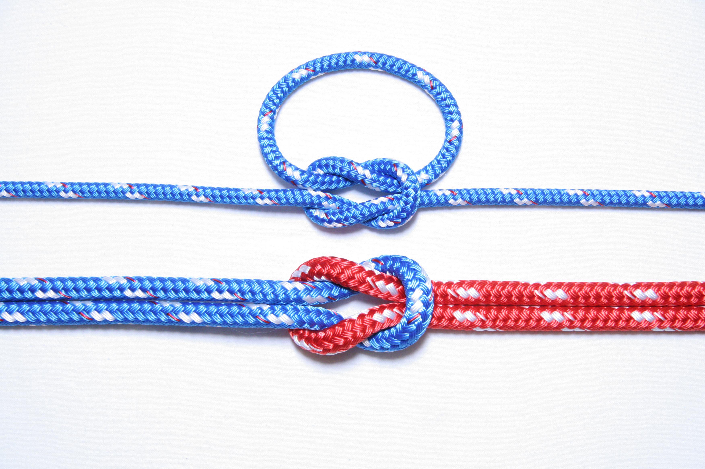
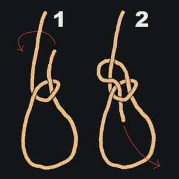
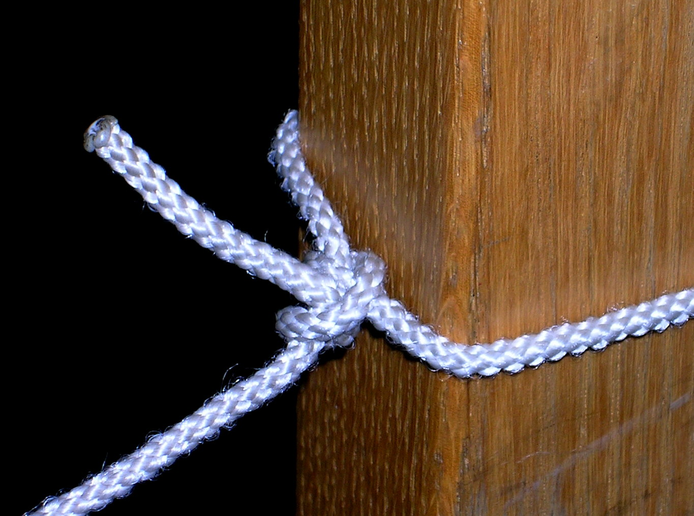
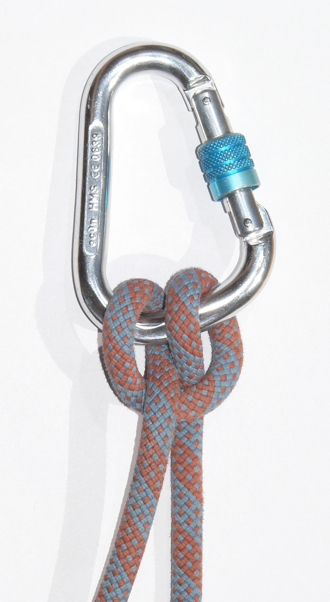
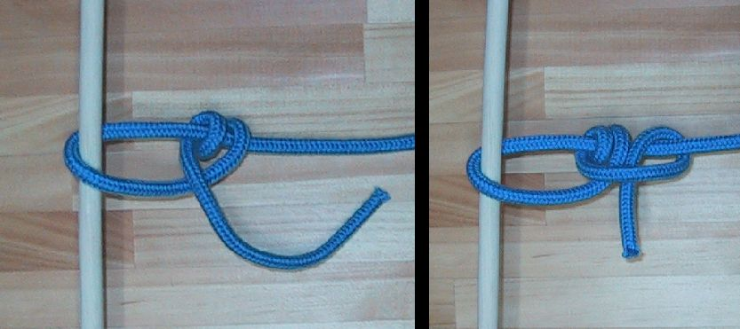
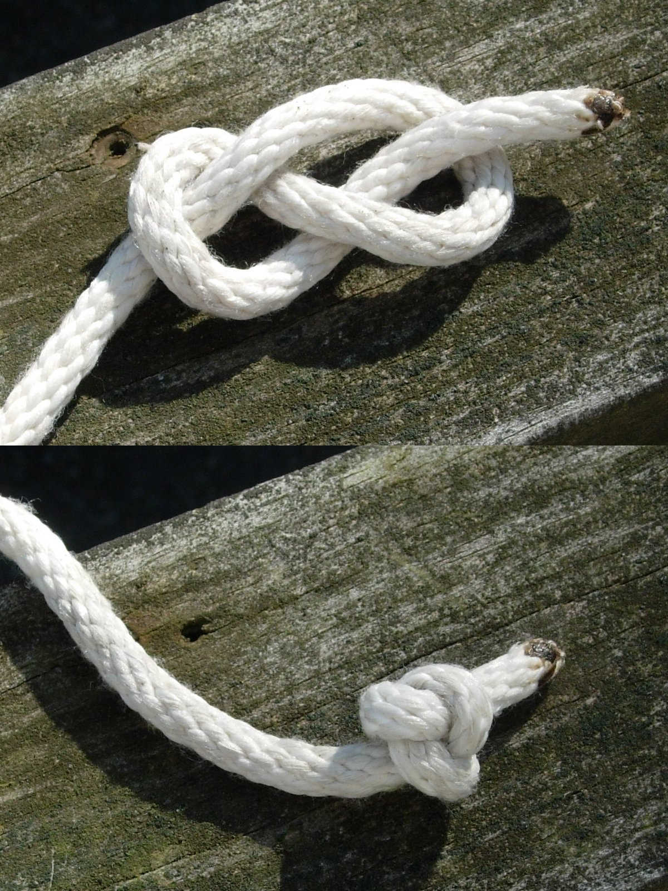
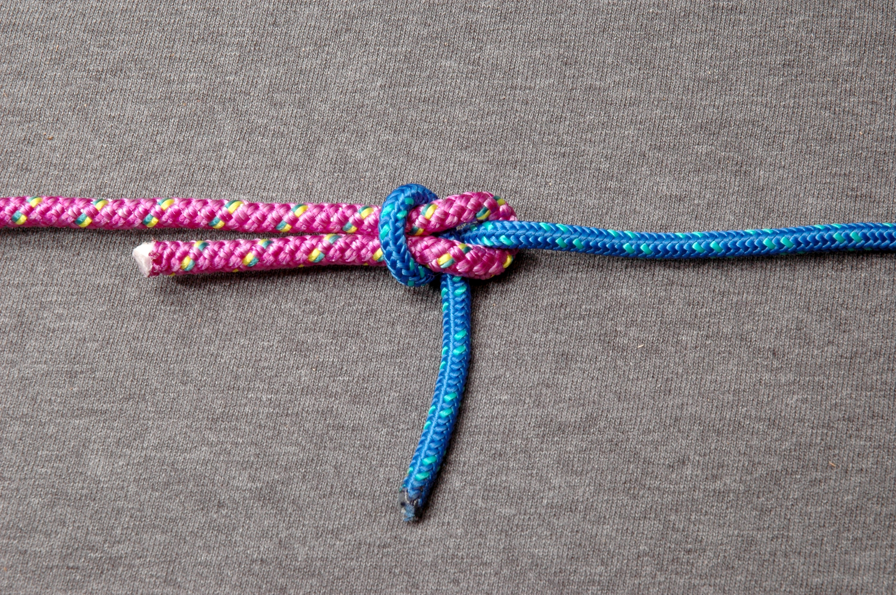

## Read this first

If you remember nothing else from this guide, remember three knots: the
**bowline** (fixed loop that won't slip or jam), the **taut-line hitch**
(adjustable loop for shelter guy-lines), and the **square/reef knot**
(joining two ends of similar rope for a quick tie, never load-bearing).
Practice each knot at least ten times with your eyes open, then ten times
with your eyes closed or in the dark, before you need it for real. A knot
you have to think hard about at 2 a.m. in the rain is a knot you don't
actually know yet.

Second priority: your knife is the single most important tool you own.
Keep it sharp, keep it dry, and keep it on your body (not in a pack you
might lose). A dull knife is more dangerous than a sharp one because it
slips and requires more force to cut.

Third: cordage (rope/string) is consumed constantly in survival — for
shelter, traps, fishing line, repairs, and tool-making. Learn to make it
from plants before you need it, because you will run out of paracord.

## Why this matters

Knots, lashings, and cordage are the connective tissue of every other
survival skill. You cannot build a shelter frame, rig a trap, secure a
raft, hang a bear bag, replace a broken bootlace, or splint a fracture
without rope-work. Tools — a knife, an axe, a saw — are what let you
process wood, food, and materials faster and safer than bare hands.
Repair skills mean the difference between a torn tarp that fails during
a storm and one that gets patched in ten minutes and keeps you dry for
another six months. In a long-term survival or grid-down scenario, you
cannot buy replacement gear — everything you have must be maintained,
repaired, and eventually replicated from raw materials. This is the
skillset that keeps your equipment (and by extension, you) functional
over weeks and months rather than days.

## Key terms

- **Bight** — a U-shaped bend in a rope where the two sides don't cross.
- **Working end** — the end of the rope you are actively tying with.
- **Standing end / standing part** — the long, static length of rope not
  being manipulated.
- **Bitter end** — the very tip of the working end.
- **Dressing a knot** — snugging all wraps so they lie neat and flat
  before loading it; a messy knot is weaker and can slip.
- **Load-bearing vs. non-load-bearing** — whether the knot will hold body
  weight or heavy strain (needs a strong, tested knot) versus light duty
  (a quick knot is fine).
- **Lashing** — rope wrapped around two or more poles to bind them into a
  rigid structure (as opposed to a knot, which joins rope to itself or
  another rope).
- **Cordage** — general term for rope, string, or twine, especially when
  hand-made from natural fiber.
- **Reverse-wrap** — the core technique for twisting plant fibers into
  strong two-ply cordage.
- **Batoning** — striking the spine of a knife with a stick or club to
  split wood, instead of swinging the blade.
- **Bevel / edge angle** — the angled surface ground onto a blade that
  forms the cutting edge; typically 15-20° per side for knives, 25-30°
  per side for axes.
- **Burr (wire edge)** — a thin curl of metal raised on the back of an
  edge during sharpening; feeling for it tells you when a bevel is fully
  ground.
- **Stropping** — polishing and aligning a sharpened edge on leather or
  cloth to remove the burr and maximize sharpness.

## What you need

Minimum kit (carry on your body, not just in a pack):
- A fixed-blade knife, 4-6 inch blade, full tang (metal runs the whole
  length of the handle) — the single most important survival tool.
- A folding multitool (pliers, small blades, screwdriver, awl).
- 25-50 ft of paracord or similar strong cordage.
- A small sharpening stone or diamond card, plus a leather strop.
- Duct tape (wrap 3-6 ft around a water bottle or lighter to save space).
- A sewing kit: needles (including one heavy "sailmaker's" needle), thread
  or heavy waxed cord, safety pins, spare buttons.
- A folding saw and/or hatchet, if weight allows — dramatically faster
  than a knife for processing firewood and structural poles.
- Superglue (doubles as an emergency wound closure and gear repair).
- Seam sealer or beeswax for waterproofing.
- Extra bootlaces.

If you have none of this, everything below also explains how to improvise
equivalents from stone, wood, and natural fiber.

## Essential knots

Learn these in order — each builds rope-handling skill you'll need for
the next.

### 1. Square knot (reef knot)

**When to use:** Quickly joining two ends of rope of the *same thickness*
for light duty — tying off a bundle, securing a bandage, tying a tarp
corner. **Do not use it to join two ropes for climbing, hauling, or any
load-bearing task** — it can slip or capsize under load or shock-loading.

**Steps:**
1. Hold one end in each hand: left end (L) and right end (R).
2. Cross left over right and tuck it under, then pull through ("left over
   right, under and through").
3. Now cross the resulting left-side end over the right-side end again,
   and tuck under, then pull through ("right over left, under and
   through").
4. Dress it flat and snug. If tied correctly, both loose ends exit on the
   same side, parallel to the standing parts. If they exit at right
   angles (a "granny knot"), you did step 2 or 3 wrong — untie and redo.

```
Square (Reef) Knot
        ___________
       /           \
  ----X             X----
       \___________/
   Two interlocking bights, ends parallel
   to standing parts on the same side.
```


*Figure — Square (reef) knot, shown tied on a bight and joining two different-colored ropes end to end. Used for light-duty joins like bundling gear or tying a bandage. Source: Wikimedia Commons (File:Knot-square-ABoK 1204-USCG.jpg), USCG PTC Developer, CC BY-SA 4.0.*

The two interlocking loops lie flat against each other, and both loose ends
exit the knot parallel to the standing parts on the same side — that flat,
symmetrical look is how you confirm you tied a square knot and not a
lopsided "granny" knot.

### 2. Bowline (fixed loop)

**When to use:** Creating a loop at the end of a rope that will not
slip or tighten under load, yet unties easily afterward even after being
heavily loaded — rescue lines, securing a rope around a fixed object,
hauling water containers, hoisting gear. This is arguably the single
most useful knot in survival.

**Steps** (using the classic "rabbit" method):
1. Lay the rope over your open palm so the working end points away from
   you; this forms the "rabbit hole" — make a small loop in the standing
   part with the working end passing *over* the standing part.
2. The working end is the "rabbit," the loop is its "hole," and the
   standing part above the loop is the "tree."
3. Pass the working end up through the loop (the rabbit comes out of the
   hole).
4. Wrap the working end behind the standing part (the tree)...
5. ...then feed it back down through the same loop it came out of (the
   rabbit goes back down the hole).
6. Pull the standing part and the loop's sides to tighten, leaving a
   fixed loop of the size you want. Leave at least a 4-inch tail and
   consider backing it up with a half-hitch or overhand knot around the
   standing part.

```
Bowline
              _____
             /     \
    ________/       |
   |     _  \       |
   |    / \  \_____/
   |   |   |  loop (fixed size)
    \__|___|
     tree   rabbit-hole
   Working end goes UP through loop, AROUND
   standing part, then back DOWN through
   the same loop.
```


*Figure — Bowline, shown as a two-step hand-drawn diagram (loop formed, then working end tucked through and around). Creates a fixed loop that won't slip yet unties easily after loading. Source: Wikimedia Commons (File:Bowline_knot.jpg), MH (ja.wikipedia), CC BY-SA 3.0 / GFDL.*

Notice the loop stays a fixed size no matter how hard the standing part is
loaded — that's what makes the bowline safe for hauling water or rescue
lines, unlike a slip knot that would tighten around whatever it's holding.

### 3. Two half-hitches

**When to use:** Tying a rope to a fixed object (tree, post, ring) when
you need a reliable, adjustable-tension anchor — the everyday "tie this
to that" knot for guy-lines, hanging a tarp edge, or securing a boat.

**Steps:**
1. Wrap the working end around the anchor (post/branch).
2. Bring the working end over the standing part and tuck it through the
   loop you just made, then pull snug — that's one half-hitch.
3. Repeat: bring the working end over the standing part again and tuck
   through, in the same direction — that's the second half-hitch.
4. Slide both hitches down snug against the anchor and dress them neatly.

```
Two Half-Hitches
   anchor
    ___
   /   \
   |   |==standing part==>
   |   |   \___/\___/
   |   |    hitch1 hitch2
    \_/
   Each hitch: end passes over standing
   part and back through its own loop.
```


*Figure — Completed two half-hitches, anchored around a post. A correctly tied version looks like a clove hitch formed around the rope's own standing part, not around the post itself. Source: Wikimedia Commons (File:Two_half_hitches_3.jpg), Smack, Public Domain.*

The two hitches stack snugly against each other right at the anchor point;
this is the everyday "tie-off" knot for guy-lines and boat lines because
it holds under steady tension but is easy to untie by hand once slack.

### 4. Clove hitch

**When to use:** Quickly starting or finishing a lashing, or tying a rope
to a post when the load pulls roughly perpendicular to the post (fence
lines, starting a shelter lashing, tying a fender to a dock). Not fully
secure if the load direction changes constantly or pulls straight along
the pole — back it up with a half-hitch for critical use.

**Steps:**
1. Wrap the working end around the post once, crossing over itself to
   form an "X" on the front face.
2. Wrap around the post a second time, laying this wrap *above* the
   first crossing.
3. Tuck the working end under the last wrap, between the rope and the
   post, and pull both ends to snug it tight.

```
Clove Hitch
     post
    __|__
   |  X  |   <- first wrap crosses
   |  |  |
   |  X  |   <- second wrap, tucked under itself
   |__|__|
   Two wraps around the post that cross
   and pin each other in place.
```


*Figure — Clove hitch, tied in the bight and clipped onto a screwgate carabiner. Same X-over-X wrap pattern used to start or finish a lashing on a pole. Source: Wikimedia Commons (File:Clove_hitch.jpg), Parkis (cs.wikipedia), CC BY-SA 3.0 / GFDL.*

The two wraps cross and pin each other flat, which is why a clove hitch
goes on and comes off quickly by hand — but it can slip if the pull isn't
roughly perpendicular to the post, so back it up for anything critical.

### 5. Taut-line hitch (adjustable loop)

**When to use:** The go-to knot for tent and tarp guy-lines. It creates a
loop that slides to adjust tension but grips and holds once weighted —
essential when wind changes or wet rope stretches overnight.

**Steps:**
1. Run the working end around your stake/anchor point and back toward
   the standing part.
2. Wrap the working end around the standing part two times, working
   *toward* the anchor, with each wrap passing through the loop you're
   forming (like starting a friction coil).
3. Make one more wrap *above* those two, this time on the far side (away
   from the anchor), and tuck through.
4. Dress all three wraps snug against each other. Slide the whole knot
   along the standing part to tighten or loosen the line; it will grip
   when you let go and pull on the tag end.

```
Taut-line Hitch
   anchor                    tent stake
     O===standing part=======>
          (((  ))--tag end
       2 wraps toward anchor,
       1 wrap away, all snugged
       together. Slides to tension,
       grips under load.
```


*Figure — Taut-line hitch, shown as a two-panel how-to around a stake/dowel: wraps formed (left), then dressed and snugged (right). The standard guy-line knot for tents and tarps. Source: Wikimedia Commons (File:Taut Line Hitch HowTo.jpg), Chris 73, CC BY-SA 3.0 / GFDL.*

The friction coils are what let this knot do something a plain hitch
can't: slide by hand to add or remove slack, then grip and hold firm the
instant the line comes under tension again.

### 6. Figure-eight knot

**When to use:** A stopper knot tied in the end of a rope to keep it from
slipping through a pulley, grommet, or your hands; also the base for the
stronger "figure-eight on a bight" loop used in climbing-adjacent tasks.
Easier to untie after loading than a simple overhand knot.

**Steps:**
1. Make a loop in the rope near the working end.
2. Pass the working end behind the standing part.
3. Bring the working end back over the top of the first loop and thread
   it down through that loop, forming a figure "8" shape.
4. Pull both ends to tighten and dress the knot so the "8" shape is
   clean and symmetrical.

```
Figure-Eight
      ___
     /   \
    |     |
     \   / \
      \ /   \
       X     |
      / \   /
     |   \_/
      \___/
   Rope traces a figure-8 shape;
   pull both ends to set.
```


*Figure — Figure-eight stopper knot in natural-fiber rope on a wood plank, shown loose as tied (top) and cinched tight as used (bottom). Keeps a rope end from slipping through a pulley, grommet, or your hands. Source: Wikimedia Commons (File:Figure_eight_knot.JPG), Just plain Bill, CC BY-SA 3.0 / GFDL.*

Compare the loose and tight versions: the "8" shape holds even when
snugged all the way down, and — unlike a simple overhand knot — it stays
easy to untie afterward even after being loaded hard.

### 7. Sheet bend (joining two ropes, especially different thicknesses)

**When to use:** Joining two ropes of *different* diameters or
materials — a place the square knot fails. Standard for extending
cordage or joining a net.

**Steps:**
1. Form a bight (U-shape) in the thicker rope; hold it so the bight
   opens toward you.
2. Pass the working end of the thinner rope up through the bight.
3. Wrap the thin rope's working end around *both* legs of the thick
   rope's bight (behind them).
4. Tuck the thin rope's working end back under itself, where it first
   entered the bight (not under the thick rope) — pull all four parts to
   snug. For extra security with slick rope, wrap around the bight twice
   before tucking (a "double sheet bend").

```
Sheet Bend
   thick rope bight:  ___
                      /   \
   thin rope in -->  |     |
                  \   |     |
                   \__|_____|
                    \___/
   Thin rope threads through the bight,
   wraps around both legs, tucks under
   itself.
```


*Figure — Sheet bend joining two ropes of different diameter and color (blue rope threaded through a bight in the thicker magenta rope). The standard knot for extending cordage when a square knot would slip. Source: Wikimedia Commons (File:Sheet-Bend-ABOK-1431.jpg), David J. Fred, CC BY-SA 2.5.*

Note how the thinner rope's tail and the bight's tail both exit the same
side of the knot — that's the tell that it's dressed correctly and won't
capsize when the joint is loaded.

### 8. Prusik knot (optional — friction hitch)

**When to use:** A loop of thinner cord tied *around* a thicker main
rope that grips when weighted but slides by hand when unweighted — used
to ascend a fixed rope, rig a haul system, or as a safety backup on a
line. Requires a separate loop of cord (a "prusik loop"), tied thinner
than the main rope.

**Steps:**
1. Tie a small loop of cord into a closed loop (using a double fisherman's
   knot or a simple overhand splice) — this is your prusik loop.
2. Lay the loop against the main rope, then pass one end of the loop
   through the other end (around the main rope) three times, keeping
   the wraps flat and side-by-side, not overlapping.
3. Pass the remaining loop through itself one final time to lock it,
   then dress all wraps so they lie flat against the rope.
4. Test: slide the whole wrapped knot along the main rope by hand — it
   should move freely when not loaded, then grip tight the instant
   weight is applied.

```
Prusik Knot
   main rope  ||||||||||
              ||[||||]||   <- 3 flat wraps of
              ||[||||]||      loop cord around
              ||[||||]||      main rope
                 \__/
              loop hangs below,
              clip or tie load here
```

## Lashings (binding poles into structures)

Lashings use rope wrapped and "frapped" (cinched tight between poles) to
bind two or more poles rigidly — the backbone of shelter frames, tripods,
rafts, and drying racks.

**General lashing steps (all types):**
1. Anchor the rope to one pole with a clove hitch.
2. **Wrap** the rope around both poles repeatedly (direction depends on
   type — see below), keeping wraps snug but not yet fully tight.
3. **Frap** (cinch): wrap the rope tightly *between* the poles,
   perpendicular to the wraps, pulling the wraps into a tight, rigid
   X or box pattern. This is what actually locks the lashing.
4. Finish with a clove hitch on the same or opposite pole and tuck the
   tail, or tie off with two half-hitches.

### Square lashing
**Use:** Joining two poles that cross at roughly 90° (a T or + joint) —
the main lashing for shelter frames and A-frame structures.
1. Start with a clove hitch on the vertical pole, just below where the
   horizontal pole will cross.
2. Wrap over the horizontal, behind the vertical, over the horizontal
   again, behind the vertical again — repeat 3-4 full wraps, always
   going over the same pole first each time so wraps stack in a tight
   box pattern, not crossing over each other.
3. Frap: wrap the rope tightly between the two poles, going around the
   wraps you just made (not around the poles themselves), 2-3 times, to
   cinch everything rigid.
4. Finish with a clove hitch on the pole you didn't start on.

```
Square Lashing (top view of joint)
        |
    ====+====   <- wraps go over/under
        |          alternating poles
     (frapping turns cinch the
      wraps tight between poles)
```

### Diagonal lashing
**Use:** Joining two poles that cross at an angle and don't touch or
have a gap between them before lashing (common for X-braces that resist
racking/sway in a frame).
1. Start by tying the two poles together with a **timber hitch** or
   simply a clove hitch around both poles where they cross, to pull them
   into contact.
2. Wrap diagonally across the crossing 3 times in one direction, then 3
   times in the other direction (forming an X pattern over the joint).
3. Frap tightly between the poles 2-3 times.
4. Finish with a clove hitch.

### Shear lashing
**Use:** Binding two (or three) poles side by side that will then be
spread apart into an A-frame or tripod (tripod = "shear lashing" done on
three poles, sometimes called a tripod lashing).
1. Lay the poles parallel/side by side. Start with a clove hitch around
   one end pole.
2. Wrap around all the poles together (not crossing between them) 6-8
   times, loosely — loose enough that the poles can later pivot.
3. Frap between each pair of poles once or twice to keep wraps from
   sliding, but keep it loose enough to spread.
4. Finish with a clove hitch, then spread the poles apart into a stable
   A-frame or tripod stance. For a tripod, spread all three legs evenly
   and the lashing cinches naturally as weight is applied.

```
Shear/Tripod Lashing (before spreading)
   |  |  |
   |  |  |
   ===||===  <- 6-8 loose parallel wraps + frapping
   |  |  |      then legs are spread into a tripod
```

## Making cordage from natural fibers

When you run out of rope, you can twist it from plants. The strongest
readily-available natural fibers are inner tree bark (basswood, willow,
cedar, dogbane), stinging nettle stalks, yucca leaves, and long grasses
in a pinch (weaker).

1. **Harvest:** For inner bark, strip bark from a dead-standing sapling
   or fallen branch; peel the fibrous inner layer (bast) away from the
   outer bark. For yucca or dogbane, cut mature stalks/leaves.
2. **Process:** Dry the fibers slightly, then soften by twisting,
   pounding with a smooth rock, or rolling between your palms until
   pliable and separated into thin strands. Remove woody/brittle bits.
3. **Reverse-wrap technique** (the core two-ply cordage method):
   a. Take a bundle of fiber and find its middle point; form a small
      bight there (this becomes the start of your cord).
   b. Hold the bight in one hand. You now have two strands hanging from
      it — call them Strand A (top/far) and Strand B (bottom/near).
   c. With your other hand, twist Strand A away from you (clockwise)
      several turns until it kinks tightly on itself.
   d. Cross the twisted Strand A *over* Strand B, so it now becomes the
      near strand and B becomes the far strand — this locks the twist
      in place as a small segment of two-ply rope.
   e. Repeat: twist the new "far" strand, then cross it over to become
      the "near" strand. Each cross-over locks one twisted segment.
   f. When a strand gets short, splice in a new fiber bundle by
      overlapping the new fibers with the old strand *before* twisting,
      so the join gets twisted and locked in the same way as the rest.
   g. Continue until you reach the desired length, then finish the end
      with an overhand knot so it can't unravel.
4. **Test:** Good cordage should not unravel when released and should
   hold significant body-weight-scale tension before breaking. Make it
   thicker (more fiber per strand) for load-bearing use.

```
Reverse-Wrap Cordage
   bight >==\
             ) A (far)  --twist-->  ))--cross over-->  becomes near
             ) B (near)
   Repeat on new "far" strand each time.
   Result: tightly twisted 2-ply cord that
   locks itself and resists unraveling.
```

## Basic tool kit and improvised tools

**Core kit, in priority order:**
1. **Fixed-blade knife** — batoning wood, carving, food prep, first aid.
   Keep it full-tang and no thinner than about 1/8 inch at the spine for
   batoning strength.
2. **Multitool** — pliers for hot pots/wire work, small screwdriver,
   awl/reamer for leather and fabric repair.
3. **Axe or hatchet** — far faster than a knife for felling saplings,
   splitting rounds, and rough shaping; also usable for hammering stakes
   (poll side).
4. **Folding saw** — safer and more controlled than an axe for cutting
   poles to length for shelters and lashings.
5. **Duct tape** — patches, lashings-in-a-pinch, blister prevention,
   fire tinder (it burns), splint wraps.
6. **Cordage** — see above; carry it, and know how to make more.

**Improvised tools when you have none of the above:**
- **Stone tools:** A sharp flake struck off a hard, fine-grained rock
  (flint, chert, obsidian, quartzite) using another rock as a hammer
  (percussion flaking) creates a usable cutting edge for skinning,
  cutting cordage, and scraping. Look for river cobbles that ring with a
  clear, high pitch when tapped — a dull thud means internal fractures
  and poor flaking quality.
- **Digging stick:** A stout, straight hardwood branch about arm-length,
  with one end fire-hardened (charred lightly over coals, then scraped
  to a point) and sharpened at an angle — used for digging roots, tubers,
  latrines, and post-holes.
- **Bone/antler tools:** Split long bones can be ground on rock into
  awls, needles, or scraping tools.
- **Wedge and maul:** A hardwood wedge batoned into a log with a wooden
  maul (club) can split rounds when no axe is available.

## Sharpening a knife or axe

A sharp edge is safer and does more work per stroke than a dull one.

1. **Find your angle.** Most survival/bushcraft knives use about 15-20°
   per side (a narrower, more acute angle for fine cutting); axes and
   choppers use a stouter 25-30° per side for edge durability. A rough
   field trick: lay the blade flat on the stone, then tilt up until you
   see roughly a matchbook's thickness of gap under the spine — that's
   in the right range for a knife.
2. **Coarse stage (if the edge is nicked or very dull).** Use a coarser
   stone or the rough side of a two-sided stone. Hold the angle steady
   and draw the blade across the stone edge-first, as if slicing a thin
   layer off the stone's surface, alternating sides every 5-10 strokes.
3. **Check for the burr.** Run a fingernail (not fingertip, to avoid
   cuts) gently from spine to edge on the back side. If you feel a tiny
   consistent wire-like lip along the entire edge, the bevel is fully
   ground on that side — switch sides and repeat until both sides burr.
4. **Fine stage.** Move to a finer stone (or the smooth side) and repeat
   with lighter pressure, alternating sides in smaller sets (3-5 strokes
   each), gradually reducing pressure until the burr is thin and even.
5. **Strop.** Draw the blade *backward* (spine-leading, edge trailing —
   never edge-first) across leather or a folded cloth, alternating sides,
   10-20 passes each, to remove the burr and align the final edge. This
   step is what makes an edge "hair-popping" sharp rather than just
   functional.
6. **No stone? Improvise:** A smooth, flat river rock, the unglazed
   bottom rim of a ceramic mug or bowl, or fine wet sand rubbed with a
   flat rock can all serve as crude sharpening surfaces. Even repeated
   stropping on a leather belt or truck tire sidewall can restore some
   edge to a working blade.
7. **Axes:** Use a puck-style sharpening stone in a circular motion
   along the bevel on each side, matching the existing angle; finish by
   stropping on wood or leather. Never use a fine-only stone on a badly
   nicked axe — coarse first, always.

## Repairs

### Sewing a basic stitch (clothing, gear, footwear)
1. Thread a needle with waxed thread or dental floss (stronger and more
   water-resistant than plain thread); double it and knot the ends
   together for strength.
2. For a simple **running stitch**: push the needle up through the
   fabric, then back down a short distance away, repeating in a straight
   line — fast, but not the strongest.
3. For a stronger **whip stitch** (good for closing tears and edges):
   wrap the thread diagonally over the edge of the fabric with each
   stitch, so thread wraps around the raw edge rather than just piercing
   flat fabric — better for preventing a tear from spreading.
4. For heavy material (leather, canvas, boot leather) that a regular
   needle can't pierce, use an **awl** (multitool reamer, or an
   improvised sharpened nail/bone point) to punch a starter hole, then
   pass the needle/thread through that hole.
5. Finish any stitch line with a few tight knots or a couple of
   backstitches over the same spot so it can't unravel.

### Fixing footwear
- **Separated sole:** Clean and dry the gap, apply superglue or contact
  cement to both surfaces, press together, and wrap tightly with cord or
  duct tape while it cures (minutes to hours depending on adhesive).
- **Worn-through sole:** Cut a patch from a tire scrap, tarp material, or
  thick fabric and glue/lash it over the worn spot; secure edges with
  duct tape wrapped fully around the shoe.
- **Broken laces:** Replace with paracord's inner strands, or braided
  natural cordage; tie with a simple overhand or surgeon's knot at the
  eyelet.

### Duct-tape and tarp/tent repairs
1. Clean and fully dry the surface around the tear — tape will not
   adhere to wet or dirty fabric.
2. For small holes: place a patch of tape on both the inside and outside
   of the tear, sandwiching the fabric, with tape extending at least an
   inch past the tear in every direction, and round the corners of the
   patch (square corners peel up first).
3. For long tears: sew the tear closed first with a whip stitch, then
   tape over the stitched seam on both sides for waterproofing.
4. For a punctured air mattress or water container, follow the same
   clean-dry-patch-both-sides method; test by inflating/filling and
   checking for leaks (submerge in water and watch for bubbles, or listen
   in a quiet spot for a hiss).

### Waterproofing
- Rub **beeswax** or candle wax into seams and stitch lines, then warm
  gently (body heat, sunlight, or a few seconds near — not in — a flame)
  to melt it into the fibers.
- Rendered animal fat or pine resin (heated and thinned slightly) works
  as an improvised waterproofing dressing for leather boots and seams.
- Silicone-based seam sealer, if carried, should be applied to tent/tarp
  seams before a trip and reapplied when water starts beading less
  effectively.

### Mending containers (metal, plastic)
- Small punctures in metal containers: a dab of melted wax, pine pitch,
  or epoxy pressed into the hole, reinforced with duct tape.
- Cracked plastic: warm the area slightly and press a patch of tape or
  a heated, flattened bit of similar plastic into the crack; duct tape
  wrapped several times around a cracked bottle or canteen can restore
  a usable seal for water storage (non-potable uses if the tape contacts
  the water).

### Tool maintenance (rust prevention, oiling)
1. After use in wet conditions, wipe blades and metal tools fully dry
   before storing — moisture left on steel is what starts rust.
2. Apply a thin film of oil (gun oil, mineral oil, cooking oil in a
   pinch, or even rubbed-in animal fat) to the blade and any exposed
   metal, then wipe off the excess so it's a film, not a puddle.
3. Remove existing surface rust by scrubbing with fine steel wool,
   sand, or a rock dipped in oil, then re-oil.
4. Store tools in a dry location; avoid leather sheaths for long-term
   storage of an oiled blade, since leather can trap moisture against
   the steel — a dry cloth wrap is safer for extended storage.

## Regional & scenario variants

- **Desert:** Yucca leaves are one of the best natural cordage fibers
  available and are common across arid regions of the Southwest US and
  similar climates worldwide — prioritize learning to process them.
  Sand and grit accelerate blade wear; wipe and oil tools more
  frequently.
- **Tropical/jungle:** Rot and mildew attack cordage, thread, and
  leather fast — dry gear daily when possible, and prefer synthetic
  cordage (paracord) over natural fiber for anything long-term. Vines
  (like rattan) can sometimes be used directly as crude cordage without
  processing.
- **Arctic/cold:** Metal tools become brittle and can shatter if struck
  hard when extremely cold — let tools warm slightly before heavy
  batoning in deep cold. Wet leather gear can freeze stiff; dry and oil
  it nightly near (not in) a heat source.
- **Coastal/maritime:** Salt accelerates rust dramatically — rinse tools
  in fresh water when possible and oil more often. Kelp and certain
  seaweeds can serve as emergency lashing material when wet, though they
  weaken as they dry.
- **Urban/grid-down scenario:** Scavenge wire, zip ties, and electrical
  tape as knot/lashing substitutes; furniture webbing straps and
  bungee cords can replace rope for many lashing tasks; a hardware
  store's leftover hand tools (even damaged ones) are often more
  effective than anything improvised from raw materials.

## ⚠️ Safety

- **Batoning and axe use:** Always cut/split on a stable, flat chopping
  block, never on your leg, a rock that can send fragments flying, or
  bare ground where the edge can strike dirt and grit and dull instantly.
  Keep your off-hand and feet well clear of the swing/strike path.
- **Sharpening:** Always cut/sharpen away from your body; keep fingers
  behind the cutting edge at all times, including while stropping.
- **Load-bearing knots:** Never trust a knot you have not personally
  tested under controlled load before you need it for real (e.g., before
  rappelling, hauling a person, or crossing water on a rope). Test a
  bowline or prusik with your own body weight at ground level first.
- **Frayed or aged cordage:** Inspect rope before any load-bearing use;
  fuzzy, discolored, or stiff sections indicate weakened fiber — cut
  them out or retire the rope for structural use.
- **Fire near fuel/adhesives:** Superglue fumes and some seam sealers
  are flammable — cure repairs away from open flame and in ventilated
  air.
- **Stone tool flaking:** Wear eye protection if available; sharp stone
  flakes fly unpredictably and can cause cuts or eye injury. Work over a
  cloth or leather pad to contain debris and make cleanup/foraging for
  usable flakes easier.
- **Rust and tetanus:** Old rusted metal (found tools, wire, nails) can
  cause serious infection through puncture wounds; clean any such wound
  immediately and monitor closely (see the first-aid guide).

## Troubleshooting

- **Knot slips under load** — you likely tied a granny knot instead of a
  square knot (check that ends exit parallel, not at right angles), or
  used the wrong knot for the job (square knots are not for load-bearing
  joins — switch to a sheet bend or bowline).
- **Bowline won't hold its shape / loosens** — the loop wasn't dressed
  snug before loading, or the tail is too short and has worked back
  through; retie with a longer tail and back it up with a half-hitch
  around the standing part.
- **Lashing is loose/wobbly** — you didn't frap tightly enough, or you
  wrapped in a crossing pattern for a square lashing instead of a
  stacked box pattern; redo the frapping turns, cinching hard between
  every wrap.
- **Reverse-wrap cordage keeps unraveling** — the twist wasn't tight
  enough before crossing over, or fibers were too short/brittle; twist
  each segment until it kinks sharply on itself before crossing, and use
  longer, well-processed fiber.
- **Knife won't take an edge no matter how much you sharpen** — check for
  a chip or roll in the edge requiring more coarse-stage work first, or
  you may be changing your angle stroke to stroke; rest the blade flat,
  lift to the target angle, and hold that angle rigid for the entire
  stroke.
- **Duct tape patch won't stick / peels immediately** — the surface was
  wet, oily, or dusty; re-clean and fully dry before re-applying, and use
  rounded corners on the patch.
- **Stitches tear out of fabric** — stitches are too close to the raw
  edge or thread is too thin for the load; move the stitch line slightly
  inward from the tear and use a whip stitch over the edge with doubled,
  waxed thread.

## Quick-reference checklist

- [ ] Carry a fixed-blade, full-tang knife on your body at all times.
- [ ] Practice the bowline, taut-line hitch, and square knot until they
      are automatic (can tie blindfolded).
- [ ] Carry at least 25-50 ft of strong cordage; know how to make more
      from plant fiber via reverse-wrap.
- [ ] Know all three lashings (square, diagonal, shear) for any shelter
      or structure build.
- [ ] Carry a sharpening stone/card and a strop; sharpen before an edge
      gets fully dull, not after.
- [ ] Carry a basic sewing kit with a heavy needle, waxed thread, and
      safety pins; carry duct tape wrapped around a bottle or lighter.
- [ ] Dry and oil metal tools after any wet-weather use.
- [ ] Inspect rope and cordage for wear before any load-bearing use.
- [ ] Know at least one improvised-tool method (stone flake, fire-
      hardened digging stick) in case your kit is lost.
- [ ] Waterproof seams and stitch lines on shelter/gear before you need
      them to perform in a storm, not during one.

## Sources & further reading

- U.S. Army Field Manual FM 21-76, *Survival Manual* —
  `reference/manuals/fm21-76_survival_manual.pdf` (knots, lashings, and
  improvised tool sections).
- *Primitive Skills and Crafts* — `reference/manuals/Primitive_Skills_and_Crafts.pdf`
  (natural cordage production, stone tool flaking, and traditional
  lashing techniques).
- Cross-reference `../shelter/shelter.md` for lashings applied to frame
  construction, and `../food-hunting-fishing-trapping/food-hunting-fishing-trapping.md`
  for cordage used in traps, snares, and fishing line.
