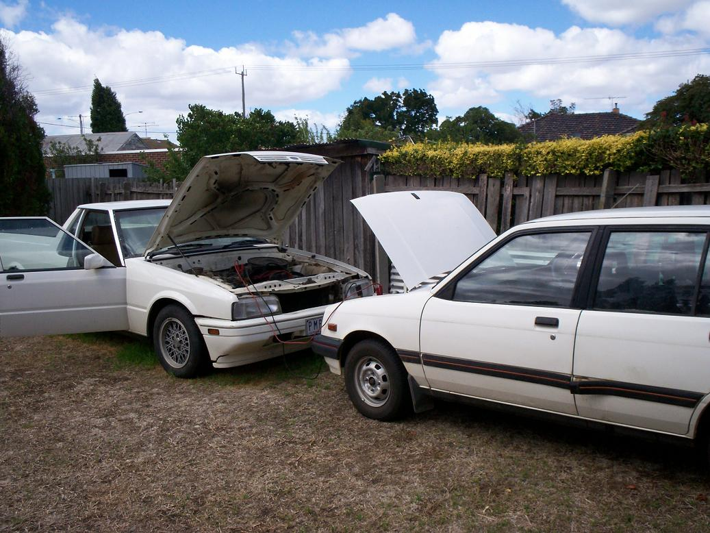
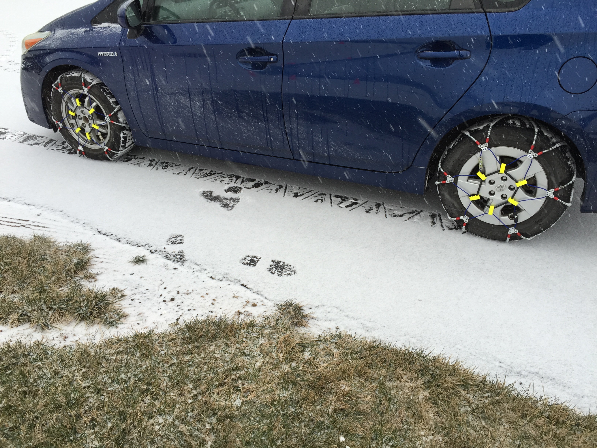

# Transportation & Vehicle Emergencies

## Read this first (the 30-second version)
1. **Get off the road first.** Whatever the problem, steer to the shoulder/parking lot, put it in Park, set the parking brake, turn on **hazard flashers**, and only then get out (on the side away from traffic).
2. **Flat tire:** loosen lug nuts a little BEFORE jacking, jack the car, remove wheel, mount spare, hand-tighten nuts in a star pattern, lower the car, then fully tighten in a star pattern. Drive slowly (under 50 mph) to a tire shop.
3. **Dead battery:** connect jumper cables in this exact order — **RED to dead+, RED to good+, BLACK to good–, BLACK to bare unpainted metal on the dead car (NOT its battery)** — start the good car, wait, then try the dead one. Reverse the order to disconnect.
4. **Overheating:** turn off the A/C, turn the heater on full blast, pull over and shut the engine off. **Never open a hot radiator cap** — scalding steam/coolant can spray out. Wait at least 30 minutes.
5. **Stuck in mud/sand/snow:** don't floor the gas — spinning tires dig you in deeper. Straighten the wheels, clear a path, put traction material (sand, kitty litter, floor mats, sticks) under the drive tires, and **rock gently** forward-reverse-forward in low gear.
6. **Flooded road: Turn Around, Don't Drown.** Just **6 inches (15 cm)** of moving water can knock you down or stall a car; **12 inches (30 cm)** floats most cars, including SUVs and trucks. **Never drive through standing or moving flood water** — turn around, no matter how urgent your trip.

The rest of this guide walks through each of these in full detail, plus winter vehicle survival, fuel planning, the abandon-vs-stay decision, using your car as shelter, and basic bicycle repair as a backup vehicle. **A person who has never touched a jack or jumper cables before can follow it.**

---

## Why this matters
Most people's first roadside emergency happens at the worst possible time — at night, in bad weather, on the way to work, or in the middle of evacuating ahead of a storm. A flat tire or dead battery is a minor inconvenience if you know what to do; it becomes dangerous if you don't, because it can strand you on a live roadway, in extreme heat or cold, or in rising flood water. In North Texas specifically, flash floods kill more people in their **cars** than anywhere else — most Texas flood deaths are drivers who tried to cross water they misjudged. Knowing the mechanical basics (this guide) and the survival basics of being stranded (see the [Evacuation & Bug-Out guide](../evacuation-bugout-vehicle/evacuation-bugout-vehicle.md)) together mean a breakdown stays an inconvenience instead of becoming an emergency.

## Key terms (plain language)
- **Shoulder** — the paved or graded strip beside the traffic lanes where you can safely pull off.
- **Hazard flashers** — the four-way blinking lights, turned on with a button usually marked with a red triangle.
- **Lug nuts** — the nuts holding the wheel onto the car; usually 4–6 per wheel.
- **Jack** — a hand-cranked or scissor tool that lifts the car off the ground; every car has one stored with the spare tire.
- **Jack point / pinch weld** — the reinforced spot under the car's rocker panel designed to hold the jack safely (check your owner's manual — using the wrong spot can dent the floor or let the car fall).
- **Donut / space-saver spare** — a small, skinny temporary spare tire rated for **short distances at reduced speed only** (usually 50 mph / 70 miles max — check its sidewall).
- **Jumper cables** — a pair of long cables with clamps used to transfer electrical current from a good battery to a dead one.
- **Jump pack / jump starter** — a self-contained battery pack that jump-starts a car without needing a second vehicle.
- **Radiator** — the part that cools hot engine coolant using outside air; has a pressurized cap on top or on a nearby overflow tank.
- **Coolant / antifreeze** — the liquid that circulates through the engine and radiator to keep it from overheating (or freezing in winter).
- **Traction** — the grip between a tire and the surface beneath it; lost in mud, sand, ice, and snow.
- **High-centered** — when a vehicle's underside (not the tires) is resting on the ground/an obstacle, lifting the drive wheels off the surface so they spin uselessly.
- **Flash flood** — a sudden, fast-rising flood, common in North Texas after heavy rain on hard, dry, or clay ("blackland prairie") soil that doesn't absorb water quickly.
- **Carbon monoxide (CO)** — an invisible, odorless, poisonous gas produced by a running engine; deadly if it collects in an enclosed space like a snowed-in car. (Full detail: [Fire, Smoke & Air Emergencies](../fire-smoke-air-emergencies/fire-smoke-air-emergencies.md).)
- **Range** — how far a vehicle can travel on the fuel it has left.

---

# PART 1 — CHANGING A FLAT TIRE

**What it does:** Replaces a damaged tire with your spare so you can keep moving (or get somewhere safe) instead of being stuck on the roadside.

**You need:**
- The car's **jack** and **lug wrench** (both usually stored under the trunk floor or beneath the vehicle, with the spare).
- The **spare tire** (full-size or a "donut" space-saver — check which your car has).
- Improvised substitutes if the factory tools are missing/broken: a **4-way lug wrench** (cross wrench) from any auto parts store works on almost any car; a sturdy **flat rock, brick, or wood block** can serve as a wheel chock; a **scrap of wood** (a 1-2 ft piece of 2x4 or a flat rock) placed under a scissor jack keeps it from sinking into soft asphalt, gravel, or grass.
- A **tire plug kit** and a **portable air compressor** (12V, plugs into the car's power outlet) as a second method — often faster than a full tire swap for a small puncture.

**Safety first — before you touch a single tool:**
1. **Get well off the roadway.** Pull onto the widest, flattest shoulder you can find, ideally away from a curve or hill crest where you can't be seen in time. If you can't find a safe spot, drive slowly (even on a flat, at low speed for a short distance) to the next exit, parking lot, or wide shoulder rather than stopping in a traffic lane.
2. **Hazards on**, engine off, parking brake on, transmission in Park (or first gear/reverse for manuals).
3. **Set out reflective triangles or flares** if you have them, well behind the car (100+ feet on a highway).
4. **Chock the wheels** — place a rock, brick, or wood block against the tire diagonally opposite the flat (e.g., flat at right-rear → chock the left-front) so the car can't roll while jacked.
5. Get everyone out of the car and stand **off the roadway side**, behind a guardrail if one exists — not between your car and traffic.

**Step-by-step:**
1. **Loosen the lug nuts BEFORE jacking the car** — while the tire is still on the ground, it won't spin. Turn each lug nut counter-clockwise about a quarter to half turn (don't remove yet). If they're very tight, use your body weight (stand on the wrench handle) rather than a hard sudden yank.
2. **Position the jack** under the car's reinforced jack point nearest the flat tire (check your owner's manual diagram — usually a notch or seam along the rocker panel, a few inches to a foot from the wheel). Never jack under the floor pan, an exhaust pipe, or a plastic panel.
3. **Raise the car** until the flat tire is about 6 inches (15 cm) off the ground — high enough to fit the fully-inflated spare.
4. **Remove the lug nuts the rest of the way** (keep them together, e.g., in the hubcap) and pull the flat tire straight off toward you.
5. **Mount the spare** onto the wheel bolts, push it flush against the hub.
6. **Hand-thread each lug nut on** and tighten by hand in a **star/crisscross pattern** (not around in a circle) — this seats the wheel evenly. Snug them as much as you can by hand.
7. **Lower the car back to the ground**, then finish tightening the lug nuts the rest of the way with the wrench, still in the star pattern, as tight as you can get them.
8. **Stow the flat tire, jack, and tools**, and check the spare's air pressure if you have a gauge (it's usually written on the tire's sidewall, often higher than a normal tire, e.g., 60 psi for a donut).
9. **Drive conservatively.** A donut spare is rated for **50 mph and roughly 50–70 miles maximum** — get to a tire shop and get the real tire repaired or replaced as soon as possible. A full-size spare can be driven normally but should still be treated as temporary until the flat is fixed.

**Method 2 — Plug a small puncture instead (faster, keeps your real tire):**
Works only for a small puncture in the **tread** (not a sidewall cut or a large gash) and only buys time to get to a repair shop — it is a temporary fix.
1. Locate the puncture (look/listen for a hiss, or spray soapy water on the tire and watch for bubbles).
2. If there's an object stuck in the tire (nail, screw), use the plug kit's reamer tool to rough up and slightly enlarge the hole, then remove the object.
3. Thread a sticky rubber plug strip through the plug kit's insertion needle, push it into the hole until only about half an inch sticks out, then pull the needle straight out, leaving the plug seated.
4. Trim the excess plug close to the tread.
5. **Inflate the tire** with a 12V portable compressor (or a get-you-home can of tire inflator/sealant) to the pressure listed on the driver's door jamb sticker.
6. Drive to a tire shop to have it properly patched from the inside — a plug is a get-you-there fix, not permanent.

**How to tell it worked:** the tire holds air overnight and the pressure doesn't visibly drop; no hissing when you listen or spray soapy water on the repair.
**If it didn't work:** the plug won't hold on a sidewall or a hole larger than about ¼ inch — use the spare tire instead.


*Figure — A car raised on a scissor jack with the wheel removed during a roadside tire change. Source: Wikimedia Commons (File:Changing car tire 20170513 02.jpg), Santeri Viinamäki, CC BY-SA 4.0.* Note the jack is placed under the car's reinforced jack point, not the floor pan, and the wheel is fully off before the spare goes on — exactly the setup described in the steps above.

> ⚠️ Never change a tire on a soft shoulder, in a live traffic lane, on a curve, or at night without hazards/triangles out. If conditions feel unsafe (fast traffic, no shoulder, dark, storm), call for roadside assistance and wait inside the car with your seatbelt on rather than working outside.

**Tire checks that prevent a flat before it happens (NHTSA):**
- **Tread depth:** should be at least **2/32 of an inch** on every tire — the "penny test" (insert a penny into the tread groove, Lincoln's head pointing down; if you can see all of his head, it's time to replace the tire) is a quick field check.
- **Check pressure when tires are "cold"** — meaning the car hasn't been driven in at least **3 hours** — for an accurate reading; driving heats tires and raises the reading artificially.
- **Use the pressure on the driver's-door-jamb sticker or owner's manual, never the number molded into the tire's sidewall** (that's the tire's maximum rating, not your vehicle's recommended pressure).
- **Tire age matters even with good tread** — many manufacturers recommend replacing tires around **6 years** from the manufacture date regardless of wear (check the DOT date code on the sidewall); older rubber cracks and separates internally.
- Inspect tread and sidewalls monthly and before long trips for cuts, punctures, bulges, or bumps — any of these means a tire shop visit, not a repair you should trust the road to.

---

# PART 2 — JUMP-STARTING A DEAD BATTERY

**What it does:** Uses a second vehicle's (or a jump pack's) electrical current to turn your dead-battery car's starter motor long enough to get the engine running again.

**Signs of a dead battery:** the engine won't crank (just clicks, or is completely silent) but lights/radio work weakly or not at all; dashboard lights dim when you try to start.

**You need:**
- **Jumper cables** (in your trunk — buy a set if you don't have one; ~$15–25) **or** a **portable jump-starter pack** (a self-contained battery, no second car needed — keep it charged at home).
- A second running vehicle, if using cables.


*Figure — Jumper cable clamps attached to a battery during a jump-start. Source: Wikimedia Commons (File:Jump starting.jpg), Longhair, CC BY 2.5.* Confirm each clamp is biting bare metal on the correct terminal (or bare engine metal for the final ground connection) before starting either engine.

**Method 1 — Jumper cables with a second car (correct order matters — this prevents sparks near battery gas and protects both cars' electronics):**
1. Park the good car close enough that the cables reach both batteries, but **not touching**. Both cars in Park/Neutral, parking brakes on, both engines **off** to start.
2. Identify each battery's **positive (+)** and **negative (–)** terminals (marked on the battery, + is usually red or larger).
3. Connect in this **exact order**:
   - **RED clamp → dead battery's POSITIVE (+) terminal.**
   - **RED clamp (other end) → good battery's POSITIVE (+) terminal.**
   - **BLACK clamp → good battery's NEGATIVE (–) terminal.**
   - **BLACK clamp (other end) → a bare, unpainted metal surface on the DEAD car** — an engine bolt or bracket, **away from the battery** (a strut mount or engine block bolt works well). **Do not** connect this last clamp to the dead battery's negative terminal — connecting it there can spark near battery gases.

```
   DEAD CAR                                   GOOD CAR
   ┌───────────┐                             ┌───────────┐
   │  [+] (1)──┼───── RED cable ─────────────┼──(2) [+]  │
   │           │                             │           │
   │           │                             │  [–] (3)──┼── BLACK cable
   │  bare     │                                          │
   │  metal ◄──┼───── BLACK cable (4, last) ──────────────┘
   │  (engine  │
   │  block/   │        Connect in order 1→2→3→4.
   │  bracket, │        Disconnect in reverse: 4→3→2→1.
   │  NOT [–]) │
   └───────────┘
```
*Connection order at a glance: dead-positive → good-positive → good-negative → bare metal on the dead car (never the dead battery's own negative terminal).*

4. **Start the good car's engine** and let it run for **2–3 minutes** to feed some charge into the dead battery.
5. Try to **start the dead car**. If it doesn't start on the first try, wait another few minutes with the good car running, then try again.
6. Once it starts, **leave both cars running for a few minutes**, then **disconnect in the exact reverse order**: black-from-bare-metal first, then black-from-good-negative, then red-from-good-positive, then red-from-dead-positive.
7. **Do not turn the revived car off right away** — drive it (or let it idle) for at least 20–30 minutes to let the alternator recharge the battery. If it won't hold a charge and dies again shortly after, the **battery itself** likely needs replacing.

**Method 2 — Portable jump-starter pack (no second car needed):**
1. Make sure the pack is charged (check its indicator light).
2. Connect its clamps to your own battery in the same **RED-positive, BLACK-to-bare-metal** order as above (most packs only need to connect to one battery since the pack supplies the power).
3. Turn the pack on if it has a switch, then try starting the car.
4. Disconnect clamps once running, and recharge the pack at home as soon as possible.

**How to tell it worked:** the engine turns over and stays running on its own once you let go of the key/button.
**If it didn't work:** double-check clamp order and that clamps have solid metal-to-metal contact (scrape off corrosion if the terminals are crusty/white); the battery may be too far gone (very old, cracked, or completely dead) — needs replacement or a tow.

> ⚠️ Never let the red and black clamps touch each other while any clamp is connected — this causes sparking and can damage electronics. Batteries can produce explosive hydrogen gas — no open flame or smoking nearby, and don't lean directly over the battery while connecting.

---

# PART 3 — OVERHEATING ENGINE

**Warning signs:** the temperature gauge needle climbs into the red zone, a "temp" warning light comes on, or you see **steam/smoke from under the hood**.

**What to do immediately:**
1. **Turn off the air conditioning** (it adds load to the engine) and **turn the heater to full hot and the fan on high** — this pulls extra heat away from the engine into the cabin. Uncomfortable, but it buys you time.
2. If the gauge keeps climbing or you see steam, **pull over safely and shut the engine off** as soon as you can. Running a badly overheated engine even a little longer can cause serious, expensive damage (warped head, blown gasket).
3. **Pop the hood** (from inside the car) to help heat escape, but **stay back** — do not lean over the engine bay while it's steaming.
4. **Wait.** Give it **at least 20–30 minutes** to cool before doing anything else.

> ⚠️ **NEVER open a hot radiator cap.** Coolant under a hot radiator is pressurized and can be well above boiling (over 250°F/120°C) — opening the cap can instantly spray scalding steam and liquid over your hands and face. Wait until the engine is cool to the touch, then, if you must open it, cover the cap with a thick cloth and turn it slowly to the first stop to release pressure before removing it fully.

**Once cool, check for the cause:**
- **Low coolant level** — most common cause. Look for a translucent plastic overflow/coolant reservoir tank near the radiator with MIN/MAX marks. If it's empty/low and the engine is now cool, add **plain water** (a real emergency substitute — coolant is better when you can get it, but water gets you moving) slowly to the reservoir, not directly into a hot radiator cap.
- **A visibly leaking hose, or a puddle of colored liquid (green, orange, pink) under the car** — a leak. Adding water helps only temporarily; you need a repair.
- **A broken/slipping serpentine belt** — the belt (a wide rubber loop visible at the front of the engine) drives the water pump; if it's snapped or clearly loose, the engine cannot cool itself. Do not keep driving.

**"Limping home" — only if you must drive further with no other option:**
1. Only proceed once the temperature gauge has come back down to normal after cooling and (ideally) topping off coolant/water.
2. Drive at **low, steady speed**, avoiding hills and hard acceleration.
3. **Watch the gauge constantly.** If it climbs again, pull over immediately, turn on the heater full-blast, and repeat the cooling wait.
4. Stop and let it cool every time the gauge approaches red, rather than pushing through — this is far cheaper than a ruined engine.
5. Get to a mechanic as soon as reasonably possible; an overheating engine that keeps recurring is not safe to keep "limping."

**How to tell it worked:** the gauge returns to and stays in the normal range while driving at moderate speed.
**If it didn't work:** the problem is likely a leak, blown hose, or bad water pump/belt beyond a roadside fix — stop driving and call for a tow rather than risk destroying the engine.

---

# PART 4 — FREEING A STUCK VEHICLE (mud, sand, snow)

**What it does:** Restores traction (grip) so the drive tires can push the car out instead of spinning in place and digging deeper.

**You need:** traction material (kitty litter, sand, gravel, floor mats, sticks/branches, carpet scraps, a traction board/ramp if you carry one), a shovel (folding/collapsible ones pack small), and — ideally — a second person to push or to help dig.

**Step-by-step:**
1. **Stop spinning the tires immediately** if they're already spinning — every second of wheelspin melts/polishes the surface under the tire (ice) or digs a deeper rut (mud/sand), making things worse.
2. **Straighten the steering wheel** so the front tires point straight ahead — turned wheels dig sideways trenches.
3. **Get out and look.** Check whether the car is **high-centered** (its underside resting on a mound of snow/mud/rock, wheels dangling and spinning freely with no weight on them) — if so, you must dig out from underneath the center, not just the tires.
4. **Clear a path** in front of and behind each drive tire — dig out built-up mud/snow that's blocking the tire from rolling forward or backward.
5. **Pack traction material** (sand, kitty litter, gravel, carpet scraps, floor mats, sticks laid perpendicular to the tire) directly in front of (to go forward) or behind (to reverse) each drive tire, pressed down into the rut as firmly as you can.
6. **Lighten the load** if possible — have passengers get out and stand safely off to the side (this also lets them push).
7. **Rock the vehicle gently:** shift between **Drive and Reverse** in short, smooth motions (not violent gunning) — go forward a few inches until you feel resistance building, then immediately reverse a few inches, building a bit of momentum each cycle like a swing. **Ease onto the gas smoothly** — full throttle just spins the tires again.
8. If the car has a "low" gear, snow/mud/traction mode, or **traction control off** button, use it — for slippery-surface starts, sometimes turning traction control OFF lets the tires find their own grip better than the computer fighting wheelspin (check your owner's manual).
9. If you have a **tow strap** and another vehicle, hook it to rated tow points (not just any bumper piece) and have the other vehicle pull steadily and smoothly — never jerk a strap, which can snap it or damage both vehicles.

**How to tell it worked:** the car gains forward (or backward) momentum and rolls free onto firmer ground — keep driving until you're clearly on solid footing before stopping again.
**If it didn't work after a few rocking cycles:** stop before you dig in deeper or overheat the transmission — call for a tow rather than keep spinning.

> ⚠️ Don't spin the tires for more than a few seconds at a time — it can overheat an automatic transmission or burn out a clutch, and digs the vehicle in worse. If snow/mud is packed under the car (high-centered), no amount of tire traction will help until you dig out the belly of the vehicle.

---

# PART 5 — FLOODED ROADS: TURN AROUND, DON'T DROWN

**This is the single most important rule in this guide.** More people die in vehicles during floods than anywhere else, because water depth is almost impossible to judge from the driver's seat, especially at night or when the road itself is invisible under muddy water. This section follows the National Weather Service's **"Turn Around, Don't Drown"** campaign (`reference/manuals/nws_turn_around_dont_drown_flood_safety.pdf`) — the same 6 in / 12 in figures used in the [Evacuation & Bug-Out guide](../evacuation-bugout-vehicle/evacuation-bugout-vehicle.md), so the numbers are consistent across this knowledge base.

| Water depth | What it does to a typical car |
|---|---|
| **6 inches (15 cm)** | Can reach the bottom of most cars, causing loss of control or stalling; enough moving water can knock an adult off their feet. |
| **12 inches (30 cm)** | **Floats most cars** — including many SUVs and pickup trucks — and they can be swept off the road. |
| **24 inches (60 cm)+** | Can float and sweep away large SUVs and trucks. |

**The core rule:** **Never drive into standing or moving water on a road**, no matter how urgent your trip or how confident you are in your vehicle. This applies to water crossing the road (low-water crossings, dips, flooded underpasses) and water already covering the roadway from rain.

**Why it's so deceptive:**
- Muddy floodwater hides the actual road surface — the pavement may be washed away, dropped, or undercut right where it looks flat.
- Moving water has far more force than it looks like from inside a dry car — **a foot of moving water can float and sweep away a 3,000-lb vehicle.**
- Once a car stalls in water, electrical systems can fail, power windows and doors may not open, and the car can be pushed/rolled by the current within seconds to minutes.

**What to do:**
1. **If you see water on the road ahead — stop and turn around.** Find an alternate route (see the [Navigation guide](../navigation/navigation.md) for route-planning without GPS) or wait it out on high ground.
2. **If you misjudge it and your car stalls in rising water:** unbuckle immediately, and if water is entering the cabin, get out through a window (power windows may fail — do this **before** water rises past the window level) rather than waiting to try the door against water pressure. Move to the **roof** of the vehicle if you can't reach dry ground, and call/signal for help (see [Signaling for Rescue](../signaling-rescue/signaling-rescue.md)).
3. **Never drive around a barricade** placed at a flooded crossing — those barriers exist because someone already determined the road is unsafe.
4. **After a flood recedes:** roads can be undercut, weakened, or littered with debris even after the water is gone — drive them cautiously, if at all, until inspected.

## North Texas flash-flood note
Blackland prairie clay soil sheds rain fast instead of absorbing it, so **North Texas creeks and low-water crossings can go from dry to impassable in well under an hour** during a heavy thunderstorm — this is a leading cause of flood deaths statewide. Low-water crossings on rural Collin County roads are especially dangerous because they're unmarked or poorly marked and look passable right up until they aren't. Treat every dip or low crossing with running water as a hard stop, even ones you've crossed safely many times before — the depth changes every storm. For the broader flood/disaster picture (watches vs. warnings, sheltering, aftermath), see [Disaster-Specific Guides](../disaster-specific/disaster-specific.md).

## Downed power lines on or near your car
Severe storms, ice, and floods that damage your car's route can also drop live power lines across roads — a hazard as serious as floodwater and easy to overlook while focused on driving conditions (Ready.gov "Car Safety"):
- **If a power line falls on your car, stay inside.** The tires and frame usually insulate you as long as you don't touch anything metal that's also touching the ground. **Do not get out.**
- **Honk, wave, and call 911** to get a trained utility crew to de-energize the line — do not wait for someone to try to move the wire themselves, and warn bystanders to stay back too.
- **If the car catches fire and you must exit** (a last resort), **jump clear with both feet together, not touching the car and the ground at the same time**, then shuffle away with small steps keeping both feet close together and on the ground (a wide stride across a voltage gradient in the ground can complete a circuit through your legs). Do not touch the car again from outside.
- **Never drive over a downed line**, even one that looks dead — treat every line as energized until a utility crew confirms otherwise.

---

# PART 6 — WINTER VEHICLE SURVIVAL (mechanical focus)

Ice storms are a real North Texas risk, and a stuck or stranded vehicle in freezing weather adds a life-safety dimension to a mechanical problem. (For the full stranded-vehicle survival plan — signaling, priorities, staying found — see the [Evacuation & Bug-Out guide, Part 9](../evacuation-bugout-vehicle/evacuation-bugout-vehicle.md); this section covers the mechanical/vehicle-specific pieces.)

- **Stay with the vehicle** if stuck or stranded in winter weather — it's a far bigger, more visible, warmer shelter than you are on foot, and it's what searchers look for.
- **Run the engine only intermittently for heat** — about **10 minutes per hour** is a common guideline — rather than continuously, to conserve fuel and reduce carbon monoxide risk.
- **Before every restart, get out (if safe) and check that the exhaust pipe is completely clear of snow.** A blocked tailpipe can push odorless, invisible carbon monoxide back into the cabin instead of venting outside. (Full CO detail: [Fire, Smoke & Air Emergencies](../fire-smoke-air-emergencies/fire-smoke-air-emergencies.md).)
- **Crack a window slightly** whenever the engine is running, even in the cold, for fresh air exchange.
- **Never run the engine in an enclosed space** (garage, snow-buried car with no cleared exhaust) for warmth — this is a leading cause of accidental CO poisoning.
- Keep **blankets, extra warm clothing, and hand warmers** in the vehicle year-round during winter risk months — they work with zero fuel or battery.
- **Winter tires or chains** (where legal) and a bag of **sand or kitty litter** for traction help prevent getting stuck in the first place; keep a **windshield/ice scraper** in the car.
- **Check antifreeze/coolant concentration** before winter — coolant that's too diluted with water can freeze and crack the engine block in a hard freeze (a North Texas ice-storm risk since many residents don't winterize).


*Figure — Cable-style snow chains installed on a passenger car's tire ahead of a winter storm. Source: Wikimedia Commons (File:2016-01-22 13 52 41 Tire chains for snow installed on a Toyota Prius...jpg), Famartin, CC BY-SA 4.0.* Chains (or studded/winter tires) restore traction on ice and packed snow far better than all-season tires alone; check state/local laws on where and when chains are legal before fitting them.

**Driving technique changes for ice and snow (NHTSA):**
- **Turn OFF cruise control** on any slippery, icy, or snow-covered road. If the drive wheels lose traction while cruise control is engaged, the system can accelerate to hold your set speed, spinning the wheels faster and worsening a skid — you want full manual control of the throttle.
- **Increase following distance** well beyond normal — 5–6 seconds behind the car ahead is a reasonable winter-storm guideline (versus the usual 3–4 seconds), since stopping distance on ice or snow is much longer.
- **Know your brakes before you need them:** with **antilock brakes (ABS)**, apply firm, continuous pressure — the system pulses the brakes for you, so don't pump them. Without ABS (older/older-style vehicles), pump the brakes yourself if the wheels start to lock up. Check your owner's manual if you're not sure which your car has.
- **Never crowd or pass a snowplow.** Plows move slowly, make wide turns, stop often, and can overlap lanes — stay well back, and only pass with clear visibility and room.
- **Pre-winter mechanic check-up (once a year, before the cold hits):** antifreeze/coolant level and concentration, battery and charging system, belts, brakes, exhaust system, fuel and air filters, heater and defroster function, all lights (including hazards), oil, thermostat, and wiper equipment/washer fluid (use a "winter" fluid rated for de-icing). A mechanic can check all of this in one visit.

---

# PART 7 — EMERGENCY FUEL PLANNING

Running out of fuel turns a manageable trip into a stranding — and in bad weather or a flood/evacuation situation, it can put you exactly where you don't want to be (a low crossing, a highway shoulder, an unsafe area).

- **Know your vehicle's real-world range** (miles per tank) and treat it conservatively — cold weather, hilly terrain, running the A/C or heater hard, and a heavily loaded car all reduce range below the rated number, sometimes significantly.
- **Adopt a personal "reserve" rule:** many experienced drivers never let the tank go below a **quarter tank**; during any period of elevated risk (storm watches, wildfire season, planned long trips, winter storm warnings) treat **half a tank as your new empty** and refuel opportunistically rather than waiting for convenience.
- **Don't run the tank to empty as routine practice** — besides the stranding risk, running very low repeatedly can pull sediment from the bottom of the tank into the fuel system on some older vehicles and can damage certain fuel pumps that rely on fuel for cooling.
- **Keep a small reserve fuel container** (properly rated, sealed metal or approved plastic "jerry can," stored outside the passenger cabin — garage or bed of a truck, never inside a closed car) if you live somewhere fuel stations may be scarce, closed, or overwhelmed after a disaster.
- **If you do run out:** get the car safely off the roadway first (same procedure as Part 1's safety steps) before doing anything else. A small amount of fuel carried in an approved container can get you to the nearest station; walking for fuel should follow the same stay-or-go judgment as Part 8 below.

For the broader evacuation-specific fuel doctrine (the "half-tank rule" before a disaster, convoy fuel planning), see the [Evacuation & Bug-Out guide](../evacuation-bugout-vehicle/evacuation-bugout-vehicle.md).

---

# PART 8 — ABANDON THE VEHICLE, OR STAY WITH IT?

This is one of the highest-stakes decisions in a breakdown, and beginners often get it backwards by assuming walking is always the safer, more proactive choice. In most cases, **it is not.**

**Default: stay with the vehicle, unless one of the "leave" conditions below clearly applies.**

**Reasons to STAY with the vehicle:**
- It is bigger, more visible to searchers/rescuers than a person on foot, especially from the air or in poor visibility (fog, storm, dust, snow).
- It provides shelter from wind, rain, sun, and cold — all of which can kill faster than most people expect.
- It has resources: horn, lights, hazard flashers, possibly a working radio and phone charge, a hard shell against weather and animals.
- You told someone your route (you did tell someone your route and destination, right? — see [Navigation](../navigation/navigation.md)), which means help is more likely to search the road you're actually on.
- Walking in extreme heat, extreme cold, floodwater, or on an unfamiliar unlit road at night is often more dangerous than the wait.

**Reasons it may be right to LEAVE the vehicle (leave a note with time, direction, and destination on the dashboard if you do):**
- **Immediate life-threatening danger where you are** — rising floodwater actively entering the car, a wildfire actively approaching, the car is on fire, or you're on active train tracks/a low-water crossing about to flood.
- You can see your exact destination is a **short, certain, safe walk away** (e.g., a visible gas station a quarter mile up a safe shoulder in good weather/daylight) — not a guess, a certainty.
- The vehicle itself is unsafe to remain in (structurally compromised, actively flooding, unstable on a slope).

**How to decide in the moment:**
1. Is there a clear, immediate, worsening danger right where the car is (fire, rising water, unstable ground)? If yes → move to safety immediately, even on foot.
2. If no immediate danger: is help/rescue more likely to find you at the car, or on foot between two unknown points? Almost always, **at the car.**
3. Make the car easier to find: hazards on (while battery allows), hood up or a brightly colored cloth tied to the antenna/mirror as a distress signal, reflective triangles out if you have them. Full signaling technique: [Signaling for Rescue](../signaling-rescue/signaling-rescue.md).

---

# PART 9 — USING THE VEHICLE AS TEMPORARY SHELTER

A car is one of the best pieces of emergency shelter most people already own — it blocks wind and rain completely and holds heat far better than being outdoors.

- **Warmth:** run the engine intermittently (Part 6) rather than continuously; layer on every piece of clothing/blanket available; huddle together if with others (shared body heat); insulate yourself from the cold seat/floor with anything available (floor mats, seat cushions, clothing) since cold conducts through direct contact.
- **Carbon monoxide safety is non-negotiable:** always crack a window when the engine runs, always check the tailpipe is physically clear of snow/mud/debris before starting, and never run the engine in a garage or other enclosed space. If anyone in the car develops a headache, dizziness, nausea, or confusion while the engine has been running, **shut it off, get everyone out into fresh air immediately**, and treat it as suspected CO exposure (see [Fire, Smoke & Air Emergencies](../fire-smoke-air-emergencies/fire-smoke-air-emergencies.md)).
- **Heat (summer):** a parked car in the sun becomes lethally hot in minutes, even with windows cracked — never treat it as safe daytime summer shelter with people or pets left inside; instead crack all windows for airflow, use a windshield sunshade if available, and get everyone into actual shade, not just the car's shell.
- **Visibility:** keep the car easy to spot — hazards on when battery/fuel allow, dome light on at night if battery allows, a bright cloth or reflective item tied where it's visible from a distance or from the air.
- **Conserve the battery:** running lights/radio/phone chargers with the engine off will eventually kill the battery you may need to restart the car — run the engine periodically specifically to recharge it, not just for warmth.

---

# PART 10 — BICYCLE AS BACKUP TRANSPORTATION

When a car is disabled, out of fuel, or roads are gridlocked/impassable, a bicycle can cover ground far faster than walking and needs no fuel — worth keeping road-ready as a backup, especially for a get-home scenario.

**Fixing a flat bicycle tire:**
**You need:** tire levers (or two flat sturdy sticks/spoons as a substitute), a spare inner tube or a patch kit, a pump (hand pump, foot pump, or CO2 inflator).
1. Remove the wheel from the bike (open the quick-release lever or unbolt the axle nuts).
2. Deflate the tube completely if it isn't already flat, then work a tire lever under the tire's bead (edge) opposite the valve, and pry it off the rim; hook a second lever a few inches away and run it around to pop the whole side of the tire off the rim.
3. Pull the punctured inner tube out from inside the tire.
4. **Check inside the tire** for the object that caused the flat (thorn, glass, wire) by running a finger carefully around the inside — remove it, or it will just puncture the next tube too.
5. **Patch method:** rough up the area around the hole with the patch kit's sandpaper, apply a thin layer of rubber cement/vulcanizing fluid, let it go tacky (per kit instructions, often ~a minute), then press the patch on firmly and hold for a minute. **Or swap method:** simply install a spare inner tube instead — much faster roadside.
6. Slightly inflate the tube (just enough to hold its shape), tuck it back inside the tire, working around the rim.
7. Push the tire's bead back onto the rim by hand, working around both sides — use the levers only for the last stubborn section, taking care not to pinch the tube.
8. Inflate to the pressure printed on the tire's sidewall (usually given as a PSI range).
9. Reinstall the wheel on the bike and check that the brakes reengage properly.

**How to tell it worked:** the tire holds air overnight; no bulges or the tube isn't visibly pinched.
**If it didn't work:** check for a second puncture or a pinched tube (a hiss right after inflating usually means the tube got caught under the tire bead when you seated it) — deflate, reseat, and try again.

**Chain problems:**
- **Dropped/derailed chain** (chain slipped off the front or rear gears): shift to the smallest gear if possible, then simply lift the chain back onto the teeth by hand and turn the pedal slowly to draw it into place. Wipe your hands after — bike grease is hard to get off skin, easier with a rag and water than trying to rub it off dry.
- **Broken chain:** a portable **chain tool** (small enough to carry in a saddle bag) pushes out the broken link's pin and lets you rejoin the chain a link or two shorter, or splice in a spare "quick link" if you carry one. Without a chain tool, a broken chain generally means walking the bike the rest of the way — there's no reliable improvised fix.
- **Loose/skipping chain:** often just needs the rear derailleur's barrel adjuster turned a partial turn (a small knob where the cable enters the derailleur) — turn it a little, test-pedal, and adjust incrementally.

**As a backup vehicle:**
- Keep tires properly inflated and a basic repair kit (levers, spare tube, patch kit, small pump, multi-tool) either on the bike or in your vehicle/go-bag — a bike that hasn't been checked in months often has flat or dry-rotted tires exactly when you need it.
- A bicycle is largely immune to running out of fuel, being stuck in traffic gridlock, or many flooded/blocked-road situations impassable to cars — but it offers **zero protection from weather and very little cargo capacity**, so plan clothing and a small pack accordingly.
- For actually finding your way on a bike (or on foot) without GPS, see [Navigation Without GPS](../navigation/navigation.md).

---

# ⚠️ Safety — the most important warnings
- **Never open a hot radiator cap** — pressurized coolant can be well over 250°F/120°C and will spray. Wait for the engine to cool, minimum 20–30 minutes.
- **Never drive into standing or moving flood water.** 6 inches can knock you down or stall a car; 12 inches floats most vehicles. Turn around — every time, no exceptions, no matter how well you think you know the road.
- **Never run a vehicle engine (or generator, or any fuel-burning device) in an enclosed space** — carbon monoxide is invisible, odorless, and can kill quickly. Always keep the exhaust pipe clear of snow/debris and crack a window when idling for heat.
- **Never connect jumper cables in the wrong order**, and never let the clamps touch each other while connected — risk of sparks near battery gases and electrical damage.
- **Don't spin stuck tires for more than a few seconds at a time** — it digs the vehicle in deeper and can overheat the transmission.
- **A donut/space-saver spare has a real speed and distance limit** (commonly 50 mph / ~50–70 miles) — check its sidewall and don't exceed it.
- **When stranded, default to staying with the vehicle** unless there is a clear, immediate, worsening danger where you are — it is bigger, more visible, and more sheltering than you are on foot.
- **A parked car in summer sun becomes dangerously hot within minutes** — never leave people or pets inside it, even briefly, even with windows cracked.
- **If a power line falls on your car, stay inside** and call 911 — do not touch the car and the ground at the same time; never drive over a downed line.
- **Turn off cruise control on icy, snowy, or slippery roads** — it can accelerate into a skid if the drive wheels lose traction.
- Always change a tire, jump a battery, or work under the hood **off the roadway**, with hazards on, and stand clear of the traffic side of the vehicle.

# Troubleshooting
| Problem | Fix |
|---|---|
| Car won't start, just clicks | Dead/weak battery — jump-start (Part 2); if it dies again quickly after, the battery likely needs replacing. |
| Car won't start, totally silent, no click | Could be battery, starter, or a safety interlock (clutch/brake not pressed, shifter not fully in Park) — check those first, then try a jump. |
| Donut spare fitted but "check tire" light stays on | Normal for many cars — the system knows it's a temporary spare; still respect the speed/distance limit. |
| Temperature gauge climbing again after cooling/refilling | Likely a leak, bad hose, or failed water pump/belt — stop driving, don't "push through," call for a tow. |
| Tires spinning uselessly in mud/snow/sand | Stop, straighten wheels, add traction material under drive tires, rock gently in short cycles — don't floor it. |
| Car floating/stalled in rising water | Unbuckle, exit through a window before water rises past it, move to the roof, signal for rescue — don't wait on the door. |
| Bicycle tire patch won't hold air | Check for a pinched tube under the tire bead, or a second puncture you missed — deflate, reseat, retry, or swap in a spare tube. |
| Stranded in cold with engine running for heat | Run only ~10 min/hour, crack a window, verify the exhaust is clear of snow before every restart. |
| Car skids or loses traction with cruise control on | Turn cruise control off before winter/wet driving, not after a skid starts — it can accelerate into the skid. |
| Power line down across the road or on the car | Stay inside, call 911, don't touch car and ground at once; if you must exit (fire), jump clear with feet together and shuffle away. |
| Tread depth looks worn but you're not sure | Penny test: insert a penny tread-side down (Lincoln's head down) — if you see all of his head, replace the tire. |

# Quick-reference checklist
- [ ] Pulled fully off the roadway, hazards on, parking brake set, before doing any roadside work.
- [ ] Know where your jack, lug wrench, and spare are, and have practiced loosening a lug nut at least once before an emergency.
- [ ] Carry jumper cables or a charged portable jump-starter pack; know the RED-then-BLACK, bare-metal-ground order.
- [ ] Know never to open a hot radiator cap; know the heater-on-full-blast overheating trick.
- [ ] Carry basic traction material (sand/kitty litter) and a small shovel in risk seasons (mud/sand/snow regions).
- [ ] Committed, mentally, to Turn Around Don't Drown — no exceptions for flooded roads.
- [ ] Know the default is to stay with a stranded vehicle unless immediate danger says otherwise.
- [ ] Keep the fuel tank above a personal reserve line (¼–½ tank), especially in risk seasons.
- [ ] Bicycle tires inflated and a basic bike repair kit accessible as a backup transportation option.
- [ ] Know to turn off cruise control on ice/snow, and to stay inside (never touch car+ground) if a power line falls on the car.
- [ ] Had a mechanic run the pre-winter check (antifreeze, battery, brakes, belts, exhaust, lights, oil, wipers) once a year before cold weather hits.

# Sources & further reading (in this knowledge base)
- **US Army Survival Manual FM 21-76** — `reference/manuals/fm21-76_survival_manual.pdf` (general field survival referenced for stranded-vehicle exposure and signaling).
- **FEMA "Are You Ready?" Guide** — `reference/manuals/are-you-ready-guide.pdf` (vehicle preparedness and disaster driving hazards).
- **American Red Cross Preparedness Guide** — `reference/manuals/redcross_preparednessguide.pdf` (vehicle emergency kit and winter driving guidance).
- **Urban Survival Reference** — `reference/manuals/Urban_Survival_text.pdf` (road hazards and urban breakdown scenarios).
- **National Weather Service "Turn Around Don't Drown"** — `reference/manuals/nws_turn_around_dont_drown_flood_safety.pdf` (flash-flood driving-danger figures: 6 in / 12 in depth thresholds used throughout Part 5; see also `cdc_emergency_foundations.pdf` for general flood safety).
- **NHTSA Winter Driving Tips** — `reference/manuals/nhtsa_winter_driving_tips.pdf` (tire/battery/cooling-system winter prep, cruise-control and ABS technique, stranded-vehicle emergency steps, vehicle stocking list).
- **FEMA/Ready.gov "Stay Safe and Warm" Toolkit** — `reference/manuals/fema_stay_safe_and_warm_winter_toolkit.pdf` (winter storm road safety: staying with a stranded vehicle, 10 min/hour engine runtime, exhaust-clearing, following distance).
- **Ready.gov "Car Safety"** (ready.gov/car) — car emergency kit contents, pre-emergency mechanic checklist, flood depth figures, cruise-control and downed-power-line guidance (cited in prose; web page, no PDF).
- See also: [Evacuation, Bug-Out & Vehicle Survival](../evacuation-bugout-vehicle/evacuation-bugout-vehicle.md) (evacuation decisions, go-bags, route/convoy planning, stranded-vehicle survival priorities and signaling), [Navigation Without GPS](../navigation/navigation.md), [Fire, Smoke & Air Emergencies](../fire-smoke-air-emergencies/fire-smoke-air-emergencies.md) (carbon monoxide detail), [Signaling for Rescue](../signaling-rescue/signaling-rescue.md), and [Disaster-Specific Guides](../disaster-specific/disaster-specific.md) (flash-flood disaster context).
