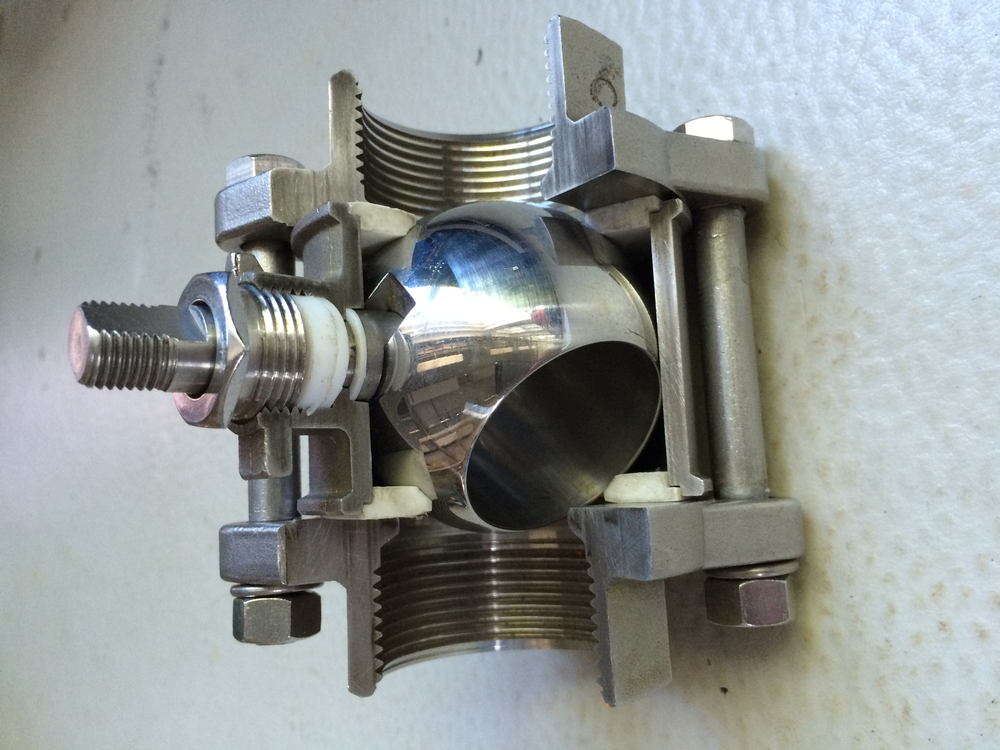
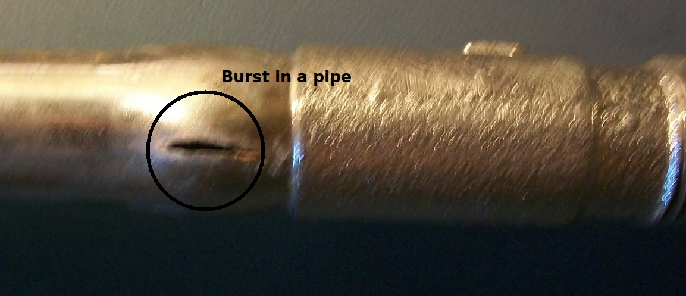
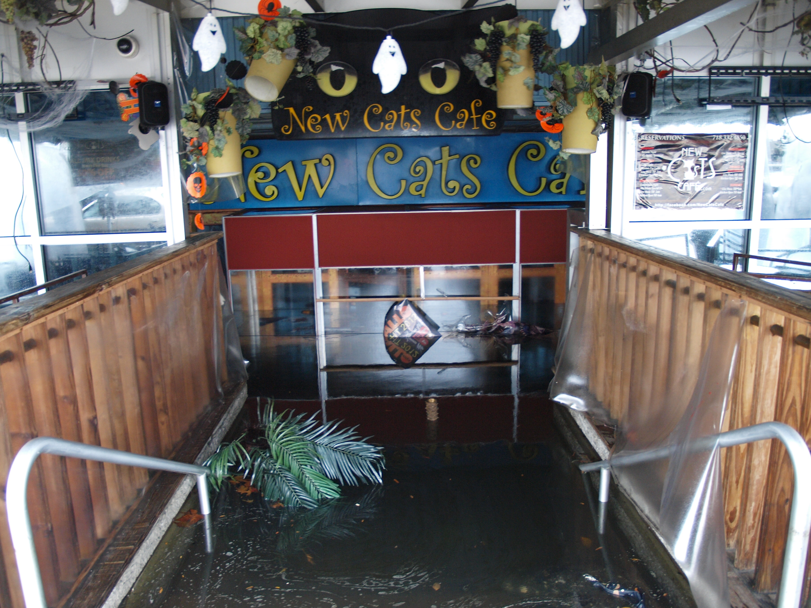
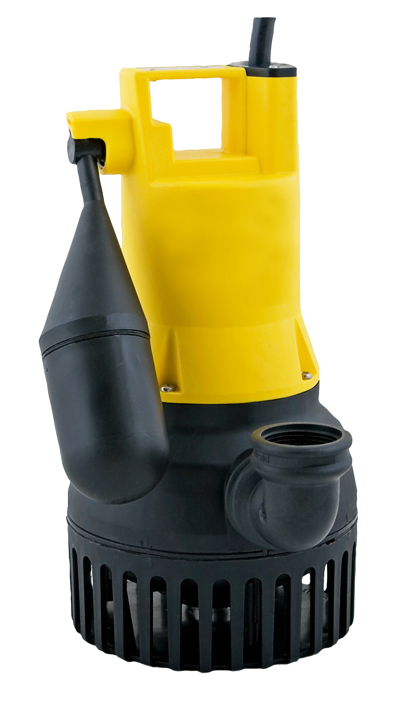

# Water, Flooding & Plumbing Emergencies

## Read this first (the 30-second version)
1. **Find your main water shutoff valve TODAY, before anything happens** — usually near where the water line enters the house (street side, a basement wall, a crawlspace, or a utility closet). Know which way turns it off (usually clockwise).
2. **Pipe burst or leaking?** Shut off the main valve **immediately**, then open the lowest faucet in the house to drain the pressure and stop the flow.
3. **Flooding with standing water and any powered outlets/appliances in it?** Do **not** step in the water. **Cut power at the breaker panel first** (only if the panel itself is dry and reachable) — see [Electrical, Gas & Utility Safety](../electrical-gas-utility-safety/electrical-gas-utility-safety.md). If you cannot safely reach the panel, stay out and call the utility.
4. **Sewage backup?** Treat all of it as contaminated with disease-causing germs. Keep kids and pets out, wear rubber boots/gloves, do not touch it bare-handed, and ventilate the area before you clean.
5. **Boil-water notice in effect?** Do not drink or brush teeth with tap water until it's lifted — see the full purification steps in the [Water guide](../water/water.md). This guide covers *why* notices happen and what to do around the house; that guide covers making water safe to drink.
6. **After any water event, you have roughly 24–48 hours to dry things out before mold starts growing.** Get air moving, pull out soaked porous materials, and don't wait.

This guide is about **household plumbing failures and flood damage inside/around your home** — the pipes, valves, sewage, standing water, drying-out, and well issues. For **finding and purifying drinking water**, see the [Water guide](../water/water.md) — it is not repeated here.

---

## Why this matters
A burst pipe can dump **6–8 gallons of water per minute** into your home — that's a flooded room in under 10 minutes and thousands of dollars of damage in an hour. Sewage backups carry bacteria, viruses, and parasites that cause serious illness through skin contact, inhalation, or ingestion. Standing floodwater hides electrical shock hazards, structural weaknesses, and contamination you cannot see. And mold — which can start colonizing wet drywall, carpet, and wood in as little as **24–48 hours** — causes long-term respiratory harm and can force you to gut a house that a fast response would have saved. Knowing your shutoffs and the correct order of operations *before* an emergency is the single biggest factor in how much damage you take.

## Key terms (plain language)
- **Main shutoff valve (main stop / curb stop)** — the valve that cuts off all water to the house at once. There are usually **two**: one inside the house (where the line enters) and one at the street/meter (the "curb stop," usually needs a special key/tool and is often the utility's property).
- **Fixture shutoff / stop valve** — a small valve under a sink, behind a toilet, or at a washing machine that shuts off water to just that one fixture, without affecting the rest of the house.
- **Water hammer** — the banging noise/pressure spike when a valve closes suddenly; can stress old pipes.
- **Gray water** — used household water (sinks, showers, laundry) without sewage; lower contamination risk but still not clean.
- **Black water / sewage** — water contaminated with human waste, toilets, or floodwater that has mixed with sewer overflow; treat as **highly infectious**.
- **Boil-water notice / advisory** — an official order from a water utility that tap water may be unsafe and must be boiled (or otherwise disinfected) before drinking, cooking, brushing teeth, or making ice.
- **Water table** — the underground level below which soil is saturated; a high water table pushes groundwater into basements/crawlspaces.
- **Sump pump** — a pump installed in a pit (sump) in the lowest part of a basement/crawlspace that automatically ejects water that collects there, keeping the space dry.
- **Backflow / sewer backup** — sewage pushed backward up through drains/toilets, usually because the main sewer line is blocked or overwhelmed (common in floods).
- **Shock chlorination** — a one-time heavy dose of chlorine used to disinfect an entire well and plumbing system after contamination.
- **Structural drying** — the deliberate use of airflow, dehumidification, and sometimes heat to remove moisture from a building's materials (not just the visible puddles) to prevent mold and rot.

---

# PART 1 — SHUTTING OFF WATER (do this first, in almost every scenario)

## 1A. Find and label your shutoffs now (before an emergency)
Do this today — it takes 15 minutes and is the highest-value thing in this guide:
1. **Main house shutoff.** Look where the water line enters the house: a basement wall, crawlspace, garage, utility closet, or right next to the water meter. It's usually a **ball valve** (a lever — quarter-turn to close) or a **gate valve** (a round wheel handle — turn clockwise repeatedly to close).
2. **Water meter / curb shutoff.** Often in a small in-ground box near the street or property line. Opening it usually needs a **meter key** or long flathead screwdriver/wrench (a "curb stop key") — consider keeping one on hand. This one may legally belong to the utility; use it only in a genuine emergency if the house valve fails.
3. **Water heater shutoff.** A valve on the **cold water inlet** pipe at the top of the tank.
4. **Fixture shutoffs.** Small valves under every sink, behind/below every toilet, and behind the washing machine. Turn each closed and back open once so you know it isn't seized.
5. **Tag or photograph** each valve location and which way closes it. Tell everyone in the household where the main valve is.

> ⚠️ If a valve is stiff or won't budge, **do not force it hard** — old gate valves can snap. Use steady, firm pressure; if it won't move, that's a reason to have a plumber service it now, before you need it in an emergency.

*Figure — cutaway of a ball valve, the lever-handle type most common as a modern house main shutoff. The ball inside has a hole through it; when the lever lines up with the pipe, the hole lines up too and water flows. A quarter-turn so the lever sits crosswise closes it, because the solid side of the ball now blocks the pipe. Source: Wikimedia Commons (File:Ball_Valve.jpg), Bitjungle, CC BY-SA 4.0.*

## 1B. How to shut off the whole house
**You need:** access to the main valve (see above); a flashlight if power is out.
1. Locate the main valve.
2. **Ball valve (lever):** turn the lever a quarter turn so it sits **crosswise** to the pipe = closed.
3. **Gate valve (wheel):** turn **clockwise** until it stops (don't overtighten).
4. Confirm it worked: open a faucet, especially the lowest one in the house — flow should slow to a trickle and stop within a minute (some water above the valve will still drain out).
5. If water keeps coming after the main is closed, the leak may be fed from a water heater, a softener, or a source **before** the main valve (rare) — shut those off too, and if it still doesn't stop, use the street/curb valve.

## 1C. How to shut off just one fixture (toilet, sink, washer, ice maker)
Use this instead of the whole-house shutoff whenever the problem is limited to one fixture — it keeps water running everywhere else in the house.
1. Find the small oval or round handle on the supply line under/behind the fixture (there may be one for hot, one for cold).
2. Turn **clockwise** until snug (quarter-turn ball-type stops, or several turns for compression-type).
3. Test by running that fixture — it should stop or slow dramatically.
4. **No working fixture shutoff, or it's seized?** Go to the whole-house main valve instead.

## 1D. Shutting off the water heater
Do this whenever you shut off the main water valve for more than a few minutes, and always if the tank itself is leaking:
1. **Turn off power to the heater first:** electric — switch off the breaker; gas — turn the gas control knob/valve to "off" or close the gas shutoff valve on the line to the heater. (Never let an electric element run in an empty/draining tank — it can burn out or start a fire.)
2. Close the **cold-water inlet valve** at the top of the tank.
3. If you need to drain the tank (leak, freeze risk, or repair), attach a hose to the **drain valve** near the bottom, run it to a floor drain or outside, open the drain valve, and open a hot-water faucet elsewhere in the house to let air in so it drains.
4. For gas water heaters, see [Electrical, Gas & Utility Safety](../electrical-gas-utility-safety/electrical-gas-utility-safety.md) before touching any gas valve if you smell gas.

---

# PART 2 — BURST AND FROZEN PIPES

## 2A. Preventing frozen pipes
Pipes freeze when the water inside drops to 32°F (0°C) or below, most often in **uninsulated crawlspaces, exterior walls, attics, and garages** during a hard freeze — a real risk during North Texas ice storms and Arctic blasts, even though it's rare most winters.

**The practical danger threshold is 20°F (-6.7°C), not 32°F.** Field research (Building Research Council, University of Illinois, cited by the Insurance Institute for Business & Home Safety) found that uninsulated residential pipes in an unconditioned space typically don't actually freeze solid until the **outdoor** temperature falls to about 20°F or below, especially if that lasts **six or more sustained hours** — brief dips just below freezing are usually not enough on their own. Treat any forecast of **20°F or colder overnight** as the trigger to start active prevention (dripping faucets, open cabinets), not just any frost warning. Burst pipes from freezing are the single leading cause of winter-weather property insurance claims in the US.
1. **Before a freeze warning:**
   - Disconnect and drain outdoor garden hoses; shut off and drain exterior hose bibs if they have an interior shutoff.
   - Open cabinet doors under sinks on exterior walls so warm house air reaches the pipes.
   - Let faucets on exterior walls **drip continuously** (cold water) during the coldest hours — moving water resists freezing, and a drip relieves pressure so a freeze is less likely to burst the pipe.
   - Keep the thermostat set to at least 55°F (13°C) even if you leave the house, and never turn heat off entirely during a hard freeze.
   - Seal obvious gaps/drafts near pipes (foundation vents, unsealed penetrations) and add pipe insulation sleeves on exposed pipes in crawlspaces/garages/attics ahead of winter.
2. **During a hard freeze:** keep interior doors open so heat circulates to bathrooms/laundry rooms/kitchens on exterior walls; keep the drip going; if you have a crawlspace, close its foundation vents for the duration of the freeze only (reopen after, to avoid trapping moisture long-term).

## 2B. Safely thawing a frozen (but not yet burst) pipe
**Signs of a frozen pipe:** a faucet that produces little or no water, sometimes with frost visible on an exposed pipe, in freezing weather.
> ⚠️ **First: shut off the main valve is NOT usually needed yet for a simple freeze** — but open the affected faucet fully first (see step 1) and have it open in case the pipe releases while thawing.
1. **Open the faucet** fed by the frozen section (both hot and cold if unsure) and leave it open. This relieves pressure and lets you see/hear water start moving as it thaws.
2. **Locate the frozen section** — usually where pipe runs along an exterior wall, crosses an unheated space, or is nearest an outside wall/vent. Follow the pipe from the fixture backward.
3. **Apply gentle heat**, working from the faucet end of the blockage back toward the coldest point (this lets melting water and steam escape forward, not pressurize a sealed section):
   - Wrap the pipe with towels soaked in hot water, and re-soak as they cool.
   - Point a hair dryer at the pipe on low/medium heat, moving it continuously.
   - Wrap with an electric heating pad or pipe-rated heat tape (follow its instructions).
   - Run a portable space heater in the room (never leave it unattended, keep it clear of flammables).
4. **Keep at it** until full water pressure/flow returns at the faucet. Could take 20 minutes to a few hours depending on how long the pipe is frozen.
5. If you cannot find or reach the frozen section, or thawing isn't working, shut off the main valve as a precaution and call a plumber — a hidden freeze inside a wall can burst without warning.

> ⚠️ **NEVER use an open flame** (blowtorch, propane torch, candle) to thaw a pipe. This is a leading cause of house fires during winter storms — it can ignite nearby wood framing or insulation, and steam trapped in a sealed pipe section can cause it to burst violently. Never leave any heat source unattended on a pipe.

*Figure — a pipe that froze and split despite being part of a valve designed to keep water out of an exterior spigot line. This is exactly the "hidden freeze inside a wall or exterior line" failure mode described in step 5 above — the break may not be visible or reachable, and can happen even where a house tried to guard against it. Source: Wikimedia Commons (File:Burst_pipe_from_freezing.jpg), Tomwsulcer, CC BY-SA 3.0.*

## 2C. A pipe has already burst — what to do, in order
1. **Shut off the main water valve immediately** (Part 1B). Every second counts — a burst pipe can flood a room in minutes.
2. **Shut off the water heater** if it's on that line or if you're unsure (Part 1D), and **cut power** to any outlets/devices in or near the spreading water — from the breaker panel, only if it is dry and safely reachable (see [Electrical, Gas & Utility Safety](../electrical-gas-utility-safety/electrical-gas-utility-safety.md)).
3. **Open the lowest faucet in the house** and any faucet near the break to drain residual pressure and let the pipe empty out faster.
4. **Contain and remove standing water**: towels, a wet/dry shop vacuum, buckets, a mop — the faster standing water is gone, the less it soaks into flooring/drywall.
5. **Move furniture, electronics, and belongings** out of the wet area immediately; put foil or wood blocks under furniture legs still standing in damp carpet.
6. **Photograph the damage** (for insurance) before you start major cleanup.
7. **Begin drying** the area (Part 6) right away — don't wait for a plumber to start airflow and water removal.
8. **Call a licensed plumber** for the permanent pipe repair. A temporary fix while you wait:
   - **Pipe repair clamp / rubber + hose-clamp patch:** wrap the leak point tightly with a thick rubber patch (bicycle inner tube, thick rubber sheet) and clamp it down with hose clamps or tightly wound wire, overlapping generously on both sides of the break. This only holds at low pressure with the main valve off — it is not a permanent fix.
   - **Epoxy putty** (plumber's epoxy putty stick): knead and press over a small crack/pinhole on a **dry** section of pipe; let cure per package instructions before restoring pressure.
   - **Push-fit slip coupling** (SharkBite-style, if you have one and the pipe size matches): cut out the damaged section cleanly with a pipe cutter or hacksaw, deburr the ends, and push the coupling on per its instructions — no soldering/gluing needed for a temporary or even semi-permanent repair on copper, PEX, or CPVC.
9. Only restore full water pressure once the repair (temporary or permanent) is holding — open the main valve slowly and watch the repair for a minute before walking away.

---

# PART 3 — SEWAGE BACKUP: RESPONSE AND CLEANUP SAFETY

Sewage backups happen when the main sewer line clogs or a municipal system is overwhelmed (common in floods) and wastewater is forced backward up through the lowest drains in the house — typically basement floor drains, basement toilets, or tubs on the lowest level.

## 3A. Immediate response
1. **Stop using all water in the house** — every flush, load of laundry, or dishwasher run adds to a system that can't drain, and can make the backup worse.
2. **Keep everyone, especially children and pets, away from the area.** Sewage carries bacteria (*E. coli*, *Salmonella*), viruses (hepatitis A, norovirus), and parasites.
3. **Ventilate**: open windows and doors to the outside, and run exhaust fans if they vent outdoors (not back into the house). Do not use a central HVAC system while sewage-contaminated air/moisture is present — it can spread contamination through the ducts.
4. **Cut power** to outlets and any equipment standing in or reachable from sewage water, from the breaker panel, only if dry and safe to reach.
5. If the backup is severe, entering the sewer line/septic system, or you smell strong sewer gas, **call a licensed plumber or septic service immediately** — a blocked main line usually needs to be cleared professionally (drain snake / hydro-jetting), and a failed septic system needs a septic technician.

## 3B. Cleanup — protect yourself first
**You need:** rubber boots, rubber or nitrile gloves (elbow-length if available), eye protection, and if available an N95/respirator mask; a garden hose or bucket of water for rinsing; a stiff brush; disinfectant (unscented household bleach or a commercial disinfectant labeled for sewage/biohazard use); heavy-duty trash bags; a wet/dry shop vacuum **only if rated for water and not simultaneously plugged into a circuit you're standing in water near**.
1. **Never** touch sewage-contaminated water or surfaces with bare skin, and don't let it near your mouth, eyes, nose, or any open cut.
2. **Remove standing sewage water** with a pump or wet/dry vac (power cut/GFCI-protected, see electrical safety guide) and dispose of it down a working drain or toilet elsewhere in the house if plumbing allows, otherwise per local guidance.
3. **Discard anything porous** that contacted sewage and can't be fully disinfected: carpet and carpet padding, upholstered furniture, mattresses, drywall that got wet, insulation, particleboard, paper goods, and most fabrics that can't be hot-washed. Porous materials trap bacteria deep inside where disinfectant can't reach.
4. **Hard, non-porous surfaces** (tile, sealed concrete, metal, plastic, sealed wood, glass): scrub with hot water and detergent to remove all visible waste, rinse, then disinfect with a bleach solution — **1 cup of unscented household bleach per gallon of water** for a heavily contaminated surface — apply, let sit 10 minutes, then rinse (or air dry for surfaces that can't be rinsed). Ventilate the whole time; never mix bleach with ammonia or other cleaners.
5. **Wash all affected fabrics/clothing** that can be salvaged in hot water with detergent, run through a hot dryer cycle, separate from unaffected laundry.
6. **Disinfect your cleanup tools** (boots, gloves' exterior, brushes) with the same bleach solution before storing/reusing.
7. **Wash hands and any exposed skin thoroughly** with soap and clean water immediately after cleanup, even though you wore gloves.
8. **Dry the area completely** afterward (Part 6) — lingering dampness after a sewage event is both a mold risk and lets odor-causing bacteria persist.

### Personal hygiene during any flood/sewage cleanup (CDC)
- **Wash hands with soap and water for at least 20 seconds** any time you've been in floodwater or sewage-contaminated water or materials — scrub the backs of hands, between fingers, and under nails. Do this before eating, drinking, smoking, or touching your face, and always after removing gloves.
- **No clean tap water available?** Use alcohol-based hand sanitizer or wipes as a stopgap, but switch to real soap-and-water handwashing as soon as you can — sanitizer alone doesn't remove organic soil/sewage as reliably as washing.
- **If your household water is under a boil-water notice or your only water source is untreated**, disinfect water for hygiene the same way as drinking water: **8 drops (about ⅛ tsp) unscented household bleach per gallon of clear water, or 16 drops per gallon if cloudy; stir and wait 30 minutes** before using it to wash hands, produce, or dishes (full method in the [Water guide](../water/water.md)).
- **Any open cut, sore, or scrape that contacted floodwater**: wash it immediately with soap and clean (or disinfected) water, then apply an antibiotic ointment and a clean bandage, and watch it for signs of infection (increasing redness, swelling, warmth, pus, fever) — seek medical care if these appear, since floodwater wounds can become infected quickly.
- **Wash all clothing worn during cleanup separately**, in hot water and detergent, before wearing it again or mixing it with unaffected laundry.

> ⚠️ Sewage cleanup is one of the few household jobs where it's reasonable to call in a professional biohazard/water-restoration company, especially for a large backup, a septic failure, or if anyone in the household is immunocompromised, elderly, an infant, or pregnant.

## 3C. Preventing repeat backups
- Do not flush wipes (even "flushable" ones), paper towels, grease, or feminine products — these are the leading causes of clogged main lines.
- Consider a **backwater valve** (a plumber-installed check valve on your main sewer line) if backups recur during heavy rain — it lets waste flow out but blocks it from flowing back in.
- Have the main line professionally snaked/inspected if backups happen more than once.

---

# PART 4 — CONTAMINATED MUNICIPAL WATER & BOIL-WATER NOTICES

## 4A. What a boil-water notice means
A **boil-water notice/advisory** is issued by your water utility (and publicized via news, text alerts, CodeRED/Nixle, or the utility's website) when the water system may be delivering water unsafe to drink without treatment — commonly because of:
- A water-main break or major repair that dropped system pressure (lets contaminants get pulled in).
- A treatment-plant malfunction or power outage at the plant.
- Flooding that overwhelmed or contaminated the treatment/distribution system.
- A positive bacteria test result in routine monitoring.

**It does NOT necessarily mean the water is currently contaminated** — it's a precaution for a period when contamination *could* have occurred. Treat it as if it is contaminated until told otherwise.

## 4B. What to do during a boil-water notice
- **Do not drink, brush teeth with, make ice with, or use tap water to wash produce/dishes/prepare food** without treating it first.
- **How to make it safe:** the full boiling and chemical-disinfection steps are in the [Water guide](../water/water.md) — the short version is **boil 1 full minute**, or use **8 drops of plain unscented bleach per gallon, wait 30 minutes**, if you can't boil.
- **Showering/bathing:** generally fine for adults with intact skin, but avoid swallowing water and keep it out of open cuts, eyes, and infants' mouths; supervise young children closely.
- **Dishwashers:** fine if the water reaches a sanitizing temperature (check your dishwasher's "sanitize" cycle/manual) or if you hand-wash and then air-dry after a bleach-water rinse; otherwise, hand-wash and disinfect as you would drinking water.
- **Pets:** give pets treated water too — the same contaminants can affect them.
- **Ice makers/refrigerator water dispensers:** stop using until the notice is lifted; discard ice made during the notice period.

## 4C. When and how a notice is lifted
The utility lifts the notice only after it **flushes the system and gets clean lab test results** (often 24–72 hours after the triggering event, sometimes longer). Wait for the **official "all clear"** from the utility/local news/emergency alert system — don't assume it's over just because the water looks or smells normal, and don't guess a timeline yourself.

**Once the all-clear is issued, do all of this before treating tap water as normal again (CDC guidance):**
1. **Flush every cold-water faucet and outside spigot** for **at least 5 minutes each**, starting with the faucet closest to where the water enters the house and working outward — this clears stagnant, possibly-contaminated water sitting in your home's own pipes since before the notice.
2. **Drain and refill your water heater** if its thermostat is set below 113°F (45°C) — lower temperatures don't reliably kill anything that got into the tank during the notice. (See Part 1D for how to shut off and drain a water heater safely.)
3. **Discard all ice** made during the notice period. For an automatic ice maker, either clean and sanitize it per the manufacturer's instructions, or simply run it and **discard the first batch or two** of ice it produces after flushing.
4. **Run water through any appliance connected to the water line** (refrigerator dispenser, coffee maker with a plumbed line, dishwasher) for a few minutes, and **replace point-of-use and point-of-entry water filter cartridges** (fridge filters, whole-house filters, pitcher filters) — the notice period is exactly when these can load up with whatever got into the system.
5. If you disinfected your own stored water with bleach during the notice, you can go back to using tap water directly once you've completed the flush above and the utility's all-clear is official.

## 4D. During and after a flood — assume contamination regardless of a formal notice
> ⚠️ During and immediately after any flood, treat **all** tap and standing water as contaminated with sewage, chemicals, and runoff, whether or not an official boil-water notice has been issued — municipal systems are frequently compromised in floods before the utility can test and announce it. Boil or use the [Water guide's](../water/water.md) methods until officials specifically confirm the system is safe.

---

# PART 5 — A FLOODED HOME: SAFE ENTRY AND PUMP-OUT

## 5A. Before you go back in / before you enter a flooded area
1. **Never enter a flooded basement/room if you can see or suspect exposed wiring, submerged outlets, or a running generator/appliance in the water** — treat all standing indoor water as potentially energized until the power is confirmed off. See [Electrical, Gas & Utility Safety](../electrical-gas-utility-safety/electrical-gas-utility-safety.md) for full detail; the short version:
   - If the breaker panel itself is **dry and accessible without stepping in water**, shut off the main breaker.
   - If reaching the panel means wading through water, **do not attempt it** — call the electric utility to cut power to the house from outside instead, and stay out until they confirm it's off.
   - Have a **licensed electrician inspect the house's wiring before you restore power**, especially if any wiring or outlets were submerged.
2. **Return during daylight if at all possible**, so you don't need to bring a flame or open light into the house. Use battery-powered flashlights and lanterns only — **never a candle, gas lantern, or torch** for light while checking a flooded or gas-uncertain house.
3. **Check for structural safety** before entering: sagging ceilings, buckled floors, cracked foundation, or a house that has shifted/settled are reasons to stay out and get a professional assessment — see [Home Structural Assessment](../home-structural-assessment/home-structural-assessment.md). **A sagging ceiling means it soaked up water and is now heavy** — it can look intact and still collapse without warning; do not walk under one, and never poke or strike it to "test" it. If a building inspector or emergency official has placed a **color-coded placard or tape** on the house (common after major floods — commonly green/usable, yellow/limited entry, red/unsafe, though colors and meaning vary by jurisdiction), do not enter or cut the tape until local authorities tell you it's safe, even if the house looks fine to you.
4. **Watch for gas odor.** If you smell gas, do not enter, do not flip any switch (including a flashlight) inside, and back away before calling it in — see the [Electrical, Gas & Utility Safety guide](../electrical-gas-utility-safety/electrical-gas-utility-safety.md).
5. **Wear rubber boots and gloves** — floodwater is assumed contaminated with sewage, chemicals, and sometimes wildlife (snakes, fire ants, rodents seeking dry ground).
6. **Watch your footing.** Floodwater hides holes, open drains, sharp debris, and can be deeper/faster-moving than it looks. Use a stick or pole to check depth ahead of you if water is still present outdoors.

*Figure — a flooded building interior during Hurricane Sandy's storm surge, Emmons Avenue, Brooklyn NY. This is the kind of standing indoor water this section addresses: assume it's contaminated and possibly energized until you've confirmed power is off, and don't enter until structural and electrical safety are confirmed. Source: Wikimedia Commons (File:Hurricane_Sandy_Effects_-_Emmons_Avenue_Brooklyn3.JPG), Vicpeters, CC BY-SA 3.0.*

## 5B. Pump-out order — do NOT pump a flooded basement out all at once
If floodwater surrounds your house and the ground/water table outside is still saturated or higher than your basement floor, **pumping a full basement dry too fast can crack the walls or floor** — the pressure of saturated soil outside pushing in is no longer balanced by water pressure inside, and foundation walls (especially block/poured concrete) can buckle or crack.
1. **Wait until the outside floodwater has receded below the level of the water inside**, if it hasn't already, before starting a full pump-out.
2. **Pump out only about one-third of the depth per day** (a common contractor rule of thumb), then reassess — this lets the pressure equalize gradually and lets waterlogged soil/walls adjust.
3. Watch the walls and floor for new cracks, bowing, or water actively seeping back in faster than expected — if you see any, stop pumping and call a foundation/structural professional.
4. Once water is down to a few inches, switch to a wet/dry shop vacuum or mop for the remainder, and start structural drying (Part 6) as soon as the bulk of the water is out.

## 5C. Equipment for pump-out
- **Submersible sump/utility pump** — sits in the water, pushes it out through a hose to a safe discharge point (away from the foundation, downhill, not back toward a neighbor's property or a storm drain if prohibited locally).
- **Wet/dry shop vacuum** — for shallow residual water and tight spots a pump can't reach.
- **Gas-powered trash pump** — higher capacity for large volumes; **never run a gas engine indoors or in an attached garage** — carbon monoxide is lethal; run it outside with the hose run in. **Keep it at least 20 feet (about 6 m) from the house, and away from doors, windows, and vents** — CDC guidance is that opening doors/windows or running fans does **not** prevent dangerous carbon monoxide buildup from an engine running near the house; distance is what protects you, not ventilation.
- **Manual bucket relay** — always available as a backup with zero equipment needs, just slower.

---

# PART 6 — SUMP PUMPS AND DRAINAGE

## 6A. How a sump pump works and basic care
A sump pump sits in a **sump pit** (a hole dug into the lowest point of a basement/crawlspace floor) and automatically switches on via a **float switch** when water rises to a set level, pumping it out through a discharge pipe that exits away from the foundation.

*Figure — a submersible pump of the type used in a sump pit or as a portable pump-out pump: it sits fully in the water, draws it in through the bottom/sides, and pushes it out through the discharge fitting at top. Source: Wikimedia Commons (File:Submersible_pump.png), PumpExpert, CC BY-SA 4.0.*
- **Test it** twice a year: pour a few gallons of water into the pit and confirm the pump kicks on, moves water out, and shuts off.
- **Keep the discharge pipe clear** and pointed well away from the foundation (at least 10–20 feet, or to a storm drain/dry well per local code) so pumped water doesn't just seep back in.
- **Battery-backup or water-powered backup sump pump** is strongly recommended — primary sump pumps are electric and fail in the exact power outages that come with major storms/floods. A backup keeps working when you need it most.
- **Clean debris** out of the pit periodically so the float switch isn't jammed.

## 6B. If you don't have a sump pump during a flood
- A **portable submersible utility pump** (Part 5C) placed in the lowest point can do the same job temporarily, run off a generator if the power is out — never run the generator indoors (carbon monoxide risk).
- Improve **surface drainage** around the house: clear gutters and downspouts, extend downspouts to carry water at least 6–10 feet from the foundation, and grade soil so it slopes away from the house.

## 6C. Preventing future water intrusion
- Seal visible foundation cracks once dry (hydraulic cement for active small leaks, professional waterproofing for larger/recurring ones).
- Make sure the ground slopes **away** from the foundation on all sides.
- Consider a French drain (a gravel-filled trench with a perforated pipe) around a chronically wet foundation — this is a bigger project best done with or by a professional; see [Recovery & Rebuilding](../recovery-rebuilding/recovery-rebuilding.md) for the longer-term rebuild/mitigation arc.

---

# PART 7 — DRYING OUT A STRUCTURE (THE MOLD-PREVENTION WINDOW)

## 7A. Why speed matters
Mold spores are everywhere in ordinary air and only need moisture and time to start growing on wet organic material (drywall paper, wood, carpet backing, dust). Under typical indoor conditions, visible mold growth can begin in **as little as 24–48 hours** on wet porous material. **Everything in this section should start the same day water is removed — don't wait for a professional if you can start yourself.**

## 7B. Step-by-step drying
1. **Remove standing water first** (Part 5), then **remove soaked porous materials you're not trying to save**: wet carpet padding (almost never salvageable), ruined drywall below the flood line, waterlogged insulation. Removing these eliminates most of the moisture load in one step. See "salvage vs. discard," Part 8.
2. **Increase airflow:** open windows if outdoor humidity is lower than indoor (skip this on humid North Texas summer days — outdoor humid air can add moisture instead of removing it). Point box fans/floor fans across wet surfaces, not just into the room — aim for air moving parallel to walls/floors so it sweeps moisture off the surface.
3. **Run dehumidifiers** in the affected space, doors and windows mostly closed (dehumidifiers work by re-processing the room's own air — open windows in humid weather work against them). Empty the collection tank or run a continuous drain hose to a sink/drain. A single small consumer dehumidifier struggles in a large flooded area — professional restoration companies use much larger units; rent one if you can.
4. **Run the HVAC system's fan** (not necessarily heat/cool) to keep air circulating through the house, **unless** sewage contamination is present (see Part 3A) or ducts themselves got wet, in which case leave it off until inspected.
5. **Pull up wet carpet and prop it, and pad separately, to dry** if you intend to try to save it (only realistic for clean water, within the first 24–48 hours; sewage-contaminated or already-smelly carpet should be discarded, Part 8).
6. **Open wall cavities that got wet:** drywall that was submerged should be cut out at least a foot above the visible water line (contractors' "flood cut") so the wet insulation and framing behind it can dry and be inspected — wet, closed-up walls are exactly where hidden mold takes hold.
7. **Move furniture and belongings** to a dry area, elevated off wet floors, and separate wet items so air reaches all sides.
8. **Monitor with a simple hygrometer** if you have one — aim to get indoor relative humidity **below 50%**. Keep drying continuously (don't turn fans/dehumidifiers off overnight) until materials read dry to the touch and humidity holds low for at least a day.

## 7C. Realistic timelines
- **Small clean-water leak, caught fast, good airflow:** 1–3 days to fully dry.
- **Larger area, humid climate, or slower response:** 3–7 days with fans + dehumidifiers running continuously.
- **Wall cavities, subfloor, and structural wood:** can take 1–2+ weeks even after surfaces feel dry — this is why professional restoration companies use moisture meters to confirm materials are dry all the way through, not just on the surface.
- If materials are still damp after about a week of active drying, or you smell a musty odor, suspect mold has already started — see Part 7D and [Recovery & Rebuilding](../recovery-rebuilding/recovery-rebuilding.md) for remediation depth.

## 7D. If mold has already started
Small areas (a few square feet) of surface mold on hard, non-porous surfaces can sometimes be cleaned by a household member with gloves, eye protection, and an N95 mask, using detergent and water or a mold-specific cleaner, in a well-ventilated area. **Porous materials with mold growth (drywall, carpet, insulation, ceiling tile) should be removed and discarded, not just wiped down** — mold roots into the material. Large areas (commonly cited threshold: more than about **10 square feet**), mold in HVAC ductwork, or mold affecting anyone with asthma/allergies/immune conditions should go to a professional remediation contractor. Full remediation depth and the recovery timeline are covered in [Recovery & Rebuilding](../recovery-rebuilding/recovery-rebuilding.md).

---

# PART 8 — SALVAGING VS. DISCARDING BELONGINGS

| Item type | Clean water (burst pipe, rain) | Sewage/black water or standing >48 hrs |
|---|---|---|
| Hard nonporous (glass, metal, solid plastic, sealed wood/tile) | Clean, disinfect, dry — keep | Clean, disinfect thoroughly, dry — keep |
| Clothing, bedding, most fabrics | Hot wash + hot dry — keep | Hot wash + hot dry if not visibly soiled/torn; discard if heavily contaminated |
| Carpet (no pad, dried within 24–48 hrs) | Often salvageable — professional cleaning recommended | Discard |
| Carpet padding | Discard (almost always — cheap, absorbs and holds contamination, dries poorly) | Discard |
| Drywall, ceiling tile, insulation that got wet | Discard the wet section (flood-cut above water line) | Discard |
| Upholstered furniture, mattresses | Often not salvageable if soaked through; professional cleaning may save lightly-affected items caught fast | Discard |
| Wood furniture (solid) | Often salvageable — dry slowly, out of direct sun/heat, refinish later | Clean, disinfect, dry — evaluate case by case |
| Paper documents, photos | Freeze (in a freezer) to stop mold/warping, deal with later; or air-dry in small batches | Same, but disinfect surfaces around them; the documents themselves usually aren't a contamination risk to handle briefly |
| Electronics | Do not power on until fully dry and inspected — often a total loss if submerged | Same, plus disinfect the case exterior before handling |
| Food, medicine that contacted floodwater | Discard anything not in a sealed, undamaged waterproof container | Discard |

**General rule:** when in doubt about anything that contacted sewage or was submerged more than 48 hours, discard it — the cost of replacing a rug is far less than the cost of chronic mold exposure or infection. Photograph everything before discarding for insurance purposes.

---

# PART 9 — PRIVATE WELLS AFTER FLOODING

Flooding can push contaminated surface water down into a well, through the wellhead seal, a cracked casing, or a submerged pump.

## 9A. If your well was flooded or is near floodwater
1. **Do not drink or use the water** for anything (drinking, cooking, brushing teeth, making ice, watering a garden you'll eat from) until it's tested and/or disinfected.
2. **Do not turn on the well pump** while it or the wellhead is still underwater — an electrical pump submerged in floodwater is both a shock hazard and can be damaged further by running it. Wait until the water has receded below the wellhead and, ideally, have an electrician or well contractor check the pump and wiring before restarting it.
3. Once the pump can safely run, **pump the well to waste** (run water out an outdoor spigot, away from the house, not into your plumbing) for a while to clear turbid/flood-affected water before testing.
4. **Get the water tested** by a local health department or certified lab once the situation has stabilized — a well should always be tested after any flooding, even if it looks and smells fine, because contamination is often invisible.

## 9B. Shock chlorination — disinfecting a well (step by step, with real numbers)
Shock chlorination is a standard, well-established method (used by state health departments, agricultural extension services, and the EPA/CDC) to disinfect an entire well and household plumbing system after flooding, a positive bacteria test, or any known contamination.

> ⚠️ **If the wellhead itself was flooded or submerged**, most state health departments (including Texas's) recommend hiring a **licensed well driller or pump installer** to shock-chlorinate it, both because reaching the casing safely can require special tools and because a submerged pump/wiring needs professional inspection first (Part 9A). The steps below are for when you're doing it yourself on a well that's accessible and the pump/wiring have already been confirmed safe.

**You need:** plain **unscented liquid household chlorine bleach, 5%–8.25% sodium hypochlorite** (nothing scented or "splash-less"), a clean 5-gallon bucket, rubber gloves, eye protection, and a garden hose.

1. **Turn off power to the well pump** before opening the well. Clear debris from around the wellhead, then remove the well cap/cover.
2. **Figure out how much bleach you need.** This depends on the well's **diameter** and the **depth of water in it** (total well depth minus the static water level — the depth to the water's surface; if you don't know the static level, use the total well depth as a conservative stand-in). The goal is approximately **200 ppm chlorine concentration** in the well. Use this table (from state extension/health department guidance) for plain 5%–8.25% liquid bleach:

   | Water depth in well | 4" diameter | 6" diameter | 8" diameter |
   |---|---|---|---|
   | 10 ft | 3 pt (1.5 qt) | 3.5 pt | 2 qt |
   | 20 ft | 3.5 pt | 4 pt (2 qt) | 2.5 qt |
   | 50 ft | 2 qt | 2.5 qt | 3.5 qt |
   | 100 ft | 2.5 qt | 4 qt (1 gal) | 5.5 qt |
   | 200 ft | 3.5 qt | 1.5 gal | 2.5 gal |

   As a rough rule of thumb if you can't measure precisely: **most residential wells need somewhere between 1 and 3 gallons of standard household bleach** — a widely-used simpler figure is **about 3 pints of bleach per 100 gallons of water the well holds**. When in doubt, use your state or county extension office's specific calculator/table (Texas: Texas A&M AgriLife Extension or TCEQ's well-disinfection guide) rather than guessing — too little won't disinfect fully, and bleach is cheap enough that it's not worth under-dosing.
3. **Mix the bleach** into about 10 gallons of fresh water in a clean bucket (dilute it — don't pour concentrated bleach straight down the well).
4. **Pour the diluted solution down the well casing.**
5. **Circulate it**: connect a garden hose to the outdoor faucet closest to the well, turn the pump back on, and run the hose water back into the top of the well for about **15 minutes**, washing down the inside of the casing as you go. This mixes the chlorine solution through the whole depth of the well, not just the top.
6. **Turn on every faucet and outlet in the house, one at a time — inside and outside**, including hose bibs, the washing machine, any water softener/filter bypass, and ice maker, until you smell chlorine at each one, then shut it off. Flush every toilet too. This disinfects the entire plumbing system, not just the well itself.
7. **Turn off the pump, replace the well cap securely**, and **let the chlorinated water sit in the well and plumbing for 12–24 hours** without using any water. (Fill a few containers with regular tap water beforehand for drinking/handwashing during this wait, and disinfect that water per the [Water guide](../water/water.md) if you're not sure it's safe.)
8. **Flush the system**: run **outdoor spigots first**, directing the chlorinated water onto gravel, a driveway, or bare ground rather than a lawn or garden bed (heavy chlorine can kill grass and plants), until the chlorine smell is gone. Then run indoor faucets one at a time until the water runs clear and odor-free. **Draining and refilling the water heater** at this point helps clear residual chlorine from it faster.
9. **Re-test the water** for total coliform and E. coli/fecal coliform bacteria. Most guidance recommends waiting **1–2 weeks (commonly 7–14 days)** after flushing before sampling, so any chlorine residue doesn't mask a positive result — check with your test lab for their specific timing. **Boil or use the [Water guide's](../water/water.md) methods for anything you drink until you have a clear test result.**

> ⚠️ Do not run flushed, heavily chlorinated water into a septic system's drain field all at once — it can kill the beneficial bacteria the septic system depends on. Flush outdoors first and spread indoor flushing out where you can.

## 9C. Ongoing well protection
- Make sure the well cap/casing seals well above expected flood levels and is intact — a cracked or poorly sealed cap is the most common way floodwater gets in.
- Keep the wellhead area graded so surface water drains away from it, not toward it.
- After any flood near the well, re-test before resuming normal use even if you didn't shock-chlorinate, since floodwater contamination isn't always obvious.

---

## North Texas / regional notes (Anna, TX / Collin County)
- **Flash flooding** is the dominant regional risk — blackland prairie clay soil sheds rain fast rather than absorbing it, so low-lying roads, culverts, and properties near creeks (East Fork Trinity tributaries, Slayter Creek, Throckmorton Creek) can flood within an hour of heavy rain, even with no warning at your own house. Know your property's low points before a storm.
- **Winter ice storms** are the region's main frozen-pipe risk — they're infrequent but severe (see the February 2021 Texas freeze), often paired with **power outages that also kill heat**, which is the worst combination for frozen pipes. Keep a battery-powered or hand-crank flashlight, and consider a battery-backup sump pump given how often outages and heavy rain coincide here.
- **Clay/expansive soil** means foundations here are more prone to movement from both drought (soil shrinks, cracks form) and sudden saturation (soil swells) — after any significant flood or long drought-to-rain swing, watch for new foundation cracks or doors/windows that stick, and see [Home Structural Assessment](../home-structural-assessment/home-structural-assessment.md).
- **Rural properties** in Collin County commonly rely on **private wells and septic systems** — know your well's location, diameter, and depth (see Part 9B's table) ahead of time, keep the shock-chlorination contact info for your county extension office (Texas A&M AgriLife Extension serves Collin County) on hand, and have your septic tank pumped/inspected on the schedule your system requires, since backups here often mean septic failure rather than a municipal sewer clog. The Texas Commission on Environmental Quality's well-disinfection guide (`reference/manuals/tceq_gi432_disinfecting_your_private_well.pdf`) is the state-specific reference for shock chlorination in Texas.
- **Anna's municipal water customers** should watch the city's official notification channels (CodeRED, city website/social media) for boil-water notices, which are most likely to follow a water-main break, a hard freeze causing multiple breaks at once, or regional flooding affecting the water system.

---

# ⚠️ Safety — the most important warnings
- **Standing water + electricity can kill.** Never enter floodwater if you cannot confirm the power is off, and never reach a breaker panel by wading through water to get to it — call the utility instead. Full detail: [Electrical, Gas & Utility Safety](../electrical-gas-utility-safety/electrical-gas-utility-safety.md).
- **Never use an open flame to thaw a pipe.** Use hot towels, a hair dryer, heat tape, or a space heater instead — never leave any heat source unattended.
- **Never run a gasoline pump or generator indoors or in an attached garage.** Carbon monoxide is invisible, odorless, and lethal within minutes at high concentrations.
- **Treat all sewage and floodwater as contaminated.** Wear gloves and boots, never touch it bare-handed, keep children and pets away, and disinfect everything it touched.
- **Don't pump a flooded basement dry all at once** if the ground outside is still saturated — pump roughly a third of the depth per day to avoid cracking walls/floor.
- **Don't drink tap water during a boil-water notice, or any water during/after a flood, without treating it** — see the [Water guide](../water/water.md) for the actual purification steps.
- **You have about 24–48 hours before mold starts.** Start airflow and remove ruined porous materials the same day, don't wait for a contractor to begin.
- **Discard anything porous that touched sewage** — it cannot be fully disinfected once contaminated germs are inside the material.
- **Never mix bleach with ammonia or other cleaning chemicals** — it produces toxic gas. Always ventilate when using bleach indoors.
- **Don't drink well water after a flood without testing/shock chlorination**, even if it looks, smells, and tastes normal.

# Troubleshooting
| Problem | Fix |
|---|---|
| Can't find the main shutoff valve | Check where the water line enters (basement wall, crawlspace, utility closet, near the meter); if truly unfindable, use the street/curb valve with a meter key, or call the utility/a plumber. |
| Main valve is stuck/won't turn | Don't force it hard — try the water heater and fixture shutoffs to isolate the leak; call a plumber to service the seized valve once safe. |
| Pipe still frozen after an hour of thawing | Keep at it with steady gentle heat from the faucet end backward; if you can't find/reach the frozen section, shut off the main valve as a precaution and call a plumber. |
| Water keeps flowing after main valve is closed | Check the water heater and any softener/filter shutoffs; some water above the valve will still drain briefly — that's normal and should stop within a minute or two. |
| Sump pump isn't turning on | Check power/breaker, check the float switch isn't jammed by debris, test by pouring water into the pit; if the pump has failed, use a portable utility pump temporarily. |
| Basement walls cracking or bowing during pump-out | Stop pumping immediately, let pressure equalize, call a structural/foundation professional. |
| Musty smell after drying looked complete | Suspect hidden moisture in wall cavities/subfloor or early mold — check with a moisture meter if available, open the wall cavity further, and see [Recovery & Rebuilding](../recovery-rebuilding/recovery-rebuilding.md). |
| Not sure if tap water is safe after a boil-water notice | Wait for the utility's official all-clear; don't guess based on smell/taste; keep boiling/treating until confirmed. |
| Well water available but flooded recently | Don't drink it; pump to waste, get it tested, shock-chlorinate if contaminated, retest before resuming normal use. |
| Sewage backup and no plumber reachable | Stop using all water in the house immediately to avoid worsening it, ventilate, keep people/pets out, and clean up hard surfaces per Part 3B while you wait. |

# Quick-reference checklist
- [ ] Located and labeled the main water shutoff, water heater shutoff, and every fixture shutoff — before an emergency.
- [ ] For a burst/frozen pipe: shut off main valve → drain lowest faucet → cut power near water if needed → contain water → temporary patch → call plumber.
- [ ] For a frozen pipe: opened the faucet, applied gentle heat from the faucet end backward, never used an open flame.
- [ ] For sewage backup: stopped using household water, kept people/pets out, ventilated, wore gloves/boots, disinfected hard surfaces, discarded contaminated porous items.
- [ ] For a boil-water notice: treated all tap water before drinking/cooking/brushing teeth (see [Water guide](../water/water.md)), waited for the official all-clear.
- [ ] For a flooded home: confirmed power was safely off before entering, checked for structural/gas hazards, pumped out gradually (not all at once) if ground outside was saturated.
- [ ] Started structural drying (fans, dehumidifiers) the same day water was removed — within the 24–48 hour mold window.
- [ ] Sorted belongings into salvage vs. discard, photographed everything for insurance before discarding.
- [ ] If on a private well and it was flooded: didn't drink it, didn't run the pump while submerged, tested and/or shock-chlorinated before resuming use.

# Sources & further reading (in this knowledge base)
- **American Red Cross Preparedness Guide** — `reference/manuals/redcross_preparednessguide.pdf` (home water shutoffs, flood response, water storage/safety).
- **FEMA "Are You Ready?" Guide** — `reference/manuals/are-you-ready-guide.pdf` (flood preparedness, utility shutoffs, disaster response).
- **FEMA P-234, "Repairing Your Flooded Home"** — `reference/manuals/fema_p234_repairing_your_flooded_home.pdf` (pump-out order, structural drying, electrical/gas safety on reentry, salvage-vs-discard, mold prevention — the fullest single source behind Parts 5–8 of this guide).
- **CDC Emergency Preparedness Foundations** — `reference/manuals/cdc_emergency_foundations.pdf` (boil-water guidance, sewage/floodwater health hazards, mold health effects).
- **CDC "Reentering Your Flooded Home" and "Prevent Carbon Monoxide Poisoning"** (cdc.gov/floods, cdc.gov/natural-disasters) — electrical/structural/gas safety on reentry, generator placement distance, verified against Part 5.
- **CDC "Boil Water Advisory" guidance and "Personal Hygiene After a Disaster"** (cdc.gov/natural-disasters, cdc.gov/water-emergency) — boiling/bleach dosing, post-advisory flushing steps, handwashing and hygiene-water guidance, verified against Parts 3 and 4.
- **TCEQ GI-432, "Disinfecting Your Private Well"** — `reference/manuals/tceq_gi432_disinfecting_your_private_well.pdf` (Texas-specific shock chlorination guidance, verified against Part 9B's bleach-dosage table).
- **US Army Survival Manual FM 21-76** — `reference/manuals/fm21-76_survival_manual.pdf` (general emergency water/sanitation background).
- See also: [Finding Water and Making It Safe to Drink](../water/water.md) (drinking-water purification — not duplicated here), [Electrical, Gas & Utility Safety](../electrical-gas-utility-safety/electrical-gas-utility-safety.md) (power/gas hazards in floods), [Structural & Utility Emergencies](../structural-utility-emergencies/structural-utility-emergencies.md) (general utility shutoff hub), [Home Structural Assessment](../home-structural-assessment/home-structural-assessment.md) (post-flood structural checks), [Recovery & Rebuilding](../recovery-rebuilding/recovery-rebuilding.md) (mold remediation depth, long-term rebuild), [Disaster-Specific Guidance](../disaster-specific/disaster-specific.md) (flood disaster timeline).
