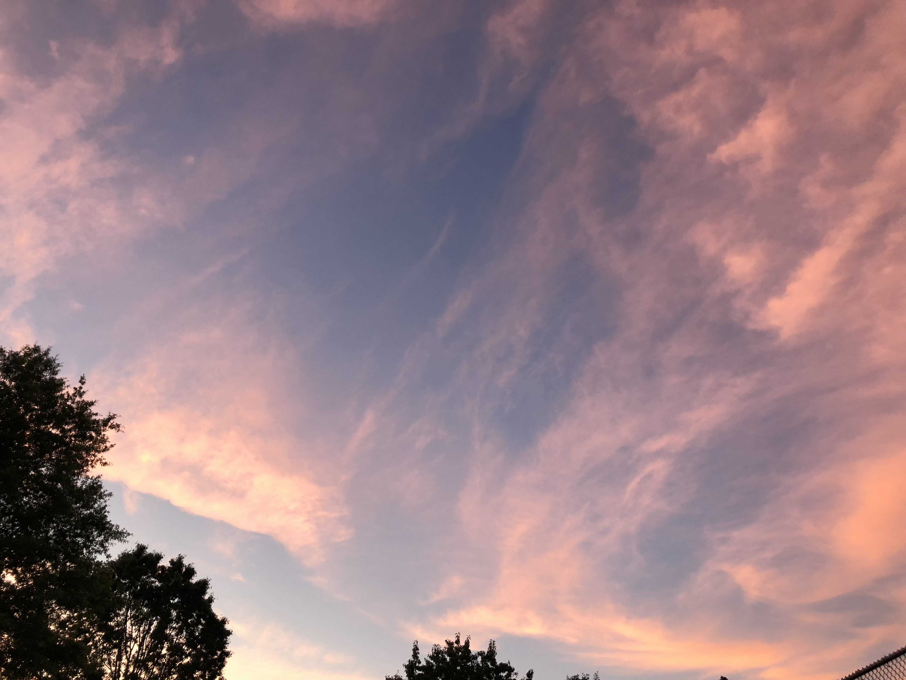
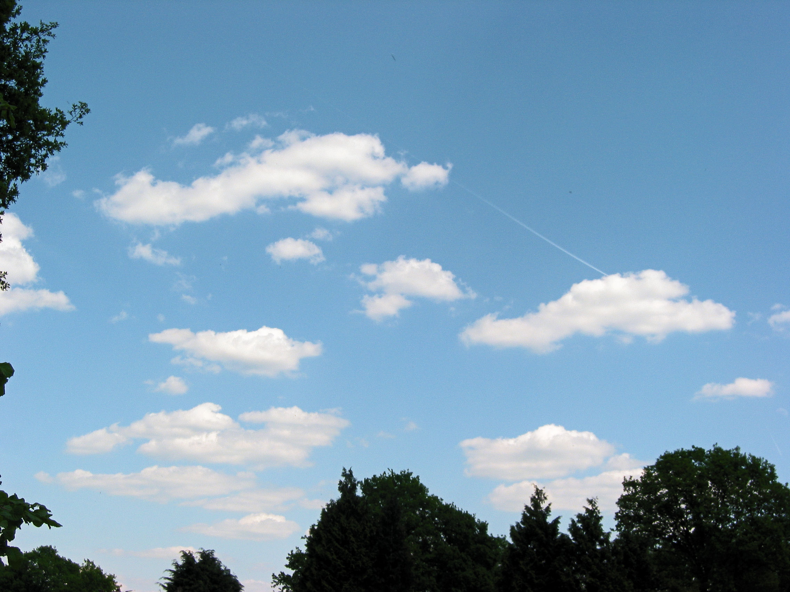
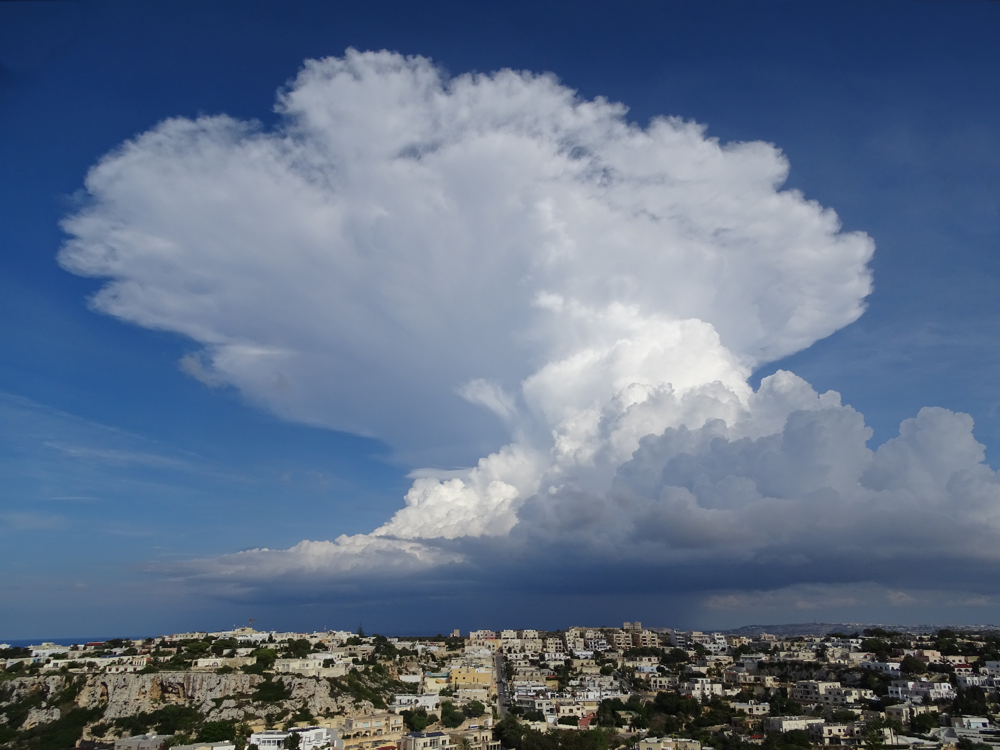
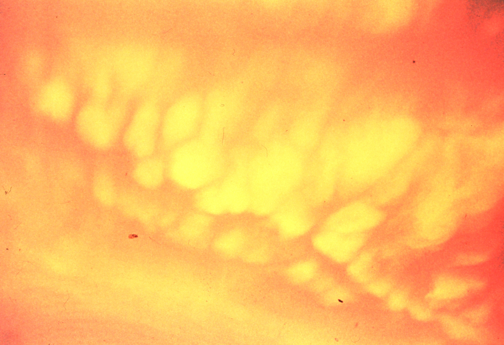
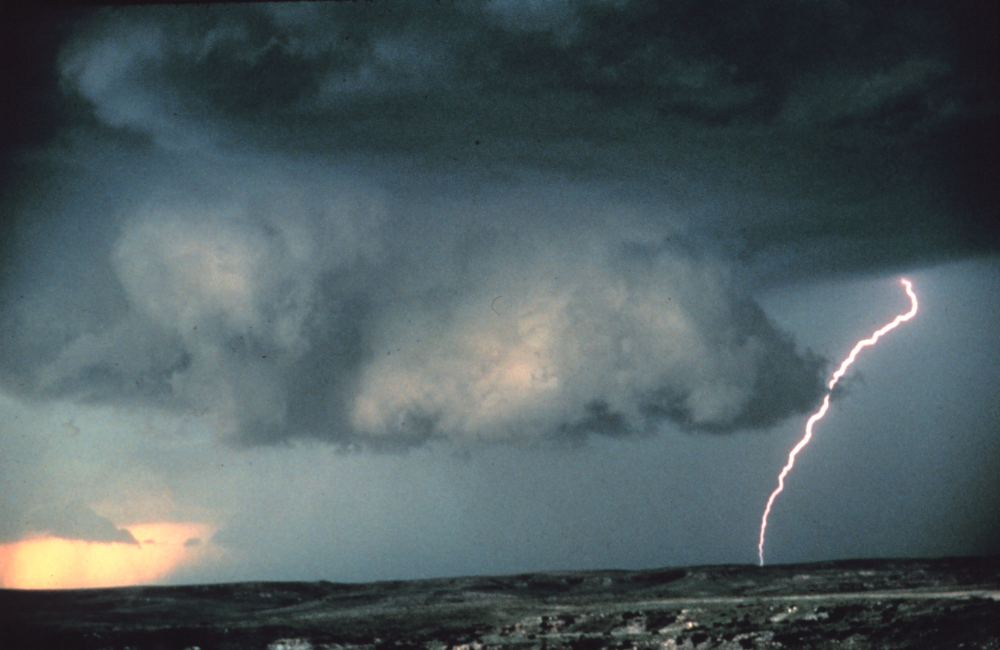

## Read this first

You do not need a phone, a radio, or the internet to know a storm is coming.
Every thunderstorm, cold front, and tornado announces itself hours in advance
through the sky, the wind, and the air pressure around you. Humans read these
signs for thousands of years before satellites existed, and sailors, farmers,
and soldiers still rely on them today when equipment fails.

This guide teaches you to look up and read the sky like a gauge. It will not
make you a meteorologist, and it cannot replace a weather radio or official
warning when one is available — **always prioritize official alerts if you
have any way to receive them.** But when you have nothing else, these signs
give you real, actionable lead time: enough to get livestock in, finish a
river crossing before it floods, pick a campsite, or get your family into a
tornado shelter before the sky turns green.

Read this in daylight, outdoors, looking at real clouds. The words on this
page are only useful once you have matched them to what is over your head.

## Why this matters

Weather kills people who are caught unprepared — not people who saw it
coming. In a grid-down or off-grid situation, your decisions about **shelter,
travel, and work** all depend on knowing what the sky will do in the next
hour, the next six hours, and the next day:

- **Shelter timing** — do you have time to finish the lean-to, or do you need
  to get under something solid right now because a cumulonimbus tower is
  building fast?
- **Travel decisions** — do you cross the creek now, or wait, because a wall
  of dark cloud upstream means a flash flood is likely even under clear sky
  where you stand?
- **Severe-weather survival** — recognizing a tornado-producing storm 20–40
  minutes before it arrives, instead of when you hear the roar, is the
  difference between reaching shelter and being caught in the open.
- **Resource protection** — knowing a hard freeze or hailstorm is coming lets
  you protect a garden, water lines, or animals hours ahead of time.

Instrument-free forecasting will not tell you exact rainfall totals. It tells
you **trend and urgency** — is it getting better or worse, and how fast — which
is exactly the information you need to make a safe decision.

## Key terms

- **Front** — the leading edge of a large air mass; a boundary where warm and
  cold air meet. Crossing fronts is what causes most weather changes.
- **Cold front** — cold, dense air pushing under warm air, forcing it up
  quickly. Produces sharp temperature drops, gusty wind shifts, and often a
  line of thunderstorms.
- **Warm front** — warm air overriding cold air, sliding up gradually.
  Produces the slow, layered cloud sequence (cirrus → cirrostratus →
  altostratus → nimbostratus) over 12–36 hours, ending in steady rain.
- **Barometric pressure** — the weight of the air above you. Falling pressure
  = air rising = clouds and storms forming. Rising pressure = air sinking =
  clearing skies.
- **Backing wind** — wind shifting counter-clockwise (e.g., S → SE → E).
  Usually signals an approaching low-pressure system and worsening weather.
- **Veering wind** — wind shifting clockwise (e.g., S → SW → W → NW). Usually
  signals a front has passed and weather is improving.
- **Wall cloud** — a lowered, rotating cloud base beneath a thunderstorm,
  often the visual sign of a developing tornado.
- **Mammatus clouds** — pouch-like, hanging cloud formations, usually seen on
  the underside of an anvil after a severe thunderstorm has already formed;
  a marker of a strong, mature severe storm.
- **Supercell** — a thunderstorm with a persistent rotating updraft
  (mesocyclone); the storm type responsible for most strong/violent tornadoes
  and large hail.
- **Dew point** — the temperature at which air becomes saturated and
  moisture condenses. A close dew point/temperature spread (humid, muggy air)
  fuels stronger thunderstorms.

## What you need

Nothing is required — your eyes, ears, nose, and skin are the instruments.
That said, a few cheap or improvised tools sharpen your accuracy:

- A notebook and pencil to log daily observations (cloud types, wind
  direction, pressure trend, what happened next) — pattern recognition
  improves fast with a written log.
- A compass, or the sun/stars, to know true wind direction (see
  `../navigation/navigation.md`).
- A simple improvised barometer (build instructions below) — a glass jar,
  a balloon, a straw, and glue.
- Something to catch smoke (a small fire) or watch grass/dust for wind
  behavior.
- A working watch or any way to count seconds (your own steady counting
  works) for the lightning-to-thunder distance method.

## Reading the clouds

Clouds are the most reliable and earliest sign of change because they show
you what is happening in the atmosphere hours before it reaches you at
ground level. Learn to identify cloud **family** (height) and **shape**
first; the combination tells the story.

```
CLOUD-HEIGHT LADDER (approximate base height, temperate latitudes)
Caption: The higher and thinner the cloud, the further out the system is.
Watch clouds move from high-and-thin toward low-and-thick over hours = a
front is approaching. Towering clouds that build FAST (in under an hour)
mean a thunderstorm, not a slow-moving front.

  20,000-40,000 ft  |  CIRRUS (Ci)          wispy, hair-like streaks
  HIGH CLOUDS       |  CIRROSTRATUS (Cs)    thin veil, halo around sun/moon
                    |  CIRROCUMULUS (Cc)    small white ripples ("mackerel sky")
                    |
   6,500-20,000 ft  |  ALTOSTRATUS (As)     gray/blue sheet, sun looks dim
  MID CLOUDS        |  ALTOCUMULUS (Ac)     white/gray patches, "sheep" rows
                    |
   0-6,500 ft       |  STRATUS (St)         flat gray layer, drizzle, fog-like
  LOW CLOUDS        |  STRATOCUMULUS (Sc)   lumpy gray patches, low ceiling
                    |  NIMBOSTRATUS (Ns)    thick dark gray, steady rain
                    |
  VERTICAL          |  CUMULUS (Cu)         puffy white, flat base, fair weather
  (base low,        |  CUMULONIMBUS (Cb)    towering, anvil top, THUNDERSTORM
   top very high)   |  (with wall cloud / mammatus underneath = SEVERE)
```

### Cirrus clouds — the 12-to-36-hour warning

Thin, wispy, feather-like streaks high in the sky (20,000+ ft), often called
"mare's tails." On their own, cirrus just means high-altitude moisture and
strong upper winds. But when cirrus **thickens and lowers over several
hours**, turning into a milky veil (cirrostratus) that fades the sun's edges
and eventually produces a halo, you are watching the leading edge of a warm
front. Expect steady rain within 12–36 hours. This is the classic "mare's
tails and mackerel scales make tall ships carry low sails" rhyme — both
patterns mean wind and rain are coming.


*Figure — cirrus clouds: high, thin, hair-like ice-crystal streaks ("mare's
tails"). Signals high-altitude moisture and strong upper winds; if they
thicken and lower over the next 12–36 hours, a warm front with steady rain
is on the way. Source: Wikimedia Commons (File:2020-06-09 05 30 05 Cirrus
clouds near sunrise along Franklin Farm Road in the Franklin Farm section of
Oak Hill, Fairfax County, Virginia.jpg), author Famartin, CC-BY-SA 4.0.*

### Cumulus vs. cumulonimbus — hours vs. minutes

**Fair-weather cumulus**: puffy, cotton-ball clouds with flat, well-defined
bottoms, roughly as wide as they are tall, drifting lazily, shrinking in the
evening. These mean a stable, fair day.


*Figure — fair-weather cumulus: puffy, cotton-ball clouds, flat well-defined
bottoms, wider than tall. Signals a stable, fair day as long as they stay
this shape and size. Source: Wikimedia Commons (File:Cumulus humilis.jpg),
author Rasbak, CC-BY-SA 3.0.*

**Towering cumulus building into cumulonimbus**: watch a cumulus cloud that
starts stacking vertically, developing a hard, cauliflower-like texture, and
growing dark at the base. If it visibly grows taller while you watch over
15–30 minutes, it is becoming a thunderstorm cell. Once the top flattens out
sideways into an anvil shape (ice crystals spreading downwind at the
tropopause), you have a mature thunderstorm capable of lightning, heavy
rain, hail, and — if rotating — a tornado.


*Figure — cumulonimbus: a towering thunderstorm cloud with a hard,
cauliflower-textured tower and a flattening anvil top. Signals an active or
imminent thunderstorm capable of lightning, heavy rain, hail, and — if
rotating — a tornado. Source: Wikimedia Commons (File:Towering Cumulonimbus
Cloud.jpg), author Memorialman, CC-BY-SA 4.0.*

**Rule of thumb**: fair-weather cumulus clouds are wider than tall and
stay put; storm cumulus grow visibly taller minute to minute and darken
underneath.

### Stratus — the "it's already here" cloud

A flat, featureless gray layer covering the whole sky with a low, uniform
ceiling. Stratus means the air is already saturated and stable — usually
drizzle, mist, or fog rather than violent weather, but it can linger for
days and signals poor visibility for travel.

### Mammatus clouds — severe storm already occurred or is occurring

Pouch- or udder-like bulges hanging from the underside of a cloud, usually
seen on the trailing anvil of a severe thunderstorm. Mammatus do not
directly cause severe weather, but their presence confirms the storm that
produced them was strong — turbulent, hail-capable, possibly tornadic.
Seeing mammatus overhead or nearby means: that storm was serious; stay alert
for more cells behind it.


*Figure — mammatus clouds: pouch- or udder-like bulges hanging from the
underside of a thunderstorm anvil. Confirms the storm that produced them was
strong (turbulent, hail-capable, possibly tornadic); stay alert for more
cells behind it. Source: Wikimedia Commons (File:Mamatus clouds - NOAA.jpg),
NOAA Photo Library / NOAA National Severe Storms Laboratory (NSSL), Public
Domain (U.S. government work).*

### Wall cloud — tornado risk, act now

A wall cloud is an isolated, lowered, often rotating cloud base that hangs
below the main rain-free base of a thunderstorm, usually on the
rain-free (trailing, southwest-ish in the Northern Hemisphere) side of the
storm. It looks like the storm has grown a dark, blocky "step" reaching
toward the ground. If you see a wall cloud that is **rotating** (watch a
fixed point on its edge — does it visibly rotate over 1–2 minutes?), or you
see a funnel extending from it, treat this as an imminent tornado threat.
**Do not wait for confirmation — go to shelter immediately** (see Safety
section).


*Figure — a wall cloud: an isolated, lowered, often-rotating cloud base
hanging beneath a thunderstorm's rain-free base, here lit by lightning.
Signals a possible imminent tornado, especially if it is visibly rotating or
a funnel is extending from it — go to shelter immediately. Source: Wikimedia
Commons (File:Wall cloud with lightning - NOAA.jpg), photo by Brad Smull,
NOAA Photo Library / NOAA National Severe Storms Laboratory (NSSL), Public
Domain (U.S. government work).*

## Wind and pressure

### Falling vs. rising pressure

You cannot see pressure, but you can feel and infer it:

- **Falling pressure** = air is rising = clouds thickening, wind picking up,
  weather worsening. You may feel it as a mild headache, joint ache, or
  your ears "popping" faintly; doors and windows may creak differently as
  the pressure differential across them changes.
- **Rising pressure** = air is sinking = skies clearing, wind calming,
  weather improving.
- **Rapid, large pressure drops** in a short time (a few hours) are the
  single most reliable sign of a serious storm system approaching,
  including hurricanes and major squall lines.

### Backing vs. veering wind

Stand with your back to the wind; note the direction over several hours.

- **Backing wind** (shifting counter-clockwise, e.g., south → southeast →
  east → northeast) means a low-pressure system / front is approaching from
  the west — expect deteriorating weather.
- **Veering wind** (shifting clockwise, e.g., south → southwest → west →
  northwest) means a front has passed and drier, cooler, clearer air is
  moving in — expect improving weather.

Old sailors' rule: **"Back and rain, veer and clear."**

Also watch **wind speed**: a sudden, noticeable increase in steady wind
(not gusts) ahead of a darkening sky usually means a front or thunderstorm
outflow is close, often within the hour.

## Folk signs that have real physical basis

Traditional weather sayings survived for centuries because they encode real
atmospheric physics. Here is what is actually happening behind each one.

- **"Red sky at night, sailor's delight; red sky at morning, sailors take
  warning."** A red sunset means the setting sun is shining through dry,
  dust-laden air to the west — the direction storms usually approach from
  (in the mid-latitudes) — meaning tomorrow's air mass moving in is dry and
  stable. A red sunrise means that dry air has already passed and a moist,
  storm-bearing air mass is now to the west, approaching you.
- **Halo (ring) around the sun or moon.** Caused by light refracting
  through ice crystals in high cirrostratus clouds — the leading edge of a
  warm front. A ring around the moon is one of the more reliable
  24-hour rain warnings; the more complete and larger the halo, the more
  confidently you can say moisture is moving in aloft.
- **Heavy dew or frost on a clear night.** Calm, clear, dry air at night
  allows the ground to radiate heat away quickly, cooling the surface below
  the dew point. Heavy dew or frost therefore predicts that today will
  likely be dry, calm, and clear — the same conditions that made it happen.
- **No dew after a still night.** Suggests high-level moisture or clouds
  moved in overnight, trapping heat — often a sign a change is coming within
  a day.
- **Smoke rising straight up vs. hanging/flattening.** Rising smoke means
  stable, high pressure, fair conditions. Smoke that flattens out, sinks,
  or swirls near the ground means falling pressure and increased low-level
  moisture — a sign of approaching unsettled weather.
- **Sounds carrying farther than usual.** Distant sounds (trains, traffic,
  dogs barking, thunder) become sharper and travel farther when the air is
  calm, humid, and often when a temperature inversion is present ahead of a
  front — moist, dense air transmits sound more efficiently. Noticeably
  "loud" distant sound on a still day is a modest sign that a front may be
  approaching or that the air is becoming more humid.
- **Aching joints, "feeling it in my bones."** Some people are genuinely
  sensitive to falling barometric pressure, which allows soft tissue around
  joints to expand slightly. Not proof by itself, but consistent with other
  signs it is worth taking seriously.

## Animal and plant behavior

Animals react to falling pressure, changing humidity, and static-electric
field changes before humans typically notice:

- **Birds flying low or perching instead of soaring.** Low pressure makes
  flight harder (thinner effective lift in heavy, humid air), so birds fly
  closer to the ground and seek shelter before rain.
  Swallows and swifts feeding low to the ground is a classic sign.
  Conversely, birds soaring very high often indicates high pressure and
  fair weather.
- **Livestock and cattle bunching together, facing away from the wind, or
  lying down early.** Widely reported ahead of storms; thought to be a
  response to falling pressure and static charge.
  Notably, this is folklore with weaker evidence than the cloud/pressure
  signs above — use it as a minor supporting clue, not a primary indicator.
- **Insects becoming aggressive or biting more (flies, mosquitoes).** Rising
  humidity ahead of rain often increases insect activity.
  Also considered weaker evidence individually — combine with other signs.
- **Pine cones and certain flowers closing up.** Many pine cone scales and
  flowers (dandelions, chickweed, clover) close in response to rising
  humidity, which precedes rain. This is a genuine, humidity-driven
  mechanical response and a decent supporting sign, especially combined
  with cloud trends.
- **Ants building up mounds or moving to higher ground, and increased ant
  activity before rain.** Commonly reported; treat as weak supporting
  evidence only.

**Bottom line**: use animal/plant signs to add confidence to what the sky
and pressure are already telling you — never as your only source of
warning.

## Estimating storm distance (lightning-to-thunder method)

Light travels almost instantly; sound travels roughly **1 mile per 5
seconds** (about 1 km per 3 seconds).

1. The instant you see a lightning flash, start counting seconds
   ("one-Mississippi, two-Mississippi...") or use a watch.
2. Stop counting the instant you hear the thunder from that same flash.
3. Divide the number of seconds by 5 to get the distance in miles
   (divide by 3 for kilometers).

Example: 15 seconds between flash and thunder = 15 ÷ 5 = **3 miles away**.

**Safety rule**: if the time between flash and thunder is **30 seconds or
less (about 6 miles)**, the storm is close enough to strike you with
lightning. Seek sturdy shelter immediately and stay there until 30 minutes
after the last thunder you hear ("when thunder roars, go indoors" — the
30/30 rule).

Also track the trend: if the count is **shrinking** flash-to-flash, the
storm is approaching you; if it is growing, the storm is moving away.

## Recognizing an approaching cold front

- Sky changes from scattered fair-weather cumulus to a building line of
  towering, dark-based clouds on the horizon, often to the west or
  northwest.
- Wind shifts and picks up suddenly, sometimes reversing direction
  entirely within minutes (a "gust front" or "outflow boundary" arriving
  ahead of the main storm line).
- Temperature drops noticeably and quickly — sometimes 15–20°F within an
  hour of passage.
- A sharp, well-defined line of dark clouds ("squall line") may be visible
  stretching across the horizon.
- Dust or debris may be visibly lifted off the ground along the leading
  edge, ahead of any rain.

## Recognizing an approaching thunderstorm

- Towering cumulonimbus with a hard, cauliflower-textured top that is
  visibly growing.
- Anvil top spreading out sideways at high altitude, often flat and
  smooth, sometimes with mammatus on the underside.
- Darkening, greenish-gray base under the storm.
- Increasing wind, then a sudden lull or dead calm just before the storm
  hits (a warning sign, not a relief).
- Distant rumbling thunder and flickers of lightning inside the cloud
  mass.
- Falling temperature and a gust of cool outflow air arriving minutes
  before the rain.

## Tornado warning signs

Any of the following, especially in combination, means immediate shelter,
no exceptions:

- **Wall cloud**, especially one that is visibly rotating or lowering
  further.
- **Greenish or greenish-black sky**, often associated with severe hail-
  producing storms and sometimes tornadic supercells (caused by light
  scattering through very deep, hail-laden storm clouds — it is a sign of
  storm severity, not a guarantee of a tornado, but always treat it as
  serious).
- **A visible funnel cloud** extending from the cloud base, with or
  without a visible debris cloud at the ground.
- **A loud, continuous roar**, often described as sounding like a freight
  train or a jet engine, that does not fade like thunder does.
- **Sudden, eerie calm and silence** after a period of strong wind and
  rain — this can precede tornado touchdown.
- **Large hail** falling from the storm, especially hail 1 inch or larger,
  which strongly correlates with the kind of rotating supercell storms
  that also produce tornadoes.
- **Debris, dust, or a visible "elephant trunk" shape lowering to the
  ground**, even without a classic funnel visible.
- Rapidly rotating cloud base with cloud fragments ("scud") being drawn
  upward into it.

If you observe any of these, do not wait to "confirm" a tornado visually —
by the time you can confirm it, you may not have time to reach shelter.

## Making an improvised barometer

A simple, effective barometer can be built with common materials and will
show pressure **trend** (rising/falling), which is what matters most.

**Materials**: a wide-mouth glass jar, a balloon (or thin flexible
rubber/plastic sheet), scissors, a rubber band or tight string, a drinking
straw, glue, a stiff card or piece of wood with a marked scale, and a
needle or pin.

**Steps**:
1. Cut the neck off a balloon so you have a flat sheet of rubber.
2. Stretch the rubber sheet tightly over the mouth of the jar like a drum
   head and secure it airtight with the rubber band or string. No air
   should be able to enter or escape the jar.
3. Glue one end of the straw flat onto the center of the rubber membrane
   so it lies horizontal, extending out past the jar's edge like a needle.
4. Set up a fixed scale (card or wood) next to the straw's free end,
   positioned so the straw tip points at it.
5. Mark the straw's current position on the scale and label it with the
   date/time.

**How it works**: the sealed air inside the jar has fixed pressure. When
outside air pressure **falls**, the trapped air inside pushes the membrane
**up** (expands), tilting the straw tip **down** on your external scale.
When outside pressure **rises**, the membrane is pushed **down** (trapped
air is compressed), tilting the straw tip **up**.

Check it at the same time each day and mark the position. A steady
downward straw movement over several hours = falling pressure = worsening
weather likely within 12–24 hours. A steady upward movement = improving
weather. Keep it out of direct sun and away from temperature swings
(temperature changes will also move the membrane and create false
readings) — an interior spot near a north-facing window is ideal.

## Regional & scenario variants

### North Texas severe weather (Tornado Alley placement)

North Texas sits within the southern portion of "Tornado Alley" and inside
Dixie/Tornado Alley overlap zones that see both spring supercells and
land-falling tropical moisture. Weather here changes fast and violently.
Adjust your reading of the signs above as follows:

- **Spring severe season (roughly March–June)**: This is peak supercell and
  tornado season. Warm, humid Gulf air (dew points often 65–75°F) collides
  with dry air from the west and cold fronts from the north/northwest,
  creating powerful instability. Watch for towering cumulus building
  explosively in the afternoon, especially with a "dryline" boundary
  visible as a hazy, dusty line to the west — dryline passage frequently
  triggers supercell formation within a few hours. Greenish sky and large
  hail here are strong supercell/tornado indicators; do not dismiss them.
- **Supercells and hail**: North Texas supercells commonly produce hail
  from pea-size up to softball-size. A sudden roar of hail on a roof,
  followed by an eerie calm, is a specific local warning sign — get away
  from windows and into an interior room immediately, hail is frequently
  followed by the storm's most dangerous rotating phase.
- **Nighttime tornadoes**: Unlike much of the country, this region
  (along with much of the southern Plains) has an elevated risk of
  after-dark tornadoes, which are especially dangerous because wall clouds
  and funnels cannot be seen. At night, rely more heavily on: a battery/
  hand-crank weather radio if you have one, sudden roaring sound, dead
  calm after wind and rain, and falling pressure/backing wind trends
  tracked earlier in the day. Do not wait for a visual sign at night —
  if daytime signs pointed to a supercell risk, treat any nighttime storm
  with the same signs (roar, calm, hail) as tornadic until proven
  otherwise.
- **Flash-flood setups**: Slow-moving or "training" thunderstorms
  (repeated cells moving over the same area) are common here, especially
  along the Trinity River and Cross Timbers drainages, and can drop
  several inches of rain in an hour even under blue sky where you stand.
  Signs: a persistent, dark, anvil-topped cloud mass that does not appear
  to move for 30+ minutes over one area upstream of you, distant continuous
  thunder from one direction for an extended period, and rapidly rising or
  muddying creek water. **Never camp or shelter in a dry creek bed or low
  water crossing in this region** — "Turn Around, Don't Drown" applies
  even miles from visible rain.
- **Summer heat**: By July–August, North Texas commonly sees dome
  high-pressure ridges ("heat domes") bringing clear skies, rising
  pressure, and extreme heat (100°F+) with little storm risk but high
  heat-illness risk — see the fire and shelter guides for heat safety.
  Clear, cloudless skies with high pressure in summer here mean sustained
  heat, not safety from all hazards.
- **Sudden northers and winter ice**: In fall/winter, watch for a
  "blue norther" — a sharp cold front visible as a distinct, low, dark
  cloud bank on the northern horizon, sometimes called a "wall" moving in,
  bringing a temperature drop of 20–40°F within an hour and a hard wind
  shift to the north. These can turn rain to freezing rain/ice rapidly.
  If temperatures are near freezing and a norther is visibly approaching
  from the north, assume ice is possible on any precipitation within
  the hour and secure shelter, water lines, and livestock before it
  arrives, not after.

## ⚠️ Safety

- **Official warnings always outrank folk signs.** If you have any working
  radio, phone, or NOAA weather radio access, use it. This guide is for
  when you have nothing else.
- **Lightning**: if flash-to-thunder is 30 seconds or less, get inside a
  substantial building or hard-topped vehicle immediately. Avoid open
  fields, isolated tall trees, water, and metal fences/objects. Stay
  sheltered until 30 minutes after the last thunder.
- **Tornado**: go to the lowest floor, most interior room, away from
  windows (a bathroom, closet, or hallway); put as many walls between you
  and the outside as possible; cover your head and neck. If outdoors with
  no shelter, get into a low ditch or depression, away from vehicles and
  trees, and cover your head. **Never shelter under a highway overpass** —
  wind speeds are amplified there and it is not safe.
- **Flash flood**: never walk or drive through moving water of unknown
  depth. Six inches of fast water can knock an adult down; two feet can
  float a vehicle. Move to higher ground immediately if water is rising.
- **Hail**: get under solid cover; do not try to protect a vehicle or
  outrun a hail core on foot.
- **Heat**: in clear, high-pressure summer conditions, hydrate before you
  feel thirsty, rest in shade during peak heat (roughly noon–6pm), and
  watch for heat exhaustion/heat stroke signs.
- **Ice/norther**: get animals, water sources, and people sheltered before
  the front arrives; roads can ice quickly once precipitation starts after
  the temperature drop.
- Do not rely on a single sign in isolation for a life-safety decision.
  Combine at least two independent signs (e.g., wall cloud + falling
  pressure, or hail + roar + calm) before committing to an emergency
  action, but never delay shelter-seeking to gather more confirmation once
  a clear danger sign (wall cloud, roar, funnel) is present.

## Troubleshooting

- **"I can't tell if a cloud is growing or just moving."** Pick a fixed
  reference point (a treetop, a fence post) and watch the cloud's edge
  relative to that point for a full 5 minutes without looking away. Growth
  will be obvious; simple drift will not change the cloud's size.
- **"My homemade barometer isn't moving."** Check the jar seal for leaks —
  any airflow in or out defeats the device. Also keep it out of direct
  sunlight and drafts; temperature swings mimic pressure changes and will
  give you false readings.
- **"It's night and I can't see the clouds."** Rely on wind shift, falling
  temperature, pressure trend (barometer or physical signs like joint
  ache), animal behavior (livestock agitation, insects), and — critical in
  storm season — the sound signs (continuous roar, distant thunder
  direction, sudden calm). Lightning flashes are actually easier to time
  for distance at night.
- **"I see several signs pointing different directions."** Trust the
  fastest-changing, most immediate sign over the slow ones. A rotating
  wall cloud or a roar right now overrides a "fair weather" reading from
  this morning's dew or a high-pressure barometer trend from yesterday.
  Conditions can turn in under an hour in this region, especially in
  spring.
- **"I don't know which direction storms usually come from here."** In
  North Texas and most of the continental U.S., weather systems generally
  move west-to-east or southwest-to-northeast, so watch the western and
  southwestern horizon most closely for building storms. Local terrain and
  drylines can alter this, so also track actual wind-shift and pressure
  trend rather than direction alone.

## Quick-reference checklist

- [ ] Check the sky at least morning, midday, and evening; note cloud
      family (high/mid/low/vertical) and whether it is thickening/lowering
      or thinning/lifting.
- [ ] Watch any cumulus cloud for 15–30 minutes if it looks like it's
      building — is it visibly taller than 5 minutes ago?
- [ ] Note wind direction every few hours; is it backing (worsening) or
      veering (improving)?
- [ ] Check your improvised barometer (or joints, doors, smoke behavior)
      for a pressure trend at the same time each day.
- [ ] At sunset/sunrise, note sky color (red sky at morning = warning).
- [ ] Check for a halo around sun/moon (moisture aloft, rain in ~24 hrs).
- [ ] Note dew/frost heaviness at dawn (heavy = today likely clear).
- [ ] During any thunderstorm: count seconds from flash to thunder,
      divide by 5 for miles; shelter if 30 seconds or less.
- [ ] Watch for tornado signs together: wall cloud, rotation, greenish
      sky, large hail, roar, sudden calm — any one is enough to act on.
- [ ] In North Texas spring: watch the western sky for dryline/supercell
      development every afternoon during active pattern days.
- [ ] Before crossing or camping near any creek/low-water crossing, check
      upstream sky and listen for distant continuous thunder.
- [ ] Log daily observations and outcomes in a notebook to build your own
      local pattern recognition over time.

## Sources & further reading

- U.S. Army Field Manual FM 21-76, *U.S. Army Survival Manual* —
  `reference/manuals/fm21-76_survival_manual.pdf` (weather signs, cloud
  reading, storm-distance estimation, and improvised forecasting methods).
- FEMA / Ready.gov, *Are You Ready? An In-Depth Guide to Citizen
  Preparedness* — `reference/manuals/are-you-ready-guide.pdf` (severe
  weather, tornado, flash-flood, and winter-storm safety actions).
- NOAA National Weather Service — cloud classification, supercell/wall
  cloud identification, and North Texas/southern Plains tornado
  climatology (consult local NWS Fort Worth office materials when
  connectivity is available).
- Traditional mariner and farmer weather lore, cross-checked against
  modern meteorological explanations, for the folk-sign section above.
- See also: `../disaster-specific/disaster-specific.md` for post-event
  action steps, `../shelter/shelter.md` for tornado/storm shelter
  construction, and `../regional-north-texas/regional-north-texas.md` for
  broader regional hazard context.
